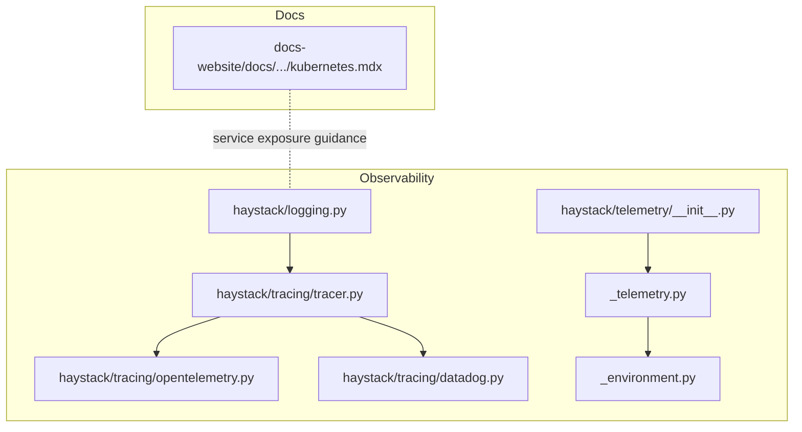
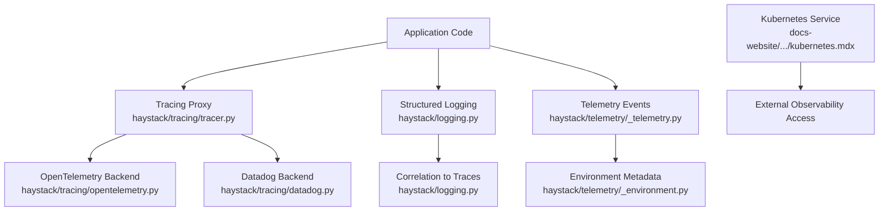
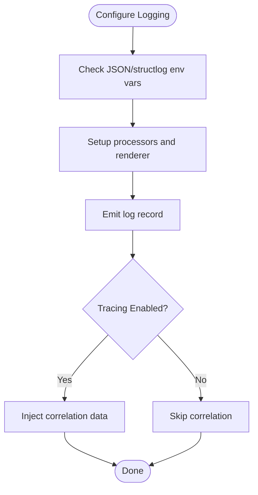
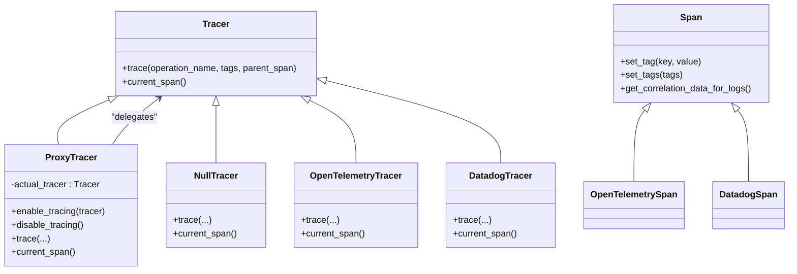
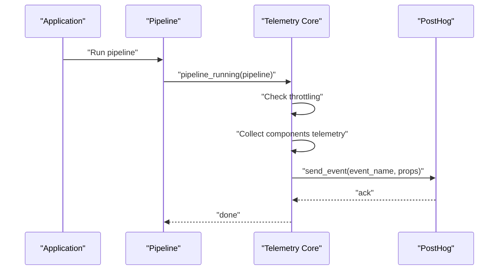
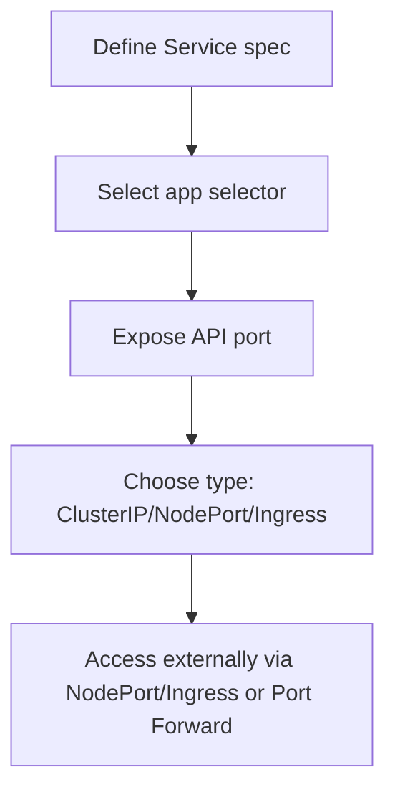
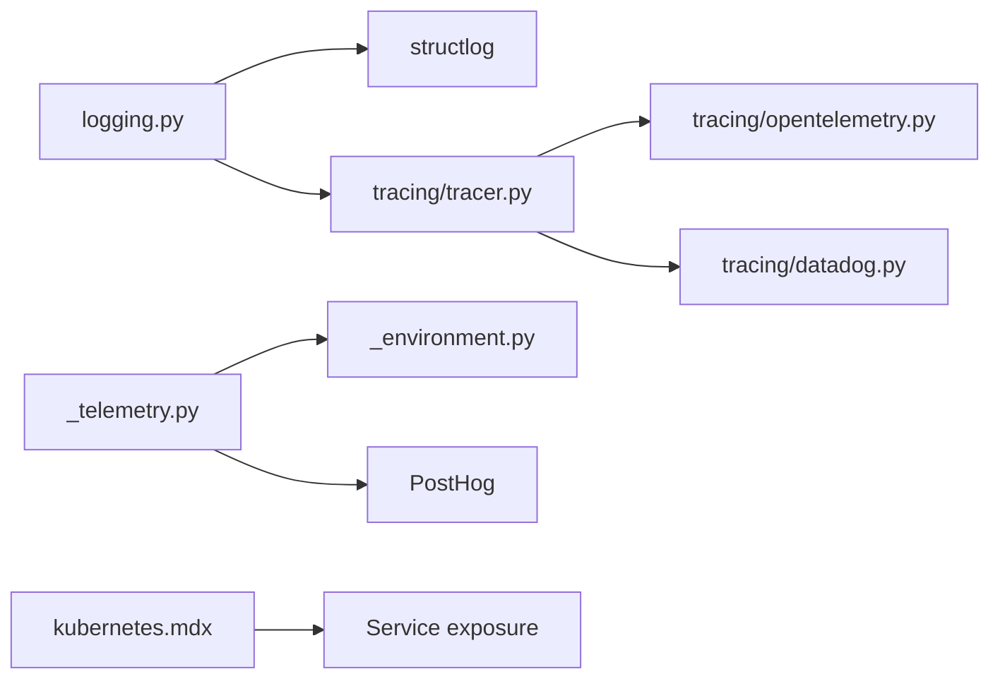

# Monitoring and Alerting

<cite>
**Referenced Files in This Document**
- [haystack/logging.py](file://haystack/logging.py)
- [haystack/tracing/__init__.py](file://haystack/tracing/__init__.py)
- [haystack/tracing/tracer.py](file://haystack/tracing/tracer.py)
- [haystack/tracing/opentelemetry.py](file://haystack/tracing/opentelemetry.py)
- [haystack/tracing/datadog.py](file://haystack/tracing/datadog.py)
- [haystack/telemetry/__init__.py](file://haystack/telemetry/__init__.py)
- [haystack/telemetry/_telemetry.py](file://haystack/telemetry/_telemetry.py)
- [haystack/telemetry/_environment.py](file://haystack/telemetry/_environment.py)
- [docs-website/docs/development/deployment/kubernetes.mdx](file://docs-website/docs/development/deployment/kubernetes.mdx)
- [test/test_telemetry.py](file://test/test_telemetry.py)
</cite>

## Table of Contents
1. [Introduction](#introduction)
2. [Project Structure](#project-structure)
3. [Core Components](#core-components)
4. [Architecture Overview](#architecture-overview)
5. [Detailed Component Analysis](#detailed-component-analysis)
6. [Dependency Analysis](#dependency-analysis)
7. [Performance Considerations](#performance-considerations)
8. [Troubleshooting Guide](#troubleshooting-guide)
9. [Conclusion](#conclusion)
10. [Appendices](#appendices)

## Introduction
This document provides a comprehensive guide to implementing monitoring and alerting for Haystack production environments. It covers observability stack setup for metrics, logs, and distributed tracing; key performance indicators for LLM applications; alerting strategies; dashboard creation; health checks and service discovery; correlation between application metrics and infrastructure; proactive monitoring for resource exhaustion and capacity planning; monitoring as code and automated remediation; and SLO/SLI definitions tailored for AI applications.

## Project Structure
The observability-related capabilities in this repository are primarily implemented in:
- Logging and structured logging with correlation to traces
- Distributed tracing abstraction with OpenTelemetry and Datadog backends
- Telemetry for usage analytics and pipeline run insights
- Deployment guidance for exposing services in Kubernetes

**Diagram sources**
- [haystack/logging.py](file://haystack/logging.py#L298-L404)
- [haystack/tracing/tracer.py](file://haystack/tracing/tracer.py#L111-L244)
- [haystack/tracing/opentelemetry.py](file://haystack/tracing/opentelemetry.py#L46-L73)
- [haystack/tracing/datadog.py](file://haystack/tracing/datadog.py#L54-L96)
- [haystack/telemetry/__init__.py](file://haystack/telemetry/__init__.py#L7-L8)
- [haystack/telemetry/_telemetry.py](file://haystack/telemetry/_telemetry.py#L34-L192)
- [haystack/telemetry/_environment.py](file://haystack/telemetry/_environment.py#L71-L99)
- [docs-website/docs/development/deployment/kubernetes.mdx](file://docs-website/docs/development/deployment/kubernetes.mdx#L40-L72)

**Section sources**
- [haystack/logging.py](file://haystack/logging.py#L298-L404)
- [haystack/tracing/tracer.py](file://haystack/tracing/tracer.py#L111-L244)
- [haystack/tracing/opentelemetry.py](file://haystack/tracing/opentelemetry.py#L46-L73)
- [haystack/tracing/datadog.py](file://haystack/tracing/datadog.py#L54-L96)
- [haystack/telemetry/__init__.py](file://haystack/telemetry/__init__.py#L7-L8)
- [haystack/telemetry/_telemetry.py](file://haystack/telemetry/_telemetry.py#L34-L192)
- [haystack/telemetry/_environment.py](file://haystack/telemetry/_environment.py#L71-L99)
- [docs-website/docs/development/deployment/kubernetes.mdx](file://docs-website/docs/development/deployment/kubernetes.mdx#L40-L72)

## Core Components
- Structured logging and log-to-trace correlation
- Distributed tracing abstraction with auto-backend selection
- Telemetry for pipeline runs and environment metadata
- Kubernetes service exposure guidance for observability endpoints

Key capabilities:
- Structured logging with optional JSON formatting and correlation fields for log-to-trace linkage
- Tracing proxy enabling dynamic enable/disable and auto-configuration for OpenTelemetry or Datadog
- Telemetry events for pipeline runs with throttling and environment metadata
- Kubernetes Service definition guidance for exposing APIs and enabling external observability access

**Section sources**
- [haystack/logging.py](file://haystack/logging.py#L298-L404)
- [haystack/tracing/tracer.py](file://haystack/tracing/tracer.py#L111-L244)
- [haystack/tracing/opentelemetry.py](file://haystack/tracing/opentelemetry.py#L46-L73)
- [haystack/tracing/datadog.py](file://haystack/tracing/datadog.py#L54-L96)
- [haystack/telemetry/_telemetry.py](file://haystack/telemetry/_telemetry.py#L99-L192)
- [docs-website/docs/development/deployment/kubernetes.mdx](file://docs-website/docs/development/deployment/kubernetes.mdx#L40-L72)

## Architecture Overview
The observability architecture integrates logging, tracing, and telemetry to provide end-to-end visibility into Haystack pipelines and services.

**Diagram sources**
- [haystack/tracing/tracer.py](file://haystack/tracing/tracer.py#L111-L244)
- [haystack/tracing/opentelemetry.py](file://haystack/tracing/opentelemetry.py#L46-L73)
- [haystack/tracing/datadog.py](file://haystack/tracing/datadog.py#L54-L96)
- [haystack/logging.py](file://haystack/logging.py#L280-L296)
- [haystack/telemetry/_telemetry.py](file://haystack/telemetry/_telemetry.py#L99-L192)
- [haystack/telemetry/_environment.py](file://haystack/telemetry/_environment.py#L71-L99)
- [docs-website/docs/development/deployment/kubernetes.mdx](file://docs-website/docs/development/deployment/kubernetes.mdx#L40-L72)

## Detailed Component Analysis

### Structured Logging and Log-to-Trace Correlation
- Enables structured logging with optional JSON formatting
- Adds correlation fields to logs when tracing is enabled
- Integrates with structlog and supports environment-driven configuration

Implementation highlights:
- Environment variables control JSON formatting and structlog usage
- Correlation processor injects trace identifiers into log records
- Safe record formatting with keyword-only arguments enforcement

**Diagram sources**
- [haystack/logging.py](file://haystack/logging.py#L298-L404)
- [haystack/logging.py](file://haystack/logging.py#L280-L296)

**Section sources**
- [haystack/logging.py](file://haystack/logging.py#L298-L404)
- [haystack/logging.py](file://haystack/logging.py#L280-L296)

### Distributed Tracing Abstraction
- Tracer interface defines spans and tracing contexts
- Proxy tracer allows dynamic enable/disable without global monkey-patching
- Auto-enable logic detects OpenTelemetry or Datadog availability
- Backends coerce tag values and provide correlation data for logs

**Diagram sources**
- [haystack/tracing/tracer.py](file://haystack/tracing/tracer.py#L82-L182)
- [haystack/tracing/opentelemetry.py](file://haystack/tracing/opentelemetry.py#L46-L73)
- [haystack/tracing/datadog.py](file://haystack/tracing/datadog.py#L54-L96)

**Section sources**
- [haystack/tracing/tracer.py](file://haystack/tracing/tracer.py#L111-L244)
- [haystack/tracing/opentelemetry.py](file://haystack/tracing/opentelemetry.py#L46-L73)
- [haystack/tracing/datadog.py](file://haystack/tracing/datadog.py#L54-L96)

### Telemetry for Pipeline Runs
- Throttled telemetry events for pipeline runs
- Aggregates component-level telemetry data
- Environment metadata collection for system profiling

**Diagram sources**
- [haystack/telemetry/_telemetry.py](file://haystack/telemetry/_telemetry.py#L137-L177)
- [haystack/telemetry/_telemetry.py](file://haystack/telemetry/_telemetry.py#L99-L114)

**Section sources**
- [haystack/telemetry/_telemetry.py](file://haystack/telemetry/_telemetry.py#L99-L192)
- [test/test_telemetry.py](file://test/test_telemetry.py#L42-L116)

### Kubernetes Service Exposure for Observability
- Example Service definition exposes the API port commonly used by Haystack deployments
- Guidance for internal vs external exposure and port forwarding

**Diagram sources**
- [docs-website/docs/development/deployment/kubernetes.mdx](file://docs-website/docs/development/deployment/kubernetes.mdx#L40-L72)

**Section sources**
- [docs-website/docs/development/deployment/kubernetes.mdx](file://docs-website/docs/development/deployment/kubernetes.mdx#L40-L72)

## Dependency Analysis
- Logging depends on structlog when available and integrates with tracing for correlation
- Tracing backends are lazily imported and auto-detected; OpenTelemetry and Datadog are supported
- Telemetry depends on environment metadata collection and PostHog for event delivery
- Kubernetes deployment guidance complements observability by exposing services

**Diagram sources**
- [haystack/logging.py](file://haystack/logging.py#L312-L388)
- [haystack/tracing/tracer.py](file://haystack/tracing/tracer.py#L206-L240)
- [haystack/telemetry/_telemetry.py](file://haystack/telemetry/_telemetry.py#L54-L62)
- [docs-website/docs/development/deployment/kubernetes.mdx](file://docs-website/docs/development/deployment/kubernetes.mdx#L40-L72)

**Section sources**
- [haystack/logging.py](file://haystack/logging.py#L312-L388)
- [haystack/tracing/tracer.py](file://haystack/tracing/tracer.py#L206-L240)
- [haystack/telemetry/_telemetry.py](file://haystack/telemetry/_telemetry.py#L54-L62)
- [docs-website/docs/development/deployment/kubernetes.mdx](file://docs-website/docs/development/deployment/kubernetes.mdx#L40-L72)

## Performance Considerations
- Telemetry throttling prevents excessive event volume during frequent pipeline runs
- Structured logging with JSON rendering is recommended for production log aggregation
- Tracing backends coerce tag values to strings; avoid large or sensitive payloads in tags
- Environment metadata collection is performed once per process to minimize overhead

[No sources needed since this section provides general guidance]

## Troubleshooting Guide
Common issues and resolutions:
- Telemetry disabled or throttled: Verify environment variable controlling telemetry and ensure sufficient time between events
- Tracing not active: Confirm auto-enable behavior and that OpenTelemetry or Datadog is installed and configured
- Logs lack correlation: Ensure tracing is enabled and correlation processor is active
- Service not reachable externally: Review Kubernetes Service type and port mappings

**Section sources**
- [haystack/telemetry/_telemetry.py](file://haystack/telemetry/_telemetry.py#L190-L192)
- [haystack/tracing/tracer.py](file://haystack/tracing/tracer.py#L184-L204)
- [haystack/logging.py](file://haystack/logging.py#L280-L296)
- [docs-website/docs/development/deployment/kubernetes.mdx](file://docs-website/docs/development/deployment/kubernetes.mdx#L40-L72)

## Conclusion
The Haystack observability stack integrates structured logging, distributed tracing, and telemetry to deliver production-grade monitoring. Combined with Kubernetes service exposure guidance, operators can build comprehensive dashboards, implement robust alerting, and maintain resilient AI applications.

[No sources needed since this section summarizes without analyzing specific files]

## Appendices

### Observability Stack Setup Checklist
- Enable structured logging with JSON formatting for centralized log aggregation
- Configure tracing backends (OpenTelemetry or Datadog) and verify auto-enable behavior
- Integrate log-to-trace correlation for unified observability
- Expose API via Kubernetes Service and ingress for external observability access
- Define telemetry events for pipeline runs and environment metadata

**Section sources**
- [haystack/logging.py](file://haystack/logging.py#L298-L404)
- [haystack/tracing/tracer.py](file://haystack/tracing/tracer.py#L184-L204)
- [docs-website/docs/development/deployment/kubernetes.mdx](file://docs-website/docs/development/deployment/kubernetes.mdx#L40-L72)

### Key Performance Indicators for LLM Applications
- Latency: p50/p90/p99 request duration, component-wise breakdown
- Throughput: requests per second, tokens per second
- Error rates: HTTP error codes, exceptions, retries
- Resource utilization: CPU, memory, GPU, disk I/O
- Queue depth and wait times for async pipelines
- Embedding and generation model-specific metrics (time per token, batch sizes)

[No sources needed since this section provides general guidance]

### Alerting Strategies
- Critical system events: service unavailability, authentication failures
- Performance degradation: latency SLO breaches, saturation thresholds
- Security incidents: unauthorized access attempts, anomaly detection
- Capacity planning: resource exhaustion, queue backlog growth

[No sources needed since this section provides general guidance]

### Dashboard Creation Guidance
- Grafana: visualize latency, throughput, error rates, and resource utilization
- Kibana: explore logs, trace correlation, and error patterns
- Dashboards should link logs, traces, and metrics for end-to-end context

[No sources needed since this section provides general guidance]

### Health Checks and Service Discovery
- Expose health endpoints alongside API ports
- Integrate with Kubernetes readiness/liveness probes
- Service discovery via Kubernetes Service DNS or external registries

**Section sources**
- [docs-website/docs/development/deployment/kubernetes.mdx](file://docs-website/docs/development/deployment/kubernetes.mdx#L40-L72)

### Monitoring as Code and Automated Remediation
- Define dashboards and alerts declaratively
- Use policy-as-code for compliance and SLO adherence
- Automate remediation via runbooks or operator actions triggered by alerts

[No sources needed since this section provides general guidance]

### SLO/SLI Definitions for AI Applications
- SLIs: successful requests, mean latency, recall/precision, hallucination rate
- SLOs: target latency, error budget allocation, availability targets
- Error budgets: derive from SLOs to balance reliability and feature velocity

[No sources needed since this section provides general guidance]