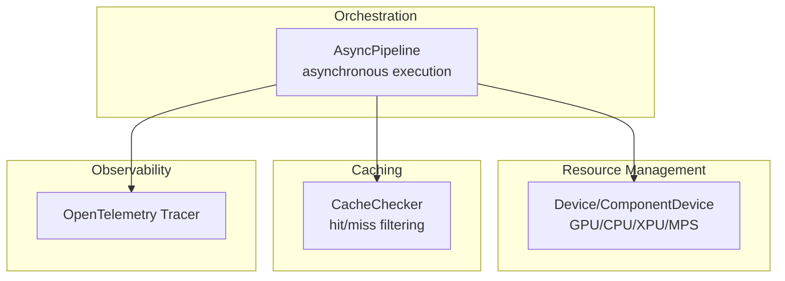
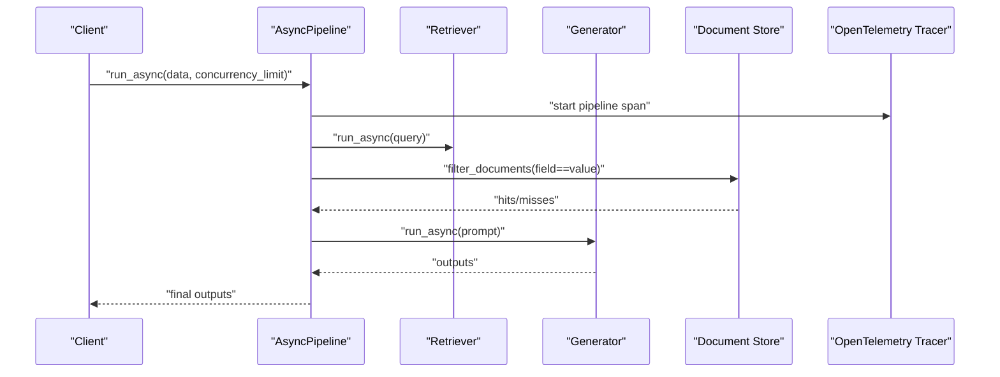
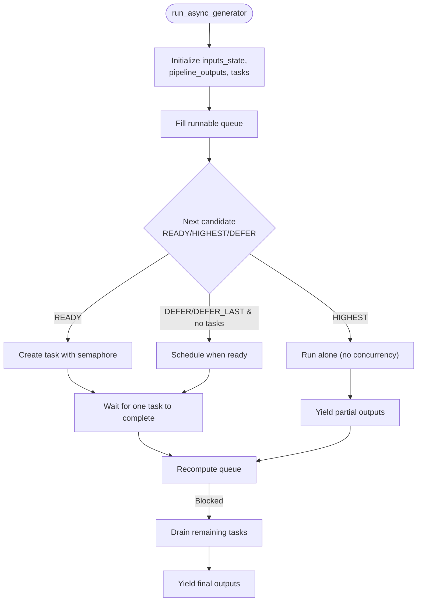
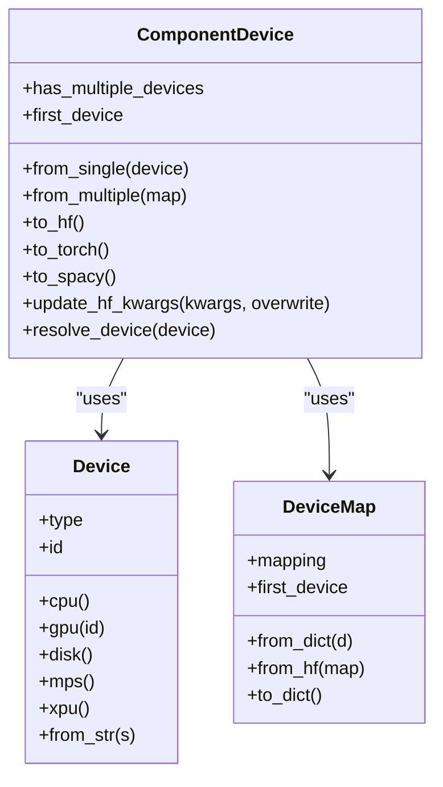
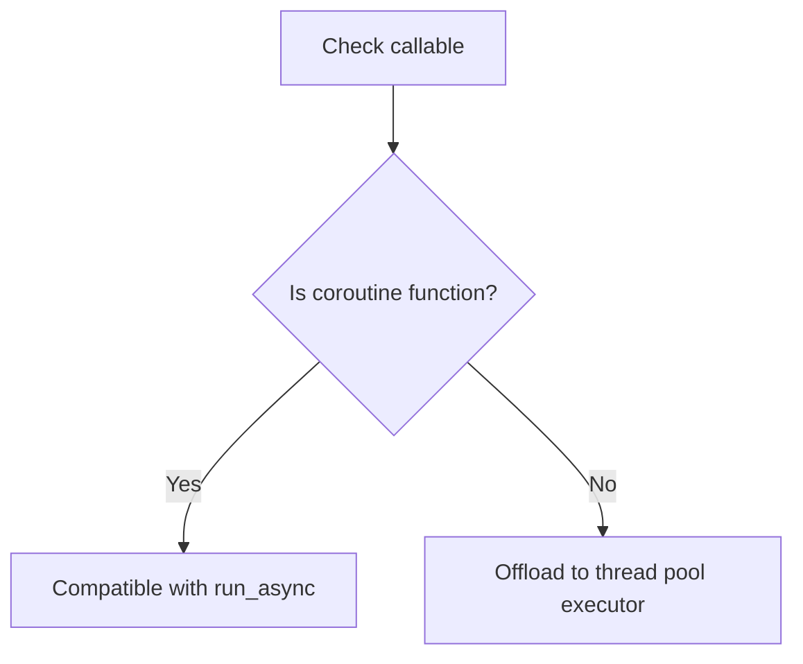
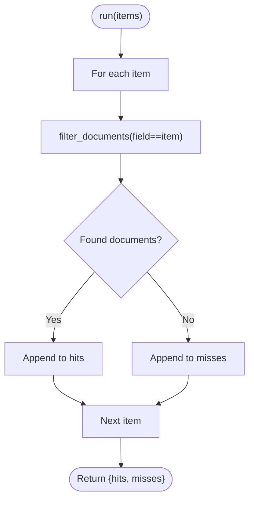
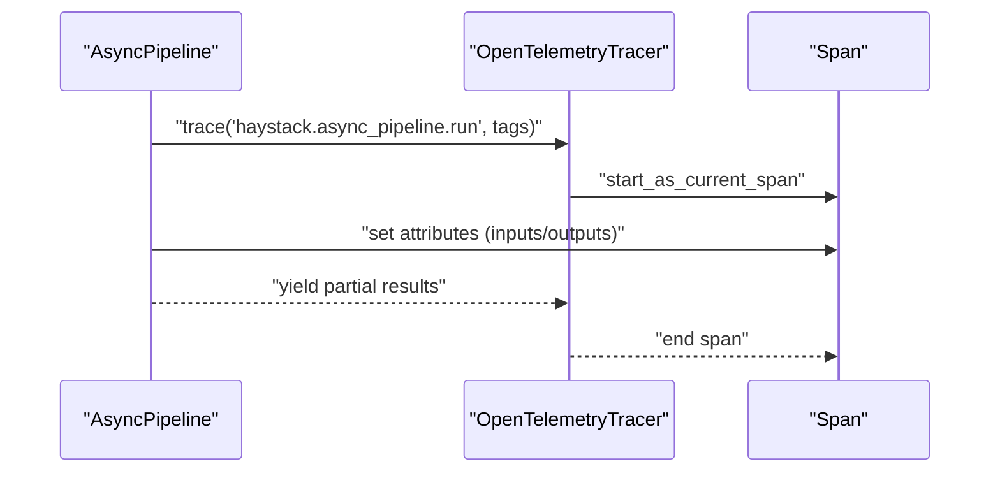
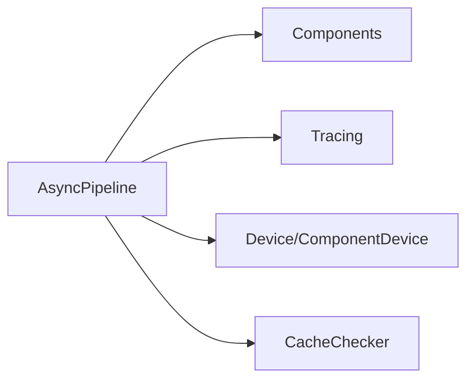

# Scaling Strategies

<cite>
**Referenced Files in This Document**
- [async_pipeline.py](file://haystack/core/pipeline/async_pipeline.py)
- [device.py](file://haystack/utils/device.py)
- [asynchronous.py](file://haystack/utils/asynchronous.py)
- [cache_checker.py](file://haystack/components/caching/cache_checker.py)
- [opentelemetry.py](file://haystack/tracing/opentelemetry.py)
- [ci_metrics.yml](file://.github/workflows/ci_metrics.yml)
- [pipeline_api.md](file://docs-website/reference_versioned_docs/version-2.23/haystack-api/pipeline_api.md)
</cite>

## Table of Contents
1. [Introduction](#introduction)
2. [Project Structure](#project-structure)
3. [Core Components](#core-components)
4. [Architecture Overview](#architecture-overview)
5. [Detailed Component Analysis](#detailed-component-analysis)
6. [Dependency Analysis](#dependency-analysis)
7. [Performance Considerations](#performance-considerations)
8. [Troubleshooting Guide](#troubleshooting-guide)
9. [Conclusion](#conclusion)
10. [Appendices](#appendices)

## Introduction
This document provides practical, code-informed scaling strategies for Haystack applications handling high-throughput LLM workloads. It covers horizontal and vertical scaling, asynchronous pipeline execution, caching, database/document store scaling, microservice decomposition, connection pooling, resource limits, performance bottlenecks, monitoring and alerting, and load testing/capacity planning methodologies. The guidance is grounded in Haystack’s asynchronous pipeline engine, device and resource management utilities, caching components, and observability integrations.

## Project Structure
Haystack organizes scaling-relevant capabilities across several modules:
- Asynchronous orchestration: AsyncPipeline engine for concurrent component execution
- Resource and device management: Device and ComponentDevice abstractions for GPU/CPU/XPU/MPS selection and mapping
- Caching: CacheChecker component for hit/miss checks against a Document Store
- Observability: OpenTelemetry tracer integration for distributed tracing
- Documentation/API: Versioned API references for AsyncPipeline features

**Diagram sources**
- [async_pipeline.py](file://haystack/core/pipeline/async_pipeline.py#L27-L102)
- [device.py](file://haystack/utils/device.py#L19-L138)
- [cache_checker.py](file://haystack/components/caching/cache_checker.py#L11-L97)
- [opentelemetry.py](file://haystack/tracing/opentelemetry.py#L46-L73)

**Section sources**
- [async_pipeline.py](file://haystack/core/pipeline/async_pipeline.py#L27-L102)
- [device.py](file://haystack/utils/device.py#L19-L138)
- [cache_checker.py](file://haystack/components/caching/cache_checker.py#L11-L97)
- [opentelemetry.py](file://haystack/tracing/opentelemetry.py#L46-L73)

## Core Components
- AsyncPipeline: Enables asynchronous, concurrent execution of pipeline components with a concurrency limit and partial output yields. It integrates tracing and robust error propagation.
- Device and ComponentDevice: Provide device selection and mapping for components, supporting single-device and multi-device (including offload to disk) configurations.
- CacheChecker: Filters incoming items against a Document Store using a metadata field to detect cache hits and return misses for further processing.
- OpenTelemetry Tracer: Integrates with OpenTelemetry for distributed tracing and correlation data.

Key scaling levers:
- Concurrency control via AsyncPipeline concurrency_limit
- Device placement/mapping for GPU-bound components
- Early cache filtering to reduce compute load
- Distributed tracing for bottleneck identification

**Section sources**
- [async_pipeline.py](file://haystack/core/pipeline/async_pipeline.py#L103-L196)
- [device.py](file://haystack/utils/device.py#L246-L454)
- [cache_checker.py](file://haystack/components/caching/cache_checker.py#L74-L97)
- [opentelemetry.py](file://haystack/tracing/opentelemetry.py#L46-L73)

## Architecture Overview
High-throughput LLM systems benefit from combining asynchronous pipelines, device-aware component placement, and caching. The AsyncPipeline schedules ready components with a concurrency semaphore, while Device/ComponentDevice ensures optimal GPU/CPU/XPU allocation. CacheChecker reduces redundant computation by pre-filtering inputs against a Document Store. OpenTelemetry tracing captures latency and hotspots across components.

**Diagram sources**
- [async_pipeline.py](file://haystack/core/pipeline/async_pipeline.py#L472-L587)
- [cache_checker.py](file://haystack/components/caching/cache_checker.py#L74-L97)
- [opentelemetry.py](file://haystack/tracing/opentelemetry.py#L51-L64)

## Detailed Component Analysis

### Asynchronous Pipeline Execution
AsyncPipeline orchestrates concurrent component execution with:
- A concurrency semaphore limiting in-flight tasks
- Priority-based scheduling and tie-breaking
- Partial output yields via an async generator
- Error propagation and telemetry hooks

**Diagram sources**
- [async_pipeline.py](file://haystack/core/pipeline/async_pipeline.py#L103-L471)

Operational guidance:
- Tune concurrency_limit based on GPU memory headroom and component latency profiles
- Use run_async_generator to stream partial results and reduce perceived latency
- Prefer run_async for non-blocking integration into async event loops

**Section sources**
- [async_pipeline.py](file://haystack/core/pipeline/async_pipeline.py#L103-L196)
- [async_pipeline.py](file://haystack/core/pipeline/async_pipeline.py#L472-L587)
- [pipeline_api.md](file://docs-website/reference_versioned_docs/version-2.23/haystack-api/pipeline_api.md#L421-L487)

### Device and Resource Placement
Device and ComponentDevice enable:
- Automatic default device detection (GPU > XPU > MPS > CPU)
- Single-device and multi-device (device map) configurations
- Conversion to framework-specific formats (PyTorch, HuggingFace)
- Disk offload for weight offloading scenarios

**Diagram sources**
- [device.py](file://haystack/utils/device.py#L53-L138)
- [device.py](file://haystack/utils/device.py#L152-L244)
- [device.py](file://haystack/utils/device.py#L246-L454)

Vertical scaling considerations:
- Prefer GPU for compute-heavy components (LLMs, embedders)
- Use multi-device mapping for models exceeding single-GPU memory
- Enable disk offload for weight offloading when memory-constrained
- Validate device availability and environment variables for MPS/XPU

**Section sources**
- [device.py](file://haystack/utils/device.py#L19-L138)
- [device.py](file://haystack/utils/device.py#L246-L454)

### Asynchronous Compatibility Utilities
Asynchronous compatibility checks ensure components can be safely awaited or offloaded to executors.

**Diagram sources**
- [asynchronous.py](file://haystack/utils/asynchronous.py#L9-L19)

**Section sources**
- [asynchronous.py](file://haystack/utils/asynchronous.py#L9-L19)

### Caching Strategy with CacheChecker
CacheChecker filters items against a Document Store using a metadata field, returning hits and misses. This reduces redundant retrievals and generation calls.

**Diagram sources**
- [cache_checker.py](file://haystack/components/caching/cache_checker.py#L74-L97)

Implementation tips:
- Choose a stable cache_field (e.g., URL, document ID) to maximize hit rates
- Combine CacheChecker upstream of retrievers/embedders to avoid repeated compute
- Periodically refresh cache entries to balance freshness and cost

**Section sources**
- [cache_checker.py](file://haystack/components/caching/cache_checker.py#L11-L97)

### Observability and Tracing
OpenTelemetry integration records spans and correlation data for distributed tracing, enabling latency breakdowns and bottleneck detection.

**Diagram sources**
- [opentelemetry.py](file://haystack/tracing/opentelemetry.py#L51-L64)
- [opentelemetry.py](file://haystack/tracing/opentelemetry.py#L46-L73)

**Section sources**
- [opentelemetry.py](file://haystack/tracing/opentelemetry.py#L18-L73)

## Dependency Analysis
The AsyncPipeline depends on:
- Component interfaces for run/run_async
- Tracing utilities for telemetry
- Device utilities for resource selection
- Caching components for early filtering

**Diagram sources**
- [async_pipeline.py](file://haystack/core/pipeline/async_pipeline.py#L10-L24)
- [device.py](file://haystack/utils/device.py#L19-L138)
- [cache_checker.py](file://haystack/components/caching/cache_checker.py#L11-L97)
- [opentelemetry.py](file://haystack/tracing/opentelemetry.py#L46-L73)

**Section sources**
- [async_pipeline.py](file://haystack/core/pipeline/async_pipeline.py#L10-L24)
- [device.py](file://haystack/utils/device.py#L19-L138)
- [cache_checker.py](file://haystack/components/caching/cache_checker.py#L11-L97)
- [opentelemetry.py](file://haystack/tracing/opentelemetry.py#L46-L73)

## Performance Considerations
- Concurrency tuning: Adjust AsyncPipeline concurrency_limit to match GPU memory and component latency; monitor queue depth and task completion rates.
- Device placement: Use ComponentDevice to target GPUs and leverage multi-device mapping for larger models; fallback to CPU/XPU/MPS when unavailable.
- Caching: Apply CacheChecker upstream of expensive components to minimize repeated retrievals and generation.
- I/O and serialization: Minimize deep copies and ensure components return Mapping outputs to avoid overhead.
- Tracing overhead: Keep tracing enabled in production for visibility; ensure sampling aligns with traffic volume.

[No sources needed since this section provides general guidance]

## Troubleshooting Guide
Common issues and remedies:
- Calling run() from an async context: Use run_async or run_async_generator instead.
- Components not returning Mapping outputs: Ensure components return Mapping to prevent runtime errors.
- Pipeline appears blocked: Investigate missing inputs or unsupported connections; check warnings emitted by the scheduler.
- Device resolution failures: Verify CUDA/XPU/MPS availability and environment flags; confirm default device precedence.

**Section sources**
- [async_pipeline.py](file://haystack/core/pipeline/async_pipeline.py#L698-L713)
- [async_pipeline.py](file://haystack/core/pipeline/async_pipeline.py#L95-L96)
- [async_pipeline.py](file://haystack/core/pipeline/async_pipeline.py#L397-L411)
- [device.py](file://haystack/utils/device.py#L486-L523)

## Conclusion
Scaling Haystack for high-throughput LLM workloads hinges on asynchronous orchestration, intelligent device placement, strategic caching, and observability. Combine AsyncPipeline’s concurrency controls with Device/ComponentDevice mapping, integrate CacheChecker for early filtering, and rely on OpenTelemetry tracing for continuous performance insights. These practices enable efficient resource utilization, predictable latency, and robust operational scaling.

[No sources needed since this section summarizes without analyzing specific files]

## Appendices

### Monitoring and Alerting
- CI metrics collection: Use GitHub Actions to export job metrics to Datadog for baseline performance tracking.
- Tracing: Capture pipeline spans and component-level traces to identify hotspots and tail latencies.
- Thresholds: Define alerts for queue depth, task backlog, error rates, and latency percentiles; adjust concurrency and autoscaling triggers accordingly.

**Section sources**
- [ci_metrics.yml](file://.github/workflows/ci_metrics.yml#L1-L23)
- [opentelemetry.py](file://haystack/tracing/opentelemetry.py#L46-L73)

### Load Testing and Capacity Planning
- Methodology:
  - Establish steady-state and burst load profiles
  - Measure latency percentiles under varying concurrency_limit and device allocations
  - Validate cache hit ratios and their impact on throughput
  - Simulate failure modes (blocked pipelines, device unavailability)
- Practical steps:
  - Start with AsyncPipeline.run_async_generator to stream partial results and measure latency
  - Gradually increase concurrency_limit until saturation; record queue depth and error rates
  - Test device switching (GPU vs CPU vs XPU/MPS) to find optimal balance
  - Integrate CacheChecker upstream and measure hit rate improvements

[No sources needed since this section provides general guidance]