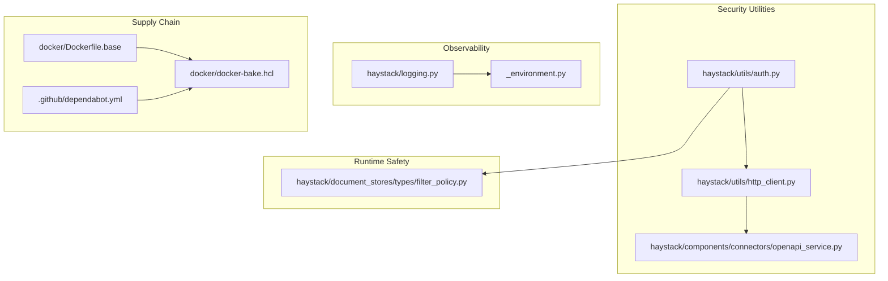
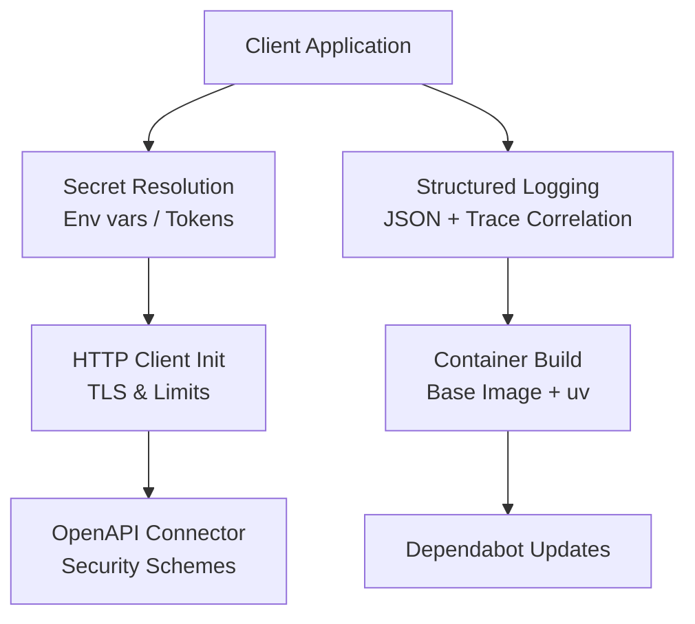
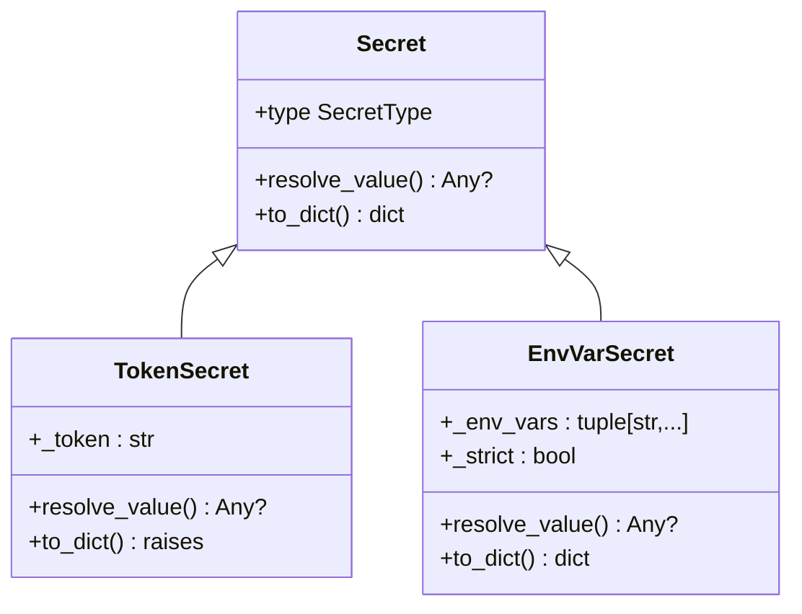
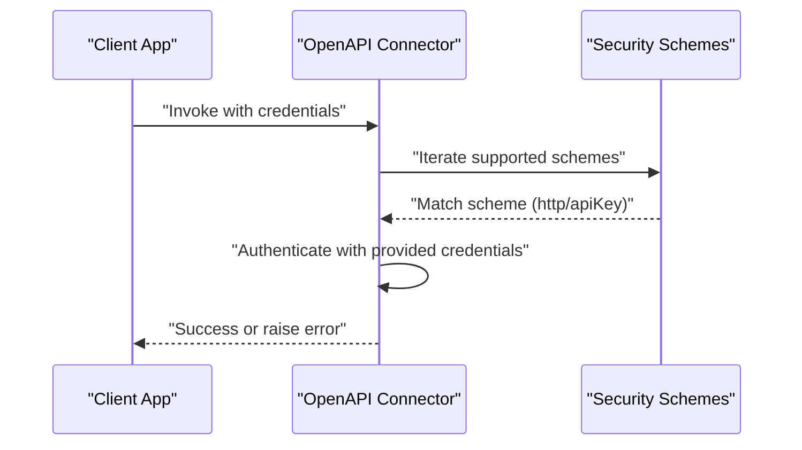
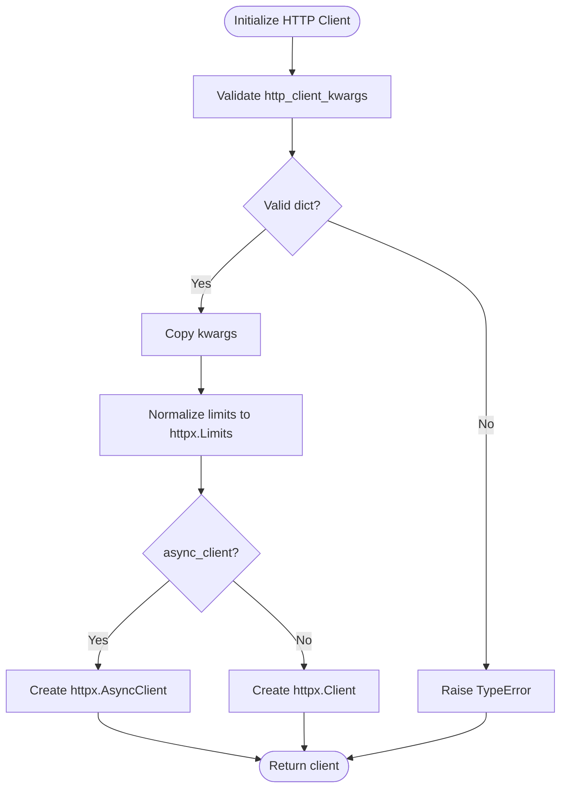
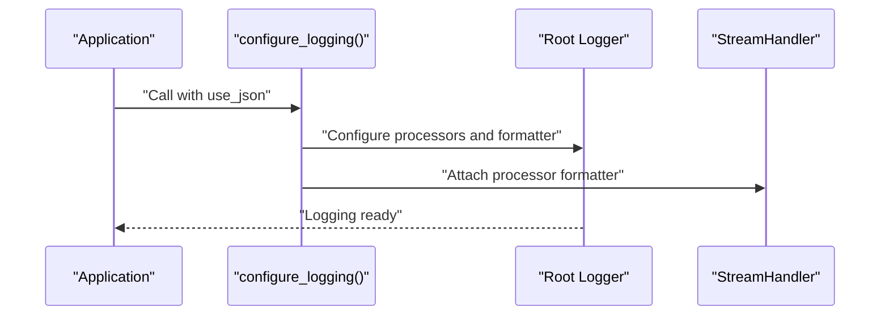
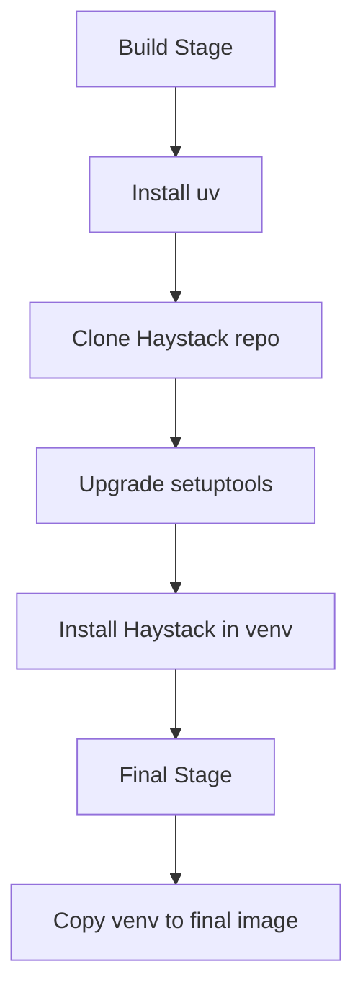
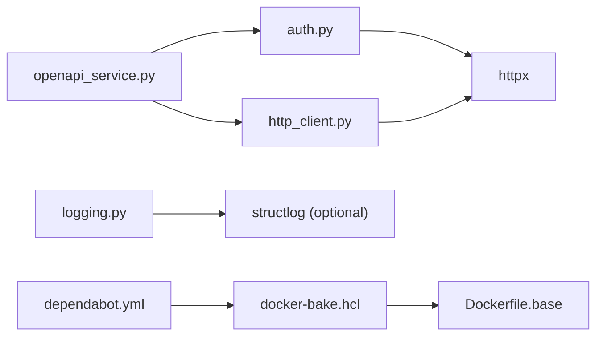

# Security and Compliance

<cite>
**Referenced Files in This Document**
- [SECURITY.md](file://SECURITY.md)
- [auth.py](file://haystack/utils/auth.py)
- [http_client.py](file://haystack/utils/http_client.py)
- [openapi_service.py](file://haystack/components/connectors/openapi_service.py)
- [logging.py](file://haystack/logging.py)
- [Dockerfile.base](file://docker/Dockerfile.base)
- [docker-bake.hcl](file://docker/docker-bake.hcl)
- [dependabot.yml](file://.github/dependabot.yml)
- [_environment.py](file://haystack/telemetry/_environment.py)
- [filter_policy.py](file://haystack/document_stores/types/filter_policy.py)
</cite>

## Table of Contents
1. [Introduction](#introduction)
2. [Project Structure](#project-structure)
3. [Core Components](#core-components)
4. [Architecture Overview](#architecture-overview)
5. [Detailed Component Analysis](#detailed-component-analysis)
6. [Dependency Analysis](#dependency-analysis)
7. [Performance Considerations](#performance-considerations)
8. [Troubleshooting Guide](#troubleshooting-guide)
9. [Conclusion](#conclusion)
10. [Appendices](#appendices)

## Introduction
This document provides a comprehensive guide to securing Haystack production deployments. It covers network security, authentication and authorization, encryption in transit and at rest, access control, monitoring and auditing, compliance considerations, vulnerability management, supply chain security, and incident response. The content is grounded in the repository’s security-related code and configuration files.

## Project Structure
Security-relevant areas in the repository include:
- Authentication utilities for API keys and tokens
- HTTP client initialization and TLS behavior
- OpenAPI connector authentication handling
- Structured logging and observability hooks
- Container image build and tagging
- Dependabot configuration for GitHub Actions updates
- Telemetry helpers that detect containerized environments
- Filter policy warnings for runtime safety

**Diagram sources**
- [auth.py](file://haystack/utils/auth.py#L1-L231)
- [http_client.py](file://haystack/utils/http_client.py#L1-L56)
- [openapi_service.py](file://haystack/components/connectors/openapi_service.py#L304-L326)
- [logging.py](file://haystack/logging.py#L1-L404)
- [_environment.py](file://haystack/telemetry/_environment.py#L46-L82)
- [Dockerfile.base](file://docker/Dockerfile.base#L1-L33)
- [docker-bake.hcl](file://docker/docker-bake.hcl#L1-L41)
- [dependabot.yml](file://.github/dependabot.yml#L1-L7)
- [filter_policy.py](file://haystack/document_stores/types/filter_policy.py#L106-L134)

**Section sources**
- [auth.py](file://haystack/utils/auth.py#L1-L231)
- [http_client.py](file://haystack/utils/http_client.py#L1-L56)
- [openapi_service.py](file://haystack/components/connectors/openapi_service.py#L304-L326)
- [logging.py](file://haystack/logging.py#L1-L404)
- [_environment.py](file://haystack/telemetry/_environment.py#L46-L82)
- [Dockerfile.base](file://docker/Dockerfile.base#L1-L33)
- [docker-bake.hcl](file://docker/docker-bake.hcl#L1-L41)
- [dependabot.yml](file://.github/dependabot.yml#L1-L7)
- [filter_policy.py](file://haystack/document_stores/types/filter_policy.py#L106-L134)

## Core Components
- Authentication utilities: Provide secret abstractions for API keys and tokens, with environment-variable-backed resolution and strictness controls.
- HTTP client: Initializes httpx clients with configurable limits and TLS behavior.
- OpenAPI connector: Supports HTTP and apiKey security schemes and integrates with credential providers.
- Logging and observability: Structured logging with JSON formatting, correlation with traces, and environment detection.
- Supply chain: Base image build with pinned Python version, uv installer, and Docker bake targets.
- Runtime safety: Filter policy warnings for operator mismatches and combined filters.

**Section sources**
- [auth.py](file://haystack/utils/auth.py#L1-L231)
- [http_client.py](file://haystack/utils/http_client.py#L1-L56)
- [openapi_service.py](file://haystack/components/connectors/openapi_service.py#L304-L326)
- [logging.py](file://haystack/logging.py#L298-L404)
- [Dockerfile.base](file://docker/Dockerfile.base#L1-L33)
- [docker-bake.hcl](file://docker/docker-bake.hcl#L1-L41)
- [filter_policy.py](file://haystack/document_stores/types/filter_policy.py#L106-L134)

## Architecture Overview
The security architecture centers on:
- Secrets management via environment variables and token-based secrets
- Secure HTTP communications through httpx client configuration
- OpenAPI authentication integration
- Observability with structured logs and optional trace correlation
- Containerized builds with deterministic base images
- Automated dependency updates for CI

**Diagram sources**
- [auth.py](file://haystack/utils/auth.py#L57-L74)
- [http_client.py](file://haystack/utils/http_client.py#L26-L56)
- [openapi_service.py](file://haystack/components/connectors/openapi_service.py#L304-L326)
- [logging.py](file://haystack/logging.py#L298-L404)
- [Dockerfile.base](file://docker/Dockerfile.base#L1-L33)
- [dependabot.yml](file://.github/dependabot.yml#L1-L7)

## Detailed Component Analysis

### Authentication and Authorization
- Secret abstraction supports token-based and environment-variable-based secrets. Token secrets cannot be serialized and are resolved at runtime. Environment-variable secrets support multiple candidates and strict resolution modes.
- OpenAPI connector supports HTTP and apiKey security schemes and raises explicit errors when credentials are missing or invalid.

**Diagram sources**
- [auth.py](file://haystack/utils/auth.py#L34-L130)
- [auth.py](file://haystack/utils/auth.py#L132-L213)

**Diagram sources**
- [openapi_service.py](file://haystack/components/connectors/openapi_service.py#L304-L326)

**Section sources**
- [auth.py](file://haystack/utils/auth.py#L47-L130)
- [auth.py](file://haystack/utils/auth.py#L132-L213)
- [openapi_service.py](file://haystack/components/connectors/openapi_service.py#L304-L326)

### Network Security and Encryption in Transit
- HTTP client initialization supports TLS configuration and connection limits. The release note indicates support for disabling SSL verification and specifying a CA for OpenAPI calls, which should be used carefully and restricted to controlled environments.
- Recommendations:
  - Enforce TLS verification in production.
  - Pin trusted CAs and avoid disabling verification.
  - Use connection limits and timeouts to mitigate resource exhaustion.

**Diagram sources**
- [http_client.py](file://haystack/utils/http_client.py#L26-L56)

**Section sources**
- [http_client.py](file://haystack/utils/http_client.py#L1-L56)
- [openapi_service.py](file://haystack/components/connectors/openapi_service.py#L304-L326)

### Access Control Strategies
- Role-based permissions are not enforced by Haystack components; access control must be implemented at the application boundary (e.g., API gateways, reverse proxies, or service-level middleware).
- API key management:
  - Prefer environment-variable-backed secrets for dynamic resolution.
  - Avoid embedding tokens in code or configuration files.
  - Rotate keys regularly and revoke compromised ones.

**Section sources**
- [auth.py](file://haystack/utils/auth.py#L57-L74)

### Data Privacy and Compliance Considerations
- Input validation and sanitization are the responsibility of the consuming application. The security policy emphasizes that vulnerabilities requiring unsanitized input are out of scope.
- Production deployments should:
  - Sanitize and validate all user-supplied inputs before passing to Haystack.
  - Apply least-privilege access and audit logs for compliance.
  - Encrypt data at rest using platform-native capabilities and manage keys securely.

**Section sources**
- [SECURITY.md](file://SECURITY.md#L17-L23)
- [filter_policy.py](file://haystack/document_stores/types/filter_policy.py#L106-L134)

### Security Monitoring and Audit Logging
- Structured logging supports JSON output and optional correlation with tracing spans. Environment variables control JSON formatting and structlog behavior.
- Recommendations:
  - Enable JSON logging in production for centralized log processing.
  - Integrate with SIEM and alert on anomalies.
  - Include correlation IDs and timestamps for traceability.

**Diagram sources**
- [logging.py](file://haystack/logging.py#L298-L404)

**Section sources**
- [logging.py](file://haystack/logging.py#L298-L404)

### Supply Chain Security
- Base image build uses a pinned Python slim image and installs uv for fast dependency resolution. The build upgrades setuptools to address a known CVE.
- Docker bake defines multi-platform targets and stable tagging for releases.
- Dependabot automates updates for GitHub Actions workflows.

**Diagram sources**
- [Dockerfile.base](file://docker/Dockerfile.base#L1-L33)
- [docker-bake.hcl](file://docker/docker-bake.hcl#L28-L41)
- [dependabot.yml](file://.github/dependabot.yml#L1-L7)

**Section sources**
- [Dockerfile.base](file://docker/Dockerfile.base#L1-L33)
- [docker-bake.hcl](file://docker/docker-bake.hcl#L1-L41)
- [dependabot.yml](file://.github/dependabot.yml#L1-L7)

### Incident Response Procedures
- Establish a dedicated security contact channel and define a triage timeline.
- Document remediation steps and coordinate disclosures with stakeholders.
- Maintain a process to assess scope and impact, and communicate status updates.

**Section sources**
- [SECURITY.md](file://SECURITY.md#L3-L38)

## Dependency Analysis
- Authentication utilities depend on environment resolution and dataclass serialization.
- HTTP client depends on httpx and normalizes limits.
- OpenAPI connector depends on security schemes and credentials.
- Logging depends on structlog availability and environment variables.
- Container builds depend on Docker bake and base image tags.
- Dependabot updates GitHub Actions ecosystems.

**Diagram sources**
- [auth.py](file://haystack/utils/auth.py#L1-L231)
- [http_client.py](file://haystack/utils/http_client.py#L1-L56)
- [openapi_service.py](file://haystack/components/connectors/openapi_service.py#L304-L326)
- [logging.py](file://haystack/logging.py#L1-L404)
- [Dockerfile.base](file://docker/Dockerfile.base#L1-L33)
- [docker-bake.hcl](file://docker/docker-bake.hcl#L1-L41)
- [dependabot.yml](file://.github/dependabot.yml#L1-L7)

**Section sources**
- [auth.py](file://haystack/utils/auth.py#L1-L231)
- [http_client.py](file://haystack/utils/http_client.py#L1-L56)
- [openapi_service.py](file://haystack/components/connectors/openapi_service.py#L304-L326)
- [logging.py](file://haystack/logging.py#L1-L404)
- [Dockerfile.base](file://docker/Dockerfile.base#L1-L33)
- [docker-bake.hcl](file://docker/docker-bake.hcl#L1-L41)
- [dependabot.yml](file://.github/dependabot.yml#L1-L7)

## Performance Considerations
- Use connection pooling and limits to prevent resource exhaustion.
- Prefer environment-variable secrets to avoid repeated serialization/deserialization overhead.
- Enable JSON logging only when needed to reduce formatting costs.

## Troubleshooting Guide
- Authentication failures:
  - Verify environment variables are set and not empty.
  - Ensure strict mode is configured appropriately for your deployment.
- OpenAPI authentication errors:
  - Confirm credentials are provided and match supported schemes.
  - Review security scheme definitions in the OpenAPI spec.
- Logging issues:
  - Check environment variables controlling JSON and structlog behavior.
  - Validate trace correlation is enabled when using distributed tracing.
- Container build issues:
  - Confirm base image tag and platform targets align with deployment.
  - Ensure uv and setuptools are installed and upgraded as expected.

**Section sources**
- [auth.py](file://haystack/utils/auth.py#L197-L207)
- [openapi_service.py](file://haystack/components/connectors/openapi_service.py#L304-L326)
- [logging.py](file://haystack/logging.py#L298-L404)
- [Dockerfile.base](file://docker/Dockerfile.base#L24-L26)
- [docker-bake.hcl](file://docker/docker-bake.hcl#L28-L41)

## Conclusion
This guide consolidates repository-backed security practices for Haystack deployments. By leveraging environment-based secrets, secure HTTP clients, structured logging, and containerized builds with automated updates, teams can establish a robust security posture. Complement these with application-level access control, input validation, and comprehensive monitoring to meet production-grade requirements.

## Appendices

### Security Assessment Checklist
- Authentication
  - Are API keys stored in environment variables?
  - Is token-based secret usage avoided in serialized forms?
  - Are credentials validated and scoped per service?
- Authorization
  - Is access control enforced at the application boundary?
  - Are RBAC policies defined and audited?
- Encryption
  - Is TLS enabled and verified for all outbound connections?
  - Are secrets encrypted at rest using platform-native KMS?
- Network Security
  - Are firewall rules and VPC peering configured for minimal exposure?
  - Is VPN or bastion access required for administrative tasks?
- Observability
  - Is structured logging enabled with JSON output?
  - Are logs correlated with trace IDs?
- Supply Chain
  - Are base images pinned and rebuilt periodically?
  - Are dependency updates automated and monitored?
- Compliance
  - Are input validation and sanitization implemented?
  - Are audit logs retained per policy?

### Compliance Notes
- Data privacy and input validation responsibilities are delegated to the consuming application.
- Logging and observability enable audit trails suitable for compliance reporting.

**Section sources**
- [SECURITY.md](file://SECURITY.md#L17-L23)
- [logging.py](file://haystack/logging.py#L298-L404)
- [Dockerfile.base](file://docker/Dockerfile.base#L1-L33)
- [dependabot.yml](file://.github/dependabot.yml#L1-L7)