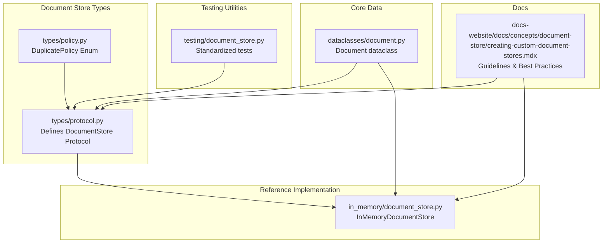
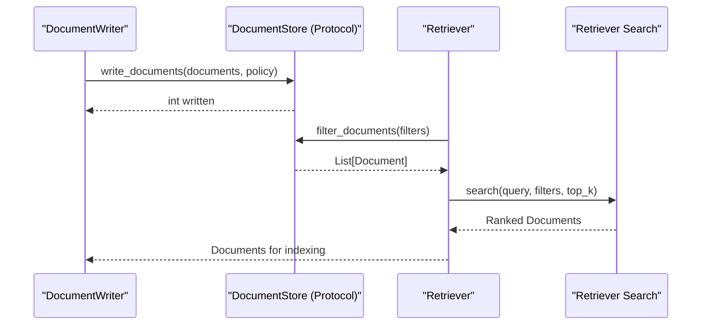
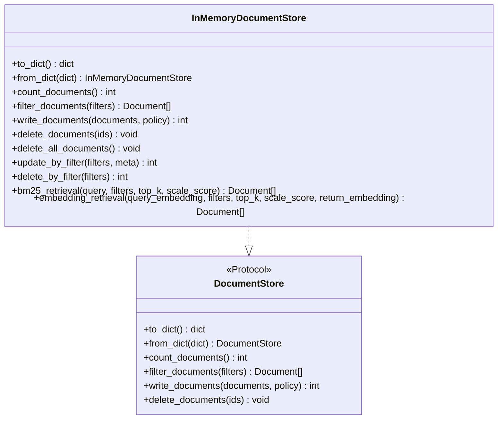
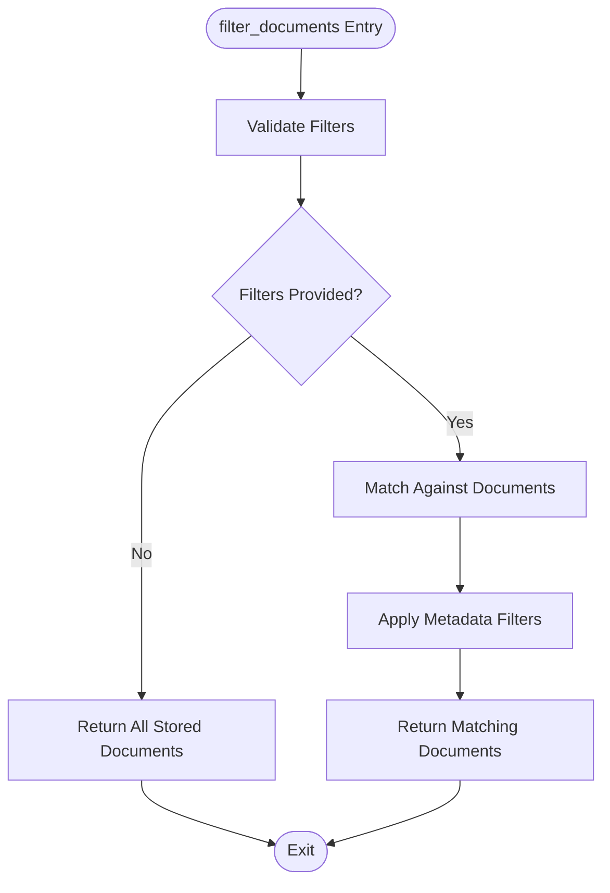
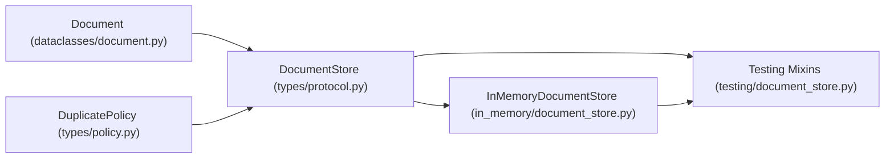

# Custom Document Store Development

<cite>
**Referenced Files in This Document**
- [protocol.py](file://haystack/document_stores/types/protocol.py)
- [policy.py](file://haystack/document_stores/types/policy.py)
- [document.py](file://haystack/dataclasses/document.py)
- [document_store.py](file://haystack/document_stores/in_memory/document_store.py)
- [creating-custom-document-stores.mdx](file://docs-website/docs/concepts/document-store/creating-custom-document-stores.mdx)
- [document_store.py](file://haystack/testing/document_store.py)
- [filter_policy.py](file://test/document_stores/test_filter_policy.py)
- [test_in_memory.py](file://test/document_stores/test_in_memory.py)
</cite>

## Table of Contents
1. [Introduction](#introduction)
2. [Project Structure](#project-structure)
3. [Core Components](#core-components)
4. [Architecture Overview](#architecture-overview)
5. [Detailed Component Analysis](#detailed-component-analysis)
6. [Dependency Analysis](#dependency-analysis)
7. [Performance Considerations](#performance-considerations)
8. [Troubleshooting Guide](#troubleshooting-guide)
9. [Conclusion](#conclusion)
10. [Appendices](#appendices)

## Introduction
This document explains how to build custom document stores in Haystack. It covers the DocumentStore protocol, required interface compliance, filter policy semantics, metadata query handling, integration with Haystack pipelines and components, testing strategies, performance optimization, and operational considerations. It also provides step-by-step examples for implementing document stores against different backends and guidance on error handling, logging, and monitoring.

## Project Structure
The Haystack repository organizes document store-related code under haystack/document_stores, with protocol definitions, policies, and an in-memory reference implementation. Documentation for building custom stores is provided in docs-website.

**Diagram sources**
- [protocol.py](file://haystack/document_stores/types/protocol.py#L11-L136)
- [policy.py](file://haystack/document_stores/types/policy.py#L8-L13)
- [document.py](file://haystack/dataclasses/document.py#L48-L190)
- [document_store.py](file://haystack/document_stores/in_memory/document_store.py#L59-L811)
- [document_store.py](file://haystack/testing/document_store.py#L44-L954)
- [creating-custom-document-stores.mdx](file://docs-website/docs/concepts/document-store/creating-custom-document-stores.mdx#L64-L175)

**Section sources**
- [protocol.py](file://haystack/document_stores/types/protocol.py#L11-L136)
- [policy.py](file://haystack/document_stores/types/policy.py#L8-L13)
- [document.py](file://haystack/dataclasses/document.py#L48-L190)
- [document_store.py](file://haystack/document_stores/in_memory/document_store.py#L59-L811)
- [document_store.py](file://haystack/testing/document_store.py#L44-L954)
- [creating-custom-document-stores.mdx](file://docs-website/docs/concepts/document-store/creating-custom-document-stores.mdx#L64-L175)

## Core Components
- DocumentStore Protocol: Defines the contract for document persistence and retrieval, including serialization and the core CRUD operations.
- DuplicatePolicy: Enumerates strategies for handling documents with duplicate IDs during write operations.
- Document dataclass: Standardized representation of documents with content, metadata, embeddings, and optional binary blobs.
- InMemoryDocumentStore: Reference implementation demonstrating protocol compliance, filters, and retrieval helpers.
- Testing utilities: Mixins and fixtures to validate custom document stores against standard behaviors.

Key responsibilities:
- Protocol compliance: Implement to_dict/from_dict, count_documents, filter_documents, write_documents, delete_documents.
- Filter semantics: Support comparison operators and logical operators on metadata fields.
- Policy handling: Honor DuplicatePolicy semantics for overwrite/skip/fail behavior.
- Async support: Optionally implement async variants for scalability.

**Section sources**
- [protocol.py](file://haystack/document_stores/types/protocol.py#L11-L136)
- [policy.py](file://haystack/document_stores/types/policy.py#L8-L13)
- [document.py](file://haystack/dataclasses/document.py#L48-L190)
- [document_store.py](file://haystack/document_stores/in_memory/document_store.py#L59-L811)
- [document_store.py](file://haystack/testing/document_store.py#L44-L954)

## Architecture Overview
The DocumentStore protocol enables pluggable persistence layers. Components like DocumentWriter and Retrievers interact with any compliant store via this protocol. Advanced stores may expose additional methods (e.g., delete_by_filter, update_by_filter) beyond the protocol.

**Diagram sources**
- [protocol.py](file://haystack/document_stores/types/protocol.py#L11-L136)
- [document_store.py](file://haystack/document_stores/in_memory/document_store.py#L59-L811)

## Detailed Component Analysis

### DocumentStore Protocol Compliance
- Required methods:
  - to_dict/from_dict: Enable serialization and reconstruction of the store.
  - count_documents: Return total number of stored documents.
  - filter_documents: Apply metadata filters and return matching documents.
  - write_documents: Persist documents honoring DuplicatePolicy.
  - delete_documents: Remove documents by IDs.
- Additional recommended methods (not part of the protocol):
  - delete_all_documents, update_by_filter, delete_by_filter, and backend-specific search helpers.

Filter syntax:
- Comparison dictionaries require keys: field, operator, value.
- Logic dictionaries require keys: operator, conditions (list of comparisons/logics).
- Supported operators include comparison operators and logical operators (AND, OR, NOT).

DuplicatePolicy semantics:
- NONE: Defaults to FAIL in many implementations.
- SKIP: Skip duplicates; return count of successful writes.
- OVERWRITE: Replace existing documents; return total count.
- FAIL: Raise an error on duplicates.

Serialization guidance:
- Serialize only configuration/state, not live client connections.
- Reconstruct clients from serialized parameters.

Secrets management:
- Wrap sensitive values (e.g., API keys) using Haystack’s Secrets to avoid leaking during serialization.

Async support:
- Implement async variants for scalability in pipelines.

**Section sources**
- [protocol.py](file://haystack/document_stores/types/protocol.py#L11-L136)
- [policy.py](file://haystack/document_stores/types/policy.py#L8-L13)
- [creating-custom-document-stores.mdx](file://docs-website/docs/concepts/document-store/creating-custom-document-stores.mdx#L64-L175)

### In-Memory Document Store Reference
The in-memory implementation demonstrates:
- Storage isolation via index namespaces.
- Metadata filtering using a reusable filter matcher.
- Retrieval helpers (BM25 and embedding similarity).
- Statistics maintenance for BM25 scoring.
- Duplicate handling and policy enforcement.
- Optional async execution via a thread pool.

Notable behaviors:
- filter_documents validates filter syntax and delegates matching to a shared utility.
- write_documents enforces DuplicatePolicy and updates BM25 statistics incrementally.
- Retrieval helpers compute scores and optionally scale them.
- Additional methods (delete_all_documents, update_by_filter, delete_by_filter) are provided for convenience.

**Diagram sources**
- [document_store.py](file://haystack/document_stores/in_memory/document_store.py#L59-L811)
- [protocol.py](file://haystack/document_stores/types/protocol.py#L11-L136)

**Section sources**
- [document_store.py](file://haystack/document_stores/in_memory/document_store.py#L59-L811)

### Filter Policy and Metadata Query Handling
- Filter syntax validation ensures correctness before matching.
- Supported operators include comparison operators and logical operators.
- Filtering is applied to metadata fields; content presence checks are commonly used in retrieval helpers.
- Tests demonstrate robust coverage for malformed filters and edge cases.

**Diagram sources**
- [document_store.py](file://haystack/document_stores/in_memory/document_store.py#L418-L437)
- [document_store.py](file://haystack/testing/document_store.py#L252-L613)

**Section sources**
- [document_store.py](file://haystack/document_stores/in_memory/document_store.py#L418-L437)
- [document_store.py](file://haystack/testing/document_store.py#L252-L613)
- [filter_policy.py](file://test/document_stores/test_filter_policy.py)

### Integration with Haystack Pipelines and Components
- DocumentWriter writes documents into any DocumentStore implementing the protocol.
- Retrievers can use additional store-specific search methods (e.g., BM25 or embedding retrieval) to produce ranked results.
- Serialization of stores enables pipeline persistence and reconstruction.

Best practices:
- Implement to_dict/from_dict to capture configuration and reconstruct the store.
- Expose retrieval helpers that align with your backend capabilities.
- Honor DuplicatePolicy in write_documents to integrate seamlessly with DocumentWriter.

**Section sources**
- [protocol.py](file://haystack/document_stores/types/protocol.py#L11-L136)
- [document_store.py](file://haystack/document_stores/in_memory/document_store.py#L552-L608)

### Step-by-Step Examples

#### Example A: Minimal Protocol Implementation
- Implement the five required methods: to_dict, from_dict, count_documents, filter_documents, write_documents, delete_documents.
- Add to_dict/from_dict to serialize configuration (e.g., connection parameters) and avoid serializing live clients.
- Enforce DuplicatePolicy in write_documents.
- Validate filters in filter_documents and delegate matching to a shared utility.

References:
- Protocol definition and filter/operator specs: [protocol.py](file://haystack/document_stores/types/protocol.py#L11-L136)
- Policy semantics: [policy.py](file://haystack/document_stores/types/policy.py#L8-L13)

#### Example B: Backend-Agnostic Store with Additional Methods
- Implement recommended non-protocol methods: delete_all_documents, update_by_filter, delete_by_filter.
- Provide retrieval helpers tailored to your backend (e.g., keyword search, vector similarity).
- Use async variants for improved throughput in pipelines.

References:
- Reference implementation: [document_store.py](file://haystack/document_stores/in_memory/document_store.py#L511-L550)
- Retrieval helpers: [document_store.py](file://haystack/document_stores/in_memory/document_store.py#L552-L608)

#### Example C: Integrating with Retrievers
- Build a custom Retriever that uses your store’s additional search methods.
- Ensure the Retriever honors filters and returns Documents with scores when applicable.
- Validate integration by running the standard test mixins.

References:
- Custom components guidance: [creating-custom-document-stores.mdx](file://docs-website/docs/concepts/document-store/creating-custom-document-stores.mdx#L126-L133)

### Testing Strategies
- Use standardized test mixins to validate behavior:
  - CountDocumentsTest: Verify counts for empty and non-empty stores.
  - WriteDocumentsTest: Validate DuplicatePolicy semantics and input validation.
  - DeleteDocumentsTest: Verify deletion behavior and idempotency.
  - FilterDocumentsTest: Comprehensive filter coverage including operators and logic.
  - DeleteAllTest: Test clearing and recreation semantics when supported.
  - DeleteByFilterTest and UpdateByFilterTest: Validate advanced operations when implemented.
- Create a minimal test class inheriting from the desired mixins and override the document_store fixture to return your store instance.

References:
- Test mixins and fixtures: [document_store.py](file://haystack/testing/document_store.py#L44-L954)

**Section sources**
- [document_store.py](file://haystack/testing/document_store.py#L44-L954)

## Dependency Analysis
The protocol depends on the Document dataclass and DuplicatePolicy. The in-memory implementation depends on the protocol, Document, DuplicatePolicy, and filter utilities. Testing utilities depend on the protocol and Document.

**Diagram sources**
- [document.py](file://haystack/dataclasses/document.py#L48-L190)
- [protocol.py](file://haystack/document_stores/types/protocol.py#L11-L136)
- [policy.py](file://haystack/document_stores/types/policy.py#L8-L13)
- [document_store.py](file://haystack/document_stores/in_memory/document_store.py#L59-L811)
- [document_store.py](file://haystack/testing/document_store.py#L44-L954)

**Section sources**
- [document.py](file://haystack/dataclasses/document.py#L48-L190)
- [protocol.py](file://haystack/document_stores/types/protocol.py#L11-L136)
- [policy.py](file://haystack/document_stores/types/policy.py#L8-L13)
- [document_store.py](file://haystack/document_stores/in_memory/document_store.py#L59-L811)
- [document_store.py](file://haystack/testing/document_store.py#L44-L954)

## Performance Considerations
- Prefer async variants for high-throughput pipelines to reduce blocking.
- Implement efficient indexing and statistics (e.g., BM25 stats) to accelerate retrieval.
- Scale retrieval scores when necessary to normalize distributions.
- Use filters to narrow the candidate set early to reduce downstream computation.
- Consider batching writes and leveraging backend-native bulk operations.

[No sources needed since this section provides general guidance]

## Troubleshooting Guide
Common issues and remedies:
- Invalid filter syntax: Ensure filters conform to the documented structure; validation raises FilterError for malformed inputs.
- Duplicate write failures: Honor DuplicatePolicy; use SKIP or OVERWRITE to handle existing IDs.
- Missing embeddings during vector retrieval: Ensure documents have embeddings; warn and return empty results when absent.
- Shape mismatches in embeddings: Validate query and document embedding sizes; mismatched shapes raise errors.
- Logging and warnings: Use the logging module to surface warnings and info messages for diagnostics.

References:
- Filter validation and errors: [document_store.py](file://haystack/document_stores/in_memory/document_store.py#L505-L510)
- Duplicate handling: [document_store.py](file://haystack/document_stores/in_memory/document_store.py#L439-L480)
- Embedding retrieval errors: [document_store.py](file://haystack/document_stores/in_memory/document_store.py#L691-L714)

**Section sources**
- [document_store.py](file://haystack/document_stores/in_memory/document_store.py#L505-L510)
- [document_store.py](file://haystack/document_stores/in_memory/document_store.py#L439-L480)
- [document_store.py](file://haystack/document_stores/in_memory/document_store.py#L691-L714)

## Conclusion
Building a custom document store in Haystack centers on implementing the DocumentStore protocol, honoring DuplicatePolicy, supporting robust metadata filtering, and integrating cleanly with pipelines and components. Use the provided testing utilities to validate behavior, adopt async patterns for performance, and follow serialization and secrets best practices for production readiness.

[No sources needed since this section summarizes without analyzing specific files]

## Appendices

### Appendix A: Protocol Method Reference
- to_dict/from_dict: Serialize and reconstruct the store.
- count_documents: Total number of stored documents.
- filter_documents: Apply filters and return matching documents.
- write_documents: Persist documents honoring DuplicatePolicy.
- delete_documents: Remove documents by IDs.

References:
- [protocol.py](file://haystack/document_stores/types/protocol.py#L11-L136)

### Appendix B: Filter Syntax Quick Reference
- Comparison: { "field": "...", "operator": "...", "value": ... }
- Logic: { "operator": "AND"|"OR"|"NOT", "conditions": [ {...}, {...} ] }
- Operators: ==, !=, >, >=, <, <=, in, not in for comparisons; AND, OR, NOT for logic.

References:
- [protocol.py](file://haystack/document_stores/types/protocol.py#L41-L106)

### Appendix C: Recommended Non-Protocol Methods
- delete_all_documents, update_by_filter, delete_by_filter, and backend-specific search helpers.

References:
- [creating-custom-document-stores.mdx](file://docs-website/docs/concepts/document-store/creating-custom-document-stores.mdx#L111-L123)