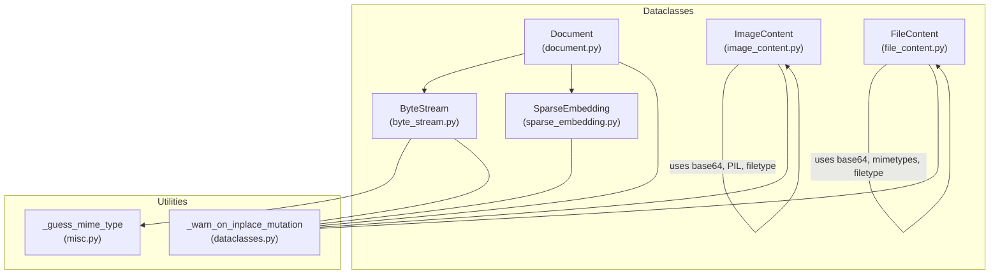
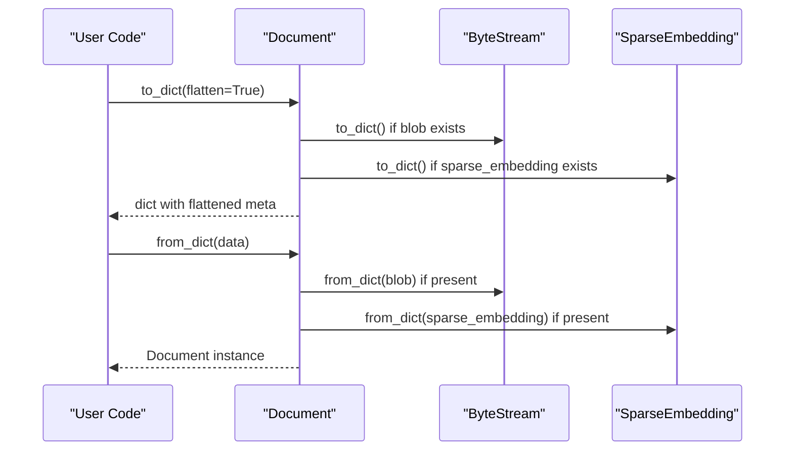
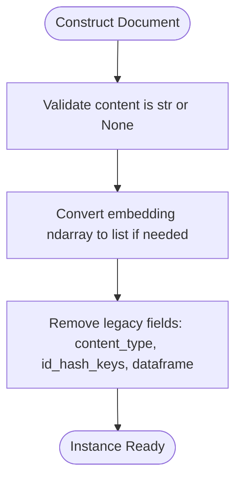
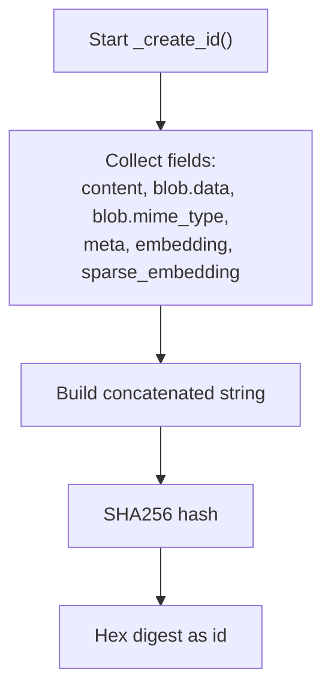
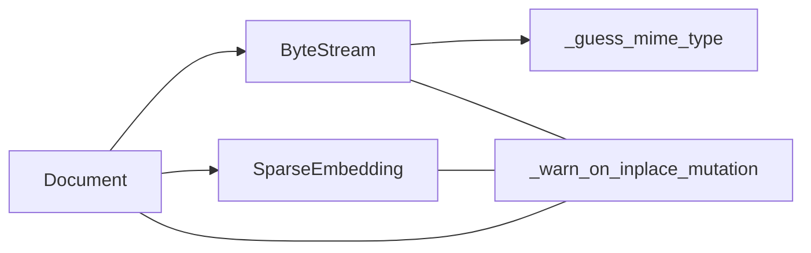

# Document Data Classes

<cite>
**Referenced Files in This Document**
- [document.py](file://haystack/dataclasses/document.py)
- [byte_stream.py](file://haystack/dataclasses/byte_stream.py)
- [sparse_embedding.py](file://haystack/dataclasses/sparse_embedding.py)
- [image_content.py](file://haystack/dataclasses/image_content.py)
- [file_content.py](file://haystack/dataclasses/file_content.py)
- [dataclasses.py](file://haystack/utils/dataclasses.py)
- [misc.py](file://haystack/utils/misc.py)
- [test_document.py](file://test/dataclasses/test_document.py)
- [test_byte_stream.py](file://test/dataclasses/test_byte_stream.py)
- [test_sparse_embedding.py](file://test/dataclasses/test_sparse_embedding.py)
</cite>

## Table of Contents
1. [Introduction](#introduction)
2. [Project Structure](#project-structure)
3. [Core Components](#core-components)
4. [Architecture Overview](#architecture-overview)
5. [Detailed Component Analysis](#detailed-component-analysis)
6. [Dependency Analysis](#dependency-analysis)
7. [Performance Considerations](#performance-considerations)
8. [Troubleshooting Guide](#troubleshooting-guide)
9. [Conclusion](#conclusion)
10. [Appendices](#appendices)

## Introduction
This document explains Haystack’s document data structures with a focus on the Document class and related specialized data classes. It covers the core fields (id, content, blob, meta, score, embedding, sparse_embedding), backward compatibility for legacy field handling, and conversion from older versions. It also documents specialized data classes for binary content (ByteStream), sparse vectors (SparseEmbedding), and multimedia content (ImageContent, FileContent). Serialization and deserialization mechanisms (to_dict and from_dict) are explained, along with document identity generation via SHA256 hashing and ID collision prevention. Metadata handling, type validation, and field constraints are detailed, followed by practical examples and performance considerations for large document collections.

## Project Structure
The document data classes live under the dataclasses package and are supported by utility modules for mutation warnings and MIME type guessing. Tests validate behavior and edge cases.



**Diagram sources**
- [document.py](file://haystack/dataclasses/document.py#L46-L190)
- [byte_stream.py](file://haystack/dataclasses/byte_stream.py#L13-L125)
- [sparse_embedding.py](file://haystack/dataclasses/sparse_embedding.py#L11-L53)
- [image_content.py](file://haystack/dataclasses/image_content.py#L60-L247)
- [file_content.py](file://haystack/dataclasses/file_content.py#L21-L177)
- [dataclasses.py](file://haystack/utils/dataclasses.py#L12-L58)
- [misc.py](file://haystack/utils/misc.py#L82-L94)

**Section sources**
- [document.py](file://haystack/dataclasses/document.py#L1-L190)
- [byte_stream.py](file://haystack/dataclasses/byte_stream.py#L1-L125)
- [sparse_embedding.py](file://haystack/dataclasses/sparse_embedding.py#L1-L53)
- [image_content.py](file://haystack/dataclasses/image_content.py#L1-L247)
- [file_content.py](file://haystack/dataclasses/file_content.py#L1-L177)
- [dataclasses.py](file://haystack/utils/dataclasses.py#L1-L58)
- [misc.py](file://haystack/utils/misc.py#L1-L209)

## Core Components
- Document: The primary data class representing a piece of content with optional binary payload, metadata, scores, and embeddings. It supports automatic ID generation, backward compatibility for legacy fields, and robust serialization.
- ByteStream: Represents binary content with optional metadata and MIME type, plus helpers to convert from/to files and strings.
- SparseEmbedding: Represents sparse vectors with validated indices/values pairs.
- ImageContent: Encapsulates image content as base64 with optional MIME type, detail level, and validation.
- FileContent: Encapsulates generic file content as base64 with MIME type, filename, and extra metadata.

Key behaviors:
- Automatic ID generation using SHA256 over selected fields.
- Backward compatibility for legacy fields (e.g., content_type, id_hash_keys, dataframe).
- Serialization flattening/unflattening of metadata for compatibility.
- Validation and warnings for in-place mutations.

**Section sources**
- [document.py](file://haystack/dataclasses/document.py#L46-L190)
- [byte_stream.py](file://haystack/dataclasses/byte_stream.py#L13-L125)
- [sparse_embedding.py](file://haystack/dataclasses/sparse_embedding.py#L11-L53)
- [image_content.py](file://haystack/dataclasses/image_content.py#L60-L247)
- [file_content.py](file://haystack/dataclasses/file_content.py#L21-L177)
- [dataclasses.py](file://haystack/utils/dataclasses.py#L12-L58)

## Architecture Overview
The Document class composes specialized data classes and relies on utility decorators and helpers for safe mutation and MIME type inference.

```mermaid
classDiagram
class Document {
+string id
+string|None content
+ByteStream|None blob
+dict meta
+float|None score
+list<float>|None embedding
+SparseEmbedding|None sparse_embedding
+to_dict(flatten) dict
+from_dict(data) Document
+_create_id() string
}
class ByteStream {
+bytes data
+dict meta
+string|None mime_type
+to_file(path) void
+from_file_path(path, mime_type, meta, guess_mime_type) ByteStream
+from_string(text, encoding, mime_type, meta) ByteStream
+to_string(encoding) string
+to_dict() dict
+from_dict(data) ByteStream
}
class SparseEmbedding {
+list<int> indices
+list<float> values
+to_dict() dict
+from_dict(data) SparseEmbedding
}
class ImageContent {
+string base64_image
+string|None mime_type
+string|None detail
+dict meta
+bool validation
+to_dict() dict
+from_dict(data) ImageContent
+from_file_path(path, size, detail, meta) ImageContent
+from_url(url, retry_attempts, timeout, size, detail, meta) ImageContent
}
class FileContent {
+string base64_data
+string|None mime_type
+string|None filename
+dict extra
+bool validation
+to_dict() dict
+from_dict(data) FileContent
+from_file_path(path, filename, extra) FileContent
+from_url(url, retry_attempts, timeout, filename, extra) FileContent
}
Document --> ByteStream : "has"
Document --> SparseEmbedding : "has"
ImageContent -->|"validates base64 and MIME"| ImageContent
FileContent -->|"validates base64 and MIME"| FileContent
```

**Diagram sources**
- [document.py](file://haystack/dataclasses/document.py#L46-L190)
- [byte_stream.py](file://haystack/dataclasses/byte_stream.py#L13-L125)
- [sparse_embedding.py](file://haystack/dataclasses/sparse_embedding.py#L11-L53)
- [image_content.py](file://haystack/dataclasses/image_content.py#L60-L247)
- [file_content.py](file://haystack/dataclasses/file_content.py#L21-L177)

## Detailed Component Analysis

### Document Data Class
- Fields:
  - id: Unique identifier; auto-generated if not provided.
  - content: Text content.
  - blob: Binary payload via ByteStream.
  - meta: Arbitrary JSON-serializable metadata.
  - score: Ranking score.
  - embedding: Dense vector as list of floats.
  - sparse_embedding: Sparse vector via SparseEmbedding.
- Backward compatibility:
  - Legacy fields are stripped during construction.
  - content_type property remains for compatibility.
  - Embedding values are normalized from NumPy arrays to lists when provided.
- Identity generation:
  - SHA256 over content, blob bytes, blob mime_type, meta, embedding, and sparse_embedding representation.
  - score is intentionally excluded from the ID hash.
- Serialization:
  - to_dict supports flattening metadata for backward compatibility.
  - from_dict reconstructs nested structures (ByteStream, SparseEmbedding) and unflattens metadata.
  - Rejects mixed flattened metadata and explicit meta parameter.
- Equality:
  - Based on dictionary representation equivalence.

Practical examples (paths only):
- Creating a Document with content and embedding: [test_document.py](file://test/dataclasses/test_document.py#L43-L62)
- Using legacy fields during construction: [test_document.py](file://test/dataclasses/test_document.py#L64-L105)
- Flattened vs unflattened to_dict: [test_document.py](file://test/dataclasses/test_document.py#L124-L190)
- from_dict with nested structures: [test_document.py](file://test/dataclasses/test_document.py#L211-L294)
- Field precedence in flattened to_dict: [test_document.py](file://test/dataclasses/test_document.py#L192-L210)

**Section sources**
- [document.py](file://haystack/dataclasses/document.py#L18-L190)
- [test_document.py](file://test/dataclasses/test_document.py#L1-L362)

### ByteStream
- Purpose: Encapsulate raw binary data with optional metadata and MIME type.
- Key methods:
  - from_file_path(filepath, mime_type, meta, guess_mime_type)
  - from_string(text, encoding, mime_type, meta)
  - to_string(encoding)
  - to_file(destination_path)
  - to_dict/from_dict for serialization.
- MIME type inference:
  - Uses custom mapping and mimetypes.guess_type with fallbacks.
- Mutation warnings:
  - Decorator warns on in-place mutations after initialization.

Practical examples (paths only):
- Reading from file path with MIME guessing: [test_byte_stream.py](file://test/dataclasses/test_byte_stream.py#L12-L75)
- Converting string to ByteStream and back: [test_byte_stream.py](file://test/dataclasses/test_byte_stream.py#L77-L114)
- to_dict/from_dict roundtrip: [test_byte_stream.py](file://test/dataclasses/test_byte_stream.py#L134-L160)

**Section sources**
- [byte_stream.py](file://haystack/dataclasses/byte_stream.py#L13-L125)
- [misc.py](file://haystack/utils/misc.py#L82-L94)
- [test_byte_stream.py](file://test/dataclasses/test_byte_stream.py#L1-L172)

### SparseEmbedding
- Purpose: Represent sparse vectors with indices and values.
- Validation:
  - Indices and values must have equal length.
- Methods:
  - to_dict/from_dict for serialization.

Practical examples (paths only):
- Construction and validation: [test_sparse_embedding.py](file://test/dataclasses/test_sparse_embedding.py#L12-L21)
- Serialization roundtrip: [test_sparse_embedding.py](file://test/dataclasses/test_sparse_embedding.py#L22-L29)

**Section sources**
- [sparse_embedding.py](file://haystack/dataclasses/sparse_embedding.py#L11-L53)
- [test_sparse_embedding.py](file://test/dataclasses/test_sparse_embedding.py#L1-L48)

### ImageContent
- Purpose: Encapsulate image content as base64 with optional MIME type and detail level.
- Validation:
  - Validates base64 string.
  - Optionally guesses MIME type and validates it against known image MIME types.
- Creation helpers:
  - from_file_path and from_url integrate with converters and link fetchers.

Practical examples (paths only):
- Initialization with validation and MIME guessing: [test_image_content.py](file://test/dataclasses/test_image_content.py#L42-L103)
- Invalid base64 and MIME type handling: [test_image_content.py](file://test/dataclasses/test_image_content.py#L58-L98)

**Section sources**
- [image_content.py](file://haystack/dataclasses/image_content.py#L60-L247)

### FileContent
- Purpose: Encapsulate generic file content as base64 with MIME type, filename, and extra metadata.
- Validation:
  - Validates base64 string and optionally guesses MIME type.
- Creation helpers:
  - from_file_path and from_url handle local and remote sources.

Practical examples (paths only):
- Initialization with MIME guessing: [test_file_content.py](file://test/dataclasses/test_file_content.py#L72-L81)
- Invalid base64 handling: [test_file_content.py](file://test/dataclasses/test_file_content.py#L58-L70)
- from_file_path and from_url: [test_file_content.py](file://test/dataclasses/test_file_content.py#L101-L177)

**Section sources**
- [file_content.py](file://haystack/dataclasses/file_content.py#L21-L177)

### Serialization and Deserialization
- Document.to_dict:
  - Converts nested structures (ByteStream, SparseEmbedding) to dicts.
  - Supports flattening metadata for backward compatibility.
- Document.from_dict:
  - Reconstructs nested structures.
  - Unflattens metadata by moving top-level keys not belonging to Document fields into meta.
  - Rejects mixing flattened metadata keys and explicit meta parameter.
- ByteStream.to_dict/from_dict:
  - Stores data as a list of integers for JSON compatibility.
- SparseEmbedding.to_dict/from_dict:
  - Straightforward dict conversion.



**Diagram sources**
- [document.py](file://haystack/dataclasses/document.py#L122-L179)
- [byte_stream.py](file://haystack/dataclasses/byte_stream.py#L94-L125)
- [sparse_embedding.py](file://haystack/dataclasses/sparse_embedding.py#L33-L53)

**Section sources**
- [document.py](file://haystack/dataclasses/document.py#L122-L179)
- [byte_stream.py](file://haystack/dataclasses/byte_stream.py#L94-L125)
- [sparse_embedding.py](file://haystack/dataclasses/sparse_embedding.py#L33-L53)

### Backward Compatibility and Legacy Field Handling
- Legacy fields stripped during construction:
  - content_type, id_hash_keys, dataframe.
- Embedding normalization:
  - NumPy arrays converted to lists.
- Property compatibility:
  - content_type remains accessible for compatibility.
- from_dict supports legacy fields and flattening.



**Diagram sources**
- [document.py](file://haystack/dataclasses/document.py#L18-L44)

**Section sources**
- [document.py](file://haystack/dataclasses/document.py#L18-L44)

### Document Identity Generation and Collision Prevention
- Hashing input:
  - text, dataframe placeholder, blob bytes, blob mime_type, meta, embedding, sparse_embedding representation.
  - score is excluded from the hash.
- SHA256 produces a fixed-length hexadecimal string.
- Collision prevention:
  - ID is derived from the entire content of the document fields, minimizing collisions.
  - Deduplication utilities select the highest-scoring document among duplicates.



**Diagram sources**
- [document.py](file://haystack/dataclasses/document.py#L108-L120)
- [misc.py](file://haystack/utils/misc.py#L129-L146)

**Section sources**
- [document.py](file://haystack/dataclasses/document.py#L108-L120)
- [misc.py](file://haystack/utils/misc.py#L129-L146)

### Metadata Handling, Type Validation, and Field Constraints
- Document:
  - content must be str or None.
  - meta must be JSON-serializable; to_dict flattens it by default.
  - Mixed flattened meta and explicit meta are rejected in from_dict.
- ByteStream:
  - data must be bytes; to_dict stores as list of ints.
  - Optional mime_type inferred via utilities.
- SparseEmbedding:
  - indices and values must have equal length.
- ImageContent/FileContent:
  - base64 strings validated; MIME type guessed if absent.
  - ImageContent restricts MIME types to known image types.

**Section sources**
- [document.py](file://haystack/dataclasses/document.py#L31-L42)
- [byte_stream.py](file://haystack/dataclasses/byte_stream.py#L94-L125)
- [sparse_embedding.py](file://haystack/dataclasses/sparse_embedding.py#L24-L32)
- [image_content.py](file://haystack/dataclasses/image_content.py#L85-L108)
- [file_content.py](file://haystack/dataclasses/file_content.py#L46-L67)

## Dependency Analysis
- Document depends on:
  - ByteStream for binary payloads.
  - SparseEmbedding for sparse vectors.
  - Utility decorator for mutation warnings.
- ByteStream depends on:
  - MIME type guessing utilities.
- Specialized data classes encapsulate validation and conversion logic.



**Diagram sources**
- [document.py](file://haystack/dataclasses/document.py#L11-L13)
- [byte_stream.py](file://haystack/dataclasses/byte_stream.py#L9-L10)
- [dataclasses.py](file://haystack/utils/dataclasses.py#L12-L58)
- [misc.py](file://haystack/utils/misc.py#L82-L94)

**Section sources**
- [document.py](file://haystack/dataclasses/document.py#L11-L13)
- [byte_stream.py](file://haystack/dataclasses/byte_stream.py#L9-L10)
- [dataclasses.py](file://haystack/utils/dataclasses.py#L12-L58)
- [misc.py](file://haystack/utils/misc.py#L82-L94)

## Performance Considerations
- Prefer unflattened metadata when persisting to avoid unnecessary merging and potential conflicts.
- Avoid storing very large binary payloads in-memory; use ByteStream.from_file_path with guess_mime_type to reduce overhead.
- For large collections:
  - Use deduplication by ID to reduce redundant processing.
  - Limit embedding sizes and consider SparseEmbedding for sparse representations.
  - Minimize repeated to_dict conversions; cache results when appropriate.
- Tracing and logging:
  - Use ByteStream._to_trace_dict to avoid logging large payloads.

[No sources needed since this section provides general guidance]

## Troubleshooting Guide
Common issues and resolutions:
- ValueError on invalid base64 or unsupported MIME type in ImageContent/FileContent:
  - Disable validation temporarily for trusted inputs, but note potential runtime errors downstream.
- Mixed flattened metadata and explicit meta in from_dict:
  - Remove one of the two forms.
- Unexpected content_type property access:
  - Ensure content is set; otherwise a ValueError is raised.
- In-place mutation warnings:
  - Use dataclasses.replace to produce a new instance instead of mutating fields directly.

**Section sources**
- [image_content.py](file://haystack/dataclasses/image_content.py#L85-L108)
- [file_content.py](file://haystack/dataclasses/file_content.py#L46-L67)
- [document.py](file://haystack/dataclasses/document.py#L146-L179)
- [document.py](file://haystack/dataclasses/document.py#L180-L190)
- [dataclasses.py](file://haystack/utils/dataclasses.py#L12-L58)

## Conclusion
Haystack’s document data structures provide a robust, extensible foundation for handling text, binary, and multimedia content. The Document class centralizes identity, serialization, and backward compatibility, while specialized classes encapsulate domain-specific concerns. With careful metadata handling, validation, and serialization patterns, developers can build efficient pipelines that scale to large document collections.

[No sources needed since this section summarizes without analyzing specific files]

## Appendices

### Practical Examples (Paths Only)
- Create a Document with content and embedding: [test_document.py](file://test/dataclasses/test_document.py#L43-L62)
- Construct with legacy fields and observe stripping: [test_document.py](file://test/dataclasses/test_document.py#L64-L105)
- Serialize to flattened dict: [test_document.py](file://test/dataclasses/test_document.py#L124-L169)
- Deserialize from dict with nested structures: [test_document.py](file://test/dataclasses/test_document.py#L211-L294)
- Build ByteStream from file and serialize: [test_byte_stream.py](file://test/dataclasses/test_byte_stream.py#L12-L75)
- Create SparseEmbedding and roundtrip: [test_sparse_embedding.py](file://test/dataclasses/test_sparse_embedding.py#L22-L29)
- Create ImageContent from URL and validate: [image_content.py](file://haystack/dataclasses/image_content.py#L189-L247)
- Create FileContent from file path: [file_content.py](file://haystack/dataclasses/file_content.py#L94-L128)