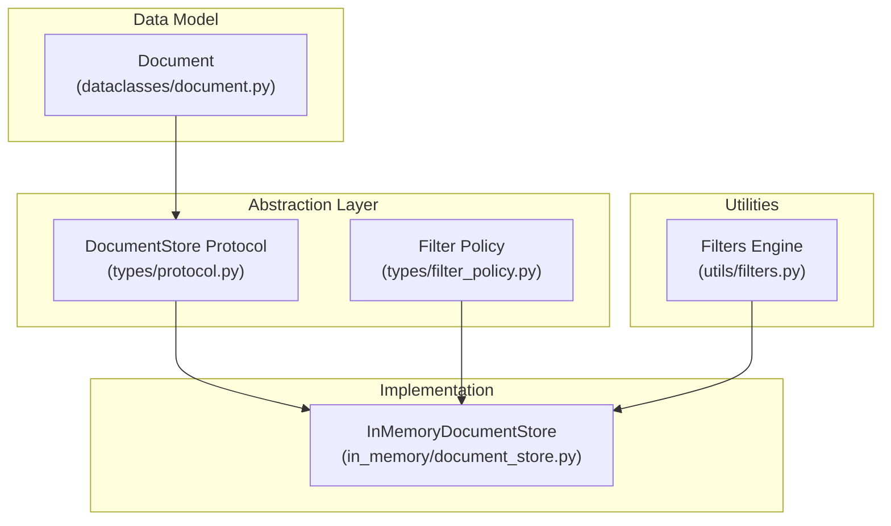
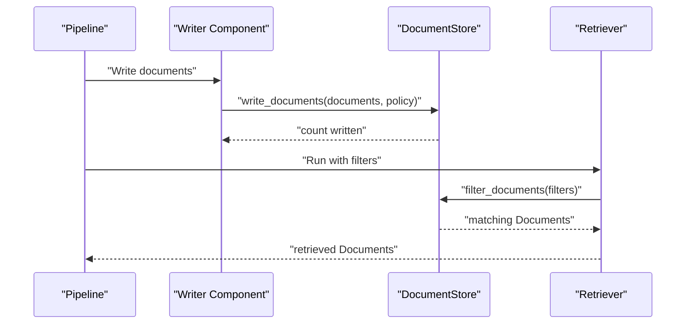
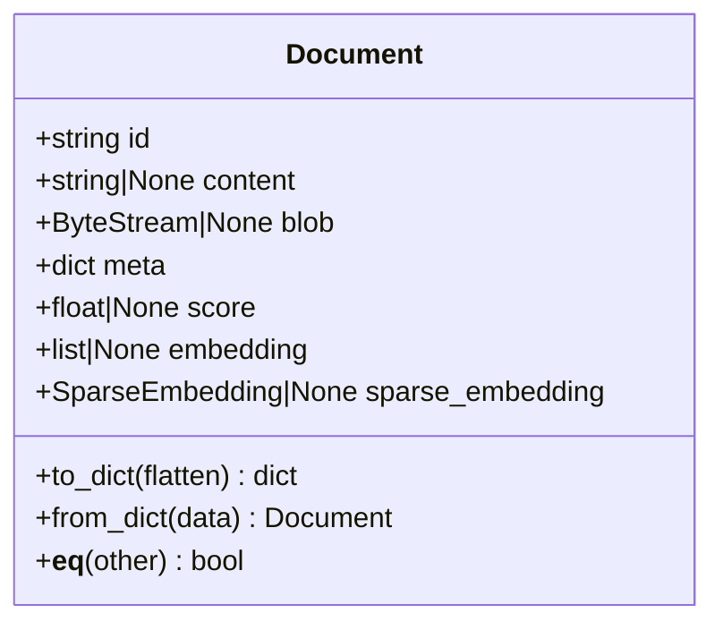
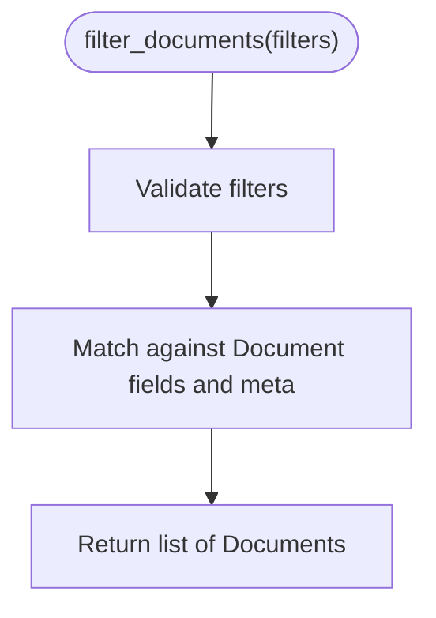
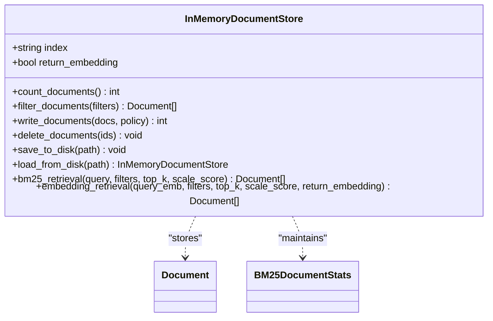
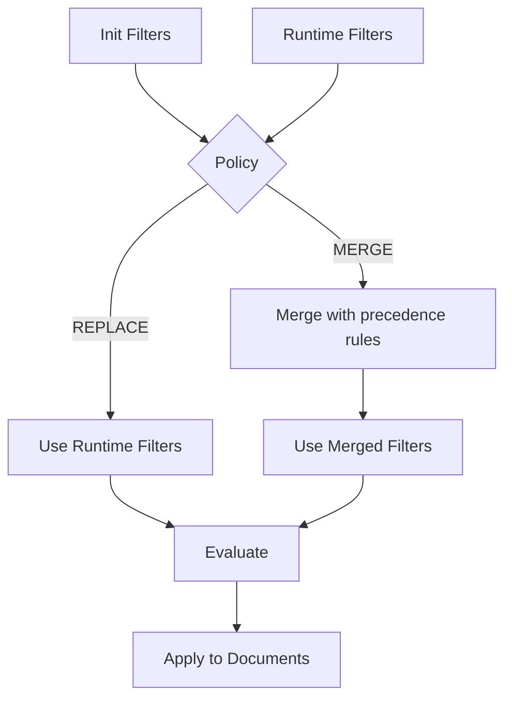
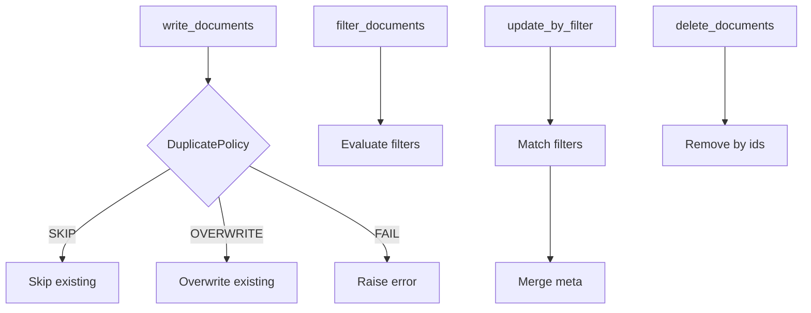
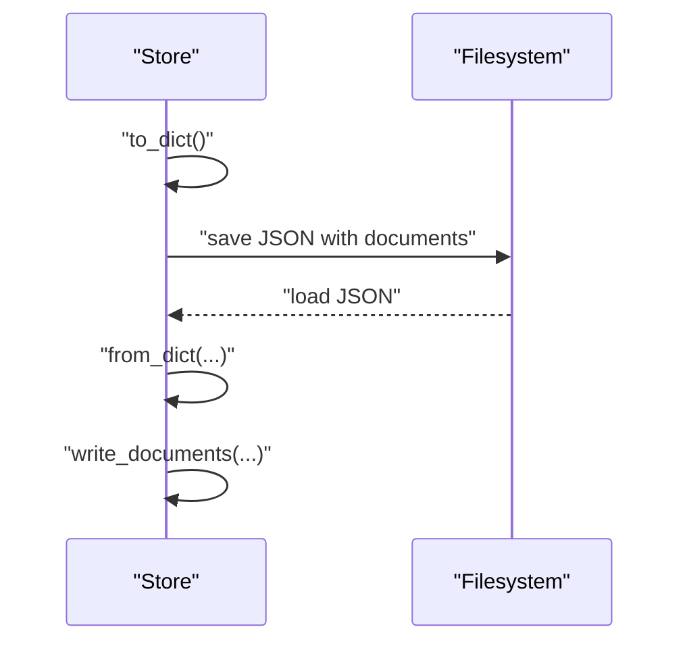
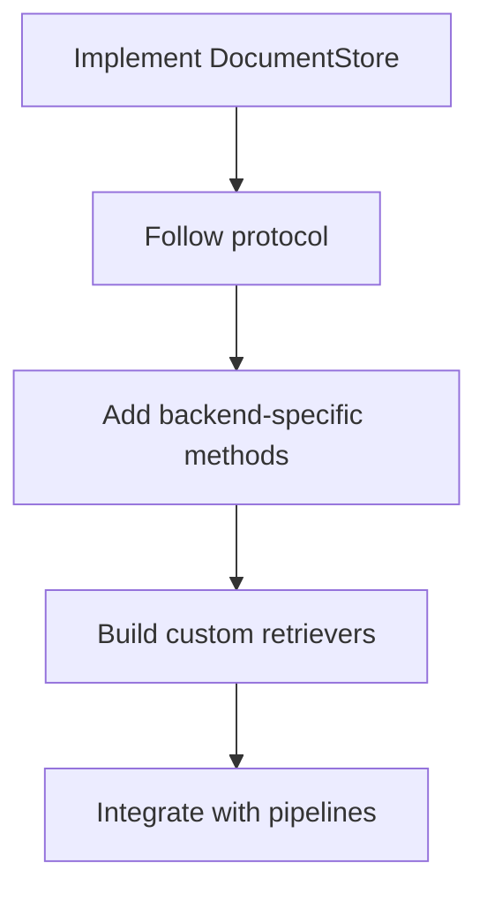
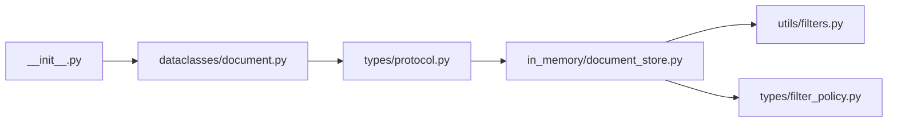

# Document Management

<cite>
**Referenced Files in This Document**
- [document.py](file://haystack/dataclasses/document.py)
- [__init__.py](file://haystack/__init__.py)
- [protocol.py](file://haystack/document_stores/types/protocol.py)
- [filter_policy.py](file://haystack/document_stores/types/filter_policy.py)
- [filters.py](file://haystack/utils/filters.py)
- [document_store.py](file://haystack/document_stores/in_memory/document_store.py)
- [creating-custom-document-stores.mdx](file://docs-website/versioned_docs/version-2.25/concepts/document-store/creating-custom-document-stores.mdx)
- [pgvectordocumentstore.mdx](file://docs-website/versioned_docs/version-2.25/document-stores/pgvectordocumentstore.mdx)
</cite>

## Table of Contents
1. [Introduction](#introduction)
2. [Project Structure](#project-structure)
3. [Core Components](#core-components)
4. [Architecture Overview](#architecture-overview)
5. [Detailed Component Analysis](#detailed-component-analysis)
6. [Dependency Analysis](#dependency-analysis)
7. [Performance Considerations](#performance-considerations)
8. [Troubleshooting Guide](#troubleshooting-guide)
9. [Conclusion](#conclusion)
10. [Appendices](#appendices)

## Introduction
This document explains Haystack’s document management system with a focus on the Document data class, the document store abstraction, supported backends, operations, filtering, preprocessing, serialization, ingestion pipelines, performance, and extensibility. It is designed to be accessible to both newcomers and experienced users building Retrieval-Augmented Generation (RAG) systems.

## Project Structure
Haystack organizes document-related functionality across several modules:
- Data model: Document dataclass and related types
- Abstraction: DocumentStore protocol and filter policy utilities
- Implementation: In-memory document store with retrieval helpers
- Utilities: Filter evaluation engine
- Documentation: Concepts and integrations for custom stores and vector DBs

**Diagram sources**
- [document.py](file://haystack/dataclasses/document.py#L48-L120)
- [protocol.py](file://haystack/document_stores/types/protocol.py#L11-L136)
- [filter_policy.py](file://haystack/document_stores/types/filter_policy.py#L13-L41)
- [filters.py](file://haystack/utils/filters.py#L24-L34)
- [document_store.py](file://haystack/document_stores/in_memory/document_store.py#L59-L125)

**Section sources**
- [document.py](file://haystack/dataclasses/document.py#L48-L120)
- [protocol.py](file://haystack/document_stores/types/protocol.py#L11-L136)
- [filter_policy.py](file://haystack/document_stores/types/filter_policy.py#L13-L41)
- [filters.py](file://haystack/utils/filters.py#L24-L34)
- [document_store.py](file://haystack/document_stores/in_memory/document_store.py#L59-L125)

## Core Components
- Document: The canonical data structure representing a piece of content with optional binary payload, metadata, scores, and embeddings.
- DocumentStore Protocol: Defines the contract for storing and retrieving documents, including filters, counts, writes, deletes, and serialization hooks.
- InMemoryDocumentStore: A concrete implementation demonstrating BM25 keyword retrieval, vector similarity retrieval, and basic CRUD-like operations.
- Filter Policy and Filters Engine: Provide robust metadata filtering semantics and runtime policy for combining init-time and runtime filters.

Key responsibilities:
- Document: Encapsulates content, metadata, embeddings, and identity; provides serialization and equality semantics.
- DocumentStore Protocol: Standardizes operations and filter syntax across backends.
- InMemoryDocumentStore: Implements protocol methods, manages BM25 statistics, and computes similarity scores.
- Filters Engine: Evaluates nested filter expressions against Document fields and metadata.

**Section sources**
- [document.py](file://haystack/dataclasses/document.py#L48-L120)
- [protocol.py](file://haystack/document_stores/types/protocol.py#L11-L136)
- [document_store.py](file://haystack/document_stores/in_memory/document_store.py#L418-L550)
- [filters.py](file://haystack/utils/filters.py#L24-L34)
- [filter_policy.py](file://haystack/document_stores/types/filter_policy.py#L283-L320)

## Architecture Overview
The document management architecture centers on the Document dataclass and the DocumentStore protocol. Pipelines orchestrate components that write/read/update/delete documents and apply filters. Retrievers interact with a DocumentStore to fetch relevant documents for downstream tasks.

**Diagram sources**
- [protocol.py](file://haystack/document_stores/types/protocol.py#L109-L136)
- [document_store.py](file://haystack/document_stores/in_memory/document_store.py#L418-L480)

## Detailed Component Analysis

### Document Data Class
The Document class defines the core data structure:
- Fields: id, content, blob, meta, score, embedding, sparse_embedding
- Identity: auto-generated if not provided, derived from content, blob, meta, embeddings
- Serialization: to_dict/from_dict with flattening/unflattening of metadata
- Equality: based on dictionary representation
- Backward compatibility: normalizes legacy fields and embedding types

**Diagram sources**
- [document.py](file://haystack/dataclasses/document.py#L48-L120)

**Section sources**
- [document.py](file://haystack/dataclasses/document.py#L48-L120)
- [__init__.py](file://haystack/__init__.py#L27-L41)

### DocumentStore Protocol
The protocol defines the interface that all document stores must implement:
- count_documents: total stored documents
- filter_documents: metadata-based filtering with nested comparisons/logic
- write_documents: bulk write with DuplicatePolicy
- delete_documents: delete by ids
- to/from_dict: serialization hooks

Filter syntax:
- Comparison: field, operator, value
- Logic: operator among NOT, OR, AND, conditions (list of filters)
- Operators: ==, !=, >, >=, <, <=, in, not in

**Diagram sources**
- [protocol.py](file://haystack/document_stores/types/protocol.py#L41-L107)
- [filters.py](file://haystack/utils/filters.py#L24-L34)

**Section sources**
- [protocol.py](file://haystack/document_stores/types/protocol.py#L11-L136)
- [filters.py](file://haystack/utils/filters.py#L15-L34)

### InMemoryDocumentStore
The in-memory store demonstrates:
- Storage: per-index dictionary keyed by Document.id
- BM25 retrieval: tokenization, IDF/TF computations, scoring, optional scaling
- Vector similarity: dot product or cosine similarity with optional scaling
- Filtering: applies filters via the shared engine
- Persistence: save/load to/from JSON
- Async helpers: thread-pooled async wrappers

**Diagram sources**
- [document_store.py](file://haystack/document_stores/in_memory/document_store.py#L59-L125)
- [document_store.py](file://haystack/document_stores/in_memory/document_store.py#L418-L550)

**Section sources**
- [document_store.py](file://haystack/document_stores/in_memory/document_store.py#L59-L125)
- [document_store.py](file://haystack/document_stores/in_memory/document_store.py#L418-L550)

### Metadata Filtering and Policies
- Filter syntax validation and evaluation are handled by the filters engine.
- FilterPolicy controls how runtime filters merge with init-time filters in retrievers.

**Diagram sources**
- [filter_policy.py](file://haystack/document_stores/types/filter_policy.py#L283-L320)
- [filters.py](file://haystack/utils/filters.py#L24-L34)

**Section sources**
- [filter_policy.py](file://haystack/document_stores/types/filter_policy.py#L13-L41)
- [filter_policy.py](file://haystack/document_stores/types/filter_policy.py#L283-L320)
- [filters.py](file://haystack/utils/filters.py#L24-L34)

### Supported Backends and Integrations
- In-memory store: ephemeral, suitable for testing and prototyping
- Vector databases: examples include integrations with vector databases (e.g., pgvector), with dedicated retrievers for embedding and keyword retrieval
- Search engines: conceptually supported via the protocol; concrete implementations are provided by integrations

Practical pointers:
- Use the in-memory store for quickstarts and local development
- For production, integrate with a persistent vector DB or search engine that implements the DocumentStore protocol
- Pair retrievers with compatible document stores for optimal performance

**Section sources**
- [document_store.py](file://haystack/document_stores/in_memory/document_store.py#L59-L125)
- [pgvectordocumentstore.mdx](file://docs-website/versioned_docs/version-2.25/document-stores/pgvectordocumentstore.mdx#L63-L80)

### Document Operations
- Writing: write_documents with DuplicatePolicy controls
- Reading: filter_documents with rich metadata filters
- Updating: update_by_filter merges metadata for matched documents
- Deleting: delete_documents by ids; delete_by_filter removes matched documents; delete_all_documents clears index

**Diagram sources**
- [protocol.py](file://haystack/document_stores/types/protocol.py#L109-L136)
- [document_store.py](file://haystack/document_stores/in_memory/document_store.py#L439-L550)

**Section sources**
- [protocol.py](file://haystack/document_stores/types/protocol.py#L109-L136)
- [document_store.py](file://haystack/document_stores/in_memory/document_store.py#L439-L550)

### Document Preprocessing and Cleaning
- Content normalization and tokenization are used for BM25 scoring
- Embedding vectors must be consistent in dimensionality; mismatches raise explicit errors
- Binary payloads are handled via a dedicated type and serialized safely

Guidance:
- Normalize text consistently before BM25 indexing
- Ensure embeddings are computed with the same model and dimensionality
- Use structured metadata to enable precise filtering

**Section sources**
- [document_store.py](file://haystack/document_stores/in_memory/document_store.py#L176-L192)
- [document_store.py](file://haystack/document_stores/in_memory/document_store.py#L673-L722)

### Serialization Formats and Import/Export
- Documents: to_dict/from_dict with optional flattening of metadata
- In-memory store: save_to_disk and load_from_disk serialize to JSON including documents
- Protocol-level to/from_dict enables generic persistence of stores

**Diagram sources**
- [document_store.py](file://haystack/document_stores/in_memory/document_store.py#L348-L411)
- [document.py](file://haystack/dataclasses/document.py#L122-L179)

**Section sources**
- [document.py](file://haystack/dataclasses/document.py#L122-L179)
- [document_store.py](file://haystack/document_stores/in_memory/document_store.py#L348-L411)

### Practical Examples and Pipelines
Common ingestion and retrieval patterns:
- Ingestion: convert raw content to Documents, compute embeddings, write to store
- Retrieval: apply filters (e.g., by source, date range, category), run BM25 or embedding retrieval
- Export: persist store and documents for later reload

Note: The repository provides examples and documentation for integrations and custom components. Refer to the linked documentation for end-to-end pipelines.

**Section sources**
- [pgvectordocumentstore.mdx](file://docs-website/versioned_docs/version-2.25/document-stores/pgvectordocumentstore.mdx#L63-L80)
- [creating-custom-document-stores.mdx](file://docs-website/versioned_docs/version-2.25/concepts/document-store/creating-custom-document-stores.mdx#L110-L122)

### Implementing Custom Document Stores
- Implement the DocumentStore protocol
- Optionally expose additional backend-specific methods
- Provide compatible retrievers that leverage store-specific features
- Respect filter semantics and serialization hooks

**Diagram sources**
- [protocol.py](file://haystack/document_stores/types/protocol.py#L11-L136)
- [creating-custom-document-stores.mdx](file://docs-website/versioned_docs/version-2.25/concepts/document-store/creating-custom-document-stores.mdx#L110-L122)

**Section sources**
- [protocol.py](file://haystack/document_stores/types/protocol.py#L11-L136)
- [creating-custom-document-stores.mdx](file://docs-website/versioned_docs/version-2.25/concepts/document-store/creating-custom-document-stores.mdx#L110-L122)

## Dependency Analysis
The following diagram shows how modules depend on each other in the document management subsystem.

**Diagram sources**
- [document.py](file://haystack/dataclasses/document.py#L48-L120)
- [protocol.py](file://haystack/document_stores/types/protocol.py#L11-L136)
- [document_store.py](file://haystack/document_stores/in_memory/document_store.py#L59-L125)
- [filters.py](file://haystack/utils/filters.py#L24-L34)
- [filter_policy.py](file://haystack/document_stores/types/filter_policy.py#L13-L41)
- [__init__.py](file://haystack/__init__.py#L27-L41)

**Section sources**
- [document.py](file://haystack/dataclasses/document.py#L48-L120)
- [protocol.py](file://haystack/document_stores/types/protocol.py#L11-L136)
- [document_store.py](file://haystack/document_stores/in_memory/document_store.py#L59-L125)
- [filters.py](file://haystack/utils/filters.py#L24-L34)
- [filter_policy.py](file://haystack/document_stores/types/filter_policy.py#L13-L41)
- [__init__.py](file://haystack/__init__.py#L27-L41)

## Performance Considerations
- BM25 scoring: tokenization, IDF/TF computations, and optional scaling; tune parameters and consider vocabulary statistics updates
- Vector similarity: choose dot_product or cosine based on model characteristics; scale scores when needed
- Indexing strategies: maintain consistent embedding dimensions; batch writes with appropriate DuplicatePolicy
- Scaling patterns: use async helpers for I/O-bound operations; consider sharding across indices for large corpora
- Memory footprint: in-memory store is ephemeral; for large-scale deployments, prefer persistent vector DBs or search engines

[No sources needed since this section provides general guidance]

## Troubleshooting Guide
Common issues and resolutions:
- Invalid filter syntax: ensure filters include operator and conditions; use documented operators and nesting
- Embedding mismatch: verify query and stored embeddings share the same dimensionality
- Missing embeddings: embedding retrieval requires Documents to have embeddings
- Duplicate IDs: configure DuplicatePolicy appropriately to SKIP, OVERWRITE, or FAIL

**Section sources**
- [filters.py](file://haystack/utils/filters.py#L15-L22)
- [document_store.py](file://haystack/document_stores/in_memory/document_store.py#L673-L722)
- [document_store.py](file://haystack/document_stores/in_memory/document_store.py#L439-L480)

## Conclusion
Haystack’s document management system provides a robust, extensible foundation for RAG pipelines. The Document dataclass captures content and metadata, the DocumentStore protocol standardizes operations, and the in-memory implementation demonstrates BM25 and vector retrieval. Rich filtering, serialization, and integration patterns enable scalable ingestion and retrieval across diverse backends.

[No sources needed since this section summarizes without analyzing specific files]

## Appendices

### Appendix A: Filter Syntax Quick Reference
- Comparison: { "field": "...", "operator": "==/!=/>/.../in/not in", "value": any }
- Logic: { "operator": "AND/OR/NOT", "conditions": [filter1, filter2, ...] }
- Nested: combine comparisons and logic arbitrarily

**Section sources**
- [protocol.py](file://haystack/document_stores/types/protocol.py#L41-L107)
- [filters.py](file://haystack/utils/filters.py#L145-L154)