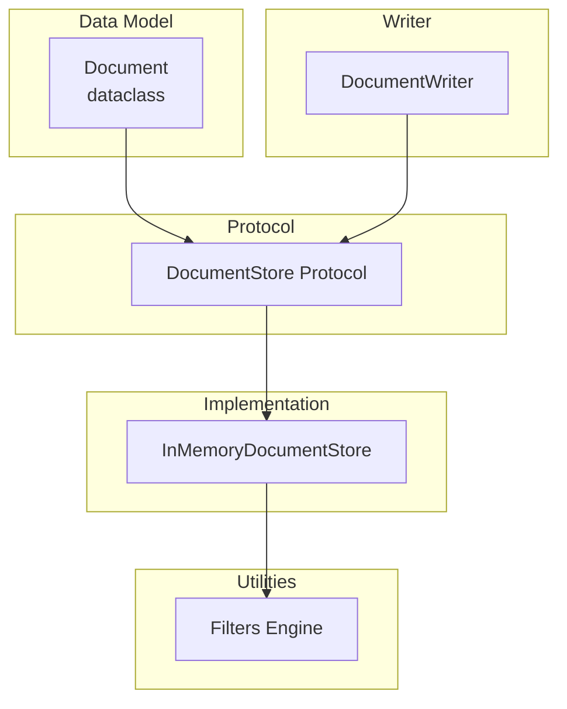
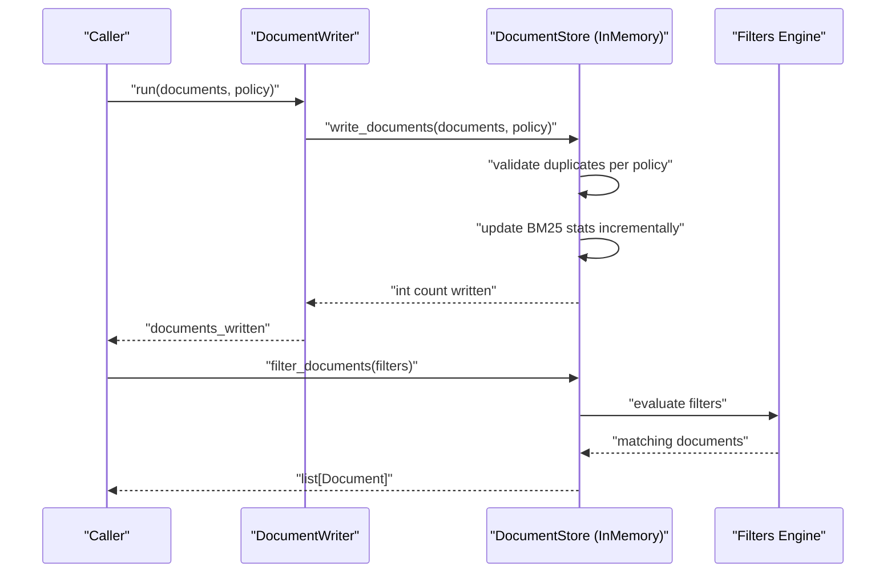
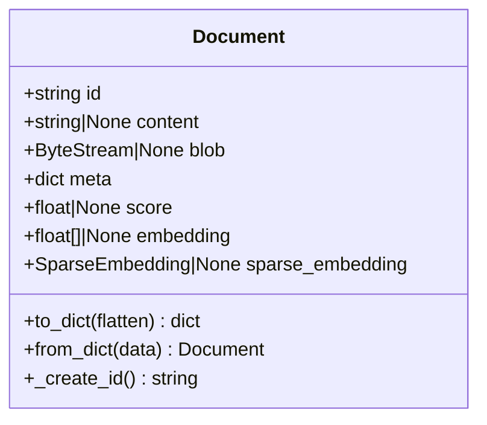
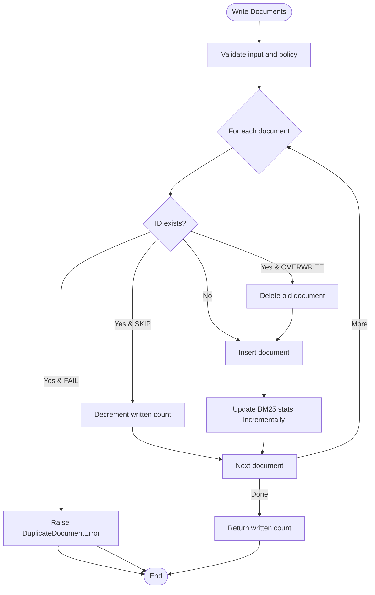
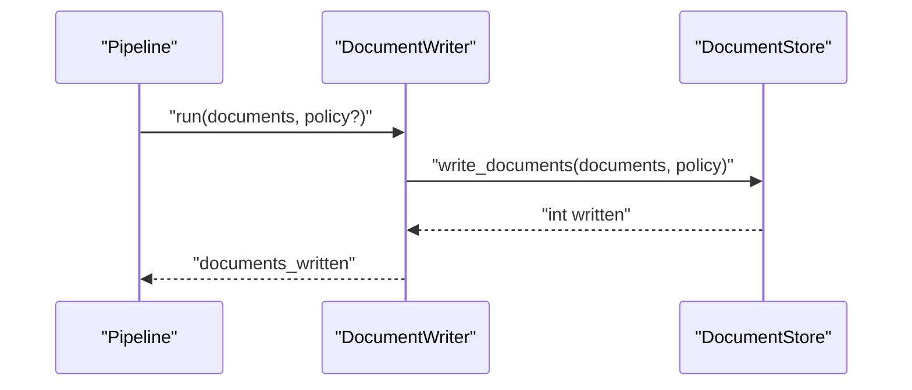
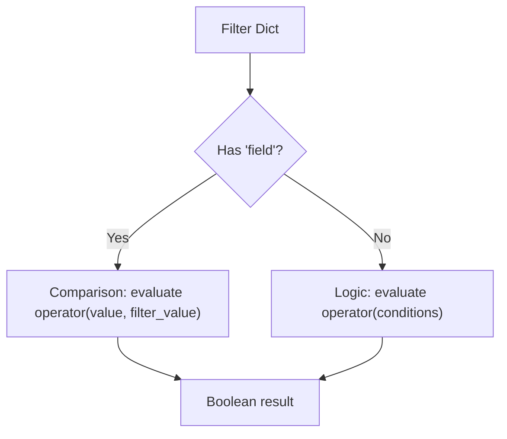
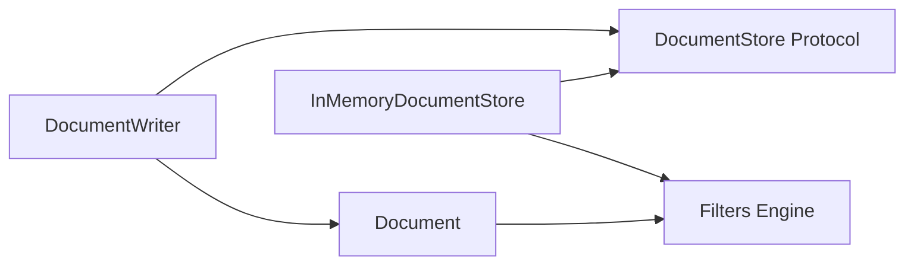

# Document Operations

<cite>
**Referenced Files in This Document**
- [document.py](file://haystack/dataclasses/document.py)
- [protocol.py](file://haystack/document_stores/types/protocol.py)
- [document_store.py](file://haystack/document_stores/in_memory/document_store.py)
- [document_writer.py](file://haystack/components/writers/document_writer.py)
- [filters.py](file://haystack/utils/filters.py)
- [metadata-filtering.mdx](file://docs-website/docs/concepts/metadata-filtering.mdx)
- [document_writers_api.md](file://docs-website/reference/haystack-api/document_writers_api.md)
- [test_in_memory.py](file://test/document_stores/test_in_memory.py)
</cite>

## Table of Contents
1. [Introduction](#introduction)
2. [Project Structure](#project-structure)
3. [Core Components](#core-components)
4. [Architecture Overview](#architecture-overview)
5. [Detailed Component Analysis](#detailed-component-analysis)
6. [Dependency Analysis](#dependency-analysis)
7. [Performance Considerations](#performance-considerations)
8. [Troubleshooting Guide](#troubleshooting-guide)
9. [Conclusion](#conclusion)
10. [Appendices](#appendices)

## Introduction
This document explains how Haystack manages documents across write, read, update, and delete operations. It covers the Document data model, the DocumentStore protocol, concrete in-memory implementations, and the DocumentWriter component. It also details filtering and querying (metadata-based and vector similarity), batch operations, atomic write semantics, retrieval patterns, update mechanisms, deletion strategies, ingestion pipelines, performance tuning, concurrency, error handling, and consistency guarantees.

## Project Structure
The document operations span several modules:
- Data model: Document definition and serialization
- Protocol: DocumentStore interface contract
- Implementation: InMemoryDocumentStore with BM25 and embedding retrieval
- Writer: DocumentWriter component that writes to a DocumentStore
- Utilities: Filter evaluation engine
- Docs: Metadata filtering concepts and API references
- Tests: Behavioral validation of operations

**Diagram sources**
- [document.py](file://haystack/dataclasses/document.py#L48-L190)
- [protocol.py](file://haystack/document_stores/types/protocol.py#L11-L136)
- [document_store.py](file://haystack/document_stores/in_memory/document_store.py#L59-L811)
- [document_writer.py](file://haystack/components/writers/document_writer.py#L11-L128)
- [filters.py](file://haystack/utils/filters.py#L24-L207)

**Section sources**
- [document.py](file://haystack/dataclasses/document.py#L48-L190)
- [protocol.py](file://haystack/document_stores/types/protocol.py#L11-L136)
- [document_store.py](file://haystack/document_stores/in_memory/document_store.py#L59-L811)
- [document_writer.py](file://haystack/components/writers/document_writer.py#L11-L128)
- [filters.py](file://haystack/utils/filters.py#L24-L207)

## Core Components
- Document: The core data structure representing a document with optional content, binary blob, metadata, scores, and embeddings.
- DocumentStore Protocol: Defines the contract for storing and retrieving documents, including write, delete, and filter operations.
- InMemoryDocumentStore: An in-memory implementation supporting BM25 keyword retrieval and vector similarity retrieval, plus filter-based updates and deletions.
- DocumentWriter: A component that writes batches of documents to a DocumentStore with configurable duplicate policies.

Key responsibilities:
- Document: Encapsulates content, metadata, and embeddings; provides serialization and hashing for IDs.
- DocumentStore Protocol: Standardizes CRUD and filtering APIs across stores.
- InMemoryDocumentStore: Implements atomic-like writes, maintains BM25 statistics, and supports vector similarity and BM25 retrieval.
- DocumentWriter: Bridges pipelines/components to the store via a standardized write operation.

**Section sources**
- [document.py](file://haystack/dataclasses/document.py#L48-L190)
- [protocol.py](file://haystack/document_stores/types/protocol.py#L11-L136)
- [document_store.py](file://haystack/document_stores/in_memory/document_store.py#L59-L811)
- [document_writer.py](file://haystack/components/writers/document_writer.py#L11-L128)

## Architecture Overview
The system separates concerns between data modeling, protocol contracts, concrete implementations, and pipeline-facing writers. Filtering is handled centrally and reused by retrieval methods.

**Diagram sources**
- [document_writer.py](file://haystack/components/writers/document_writer.py#L79-L99)
- [protocol.py](file://haystack/document_stores/types/protocol.py#L109-L125)
- [document_store.py](file://haystack/document_stores/in_memory/document_store.py#L418-L437)
- [filters.py](file://haystack/utils/filters.py#L24-L207)

## Detailed Component Analysis

### Document Data Model
- Fields: id, content, blob, meta, score, embedding, sparse_embedding
- Behavior: automatic ID generation based on content and metadata; serialization flattens/unflattens metadata; preserves backward compatibility for legacy fields.

**Diagram sources**
- [document.py](file://haystack/dataclasses/document.py#L48-L190)

**Section sources**
- [document.py](file://haystack/dataclasses/document.py#L48-L190)

### DocumentStore Protocol
Defines the canonical operations:
- count_documents(): int
- filter_documents(filters): list[Document]
- write_documents(documents, policy): int
- delete_documents(document_ids): None

Duplicate policies:
- NONE: default behavior depends on implementation
- SKIP: skip duplicates
- OVERWRITE: overwrite existing
- FAIL: raise error on duplicates

Return value of write_documents indicates number of documents actually written.

**Section sources**
- [protocol.py](file://haystack/document_stores/types/protocol.py#L35-L136)

### InMemoryDocumentStore
Core features:
- Storage: in-memory dictionary keyed by document ID
- BM25 retrieval: supports BM25Okapi, BM25L, BM25Plus; maintains per-document stats and corpus-level IDF/vocabulary
- Vector similarity retrieval: dot_product or cosine similarity; optional score scaling
- Atomic write semantics: per-document overwrite and incremental BM25 statistics update
- Filter-based operations: update_by_filter(), delete_by_filter()
- Async helpers: async wrappers around sync operations

Important behaviors:
- write_documents(): applies DuplicatePolicy; returns number of documents written
- filter_documents(): validates filter syntax; evaluates filters; optionally strips embeddings
- update_by_filter(): merges metadata for matched documents
- delete_by_filter(): deletes matched documents
- delete_all_documents(): clears entire index namespace

**Diagram sources**
- [document_store.py](file://haystack/document_stores/in_memory/document_store.py#L439-L480)

**Section sources**
- [document_store.py](file://haystack/document_stores/in_memory/document_store.py#L59-L811)

### DocumentWriter Component
- Purpose: write batches of documents to a DocumentStore with a configured DuplicatePolicy
- Methods:
  - run(documents, policy?): returns number of documents written
  - run_async(documents, policy?): async variant requiring store to implement async methods
- Telemetry: reports the underlying store type

**Diagram sources**
- [document_writer.py](file://haystack/components/writers/document_writer.py#L79-L99)

**Section sources**
- [document_writer.py](file://haystack/components/writers/document_writer.py#L11-L128)
- [document_writers_api.md](file://docs-website/reference/haystack-api/document_writers_api.md#L126-L130)

### Filtering and Querying
Filter syntax:
- Comparison dictionaries require keys: field, operator, value
- Logic dictionaries require keys: operator, conditions (list of dicts)
- Supported operators:
  - Comparison: "==", "!=", ">", ">=", "<", "<=", "in", "not in"
  - Logic: "NOT", "OR", "AND"

Evaluation:
- document_matches_filter() recursively evaluates filters against a Document
- Supports nested metadata access via dot notation (e.g., meta.field)
- Validates filter syntax and raises FilterError on invalid structures

**Diagram sources**
- [filters.py](file://haystack/utils/filters.py#L24-L207)
- [metadata-filtering.mdx](file://docs-website/docs/concepts/metadata-filtering.mdx#L127-L155)

**Section sources**
- [filters.py](file://haystack/utils/filters.py#L15-L207)
- [metadata-filtering.mdx](file://docs-website/docs/concepts/metadata-filtering.mdx#L127-L155)

### Retrieval Patterns
- ID-based lookup: use filter_documents with a filter selecting a specific ID
- Filter-based queries: pass filters to filter_documents to retrieve matching documents
- Vector similarity: embedding_retrieval(query_embedding, filters, top_k, scale_score)
- Keyword search: bm25_retrieval(query, filters, top_k, scale_score)

Notes:
- BM25 requires content; internal filters ensure content presence when filters are provided
- Vector similarity requires embeddings; documents without embeddings are skipped with warnings
- Scores can be scaled for both BM25 and vector similarity

**Section sources**
- [document_store.py](file://haystack/document_stores/in_memory/document_store.py#L552-L671)
- [test_in_memory.py](file://test/document_stores/test_in_memory.py#L379-L487)

### Batch Operations and Transactions
- Batch writes: write_documents accepts a list of documents; DuplicatePolicy controls handling of duplicates
- Atomicity: per-document overwrite and incremental BM25 statistics update occur during write_documents
- Transactions: No explicit transaction API is defined in the protocol; operations are best-effort per-document writes

**Section sources**
- [protocol.py](file://haystack/document_stores/types/protocol.py#L109-L125)
- [document_store.py](file://haystack/document_stores/in_memory/document_store.py#L439-L480)

### Update Mechanisms
- Partial updates: update_by_filter() merges provided metadata into matched documents
- Metadata modifications: update_by_filter() updates meta fields; storage is updated immediately

**Section sources**
- [document_store.py](file://haystack/document_stores/in_memory/document_store.py#L520-L535)

### Deletion Strategies
- Hard delete: delete_documents(document_ids) removes documents by ID
- Filter-based delete: delete_by_filter(filters) deletes all matching documents
- Bulk clear: delete_all_documents() resets the index namespace

Soft deletes are not implemented in the protocol or in-memory store; use filter-based delete to selectively remove subsets.

**Section sources**
- [protocol.py](file://haystack/document_stores/types/protocol.py#L127-L136)
- [document_store.py](file://haystack/document_stores/in_memory/document_store.py#L511-L550)

### Practical Examples and Workflows
- Document ingestion pipeline:
  - Convert raw content to Document objects
  - Optionally embed documents
  - Write to store via DocumentWriter with desired DuplicatePolicy
- Bulk loading:
  - Prepare a large list of Document objects
  - Call write_documents() once to atomically ingest all
- Data migration:
  - Read from source store (conceptually), transform Documents, write to target store using DocumentWriter

These workflows leverage the standardized APIs and filter engine for selection and updates.

[No sources needed since this section provides general guidance]

### Concurrency and Async Patterns
- Async helpers: filter_documents_async, write_documents_async, delete_documents_async, bm25_retrieval_async, embedding_retrieval_async
- Executor: InMemoryDocumentStore uses a thread pool for async operations
- Concurrent retrievals: tests demonstrate concurrent embedding retrievals using asyncio.gather

**Section sources**
- [document_store.py](file://haystack/document_stores/in_memory/document_store.py#L724-L800)
- [test_in_memory.py](file://test/document_stores/test_in_memory.py#L619-L642)

## Dependency Analysis
High-level dependencies:
- DocumentWriter depends on DocumentStore protocol
- InMemoryDocumentStore implements DocumentStore protocol
- InMemoryDocumentStore uses filters engine for evaluation
- Filters engine operates on Document dataclass

**Diagram sources**
- [document_writer.py](file://haystack/components/writers/document_writer.py#L11-L128)
- [protocol.py](file://haystack/document_stores/types/protocol.py#L11-L136)
- [document_store.py](file://haystack/document_stores/in_memory/document_store.py#L59-L811)
- [filters.py](file://haystack/utils/filters.py#L24-L207)
- [document.py](file://haystack/dataclasses/document.py#L48-L190)

**Section sources**
- [document_writer.py](file://haystack/components/writers/document_writer.py#L11-L128)
- [protocol.py](file://haystack/document_stores/types/protocol.py#L11-L136)
- [document_store.py](file://haystack/document_stores/in_memory/document_store.py#L59-L811)
- [filters.py](file://haystack/utils/filters.py#L24-L207)
- [document.py](file://haystack/dataclasses/document.py#L48-L190)

## Performance Considerations
- BM25 retrieval:
  - Tokenization regex and algorithm selection affect speed and relevance
  - BM25 statistics are updated incrementally; large-scale writes trigger recomputation overhead
- Vector similarity:
  - Cosine normalization adds cost; consider dot_product for simpler metrics
  - Score scaling can improve interpretability but adds computation
- Filtering:
  - Complex filters increase evaluation cost; minimize nested OR conditions when possible
- Embedding consistency:
  - Ensure uniform embedding sizes across documents to avoid costly shape checks
- Concurrency:
  - Use async helpers for parallel retrievals; tune executor thread pool appropriately

[No sources needed since this section provides general guidance]

## Troubleshooting Guide
Common issues and resolutions:
- Invalid filter syntax: Ensure filters include operator and conditions; use documented operator sets
- Duplicate documents: Choose appropriate DuplicatePolicy; FAIL will raise an error, SKIP reduces written count
- Missing embeddings: embedding_retrieval skips documents without embeddings and logs a warning
- Embedding dimension mismatch: write_documents validates duplicate policy; embedding_retrieval validates shapes and sizes
- Async store requirement: DocumentWriter.run_async requires the store to implement async methods

**Section sources**
- [filters.py](file://haystack/utils/filters.py#L15-L22)
- [protocol.py](file://haystack/document_stores/types/protocol.py#L109-L125)
- [document_store.py](file://haystack/document_stores/in_memory/document_store.py#L439-L480)
- [document_store.py](file://haystack/document_stores/in_memory/document_store.py#L643-L648)
- [document_writer.py](file://haystack/components/writers/document_writer.py#L115-L127)

## Conclusion
Haystack’s document management system provides a robust, extensible foundation for ingestion, querying, and maintenance of documents. The DocumentStore protocol ensures consistent behavior across implementations, while InMemoryDocumentStore offers efficient BM25 and vector similarity retrieval. DocumentWriter simplifies batch ingestion in pipelines. Robust filtering, atomic write semantics, and async helpers enable scalable and reliable document operations.

[No sources needed since this section summarizes without analyzing specific files]

## Appendices

### API Reference Highlights
- DocumentStore.write_documents(): returns number of documents written
- DocumentStore.filter_documents(): metadata-based filtering
- InMemoryDocumentStore.update_by_filter(): metadata merge by filter
- InMemoryDocumentStore.delete_by_filter(): delete by filter
- InMemoryDocumentStore.delete_all_documents(): clear index
- DocumentWriter.run()/run_async(): batch write with policy control

**Section sources**
- [protocol.py](file://haystack/document_stores/types/protocol.py#L109-L136)
- [document_store.py](file://haystack/document_stores/in_memory/document_store.py#L520-L550)
- [document_store.py](file://haystack/document_stores/in_memory/document_store.py#L511-L518)
- [document_writer.py](file://haystack/components/writers/document_writer.py#L79-L127)
- [document_writers_api.md](file://docs-website/reference/haystack-api/document_writers_api.md#L126-L139)