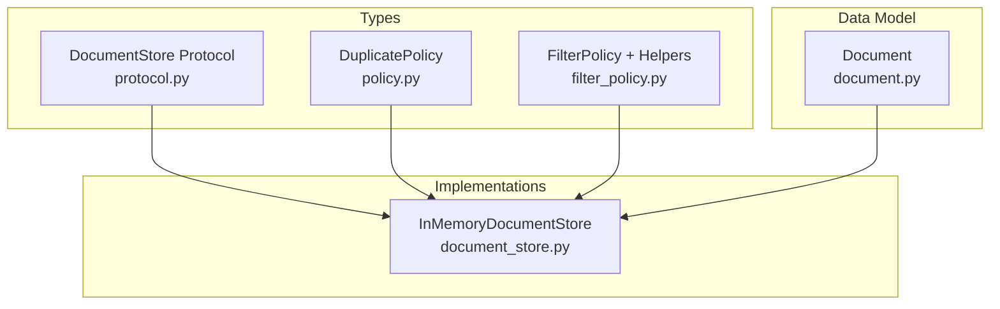
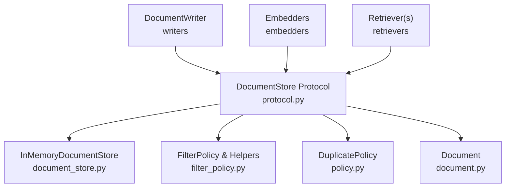
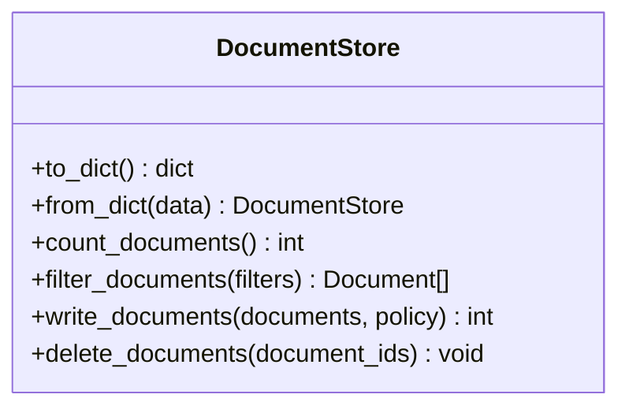
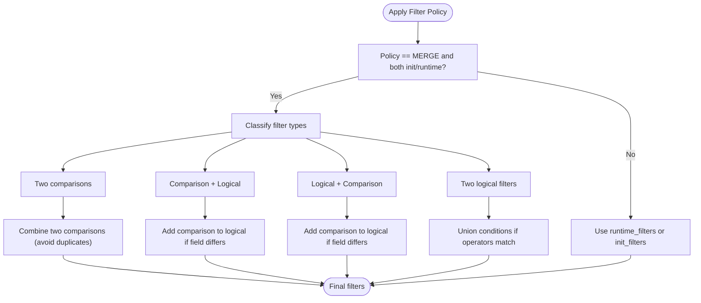
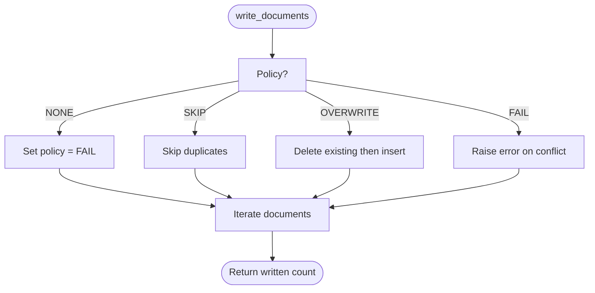
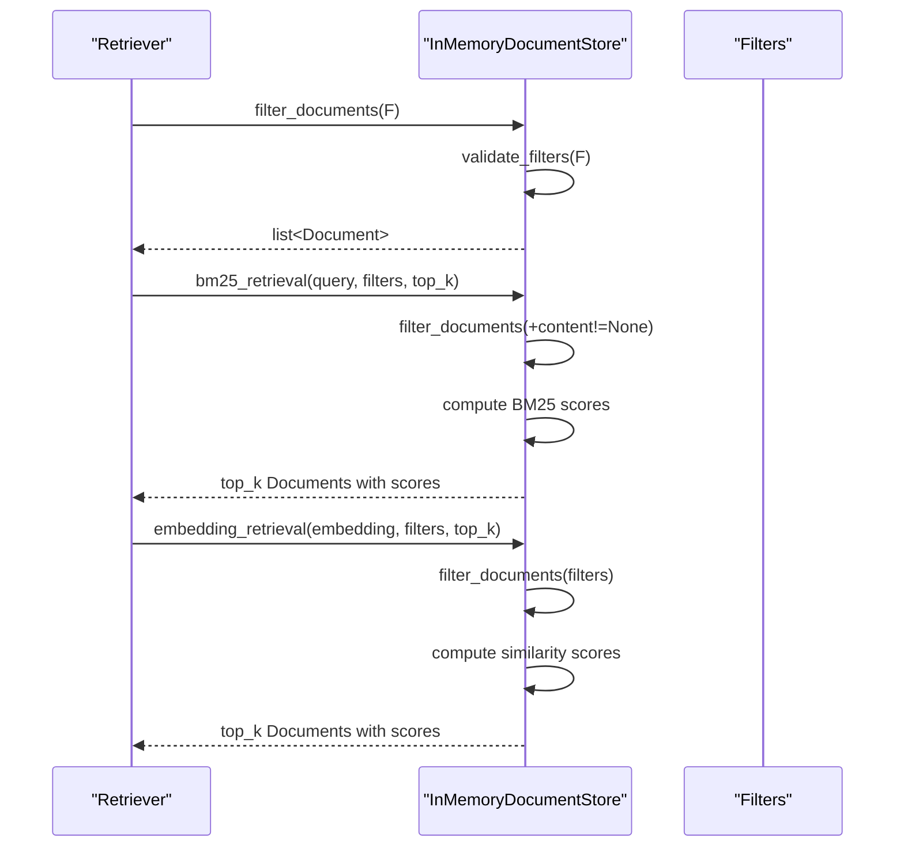
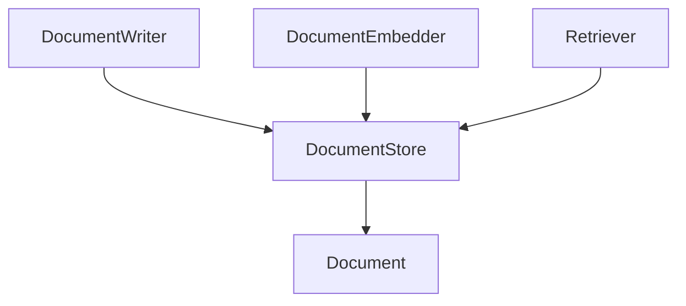
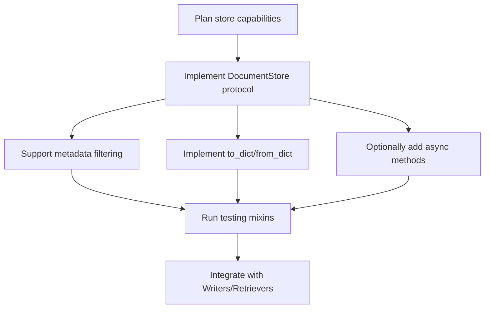
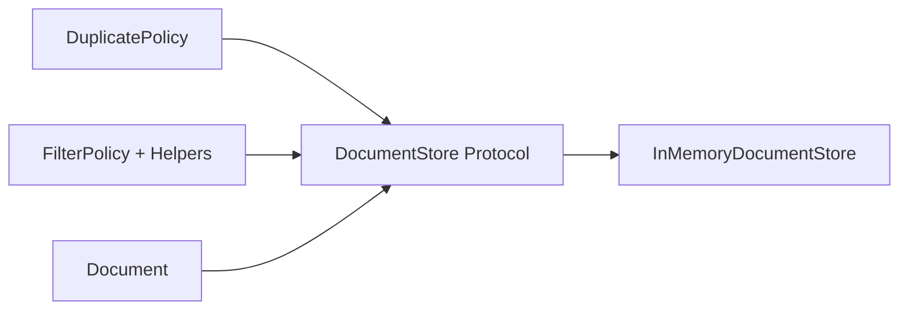

# Document Store Abstraction

<cite>
**Referenced Files in This Document**
- [protocol.py](file://haystack/document_stores/types/protocol.py)
- [filter_policy.py](file://haystack/document_stores/types/filter_policy.py)
- [policy.py](file://haystack/document_stores/types/policy.py)
- [document_store.py](file://haystack/document_stores/in_memory/document_store.py)
- [document.py](file://haystack/dataclasses/document.py)
- [creating-custom-document-stores.mdx](file://docs-website/docs/concepts/document-store/creating-custom-document-stores.mdx)
- [document-store.mdx](file://docs-website/docs/concepts/document-store.mdx)
- [document_store.py (testing)](file://haystack/testing/document_store.py)
</cite>

## Table of Contents
1. [Introduction](#introduction)
2. [Project Structure](#project-structure)
3. [Core Components](#core-components)
4. [Architecture Overview](#architecture-overview)
5. [Detailed Component Analysis](#detailed-component-analysis)
6. [Dependency Analysis](#dependency-analysis)
7. [Performance Considerations](#performance-considerations)
8. [Troubleshooting Guide](#troubleshooting-guide)
9. [Conclusion](#conclusion)
10. [Appendices](#appendices)

## Introduction
This document explains Haystack’s document store abstraction layer: the DocumentStore protocol, its role in the RAG pipeline, and how it enables pluggable storage backends. It covers the abstract methods for document operations (write, read, update, delete, search), filter policy implementations, metadata-based querying, the type system (DuplicatePolicy and FilterPolicy), and the relationships with retrievers and embedders. It also provides guidance for implementing custom document stores and outlines performance and scalability considerations.

## Project Structure
The document store abstraction lives under haystack/document_stores/types and is implemented by concrete stores such as the in-memory store. Supporting utilities include filter policy helpers and testing mixins.

**Diagram sources**
- [protocol.py](file://haystack/document_stores/types/protocol.py#L11-L136)
- [policy.py](file://haystack/document_stores/types/policy.py#L8-L13)
- [filter_policy.py](file://haystack/document_stores/types/filter_policy.py#L13-L320)
- [document_store.py](file://haystack/document_stores/in_memory/document_store.py#L59-L811)
- [document.py](file://haystack/dataclasses/document.py#L48-L190)

**Section sources**
- [protocol.py](file://haystack/document_stores/types/protocol.py#L11-L136)
- [policy.py](file://haystack/document_stores/types/policy.py#L8-L13)
- [filter_policy.py](file://haystack/document_stores/types/filter_policy.py#L13-L320)
- [document_store.py](file://haystack/document_stores/in_memory/document_store.py#L59-L811)
- [document.py](file://haystack/dataclasses/document.py#L48-L190)

## Core Components
- DocumentStore Protocol: Defines the contract for storing and retrieving documents, including CRUD and filtering operations.
- DuplicatePolicy: Enumerates strategies for handling documents with duplicate IDs during write operations.
- FilterPolicy + Helpers: Define how runtime and initialization-time filters are combined or replaced in retrievers.
- InMemoryDocumentStore: Reference implementation demonstrating the protocol, filtering, BM25 and embedding retrieval, and optional async support.
- Document: The core data structure representing stored items with content, metadata, embeddings, and identifiers.

Key responsibilities:
- Protocol: Standardizes operations across backends.
- FilterPolicy: Enables flexible, composable filter semantics for retrievers.
- InMemoryDocumentStore: Demonstrates concrete implementations of filtering, writing, deleting, and retrieval strategies.

**Section sources**
- [protocol.py](file://haystack/document_stores/types/protocol.py#L11-L136)
- [policy.py](file://haystack/document_stores/types/policy.py#L8-L13)
- [filter_policy.py](file://haystack/document_stores/types/filter_policy.py#L13-L320)
- [document_store.py](file://haystack/document_stores/in_memory/document_store.py#L59-L811)
- [document.py](file://haystack/dataclasses/document.py#L48-L190)

## Architecture Overview
The DocumentStore sits between pipeline components (writers, retrievers, embedders) and the storage backend. Retrievers query the store using filters and optionally compute scores via BM25 or embedding similarity. Writers populate the store according to DuplicatePolicy.

**Diagram sources**
- [protocol.py](file://haystack/document_stores/types/protocol.py#L11-L136)
- [filter_policy.py](file://haystack/document_stores/types/filter_policy.py#L13-L320)
- [policy.py](file://haystack/document_stores/types/policy.py#L8-L13)
- [document_store.py](file://haystack/document_stores/in_memory/document_store.py#L59-L811)
- [document.py](file://haystack/dataclasses/document.py#L48-L190)

## Detailed Component Analysis

### DocumentStore Protocol
Defines the canonical interface for document storage and retrieval:
- Serialization: to_dict/from_dict
- Counts: count_documents
- Filtering: filter_documents(filters)
- Writing: write_documents(documents, policy)
- Deleting: delete_documents(document_ids)

Filter syntax supports:
- Comparison filters: field/operator/value
- Logical filters: operator/conditions with operators AND, OR, NOT

DuplicatePolicy controls write behavior when IDs collide.

**Diagram sources**
- [protocol.py](file://haystack/document_stores/types/protocol.py#L11-L136)

**Section sources**
- [protocol.py](file://haystack/document_stores/types/protocol.py#L11-L136)

### FilterPolicy and Metadata-Based Querying
FilterPolicy governs how runtime filters interact with initialization-time filters in retrievers:
- REPLACE: runtime filters fully replace init filters
- MERGE: runtime filters are merged with init filters, with runtime values taking precedence for overlapping fields

Helpers validate filter shapes, detect comparison vs logical filters, and combine filters consistently.

**Diagram sources**
- [filter_policy.py](file://haystack/document_stores/types/filter_policy.py#L283-L320)
- [filter_policy.py](file://haystack/document_stores/types/filter_policy.py#L43-L320)

**Section sources**
- [filter_policy.py](file://haystack/document_stores/types/filter_policy.py#L13-L320)

### DuplicatePolicy
Controls write-time behavior when encountering existing IDs:
- NONE: defaults to FAIL
- SKIP: skip duplicates
- OVERWRITE: replace existing
- FAIL: raise an error

**Diagram sources**
- [policy.py](file://haystack/document_stores/types/policy.py#L8-L13)
- [protocol.py](file://haystack/document_stores/types/protocol.py#L109-L125)
- [document_store.py](file://haystack/document_stores/in_memory/document_store.py#L439-L480)

**Section sources**
- [policy.py](file://haystack/document_stores/types/policy.py#L8-L13)
- [protocol.py](file://haystack/document_stores/types/protocol.py#L109-L125)
- [document_store.py](file://haystack/document_stores/in_memory/document_store.py#L439-L480)

### InMemoryDocumentStore: Implementation Details
- Storage: In-memory dictionary keyed by document ID; optional shared index namespace.
- Filtering: Validates filter syntax and applies them to stored documents.
- BM25 Retrieval: Tokenization, IDF/TF computations, and optional score scaling.
- Embedding Retrieval: Dot-product or cosine similarity with optional score scaling.
- Async Support: Delegates to a thread pool executor for async variants.
- Additional Methods: delete_all_documents, update_by_filter, delete_by_filter (non-protocol methods).

**Diagram sources**
- [document_store.py](file://haystack/document_stores/in_memory/document_store.py#L418-L671)
- [filter_policy.py](file://haystack/document_stores/types/filter_policy.py#L505-L510)

**Section sources**
- [document_store.py](file://haystack/document_stores/in_memory/document_store.py#L59-L811)

### Relationship Between Document Stores and Pipeline Components
- Writers: Populate stores using write_documents with DuplicatePolicy.
- Embedders: Produce embeddings stored in Document.embedding for vector retrieval.
- Retrievers: Query stores using filters and scoring (BM25 or embeddings).
- Document: The unified data model across all components.

**Diagram sources**
- [document-store.mdx](file://docs-website/docs/concepts/document-store.mdx#L14-L17)
- [document.py](file://haystack/dataclasses/document.py#L48-L190)

**Section sources**
- [document-store.mdx](file://docs-website/docs/concepts/document-store.mdx#L14-L17)
- [document.py](file://haystack/dataclasses/document.py#L48-L190)

### Implementing Custom Document Stores
Guidelines:
- Implement the DocumentStore protocol methods: to_dict, from_dict, count_documents, filter_documents, write_documents, delete_documents.
- Optionally implement additional methods (e.g., delete_all_documents, update_by_filter, delete_by_filter) commonly expected by users.
- Provide robust filter validation and serialization support.
- Consider async variants for scalability.
- Use testing mixins to validate behavior against standard expectations.

**Diagram sources**
- [creating-custom-document-stores.mdx](file://docs-website/docs/concepts/document-store/creating-custom-document-stores.mdx#L62-L175)
- [document_store.py (testing)](file://haystack/testing/document_store.py#L44-L954)

**Section sources**
- [creating-custom-document-stores.mdx](file://docs-website/docs/concepts/document-store/creating-custom-document-stores.mdx#L62-L175)
- [document_store.py (testing)](file://haystack/testing/document_store.py#L44-L954)

## Dependency Analysis
- Protocol defines the interface; implementations depend on it.
- FilterPolicy and helpers are used by stores and retrievers to handle filters consistently.
- DuplicatePolicy is used by write_documents to control ID collisions.
- Document is the shared data model across all components.

**Diagram sources**
- [protocol.py](file://haystack/document_stores/types/protocol.py#L11-L136)
- [policy.py](file://haystack/document_stores/types/policy.py#L8-L13)
- [filter_policy.py](file://haystack/document_stores/types/filter_policy.py#L13-L320)
- [document_store.py](file://haystack/document_stores/in_memory/document_store.py#L59-L811)
- [document.py](file://haystack/dataclasses/document.py#L48-L190)

**Section sources**
- [protocol.py](file://haystack/document_stores/types/protocol.py#L11-L136)
- [policy.py](file://haystack/document_stores/types/policy.py#L8-L13)
- [filter_policy.py](file://haystack/document_stores/types/filter_policy.py#L13-L320)
- [document_store.py](file://haystack/document_stores/in_memory/document_store.py#L59-L811)
- [document.py](file://haystack/dataclasses/document.py#L48-L190)

## Performance Considerations
- Filtering cost: Complexity depends on backend indexing and filter shape. Prefer selective filters and leverage backend-specific indexes.
- BM25 scoring: Tokenization and IDF/TF computations are O(V) per query where V is vocabulary size; cache statistics for repeated queries.
- Embedding similarity: Vector operations benefit from normalized vectors (cosine) and batched computation; ensure consistent embedding sizes.
- Async execution: Offload blocking operations to executors to improve throughput in retrievers.
- Scaling patterns: Use sharding, partitioning, or backend-native clustering for large-scale deployments; ensure consistent filter semantics across partitions.

[No sources needed since this section provides general guidance]

## Troubleshooting Guide
Common issues and resolutions:
- Invalid filter syntax: Ensure filters conform to comparison/logical structures; validation raises errors for malformed filters.
- Mismatched embedding dimensions: Embeddings must be consistent; errors are raised when shapes do not align.
- Duplicate ID conflicts: Choose DuplicatePolicy appropriately; FAIL prevents duplicates, SKIP avoids overwrites, OVERWRITE replaces existing.
- Missing metadata fields: Ensure metadata presence and types match filter expectations.

**Section sources**
- [document_store.py](file://haystack/document_stores/in_memory/document_store.py#L505-L510)
- [document_store.py](file://haystack/document_stores/in_memory/document_store.py#L691-L714)
- [document_store.py](file://haystack/document_stores/in_memory/document_store.py#L452-L463)

## Conclusion
The DocumentStore abstraction provides a uniform interface for document storage and retrieval across diverse backends. By adhering to the protocol, leveraging FilterPolicy for flexible querying, and using DuplicatePolicy for controlled writes, developers can implement provider-independent solutions. The in-memory store demonstrates robust filtering, BM25, and embedding retrieval, while testing mixins and documentation guide custom implementations for production-grade reliability and performance.

[No sources needed since this section summarizes without analyzing specific files]

## Appendices

### API Surface Summary
- Protocol methods: to_dict, from_dict, count_documents, filter_documents, write_documents, delete_documents
- Filter syntax: comparison and logical filters
- Policies: DuplicatePolicy (NONE/SKIP/OVERWRITE/FAIL), FilterPolicy (REPLACE/MERGE)
- Data model: Document with content, blob, meta, score, embedding, sparse_embedding

**Section sources**
- [protocol.py](file://haystack/document_stores/types/protocol.py#L11-L136)
- [filter_policy.py](file://haystack/document_stores/types/filter_policy.py#L13-L320)
- [policy.py](file://haystack/document_stores/types/policy.py#L8-L13)
- [document.py](file://haystack/dataclasses/document.py#L48-L190)