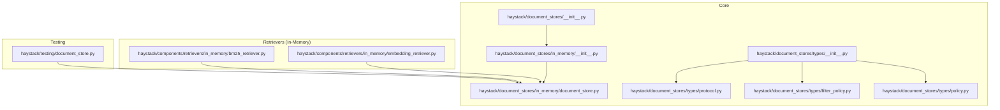
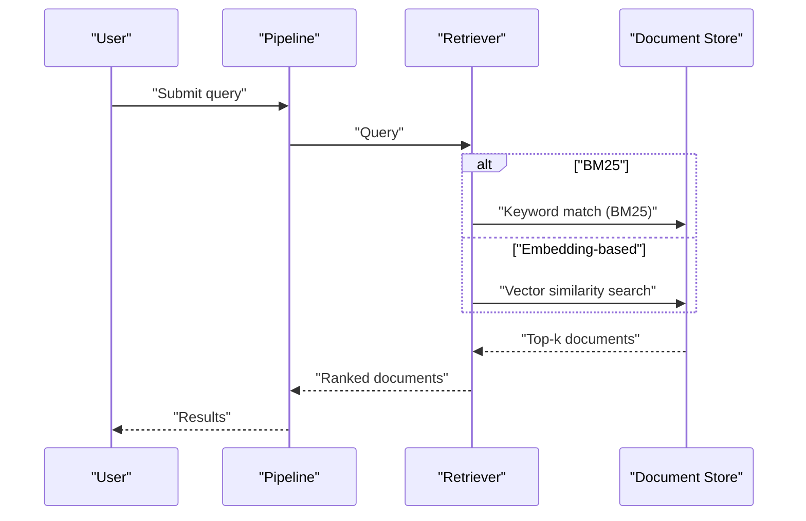
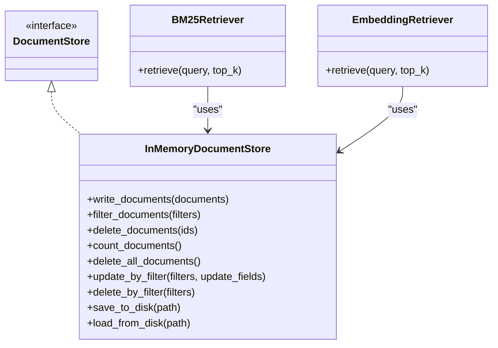
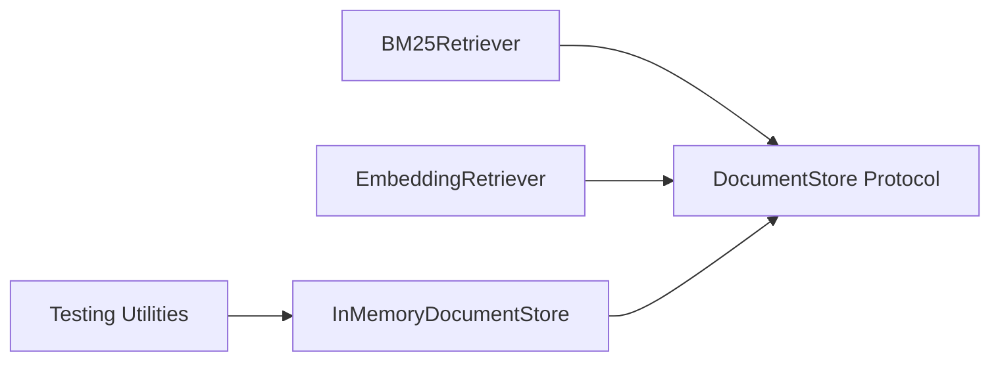

# Document Store Implementations

<cite>
**Referenced Files in This Document**
- [haystack/__init__.py](file://haystack/__init__.py)
- [haystack/document_stores/__init__.py](file://haystack/document_stores/__init__.py)
- [haystack/document_stores/in_memory/__init__.py](file://haystack/document_stores/in_memory/__init__.py)
- [haystack/document_stores/in_memory/document_store.py](file://haystack/document_stores/in_memory/document_store.py)
- [haystack/document_stores/types/__init__.py](file://haystack/document_stores/types/__init__.py)
- [haystack/document_stores/types/protocol.py](file://haystack/document_stores/types/protocol.py)
- [haystack/document_stores/types/filter_policy.py](file://haystack/document_stores/types/filter_policy.py)
- [haystack/document_stores/types/policy.py](file://haystack/document_stores/types/policy.py)
- [haystack/components/retrievers/in_memory/bm25_retriever.py](file://haystack/components/retrievers/in_memory/bm25_retriever.py)
- [haystack/components/retrievers/in_memory/embedding_retriever.py](file://haystack/components/retrievers/in_memory/embedding_retriever.py)
- [haystack/testing/document_store.py](file://haystack/testing/document_store.py)
- [docs-website/docs/document-stores/pinecone-document-store.mdx](file://docs-website/docs/document-stores/pinecone-document-store.mdx)
- [docs-website/versioned_docs/version-2.19/document-stores/opensearch-document-store.mdx](file://docs-website/versioned_docs/version-2.19/document-stores/opensearch-document-store.mdx)
- [docs-website/versioned_docs/version-2.19/pipeline-components/retrievers.mdx](file://docs-website/versioned_docs/version-2.19/pipeline-components/retrievers.mdx)
- [docs-website/versioned_docs/version-2.21/document-stores/chromadocumentstore.mdx](file://docs-website/versioned_docs/version-2.21/document-stores/chromadocumentstore.mdx)
- [e2e/pipelines/test_hybrid_doc_search_pipeline.py](file://e2e/pipelines/test_hybrid_doc_search_pipeline.py)
- [e2e/pipelines/test_dense_doc_search.py](file://e2e/pipelines/test_dense_doc_search.py)
- [e2e/pipelines/test_rag_pipelines_e2e.py](file://e2e/pipelines/test_rag_pipelines_e2e.py)
- [releasenotes/notes/add-serialization-to-inmemorydocumentstore-2aa4d9ac85b961c5.yaml](file://releasenotes/notes/add-serialization-to-inmemorydocumentstore-2aa4d9ac85b961c5.yaml)
- [releasenotes/notes/in-memory-docstore-memory-share-82b75d018b3545fc.yaml](file://releasenotes/notes/in-memory-docstore-memory-share-82b75d018b3545fc.yaml)
- [releasenotes/notes/adding-operations-InMemoryDocStore-24f31b7b95dc8903.yaml](file://releasenotes/notes/adding-operations-InMemoryDocStore-24f31b7b95dc8903.yaml)
- [releasenotes/notes/inmemory-return-written-documents-488b7f90df84bc59.yaml](file://releasenotes/notes/inmemory-return-written-documents-488b7f90df84bc59.yaml)
</cite>

## Table of Contents
1. [Introduction](#introduction)
2. [Project Structure](#project-structure)
3. [Core Components](#core-components)
4. [Architecture Overview](#architecture-overview)
5. [Detailed Component Analysis](#detailed-component-analysis)
6. [Dependency Analysis](#dependency-analysis)
7. [Performance Considerations](#performance-considerations)
8. [Troubleshooting Guide](#troubleshooting-guide)
9. [Conclusion](#conclusion)
10. [Appendices](#appendices)

## Introduction
This document explains Haystack’s document store implementations, focusing on the in-memory default store and integrations with vector databases and search engines. It covers configuration, retrieval strategies (BM25 keyword and embedding-based), hybrid retrieval, indexing approaches, performance characteristics, scaling, clustering, backups, and migration considerations. Practical setup examples are linked from official documentation.

## Project Structure
Haystack organizes document store implementations under a dedicated namespace. The in-memory store is part of the core library and exposes a lazy importer for optional dependencies. The public types define the contract that all stores implement. Integrations for external systems live in separate packages and are referenced here via documentation links.

**Diagram sources**
- [haystack/document_stores/__init__.py](file://haystack/document_stores/__init__.py#L1-L4)
- [haystack/document_stores/in_memory/__init__.py](file://haystack/document_stores/in_memory/__init__.py#L1-L16)
- [haystack/document_stores/in_memory/document_store.py](file://haystack/document_stores/in_memory/document_store.py)
- [haystack/document_stores/types/__init__.py](file://haystack/document_stores/types/__init__.py#L1-L10)
- [haystack/document_stores/types/protocol.py](file://haystack/document_stores/types/protocol.py)
- [haystack/document_stores/types/filter_policy.py](file://haystack/document_stores/types/filter_policy.py)
- [haystack/document_stores/types/policy.py](file://haystack/document_stores/types/policy.py)
- [haystack/components/retrievers/in_memory/bm25_retriever.py](file://haystack/components/retrievers/in_memory/bm25_retriever.py#L1-L40)
- [haystack/components/retrievers/in_memory/embedding_retriever.py](file://haystack/components/retrievers/in_memory/embedding_retriever.py#L1-L40)
- [haystack/testing/document_store.py](file://haystack/testing/document_store.py)

**Section sources**
- [haystack/document_stores/__init__.py](file://haystack/document_stores/__init__.py#L1-L4)
- [haystack/document_stores/in_memory/__init__.py](file://haystack/document_stores/in_memory/__init__.py#L1-L16)
- [haystack/document_stores/types/__init__.py](file://haystack/document_stores/types/__init__.py#L1-L10)

## Core Components
- InMemoryDocumentStore: Default in-memory store with optional persistence and memory sharing across instances. It supports BM25 keyword retrieval and embedding-based retrieval. Recent enhancements include serialization to disk, filter-based updates/deletions, and returning counts from write operations.
- DocumentStore Protocol: Defines the interface that all document stores implement, ensuring consistent behavior across backends.
- Policies: FilterPolicy and DuplicatePolicy govern filtering behavior and how duplicates are handled during writes.

Key capabilities and recent improvements:
- Serialization: Save and load in-memory stores to disk for persistence across sessions.
- Memory sharing: Multiple instances can share memory by using the same index identifier.
- Enhanced operations: delete_all_documents(), update_by_filter(), delete_by_filter().
- Write feedback: write_documents() returns the number of documents actually written.

**Section sources**
- [haystack/document_stores/in_memory/document_store.py](file://haystack/document_stores/in_memory/document_store.py)
- [haystack/document_stores/types/protocol.py](file://haystack/document_stores/types/protocol.py)
- [haystack/document_stores/types/filter_policy.py](file://haystack/document_stores/types/filter_policy.py)
- [haystack/document_stores/types/policy.py](file://haystack/document_stores/types/policy.py)
- [releasenotes/notes/add-serialization-to-inmemorydocumentstore-2aa4d9ac85b961c5.yaml](file://releasenotes/notes/add-serialization-to-inmemorydocumentstore-2aa4d9ac85b961c5.yaml#L1-L4)
- [releasenotes/notes/in-memory-docstore-memory-share-82b75d018b3545fc.yaml](file://releasenotes/notes/in-memory-docstore-memory-share-82b75d018b3545fc.yaml#L1-L19)
- [releasenotes/notes/adding-operations-InMemoryDocStore-24f31b7b95dc8903.yaml](file://releasenotes/notes/adding-operations-InMemoryDocStore-24f31b7b95dc8903.yaml#L1-L4)
- [releasenotes/notes/inmemory-return-written-documents-488b7f90df84bc59.yaml](file://releasenotes/notes/inmemory-return-written-documents-488b7f90df84bc59.yaml#L1-L2)

## Architecture Overview
The retrieval architecture connects user queries to document stores via retrievers. In-memory retrievers demonstrate the two primary retrieval modes: BM25 keyword search and embedding similarity search. External stores integrate via dedicated document store implementations and compatible retrievers.

[No sources needed since this diagram shows conceptual workflow, not actual code structure]

## Detailed Component Analysis

### In-Memory Document Store
- Purpose: Default, fast, in-process store suitable for prototyping and small-scale deployments.
- Retrieval modes:
  - BM25 keyword retrieval: Suitable for lexical matching and fast keyword search.
  - Embedding-based retrieval: Uses dense vectors for semantic similarity.
- Configuration highlights:
  - Index-based memory sharing across instances.
  - Optional persistence via disk serialization.
  - Filter policy and duplicate handling policies.
- Operations:
  - Write, update, delete, count, and bulk operations.
  - Filtered updates and deletions.
  - Returns number of documents written for write_documents().

**Diagram sources**
- [haystack/document_stores/types/protocol.py](file://haystack/document_stores/types/protocol.py)
- [haystack/document_stores/in_memory/document_store.py](file://haystack/document_stores/in_memory/document_store.py)
- [haystack/components/retrievers/in_memory/bm25_retriever.py](file://haystack/components/retrievers/in_memory/bm25_retriever.py#L1-L40)
- [haystack/components/retrievers/in_memory/embedding_retriever.py](file://haystack/components/retrievers/in_memory/embedding_retriever.py#L1-L40)

**Section sources**
- [haystack/document_stores/in_memory/document_store.py](file://haystack/document_stores/in_memory/document_store.py)
- [haystack/components/retrievers/in_memory/bm25_retriever.py](file://haystack/components/retrievers/in_memory/bm25_retriever.py#L1-L40)
- [haystack/components/retrievers/in_memory/embedding_retriever.py](file://haystack/components/retrievers/in_memory/embedding_retriever.py#L1-L40)
- [haystack/document_stores/types/protocol.py](file://haystack/document_stores/types/protocol.py)
- [haystack/document_stores/types/filter_policy.py](file://haystack/document_stores/types/filter_policy.py)
- [haystack/document_stores/types/policy.py](file://haystack/document_stores/types/policy.py)

### Vector Databases and Search Engines
This section summarizes official documentation references for external integrations. Consult the linked guides for detailed setup, configuration, and supported retrievers.

- Chroma
  - Modes: In-memory, persistent disk, and remote HTTP server.
  - Typical use: Lightweight vector DB for development and small production workloads.
  - Retrievers: Embedding-based and query-text retrievers.
  - Example setup and connection parameters are documented in the linked guide.

- FAISS
  - Modes: Local in-memory and persisted indices.
  - Typical use: Efficient similarity search for moderate to large-scale embedding retrieval.
  - Retrievers: Embedding-based retriever compatible with FAISS-backed stores.

- Pinecone
  - Modes: Managed cloud service.
  - Typical use: Production-grade vector search with scalability and managed operations.
  - Retrievers: Embedding-based retriever compatible with Pinecone.

- Qdrant
  - Modes: Self-hosted or managed, supports dense and sparse embeddings.
  - Typical use: Hybrid retrieval combining dense and sparse vectors.
  - Retrievers: Dense, sparse, and hybrid retrievers.

- Weaviate
  - Modes: Self-hosted or managed.
  - Typical use: Semantic search with schema flexibility and GraphQL-like querying.
  - Retrievers: Embedding-based and hybrid retrievers (depending on configuration).

- Elasticsearch
  - Modes: Self-managed or cloud-hosted.
  - Typical use: Full-text search with BM25 and vector similarity.
  - Retrievers: BM25 and embedding-based retrievers.

- OpenSearch
  - Modes: Self-managed or cloud-hosted.
  - Typical use: Drop-in replacement for Elasticsearch with similar retrieval features.
  - Retrievers: BM25 and embedding-based retrievers.

- Azure Cognitive Search
  - Modes: Fully managed cloud service.
  - Typical use: Enterprise search with hybrid capabilities.
  - Retrievers: BM25 and hybrid retrievers.

Practical setup examples and configuration parameters are provided in the respective documentation pages linked below.

**Section sources**
- [docs-website/versioned_docs/version-2.21/document-stores/chromadocumentstore.mdx](file://docs-website/versioned_docs/version-2.21/document-stores/chromadocumentstore.mdx#L54-L90)
- [docs-website/docs/document-stores/pinecone-document-store.mdx](file://docs-website/docs/document-stores/pinecone-document-store.mdx#L54-L67)
- [docs-website/versioned_docs/version-2.19/document-stores/opensearch-document-store.mdx](file://docs-website/versioned_docs/version-2.19/document-stores/opensearch-document-store.mdx#L1-L76)
- [docs-website/versioned_docs/version-2.19/pipeline-components/retrievers.mdx](file://docs-website/versioned_docs/version-2.19/pipeline-components/retrievers.mdx#L137-L142)
- [docs-website/versioned_docs/version-2.19/pipeline-components/retrievers.mdx](file://docs-website/versioned_docs/version-2.19/pipeline-components/retrievers.mdx#L150-L155)
- [docs-website/versioned_docs/version-2.19/pipeline-components/retrievers.mdx](file://docs-website/versioned_docs/version-2.19/pipeline-components/retrievers.mdx#L162-L167)

### Hybrid Retrieval Approaches
Hybrid retrieval combines lexical (keyword) and semantic (embedding) signals. Examples include:
- Qdrant hybrid retriever: Combines dense and sparse embeddings.
- Azure Cognitive Search hybrid retriever: Supports BM25 plus vector similarity.
- Elasticsearch/OpenSearch hybrid retrievers: Combine BM25 and vector search.

These approaches often improve recall and robustness compared to single-modal retrieval.

**Section sources**
- [docs-website/versioned_docs/version-2.19/pipeline-components/retrievers.mdx](file://docs-website/versioned_docs/version-2.19/pipeline-components/retrievers.mdx#L137-L142)
- [docs-website/versioned_docs/version-2.19/pipeline-components/retrievers.mdx](file://docs-website/versioned_docs/version-2.19/pipeline-components/retrievers.mdx#L162-L167)

### Indexing Strategies and Similarity Search Algorithms
- BM25 (keyword):
  - Lexical matching; effective for precise term retrieval.
  - Configurable parameters (k1, b) influence scoring behavior.
- Embedding-based similarity:
  - Cosine, dot-product, or Euclidean distance depending on store and configuration.
  - Often paired with normalization and unit-vector embeddings.
- Hybrid indexing:
  - Maintains both text and vector representations for combined ranking.

[No sources needed since this section provides general guidance]

### Practical Setup Examples
- In-memory store usage and retrievers are exercised in end-to-end tests.
- Chroma, Pinecone, OpenSearch, and other stores provide runnable examples in their documentation pages.

**Section sources**
- [e2e/pipelines/test_hybrid_doc_search_pipeline.py](file://e2e/pipelines/test_hybrid_doc_search_pipeline.py)
- [e2e/pipelines/test_dense_doc_search.py](file://e2e/pipelines/test_dense_doc_search.py)
- [e2e/pipelines/test_rag_pipelines_e2e.py](file://e2e/pipelines/test_rag_pipelines_e2e.py)
- [docs-website/versioned_docs/version-2.21/document-stores/chromadocumentstore.mdx](file://docs-website/versioned_docs/version-2.21/document-stores/chromadocumentstore.mdx#L54-L90)
- [docs-website/docs/document-stores/pinecone-document-store.mdx](file://docs-website/docs/document-stores/pinecone-document-store.mdx#L54-L67)
- [docs-website/versioned_docs/version-2.19/document-stores/opensearch-document-store.mdx](file://docs-website/versioned_docs/version-2.19/document-stores/opensearch-document-store.mdx#L27-L76)

## Dependency Analysis
The in-memory store is a core component with minimal internal dependencies. Retrievers depend on the DocumentStore protocol, enabling interchangeable backends. External stores are integrated via separate packages and referenced through documentation.

**Diagram sources**
- [haystack/components/retrievers/in_memory/bm25_retriever.py](file://haystack/components/retrievers/in_memory/bm25_retriever.py#L1-L40)
- [haystack/components/retrievers/in_memory/embedding_retriever.py](file://haystack/components/retrievers/in_memory/embedding_retriever.py#L1-L40)
- [haystack/document_stores/types/protocol.py](file://haystack/document_stores/types/protocol.py)
- [haystack/document_stores/in_memory/document_store.py](file://haystack/document_stores/in_memory/document_store.py)
- [haystack/testing/document_store.py](file://haystack/testing/document_store.py)

**Section sources**
- [haystack/components/retrievers/in_memory/bm25_retriever.py](file://haystack/components/retrievers/in_memory/bm25_retriever.py#L1-L40)
- [haystack/components/retrievers/in_memory/embedding_retriever.py](file://haystack/components/retrievers/in_memory/embedding_retriever.py#L1-L40)
- [haystack/document_stores/types/protocol.py](file://haystack/document_stores/types/protocol.py)
- [haystack/testing/document_store.py](file://haystack/testing/document_store.py)

## Performance Considerations
- In-memory store:
  - Fast for small datasets and iteration.
  - Limited by host memory; consider serialization for persistence.
  - Sharing memory across instances reduces duplication and improves throughput.
- Vector databases and search engines:
  - Scale horizontally; choose indexing and similarity parameters per workload.
  - Use pagination and top-k limiting to control latency.
  - Hybrid approaches can reduce false negatives but may increase latency.
- Retrieval algorithms:
  - BM25 is efficient for keyword-heavy queries.
  - Embedding-based search benefits from pre-normalized vectors and optimized backends.

[No sources needed since this section provides general guidance]

## Troubleshooting Guide
- Verify store initialization and connection parameters before writing documents.
- For in-memory store:
  - Confirm index sharing if expecting cross-instance visibility.
  - Use serialization methods to persist state when needed.
  - Utilize filtered operations to manage data lifecycle.
- For external stores:
  - Check network connectivity and credentials.
  - Validate index existence and schema alignment with embeddings.
  - Review retriever compatibility with the chosen store.

**Section sources**
- [releasenotes/notes/add-serialization-to-inmemorydocumentstore-2aa4d9ac85b961c5.yaml](file://releasenotes/notes/add-serialization-to-inmemorydocumentstore-2aa4d9ac85b961c5.yaml#L1-L4)
- [releasenotes/notes/in-memory-docstore-memory-share-82b75d018b3545fc.yaml](file://releasenotes/notes/in-memory-docstore-memory-share-82b75d018b3545fc.yaml#L1-L19)
- [releasenotes/notes/adding-operations-InMemoryDocStore-24f31b7b95dc8903.yaml](file://releasenotes/notes/adding-operations-InMemoryDocStore-24f31b7b95dc8903.yaml#L1-L4)

## Conclusion
Haystack’s document store ecosystem offers a flexible, extensible foundation. The in-memory store provides a fast default with robust retrieval modes and recent operational enhancements. External integrations enable production-ready scaling and advanced features like hybrid retrieval. Choose the backend aligned with your data scale, latency targets, and operational model, and leverage the provided retrievers and policies for consistent behavior.

[No sources needed since this section summarizes without analyzing specific files]

## Appendices

### Appendix A: End-to-End Pipelines Using In-Memory Store
- Hybrid document search pipeline
- Dense document search pipeline
- RAG pipelines

These pipelines demonstrate BM25 and embedding-based retrieval with the in-memory store.

**Section sources**
- [e2e/pipelines/test_hybrid_doc_search_pipeline.py](file://e2e/pipelines/test_hybrid_doc_search_pipeline.py)
- [e2e/pipelines/test_dense_doc_search.py](file://e2e/pipelines/test_dense_doc_search.py)
- [e2e/pipelines/test_rag_pipelines_e2e.py](file://e2e/pipelines/test_rag_pipelines_e2e.py)

### Appendix B: Retrievers and Compatibility
- In-memory retrievers: BM25 and embedding-based.
- External retrievers: Compatible with Chroma, Elasticsearch, OpenSearch, Pinecone, Qdrant, Weaviate, and Azure Cognitive Search.

Consult the retrievers page for detailed compatibility matrices.

**Section sources**
- [docs-website/versioned_docs/version-2.19/pipeline-components/retrievers.mdx](file://docs-website/versioned_docs/version-2.19/pipeline-components/retrievers.mdx#L137-L142)
- [docs-website/versioned_docs/version-2.19/pipeline-components/retrievers.mdx](file://docs-website/versioned_docs/version-2.19/pipeline-components/retrievers.mdx#L150-L155)
- [docs-website/versioned_docs/version-2.19/pipeline-components/retrievers.mdx](file://docs-website/versioned_docs/version-2.19/pipeline-components/retrievers.mdx#L162-L167)