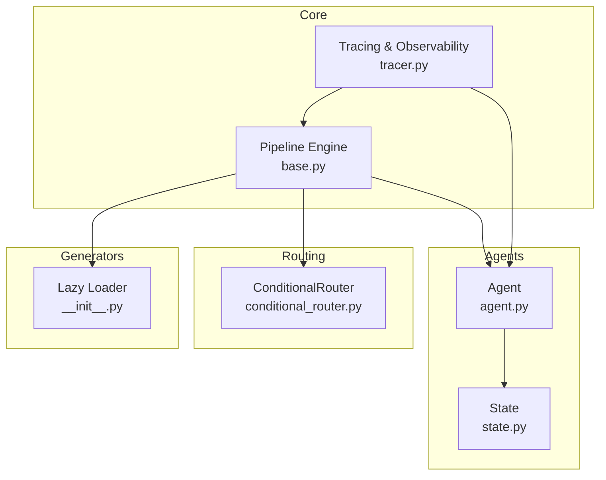
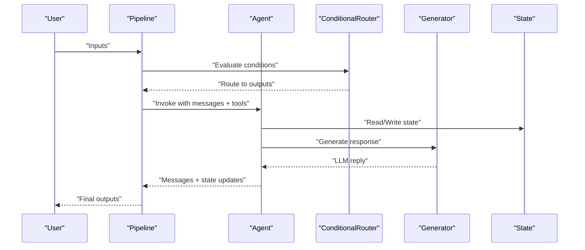
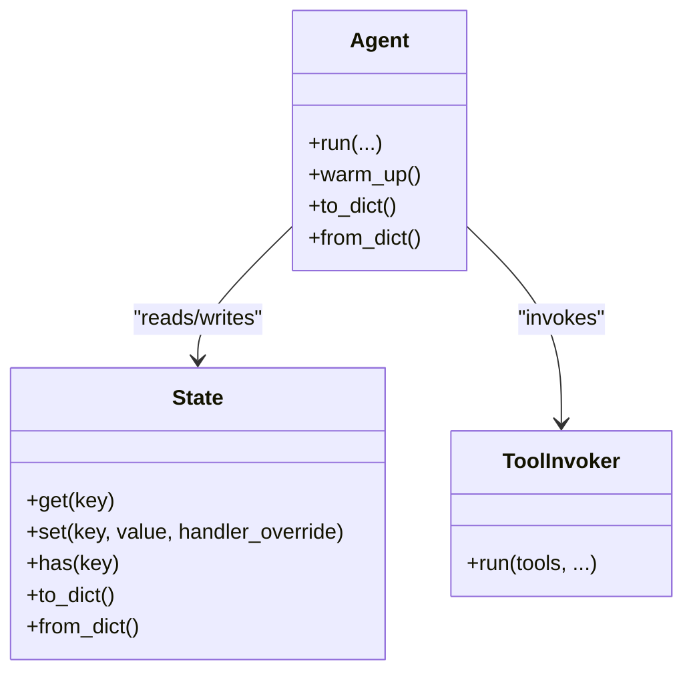
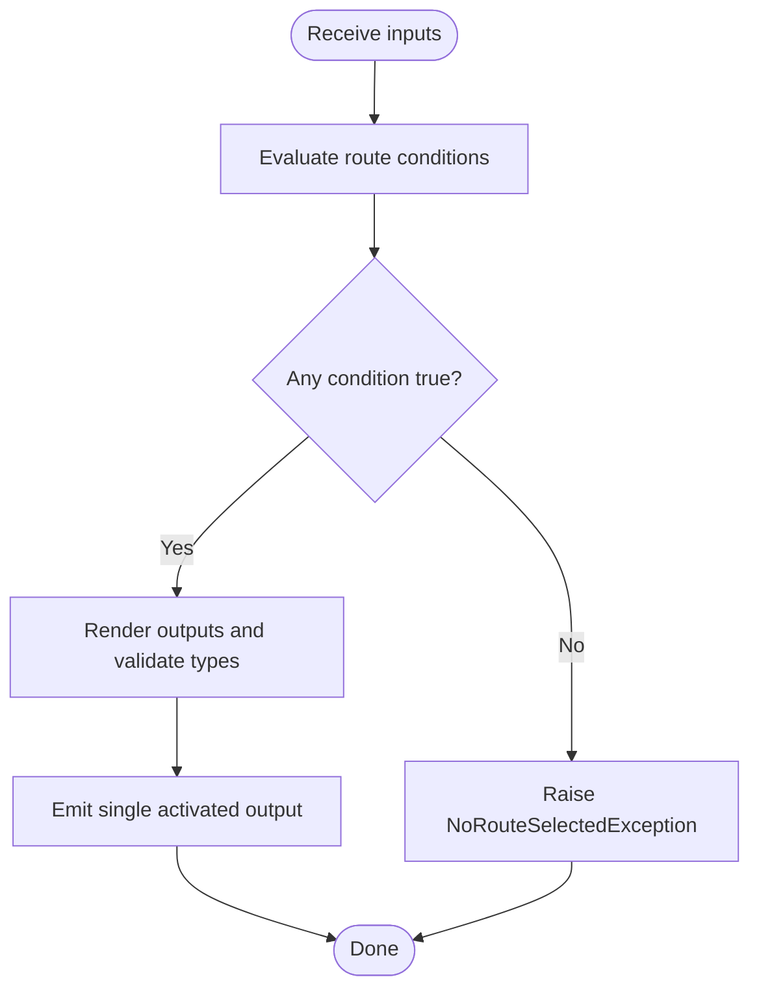
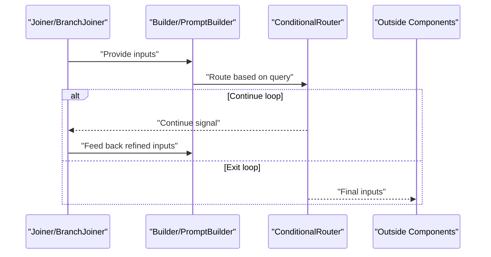
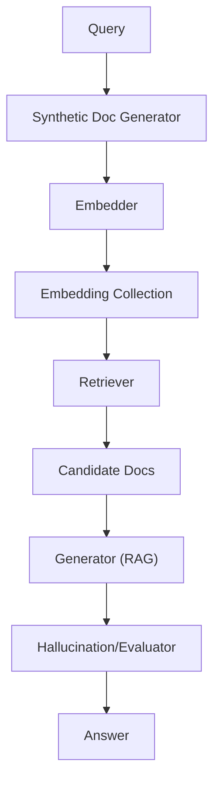
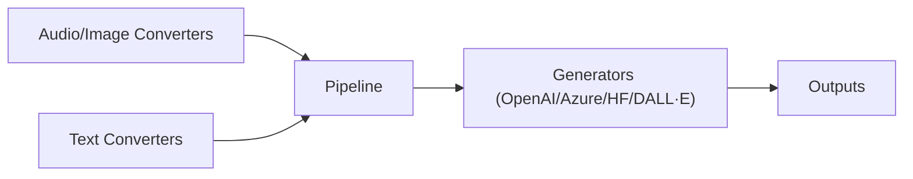
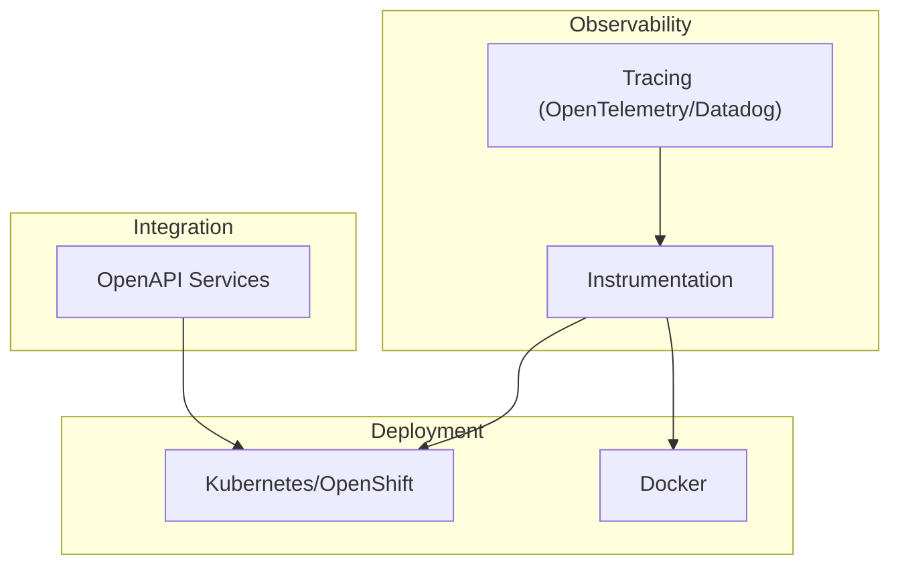
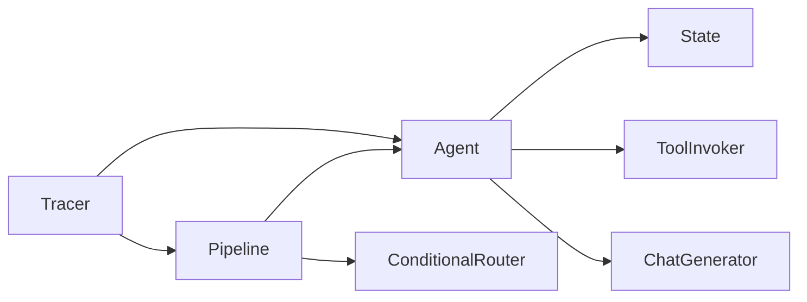

# Advanced Patterns and Architectures

<cite>
**Referenced Files in This Document**
- [README.md](file://README.md)
- [agent.py](file://haystack/components/agents/agent.py)
- [state.py](file://haystack/components/agents/state/state.py)
- [conditional_router.py](file://haystack/components/routers/conditional_router.py)
- [base.py](file://haystack/core/pipeline/base.py)
- [tracer.py](file://haystack/tracing/tracer.py)
- [__init__.py](file://haystack/components/generators/__init__.py)
- [test_run.py](file://test/core/pipeline/features/test_run.py)
- [hypothetical-document-embeddings-hyde.mdx](file://docs-website/docs/optimization/advanced-rag-techniques/hypothetical-document-embeddings-hyde.mdx)
- [openaigenerator.mdx](file://docs-website/docs/pipeline-components/generators/openaigenerator.mdx)
- [agents.mdx](file://docs-website/docs/concepts/agents.mdx)
- [notes-conditional-router-optional-parameters.yaml](file://releasenotes/notes/conditional-router-optional-parameters-f02c598d7c751868.yaml)
- [notes-add-router.yaml](file://releasenotes/notes/add-router-f1f0cec79b1efe9a.yaml)
- [notes-code-instrumentation.yaml](file://releasenotes/notes/code-instrumentation-9ef657728bec3508.yaml)
- [notes-add-rag-openapi-services.yaml](file://releasenotes/notes/add-rag-openapi-services-f3e377c49ff0f258.yaml)
- [notes-complex-types-openapi-support.yaml](file://releasenotes/notes/complex-types-openapi-support-84d3daf8927ad915.yaml)
</cite>

## Table of Contents
1. [Introduction](#introduction)
2. [Project Structure](#project-structure)
3. [Core Components](#core-components)
4. [Architecture Overview](#architecture-overview)
5. [Detailed Component Analysis](#detailed-component-analysis)
6. [Dependency Analysis](#dependency-analysis)
7. [Performance Considerations](#performance-considerations)
8. [Troubleshooting Guide](#troubleshooting-guide)
9. [Conclusion](#conclusion)
10. [Appendices](#appendices)

## Introduction
This document presents advanced patterns and architectures for building production-ready systems with Haystack. It covers agent-based systems with memory, tool usage, and decision-making; complex pipeline designs including conditional routing, parallel processing, and iterative refinement loops; advanced RAG techniques such as hypothetical document embeddings, self-query generation, and hallucination detection; multi-modal processing; custom generator integration; enterprise-scale deployments; and monitoring, observability, and production readiness patterns with microservice integration and distributed processing.

## Project Structure
At a high level, Haystack provides:
- A modular component model (agents, routers, generators, retrievers, etc.)
- A pipeline engine for orchestrating components with explicit control over data flow
- Observability and tracing hooks for production monitoring
- Extensive documentation and examples for advanced patterns

**Diagram sources**
- [base.py](file://haystack/core/pipeline/base.py#L81-L125)
- [tracer.py](file://haystack/tracing/tracer.py#L82-L166)
- [agent.py](file://haystack/components/agents/agent.py#L104-L126)
- [state.py](file://haystack/components/agents/state/state.py#L82-L113)
- [conditional_router.py](file://haystack/components/routers/conditional_router.py#L38-L83)
- [__init__.py](file://haystack/components/generators/__init__.py#L10-L26)

**Section sources**
- [README.md](file://README.md#L12-L70)
- [base.py](file://haystack/core/pipeline/base.py#L81-L125)
- [agents.mdx](file://docs-website/docs/concepts/agents.mdx#L30-L47)

## Core Components
- Agent: Orchestrates LLM interactions, tool usage, and memory-backed state with configurable exit conditions and streaming.
- State: Typed, schema-driven memory for agents and tools, supporting merging and replacement strategies.
- ConditionalRouter: Evaluates Jinja2-based conditions to route data to named outputs, enabling branching and fallback logic.
- Pipeline: Graph-based orchestration engine with connection type validation, serialization, and visualization.
- Generators: Pluggable LLM interfaces (OpenAI, Azure, Hugging Face, DALL·E) with streaming support.
- Tracing: Instrumentation hooks for OpenTelemetry and Datadog, with environment-based toggles.

**Section sources**
- [agent.py](file://haystack/components/agents/agent.py#L104-L126)
- [state.py](file://haystack/components/agents/state/state.py#L82-L113)
- [conditional_router.py](file://haystack/components/routers/conditional_router.py#L38-L83)
- [base.py](file://haystack/core/pipeline/base.py#L81-L125)
- [__init__.py](file://haystack/components/generators/__init__.py#L10-L26)
- [tracer.py](file://haystack/tracing/tracer.py#L82-L166)

## Architecture Overview
The advanced architecture combines:
- Agent-driven orchestration with tool invocation and memory
- Conditional routing for dynamic branching and fallbacks
- Iterative refinement loops for multi-step reasoning
- Parallel processing via multiple pipeline branches
- Observability and tracing for production monitoring

**Diagram sources**
- [agent.py](file://haystack/components/agents/agent.py#L741-L787)
- [state.py](file://haystack/components/agents/state/state.py#L143-L174)
- [conditional_router.py](file://haystack/components/routers/conditional_router.py#L306-L375)
- [base.py](file://haystack/core/pipeline/base.py#L439-L644)

## Detailed Component Analysis

### Agent-Based Systems with Memory, Tools, and Decision-Making
- Memory: State schema defines typed fields and handlers; messages are automatically tracked and merged.
- Tools: ToolInvoker integrates with the Agent to execute tools and optionally require human confirmation.
- Decision-making: Exit conditions and breakpoints enable deterministic termination and interactive control.
- Streaming: Optional streaming callback propagates both LLM chunks and tool results.

**Diagram sources**
- [agent.py](file://haystack/components/agents/agent.py#L228-L357)
- [state.py](file://haystack/components/agents/state/state.py#L115-L142)

**Section sources**
- [agent.py](file://haystack/components/agents/agent.py#L228-L357)
- [state.py](file://haystack/components/agents/state/state.py#L115-L142)
- [agents.mdx](file://docs-website/docs/concepts/agents.mdx#L30-L47)

### Conditional Routing and Fallback Behavior
- Routes are defined with Jinja2 conditions, outputs, and output types.
- Optional variables allow graceful handling of missing inputs with default/fallback routing.
- Validation ensures route consistency and safe template evaluation.

**Diagram sources**
- [conditional_router.py](file://haystack/components/routers/conditional_router.py#L306-L375)
- [notes-conditional-router-optional-parameters.yaml](file://releasenotes/notes/conditional-router-optional-parameters-f02c598d7c751868.yaml#L1-L4)
- [notes-add-router.yaml](file://releasenotes/notes/add-router-f1f0cec79b1efe9a.yaml#L1-L6)

**Section sources**
- [conditional_router.py](file://haystack/components/routers/conditional_router.py#L121-L193)
- [notes-conditional-router-optional-parameters.yaml](file://releasenotes/notes/conditional-router-optional-parameters-f02c598d7c751868.yaml#L1-L4)
- [notes-add-router.yaml](file://releasenotes/notes/add-router-f1f0cec79b1efe9a.yaml#L1-L6)

### Iterative Refinement Loops and Parallel Processing
- Iterative loops: A router can route outputs back into pipeline inputs to refine results until an exit condition is met.
- Parallel processing: Multiple branches can run concurrently; outputs are joined via joiners or merged into a single component.

**Diagram sources**
- [test_run.py](file://test/core/pipeline/features/test_run.py#L4724-L4791)

**Section sources**
- [test_run.py](file://test/core/pipeline/features/test_run.py#L4724-L4791)

### Advanced RAG Techniques
- Hypothetical Document Embeddings (HyDE): Generates synthetic documents from queries, embeds them, and retrieves relevant real documents.
- Self-query generation: Enables retrieval guided by query decomposition into filters and text terms.
- Hallucination detection: Integrates with evaluators and guardrails to detect and mitigate unreliable outputs.

**Diagram sources**
- [hypothetical-document-embeddings-hyde.mdx](file://docs-website/docs/optimization/advanced-rag-techniques/hypothetical-document-embeddings-hyde.mdx#L21-L35)

**Section sources**
- [hypothetical-document-embeddings-hyde.mdx](file://docs-website/docs/optimization/advanced-rag-techniques/hypothetical-document-embeddings-hyde.mdx#L21-L35)

### Multi-Modal Processing and Custom Generator Integration
- Multi-modal: Converters and audio components enable ingestion of diverse content types.
- Custom generators: Generators are lazily imported and integrated via a unified interface; examples include OpenAI, Azure OpenAI, Hugging Face, and DALL·E.

**Diagram sources**
- [__init__.py](file://haystack/components/generators/__init__.py#L10-L26)
- [openaigenerator.mdx](file://docs-website/docs/pipeline-components/generators/openaigenerator.mdx#L55-L84)

**Section sources**
- [__init__.py](file://haystack/components/generators/__init__.py#L10-L26)
- [openaigenerator.mdx](file://docs-website/docs/pipeline-components/generators/openaigenerator.mdx#L55-L84)

### Enterprise-Scale Deployments and Microservice Integration
- Deployment: Docker, Kubernetes, and OpenShift deployment guides are available.
- Monitoring: Code instrumentation and tracing support for OpenTelemetry and Datadog.
- OpenAPI services: RAG and OpenAPI services integration with enhanced complex-type handling.

**Diagram sources**
- [notes-code-instrumentation.yaml](file://releasenotes/notes/code-instrumentation-9ef657728bec3508.yaml#L1-L33)
- [notes-add-rag-openapi-services.yaml](file://releasenotes/notes/add-rag-openapi-services-f3e377c49ff0f258.yaml#L1-L4)
- [notes-complex-types-openapi-support.yaml](file://releasenotes/notes/complex-types-openapi-support-84d3daf8927ad915.yaml#L1-L4)

**Section sources**
- [notes-code-instrumentation.yaml](file://releasenotes/notes/code-instrumentation-9ef657728bec3508.yaml#L1-L33)
- [notes-add-rag-openapi-services.yaml](file://releasenotes/notes/add-rag-openapi-services-f3e377c49ff0f258.yaml#L1-L4)
- [notes-complex-types-openapi-support.yaml](file://releasenotes/notes/complex-types-openapi-support-84d3daf8927ad915.yaml#L1-L4)

## Dependency Analysis
- Agent depends on State, ToolInvoker, and a ChatGenerator supporting tools.
- ConditionalRouter depends on Jinja2 environments and validates route templates.
- Pipeline manages component graphs, connections, and serialization.
- Tracing is injected globally and can be auto-enabled from OpenTelemetry or Datadog.

**Diagram sources**
- [agent.py](file://haystack/components/agents/agent.py#L104-L126)
- [state.py](file://haystack/components/agents/state/state.py#L82-L113)
- [conditional_router.py](file://haystack/components/routers/conditional_router.py#L38-L83)
- [base.py](file://haystack/core/pipeline/base.py#L81-L125)
- [tracer.py](file://haystack/tracing/tracer.py#L169-L203)

**Section sources**
- [agent.py](file://haystack/components/agents/agent.py#L104-L126)
- [state.py](file://haystack/components/agents/state/state.py#L82-L113)
- [conditional_router.py](file://haystack/components/routers/conditional_router.py#L38-L83)
- [base.py](file://haystack/core/pipeline/base.py#L81-L125)
- [tracer.py](file://haystack/tracing/tracer.py#L169-L203)

## Performance Considerations
- Prefer streaming callbacks for responsive user experiences and reduced latency.
- Use optional variables in ConditionalRouter to avoid unnecessary computation when inputs are missing.
- Limit max runs per component in pipelines to prevent infinite loops during iterative refinement.
- Enable observability selectively to minimize overhead in production.

[No sources needed since this section provides general guidance]

## Troubleshooting Guide
- ConditionalRouter exceptions: RouteConditionException indicates template or evaluation errors; NoRouteSelectedException indicates no condition matched.
- Pipeline connection errors: Verify socket types and names; use explicit connection names when ambiguity exists.
- Tracing toggles: Use environment variables to enable/disable content tracing and auto-enable tracers.

**Section sources**
- [conditional_router.py](file://haystack/components/routers/conditional_router.py#L22-L28)
- [conditional_router.py](file://haystack/components/routers/conditional_router.py#L320-L375)
- [base.py](file://haystack/core/pipeline/base.py#L547-L560)
- [tracer.py](file://haystack/tracing/tracer.py#L13-L14)
- [tracer.py](file://haystack/tracing/tracer.py#L169-L203)

## Conclusion
By combining agents with memory, conditional routing, iterative loops, and robust observability, Haystack enables sophisticated, production-ready architectures. Advanced RAG techniques, multi-modal ingestion, and enterprise deployment patterns further strengthen the platform for large-scale, distributed systems.

[No sources needed since this section summarizes without analyzing specific files]

## Appendices
- Example references for advanced patterns are available in the documentation website and release notes.

[No sources needed since this section provides general guidance]