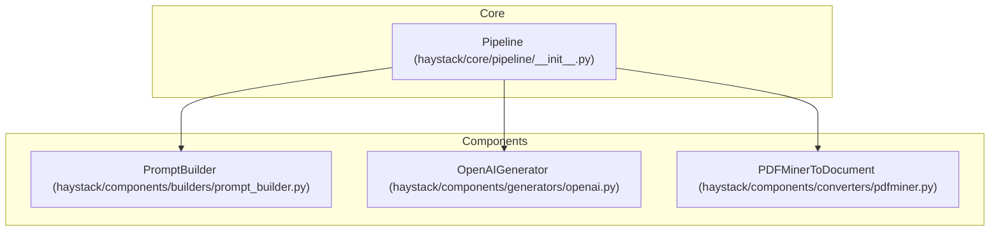
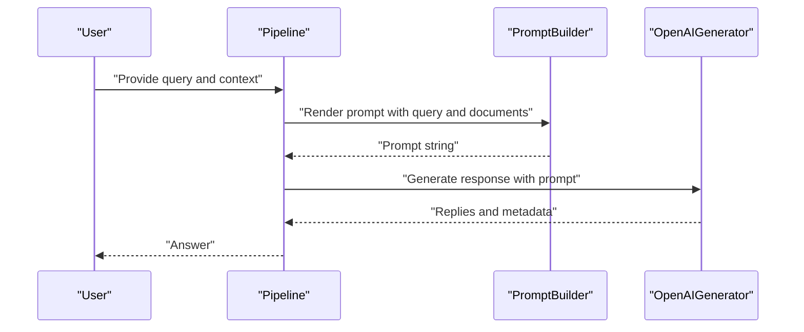
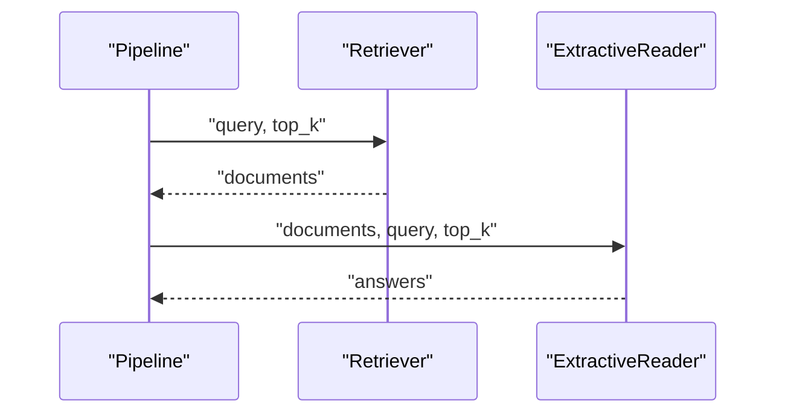
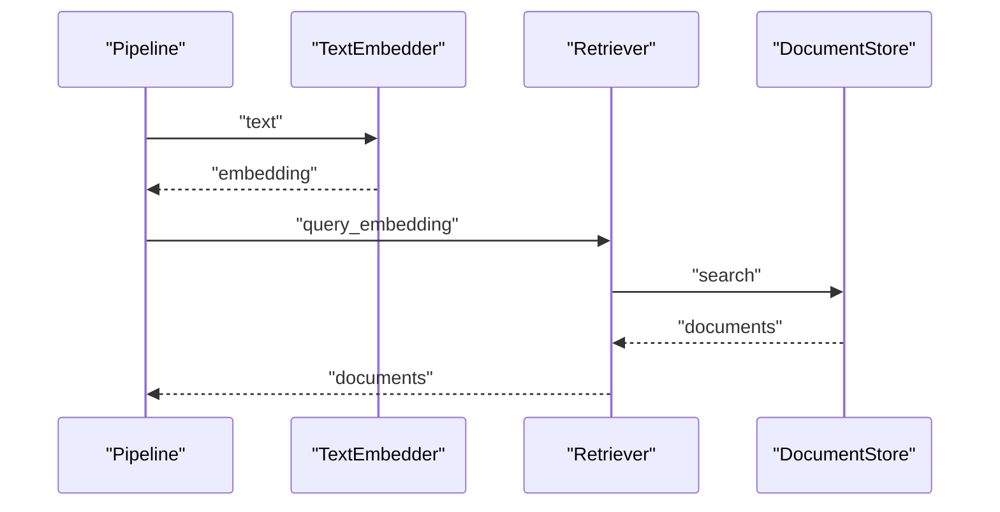
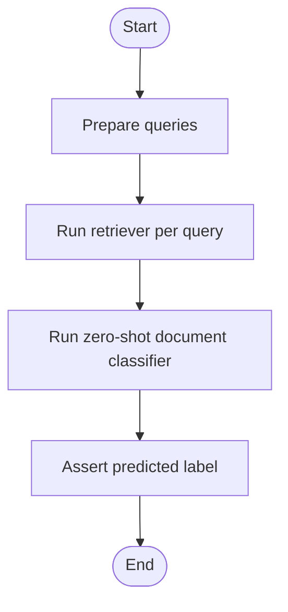
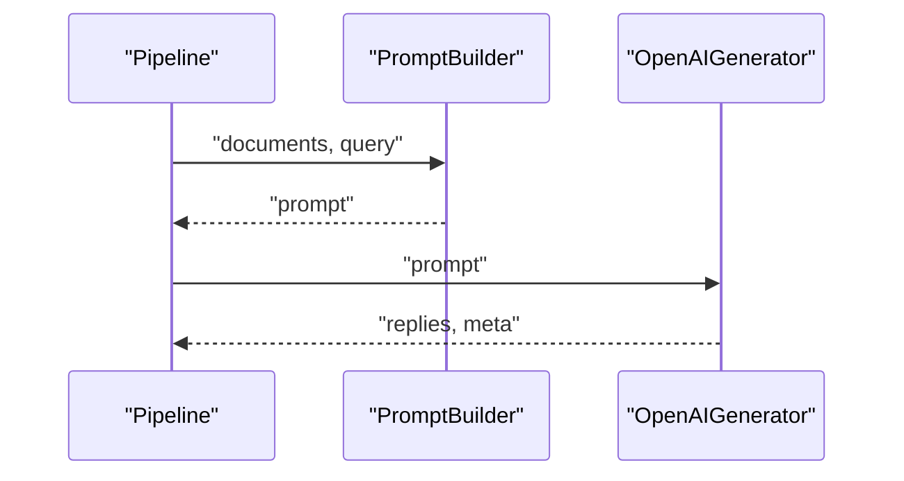
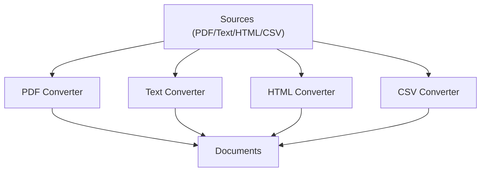
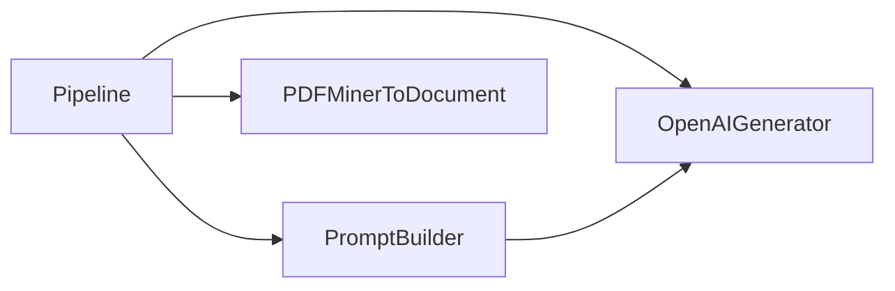

# Basic Usage Examples

<cite>
**Referenced Files in This Document**
- [README.md](file://README.md)
- [examples/README.md](file://examples/README.md)
- [haystack/core/pipeline/__init__.py](file://haystack/core/pipeline/__init__.py)
- [haystack/components/builders/prompt_builder.py](file://haystack/components/builders/prompt_builder.py)
- [haystack/components/generators/openai.py](file://haystack/components/generators/openai.py)
- [haystack/components/converters/pdfminer.py](file://haystack/components/converters/pdfminer.py)
- [docs-website/versioned_docs/version-2.25/pipeline-components/readers/extractivereader.mdx](file://docs-website/versioned_docs/version-2.25/pipeline-components/readers/extractivereader.mdx)
- [docs-website/versioned_docs/version-2.19/pipeline-components/retrievers/astraretriever.mdx](file://docs-website/versioned_docs/version-2.19/pipeline-components/retrievers/astraretriever.mdx)
- [docs-website/versioned_docs/version-2.18/pipeline-components/classifiers/transformerszeroshotdocumentclassifier.mdx](file://docs-website/versioned_docs/version-2.18/pipeline-components/classifiers/transformerszeroshotdocumentclassifier.mdx)
- [releasenotes/notes/add-pypdf-to-document-converter-4a39c29abc4da7ba.yaml](file://releasenotes/notes/add-pypdf-to-document-converter-4a39c29abc4da7ba.yaml)
- [releasenotes/notes/add-csv-converter-5c0d52f180d498f5.yaml](file://releasenotes/notes/add-csv-converter-5c0d52f180d498f5.yaml)
- [releasenotes/notes/fix-tika-page_number-2d600b2dc8a4faa7.yaml](file://releasenotes/notes/fix-tika-page_number-2d600b2dc8a4faa7.yaml)
</cite>

## Table of Contents
1. [Introduction](#introduction)
2. [Project Structure](#project-structure)
3. [Core Components](#core-components)
4. [Architecture Overview](#architecture-overview)
5. [Detailed Component Analysis](#detailed-component-analysis)
6. [Dependency Analysis](#dependency-analysis)
7. [Performance Considerations](#performance-considerations)
8. [Troubleshooting Guide](#troubleshooting-guide)
9. [Conclusion](#conclusion)
10. [Appendices](#appendices)

## Introduction
This document presents practical, line-by-line walkthroughs of fundamental Haystack patterns and workflows. It covers:
- Question answering over documents
- Retrieval pipelines
- Basic text processing workflows
- Variations for different document types (PDF, text, HTML)
- Integration with LLM providers
- Input/output handling, error management, and performance considerations
- Testing strategies and debugging techniques

These examples are grounded in the Haystack core pipeline and component APIs, and reference concrete source files for traceability.

## Project Structure
At a high level, Haystack organizes reusable building blocks (components) into pipelines. The core pipeline API exposes synchronous and asynchronous pipeline constructs, while components implement specialized capabilities such as prompt building, text generation, document conversion, and retrieval.

**Diagram sources**
- [haystack/core/pipeline/__init__.py](file://haystack/core/pipeline/__init__.py#L1-L9)
- [haystack/components/builders/prompt_builder.py](file://haystack/components/builders/prompt_builder.py#L1-L269)
- [haystack/components/generators/openai.py](file://haystack/components/generators/openai.py#L1-L271)
- [haystack/components/converters/pdfminer.py](file://haystack/components/converters/pdfminer.py#L1-L223)

**Section sources**
- [README.md](file://README.md#L12-L52)
- [examples/README.md](file://examples/README.md#L1-L6)
- [haystack/core/pipeline/__init__.py](file://haystack/core/pipeline/__init__.py#L1-L9)

## Core Components
- Pipeline: The orchestrator for component execution. It wires components and manages data flow.
- PromptBuilder: Renders templated prompts using Jinja2, feeding into LLMs.
- OpenAIGenerator: Invokes OpenAI models for text generation with streaming support.
- PDFMinerToDocument: Converts PDFs to Documents with configurable layout parameters.

Key capabilities:
- Pipeline construction and connection of components
- Prompt templating and variable binding
- LLM invocation with generation parameters
- Document ingestion from PDFs and related formats

**Section sources**
- [haystack/core/pipeline/__init__.py](file://haystack/core/pipeline/__init__.py#L1-L9)
- [haystack/components/builders/prompt_builder.py](file://haystack/components/builders/prompt_builder.py#L1-L269)
- [haystack/components/generators/openai.py](file://haystack/components/generators/openai.py#L1-L271)
- [haystack/components/converters/pdfminer.py](file://haystack/components/converters/pdfminer.py#L1-L223)

## Architecture Overview
The following diagram shows how a typical RAG pipeline composes components to transform raw inputs into answers.

**Diagram sources**
- [haystack/components/builders/prompt_builder.py](file://haystack/components/builders/prompt_builder.py#L45-L73)
- [haystack/components/generators/openai.py](file://haystack/components/generators/openai.py#L187-L271)

## Detailed Component Analysis

### Example 1: Question Answering over Documents (Extractive QA)
Goal: Retrieve relevant documents and extract answers using an extractive reader.

Implementation steps:
1. Instantiate a retriever and an extractive reader.
2. Create a pipeline and add both components.
3. Connect the retriever’s output to the reader’s input.
4. Run the pipeline with a query and top-k parameters.

**Diagram sources**
- [docs-website/versioned_docs/version-2.25/pipeline-components/readers/extractivereader.mdx](file://docs-website/versioned_docs/version-2.25/pipeline-components/readers/extractivereader.mdx#L91-L106)

**Section sources**
- [docs-website/versioned_docs/version-2.25/pipeline-components/readers/extractivereader.mdx](file://docs-website/versioned_docs/version-2.25/pipeline-components/readers/extractivereader.mdx#L91-L106)

### Example 2: Retrieval Pipeline with Embeddings and a Document Store
Goal: Embed a query, search a document store, and return top-k documents.

Implementation steps:
1. Prepare a query string.
2. Run a pipeline that embeds the query and retrieves documents from a retriever connected to a document store.
3. Inspect the first returned document.

**Diagram sources**
- [docs-website/versioned_docs/version-2.19/pipeline-components/retrievers/astraretriever.mdx](file://docs-website/versioned_docs/version-2.19/pipeline-components/retrievers/astraretriever.mdx#L101-L117)

**Section sources**
- [docs-website/versioned_docs/version-2.19/pipeline-components/retrievers/astraretriever.mdx](file://docs-website/versioned_docs/version-2.19/pipeline-components/retrievers/astraretriever.mdx#L101-L117)

### Example 3: Zero-Shot Classification of Retrieved Documents
Goal: Classify retrieved documents into categories (e.g., positive/negative sentiment).

Implementation steps:
1. Build a pipeline connecting a retriever to a zero-shot document classifier.
2. Iterate over queries and assert classification outcomes.

**Diagram sources**
- [docs-website/versioned_docs/version-2.18/pipeline-components/classifiers/transformerszeroshotdocumentclassifier.mdx](file://docs-website/versioned_docs/version-2.18/pipeline-components/classifiers/transformerszeroshotdocumentclassifier.mdx#L89-L103)

**Section sources**
- [docs-website/versioned_docs/version-2.18/pipeline-components/classifiers/transformerszeroshotdocumentclassifier.mdx](file://docs-website/versioned_docs/version-2.18/pipeline-components/classifiers/transformerszeroshotdocumentclassifier.mdx#L89-L103)

### Example 4: Prompt Building and Generation
Goal: Render a prompt with dynamic variables and generate a response using an LLM.

Implementation steps:
1. Create a prompt template with placeholders.
2. Add PromptBuilder and OpenAIGenerator to a pipeline.
3. Connect components and run with variables for documents and query.

**Diagram sources**
- [haystack/components/builders/prompt_builder.py](file://haystack/components/builders/prompt_builder.py#L45-L73)
- [haystack/components/generators/openai.py](file://haystack/components/generators/openai.py#L187-L271)

**Section sources**
- [haystack/components/builders/prompt_builder.py](file://haystack/components/builders/prompt_builder.py#L45-L73)
- [haystack/components/generators/openai.py](file://haystack/components/generators/openai.py#L187-L271)

### Example 5: Document Conversion Workflows (PDF, Text, HTML)
Goal: Convert various document sources into Documents for downstream processing.

Implementation steps:
- PDF: Use a PDF converter to ingest PDF files and produce Documents.
- Text/HTML: Use appropriate converters for plain text and HTML sources.
- CSV: Use a CSV converter to load tabular data as a Document.

**Diagram sources**
- [haystack/components/converters/pdfminer.py](file://haystack/components/converters/pdfminer.py#L26-L43)
- [releasenotes/notes/add-pypdf-to-document-converter-4a39c29abc4da7ba.yaml](file://releasenotes/notes/add-pypdf-to-document-converter-4a39c29abc4da7ba.yaml#L1-L4)
- [releasenotes/notes/add-csv-converter-5c0d52f180d498f5.yaml](file://releasenotes/notes/add-csv-converter-5c0d52f180d498f5.yaml#L1-L4)
- [releasenotes/notes/fix-tika-page_number-2d600b2dc8a4faa7.yaml](file://releasenotes/notes/fix-tika-page_number-2d600b2dc8a4faa7.yaml#L1-L5)

**Section sources**
- [haystack/components/converters/pdfminer.py](file://haystack/components/converters/pdfminer.py#L26-L43)
- [releasenotes/notes/add-pypdf-to-document-converter-4a39c29abc4da7ba.yaml](file://releasenotes/notes/add-pypdf-to-document-converter-4a39c29abc4da7ba.yaml#L1-L4)
- [releasenotes/notes/add-csv-converter-5c0d52f180d498f5.yaml](file://releasenotes/notes/add-csv-converter-5c0d52f180d498f5.yaml#L1-L4)
- [releasenotes/notes/fix-tika-page_number-2d600b2dc8a4faa7.yaml](file://releasenotes/notes/fix-tika-page_number-2d600b2dc8a4faa7.yaml#L1-L5)

## Dependency Analysis
This section maps how components depend on each other and how pipelines orchestrate them.

**Diagram sources**
- [haystack/core/pipeline/__init__.py](file://haystack/core/pipeline/__init__.py#L1-L9)
- [haystack/components/builders/prompt_builder.py](file://haystack/components/builders/prompt_builder.py#L1-L269)
- [haystack/components/generators/openai.py](file://haystack/components/generators/openai.py#L1-L271)
- [haystack/components/converters/pdfminer.py](file://haystack/components/converters/pdfminer.py#L1-L223)

**Section sources**
- [haystack/core/pipeline/__init__.py](file://haystack/core/pipeline/__init__.py#L1-L9)
- [haystack/components/builders/prompt_builder.py](file://haystack/components/builders/prompt_builder.py#L1-L269)
- [haystack/components/generators/openai.py](file://haystack/components/generators/openai.py#L1-L271)
- [haystack/components/converters/pdfminer.py](file://haystack/components/converters/pdfminer.py#L1-L223)

## Performance Considerations
- Minimize redundant conversions: reuse Documents across pipeline stages when possible.
- Tune retriever top-k and reranker parameters to balance recall and latency.
- Use streaming generation for long-form outputs to improve perceived responsiveness.
- Cache embeddings and frequently accessed metadata to reduce repeated computation.
- Batch document ingestion where supported to increase throughput.

[No sources needed since this section provides general guidance]

## Troubleshooting Guide
Common issues and remedies:
- Missing optional dependencies for converters: ensure required packages are installed (e.g., PDF parsing libraries).
- Empty or low-quality extracted text: adjust layout parameters or switch to a different converter.
- Undecoded CID characters in PDFs: review warnings and consider alternative extraction strategies.
- PromptBuilder missing required variables: explicitly set required variables or mark all variables as required.

**Section sources**
- [haystack/components/converters/pdfminer.py](file://haystack/components/converters/pdfminer.py#L182-L218)
- [haystack/components/builders/prompt_builder.py](file://haystack/components/builders/prompt_builder.py#L249-L269)

## Conclusion
These examples demonstrate how to assemble robust, production-ready workflows using Haystack’s modular components. By composing pipelines with retrievers, readers, prompt builders, and generators—and by converting diverse document formats—you can implement common scenarios like question answering, retrieval, and classification with clear input/output handling, error management, and performance awareness.

[No sources needed since this section summarizes without analyzing specific files]

## Appendices

### Appendix A: Provider Variations
- OpenAI: Use OpenAIGenerator with model-specific parameters and streaming callbacks.
- Other providers: Integrate alternative generators via the same component interface by adapting initialization and generation parameters.

**Section sources**
- [haystack/components/generators/openai.py](file://haystack/components/generators/openai.py#L64-L120)

### Appendix B: Document Type Notes
- PDF: Use PDFMiner-based converters; consider page break handling and CID character detection.
- CSV: Use CSV converter to load tabular data as a Document for downstream processing.
- Tika: Recent updates include improved page number handling for PDF outputs.

**Section sources**
- [releasenotes/notes/add-pypdf-to-document-converter-4a39c29abc4da7ba.yaml](file://releasenotes/notes/add-pypdf-to-document-converter-4a39c29abc4da7ba.yaml#L1-L4)
- [releasenotes/notes/add-csv-converter-5c0d52f180d498f5.yaml](file://releasenotes/notes/add-csv-converter-5c0d52f180d498f5.yaml#L1-L4)
- [releasenotes/notes/fix-tika-page_number-2d600b2dc8a4faa7.yaml](file://releasenotes/notes/fix-tika-page_number-2d600b2dc8a4faa7.yaml#L1-L5)