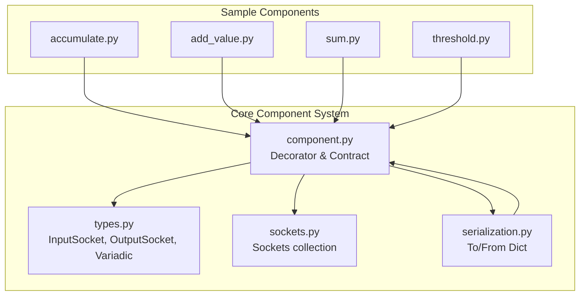
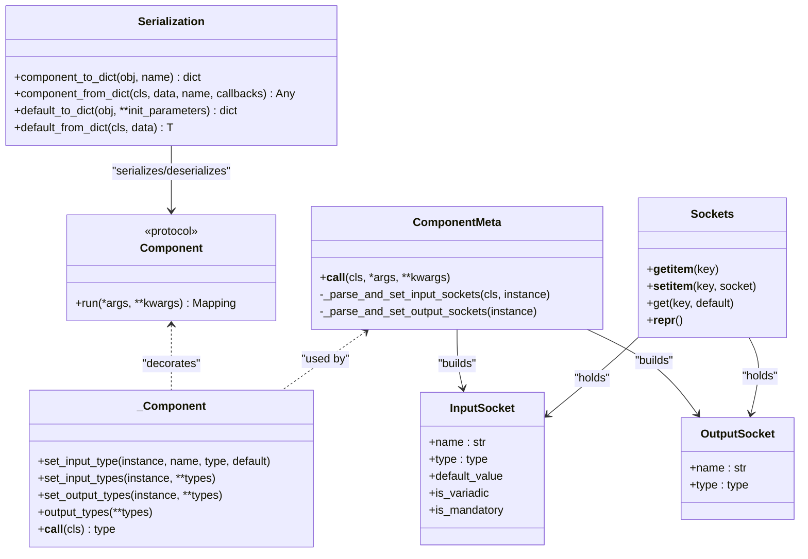
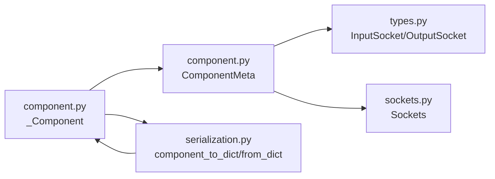

# Custom Component Development

<cite>
**Referenced Files in This Document**
- [component.py](file://haystack/core/component/component.py)
- [types.py](file://haystack/core/component/types.py)
- [sockets.py](file://haystack/core/component/sockets.py)
- [serialization.py](file://haystack/core/serialization.py)
- [__init__.py](file://haystack/core/component/__init__.py)
- [accumulate.py](file://haystack/testing/sample_components/accumulate.py)
- [add_value.py](file://haystack/testing/sample_components/add_value.py)
- [sum.py](file://haystack/testing/sample_components/sum.py)
- [threshold.py](file://haystack/testing/sample_components/threshold.py)
- [test_component.py](file://test/core/test_component.py)
- [test_serialization.py](file://test/core/test_serialization.py)
</cite>

## Table of Contents
1. [Introduction](#introduction)
2. [Project Structure](#project-structure)
3. [Core Components](#core-components)
4. [Architecture Overview](#architecture-overview)
5. [Detailed Component Analysis](#detailed-component-analysis)
6. [Dependency Analysis](#dependency-analysis)
7. [Performance Considerations](#performance-considerations)
8. [Troubleshooting Guide](#troubleshooting-guide)
9. [Conclusion](#conclusion)
10. [Appendices](#appendices)

## Introduction
This document explains how to develop custom Haystack components and extend existing functionality. It covers the component development lifecycle from design to deployment, including component decorators, input/output specifications, and serialization requirements. You will learn how to build custom generators, retrievers, embedders, and processors, and how to compose them effectively. Advanced topics include parameter validation, error handling, integration with external APIs, and testing strategies. Guidance on performance optimization and memory management is also included.

## Project Structure
Haystack’s core component system is defined under the core package. The primary building blocks are:
- The component decorator and runtime contract
- Input/output socket definitions and type descriptors
- Serialization utilities for saving/loading pipelines and components
- Sample components demonstrating best practices

**Diagram sources**
- [component.py](file://haystack/core/component/component.py#L572-L645)
- [types.py](file://haystack/core/component/types.py#L36-L128)
- [sockets.py](file://haystack/core/component/sockets.py#L15-L144)
- [serialization.py](file://haystack/core/serialization.py#L41-L336)
- [accumulate.py](file://haystack/testing/sample_components/accumulate.py)
- [add_value.py](file://haystack/testing/sample_components/add_value.py)
- [sum.py](file://haystack/testing/sample_components/sum.py)
- [threshold.py](file://haystack/testing/sample_components/threshold.py)

**Section sources**
- [component.py](file://haystack/core/component/component.py#L1-L645)
- [types.py](file://haystack/core/component/types.py#L1-L128)
- [sockets.py](file://haystack/core/component/sockets.py#L1-L144)
- [serialization.py](file://haystack/core/serialization.py#L1-L336)

## Core Components
This section explains the essential elements for building custom components.

- Component decorator and contract
  - Every component class must be decorated with the component decorator so that pipelines can discover and register it.
  - Components must implement a run method. Optional methods include __init__ (lightweight), warm_up (for heavy initialization), and async variants.
  - Initialization parameters must be JSON serializable; complex objects should be represented by importable strings or via custom serialization.

- Input/Output sockets
  - Inputs and outputs are described via typed sockets. Inputs can be mandatory or optional (with defaults). Variadic inputs are supported for lazy and greedy modes.
  - Sockets are validated against the run method signature and decorated output types.

- Serialization
  - Components must provide a to_dict/from_dict pair or rely on default serialization utilities.
  - Only basic Python types are allowed in serialized data; nested structures are validated.

**Section sources**
- [component.py](file://haystack/core/component/component.py#L10-L74)
- [component.py](file://haystack/core/component/component.py#L572-L645)
- [types.py](file://haystack/core/component/types.py#L17-L128)
- [sockets.py](file://haystack/core/component/sockets.py#L15-L144)
- [serialization.py](file://haystack/core/serialization.py#L41-L336)

## Architecture Overview
The component architecture centers around a decorator that validates and registers components, a metaclass that builds input/output sockets, and serialization utilities that persist and restore components.

**Diagram sources**
- [component.py](file://haystack/core/component/component.py#L136-L330)
- [component.py](file://haystack/core/component/component.py#L406-L645)
- [types.py](file://haystack/core/component/types.py#L36-L128)
- [sockets.py](file://haystack/core/component/sockets.py#L15-L144)
- [serialization.py](file://haystack/core/serialization.py#L41-L336)

## Detailed Component Analysis
This section provides step-by-step guidance for creating custom components across common categories, grounded in the core system and validated by sample components.

### Step 1: Design the Component Contract
- Decide whether to implement a synchronous run method or an async run_async method. If both are present, their signatures must match exactly.
- Define inputs and outputs. Prefer explicit type annotations on run parameters and decorate outputs with the output_types decorator or use set_output_types.

Key references:
- Component contract and method requirements
  - [component.py](file://haystack/core/component/component.py#L10-L74)
- Output type decoration and validation
  - [component.py](file://haystack/core/component/component.py#L534-L571)

### Step 2: Implement Input/Output Specifications
- Use InputSocket and OutputSocket to describe inputs and outputs.
- Variadic inputs are supported via Variadic and GreedyVariadic aliases.
- Sockets are built from run method annotations and decorated outputs.

References:
- Variadic/Greedy input types
  - [types.py](file://haystack/core/component/types.py#L17-L30)
- Socket descriptors and properties
  - [types.py](file://haystack/core/component/types.py#L36-L128)
- Sockets collection and representation
  - [sockets.py](file://haystack/core/component/sockets.py#L15-L144)

### Step 3: Build the Component Class
- Apply the component decorator to the class.
- Implement run with the required signature and return a mapping of outputs.
- Optionally implement warm_up for heavy initialization.

References:
- Decorator registration and validation
  - [component.py](file://haystack/core/component/component.py#L572-L645)
- Async run signature validation
  - [component.py](file://haystack/core/component/component.py#L317-L329)

### Step 4: Serialization and Persistence
- Provide to_dict/from_dict or rely on default utilities.
- Ensure init parameters are JSON serializable; use importable strings for callables/classes.
- Validate serialized data with the provided checks.

References:
- Component serialization entry points
  - [serialization.py](file://haystack/core/serialization.py#L41-L88)
- Default serialization helpers
  - [serialization.py](file://haystack/core/serialization.py#L177-L227)
- Deserialization and type resolution
  - [serialization.py](file://haystack/core/serialization.py#L250-L312)

### Step 5: Validation and Error Handling
- The decorator enforces the presence of run and matching signatures for async variants.
- Input sockets cannot override run method parameters; defaults and types are validated.
- Serialization enforces allowed types and rejects unsupported structures.

References:
- Signature and socket validation
  - [component.py](file://haystack/core/component/component.py#L231-L293)
- Serialization type validation
  - [serialization.py](file://haystack/core/serialization.py#L90-L125)

### Step 6: Testing Strategies
- Unit tests validate component behavior and serialization round-trips.
- Use test fixtures and pipelines to verify composition and data flow.

References:
- Component tests
  - [test_component.py](file://test/core/test_component.py)
- Serialization tests
  - [test_serialization.py](file://test/core/test_serialization.py)

### Step 7: Examples from Sample Components
These real-world examples demonstrate best practices for component design and behavior.

- Accumulate: demonstrates custom serialization and parameter handling
  - [accumulate.py](file://haystack/testing/sample_components/accumulate.py)
- AddFixedValue: shows fixed-value transformations
  - [add_value.py](file://haystack/testing/sample_components/add_value.py)
- Sum: illustrates aggregation and output typing
  - [sum.py](file://haystack/testing/sample_components/sum.py)
- Threshold: showcases conditional logic and output mapping
  - [threshold.py](file://haystack/testing/sample_components/threshold.py)

**Section sources**
- [component.py](file://haystack/core/component/component.py#L10-L74)
- [component.py](file://haystack/core/component/component.py#L534-L571)
- [types.py](file://haystack/core/component/types.py#L17-L128)
- [sockets.py](file://haystack/core/component/sockets.py#L15-L144)
- [serialization.py](file://haystack/core/serialization.py#L41-L336)
- [accumulate.py](file://haystack/testing/sample_components/accumulate.py)
- [add_value.py](file://haystack/testing/sample_components/add_value.py)
- [sum.py](file://haystack/testing/sample_components/sum.py)
- [threshold.py](file://haystack/testing/sample_components/threshold.py)
- [test_component.py](file://test/core/test_component.py)
- [test_serialization.py](file://test/core/test_serialization.py)

## Dependency Analysis
The component system exhibits clear separation of concerns:
- The decorator and metaclass handle discovery, registration, and socket construction.
- Types and sockets define the I/O contract.
- Serialization utilities manage persistence and restoration.

**Diagram sources**
- [component.py](file://haystack/core/component/component.py#L406-L645)
- [types.py](file://haystack/core/component/types.py#L36-L128)
- [sockets.py](file://haystack/core/component/sockets.py#L15-L144)
- [serialization.py](file://haystack/core/serialization.py#L41-L336)

**Section sources**
- [component.py](file://haystack/core/component/component.py#L406-L645)
- [types.py](file://haystack/core/component/types.py#L36-L128)
- [sockets.py](file://haystack/core/component/sockets.py#L15-L144)
- [serialization.py](file://haystack/core/serialization.py#L41-L336)

## Performance Considerations
- Keep __init__ lightweight; defer heavy initialization to warm_up.
- Use async run_async when applicable to improve throughput.
- Minimize allocations in hot paths; reuse resources where safe.
- Avoid storing non-serializable objects in init parameters; prefer importable identifiers.
- Validate inputs early to short-circuit expensive operations.

[No sources needed since this section provides general guidance]

## Troubleshooting Guide
Common issues and resolutions:
- Missing run method or incorrect signature
  - Ensure the class has a run method and that run_async (if present) matches the run signature exactly.
  - Reference: [component.py](file://haystack/core/component/component.py#L572-L645), [component.py](file://haystack/core/component/component.py#L317-L329)
- Input socket conflicts
  - Input sockets cannot override run method parameters; adjust set_input_types usage accordingly.
  - Reference: [component.py](file://haystack/core/component/component.py#L231-L293)
- Serialization failures
  - Verify init parameters are basic types; use default_to_dict/default_from_dict for nested objects.
  - Reference: [serialization.py](file://haystack/core/serialization.py#L90-L125), [serialization.py](file://haystack/core/serialization.py#L177-L227), [serialization.py](file://haystack/core/serialization.py#L250-L312)
- Async method not awaited
  - Confirm run_async is a coroutine and signatures match run.
  - Reference: [component.py](file://haystack/core/component/component.py#L317-L329)

**Section sources**
- [component.py](file://haystack/core/component/component.py#L231-L329)
- [serialization.py](file://haystack/core/serialization.py#L90-L125)
- [serialization.py](file://haystack/core/serialization.py#L177-L312)

## Conclusion
By following the component decorator contract, carefully specifying inputs and outputs, and leveraging the serialization utilities, you can build robust, maintainable custom components. Use the sample components as references, validate behavior with unit tests, and apply the performance and troubleshooting guidance to ensure reliable deployments.

[No sources needed since this section summarizes without analyzing specific files]

## Appendices
- Component decorator entry points
  - [__init__.py](file://haystack/core/component/__init__.py#L5-L8)
- Example component implementations
  - [accumulate.py](file://haystack/testing/sample_components/accumulate.py)
  - [add_value.py](file://haystack/testing/sample_components/add_value.py)
  - [sum.py](file://haystack/testing/sample_components/sum.py)
  - [threshold.py](file://haystack/testing/sample_components/threshold.py)