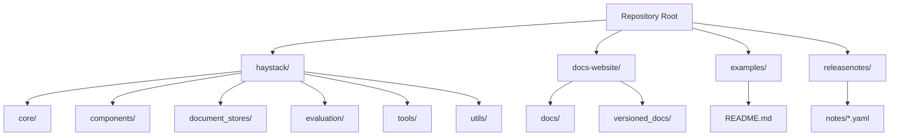
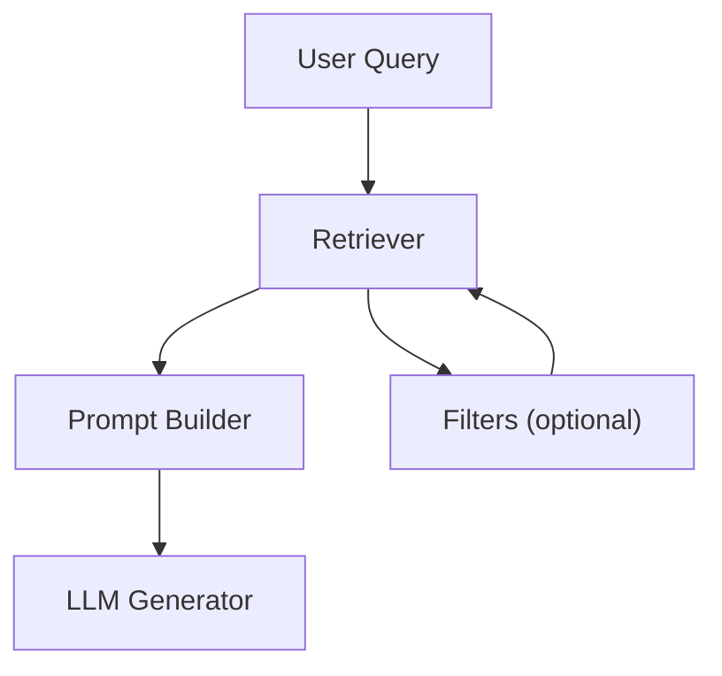
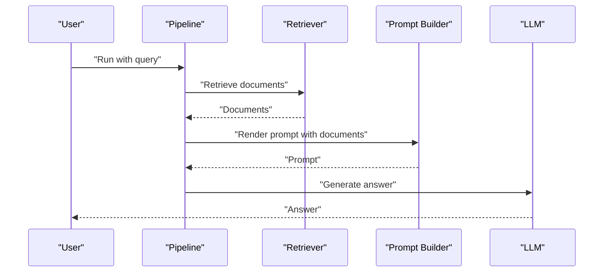
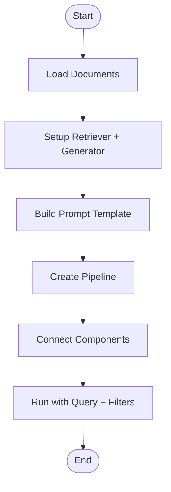
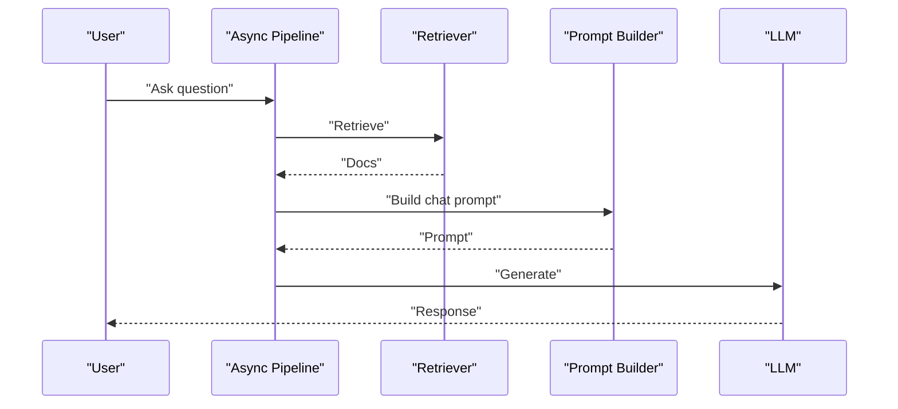
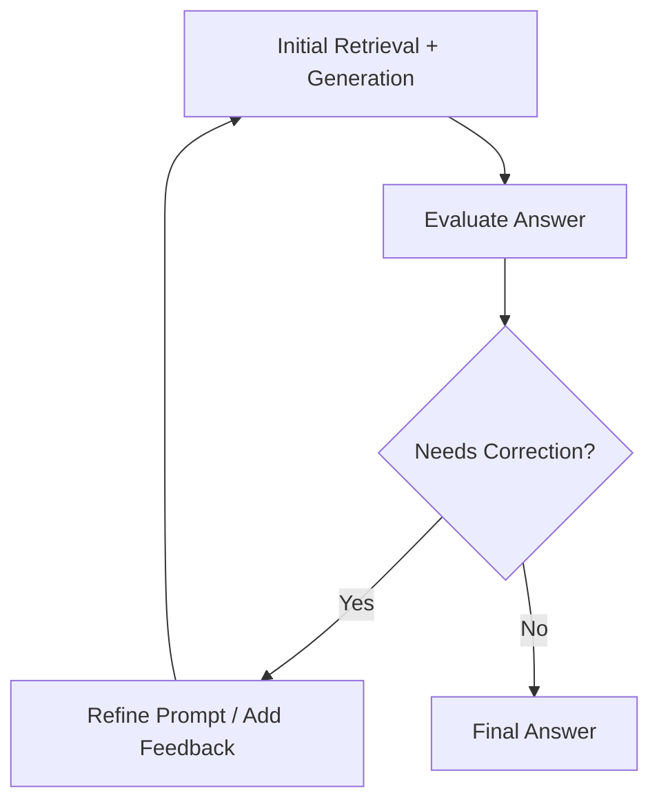
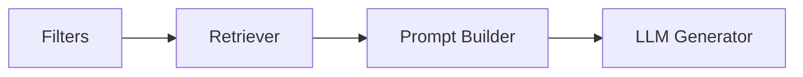

# Examples and Tutorials

<cite>
**Referenced Files in This Document**
- [README.md](file://README.md)
- [examples/README.md](file://examples/README.md)
- [docs-website/docs/concepts/pipelines.mdx](file://docs-website/docs/concepts/pipelines.mdx)
- [docs-website/versioned_docs/version-2.18/concepts/pipelines.mdx](file://docs-website/versioned_docs/version-2.18/concepts/pipelines.mdx)
- [docs-website/versioned_docs/version-2.19/concepts/pipelines.mdx](file://docs-website/versioned_docs/version-2.19/concepts/pipelines.mdx)
- [docs-website/versioned_docs/version-2.20/concepts/pipelines.mdx](file://docs-website/versioned_docs/version-2.20/concepts/pipelines.mdx)
- [docs-website/versioned_docs/version-2.21/concepts/pipelines.mdx](file://docs-website/versioned_docs/version-2.21/concepts/pipelines.mdx)
- [docs-website/versioned_docs/version-2.22/concepts/pipelines.mdx](file://docs-website/versioned_docs/version-2.22/concepts/pipelines.mdx)
- [docs-website/versioned_docs/version-2.23/concepts/pipelines.mdx](file://docs-website/versioned_docs/version-2.23/concepts/pipelines.mdx)
- [docs-website/versioned_docs/version-2.24/concepts/pipelines.mdx](file://docs-website/versioned_docs/version-2.24/concepts/pipelines.mdx)
- [docs-website/versioned_docs/version-2.25/concepts/pipelines.mdx](file://docs-website/versioned_docs/version-2.25/concepts/pipelines.mdx)
- [docs-website/versioned_docs/version-2.18/pipeline-components/retrievers/filterretriever.mdx](file://docs-website/versioned_docs/version-2.18/pipeline-components/retrievers/filterretriever.mdx)
- [docs-website/versioned_docs/version-2.19/pipeline-components/retrievers/filterretriever.mdx](file://docs-website/versioned_docs/version-2.19/pipeline-components/retrievers/filterretriever.mdx)
- [haystack/core/pipeline/async_pipeline.py](file://haystack/core/pipeline/async_pipeline.py)
- [releasenotes/notes/self-correcting-rag-2e77ac94b89dfe5b.yaml](file://releasenotes/notes/self-correcting-rag-2e77ac94b89dfe5b.yaml)
</cite>

## Table of Contents
1. [Introduction](#introduction)
2. [Project Structure](#project-structure)
3. [Core Components](#core-components)
4. [Architecture Overview](#architecture-overview)
5. [Detailed Component Analysis](#detailed-component-analysis)
6. [Dependency Analysis](#dependency-analysis)
7. [Performance Considerations](#performance-considerations)
8. [Troubleshooting Guide](#troubleshooting-guide)
9. [Conclusion](#conclusion)
10. [Appendices](#appendices)

## Introduction
This document presents practical, step-by-step examples and tutorials for building real-world AI applications with Haystack. It covers foundational RAG pipelines, document search apps, and conversational agents, progressing to advanced topics such as multi-modal setups, custom component development, and production deployment. It also highlights best practices for pipeline design, performance optimization, and troubleshooting, and points to external resources and release notes for hands-on learning.

## Project Structure
The repository includes:
- Core library under haystack/, with components, pipelines, and utilities
- Extensive documentation under docs-website/ with conceptual guides and component references
- Example collections moved to a dedicated cookbook repository referenced from examples/README.md
- Release notes indicating new features and examples (such as self-correcting RAG)

**Section sources**
- [README.md](file://README.md#L12-L52)
- [examples/README.md](file://examples/README.md#L1-L6)

## Core Components
Haystack enables building pipelines composed of modular components. The canonical workflow is:
1. Create a pipeline
2. Add components
3. Connect components
4. Run the pipeline

Key concepts:
- Pipelines define data flow and enforce type compatibility at connection time
- Components expose typed inputs and outputs
- Async pipelines support concurrent execution patterns

Practical references:
- Pipeline creation, addition, connection, and execution steps
- Async pipeline usage and chat-style prompts

**Section sources**
- [docs-website/docs/concepts/pipelines.mdx](file://docs-website/docs/concepts/pipelines.mdx#L81-L93)
- [docs-website/versioned_docs/version-2.18/concepts/pipelines.mdx](file://docs-website/versioned_docs/version-2.18/concepts/pipelines.mdx#L64-L93)
- [docs-website/versioned_docs/version-2.19/concepts/pipelines.mdx](file://docs-website/versioned_docs/version-2.19/concepts/pipelines.mdx#L64-L93)
- [docs-website/versioned_docs/version-2.20/concepts/pipelines.mdx](file://docs-website/versioned_docs/version-2.20/concepts/pipelines.mdx#L64-L93)
- [docs-website/versioned_docs/version-2.21/concepts/pipelines.mdx](file://docs-website/versioned_docs/version-2.21/concepts/pipelines.mdx#L64-L93)
- [docs-website/versioned_docs/version-2.22/concepts/pipelines.mdx](file://docs-website/versioned_docs/version-2.22/concepts/pipelines.mdx#L64-L93)
- [docs-website/versioned_docs/version-2.23/concepts/pipelines.mdx](file://docs-website/versioned_docs/version-2.23/concepts/pipelines.mdx#L64-L93)
- [docs-website/versioned_docs/version-2.24/concepts/pipelines.mdx](file://docs-website/versioned_docs/version-2.24/concepts/pipelines.mdx#L64-L93)
- [docs-website/versioned_docs/version-2.25/concepts/pipelines.mdx](file://docs-website/versioned_docs/version-2.25/concepts/pipelines.mdx#L64-L93)
- [haystack/core/pipeline/async_pipeline.py](file://haystack/core/pipeline/async_pipeline.py#L636-L652)

## Architecture Overview
A typical RAG pipeline connects a retriever to a prompt builder and an LLM generator. Filters can be applied to narrow retrieved contexts.

**Diagram sources**
- [docs-website/versioned_docs/version-2.18/pipeline-components/retrievers/filterretriever.mdx](file://docs-website/versioned_docs/version-2.18/pipeline-components/retrievers/filterretriever.mdx#L92-L116)
- [docs-website/versioned_docs/version-2.19/pipeline-components/retrievers/filterretriever.mdx](file://docs-website/versioned_docs/version-2.19/pipeline-components/retrievers/filterretriever.mdx#L92-L116)

## Detailed Component Analysis

### Basic RAG Pipeline Tutorial
Step-by-step outline:
1. Prepare a document store and write documents
2. Instantiate a retriever and an LLM generator
3. Build a prompt template or builder
4. Compose a pipeline and connect components
5. Run with a query and optional filters

Reference examples:
- Filtered retrieval with a prompt template and generator
- Async pipeline with chat-style prompts

**Diagram sources**
- [docs-website/versioned_docs/version-2.18/pipeline-components/retrievers/filterretriever.mdx](file://docs-website/versioned_docs/version-2.18/pipeline-components/retrievers/filterretriever.mdx#L92-L116)
- [docs-website/versioned_docs/version-2.19/pipeline-components/retrievers/filterretriever.mdx](file://docs-website/versioned_docs/version-2.19/pipeline-components/retrievers/filterretriever.mdx#L92-L116)
- [haystack/core/pipeline/async_pipeline.py](file://haystack/core/pipeline/async_pipeline.py#L636-L652)

**Section sources**
- [docs-website/versioned_docs/version-2.18/pipeline-components/retrievers/filterretriever.mdx](file://docs-website/versioned_docs/version-2.18/pipeline-components/retrievers/filterretriever.mdx#L83-L127)
- [docs-website/versioned_docs/version-2.19/pipeline-components/retrievers/filterretriever.mdx](file://docs-website/versioned_docs/version-2.19/pipeline-components/retrievers/filterretriever.mdx#L83-L127)
- [haystack/core/pipeline/async_pipeline.py](file://haystack/core/pipeline/async_pipeline.py#L613-L652)

### Document Search Application
- Use filters to constrain retrieval by metadata fields
- Combine retriever outputs with prompt builder and generator
- Iterate on prompt templates and filters to refine results

**Diagram sources**
- [docs-website/versioned_docs/version-2.18/pipeline-components/retrievers/filterretriever.mdx](file://docs-website/versioned_docs/version-2.18/pipeline-components/retrievers/filterretriever.mdx#L92-L116)
- [docs-website/versioned_docs/version-2.19/pipeline-components/retrievers/filterretriever.mdx](file://docs-website/versioned_docs/version-2.19/pipeline-components/retrievers/filterretriever.mdx#L92-L116)

**Section sources**
- [docs-website/versioned_docs/version-2.18/pipeline-components/retrievers/filterretriever.mdx](file://docs-website/versioned_docs/version-2.18/pipeline-components/retrievers/filterretriever.mdx#L83-L127)
- [docs-website/versioned_docs/version-2.19/pipeline-components/retrievers/filterretriever.mdx](file://docs-website/versioned_docs/version-2.19/pipeline-components/retrievers/filterretriever.mdx#L83-L127)

### Conversational Agent Tutorial
- Use chat-style prompts and async pipelines for responsive interactions
- Chain retriever, prompt builder, and generator in a loop
- Manage conversation context and iterative refinement

**Diagram sources**
- [haystack/core/pipeline/async_pipeline.py](file://haystack/core/pipeline/async_pipeline.py#L636-L652)

**Section sources**
- [haystack/core/pipeline/async_pipeline.py](file://haystack/core/pipeline/async_pipeline.py#L613-L652)

### Advanced Tutorial: Self-Correction Loop
- Implement iterative refinement by feeding LLM answers back into the pipeline
- Use release notes as a signal for example availability and enhancements

**Section sources**
- [releasenotes/notes/self-correcting-rag-2e77ac94b89dfe5b.yaml](file://releasenotes/notes/self-correcting-rag-2e77ac94b89dfe5b.yaml#L1-L2)

### Advanced Tutorial: Multi-Modal Applications
- Combine text, image, and audio components
- Integrate specialized converters and embedders
- Design pipelines that route modalities to appropriate components

[No sources needed since this section provides general guidance]

### Advanced Tutorial: Custom Component Development
- Implement custom components with typed inputs/outputs
- Register components and integrate them into pipelines
- Test and serialize custom components

[No sources needed since this section provides general guidance]

### Advanced Tutorial: Production Deployment
- Serve pipelines as REST APIs or MCP servers
- Monitor performance and observability
- Scale horizontally and manage secrets

[No sources needed since this section provides general guidance]

## Dependency Analysis
- Pipeline components are loosely coupled; connections define data dependencies
- Async pipelines introduce concurrency primitives for throughput
- Filters enable selective retrieval, reducing downstream computation

**Diagram sources**
- [docs-website/versioned_docs/version-2.18/pipeline-components/retrievers/filterretriever.mdx](file://docs-website/versioned_docs/version-2.18/pipeline-components/retrievers/filterretriever.mdx#L92-L116)
- [docs-website/versioned_docs/version-2.19/pipeline-components/retrievers/filterretriever.mdx](file://docs-website/versioned_docs/version-2.19/pipeline-components/retrievers/filterretriever.mdx#L92-L116)

**Section sources**
- [docs-website/versioned_docs/version-2.18/concepts/pipelines.mdx](file://docs-website/versioned_docs/version-2.18/concepts/pipelines.mdx#L53-L76)
- [docs-website/versioned_docs/version-2.19/concepts/pipelines.mdx](file://docs-website/versioned_docs/version-2.19/concepts/pipelines.mdx#L53-L76)
- [docs-website/versioned_docs/version-2.20/concepts/pipelines.mdx](file://docs-website/versioned_docs/version-2.20/concepts/pipelines.mdx#L53-L76)
- [docs-website/versioned_docs/version-2.21/concepts/pipelines.mdx](file://docs-website/versioned_docs/version-2.21/concepts/pipelines.mdx#L53-L76)
- [docs-website/versioned_docs/version-2.22/concepts/pipelines.mdx](file://docs-website/versioned_docs/version-2.22/concepts/pipelines.mdx#L53-L76)
- [docs-website/versioned_docs/version-2.23/concepts/pipelines.mdx](file://docs-website/versioned_docs/version-2.23/concepts/pipelines.mdx#L53-L76)
- [docs-website/versioned_docs/version-2.24/concepts/pipelines.mdx](file://docs-website/versioned_docs/version-2.24/concepts/pipelines.mdx#L53-L76)
- [docs-website/versioned_docs/version-2.25/concepts/pipelines.mdx](file://docs-website/versioned_docs/version-2.25/concepts/pipelines.mdx#L53-L76)

## Performance Considerations
- Prefer filtering early to reduce context size
- Tune prompt templates and chunk sizes for cost and latency
- Use async pipelines for concurrent queries
- Cache embeddings and intermediate results where feasible

[No sources needed since this section provides general guidance]

## Troubleshooting Guide
- Validate component connections before running
- Inspect pipeline structure and types
- Enable logging and telemetry for observability
- Use filters to isolate failing stages

**Section sources**
- [docs-website/docs/concepts/pipelines.mdx](file://docs-website/docs/concepts/pipelines.mdx#L53-L76)
- [docs-website/versioned_docs/version-2.18/concepts/pipelines.mdx](file://docs-website/versioned_docs/version-2.18/concepts/pipelines.mdx#L53-L76)
- [docs-website/versioned_docs/version-2.19/concepts/pipelines.mdx](file://docs-website/versioned_docs/version-2.19/concepts/pipelines.mdx#L53-L76)
- [docs-website/versioned_docs/version-2.20/concepts/pipelines.mdx](file://docs-website/versioned_docs/version-2.20/concepts/pipelines.mdx#L53-L76)
- [docs-website/versioned_docs/version-2.21/concepts/pipelines.mdx](file://docs-website/versioned_docs/version-2.21/concepts/pipelines.mdx#L53-L76)
- [docs-website/versioned_docs/version-2.22/concepts/pipelines.mdx](file://docs-website/versioned_docs/version-2.22/concepts/pipelines.mdx#L53-L76)
- [docs-website/versioned_docs/version-2.23/concepts/pipelines.mdx](file://docs-website/versioned_docs/version-2.23/concepts/pipelines.mdx#L53-L76)
- [docs-website/versioned_docs/version-2.24/concepts/pipelines.mdx](file://docs-website/versioned_docs/version-2.24/concepts/pipelines.mdx#L53-L76)
- [docs-website/versioned_docs/version-2.25/concepts/pipelines.mdx](file://docs-website/versioned_docs/version-2.25/concepts/pipelines.mdx#L53-L76)

## Conclusion
This guide outlined how to build and iterate on Haystack pipelines—from basic RAG and document search to conversational agents and advanced patterns like self-correction. Use the referenced documentation sections and release notes to locate runnable examples and stay current with new capabilities. For complete, ready-to-run examples, consult the dedicated cookbook repository linked from the examples README.

## Appendices
- External Cookbook: Refer to the dedicated cookbook repository for runnable examples and tutorials
- Pipeline Concepts: Review the pipeline documentation for step-by-step guidance
- Async Patterns: Explore async pipelines for improved responsiveness
- Self-Correction: Track release notes for example availability and enhancements

**Section sources**
- [examples/README.md](file://examples/README.md#L1-L6)
- [README.md](file://README.md#L44-L52)
- [docs-website/docs/concepts/pipelines.mdx](file://docs-website/docs/concepts/pipelines.mdx#L81-L93)
- [haystack/core/pipeline/async_pipeline.py](file://haystack/core/pipeline/async_pipeline.py#L636-L652)
- [releasenotes/notes/self-correcting-rag-2e77ac94b89dfe5b.yaml](file://releasenotes/notes/self-correcting-rag-2e77ac94b89dfe5b.yaml#L1-L2)