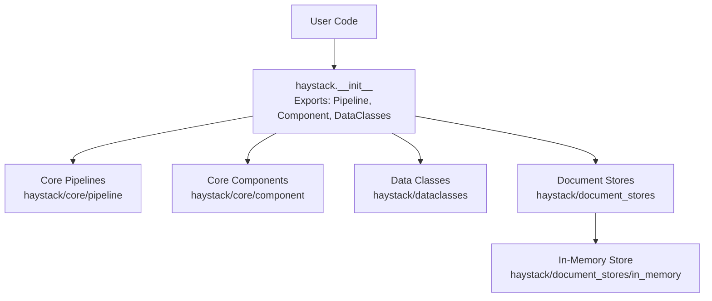
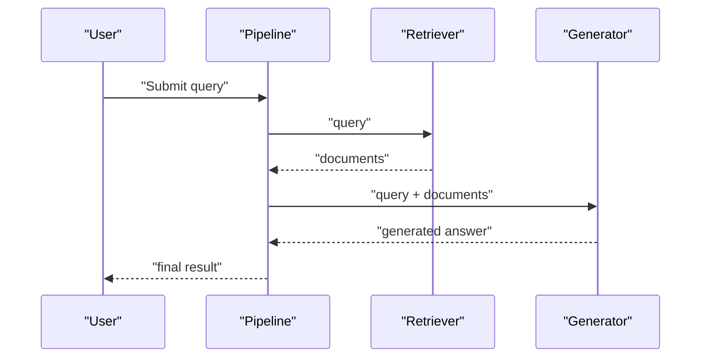
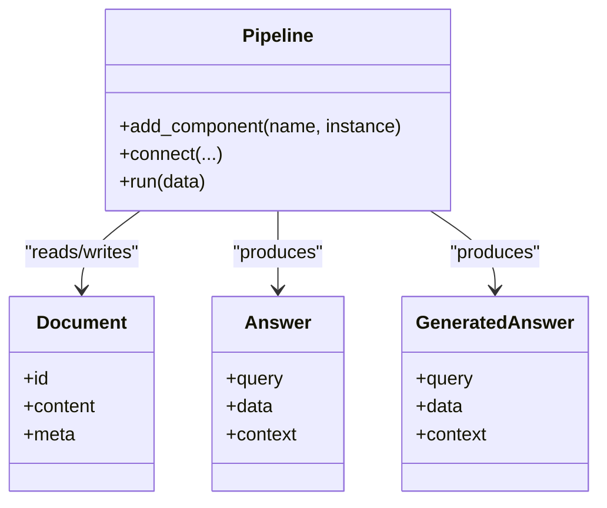
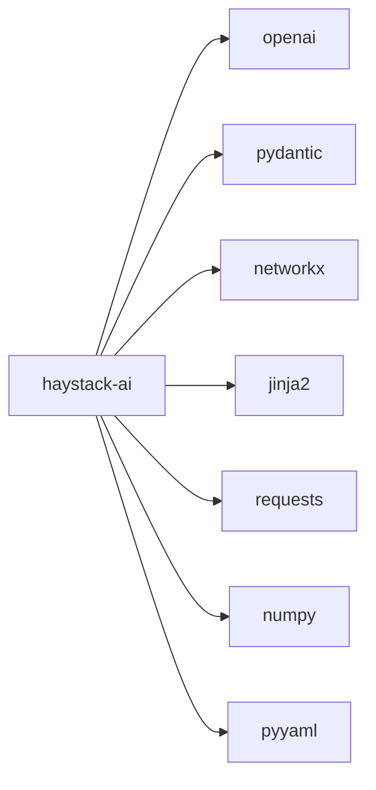

# Getting Started Tutorials

<cite>
**Referenced Files in This Document**
- [README.md](file://README.md)
- [pyproject.toml](file://pyproject.toml)
- [haystack/__init__.py](file://haystack/__init__.py)
- [haystack/dataclasses/__init__.py](file://haystack/dataclasses/__init__.py)
- [haystack/core/pipeline/__init__.py](file://haystack/core/pipeline/__init__.py)
- [haystack/core/component/__init__.py](file://haystack/core/component/__init__.py)
- [haystack/document_stores/in_memory/__init__.py](file://haystack/document_stores/in_memory/__init__.py)
- [docs-website/docs/intro.mdx](file://docs-website/docs/intro.mdx)
- [docs-website/versioned_docs/version-2.25/concepts/pipelines.mdx](file://docs-website/versioned_docs/version-2.25/concepts/pipelines.mdx)
- [docs-website/reference/haystack-api/generators_api.md](file://docs-website/reference/haystack-api/generators_api.md)
- [test/document_stores/test_in_memory.py](file://test/document_stores/test_in_memory.py)
- [releasenotes/notes/in-memory-docstore-memory-share-82b75d018b3545fc.yaml](file://releasenotes/notes/in-memory-docstore-memory-share-82b75d018b3545fc.yaml)
- [releasenotes/notes/add-serialization-to-inmemorydocumentstore-2aa4d9ac85b961c5.yaml](file://releasenotes/notes/add-serialization-to-inmemorydocumentstore-2aa4d9ac85b961c5.yaml)
</cite>

## Table of Contents
1. [Introduction](#introduction)
2. [Project Structure](#project-structure)
3. [Core Components](#core-components)
4. [Architecture Overview](#architecture-overview)
5. [Detailed Component Analysis](#detailed-component-analysis)
6. [Dependency Analysis](#dependency-analysis)
7. [Performance Considerations](#performance-considerations)
8. [Troubleshooting Guide](#troubleshooting-guide)
9. [Conclusion](#conclusion)
10. [Appendices](#appendices)

## Introduction
Welcome to Haystack, the open-source AI orchestration framework for building production-ready LLM applications. This guide walks you through installation, environment setup, and your first pipelines. You will learn core concepts like components, pipelines, and data classes, and practice hands-on exercises to build:
- Basic RAG applications
- Document search systems
- Simple conversational agents

You will also integrate with OpenAI, use in-memory document stores, and learn common beginner pitfalls and how to troubleshoot them.

## Project Structure
At a high level, Haystack exposes:
- A concise public API surface for pipelines, components, and data classes
- A modular ecosystem of components for retrieval, embedding, generation, and more
- Document stores (including in-memory) for storing and retrieving documents
- Rich documentation and API references

**Diagram sources**
- [haystack/__init__.py](file://haystack/__init__.py#L10-L41)
- [haystack/core/pipeline/__init__.py](file://haystack/core/pipeline/__init__.py)
- [haystack/core/component/__init__.py](file://haystack/core/component/__init__.py)
- [haystack/dataclasses/__init__.py](file://haystack/dataclasses/__init__.py#L10-L70)
- [haystack/document_stores/in_memory/__init__.py](file://haystack/document_stores/in_memory/__init__.py)

**Section sources**
- [README.md](file://README.md#L12-L52)
- [docs-website/docs/intro.mdx](file://docs-website/docs/intro.mdx#L7-L22)

## Core Components
This section introduces the foundational building blocks you will use in every Haystack project.

- Components: Reusable units that perform specific tasks (e.g., embedding, generating, ranking). They declare typed inputs/outputs and can be wired together in pipelines.
- Pipelines: Directed acyclic graphs that connect components and orchestrate data flow from input to output.
- Data Classes: Typed data structures for documents, answers, chat messages, and streaming chunks.

Key exports and entry points:
- Public API surface includes Pipeline, AsyncPipeline, component decorator, and data classes such as Document, Answer, and GeneratedAnswer.
- Data classes are lazily imported for performance and clarity.

Practical takeaway: Start small with a single component, then compose it into a pipeline, and finally connect it to a document store and generator.

**Section sources**
- [haystack/__init__.py](file://haystack/__init__.py#L10-L41)
- [haystack/dataclasses/__init__.py](file://haystack/dataclasses/__init__.py#L10-L70)

## Architecture Overview
Haystack pipelines are modular, composable workflows. Components are connected by linking their typed inputs and outputs. The pipeline orchestrates execution and data passing.

**Diagram sources**
- [docs-website/versioned_docs/version-2.25/concepts/pipelines.mdx](file://docs-website/versioned_docs/version-2.25/concepts/pipelines.mdx#L53-L76)

**Section sources**
- [docs-website/versioned_docs/version-2.25/concepts/pipelines.mdx](file://docs-website/versioned_docs/version-2.25/concepts/pipelines.mdx#L53-L76)

## Detailed Component Analysis

### Step-by-Step: First Pipeline
Follow these steps to create your first pipeline:
1. Install the package
2. Prepare environment variables (OpenAI key)
3. Create a pipeline
4. Add components (e.g., retriever and generator)
5. Connect components
6. Run the pipeline

Environment setup:
- Set your OpenAI API key via an environment variable recognized by the OpenAI generator.
- Ensure your runtime meets the minimum Python version.

Pipeline creation:
- Instantiate a Pipeline
- Add components with unique names
- Connect components by linking output of one to input of the next

Execution:
- Feed the pipeline with a query
- Retrieve the final answer

Tip: Use the public API exports to keep imports clean and readable.

**Section sources**
- [README.md](file://README.md#L28-L52)
- [docs-website/reference/haystack-api/generators_api.md](file://docs-website/reference/haystack-api/generators_api.md#L2047-L2085)
- [haystack/__init__.py](file://haystack/__init__.py#L10-L41)

### OpenAI Integration
The OpenAI generator supports:
- Model selection
- Streaming callbacks
- System prompts
- Generation parameters (e.g., temperature, top_p, stop sequences)
- Timeout and retry configuration

Best practices:
- Configure timeouts and retries via environment variables or constructor parameters
- Use streaming callbacks for long-running generations
- Keep system prompts concise and aligned with your use case

**Section sources**
- [docs-website/reference/haystack-api/generators_api.md](file://docs-website/reference/haystack-api/generators_api.md#L2047-L2085)

### In-Memory Document Store
The in-memory document store is ideal for prototyping and demos:
- Supports writing, filtering, and deleting documents
- Optional index-based memory sharing across instances
- Serialization helpers for persistence

Common operations:
- Write documents
- Filter documents
- Delete documents
- Serialize to disk for later reuse

**Section sources**
- [test/document_stores/test_in_memory.py](file://test/document_stores/test_in_memory.py#L515-L543)
- [releasenotes/notes/in-memory-docstore-memory-share-82b75d018b3545fc.yaml](file://releasenotes/notes/in-memory-docstore-memory-share-82b75d018b3545fc.yaml#L1-L19)
- [releasenotes/notes/add-serialization-to-inmemorydocumentstore-2aa4d9ac85b961c5.yaml](file://releasenotes/notes/add-serialization-to-inmemorydocumentstore-2aa4d9ac85b961c5.yaml#L1-L4)

### Data Classes Overview
Haystack provides typed data structures for common scenarios:
- Document: Core unit of stored content
- Answer, GeneratedAnswer, ExtractedAnswer: Structured outputs from generators and extractive readers
- ChatMessage, ChatRole, TextContent, ToolCall: For conversational and tool-use workflows
- StreamingChunk, FinishReason: For streaming responses

These are lazily imported to reduce startup overhead and improve clarity.

**Section sources**
- [haystack/dataclasses/__init__.py](file://haystack/dataclasses/__init__.py#L10-L70)

### Class Model: Core Types

**Diagram sources**
- [haystack/__init__.py](file://haystack/__init__.py#L14-L17)
- [haystack/dataclasses/__init__.py](file://haystack/dataclasses/__init__.py#L10-L70)

## Dependency Analysis
High-level dependencies:
- Core: NetworkX for graph pipelines, Pydantic for serialization, YAML for configuration
- Generators: OpenAI SDK
- Utilities: Requests, NumPy, Jinja2, tenacity, tqdm

Python version: The project targets Python 3.10+.

**Diagram sources**
- [pyproject.toml](file://pyproject.toml#L43-L62)

**Section sources**
- [pyproject.toml](file://pyproject.toml#L11-L62)

## Performance Considerations
- Prefer in-memory document stores for fast iteration during development
- Use streaming callbacks for long-running generations to reduce perceived latency
- Keep pipelines minimal and focused; add complexity incrementally
- Cache embeddings and intermediate results when appropriate
- Monitor timeouts and retries for external services

## Troubleshooting Guide
Common beginner mistakes and fixes:
- Missing API key: Ensure the OpenAI API key environment variable is set and accessible to the generator
- Type mismatches on connections: Verify the output type of one component matches the input type of the next
- Wrong Python version: Confirm your environment runs Python 3.10 or newer
- Noisy logs: Configure logging and tracing as needed for your environment
- Serialization issues: Use documented serialization helpers for in-memory document stores

Where to look:
- Generator configuration and parameters
- Pipeline connection validation
- Data class field names and types
- Document store write/filter/delete semantics

**Section sources**
- [docs-website/reference/haystack-api/generators_api.md](file://docs-website/reference/haystack-api/generators_api.md#L2047-L2085)
- [docs-website/versioned_docs/version-2.25/concepts/pipelines.mdx](file://docs-website/versioned_docs/version-2.25/concepts/pipelines.mdx#L53-L76)
- [haystack/dataclasses/__init__.py](file://haystack/dataclasses/__init__.py#L10-L70)
- [test/document_stores/test_in_memory.py](file://test/document_stores/test_in_memory.py#L515-L543)

## Conclusion
You now have the essentials to install Haystack, set up your environment, and build your first pipelines. Continue by exploring components for retrieval, embedding, and ranking, and by integrating with real document stores and model providers. The concepts introduced here—components, pipelines, and data classes—are the backbone of all Haystack applications.

## Appendices

### Appendix A: Installation Quick Reference
- Install the latest release via pip
- Optionally install from the main branch for bleeding-edge features
- Refer to the official documentation for Docker and other installation methods

**Section sources**
- [README.md](file://README.md#L28-L52)

### Appendix B: Environment Setup Checklist
- Python 3.10+
- OpenAI API key configured
- Virtual environment activated
- Optional: Logging/tracing enabled

**Section sources**
- [pyproject.toml](file://pyproject.toml#L11-L11)
- [docs-website/reference/haystack-api/generators_api.md](file://docs-website/reference/haystack-api/generators_api.md#L2047-L2085)

### Appendix C: Beginner Exercise Roadmap
- Build a basic search pipeline using an in-memory document store and a generator
- Add a retriever component and connect it into the pipeline
- Enable streaming and observe incremental responses
- Persist and reload documents using document store serialization

**Section sources**
- [test/document_stores/test_in_memory.py](file://test/document_stores/test_in_memory.py#L515-L543)
- [releasenotes/notes/add-serialization-to-inmemorydocumentstore-2aa4d9ac85b961c5.yaml](file://releasenotes/notes/add-serialization-to-inmemorydocumentstore-2aa4d9ac85b961c5.yaml#L1-L4)