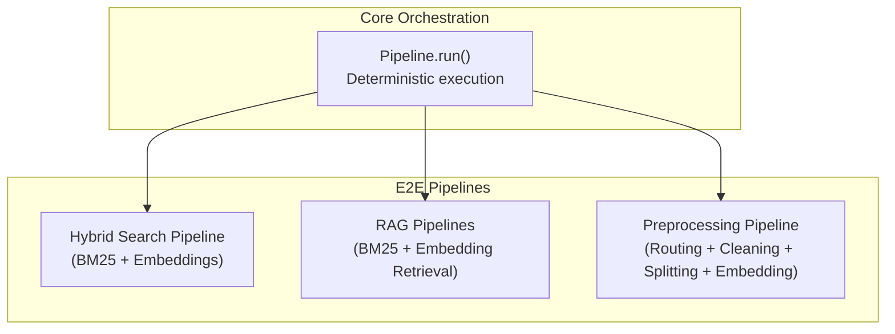
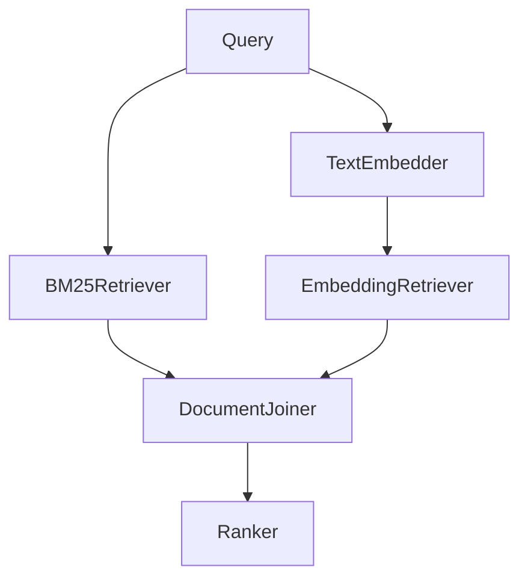
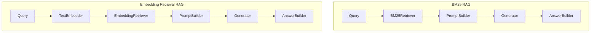
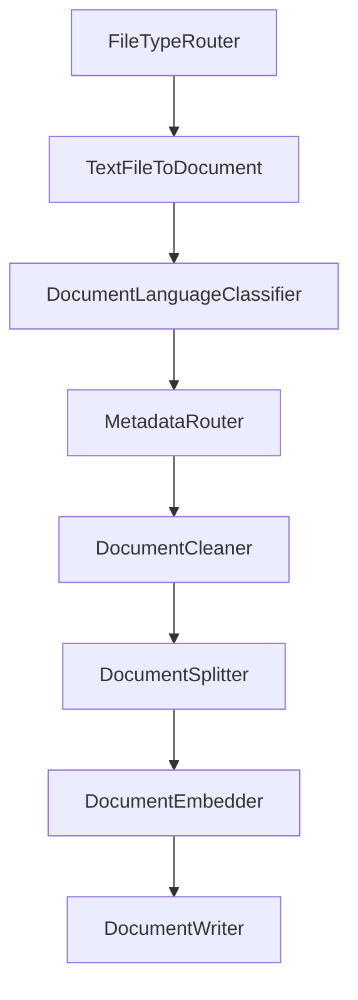
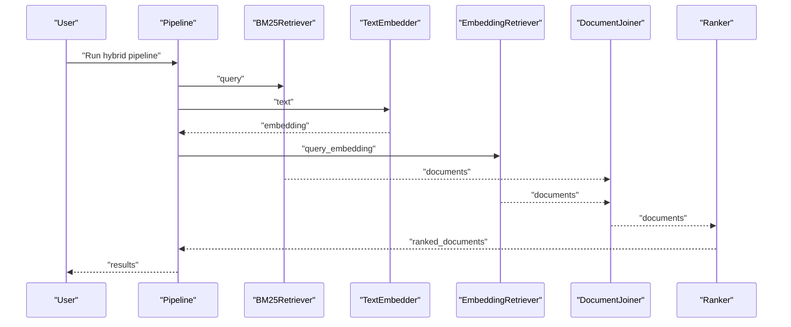
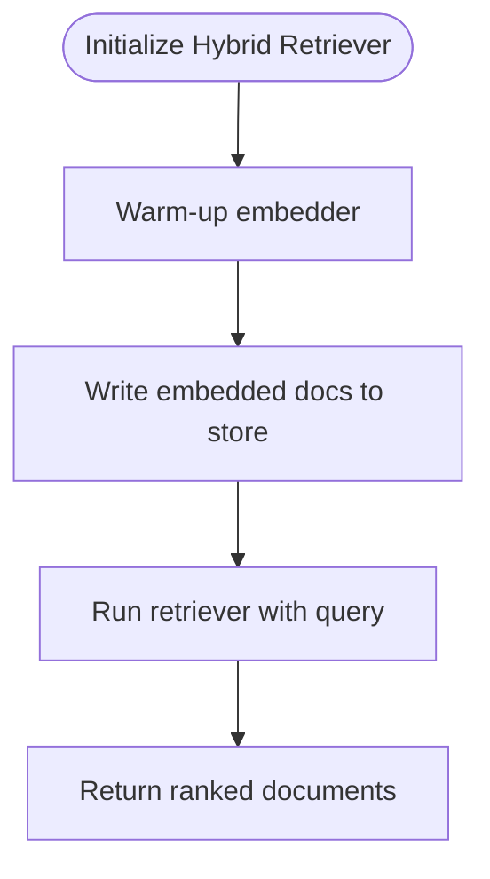
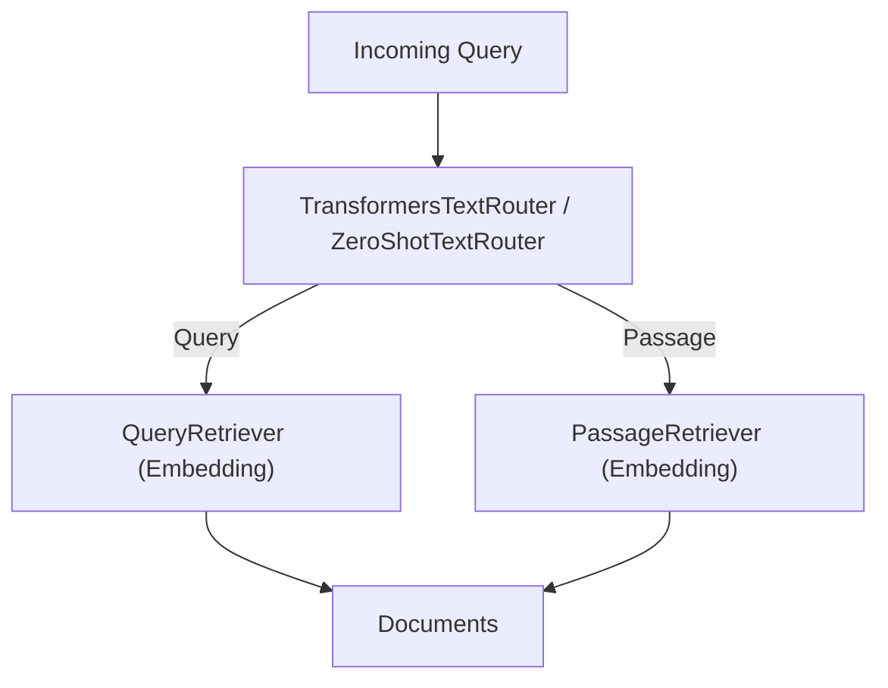
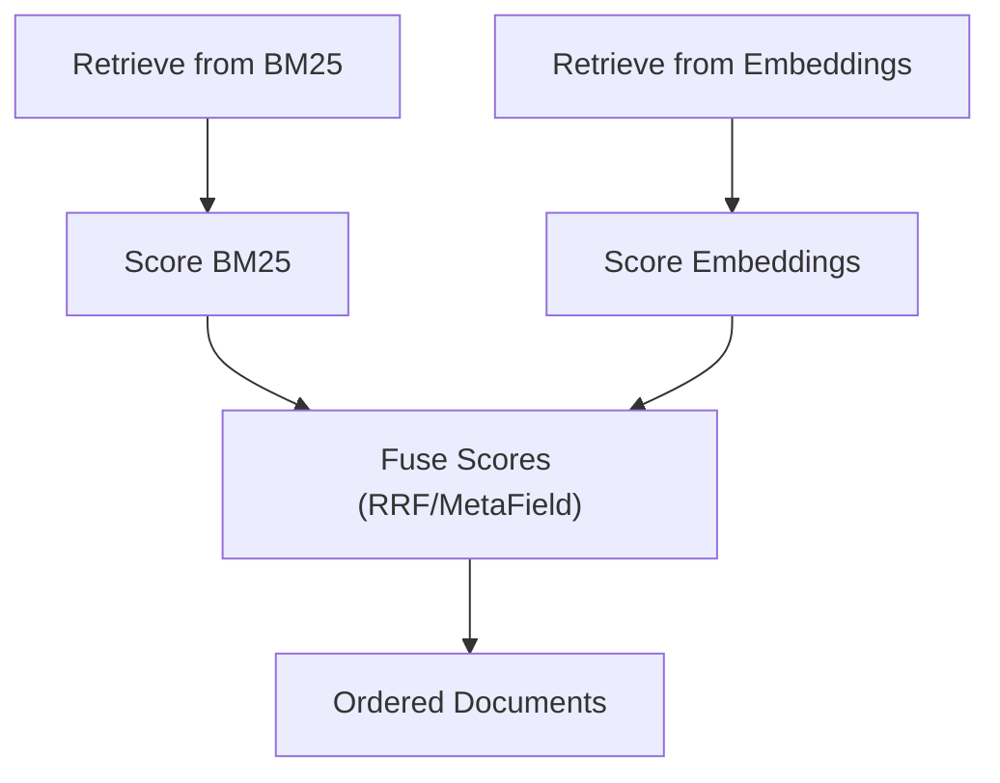
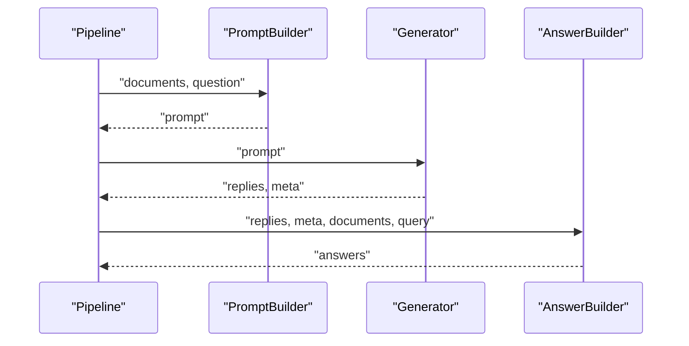
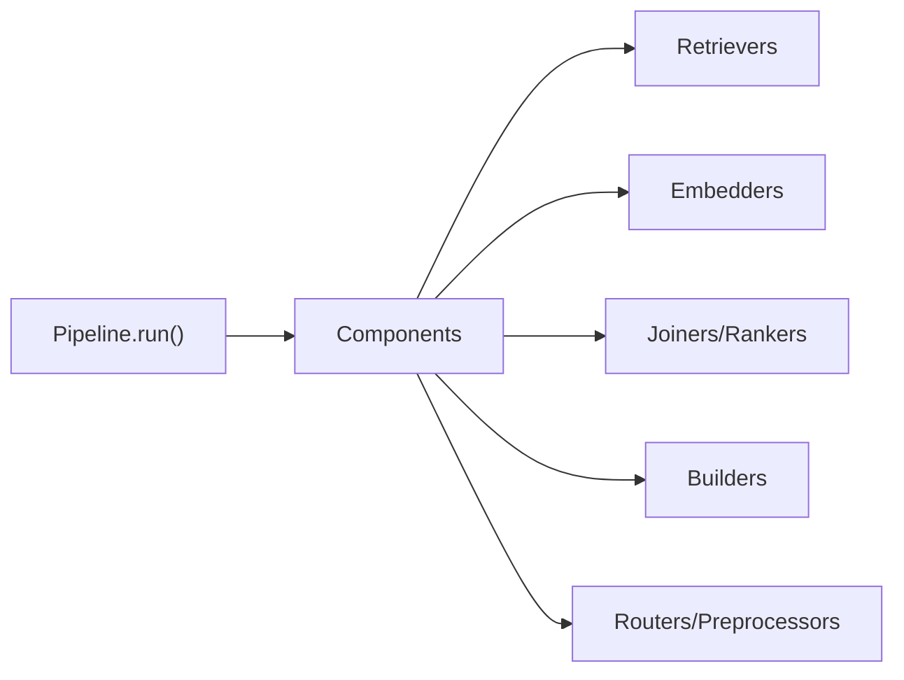

# Intermediate Use Cases

<cite>
**Referenced Files in This Document**
- [pipeline.py](file://haystack/core/pipeline/pipeline.py)
- [test_hybrid_doc_search_pipeline.py](file://e2e/pipelines/test_hybrid_doc_search_pipeline.py)
- [test_rag_pipelines_e2e.py](file://e2e/pipelines/test_rag_pipelines_e2e.py)
- [test_preprocessing_pipeline.py](file://e2e/pipelines/test_preprocessing_pipeline.py)
- [opensearchhybridretriever.mdx](file://docs-website/docs/pipeline-components/retrievers/opensearchhybridretriever.mdx)
- [transformerszeroshottextrouter.mdx](file://docs-website/docs/pipeline-components/routers/transformerszeroshottextrouter.mdx)
- [meta_field.py](file://haystack/components/rankers/meta_field.py)
- [answerbuilder.mdx](file://docs-website/docs/pipeline-components/builders/answerbuilder.mdx)
- [promptbuilder.mdx](file://docs-website/docs/pipeline-components/builders/promptbuilder.mdx)
- [choosing-a-document-store.mdx](file://docs-website/docs/concepts/document-store/choosing-a-document-store.mdx)
</cite>

## Table of Contents
1. [Introduction](#introduction)
2. [Project Structure](#project-structure)
3. [Core Components](#core-components)
4. [Architecture Overview](#architecture-overview)
5. [Detailed Component Analysis](#detailed-component-analysis)
6. [Dependency Analysis](#dependency-analysis)
7. [Performance Considerations](#performance-considerations)
8. [Troubleshooting Guide](#troubleshooting-guide)
9. [Conclusion](#conclusion)
10. [Appendices](#appendices)

## Introduction
This document provides intermediate-level tutorials for building advanced Haystack pipelines. It focuses on complex configurations such as multi-stage retrieval (BM25 + embeddings), hybrid search, document ranking strategies, result aggregation, and quality filtering. It also covers advanced component usage including prompt builders, custom routers, and specialized embedders, along with practical guidance on performance optimization, memory management, scaling, and customization patterns. Real-world scenarios include customer support bots, research assistants, and content recommendation systems.

## Project Structure
At the center of advanced pipeline usage is the orchestration engine that executes components in a deterministic order, manages inputs/outputs, and supports breakpoints and snapshots for debugging and recovery. End-to-end tests demonstrate realistic multi-stage pipelines for hybrid search, RAG, and preprocessing.

**Diagram sources**
- [pipeline.py](file://haystack/core/pipeline/pipeline.py#L111-L453)
- [test_hybrid_doc_search_pipeline.py](file://e2e/pipelines/test_hybrid_doc_search_pipeline.py#L14-L59)
- [test_rag_pipelines_e2e.py](file://e2e/pipelines/test_rag_pipelines_e2e.py#L24-L158)
- [test_preprocessing_pipeline.py](file://e2e/pipelines/test_preprocessing_pipeline.py#L15-L85)

**Section sources**
- [pipeline.py](file://haystack/core/pipeline/pipeline.py#L111-L453)
- [test_hybrid_doc_search_pipeline.py](file://e2e/pipelines/test_hybrid_doc_search_pipeline.py#L14-L59)
- [test_rag_pipelines_e2e.py](file://e2e/pipelines/test_rag_pipelines_e2e.py#L24-L158)
- [test_preprocessing_pipeline.py](file://e2e/pipelines/test_preprocessing_pipeline.py#L15-L85)

## Core Components
- Pipeline orchestration engine: synchronous execution, deterministic ordering, tracing, and error handling with snapshots and breakpoints.
- Retrievers: BM25 and embedding-based retrievers for single-stage and hybrid retrieval.
- Embedders: text and document embedders for dense retrieval.
- Joiners: combine results from multiple retrievers.
- Rankers: similarity-based and reciprocal rank fusion (RRF) strategies.
- Builders: prompt builder and answer builder for LLM prompts and answers.
- Routers: classify and route queries or documents by type, metadata, language, or zero-shot classification.
- Preprocessors: cleaning, splitting, and language classification for quality filtering.

Key capabilities:
- Multi-stage retrieval: BM25 → joiner → ranker
- Hybrid retrieval: BM25 + embeddings → joiner → ranker
- Query classification routing: route queries to specialized retrieval paths
- Quality filtering: language classification and metadata routing
- Prompt engineering: dynamic prompt construction with context aggregation

**Section sources**
- [pipeline.py](file://haystack/core/pipeline/pipeline.py#L111-L453)
- [test_hybrid_doc_search_pipeline.py](file://e2e/pipelines/test_hybrid_doc_search_pipeline.py#L14-L59)
- [test_rag_pipelines_e2e.py](file://e2e/pipelines/test_rag_pipelines_e2e.py#L24-L158)
- [test_preprocessing_pipeline.py](file://e2e/pipelines/test_preprocessing_pipeline.py#L15-L85)

## Architecture Overview
The following diagrams illustrate three advanced pipeline architectures: hybrid search, RAG with BM25 and embeddings, and a preprocessing pipeline.

### Hybrid Search Pipeline

**Diagram sources**
- [test_hybrid_doc_search_pipeline.py](file://e2e/pipelines/test_hybrid_doc_search_pipeline.py#L14-L59)

### RAG Pipelines (BM25 and Embedding Retrieval)

**Diagram sources**
- [test_rag_pipelines_e2e.py](file://e2e/pipelines/test_rag_pipelines_e2e.py#L24-L158)

### Preprocessing Pipeline

**Diagram sources**
- [test_preprocessing_pipeline.py](file://e2e/pipelines/test_preprocessing_pipeline.py#L15-L85)

## Detailed Component Analysis

### Multi-Stage Retrieval (BM25 + Embeddings)
- Retrieve via BM25 and embeddings separately, then join and rerank.
- Use DocumentJoiner to merge candidates and a Ranker to produce final scores.
- Example demonstrates hybrid retrieval with reciprocal rank fusion and top-k tuning.

**Diagram sources**
- [test_hybrid_doc_search_pipeline.py](file://e2e/pipelines/test_hybrid_doc_search_pipeline.py#L14-L59)

**Section sources**
- [test_hybrid_doc_search_pipeline.py](file://e2e/pipelines/test_hybrid_doc_search_pipeline.py#L14-L59)

### Hybrid Search with Specialized Retriever
- Use a specialized hybrid retriever that combines BM25 and embedding scores with configurable join modes.
- Warm-up embedders and write embedded documents to the store before querying.

**Diagram sources**
- [opensearchhybridretriever.mdx](file://docs-website/docs/pipeline-components/retrievers/opensearchhybridretriever.mdx#L110-L133)

**Section sources**
- [opensearchhybridretriever.mdx](file://docs-website/docs/pipeline-components/retrievers/opensearchhybridretriever.mdx#L110-L133)

### Query Classification Routing
- Route queries to BM25 or embedding retrieval depending on intent using transformers-based routers.
- Zero-shot router can classify free-form text into categories and send to appropriate retrieval paths.

**Diagram sources**
- [transformerszeroshottextrouter.mdx](file://docs-website/docs/pipeline-components/routers/transformerszeroshottextrouter.mdx#L81-L115)

**Section sources**
- [transformerszeroshottextrouter.mdx](file://docs-website/docs/pipeline-components/routers/transformerszeroshottextrouter.mdx#L81-L115)

### Document Ranking Strategies
- Reciprocal Rank Fusion (RRF): combine ranks from multiple sources using a fixed constant.
- Meta field fusion: blend scores with linearly decaying relevance based on position.
- Lost in the Middle: reorder documents to emphasize those at extremes of context.

**Diagram sources**
- [meta_field.py](file://haystack/components/rankers/meta_field.py#L410-L416)

**Section sources**
- [meta_field.py](file://haystack/components/rankers/meta_field.py#L389-L416)

### Prompt Builders and Answer Builders
- PromptBuilder constructs prompts with dynamic context injection from retrieved documents.
- AnswerBuilder aggregates LLM replies and metadata into structured answers.

**Diagram sources**
- [promptbuilder.mdx](file://docs-website/docs/pipeline-components/builders/promptbuilder.mdx)
- [answerbuilder.mdx](file://docs-website/docs/pipeline-components/builders/answerbuilder.mdx)

**Section sources**
- [promptbuilder.mdx](file://docs-website/docs/pipeline-components/builders/promptbuilder.mdx)
- [answerbuilder.mdx](file://docs-website/docs/pipeline-components/builders/answerbuilder.mdx)

### Document Preprocessing Pipeline
- Filter by file type, convert to documents, classify language, route by metadata, clean, split, embed, and write to store.

**Diagram sources**
- [test_preprocessing_pipeline.py](file://e2e/pipelines/test_preprocessing_pipeline.py#L15-L85)

**Section sources**
- [test_preprocessing_pipeline.py](file://e2e/pipelines/test_preprocessing_pipeline.py#L15-L85)

### Real-World Scenarios
- Customer support bot: classify incoming queries, route to domain-specific retrievers, build contextual prompts, and generate concise answers.
- Research assistant: multi-stage retrieval (BM25 for facts, embeddings for semantics), rerank with RRF, and filter by language/metadata.
- Content recommendation: preprocess articles, embed, rank by similarity, and apply quality filters.

[No sources needed since this section synthesizes previous analyses without quoting specific files]

## Dependency Analysis
- Pipeline orchestrator depends on component inputs/outputs and maintains a deterministic execution order.
- Hybrid pipelines couple BM25 and embedding retrievers through a joiner and ranker.
- RAG pipelines connect retrievers to prompt builders and generators, then to answer builders.
- Preprocessing pipelines chain routers, cleaners, splitters, embedders, and writers.

**Diagram sources**
- [pipeline.py](file://haystack/core/pipeline/pipeline.py#L111-L453)

**Section sources**
- [pipeline.py](file://haystack/core/pipeline/pipeline.py#L111-L453)

## Performance Considerations
- Warm-up embedders before heavy inference to avoid cold-start latency spikes.
- Tune top-k per stage to balance recall and latency; adjust join and ranker parameters accordingly.
- Prefer vector libraries or pure vector databases for high-dimensional data and speed-sensitive workloads.
- Use in-memory stores for fast prototyping; scale out to vector-capable databases for production.
- Minimize redundant computations by sharing preprocessed embeddings and caching prompts.

[No sources needed since this section provides general guidance]

## Troubleshooting Guide
- Blocked pipeline: check connectivity and required inputs; ensure all upstream components are connected and provide necessary outputs.
- Breakpoints and snapshots: use breakpoints to pause execution and capture snapshots for debugging; inspect partial results and component states.
- Serialization/deserialization: leverage component serialization APIs to persist and restore pipelines and components.

Common checks:
- Verify component connections and socket names.
- Confirm input shapes match component signatures.
- Inspect logs for warnings about missing scores or invalid ranges.

**Section sources**
- [pipeline.py](file://haystack/core/pipeline/pipeline.py#L310-L325)
- [pipeline.py](file://haystack/core/pipeline/pipeline.py#L386-L428)

## Conclusion
Advanced Haystack pipelines enable sophisticated retrieval, ranking, and generation workflows. By combining BM25 and embeddings, routing queries intelligently, and applying quality filters, you can build robust systems for customer support, research assistance, and recommendations. Use the orchestration engine’s debugging features, tune ranking strategies, and select appropriate document stores to achieve optimal performance and scalability.

[No sources needed since this section summarizes without analyzing specific files]

## Appendices

### Choosing a Document Store
- Vector libraries: high performance for speed-critical applications.
- Pure vector DBs: manage large-scale high-dimensional vectors.
- Vector-capable SQL/NoSQL: balance structured data and vectors.
- Full-text search DBs: strong text search capabilities for production.
- In-memory: fast prototyping on small datasets.

**Section sources**
- [choosing-a-document-store.mdx](file://docs-website/docs/concepts/document-store/choosing-a-document-store.mdx#L48-L64)