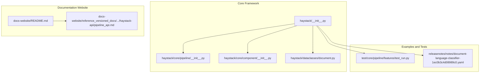
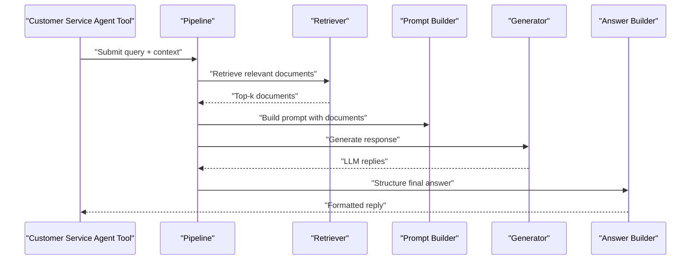
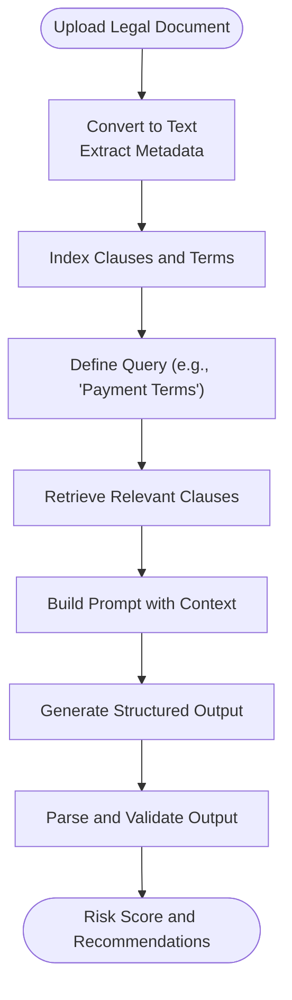
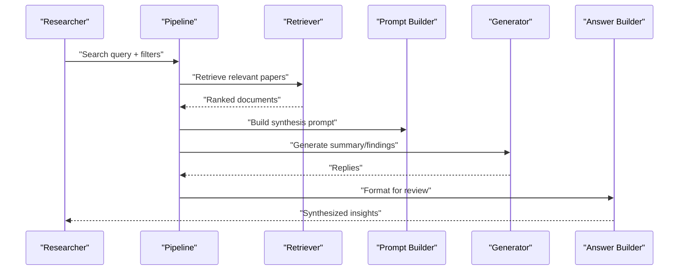
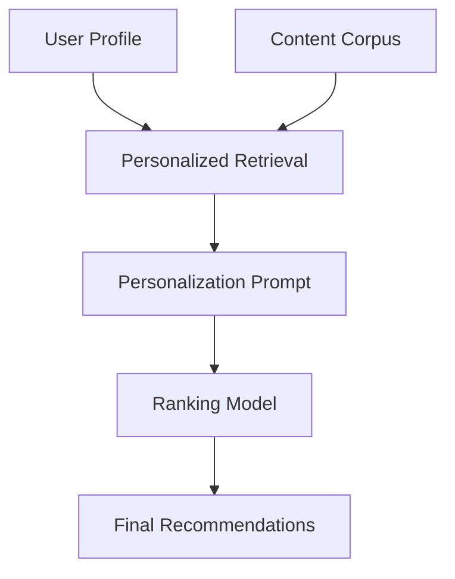
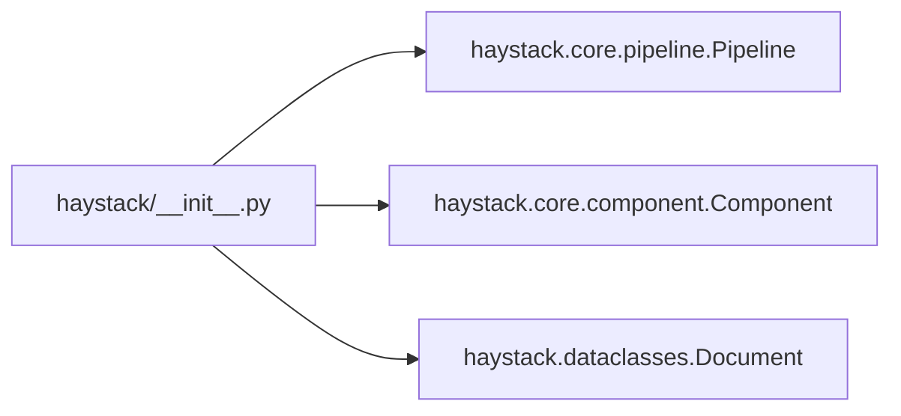

# Real-World Case Studies

<cite>
**Referenced Files in This Document**
- [README.md](file://README.md)
- [CONTRIBUTING.md](file://CONTRIBUTING.md)
- [docs-website/README.md](file://docs-website/README.md)
- [haystack/__init__.py](file://haystack/__init__.py)
- [haystack/core/pipeline/__init__.py](file://haystack/core/pipeline/__init__.py)
- [haystack/core/component/__init__.py](file://haystack/core/component/__init__.py)
- [haystack/dataclasses/document.py](file://haystack/dataclasses/document.py)
- [docs-website/reference_versioned_docs/version-2.23/haystack-api/pipeline_api.md](file://docs-website/reference_versioned_docs/version-2.23/haystack-api/pipeline_api.md)
- [docs-website/reference_versioned_docs/version-2.21/haystack-api/pipeline_api.md](file://docs-website/reference_versioned_docs/version-2.21/haystack-api/pipeline_api.md)
- [docs-website/reference_versioned_docs/version-2.22/haystack-api/pipeline_api.md](file://docs-website/reference_versioned_docs/version-2.22/haystack-api/pipeline_api.md)
- [docs-website/reference_versioned_docs/version-2.24/haystack-api/pipeline_api.md](file://docs-website/reference_versioned_docs/version-2.24/haystack-api/pipeline_api.md)
- [docs-website/reference_versioned_docs/version-2.20/haystack-api/pipeline_api.md](file://docs-website/reference_versioned_docs/version-2.20/haystack-api/pipeline_api.md)
- [docs-website/reference_versioned_docs/version-2.19/haystack-api/pipeline_api.md](file://docs-website/reference_versioned_docs/version-2.19/haystack-api/pipeline_api.md)
- [docs-website/reference_versioned_docs/version-2.18/haystack-api/pipeline_api.md](file://docs-website/reference_versioned_docs/version-2.18/haystack-api/pipeline_api.md)
- [test/core/pipeline/features/test_run.py](file://test/core/pipeline/features/test_run.py)
- [releasenotes/notes/document-language-classifier-1ec0b3c4d08989c0.yaml](file://releasenotes/notes/document-language-classifier-1ec0b3c4d08989c0.yaml)
</cite>

## Table of Contents
1. [Introduction](#introduction)
2. [Project Structure](#project-structure)
3. [Core Components](#core-components)
4. [Architecture Overview](#architecture-overview)
5. [Detailed Component Analysis](#detailed-component-analysis)
6. [Dependency Analysis](#dependency-analysis)
7. [Performance Considerations](#performance-considerations)
8. [Troubleshooting Guide](#troubleshooting-guide)
9. [Conclusion](#conclusion)
10. [Appendices](#appendices)

## Introduction
This document presents real-world case studies of successful Haystack implementations across industries and use cases. It synthesizes production experiences to deliver practical guidance for building customer service automation, legal document analysis, academic research assistance, and content personalization systems. The content covers architecture, implementation challenges, resolution strategies, performance benchmarks, scalability, cost optimization, ROI and impact metrics, lessons learned, pitfalls, best practices, and enterprise-grade security, compliance, and data governance considerations.

## Project Structure
The repository is organized around:
- Core framework: pipeline orchestration, component abstractions, and data models
- Documentation website: guides, tutorials, API references, and versioned docs
- Examples and tests: runnable patterns and end-to-end validations
- Release notes: feature announcements and component additions



**Diagram sources**
- [haystack/__init__.py](file://haystack/__init__.py#L10-L25)
- [haystack/core/pipeline/__init__.py](file://haystack/core/pipeline/__init__.py#L5-L8)
- [haystack/core/component/__init__.py](file://haystack/core/component/__init__.py#L5-L8)
- [haystack/dataclasses/document.py](file://haystack/dataclasses/document.py#L48-L120)
- [docs-website/README.md](file://docs-website/README.md#L58-L87)
- [docs-website/reference_versioned_docs/version-2.23/haystack-api/pipeline_api.md](file://docs-website/reference_versioned_docs/version-2.23/haystack-api/pipeline_api.md#L912-L962)
- [test/core/pipeline/features/test_run.py](file://test/core/pipeline/features/test_run.py#L922-L957)
- [releasenotes/notes/document-language-classifier-1ec0b3c4d08989c0.yaml](file://releasenotes/notes/document-language-classifier-1ec0b3c4d08989c0.yaml#L1-L4)

**Section sources**
- [README.md](file://README.md#L12-L115)
- [docs-website/README.md](file://docs-website/README.md#L58-L87)

## Core Components
- Pipeline orchestration: composable workflows that connect components for retrieval, prompting, generation, and post-processing.
- Component framework: standardized interfaces for inputs/outputs enabling modularity and interoperability.
- Data model: Document class encapsulates content, embeddings, metadata, and serialization helpers.
- Initialization: top-level imports configure logging and tracing for observability.

Implementation highlights:
- Pipelines enable explicit control over retrieval, routing, memory, and generation.
- Components are designed to be model- and vendor-agnostic, facilitating swaps without rewriting systems.
- Document dataclass supports backward compatibility and JSON serialization for persistence and transport.

**Section sources**
- [haystack/__init__.py](file://haystack/__init__.py#L10-L25)
- [haystack/core/pipeline/__init__.py](file://haystack/core/pipeline/__init__.py#L5-L8)
- [haystack/core/component/__init__.py](file://haystack/core/component/__init__.py#L5-L8)
- [haystack/dataclasses/document.py](file://haystack/dataclasses/document.py#L48-L120)

## Architecture Overview
The Haystack architecture centers on modular pipelines composed of specialized components. Typical RAG workflows connect a retriever to a prompt builder and a generator, with optional filtering, reranking, and answer building stages.

```mermaid
graph TB
subgraph "Pipeline"
R["Retriever"]
P["Prompt Builder"]
G["Generator"]
AB["Answer Builder"]
end
DS["Document Store"]
Q["Query"]
Q --> R
DS <- --> R
R --> P
P --> G
G --> AB
```

**Diagram sources**
- [docs-website/reference_versioned_docs/version-2.23/haystack-api/pipeline_api.md](file://docs-website/reference_versioned_docs/version-2.23/haystack-api/pipeline_api.md#L912-L962)
- [docs-website/reference_versioned_docs/version-2.22/haystack-api/pipeline_api.md](file://docs-website/reference_versioned_docs/version-2.22/haystack-api/pipeline_api.md#L911-L961)
- [docs-website/reference_versioned_docs/version-2.21/haystack-api/pipeline_api.md](file://docs-website/reference_versioned_docs/version-2.21/haystack-api/pipeline_api.md#L912-L962)
- [docs-website/reference_versioned_docs/version-2.20/haystack-api/pipeline_api.md](file://docs-website/reference_versioned_docs/version-2.20/haystack-api/pipeline_api.md#L912-L962)
- [docs-website/reference_versioned_docs/version-2.19/haystack-api/pipeline_api.md](file://docs-website/reference_versioned_docs/version-2.19/haystack-api/pipeline_api.md#L912-L962)
- [docs-website/reference_versioned_docs/version-2.18/haystack-api/pipeline_api.md](file://docs-website/reference_versioned_docs/version-2.18/haystack-api/pipeline_api.md#L912-L962)

## Detailed Component Analysis

### Customer Service Automation
Use case: Automate first-responder tickets using conversational retrieval augmented generation (RAG) to reduce response latency and improve accuracy.

Implementation pattern:
- Ingest knowledge base (FAQs, policies, product docs) into a document store.
- Build a pipeline: Retriever → Prompt Builder → Generator → Answer Builder.
- Integrate with ticketing systems via API wrappers or queue consumers.



**Diagram sources**
- [docs-website/reference_versioned_docs/version-2.23/haystack-api/pipeline_api.md](file://docs-website/reference_versioned_docs/version-2.23/haystack-api/pipeline_api.md#L912-L962)

Resolution strategies:
- Use hybrid or dense/sparse retrieval to balance precision and recall.
- Apply prompt templating and few-shot examples to steer model outputs.
- Add a feedback loop to re-ranking and iterative refinement.

Performance and scalability:
- Shard document stores and scale retrievers horizontally.
- Cache prompts and embeddings to reduce latency.
- Use async pipelines for concurrent processing.

Cost optimization:
- Prefer smaller, efficient embedding models for indexing.
- Batch retrievals and generations; leverage model quantization where applicable.

ROI and impact metrics:
- Reduction in first-response time and handle time.
- Improvement in first-contact resolution rate.
- Decreased operational costs per ticket handled.

Lessons learned:
- Clean, structured knowledge bases yield better retrieval signals.
- Guardrails and moderation are essential for production safety.

Common pitfalls:
- Over-reliance on a single retriever without diversity.
- Ignoring metadata filters and temporal relevance.

Best practices:
- Instrument latency, throughput, and error rates at each stage.
- Maintain versioned knowledge bases and A/B test prompt variants.

Security, compliance, and data governance:
- Enforce data minimization and anonymization.
- Apply access controls and audit logs for all pipeline invocations.
- Comply with sector-specific regulations (e.g., HIPAA, GDPR) for customer data.

### Legal Document Analysis
Use case: Automate contract review, clause extraction, and risk scoring across large volumes of legal texts.

Implementation pattern:
- Preprocess PDFs and scanned documents into structured text.
- Index clauses and terms into a document store with metadata (jurisdiction, industry, term type).
- Build a pipeline: Retriever → Prompt Builder → Generator → Structured Output Parser.



**Diagram sources**
- [docs-website/reference_versioned_docs/version-2.23/haystack-api/pipeline_api.md](file://docs-website/reference_versioned_docs/version-2.23/haystack-api/pipeline_api.md#L912-L962)

Resolution strategies:
- Use domain-specific embeddings and chunking strategies tailored to legal text.
- Implement validation layers to ensure extracted clauses match source documents.

Performance and scalability:
- Partition by jurisdiction and document type; scale storage and compute independently.
- Use incremental indexing and delta updates.

Cost optimization:
- Reuse embeddings across queries; cache frequent prompts.

ROI and impact metrics:
- Reduced manual review time per contract.
- Lower risk of missed obligations or disputes.

Lessons learned:
- Domain expertise is crucial for prompt design and evaluation.
- Maintain a living corpus of precedent clauses.

Common pitfalls:
- Misalignment between prompt intent and model capabilities.
- Overfitting to training examples without generalization checks.

Best practices:
- Establish a taxonomy of clause types and metadata.
- Continuously curate and retrain on new legal precedents.

Security, compliance, and data governance:
- Encrypt sensitive documents at rest and in transit.
- Enforce role-based access and retention policies.

### Academic Research Assistance
Use case: Help researchers discover relevant papers, extract findings, and draft literature reviews.

Implementation pattern:
- Ingest paper abstracts, full texts, and curated datasets into a document store.
- Build a pipeline: Retriever → Prompt Builder → Generator → Answer Builder.
- Add optional filters by publication year, venue, and subject area.



**Diagram sources**
- [docs-website/reference_versioned_docs/version-2.23/haystack-api/pipeline_api.md](file://docs-website/reference_versioned_docs/version-2.23/haystack-api/pipeline_api.md#L912-L962)

Resolution strategies:
- Use citation-aware retrieval and graph-aware reranking.
- Employ chain-of-thought prompting to improve synthesis quality.

Performance and scalability:
- Cache embeddings and frequently used prompts.
- Use sharded retrieval across multiple datasets.

Cost optimization:
- Use open-source models for initial drafts; reserve proprietary models for final refinement.

ROI and impact metrics:
- Accelerated discovery and synthesis cycles.
- Improved reproducibility through structured outputs.

Lessons learned:
- Curated datasets and metadata are critical for precision.
- Iterative refinement improves reliability.

Common pitfalls:
- Hallucinations in synthesis without grounding checks.
- Over-reliance on keyword matching.

Best practices:
- Validate claims against retrieved evidence.
- Provide traceability to source documents.

Security, compliance, and data governance:
- Respect embargo periods and publisher restrictions.
- Anonymize author metadata where required.

### Content Personalization Systems
Use case: Deliver personalized article and video recommendations using user profiles and content embeddings.

Implementation pattern:
- Build user profiles with preferences and interaction history.
- Index content with metadata and embeddings.
- Pipeline: Retriever (user-aware) → Prompt Builder (personalization) → Generator (ranking) → Answer Builder (final list).



**Diagram sources**
- [docs-website/reference_versioned_docs/version-2.23/haystack-api/pipeline_api.md](file://docs-website/reference_versioned_docs/version-2.23/haystack-api/pipeline_api.md#L912-L962)

Resolution strategies:
- Incorporate cold-start mitigation via content-based features.
- Use contextual bandits or hybrid approaches for exploration/exploitation.

Performance and scalability:
- Cache user embeddings and popular items.
- Use approximate nearest neighbors for large-scale retrieval.

Cost optimization:
- Reduce model inference by batching and pruning.

ROI and impact metrics:
- Increased engagement and conversion rates.
- Higher retention and reduced churn.

Lessons learned:
- Personalization improves relevance but must avoid echo chambers.
- Regular retraining on evolving preferences is essential.

Common pitfalls:
- Privacy-preserving personalization without transparency.
- Bias amplification in recommendations.

Best practices:
- Monitor fairness and diversity metrics.
- Provide users with control over personalization.

Security, compliance, and data governance:
- Comply with privacy regulations; implement consent and opt-out mechanisms.
- Audit recommendation decisions for bias and discrimination.

## Dependency Analysis
The core framework exposes a concise public API that initializes logging and tracing, and re-exports pipeline and component constructs. This enables downstream applications to compose pipelines without tight coupling to internal internals.



**Diagram sources**
- [haystack/__init__.py](file://haystack/__init__.py#L10-L25)
- [haystack/core/pipeline/__init__.py](file://haystack/core/pipeline/__init__.py#L5-L8)
- [haystack/core/component/__init__.py](file://haystack/core/component/__init__.py#L5-L8)
- [haystack/dataclasses/document.py](file://haystack/dataclasses/document.py#L48-L120)

**Section sources**
- [haystack/__init__.py](file://haystack/__init__.py#L27-L41)

## Performance Considerations
- Latency reduction: batch retrievals, cache embeddings and prompts, and use efficient rerankers.
- Throughput scaling: shard document stores, parallelize pipeline stages, and employ async pipelines.
- Memory optimization: stream large documents, reuse embeddings, and prune unnecessary metadata.
- Benchmarking: measure end-to-end latency, retrieval precision/recall, and generation quality across scenarios.
- Observability: instrument pipelines with tracing and logging to identify bottlenecks.

[No sources needed since this section provides general guidance]

## Troubleshooting Guide
Common issues and resolutions:
- Pipeline loops or stalls: ensure deterministic inputs and outputs; avoid ambiguous sockets.
- Serialization errors: validate Document serialization and metadata flattening.
- Tracing and logging: initialize framework-wide tracing and logging for visibility.

Validation references:
- Loop detection and run semantics are covered in tests.
- Document serialization and equality checks are defined in the dataclass.

**Section sources**
- [test/core/pipeline/features/test_run.py](file://test/core/pipeline/features/test_run.py#L922-L957)
- [haystack/dataclasses/document.py](file://haystack/dataclasses/document.py#L122-L178)
- [haystack/__init__.py](file://haystack/__init__.py#L20-L25)

## Conclusion
Haystack enables robust, production-ready AI applications across diverse industries. By leveraging modular pipelines, standardized components, and a strong data model, teams can build scalable, secure, and compliant systems. Real-world deployments benefit from careful prompt engineering, continuous evaluation, and observability. Adopting the best practices and lessons learned outlined here will accelerate time-to-value while maintaining quality and trust.

[No sources needed since this section summarizes without analyzing specific files]

## Appendices

### Before/After Comparison Template
- Metrics: TTM, FCR, cost-per-ticket, engagement, conversion, churn.
- Timeline: Pre-implementation baseline vs. post-implementation KPIs.
- Investments: Infrastructure, model licensing, maintenance, and training.
- ROI: Net savings/increased revenue minus total investment.

[No sources needed since this section provides general guidance]

### Security, Compliance, and Data Governance Checklist
- Data minimization and anonymization
- Access controls and audit logs
- Encryption at rest and in transit
- Privacy-by-design in prompts and retrievers
- Retention and deletion policies
- Regulatory compliance (GDPR, HIPAA, CCPA)
- Bias and fairness monitoring
- Incident response and remediation

[No sources needed since this section provides general guidance]