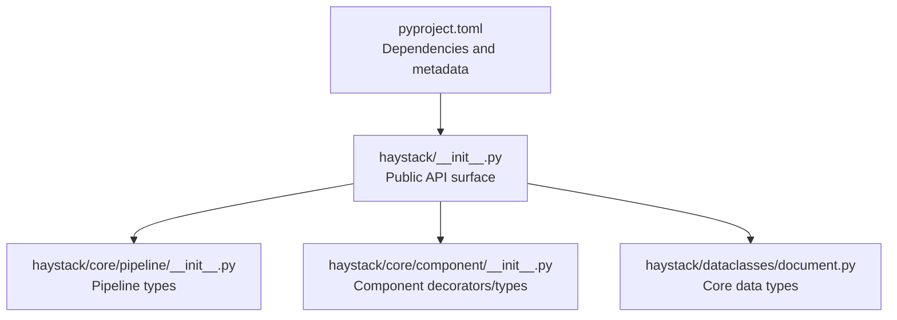
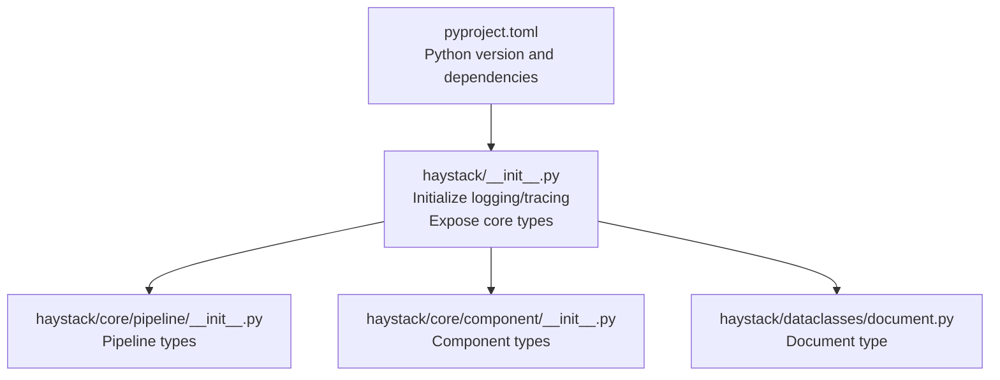
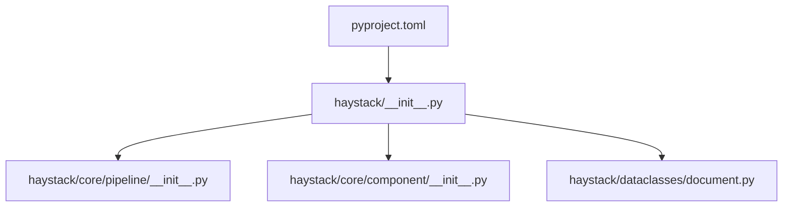

# Getting Started

<cite>
**Referenced Files in This Document**
- [README.md](file://README.md)
- [pyproject.toml](file://pyproject.toml)
- [haystack/__init__.py](file://haystack/__init__.py)
- [haystack/core/pipeline/__init__.py](file://haystack/core/pipeline/__init__.py)
- [haystack/core/component/__init__.py](file://haystack/core/component/__init__.py)
- [haystack/dataclasses/document.py](file://haystack/dataclasses/document.py)
- [docker/README.md](file://docker/README.md)
- [docs-website/docs/development/deployment/docker.mdx](file://docs-website/docs/development/deployment/docker.mdx)
- [examples/README.md](file://examples/README.md)
</cite>

## Table of Contents
1. [Introduction](#introduction)
2. [Project Structure](#project-structure)
3. [Core Components](#core-components)
4. [Architecture Overview](#architecture-overview)
5. [Detailed Component Analysis](#detailed-component-analysis)
6. [Dependency Analysis](#dependency-analysis)
7. [Performance Considerations](#performance-considerations)
8. [Troubleshooting Guide](#troubleshooting-guide)
9. [Conclusion](#conclusion)
10. [Appendices](#appendices)

## Introduction
Haystack is an open-source AI orchestration framework designed to help you build production-ready LLM applications in Python. It enables you to construct modular pipelines and agent workflows with explicit control over retrieval, routing, memory, and generation. The framework emphasizes transparency, customization, and scalability, supporting vendor-agnostic model integrations and extensible ecosystems.

Key benefits:
- Modular pipeline design for flexible, composable workflows
- Vendor-agnostic model support across providers and local models
- Extensible component ecosystem and strong observability tooling

This guide provides a practical, beginner-friendly path to install, configure, and run your first pipeline using Haystack.

**Section sources**
- [README.md](file://README.md#L12-L14)
- [README.md](file://README.md#L54-L70)

## Project Structure
At a high level, Haystack exposes a concise public API surface while organizing internal capabilities into focused subsystems:
- Public API initialization sets up logging, tracing, and imports core types
- Pipelines and components are the primary building blocks for orchestrating LLM workflows
- Data structures define the canonical types used across the framework (e.g., Document)

**Diagram sources**
- [haystack/__init__.py](file://haystack/__init__.py#L10-L25)
- [haystack/core/pipeline/__init__.py](file://haystack/core/pipeline/__init__.py#L5-L8)
- [haystack/core/component/__init__.py](file://haystack/core/component/__init__.py#L5-L8)
- [haystack/dataclasses/document.py](file://haystack/dataclasses/document.py#L48-L71)
- [pyproject.toml](file://pyproject.toml#L5-L62)

**Section sources**
- [haystack/__init__.py](file://haystack/__init__.py#L10-L25)
- [haystack/core/pipeline/__init__.py](file://haystack/core/pipeline/__init__.py#L5-L8)
- [haystack/core/component/__init__.py](file://haystack/core/component/__init__.py#L5-L8)
- [haystack/dataclasses/document.py](file://haystack/dataclasses/document.py#L48-L71)
- [pyproject.toml](file://pyproject.toml#L5-L62)

## Core Components
- Pipeline: The primary workflow container that connects components and orchestrates execution
- Component: Reusable units decorated with the component decorator and socket definitions for inputs/outputs
- Document: Canonical data type representing content, metadata, embeddings, and related attributes

These pieces combine to form the foundation of every Haystack application.

**Section sources**
- [haystack/core/pipeline/__init__.py](file://haystack/core/pipeline/__init__.py#L5-L8)
- [haystack/core/component/__init__.py](file://haystack/core/component/__init__.py#L5-L8)
- [haystack/dataclasses/document.py](file://haystack/dataclasses/document.py#L48-L71)

## Architecture Overview
The Haystack runtime initializes logging and tracing, exposes core types, and organizes pipeline and component APIs for building and running workflows.

**Diagram sources**
- [haystack/__init__.py](file://haystack/__init__.py#L10-L25)
- [haystack/core/pipeline/__init__.py](file://haystack/core/pipeline/__init__.py#L5-L8)
- [haystack/core/component/__init__.py](file://haystack/core/component/__init__.py#L5-L8)
- [haystack/dataclasses/document.py](file://haystack/dataclasses/document.py#L48-L71)
- [pyproject.toml](file://pyproject.toml#L11-L62)

## Detailed Component Analysis

### Installation Methods
Choose the method that best fits your environment and workflow.

- pip (recommended)
  - Install the latest stable release
  - Install from the main branch for bleeding-edge features

- Docker
  - Officially distributed images are available under the deepset/haystack Docker Hub namespace
  - The base flavor mirrors a local pip installation

- Conda
  - The project metadata indicates conda-forge availability; consult the package page for the latest version and installation guidance

Notes:
- The repository README links to official documentation for comprehensive installation steps
- Docker images are suitable for reproducible deployments and CI/CD pipelines

**Section sources**
- [README.md](file://README.md#L28-L42)
- [docs-website/docs/development/deployment/docker.mdx](file://docs-website/docs/development/deployment/docker.mdx#L12-L26)
- [docker/README.md](file://docker/README.md#L9-L26)
- [pyproject.toml](file://pyproject.toml#L178-L187)

### Prerequisites and System Requirements
- Python version: The project requires Python 3.10 or newer
- Operating system: The project is marked as OS-independent
- Optional extras: Some integrations require additional dependencies (e.g., transformers, sentence-transformers); these are optional and only needed for specific components

Recommendations:
- Use a virtual environment to isolate dependencies
- Pin versions if you need reproducibility

**Section sources**
- [pyproject.toml](file://pyproject.toml#L11-L11)
- [pyproject.toml](file://pyproject.toml#L43-L62)

### Environment Configuration
- Logging and tracing are automatically configured on import:
  - Logging is initialized if structlog is available
  - Tracing is auto-enabled if OpenTelemetry or ddtrace are available
- No manual configuration is required to get started; you can extend logging/tracing later as needed

**Section sources**
- [haystack/__init__.py](file://haystack/__init__.py#L20-L25)

### Initial Setup and First Pipeline
Follow these steps to create a minimal pipeline:

1. Create a new Python script or notebook
2. Import the core types you need:
   - Pipeline or AsyncPipeline
   - Component decorator
   - Document
3. Instantiate components (for example, a simple generator and retriever)
4. Add components to a pipeline
5. Connect components using pipeline wiring
6. Run the pipeline with sample inputs

Tip:
- Refer to the examples repository for runnable recipes and end-to-end workflows
- The examples have been consolidated into a dedicated cookbook repository

**Section sources**
- [haystack/core/pipeline/__init__.py](file://haystack/core/pipeline/__init__.py#L5-L8)
- [haystack/core/component/__init__.py](file://haystack/core/component/__init__.py#L5-L8)
- [haystack/dataclasses/document.py](file://haystack/dataclasses/document.py#L48-L71)
- [examples/README.md](file://examples/README.md#L1-L6)

### Hello World Example (Step-by-Step)
Note: The following steps describe the process without reproducing code. Use them to build your first pipeline.

- Step 1: Import core types
  - Import Pipeline and the component decorator
  - Import Document for data handling
- Step 2: Define a minimal component
  - Create a small component using the decorator and socket definitions
- Step 3: Create a pipeline
  - Instantiate a Pipeline
  - Add your component(s) to the pipeline
- Step 4: Wire the pipeline
  - Connect components so data flows from inputs to outputs
- Step 5: Run the pipeline
  - Provide inputs (e.g., a Document) and execute the pipeline
- Step 6: Inspect results
  - Retrieve and print outputs from the pipeline

Where to find guidance:
- The public API exposes Pipeline, Component, and Document
- Component sockets define inputs and outputs
- Document is the canonical data type

**Section sources**
- [haystack/core/pipeline/__init__.py](file://haystack/core/pipeline/__init__.py#L5-L8)
- [haystack/core/component/__init__.py](file://haystack/core/component/__init__.py#L5-L8)
- [haystack/dataclasses/document.py](file://haystack/dataclasses/document.py#L48-L71)

## Dependency Analysis
High-level dependencies and their roles:
- Core runtime: logging, tracing, serialization helpers
- Pipelines: graph processing and execution orchestration
- Components: typed sockets and decorator for registration
- Data types: Document and related structures

**Diagram sources**
- [haystack/__init__.py](file://haystack/__init__.py#L10-L25)
- [haystack/core/pipeline/__init__.py](file://haystack/core/pipeline/__init__.py#L5-L8)
- [haystack/core/component/__init__.py](file://haystack/core/component/__init__.py#L5-L8)
- [haystack/dataclasses/document.py](file://haystack/dataclasses/document.py#L48-L71)
- [pyproject.toml](file://pyproject.toml#L5-L62)

**Section sources**
- [pyproject.toml](file://pyproject.toml#L43-L62)
- [haystack/__init__.py](file://haystack/__init__.py#L10-L25)

## Performance Considerations
- Choose appropriate components for your workload (e.g., embedding models, generators)
- Use batching and async pipelines where applicable
- Monitor resource usage and adjust component device assignments if needed
- Leverage tracing and logging to identify bottlenecks

[No sources needed since this section provides general guidance]

## Troubleshooting Guide
Common issues and resolutions:

- Python version mismatch
  - Ensure you are using Python 3.10 or newer
  - The project metadata specifies the minimum version

- Docker build platform errors
  - Some Docker drivers do not support multi-platform builds
  - Limit builds to your native architecture or switch drivers as indicated in the Docker documentation

- Missing optional dependencies
  - Certain integrations require additional libraries (e.g., transformers, sentence-transformers)
  - Install only what you need for your components

- Component device resolution
  - Device selection falls back to defaults if not specified
  - Explicitly set devices when targeting GPUs or specific accelerators

Where to look:
- Minimum Python version and dependencies are declared in the project metadata
- Docker build notes and platform limitations are documented in the Docker README
- Device resolution logic is handled internally by the runtime

**Section sources**
- [pyproject.toml](file://pyproject.toml#L11-L11)
- [pyproject.toml](file://pyproject.toml#L43-L62)
- [docker/README.md](file://docker/README.md#L33-L45)

## Conclusion
You are now equipped to install Haystack, configure your environment, and build your first pipeline. Start with the minimal steps outlined above, explore the examples repository for inspiration, and gradually incorporate advanced features like tracing, logging, and vendor-agnostic model integrations.

[No sources needed since this section summarizes without analyzing specific files]

## Appendices

### Appendix A: Installation Quick Links
- Official documentation for installation steps
- Docker image registry and tags

**Section sources**
- [README.md](file://README.md#L44-L52)
- [docs-website/docs/development/deployment/docker.mdx](file://docs-website/docs/development/deployment/docker.mdx#L16-L26)