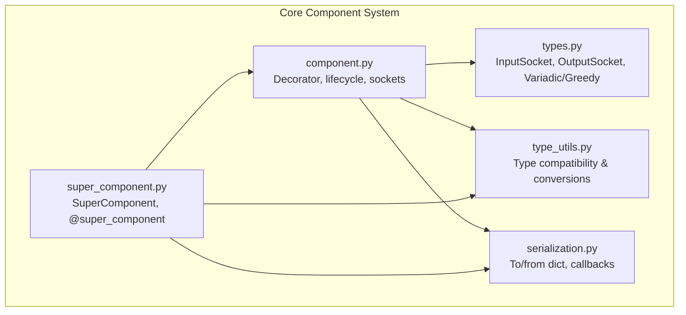
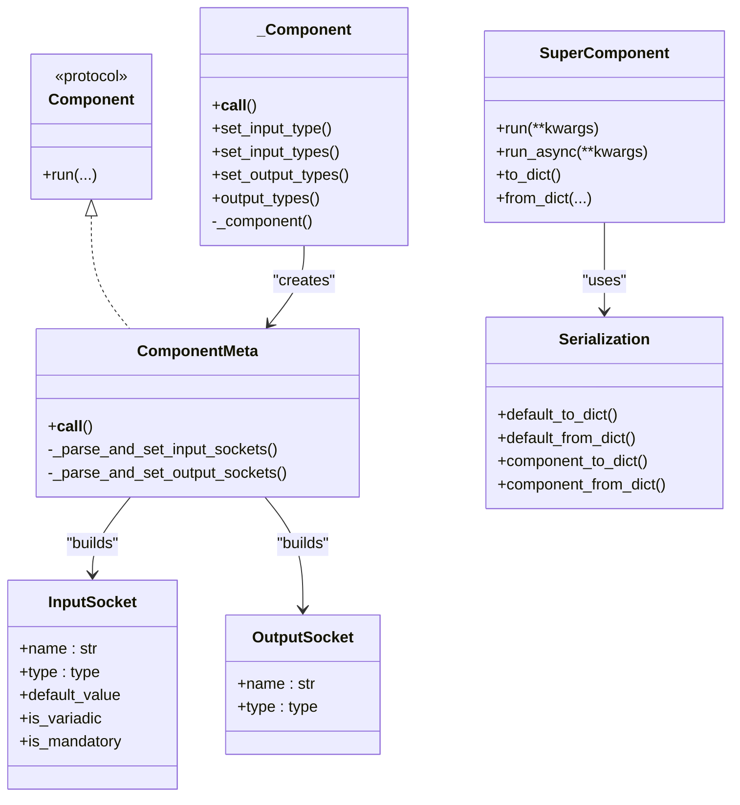
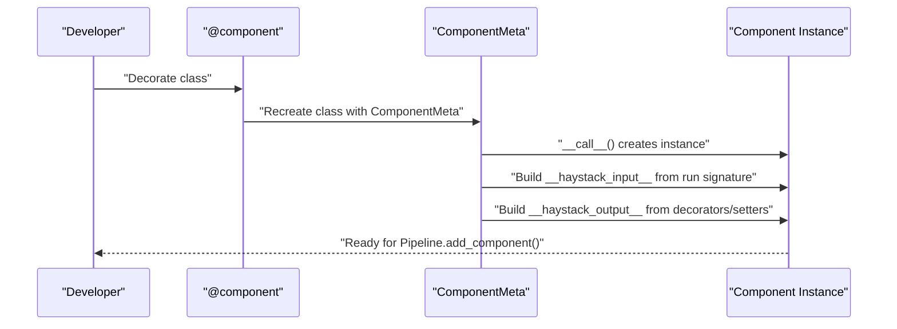
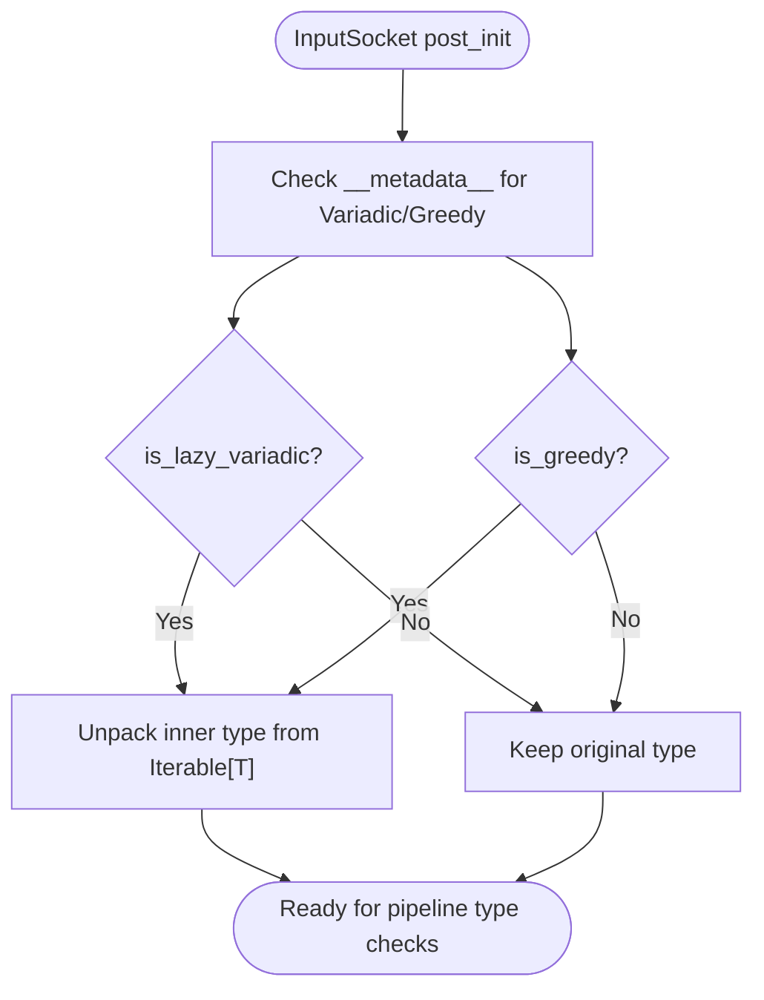
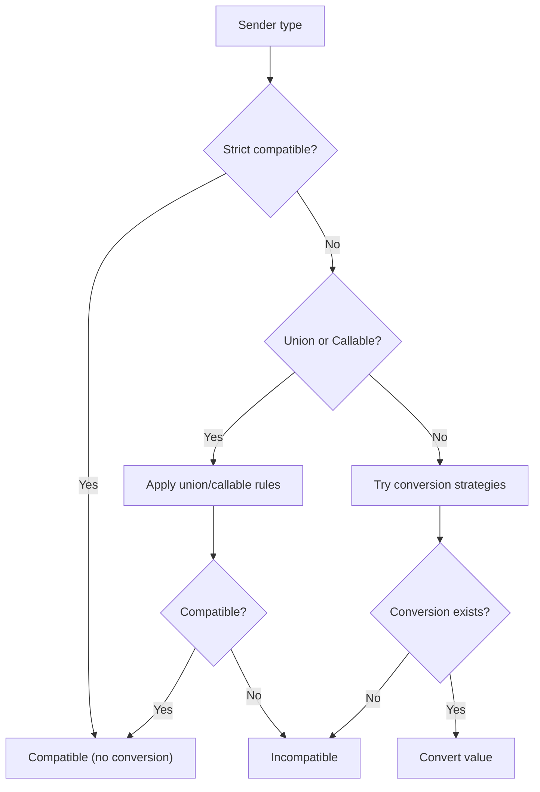
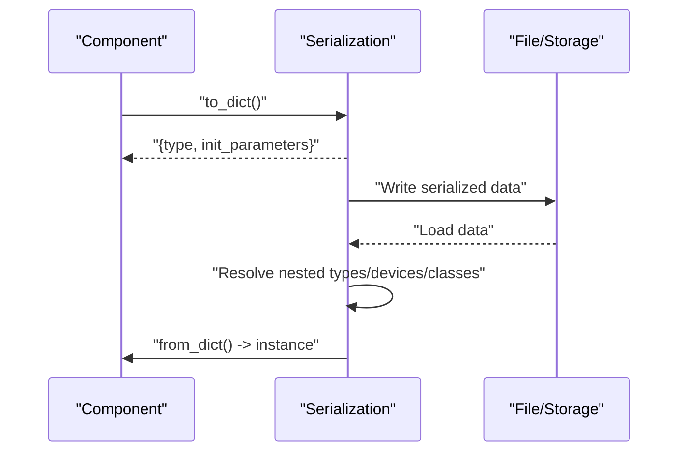
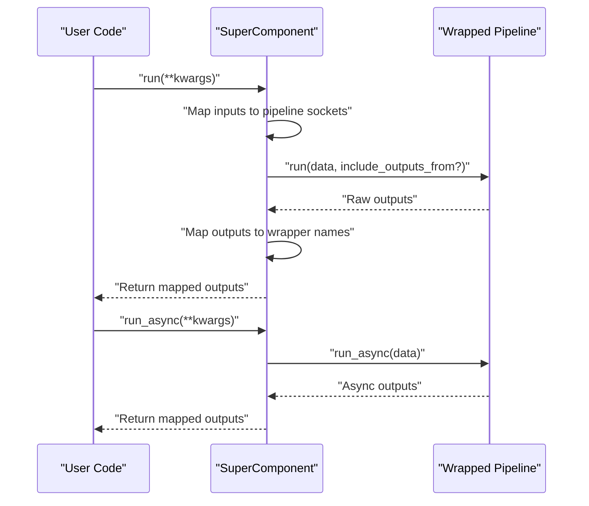
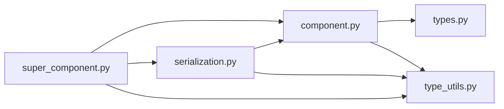

# Custom Component Development

<cite>
**Referenced Files in This Document**
- [component.py](file://haystack/core/component/component.py)
- [types.py](file://haystack/core/component/types.py)
- [super_component.py](file://haystack/core/super_component/super_component.py)
- [serialization.py](file://haystack/core/serialization.py)
- [type_utils.py](file://haystack/core/type_utils.py)
- [__init__.py](file://haystack/core/__init__.py)
- [__init__.py](file://haystack/core/component/__init__.py)
</cite>

## Table of Contents
1. [Introduction](#introduction)
2. [Project Structure](#project-structure)
3. [Core Components](#core-components)
4. [Architecture Overview](#architecture-overview)
5. [Detailed Component Analysis](#detailed-component-analysis)
6. [Dependency Analysis](#dependency-analysis)
7. [Performance Considerations](#performance-considerations)
8. [Troubleshooting Guide](#troubleshooting-guide)
9. [Conclusion](#conclusion)
10. [Appendices](#appendices)

## Introduction
This document explains how to develop custom components in Haystack. It covers the component decorator system, the component interface contract, input/output socket definitions, type validation and conversion, serialization patterns, lifecycle management (initialization, warm-up, cleanup), SuperComponent patterns for composite components, testing strategies, registration and configuration, and practical examples. It also addresses performance, memory management, async/await patterns, documentation, error handling, and backward compatibility.

## Project Structure
Haystack’s core component system lives under haystack/core. The most relevant modules for custom component development are:
- Component decorator and runtime: haystack/core/component/component.py
- Socket types and variadic inputs: haystack/core/component/types.py
- Type compatibility and conversion utilities: haystack/core/type_utils.py
- Serialization and deserialization: haystack/core/serialization.py
- SuperComponent composite pattern: haystack/core/super_component/super_component.py
- Public exports: haystack/core/component/__init__.py and haystack/core/__init__.py

**Diagram sources**
- [component.py](file://haystack/core/component/component.py#L1-L645)
- [types.py](file://haystack/core/component/types.py#L1-L128)
- [type_utils.py](file://haystack/core/type_utils.py#L1-L286)
- [serialization.py](file://haystack/core/serialization.py#L1-L336)
- [super_component.py](file://haystack/core/super_component/super_component.py#L1-L627)

**Section sources**
- [__init__.py](file://haystack/core/component/__init__.py#L1-L9)
- [__init__.py](file://haystack/core/__init__.py#L1-L8)

## Core Components
This section summarizes the essential building blocks for custom components.

- Component decorator and contract
  - Components must be decorated with the component decorator to be discoverable and properly integrated into pipelines.
  - Required interface: a run method. Optional lifecycle methods: __init__, warm_up, and cleanup (via context managers or resource fields).
  - Initialization constraints: keep __init__ lightweight; move heavy setup to warm_up.
  - Initialization parameters must be JSON serializable; store any non-serializable state in init_parameters for persistence.

- Input/Output sockets
  - Inputs are derived from the run method signature and defaults; outputs are declared via decorators or setters.
  - Variadic inputs: Lazy (wait for all connections) and Greedy (run immediately upon first input) variants are supported.
  - Default values and mandatory/optional semantics are enforced at runtime.

- Type validation and conversion
  - Strict compatibility checks and automatic conversion strategies are provided for common scenarios (e.g., ChatMessage ↔ str, wrapping/unwrap lists).
  - Type validation can be toggled off for loose mode.

- Serialization
  - Components serialize to a dict with type and init_parameters; default_to_dict/default_from_dict handle nested objects and special types (Secret, ComponentDevice).
  - Deserialization supports callbacks to adjust init parameters before instantiation.

**Section sources**
- [component.py](file://haystack/core/component/component.py#L1-L120)
- [component.py](file://haystack/core/component/component.py#L406-L645)
- [types.py](file://haystack/core/component/types.py#L17-L128)
- [type_utils.py](file://haystack/core/type_utils.py#L13-L286)
- [serialization.py](file://haystack/core/serialization.py#L41-L336)

## Architecture Overview
The component system centers on a decorator that validates and registers components, a metaclass that builds input/output sockets, and utilities for type validation and serialization. SuperComponent wraps pipelines into higher-level components with configurable input/output mappings.

**Diagram sources**
- [component.py](file://haystack/core/component/component.py#L137-L330)
- [component.py](file://haystack/core/component/component.py#L406-L645)
- [types.py](file://haystack/core/component/types.py#L36-L128)
- [super_component.py](file://haystack/core/super_component/super_component.py#L35-L154)
- [serialization.py](file://haystack/core/serialization.py#L177-L312)

## Detailed Component Analysis

### Component Decorator and Lifecycle
- Decorator responsibilities
  - Validates presence of run method.
  - Registers component class in a global registry keyed by fully qualified class name.
  - Overrides __repr__ for better diagnostics.
  - Enforces that run_async (if present) is a coroutine.

- Lifecycle methods
  - __init__: Keep minimal; persist init_parameters for serialization.
  - warm_up: Load heavy resources (models, caches) here; guard against double-initialization.
  - run: Implements the core logic; returns a mapping conforming to declared outputs.
  - run_async: Optional; mirrors run signature and returns async mapping.

- Input/Output socket parsing
  - Input sockets inferred from run signature; defaults preserved.
  - Output sockets inferred from output_types decorator or set_output_types.
  - run and run_async must have identical parameters and types.

**Diagram sources**
- [component.py](file://haystack/core/component/component.py#L572-L645)
- [component.py](file://haystack/core/component/component.py#L294-L330)
- [component.py](file://haystack/core/component/component.py#L207-L293)

**Section sources**
- [component.py](file://haystack/core/component/component.py#L137-L330)
- [component.py](file://haystack/core/component/component.py#L406-L645)

### Input/Output Sockets and Variadic Types
- InputSocket
  - Tracks name, type, default_value, and flags for lazy/greedy variadic behavior.
  - Unpacks Variadic/Greedy annotations to derive the inner element type.
  - Provides helpers: is_variadic, is_mandatory.

- OutputSocket
  - Tracks name, type, and downstream receivers.

- Variadic and Greedy inputs
  - LazyVariadic waits for all connected inputs before running.
  - GreedyVariadic runs immediately upon first input; useful for streaming or early-trigger logic.

**Diagram sources**
- [types.py](file://haystack/core/component/types.py#L66-L101)

**Section sources**
- [types.py](file://haystack/core/component/types.py#L17-L128)

### Type Validation and Conversion
- Compatibility checks
  - Strict compatibility for exact or subclass matches.
  - Union handling: sender compatible if all args compatible or receiver compatible if any arg compatible.
  - Callable compatibility validated by argument count and per-argument compatibility.

- Conversion strategies
  - ChatMessage ↔ str conversions.
  - Wrapping/Unwrapping lists for scalar ↔ collection conversions.
  - Multi-step conversions (e.g., wrap ChatMessage → str) when needed.

**Diagram sources**
- [type_utils.py](file://haystack/core/type_utils.py#L93-L250)
- [type_utils.py](file://haystack/core/type_utils.py#L163-L222)

**Section sources**
- [type_utils.py](file://haystack/core/type_utils.py#L13-L286)

### Serialization Patterns
- To/From dict
  - default_to_dict: serializes init_parameters and nested objects with to_dict().
  - default_from_dict: reconstructs instances, auto-deserializes Secret and ComponentDevice, and imports classes by qualified name for nested from_dict().
  - component_to_dict/component_from_dict: convenience wrappers that validate allowed types and enforce init parameter discovery.

- Callbacks
  - DeserializationCallbacks allow modifying init parameters before component construction.

**Diagram sources**
- [serialization.py](file://haystack/core/serialization.py#L41-L88)
- [serialization.py](file://haystack/core/serialization.py#L250-L312)

**Section sources**
- [serialization.py](file://haystack/core/serialization.py#L41-L336)

### SuperComponent Pattern
SuperComponent lets you wrap an entire Pipeline into a single component with customizable input/output mappings. It:
- Infers input types from pipeline inputs and aggregates compatible types.
- Validates output mappings and prevents duplicates.
- Delegates run/run_async to the wrapped pipeline.
- Supports serialization/deserialization of the wrapped pipeline.

**Diagram sources**
- [super_component.py](file://haystack/core/super_component/super_component.py#L109-L154)
- [super_component.py](file://haystack/core/super_component/super_component.py#L380-L397)

**Section sources**
- [super_component.py](file://haystack/core/super_component/super_component.py#L35-L154)
- [super_component.py](file://haystack/core/super_component/super_component.py#L466-L559)

### Component Testing Strategies
- Unit testing
  - Test run method behavior with synthetic inputs; mock external dependencies via dependency injection in __init__ or warm_up.
  - Use small, deterministic inputs; assert output shapes and types align with declared outputs.

- Integration testing
  - Compose components in a Pipeline; validate end-to-end behavior with real data.
  - Use SuperComponent to isolate subsystems and test them as black boxes.

- Mocking patterns
  - Replace heavy dependencies (e.g., model backends) with lightweight mocks that preserve signatures.
  - Use warm_up to lazily initialize mocks; verify warm_up idempotency.

- Serialization tests
  - Round-trip to_dict/from_dict; assert equality of init_parameters and behavior.

[No sources needed since this section provides general guidance]

### Component Registration, Dependency Injection, and Configuration
- Registration
  - The @component decorator registers components globally by fully qualified class name; this enables deserialization and discovery.

- Dependency injection
  - Pass dependencies via __init__; store them in init_parameters for persistence.
  - Use DeserializationCallbacks to adjust init parameters at load time (e.g., environment-specific overrides).

- Configuration management
  - Keep configuration in init_parameters; expose only basic types; serialize complex objects via to_dict/from_dict.
  - Use enums or typed constants for flags to improve readability and safety.

**Section sources**
- [component.py](file://haystack/core/component/component.py#L572-L645)
- [serialization.py](file://haystack/core/serialization.py#L139-L175)

### Practical Examples
- Wrapper around external library
  - Implement run to call the external API; store client in __init__ and reuse in warm_up.
  - Declare outputs via @component.output_types; handle retries and timeouts in run.

- Specialized data processor
  - Accept variadic inputs with Variadic or Greedy to aggregate multiple upstream sources.
  - Use type conversion utilities to normalize inputs (e.g., ChatMessage → str).

- Custom generator
  - Implement run and run_async with identical signatures; ensure async method is coroutine.
  - Persist model handles in warm_up; serialize minimal configuration in init_parameters.

[No sources needed since this section provides general guidance]

## Dependency Analysis
The core component system composes several modules with clear boundaries:
- component.py depends on types.py for socket definitions and type_utils.py for type checks.
- serialization.py integrates with component.py for component-level serialization and with type_utils.py for special types.
- super_component.py depends on component.py, serialization.py, and type_utils.py to build composite components.

**Diagram sources**
- [component.py](file://haystack/core/component/component.py#L89-L91)
- [types.py](file://haystack/core/component/types.py#L1-L12)
- [type_utils.py](file://haystack/core/type_utils.py#L1-L12)
- [serialization.py](file://haystack/core/serialization.py#L1-L16)
- [super_component.py](file://haystack/core/super_component/super_component.py#L5-L16)

**Section sources**
- [component.py](file://haystack/core/component/component.py#L89-L91)
- [super_component.py](file://haystack/core/super_component/super_component.py#L5-L16)

## Performance Considerations
- Keep __init__ lightweight; defer expensive initialization to warm_up.
- Prefer GreedyVariadic for early-trigger processing when appropriate.
- Use variadic inputs judiciously to reduce pipeline fan-out overhead.
- Avoid unnecessary copies; reuse buffers and caches in warm_up.
- For async components, ensure run_async mirrors run exactly; avoid extra allocations in hot paths.

[No sources needed since this section provides general guidance]

## Troubleshooting Guide
- Common errors
  - Missing run method: ComponentError raised by the decorator.
  - Mismatched run/run_async signatures: Detailed comparison error with differences.
  - Non-JSON-serializable init parameters: SerializationError during to_dict.
  - Type incompatibilities: Incompatible types or missing conversion strategies.
  - SuperComponent mapping errors: InvalidMappingTypeError/InvalidMappingValueError for malformed mappings.

- Debugging tips
  - Inspect component repr to see input/output sockets.
  - Use SuperComponent to simplify complex pipelines for focused debugging.
  - Log warm_up steps and measure latency; verify idempotency.

**Section sources**
- [component.py](file://haystack/core/component/component.py#L578-L581)
- [component.py](file://haystack/core/component/component.py#L361-L400)
- [serialization.py](file://haystack/core/serialization.py#L90-L125)
- [super_component.py](file://haystack/core/super_component/super_component.py#L171-L202)
- [super_component.py](file://haystack/core/super_component/super_component.py#L270-L291)

## Conclusion
Custom components in Haystack are defined by a clear contract and robust tooling. The decorator system, socket inference, type validation, and serialization utilities enable safe, maintainable composition. SuperComponent elevates pipelines into reusable, composable units. By following lifecycle best practices, careful type modeling, and thoughtful testing, you can build efficient, reliable components that integrate seamlessly with Haystack pipelines.

[No sources needed since this section summarizes without analyzing specific files]

## Appendices

### Component Lifecycle Checklist
- Define run method; declare outputs via @component.output_types or set_output_types.
- Keep __init__ minimal; persist init_parameters for serialization.
- Implement warm_up for heavy resources; guard against double-initialization.
- Support run_async if applicable; ensure identical signatures.
- Validate inputs and outputs; leverage variadic sockets for aggregation.
- Provide to_dict/from_dict for persistence; use callbacks for environment-specific overrides.

[No sources needed since this section provides general guidance]