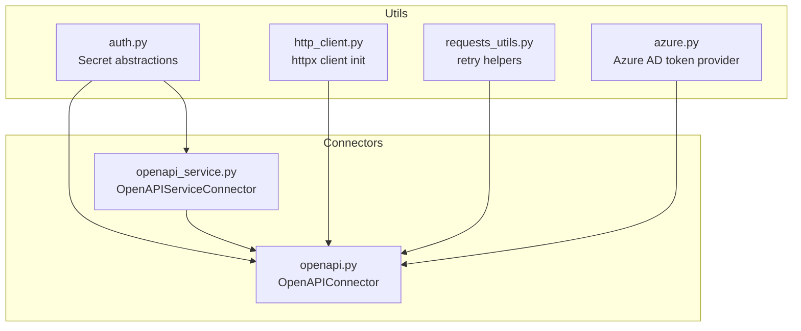
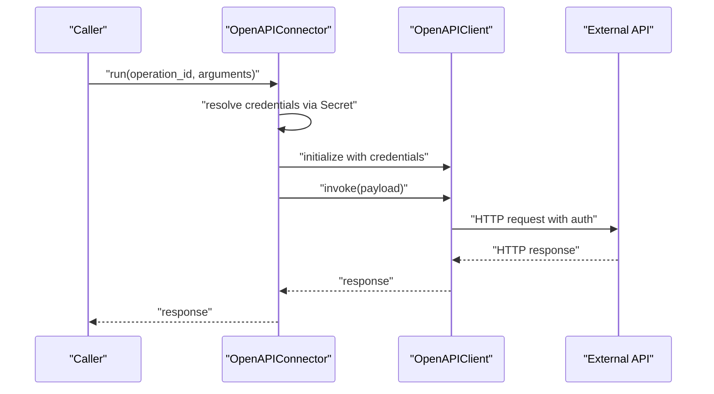
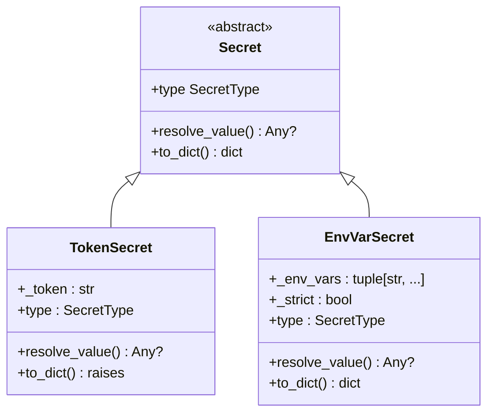
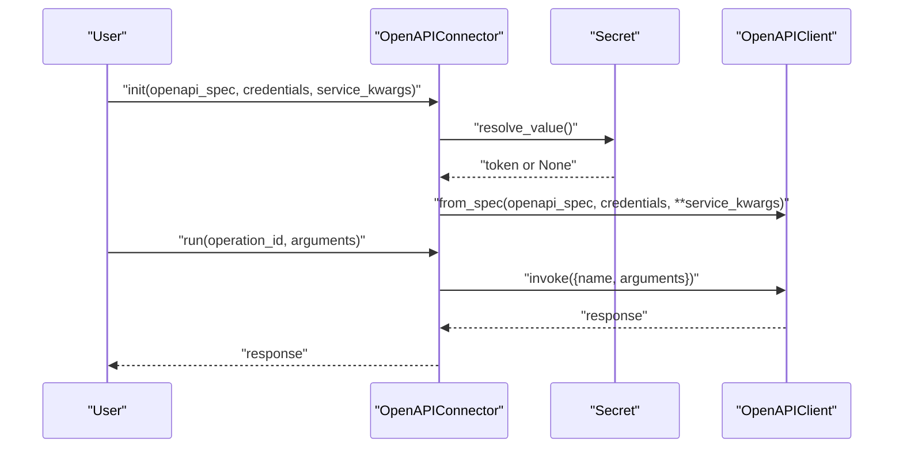
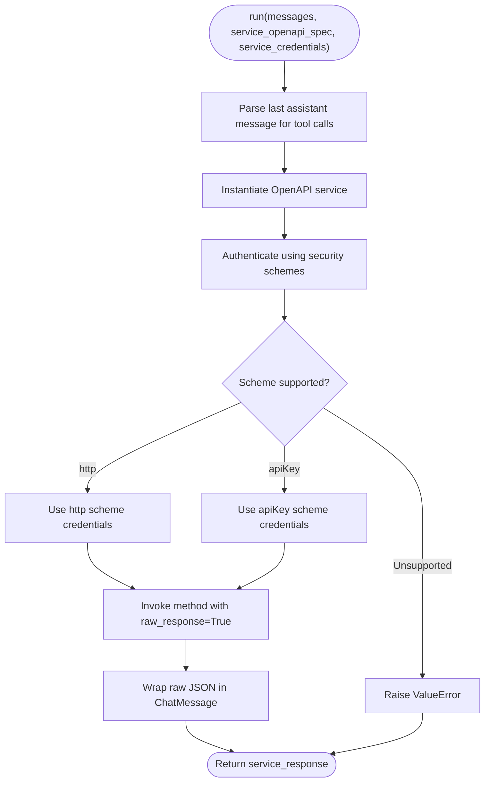
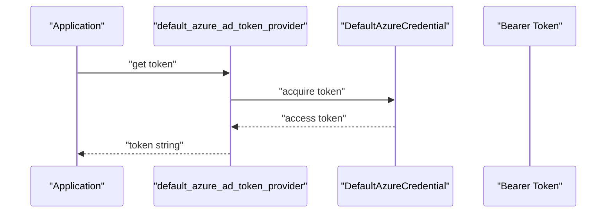
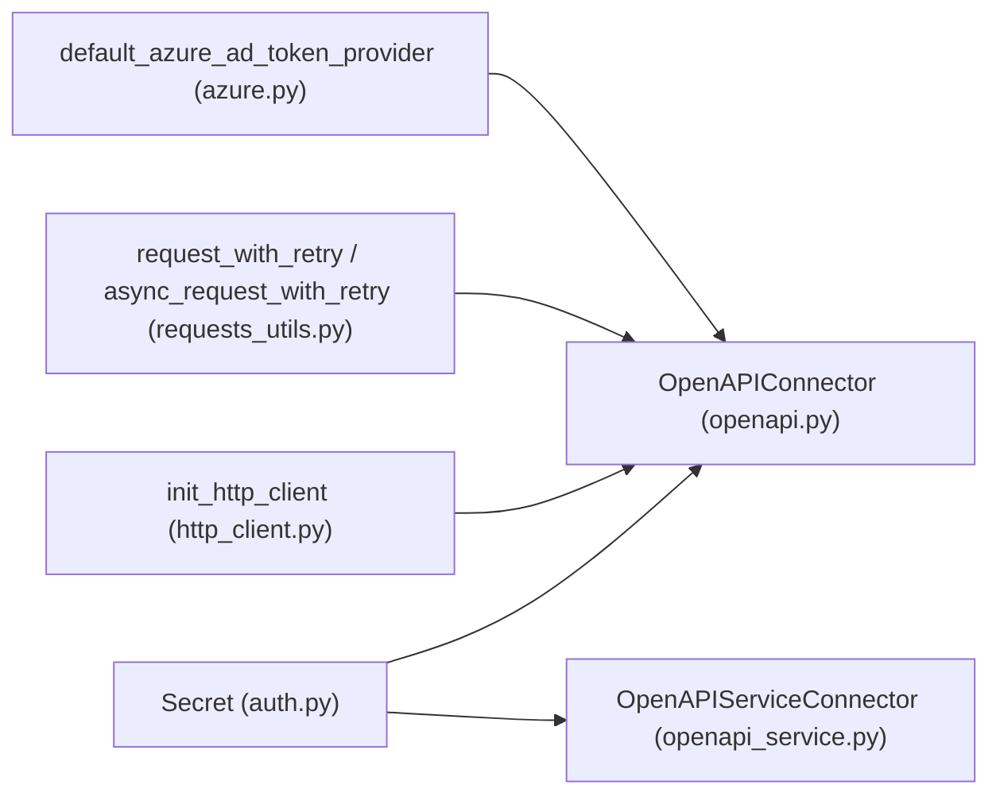

# Authentication and Security Patterns

<cite>
**Referenced Files in This Document**
- [auth.py](file://haystack/utils/auth.py)
- [http_client.py](file://haystack/utils/http_client.py)
- [requests_utils.py](file://haystack/utils/requests_utils.py)
- [openapi.py](file://haystack/components/connectors/openapi.py)
- [openapi_service.py](file://haystack/components/connectors/openapi_service.py)
- [azure.py](file://haystack/utils/azure.py)
- [test_auth.py](file://test/utils/test_auth.py)
- [test_openapi_connector.py](file://test/components/connectors/test_openapi_connector.py)
- [test_openapi_service.py](file://test/components/connectors/test_openapi_service.py)
- [openapi-connector-auth-enhancement-a78e0666d3cf6353.yaml](file://releasenotes/notes/openapi-connector-auth-enhancement-a78e0666d3cf6353.yaml)
- [allow-unverified-openapi-calls-46842af37464bb6d.yaml](file://releasenotes/notes/allow-unverified-openapi-calls-46842af37464bb6d.yaml)
- [SECURITY.md](file://SECURITY.md)
</cite>

## Table of Contents
1. [Introduction](#introduction)
2. [Project Structure](#project-structure)
3. [Core Components](#core-components)
4. [Architecture Overview](#architecture-overview)
5. [Detailed Component Analysis](#detailed-component-analysis)
6. [Dependency Analysis](#dependency-analysis)
7. [Performance Considerations](#performance-considerations)
8. [Troubleshooting Guide](#troubleshooting-guide)
9. [Conclusion](#conclusion)
10. [Appendices](#appendices)

## Introduction
This document explains authentication and security patterns used in external API connectors within the project. It covers supported authentication mechanisms (API keys, OAuth 2.0 hints, JWT tokens, and custom schemes), secure credential storage using Secret objects and environment variables, request signing patterns, and mutual TLS authentication. It also documents best practices for HTTPS enforcement, certificate validation, token management, and compliance considerations.

## Project Structure
The authentication and security logic spans several modules:
- Credential abstraction and storage: Secret, TokenSecret, EnvVarSecret
- HTTP clients and retries: httpx client initialization and retry utilities
- OpenAPI connectors: OpenAPIConnector and OpenAPIServiceConnector
- Azure identity integration: DefaultAzureCredential-based token provider
- Tests and release notes: validation of behavior and documented enhancements

**Diagram sources**
- [auth.py](file://haystack/utils/auth.py#L34-L231)
- [http_client.py](file://haystack/utils/http_client.py#L26-L56)
- [requests_utils.py](file://haystack/utils/requests_utils.py#L15-L209)
- [openapi.py](file://haystack/components/connectors/openapi.py#L15-L98)
- [openapi_service.py](file://haystack/components/connectors/openapi_service.py#L146-L398)
- [azure.py](file://haystack/utils/azure.py#L11-L17)

**Section sources**
- [auth.py](file://haystack/utils/auth.py#L34-L231)
- [http_client.py](file://haystack/utils/http_client.py#L26-L56)
- [requests_utils.py](file://haystack/utils/requests_utils.py#L15-L209)
- [openapi.py](file://haystack/components/connectors/openapi.py#L15-L98)
- [openapi_service.py](file://haystack/components/connectors/openapi_service.py#L146-L398)
- [azure.py](file://haystack/utils/azure.py#L11-L17)

## Core Components
- Secret abstractions:
  - TokenSecret: in-memory token; not serializable; useful for ephemeral or runtime-provided tokens.
  - EnvVarSecret: resolves from one or more environment variables; serializable; strict mode controls failure when unset.
  - Serialization/deserialization helpers for embedding secrets in component configs.
- HTTP client initialization:
  - httpx client creation with optional connection limits and async variants.
- Retry utilities:
  - Configurable exponential backoff for requests and async httpx requests.
- OpenAPI connectors:
  - OpenAPIConnector: loads OpenAPI spec and invokes operations with credentials.
  - OpenAPIServiceConnector: supports dynamic authentication against OpenAPI services, including http and apiKey schemes.
- Azure identity:
  - DefaultAzureCredential-based bearer token provider for Azure Cognitive Services scope.

**Section sources**
- [auth.py](file://haystack/utils/auth.py#L34-L231)
- [http_client.py](file://haystack/utils/http_client.py#L26-L56)
- [requests_utils.py](file://haystack/utils/requests_utils.py#L15-L209)
- [openapi.py](file://haystack/components/connectors/openapi.py#L15-L98)
- [openapi_service.py](file://haystack/components/connectors/openapi_service.py#L146-L398)
- [azure.py](file://haystack/utils/azure.py#L11-L17)

## Architecture Overview
The connectors integrate with external APIs using credentials resolved at runtime. OpenAPIConnector passes credentials to the OpenAPI client; OpenAPIServiceConnector dynamically authenticates against the service using the OpenAPI specification’s security schemes.

**Diagram sources**
- [openapi.py](file://haystack/components/connectors/openapi.py#L63-L97)
- [auth.py](file://haystack/utils/auth.py#L104-L130)

**Section sources**
- [openapi.py](file://haystack/components/connectors/openapi.py#L15-L98)
- [auth.py](file://haystack/utils/auth.py#L34-L231)

## Detailed Component Analysis

### Secret Abstractions and Secure Storage
- TokenSecret:
  - Immutable token-based secret; raises on serialization attempts.
  - Enforces non-empty token.
- EnvVarSecret:
  - Supports multiple candidates and strict mode; resolves first set environment variable.
  - Serializable via to_dict/from_dict.
- Serialization helpers:
  - deserialize_secrets_inplace converts serialized secret dicts back into Secret instances.

**Diagram sources**
- [auth.py](file://haystack/utils/auth.py#L34-L231)

**Section sources**
- [auth.py](file://haystack/utils/auth.py#L34-L231)
- [test_auth.py](file://test/utils/test_auth.py#L21-L81)

### OpenAPIConnector Authentication Flow
- Loads OpenAPI spec and initializes an OpenAPIClient with credentials resolved from Secret.
- Supports passing additional service_kwargs to the client.

**Diagram sources**
- [openapi.py](file://haystack/components/connectors/openapi.py#L47-L97)
- [auth.py](file://haystack/utils/auth.py#L104-L130)

**Section sources**
- [openapi.py](file://haystack/components/connectors/openapi.py#L15-L98)

### OpenAPIServiceConnector Authentication and Invocation
- Validates that the service requires authentication and credentials are provided.
- Supports http and apiKey OpenAPI security schemes.
- Dynamically authenticates per-run invocation, allowing flexible credentials per call.
- Supports SSL verification toggles and custom CA bundles.

**Diagram sources**
- [openapi_service.py](file://haystack/components/connectors/openapi_service.py#L210-L398)

**Section sources**
- [openapi_service.py](file://haystack/components/connectors/openapi_service.py#L285-L339)
- [openapi-connector-auth-enhancement-a78e0666d3cf6353.yaml](file://releasenotes/notes/openapi-connector-auth-enhancement-a78e0666d3cf6353.yaml#L1-L4)
- [allow-unverified-openapi-calls-46842af37464bb6d.yaml](file://releasenotes/notes/allow-unverified-openapi-calls-46842af37464bb6d.yaml#L1-L4)

### Azure Identity Integration
- Provides a default Azure AD token provider compatible with Azure Cognitive Services scope.
- Useful for OAuth 2.0-style bearer tokens in Azure-hosted services.

**Diagram sources**
- [azure.py](file://haystack/utils/azure.py#L11-L17)

**Section sources**
- [azure.py](file://haystack/utils/azure.py#L11-L17)

### Request Signing Patterns and Mutual TLS
- The repository does not implement HMAC request signing or mutual TLS (mTLS) within the analyzed files.
- Recommendations:
  - For HMAC signing, implement a custom HTTP interceptor or adapter that signs request bodies and headers before dispatch.
  - For mTLS, configure the httpx client with client_cert and client_key parameters and ensure server verification aligns with organizational trust stores.

[No sources needed since this section provides general guidance]

### Security Best Practices for API Communication
- HTTPS enforcement and certificate validation:
  - Prefer HTTPS endpoints and enable certificate verification by default.
  - Use the ssl_verify parameter in OpenAPIServiceConnector to enforce verification or supply a custom CA bundle.
- Token management:
  - Store tokens via Secret.from_env_var to avoid hardcoding and enable rotation.
  - Avoid logging or persisting tokens; use TokenSecret only when necessary and ensure serialization is disabled.
- Input validation and sanitization:
  - Validate and sanitize inputs (URLs, paths, queries) before passing to connectors to prevent injection or misuse.

**Section sources**
- [openapi_service.py](file://haystack/components/connectors/openapi_service.py#L199-L208)
- [auth.py](file://haystack/utils/auth.py#L197-L207)
- [SECURITY.md](file://SECURITY.md#L17-L23)

### Implementing Custom Authentication Handlers and Middleware
- Custom HTTP interceptors:
  - Use httpx.Client or AsyncClient to attach event hooks or transport adapters for custom header injection or signing.
- Pipeline integration:
  - Wrap connectors in components that prepare headers or sign requests prior to invoking the connector.

[No sources needed since this section provides general guidance]

### Common Security Vulnerabilities and Mitigations
- Insecure defaults:
  - Mitigation: Enable SSL verification and avoid disabling it unless absolutely necessary; supply a custom CA bundle when required.
- Hardcoded credentials:
  - Mitigation: Use Secret.from_env_var and avoid storing tokens in code or configuration files.
- Excessive logging:
  - Mitigation: Avoid logging sensitive headers or tokens; redact or mask sensitive values.
- Misconfigured retries:
  - Mitigation: Limit retry attempts and backoff; fail fast on unrecoverable errors.

**Section sources**
- [requests_utils.py](file://haystack/utils/requests_utils.py#L15-L209)
- [openapi_service.py](file://haystack/components/connectors/openapi_service.py#L199-L208)
- [auth.py](file://haystack/utils/auth.py#L197-L207)

### Compliance Considerations
- Data protection and privacy:
  - Ensure endpoints are HTTPS-only and that tokens are handled securely.
  - Avoid retaining sensitive data beyond the lifecycle of a request.
- Reporting and scope:
  - Follow the project’s security reporting policy and understand scope limitations.

**Section sources**
- [SECURITY.md](file://SECURITY.md#L1-L38)

## Dependency Analysis
- OpenAPIConnector depends on Secret for credential resolution and delegates to OpenAPIClient.
- OpenAPIServiceConnector depends on Secret and OpenAPI spec parsing to authenticate and invoke operations.
- httpx client initialization supports async and sync modes; retry utilities wrap requests with exponential backoff.

**Diagram sources**
- [auth.py](file://haystack/utils/auth.py#L34-L231)
- [openapi.py](file://haystack/components/connectors/openapi.py#L15-L98)
- [openapi_service.py](file://haystack/components/connectors/openapi_service.py#L146-L398)
- [http_client.py](file://haystack/utils/http_client.py#L26-L56)
- [requests_utils.py](file://haystack/utils/requests_utils.py#L15-L209)
- [azure.py](file://haystack/utils/azure.py#L11-L17)

**Section sources**
- [openapi.py](file://haystack/components/connectors/openapi.py#L15-L98)
- [openapi_service.py](file://haystack/components/connectors/openapi_service.py#L146-L398)
- [auth.py](file://haystack/utils/auth.py#L34-L231)
- [http_client.py](file://haystack/utils/http_client.py#L26-L56)
- [requests_utils.py](file://haystack/utils/requests_utils.py#L15-L209)
- [azure.py](file://haystack/utils/azure.py#L11-L17)

## Performance Considerations
- Use httpx.AsyncClient for concurrent API calls to reduce latency.
- Configure connection limits and timeouts appropriately to avoid resource exhaustion.
- Apply exponential backoff for transient failures to improve resilience without overloading upstream services.

[No sources needed since this section provides general guidance]

## Troubleshooting Guide
- Missing credentials:
  - Symptom: ValueError indicating authentication is required but not provided.
  - Resolution: Provide credentials via Secret and ensure they are resolvable at runtime.
- Unsupported security scheme:
  - Symptom: ValueError mentioning unsupported scheme.
  - Resolution: Use http or apiKey schemes; OAuth 2.0 and OpenID Connect are not currently supported in the connector.
- SSL verification issues:
  - Symptom: Certificate validation errors.
  - Resolution: Supply a custom CA bundle via ssl_verify or enable verification; avoid disabling verification unless necessary.
- Environment variable not set:
  - Symptom: ValueError indicating none of the environment variables are set.
  - Resolution: Set the required environment variables or disable strict mode if appropriate.

**Section sources**
- [openapi_service.py](file://haystack/components/connectors/openapi_service.py#L307-L339)
- [auth.py](file://haystack/utils/auth.py#L197-L207)
- [test_openapi_service.py](file://test/components/connectors/test_openapi_service.py#L75-L81)
- [test_openapi_connector.py](file://test/components/connectors/test_openapi_connector.py#L58-L88)

## Conclusion
The project provides robust primitives for secure authentication and credential management through Secret abstractions, supports dynamic authentication in OpenAPI connectors, and offers utilities for resilient HTTP communication. For advanced scenarios like HMAC signing or mutual TLS, extend httpx clients with custom interceptors or adapters. Adhering to HTTPS enforcement, strict credential handling, and input sanitization ensures secure integrations aligned with best practices and compliance expectations.

## Appendices

### API Keys and Environment Variables
- Use Secret.from_env_var for production deployments to avoid embedding tokens in code.
- Serialize components safely by relying on EnvVarSecret; avoid serializing TokenSecret.

**Section sources**
- [auth.py](file://haystack/utils/auth.py#L57-L74)
- [test_auth.py](file://test/utils/test_auth.py#L40-L74)

### OAuth 2.0 and JWT Tokens
- OAuth 2.0 and OpenID Connect are not currently supported in OpenAPIServiceConnector.
- For bearer tokens, use Secret.from_env_var and inject Authorization headers via httpx client configuration or custom middleware.

**Section sources**
- [openapi_service.py](file://haystack/components/connectors/openapi_service.py#L292-L298)
- [azure.py](file://haystack/utils/azure.py#L11-L17)

### Request Signing and Mutual TLS
- Implement HMAC signing and mTLS using httpx client configuration and transport adapters.

[No sources needed since this section provides general guidance]