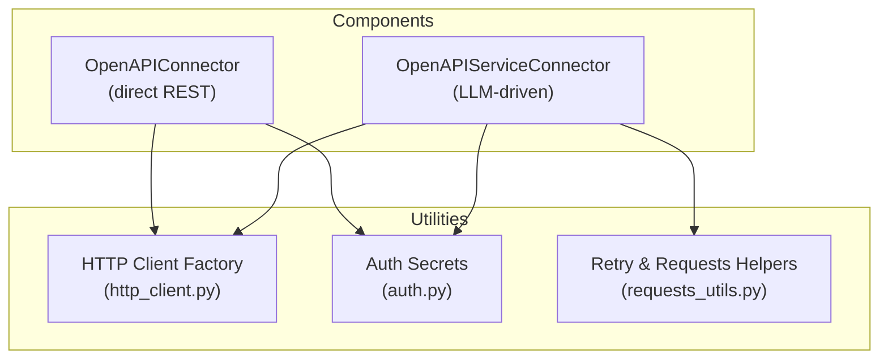
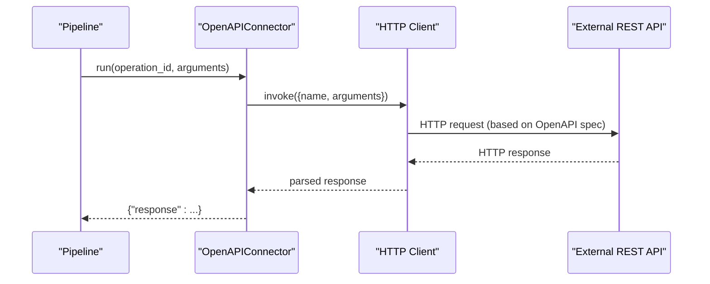
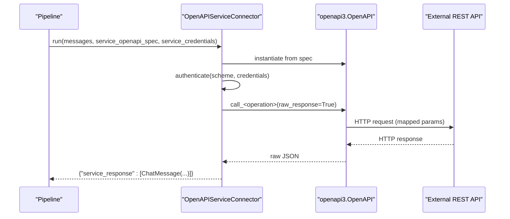
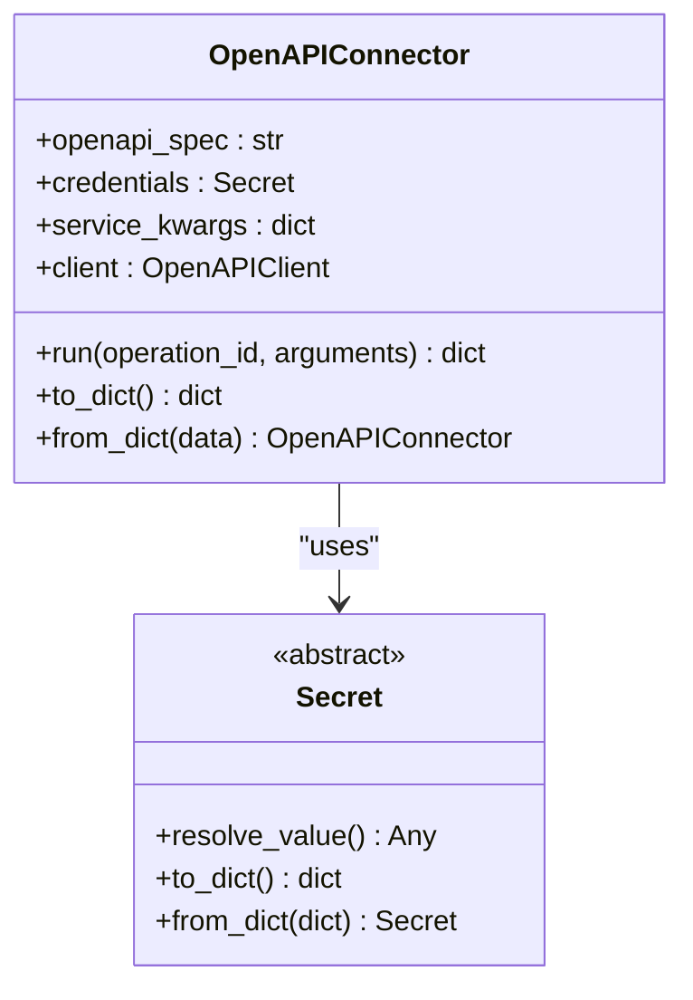
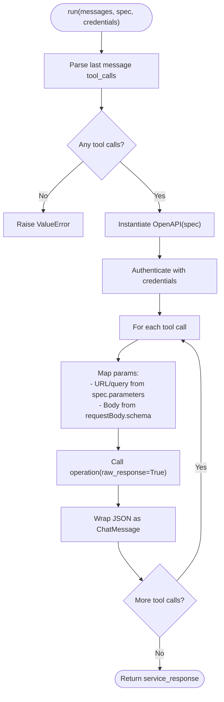
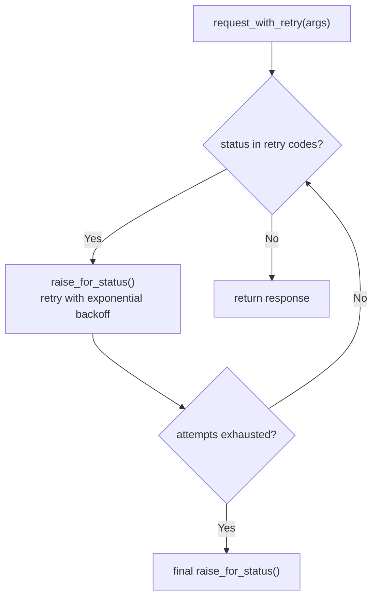
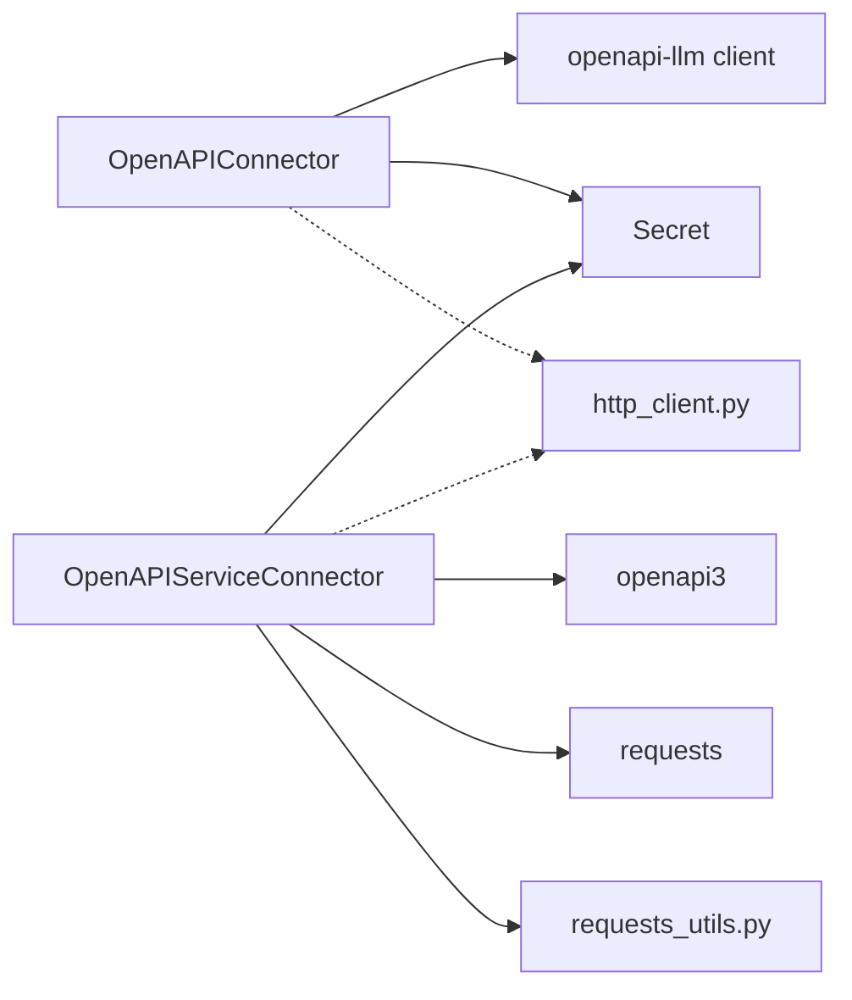

# External API Connectors

<cite>
**Referenced Files in This Document**
- [openapi.py](file://haystack/components/connectors/openapi.py)
- [openapi_service.py](file://haystack/components/connectors/openapi_service.py)
- [http_client.py](file://haystack/utils/http_client.py)
- [auth.py](file://haystack/utils/auth.py)
- [requests_utils.py](file://haystack/utils/requests_utils.py)
- [openapiconnector.mdx](file://docs-website/docs/pipeline-components/connectors/openapiconnector.mdx)
- [openapiserviceconnector.mdx](file://docs-website/docs/pipeline-components/connectors/openapiserviceconnector.mdx)
- [openapi-connector-auth-enhancement-a78e0666d3cf6353.yaml](file://releasenotes/notes/openapi-connector-auth-enhancement-a78e0666d3cf6353.yaml)
- [openapi-service-connector-enhancements-21a2bc0a9aab8966.yaml](file://releasenotes/notes/openapi-service-connector-enhancements-21a2bc0a9aab8966.yaml)
</cite>

## Table of Contents
1. [Introduction](#introduction)
2. [Project Structure](#project-structure)
3. [Core Components](#core-components)
4. [Architecture Overview](#architecture-overview)
5. [Detailed Component Analysis](#detailed-component-analysis)
6. [Dependency Analysis](#dependency-analysis)
7. [Performance Considerations](#performance-considerations)
8. [Troubleshooting Guide](#troubleshooting-guide)
9. [Conclusion](#conclusion)
10. [Appendices](#appendices)

## Introduction
This document explains external API connector patterns in Haystack with a focus on:
- OpenAPI Connector for direct REST endpoint invocation using OpenAPI specifications
- OpenAPI Service Connector for LLM-driven service invocation and function calling
- Generic HTTP utilities for robust request/response handling, retries, and client initialization
- Authentication mechanisms (API keys, Bearer tokens, Basic auth, custom headers)
- Request/response transformation, error handling, and retry logic
- Parameter mapping between Haystack components and external API endpoints
- Practical integration scenarios (CRM, payments, third-party services)
- Rate limiting, circuit breaker patterns, and monitoring
- Security considerations for credentials and data transmission

## Project Structure
Haystack organizes API connectors under components/connectors and shared HTTP utilities under utils. The OpenAPI connectors are implemented as pipeline components with optional dependencies for specialized libraries.

**Diagram sources**
- [openapi.py](file://haystack/components/connectors/openapi.py#L15-L98)
- [openapi_service.py](file://haystack/components/connectors/openapi_service.py#L146-L398)
- [http_client.py](file://haystack/utils/http_client.py#L26-L56)
- [auth.py](file://haystack/utils/auth.py#L34-L231)
- [requests_utils.py](file://haystack/utils/requests_utils.py#L15-L209)

**Section sources**
- [openapiconnector.mdx](file://docs-website/docs/pipeline-components/connectors/openapiconnector.mdx#L1-L107)
- [openapiserviceconnector.mdx](file://docs-website/docs/pipeline-components/connectors/openapiserviceconnector.mdx#L1-L112)

## Core Components
- OpenAPIConnector: Directly invokes REST endpoints defined by an OpenAPI spec. It supports credentials via Secret wrappers and passes additional service options to the underlying client.
- OpenAPIServiceConnector: Bridges LLM function calling to OpenAPI services. It parses ChatMessage tool calls, authenticates against the service spec, maps parameters, and returns service responses as ChatMessage objects.

Key capabilities:
- Parameter mapping: operation_id and arguments for OpenAPIConnector; tool call payloads for OpenAPIServiceConnector
- Authentication: Secret-based tokens/env vars; http apiKey schemes; per-run credential injection
- Serialization/deserialization: to/from dict for component persistence
- Output envelopes: response/service_response wrapping

**Section sources**
- [openapi.py](file://haystack/components/connectors/openapi.py#L15-L98)
- [openapi_service.py](file://haystack/components/connectors/openapi_service.py#L146-L398)
- [auth.py](file://haystack/utils/auth.py#L34-L231)

## Architecture Overview
The connectors integrate with HTTP clients and authentication utilities. OpenAPIConnector uses a specialized client initialized from an OpenAPI spec. OpenAPIServiceConnector uses the openapi3 library to build and send HTTP requests, with optional SSL verification and raw-response handling.

**Diagram sources**
- [openapi.py](file://haystack/components/connectors/openapi.py#L84-L98)
- [http_client.py](file://haystack/utils/http_client.py#L26-L56)

**Diagram sources**
- [openapi_service.py](file://haystack/components/connectors/openapi_service.py#L210-L398)

## Detailed Component Analysis

### OpenAPIConnector
Purpose: Direct invocation of REST endpoints defined in an OpenAPI specification. It wraps credentials in Secret and delegates to a client that understands OpenAPI.

Implementation highlights:
- Initialization loads an OpenAPI spec and optional credentials; builds a client with optional service kwargs
- run method constructs a payload with operation_id and arguments, then invokes the client
- Serialization support via default_to_dict/default_from_dict

**Diagram sources**
- [openapi.py](file://haystack/components/connectors/openapi.py#L15-L98)
- [auth.py](file://haystack/utils/auth.py#L34-L231)

**Section sources**
- [openapi.py](file://haystack/components/connectors/openapi.py#L15-L98)
- [openapiconnector.mdx](file://docs-website/docs/pipeline-components/connectors/openapiconnector.mdx#L1-L107)

### OpenAPIServiceConnector
Purpose: Converts LLM-generated function calls into OpenAPI invocations. It parses ChatMessage tool calls, authenticates, maps parameters, and returns raw JSON responses as ChatMessage.

Key behaviors:
- Authentication: Supports http and apiKey schemes; credentials can be a string or a dict keyed by scheme name
- Parameter mapping: Separates URL/query parameters and request body according to the OpenAPI spec
- Response handling: Returns raw JSON via ChatMessage to preserve fidelity
- SSL verification: Optional toggle or CA path

**Diagram sources**
- [openapi_service.py](file://haystack/components/connectors/openapi_service.py#L210-L398)

**Section sources**
- [openapi_service.py](file://haystack/components/connectors/openapi_service.py#L146-L398)
- [openapiserviceconnector.mdx](file://docs-website/docs/pipeline-components/connectors/openapiserviceconnector.mdx#L1-L112)

### HTTP Client Factory
Purpose: Provides a unified way to create httpx synchronous or asynchronous clients with standardized configuration, including connection limits.

Capabilities:
- Overloaded init_http_client supports sync/async variants
- Processes limits dict into httpx.Limits
- Returns None if no kwargs provided

**Section sources**
- [http_client.py](file://haystack/utils/http_client.py#L10-L56)

### Authentication Utilities
Purpose: Securely manage credentials using Secret abstractions.

Highlights:
- SecretType: token vs env_var
- Secret.from_token/from_env_var factories
- TokenSecret: in-memory token, not serializable
- EnvVarSecret: resolves from environment, supports fallback and strict mode
- Serialization helpers for secrets in-place

Supported schemes in OpenAPIServiceConnector:
- http: covers Basic, Bearer, and other HTTP auth schemes
- apiKey: covers API keys and cookie auth

**Section sources**
- [auth.py](file://haystack/utils/auth.py#L13-L231)
- [openapi_service.py](file://haystack/components/connectors/openapi_service.py#L285-L338)

### Retry and Request Helpers
Purpose: Robust HTTP handling with exponential backoff and configurable retry windows.

Features:
- request_with_retry: synchronous requests with retry on selected status codes and timeouts
- async_request_with_retry: asynchronous requests with similar behavior
- Configurable attempts, status codes, timeout, and headers
- Works with both requests and httpx.AsyncClient

**Diagram sources**
- [requests_utils.py](file://haystack/utils/requests_utils.py#L15-L99)

**Section sources**
- [requests_utils.py](file://haystack/utils/requests_utils.py#L15-L209)

## Dependency Analysis
- OpenAPIConnector depends on:
  - openapi-llm client (lazy-imported)
  - Secret for credentials
  - Optional service_kwargs passed to client
- OpenAPIServiceConnector depends on:
  - openapi3 (lazy-imported)
  - requests for HTTP transport
  - Secret for credentials
  - Optional SSL verification
- Shared utilities:
  - http_client.py for httpx client creation
  - requests_utils.py for retry logic
  - auth.py for Secret management

**Diagram sources**
- [openapi.py](file://haystack/components/connectors/openapi.py#L11-L12)
- [openapi_service.py](file://haystack/components/connectors/openapi_service.py#L14-L16)
- [http_client.py](file://haystack/utils/http_client.py#L26-L56)
- [requests_utils.py](file://haystack/utils/requests_utils.py#L15-L209)
- [auth.py](file://haystack/utils/auth.py#L34-L231)

**Section sources**
- [openapi.py](file://haystack/components/connectors/openapi.py#L11-L12)
- [openapi_service.py](file://haystack/components/connectors/openapi_service.py#L14-L16)

## Performance Considerations
- Connection pooling and limits: Use http_client.init_http_client with limits to control concurrency and sockets
- Async I/O: Prefer async_request_with_retry for high-throughput scenarios
- Payload size: Avoid unnecessary transformations; OpenAPIServiceConnector returns raw JSON to minimize overhead
- Retry strategy: Tune attempts and status codes to balance resilience and latency
- SSL verification: Disable only when necessary and for trusted environments

[No sources needed since this section provides general guidance]

## Troubleshooting Guide
Common issues and resolutions:
- Missing credentials for OpenAPIServiceConnector: Ensure service_credentials matches the OpenAPI security scheme names
- Malformed tool call descriptors: Verify tool call includes name and arguments
- Missing required parameters: OpenAPIServiceConnector validates required URL/query and request body fields
- Status code retries: Configure status_codes_to_retry appropriately; defaults include 408, 418, 429, 503
- SSL verification failures: Provide a CA bundle path or disable verification carefully

Operational tips:
- Use pipeline breakpoints to inspect intermediate states during function-to-API flows
- Log retry attempts and backoff behavior for observability

**Section sources**
- [openapi_service.py](file://haystack/components/connectors/openapi_service.py#L285-L398)
- [requests_utils.py](file://haystack/utils/requests_utils.py#L15-L209)

## Conclusion
Haystack provides two complementary patterns for external API integration:
- OpenAPIConnector for direct, parameterized REST calls
- OpenAPIServiceConnector for LLM-driven function calling to OpenAPI services

Both leverage secure Secret management, flexible HTTP client initialization, and robust retry logic. With careful parameter mapping, authentication configuration, and observability, these patterns enable reliable integrations across CRM, payments, and third-party services.

[No sources needed since this section summarizes without analyzing specific files]

## Appendices

### Authentication Mechanisms
- API Keys: Provide as Secret.from_env_var or Secret.from_token; OpenAPIServiceConnector supports apiKey scheme
- Bearer Tokens: Use http security scheme with Secret credentials
- Basic Auth: Supported via http scheme
- Custom Headers: Supply via service-specific configuration or request adapters

**Section sources**
- [auth.py](file://haystack/utils/auth.py#L34-L231)
- [openapi_service.py](file://haystack/components/connectors/openapi_service.py#L285-L338)

### Request/Response Transformation Patterns
- OpenAPIConnector: Pass arguments as-is to the operation; returns a dictionary with a response key
- OpenAPIServiceConnector: Parses tool calls, maps parameters from spec, returns raw JSON wrapped in ChatMessage

**Section sources**
- [openapi.py](file://haystack/components/connectors/openapi.py#L84-L98)
- [openapi_service.py](file://haystack/components/connectors/openapi_service.py#L210-L262)

### Error Handling and Retry Logic
- OpenAPIServiceConnector raises explicit errors for missing messages, tool calls, invalid descriptors, and missing required parameters
- requests_utils provides exponential backoff retries for transient failures and timeouts
- Circuit breaker pattern: Combine retry attempts with status code filtering; consider external rate limiting and throttling

**Section sources**
- [openapi_service.py](file://haystack/components/connectors/openapi_service.py#L235-L398)
- [requests_utils.py](file://haystack/utils/requests_utils.py#L15-L209)

### Parameter Mapping Between Haystack and External APIs
- OpenAPIConnector: operation_id + arguments map to the target operation’s parameters
- OpenAPIServiceConnector: tool call arguments map to URL/query and request body as defined in the OpenAPI spec

**Section sources**
- [openapi.py](file://haystack/components/connectors/openapi.py#L84-L98)
- [openapi_service.py](file://haystack/components/connectors/openapi_service.py#L340-L398)

### Practical Integration Scenarios
- CRM systems: Use OpenAPIConnector to call search/list/create/update endpoints; map query arguments to operation parameters
- Payment processors: Use OpenAPIServiceConnector to translate LLM function calls into payment API operations; ensure credentials and SSL verification are configured
- Third-party services: Resolve OpenAPI specs, configure credentials, and wire components into a pipeline; apply retry and rate limiting as needed

[No sources needed since this section provides general guidance]

### Rate Limiting, Circuit Breakers, and Health Monitoring
- Rate limiting: Enforce per-minute/hour quotas; combine with retry delays and backoff
- Circuit breaker: Stop sending requests after consecutive failures; recover after a cooldown window
- Health checks: Periodically probe upstream endpoints; surface availability metrics

[No sources needed since this section provides general guidance]

### Security Considerations
- Store credentials using Secret.from_env_var; avoid embedding tokens in code
- Prefer HTTPS with SSL verification enabled; supply CA bundles when required
- Minimize data exposure; sanitize logs and avoid printing raw responses unnecessarily
- Rotate credentials regularly; restrict environment variables to least-privilege access

[No sources needed since this section provides general guidance]