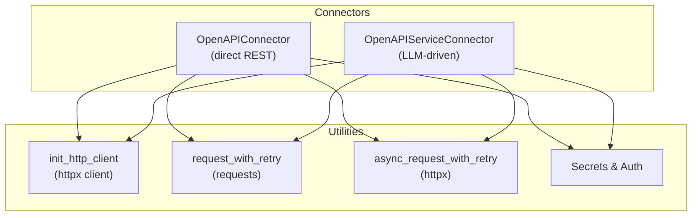
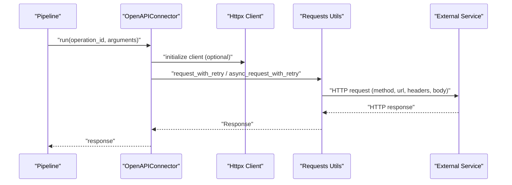
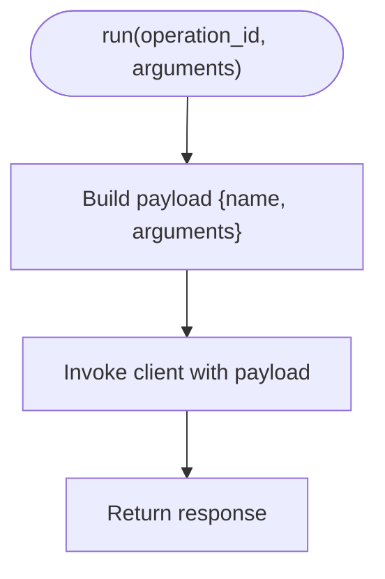
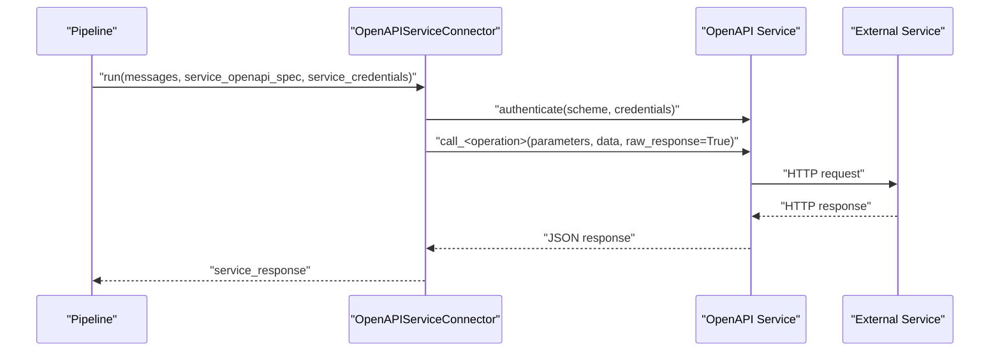
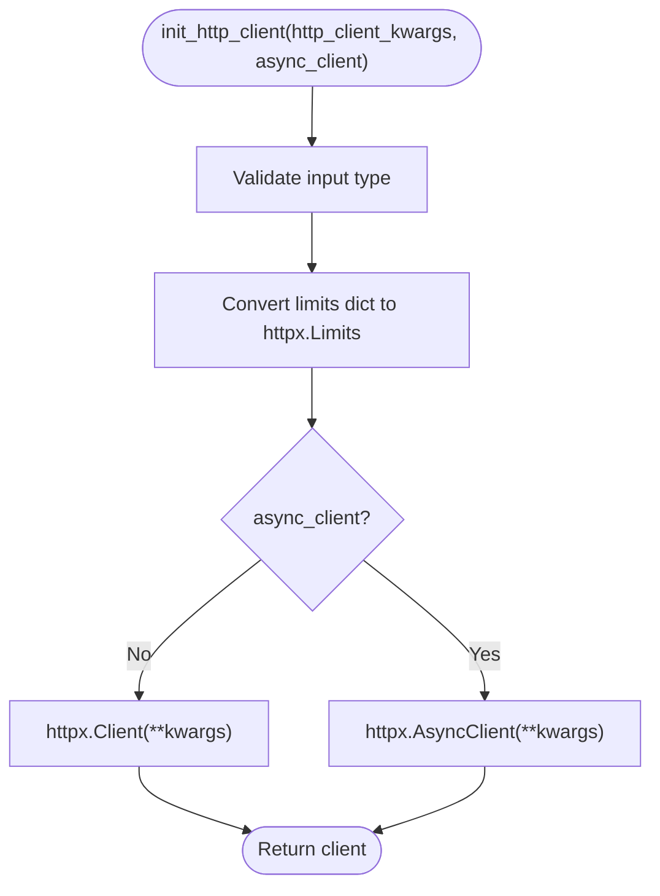
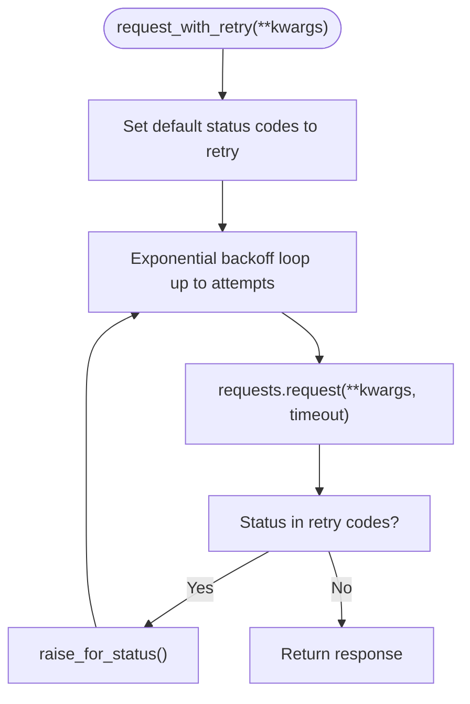
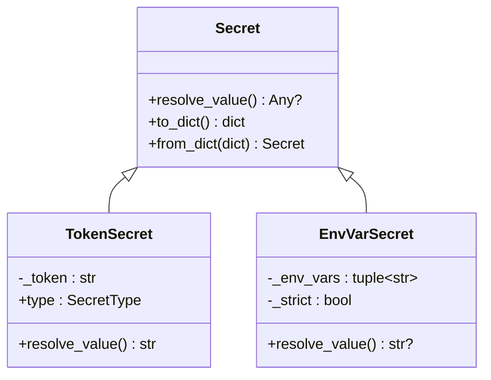
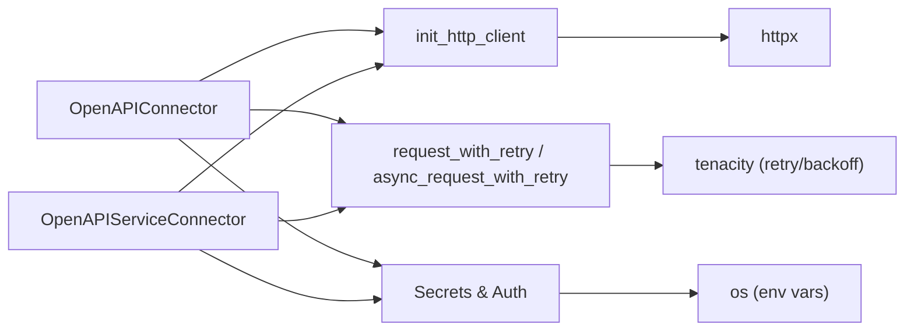

# Generic HTTP Connectors

<cite>
**Referenced Files in This Document**
- [openapi_service.py](file://haystack/components/connectors/openapi_service.py)
- [openapi.py](file://haystack/components/connectors/openapi.py)
- [requests_utils.py](file://haystack/utils/requests_utils.py)
- [http_client.py](file://haystack/utils/http_client.py)
- [auth.py](file://haystack/utils/auth.py)
- [link_content.py](file://haystack/components/fetchers/link_content.py)
- [test_requests_utils.py](file://test/utils/test_requests_utils.py)
- [test_http_client.py](file://test/utils/test_http_client.py)
- [openapiconnector.mdx](file://docs-website/versioned_docs/version-2.19/pipeline-components/connectors/openapiconnector.mdx)
- [connectors_api.md](file://docs-website/reference_versioned_docs/version-2.19/haystack-api/connectors_api.md)
</cite>

## Table of Contents
1. [Introduction](#introduction)
2. [Project Structure](#project-structure)
3. [Core Components](#core-components)
4. [Architecture Overview](#architecture-overview)
5. [Detailed Component Analysis](#detailed-component-analysis)
6. [Dependency Analysis](#dependency-analysis)
7. [Performance Considerations](#performance-considerations)
8. [Troubleshooting Guide](#troubleshooting-guide)
9. [Conclusion](#conclusion)
10. [Appendices](#appendices)

## Introduction
This document explains generic HTTP connector patterns in Haystack, focusing on building robust integrations with REST APIs that may or may not have OpenAPI specifications. It covers:
- Custom HTTP client initialization and reuse
- Authentication mechanisms (API keys, OAuth, bearer tokens, custom header injection)
- Request/response transformation and error handling with retry logic
- Parameter mapping between Haystack components and HTTP endpoints
- Practical integration scenarios (custom REST APIs, SOAP-like services, proprietary web services)
- Security considerations (SSL/TLS, secrets handling)
- Performance optimization (connection pooling, timeouts)

## Project Structure
The relevant parts of the repository for HTTP connectors and utilities are organized as follows:
- Connectors: OpenAPI-based connectors for direct REST invocation and OpenAPI service invocation with LLMs
- Utilities: HTTP client initialization, request helpers with retries, and secret management

**Diagram sources**
- [openapi.py](file://haystack/components/connectors/openapi.py#L15-L98)
- [openapi_service.py](file://haystack/components/connectors/openapi_service.py#L146-L398)
- [http_client.py](file://haystack/utils/http_client.py#L26-L56)
- [requests_utils.py](file://haystack/utils/requests_utils.py#L15-L209)
- [auth.py](file://haystack/utils/auth.py#L34-L231)

**Section sources**
- [openapi.py](file://haystack/components/connectors/openapi.py#L15-L98)
- [openapi_service.py](file://haystack/components/connectors/openapi_service.py#L146-L398)
- [http_client.py](file://haystack/utils/http_client.py#L26-L56)
- [requests_utils.py](file://haystack/utils/requests_utils.py#L15-L209)
- [auth.py](file://haystack/utils/auth.py#L34-L231)

## Core Components
- OpenAPIConnector: Bridges Haystack pipelines to any REST endpoint defined by an OpenAPI spec. Supports explicit operation invocation and credential injection via Secret wrappers.
- OpenAPIServiceConnector: Integrates with LLM-generated function-call payloads to invoke OpenAPI operations, with dynamic authentication and response parsing.
- HTTP utilities: Provide reusable httpx client initialization, synchronous and asynchronous request helpers with exponential backoff retry, and SSL/TLS controls.
- Auth utilities: Provide Secret abstractions for API keys and environment-backed secrets, plus deserialization helpers.

Key capabilities:
- Parameter mapping: Converts Haystack inputs to OpenAPI operation parameters (query/path/body) and validates required fields.
- Authentication: Supports http (Basic/Bearer) and apiKey schemes; dynamic credentials per run.
- Response handling: Validates content-type and returns structured JSON or raw responses.
- Retry and timeouts: Built-in retry strategies for transient failures; configurable timeouts.

**Section sources**
- [openapi.py](file://haystack/components/connectors/openapi.py#L15-L98)
- [openapi_service.py](file://haystack/components/connectors/openapi_service.py#L146-L398)
- [requests_utils.py](file://haystack/utils/requests_utils.py#L15-L209)
- [http_client.py](file://haystack/utils/http_client.py#L26-L56)
- [auth.py](file://haystack/utils/auth.py#L34-L231)

## Architecture Overview
The connectors integrate with HTTP clients and utilities to form a cohesive pattern for invoking external services.

**Diagram sources**
- [openapi.py](file://haystack/components/connectors/openapi.py#L84-L98)
- [http_client.py](file://haystack/utils/http_client.py#L26-L56)
- [requests_utils.py](file://haystack/utils/requests_utils.py#L15-L209)

## Detailed Component Analysis

### OpenAPIConnector
Purpose: Direct invocation of REST endpoints defined in an OpenAPI specification. It builds a client from the spec, injects credentials, and executes operations by operationId with mapped arguments.

Key behaviors:
- Initialization: Loads OpenAPI spec and creates a client with optional credentials and service kwargs.
- Invocation: Wraps inputs into a payload and invokes the underlying client.
- Parameter mapping: Arguments are passed as-is to the client; ensure they match the OpenAPI operation’s parameters.

**Diagram sources**
- [openapi.py](file://haystack/components/connectors/openapi.py#L84-L98)

**Section sources**
- [openapi.py](file://haystack/components/connectors/openapi.py#L15-L98)
- [openapiconnector.mdx](file://docs-website/versioned_docs/version-2.19/pipeline-components/connectors/openapiconnector.mdx#L43-L106)
- [connectors_api.md](file://docs-website/reference_versioned_docs/version-2.19/haystack-api/connectors_api.md#L38-L79)

### OpenAPIServiceConnector
Purpose: Bridges LLM function-call payloads to OpenAPI operations. It authenticates against the service, maps parameters, and returns structured responses.

Key behaviors:
- Authentication: Supports http (Basic/Bearer) and apiKey schemes; dynamic credentials per run.
- Parameter mapping: Extracts parameters and request body from the function-call arguments and validates required fields.
- Response handling: Validates content-type and returns JSON or raises if unsupported.
- SSL/TLS: Accepts ssl_verify to toggle verification or supply a CA bundle.

**Diagram sources**
- [openapi_service.py](file://haystack/components/connectors/openapi_service.py#L210-L262)
- [openapi_service.py](file://haystack/components/connectors/openapi_service.py#L340-L397)

**Section sources**
- [openapi_service.py](file://haystack/components/connectors/openapi_service.py#L146-L398)

### HTTP Client Initialization
Purpose: Provide a typed, validated httpx client creation utility that supports connection pooling and advanced options.

Highlights:
- Overloaded signatures for sync and async clients
- Automatic conversion of dict-based limits to httpx.Limits
- Type checks and safe fallbacks

**Diagram sources**
- [http_client.py](file://haystack/utils/http_client.py#L26-L56)

**Section sources**
- [http_client.py](file://haystack/utils/http_client.py#L26-L56)
- [test_http_client.py](file://test/utils/test_http_client.py#L37-L56)

### Request Helpers with Retry and Timeouts
Purpose: Provide robust HTTP request helpers with exponential backoff retry and configurable timeouts.

Highlights:
- request_with_retry: Exponential backoff for requests, default retry codes, and timeout handling
- async_request_with_retry: Same for async httpx, with async client lifecycle
- Status code selection: Configurable codes to retry; otherwise raises explicitly

**Diagram sources**
- [requests_utils.py](file://haystack/utils/requests_utils.py#L15-L98)
- [test_requests_utils.py](file://test/utils/test_requests_utils.py#L108-L133)

**Section sources**
- [requests_utils.py](file://haystack/utils/requests_utils.py#L15-L209)
- [test_requests_utils.py](file://test/utils/test_requests_utils.py#L108-L133)
- [test_requests_utils.py](file://test/utils/test_requests_utils.py#L135-L173)
- [test_requests_utils.py](file://test/utils/test_requests_utils.py#L229-L246)

### Authentication and Secrets
Purpose: Manage API keys and credentials securely and consistently across connectors.

Highlights:
- Secret abstractions:
  - TokenSecret: In-memory token; not serializable
  - EnvVarSecret: Resolves from environment variables; supports multiple candidates and strict mode
- Serialization/deserialization helpers for secrets in component dicts
- Usage in connectors: Pass Secret-wrapped credentials to clients

**Diagram sources**
- [auth.py](file://haystack/utils/auth.py#L34-L231)

**Section sources**
- [auth.py](file://haystack/utils/auth.py#L34-L231)
- [openapi.py](file://haystack/components/connectors/openapi.py#L47-L67)

### LinkContentFetcher (Reference for Headers and HTTP/2)
While not a connector, LinkContentFetcher demonstrates advanced HTTP features (custom headers, HTTP/2, timeouts) that are applicable to custom HTTP connectors.

Highlights:
- Custom per-request headers
- HTTP/2 support with import-safe fallback
- Client initialization with defaults and overrides

**Section sources**
- [link_content.py](file://haystack/components/fetchers/link_content.py#L129-L180)

## Dependency Analysis
The connectors depend on HTTP utilities and auth utilities for robust, secure, and efficient HTTP interactions.

**Diagram sources**
- [openapi.py](file://haystack/components/connectors/openapi.py#L15-L98)
- [openapi_service.py](file://haystack/components/connectors/openapi_service.py#L146-L398)
- [http_client.py](file://haystack/utils/http_client.py#L26-L56)
- [requests_utils.py](file://haystack/utils/requests_utils.py#L15-L209)
- [auth.py](file://haystack/utils/auth.py#L34-L231)

**Section sources**
- [openapi.py](file://haystack/components/connectors/openapi.py#L15-L98)
- [openapi_service.py](file://haystack/components/connectors/openapi_service.py#L146-L398)
- [http_client.py](file://haystack/utils/http_client.py#L26-L56)
- [requests_utils.py](file://haystack/utils/requests_utils.py#L15-L209)
- [auth.py](file://haystack/utils/auth.py#L34-L231)

## Performance Considerations
- Connection pooling: Use a shared httpx client initialized via init_http_client to reuse connections across requests.
- Timeouts: Configure timeouts in request helpers and client kwargs to prevent hanging requests.
- HTTP/2: Enable HTTP/2 when supported to reduce latency and improve throughput.
- Backpressure: Tune retry attempts and backoff to balance resilience and load.
- Payload size: Prefer streaming or chunked responses for large payloads when supported by the service.

[No sources needed since this section provides general guidance]

## Troubleshooting Guide
Common issues and resolutions:
- Unexpected content-type: Ensure the service responds with supported content types; the connector validates content-type against the OpenAPI spec.
- Missing parameters: Required parameters or request body fields must be provided; otherwise, a ValueError is raised.
- Authentication failures: Verify credentials and supported schemes (http, apiKey); unsupported schemes are not handled.
- Retries and timeouts: Adjust attempts and status codes to retry; configure timeouts to fail fast on slow endpoints.
- SSL/TLS: Disable verification only for trusted environments; supply a CA bundle via ssl_verify when needed.

**Section sources**
- [openapi_service.py](file://haystack/components/connectors/openapi_service.py#L98-L140)
- [openapi_service.py](file://haystack/components/connectors/openapi_service.py#L370-L397)
- [requests_utils.py](file://haystack/utils/requests_utils.py#L15-L209)
- [test_requests_utils.py](file://test/utils/test_requests_utils.py#L108-L133)

## Conclusion
Haystack provides a flexible, secure, and efficient foundation for integrating with HTTP services:
- Use OpenAPIConnector for explicit, spec-driven REST invocations
- Use OpenAPIServiceConnector for LLM-driven function calls
- Leverage httpx clients, retry helpers, and secret management for robust, production-grade integrations
- Apply SSL/TLS controls, custom headers, and timeouts to meet security and performance requirements

[No sources needed since this section summarizes without analyzing specific files]

## Appendices

### Practical Integration Scenarios
- Custom REST APIs: Use OpenAPIConnector with an OpenAPI spec and Secret credentials; map arguments to operation parameters.
- SOAP-like services: Treat as custom REST endpoints; use request helpers with custom headers and body transformations.
- Proprietary web services: Use OpenAPIServiceConnector with LLM-generated function calls; supply dynamic credentials per run.

[No sources needed since this section provides general guidance]