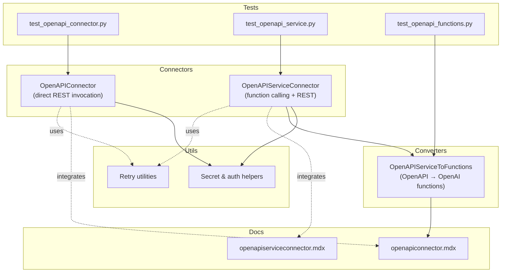
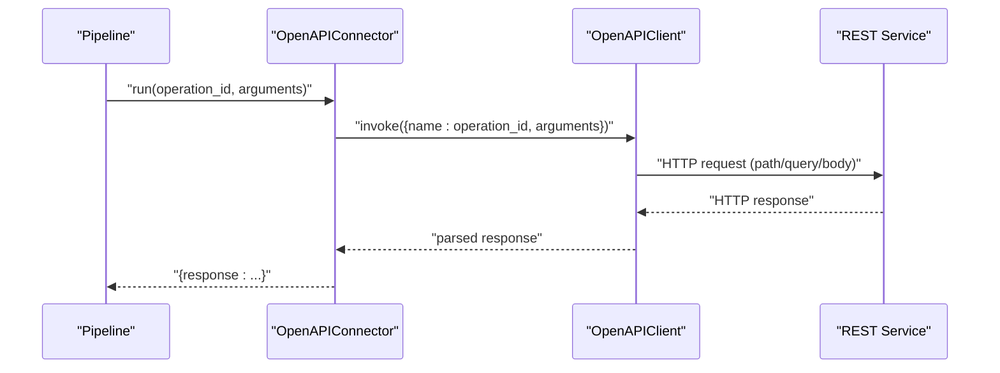
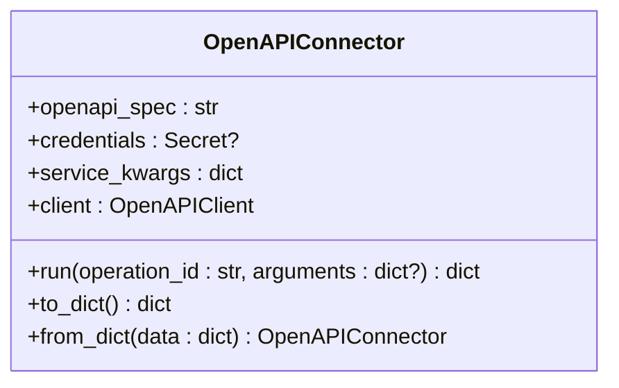
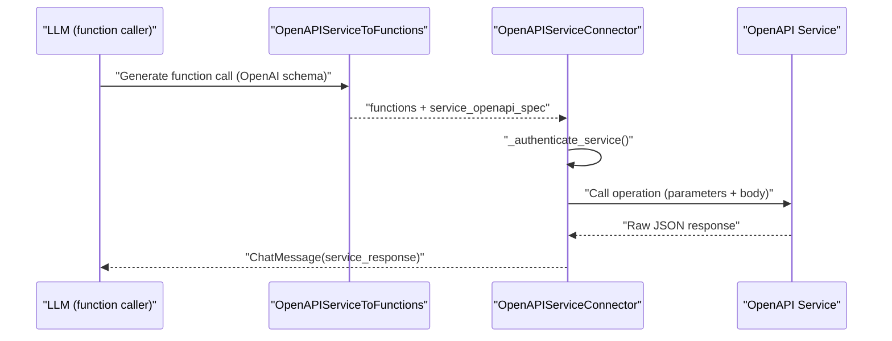
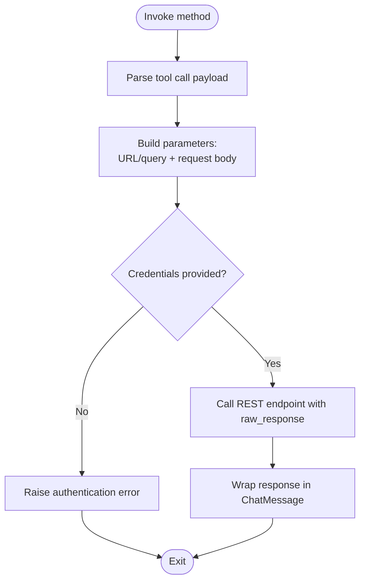
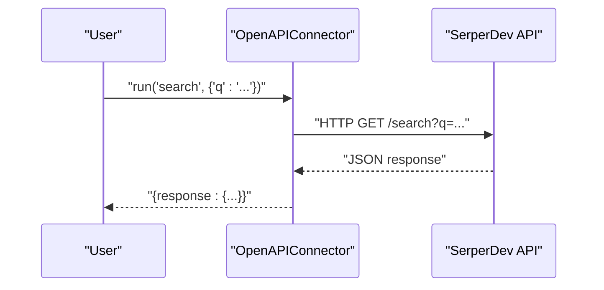
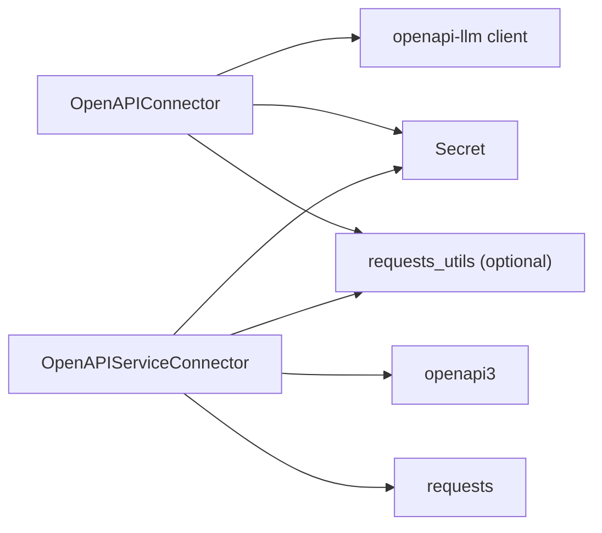

# OpenAPI Connector

<cite>
**Referenced Files in This Document**
- [openapi.py](file://haystack/components/connectors/openapi.py)
- [openapi_service.py](file://haystack/components/connectors/openapi_service.py)
- [openapi_functions.py](file://haystack/components/converters/openapi_functions.py)
- [openapiconnector.mdx](file://docs-website/docs/pipeline-components/connectors/openapiconnector.mdx)
- [openapiserviceconnector.mdx](file://docs-website/docs/pipeline-components/connectors/openapiserviceconnector.mdx)
- [auth.py](file://haystack/utils/auth.py)
- [requests_utils.py](file://haystack/utils/requests_utils.py)
- [test_openapi_connector.py](file://test/components/connectors/test_openapi_connector.py)
- [test_openapi_service.py](file://test/components/connectors/test_openapi_service.py)
- [test_openapi_functions.py](file://test/components/converters/test_openapi_functions.py)
</cite>

## Table of Contents
1. [Introduction](#introduction)
2. [Project Structure](#project-structure)
3. [Core Components](#core-components)
4. [Architecture Overview](#architecture-overview)
5. [Detailed Component Analysis](#detailed-component-analysis)
6. [Dependency Analysis](#dependency-analysis)
7. [Performance Considerations](#performance-considerations)
8. [Troubleshooting Guide](#troubleshooting-guide)
9. [Conclusion](#conclusion)
10. [Appendices](#appendices)

## Introduction
The OpenAPI Connector enables direct invocation of REST endpoints defined in an OpenAPI specification. It bridges Haystack pipelines with any REST API that conforms to the OpenAPI standard, allowing explicit operation selection and parameter passing. It is ideal for integrating with public APIs such as search engines, weather services, and third-party providers by supplying an OpenAPI spec (URL, file path, or raw string), optional credentials, and runtime arguments.

## Project Structure
The OpenAPI Connector lives in the connectors module and is accompanied by complementary components for function-based OpenAPI integration and tests for validation and examples.

**Diagram sources**
- [openapi.py](file://haystack/components/connectors/openapi.py#L15-L98)
- [openapi_service.py](file://haystack/components/connectors/openapi_service.py#L146-L398)
- [openapi_functions.py](file://haystack/components/converters/openapi_functions.py#L22-L258)
- [openapiconnector.mdx](file://docs-website/docs/pipeline-components/connectors/openapiconnector.mdx#L1-L107)
- [openapiserviceconnector.mdx](file://docs-website/docs/pipeline-components/connectors/openapiserviceconnector.mdx#L1-L112)
- [auth.py](file://haystack/utils/auth.py#L34-L231)
- [requests_utils.py](file://haystack/utils/requests_utils.py#L15-L209)
- [test_openapi_connector.py](file://test/components/connectors/test_openapi_connector.py#L1-L211)
- [test_openapi_service.py](file://test/components/connectors/test_openapi_service.py)
- [test_openapi_functions.py](file://test/components/converters/test_openapi_functions.py#L1-L259)

**Section sources**
- [openapi.py](file://haystack/components/connectors/openapi.py#L1-L98)
- [openapi_service.py](file://haystack/components/connectors/openapi_service.py#L1-L398)
- [openapi_functions.py](file://haystack/components/converters/openapi_functions.py#L1-L258)
- [openapiconnector.mdx](file://docs-website/docs/pipeline-components/connectors/openapiconnector.mdx#L1-L107)
- [openapiserviceconnector.mdx](file://docs-website/docs/pipeline-components/connectors/openapiserviceconnector.mdx#L1-L112)
- [auth.py](file://haystack/utils/auth.py#L1-L231)
- [requests_utils.py](file://haystack/utils/requests_utils.py#L1-L209)
- [test_openapi_connector.py](file://test/components/connectors/test_openapi_connector.py#L1-L211)
- [test_openapi_service.py](file://test/components/connectors/test_openapi_service.py)
- [test_openapi_functions.py](file://test/components/converters/test_openapi_functions.py#L1-L259)

## Core Components
- OpenAPIConnector: Directly invokes REST endpoints from an OpenAPI spec with explicit operation_id and arguments. It supports credentials via Secret and passes service_kwargs to the underlying client.
- OpenAPIServiceConnector: Bridges function-calling LLMs with REST services by parsing tool-call payloads, resolving parameters, authenticating, and invoking endpoints.
- OpenAPIServiceToFunctions: Converts OpenAPI specs into OpenAI function schemas for LLM-driven function calling.

Key capabilities:
- Initialization parameters:
  - openapi_spec: URL, file path, or raw string of the OpenAPI spec
  - credentials: Secret (token or env var)
  - service_kwargs: Additional client configuration (e.g., allowed_operations)
- Run method:
  - operation_id: operationId from the spec
  - arguments: Optional mapping of query/path/body parameters
- Output:
  - OpenAPIConnector returns a dictionary with a response key
  - OpenAPIServiceConnector returns ChatMessage objects with service responses

**Section sources**
- [openapi.py](file://haystack/components/connectors/openapi.py#L47-L98)
- [openapi_service.py](file://haystack/components/connectors/openapi_service.py#L209-L262)
- [openapi_functions.py](file://haystack/components/converters/openapi_functions.py#L55-L115)
- [openapiconnector.mdx](file://docs-website/docs/pipeline-components/connectors/openapiconnector.mdx#L12-L23)

## Architecture Overview
The OpenAPI Connector sits between Haystack pipelines and REST services. It uses an OpenAPI client to translate operation_id and arguments into a REST call, returning structured results.

**Diagram sources**
- [openapi.py](file://haystack/components/connectors/openapi.py#L84-L98)

**Section sources**
- [openapi.py](file://haystack/components/connectors/openapi.py#L15-L98)

## Detailed Component Analysis

### OpenAPIConnector
- Purpose: Direct invocation of REST endpoints defined in an OpenAPI spec.
- Initialization:
  - openapi_spec: Accepts URL, file path, or raw string
  - credentials: Secret (token or env var)
  - service_kwargs: Passed to the OpenAPIClient constructor
- Run:
  - Builds a payload with name and arguments
  - Calls client.invoke and wraps the result in a response dictionary

**Diagram sources**
- [openapi.py](file://haystack/components/connectors/openapi.py#L15-L98)

**Section sources**
- [openapi.py](file://haystack/components/connectors/openapi.py#L47-L98)
- [auth.py](file://haystack/utils/auth.py#L34-L231)
- [test_openapi_connector.py](file://test/components/connectors/test_openapi_connector.py#L42-L120)

### OpenAPIServiceConnector
- Purpose: Integrates function-calling LLMs with REST services using OpenAPI specs.
- Authentication:
  - Supports http and apiKey security schemes
  - Resolves credentials from a provided string or dictionary keyed by scheme name
- Invocation:
  - Parses tool calls from ChatMessage
  - Maps parameters to URL/query and request body
  - Calls the service with raw_response to preserve JSON
- Output:
  - Returns a list of ChatMessage objects containing service responses

**Diagram sources**
- [openapi_service.py](file://haystack/components/connectors/openapi_service.py#L210-L262)
- [openapi_functions.py](file://haystack/components/converters/openapi_functions.py#L55-L115)

**Section sources**
- [openapi_service.py](file://haystack/components/connectors/openapi_service.py#L146-L398)
- [openapi_functions.py](file://haystack/components/converters/openapi_functions.py#L22-L258)

### Parameter Mapping and Authentication
- Parameter mapping:
  - OpenAPIConnector: Passes arguments directly as a payload to the client
  - OpenAPIServiceConnector: Maps parameters to URL/query and request body based on the spec
- Authentication:
  - OpenAPIConnector: Uses credentials via Secret.resolve_value()
  - OpenAPIServiceConnector: Supports http and apiKey schemes; raises explicit errors if missing or mismatched

**Diagram sources**
- [openapi_service.py](file://haystack/components/connectors/openapi_service.py#L340-L398)

**Section sources**
- [openapi.py](file://haystack/components/connectors/openapi.py#L63-L67)
- [openapi_service.py](file://haystack/components/connectors/openapi_service.py#L285-L339)

### Practical Examples
- SerperDev search API integration:
  - Initialize OpenAPIConnector with an OpenAPI spec URL and credentials
  - Call run with operation_id and arguments
  - Extract response from the returned dictionary

**Diagram sources**
- [openapiconnector.mdx](file://docs-website/docs/pipeline-components/connectors/openapiconnector.mdx#L43-L57)
- [test_openapi_connector.py](file://test/components/connectors/test_openapi_connector.py#L182-L211)

**Section sources**
- [openapiconnector.mdx](file://docs-website/docs/pipeline-components/connectors/openapiconnector.mdx#L37-L107)
- [test_openapi_connector.py](file://test/components/connectors/test_openapi_connector.py#L182-L211)

## Dependency Analysis
- External libraries:
  - OpenAPIConnector relies on an OpenAPI client (openapi-llm) for invocation
  - OpenAPIServiceConnector relies on openapi3 and requests for spec parsing and HTTP calls
- Internal dependencies:
  - Secret utilities for secure credential handling
  - Retry utilities for robust HTTP calls (applicable to manual HTTP flows)

**Diagram sources**
- [openapi.py](file://haystack/components/connectors/openapi.py#L11-L12)
- [openapi_service.py](file://haystack/components/connectors/openapi_service.py#L14-L16)
- [auth.py](file://haystack/utils/auth.py#L34-L231)
- [requests_utils.py](file://haystack/utils/requests_utils.py#L15-L209)

**Section sources**
- [openapi.py](file://haystack/components/connectors/openapi.py#L11-L12)
- [openapi_service.py](file://haystack/components/connectors/openapi_service.py#L14-L16)
- [auth.py](file://haystack/utils/auth.py#L34-L231)
- [requests_utils.py](file://haystack/utils/requests_utils.py#L15-L209)

## Performance Considerations
- Client initialization overhead: Creating the OpenAPIClient once per connector instance avoids repeated parsing costs.
- Parameter packing: OpenAPIServiceConnector minimizes redundant checks by precomputing parameter groups (URL/query vs request body).
- Network resilience: Use retry utilities for manual HTTP flows to mitigate transient failures.
- Spec size: Large OpenAPI specs increase parsing time; prefer specs with resolved references when feasible.

[No sources needed since this section provides general guidance]

## Troubleshooting Guide
Common issues and resolutions:
- Missing or invalid credentials:
  - OpenAPIServiceConnector raises explicit errors if authentication is required but not provided or mismatched.
- Invalid function calling descriptors:
  - Missing name or arguments lead to ValueError during method invocation.
- Operation not found:
  - Calling a non-existent operationId results in a TypeError.
- Serialization/deserialization of secrets:
  - Token-based secrets cannot be serialized; use environment variable-based secrets for persistence.
- Integration tests:
  - Tests demonstrate expected behavior for SerperDev and GitHub APIs, including environment variable usage and pipeline integration.

**Section sources**
- [openapi_service.py](file://haystack/components/connectors/openapi_service.py#L236-L243)
- [openapi_service.py](file://haystack/components/connectors/openapi_service.py#L354-L366)
- [auth.py](file://haystack/utils/auth.py#L150-L159)
- [test_openapi_connector.py](file://test/components/connectors/test_openapi_connector.py#L121-L132)
- [test_openapi_connector.py](file://test/components/connectors/test_openapi_connector.py#L188-L211)

## Conclusion
The OpenAPI Connector provides a straightforward way to integrate REST APIs defined by OpenAPI specifications into Haystack pipelines. With flexible initialization parameters, robust authentication via Secret, and clear run semantics, it supports a wide range of use cases from search APIs to third-party integrations. For function-calling workflows, the OpenAPIServiceConnector and OpenAPIServiceToFunctions components offer a powerful combination to automate parameter extraction and invocation.

[No sources needed since this section summarizes without analyzing specific files]

## Appendices

### API Reference Summary
- OpenAPIConnector
  - Init: openapi_spec, credentials, service_kwargs
  - Run: operation_id, arguments
  - Output: response
- OpenAPIServiceConnector
  - Run: messages, service_openapi_spec, service_credentials
  - Output: service_response (list of ChatMessage)
- OpenAPIServiceToFunctions
  - Run: sources (files or ByteStream)
  - Output: functions, openapi_specs

**Section sources**
- [openapi.py](file://haystack/components/connectors/openapi.py#L47-L98)
- [openapi_service.py](file://haystack/components/connectors/openapi_service.py#L209-L262)
- [openapi_functions.py](file://haystack/components/converters/openapi_functions.py#L55-L115)