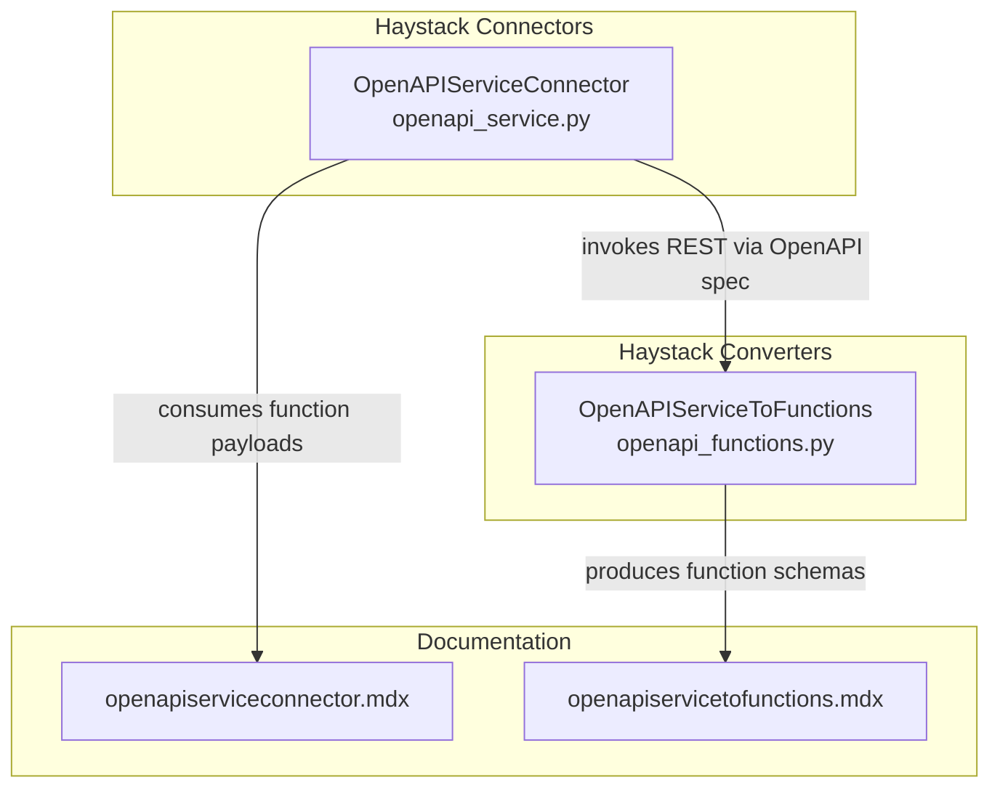
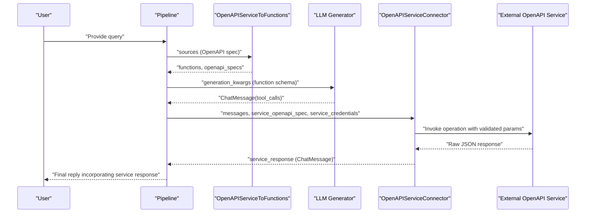
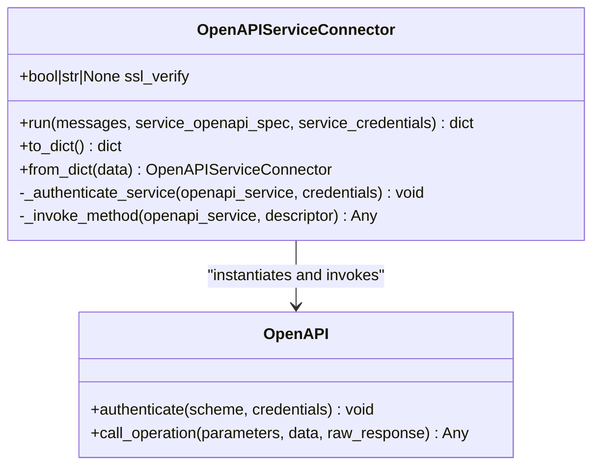
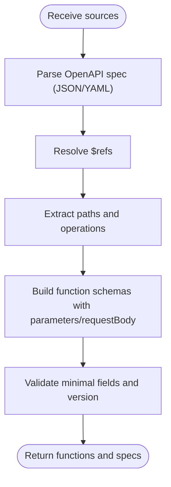
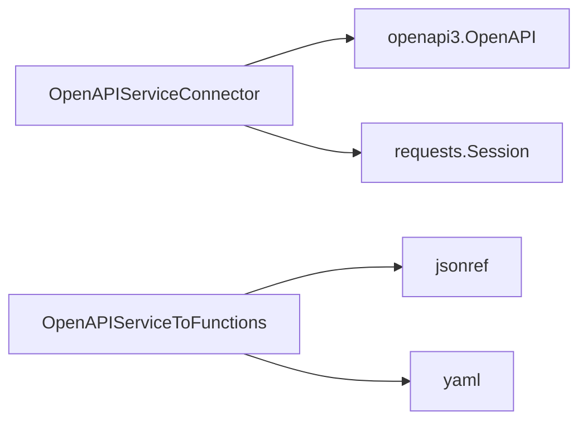

# OpenAPI Service Connector

<cite>
**Referenced Files in This Document**
- [openapi_service.py](file://haystack/components/connectors/openapi_service.py)
- [openapi_functions.py](file://haystack/components/converters/openapi_functions.py)
- [openapiserviceconnector.mdx](file://docs-website/docs/pipeline-components/connectors/openapiserviceconnector.mdx)
- [openapiservicetofunctions.mdx](file://docs-website/docs/pipeline-components/converters/openapiservicetofunctions.mdx)
- [test_openapi_service.py](file://test/components/connectors/test_openapi_service.py)
- [openapi-connector-auth-enhancement-a78e0666d3cf6353.yaml](file://releasenotes/notes/openapi-connector-auth-enhancement-a78e0666d3cf6353.yaml)
- [complex-types-openapi-support-84d3daf8927ad915.yaml](file://releasenotes/notes/complex-types-openapi-support-84d3daf8927ad915.yaml)
</cite>

## Table of Contents
1. [Introduction](#introduction)
2. [Project Structure](#project-structure)
3. [Core Components](#core-components)
4. [Architecture Overview](#architecture-overview)
5. [Detailed Component Analysis](#detailed-component-analysis)
6. [Dependency Analysis](#dependency-analysis)
7. [Performance Considerations](#performance-considerations)
8. [Troubleshooting Guide](#troubleshooting-guide)
9. [Conclusion](#conclusion)
10. [Appendices](#appendices)

## Introduction
The OpenAPI Service Connector enables Haystack pipelines to integrate with external OpenAPI-compliant services by translating function-call-style payloads from LLMs into REST invocations. It is designed to work in concert with the OpenAPI Service To Functions converter, which transforms an OpenAPI specification into function schemas compatible with LLM function calling. Together, these components form a robust service-level integration pattern that moves beyond isolated endpoint calls to enable dynamic, schema-driven interactions with third-party APIs.

## Project Structure
The OpenAPI Service Connector resides in the connectors module and pairs with the OpenAPI Service To Functions converter in the converters module. Documentation for both components is maintained in the docs-website under pipeline-components.

**Diagram sources**
- [openapi_service.py](file://haystack/components/connectors/openapi_service.py#L146-L398)
- [openapi_functions.py](file://haystack/components/converters/openapi_functions.py#L22-L258)
- [openapiserviceconnector.mdx](file://docs-website/docs/pipeline-components/connectors/openapiserviceconnector.mdx#L1-L112)
- [openapiservicetofunctions.mdx](file://docs-website/docs/pipeline-components/converters/openapiservicetofunctions.mdx#L1-L110)

**Section sources**
- [openapi_service.py](file://haystack/components/connectors/openapi_service.py#L1-L398)
- [openapi_functions.py](file://haystack/components/converters/openapi_functions.py#L1-L258)
- [openapiserviceconnector.mdx](file://docs-website/docs/pipeline-components/connectors/openapiserviceconnector.mdx#L1-L112)
- [openapiservicetofunctions.mdx](file://docs-website/docs/pipeline-components/converters/openapiservicetofunctions.mdx#L1-L110)

## Core Components
- OpenAPIServiceConnector: Bridges Haystack with OpenAPI services by parsing function-call payloads from ChatMessage, authenticating against the service, invoking operations defined in the OpenAPI spec, and returning responses as ChatMessage objects.
- OpenAPIServiceToFunctions: Converts OpenAPI specifications (JSON/YAML) into function schemas compatible with LLM function calling, resolving references and extracting parameters and request bodies.

Key integration roles:
- Endpoint discovery: Derived from the OpenAPI spec’s paths and operations.
- Batch operations: The connector supports multiple tool calls per message; each call triggers a separate REST invocation.
- Authentication: Supports http (Basic/Bearer/etc.) and apiKey schemes; credentials can be provided as a string or a mapping keyed by scheme name.
- Request/response transformation: Uses the OpenAPI spec to validate parameters and request bodies, and returns raw JSON responses wrapped in ChatMessage.

**Section sources**
- [openapi_service.py](file://haystack/components/connectors/openapi_service.py#L146-L398)
- [openapi_functions.py](file://haystack/components/converters/openapi_functions.py#L22-L258)
- [openapiserviceconnector.mdx](file://docs-website/docs/pipeline-components/connectors/openapiserviceconnector.mdx#L10-L26)
- [openapiservicetofunctions.mdx](file://docs-website/docs/pipeline-components/converters/openapiservicetofunctions.mdx#L8-L36)

## Architecture Overview
The typical pipeline pattern couples OpenAPIServiceToFunctions with OpenAPIServiceConnector and an LLM generator that performs function calling. The converter prepares function schemas and a resolved OpenAPI spec; the connector executes the resulting function calls against the target service.

**Diagram sources**
- [openapiservicetofunctions.mdx](file://docs-website/docs/pipeline-components/converters/openapiservicetofunctions.mdx#L44-L109)
- [openapiserviceconnector.mdx](file://docs-website/docs/pipeline-components/connectors/openapiserviceconnector.mdx#L36-L111)
- [openapi_service.py](file://haystack/components/connectors/openapi_service.py#L210-L262)

## Detailed Component Analysis

### OpenAPIServiceConnector
Responsibilities:
- Parse ChatMessage payloads for tool calls.
- Authenticate against the OpenAPI service using http or apiKey schemes.
- Validate parameters and request bodies according to the OpenAPI spec.
- Invoke operations and return raw JSON responses wrapped as ChatMessage.

Implementation highlights:
- Dynamic authentication: Credentials can be supplied per-run, enabling flexible, on-the-fly service integrations.
- Parameter packing: URL/query parameters go under a parameters key; request body parameters go under a data key.
- Response handling: Returns raw JSON responses to preserve compatibility with downstream components.

**Diagram sources**
- [openapi_service.py](file://haystack/components/connectors/openapi_service.py#L146-L398)

**Section sources**
- [openapi_service.py](file://haystack/components/connectors/openapi_service.py#L199-L283)
- [openapi_service.py](file://haystack/components/connectors/openapi_service.py#L285-L339)
- [openapi_service.py](file://haystack/components/connectors/openapi_service.py#L340-L398)
- [openapi-connector-auth-enhancement-a78e0666d3cf6353.yaml](file://releasenotes/notes/openapi-connector-auth-enhancement-a78e0666d3cf6353.yaml#L1-L4)

### OpenAPIServiceToFunctions
Responsibilities:
- Convert OpenAPI specs (JSON/YAML) into function schemas for LLM function calling.
- Resolve references and extract parameters and request bodies.
- Enforce minimum OpenAPI version and validate minimal required fields.

**Diagram sources**
- [openapi_functions.py](file://haystack/components/converters/openapi_functions.py#L55-L115)
- [openapi_functions.py](file://haystack/components/converters/openapi_functions.py#L117-L151)
- [openapi_functions.py](file://haystack/components/converters/openapi_functions.py#L232-L257)

**Section sources**
- [openapi_functions.py](file://haystack/components/converters/openapi_functions.py#L47-L73)
- [openapi_functions.py](file://haystack/components/converters/openapi_functions.py#L117-L151)
- [openapi_functions.py](file://haystack/components/converters/openapi_functions.py#L232-L257)

### Authentication Strategies
- Supported schemes: http (Basic, Bearer, etc.), apiKey.
- Credential input: String for a single scheme or a dictionary keyed by scheme name.
- Dynamic per-invocation credentials: Credentials are applied at runtime, enabling new services without prior configuration.

Validation and error handling:
- Missing credentials for a service requiring authentication raise explicit errors.
- Unsupported schemes produce errors guiding configuration corrections.

**Section sources**
- [openapi_service.py](file://haystack/components/connectors/openapi_service.py#L285-L339)
- [test_openapi_service.py](file://test/components/connectors/test_openapi_service.py#L44-L81)

### Parameter Validation and Request/Response Transformation
- URL/query parameters: Collected and validated against the OpenAPI spec; missing required parameters cause errors.
- Request body: Mapped from the JSON schema; required fields are enforced.
- Response transformation: Raw JSON responses are captured and returned as ChatMessage content.

Batch operations:
- Multiple tool calls in a single ChatMessage trigger multiple invocations, each returning a corresponding ChatMessage.

**Section sources**
- [openapi_service.py](file://haystack/components/connectors/openapi_service.py#L340-L398)
- [test_openapi_service.py](file://test/components/connectors/test_openapi_service.py#L82-L196)

### Integration Scenarios
- CRM systems: Use OpenAPIServiceToFunctions to convert the CRM’s OpenAPI spec into function schemas, then route LLM decisions to OpenAPIServiceConnector to perform reads/writes.
- Payment processors: Convert payment API specs to function schemas; authenticate via apiKey or http; validate parameters rigorously; return raw JSON responses for downstream orchestration.
- Enterprise APIs: Resolve complex types and nested schemas; leverage dynamic authentication to connect to multiple enterprise services without hardcoding credentials.

**Section sources**
- [openapiservicetofunctions.mdx](file://docs-website/docs/pipeline-components/converters/openapiservicetofunctions.mdx#L24-L28)
- [complex-types-openapi-support-84d3daf8927ad915.yaml](file://releasenotes/notes/complex-types-openapi-support-84d3daf8927ad915.yaml#L1-L4)

## Dependency Analysis
- OpenAPIServiceConnector depends on the openapi3 library for OpenAPI parsing and HTTP invocation, and on the requests library for HTTP transport.
- OpenAPIServiceToFunctions depends on jsonref for reference resolution and supports JSON/YAML input.
- Both components rely on Haystack’s component framework for serialization/deserialization and pipeline integration.

**Diagram sources**
- [openapi_service.py](file://haystack/components/connectors/openapi_service.py#L14-L18)
- [openapi_functions.py](file://haystack/components/converters/openapi_functions.py#L18-L19)

**Section sources**
- [openapi_service.py](file://haystack/components/connectors/openapi_service.py#L14-L18)
- [openapi_functions.py](file://haystack/components/converters/openapi_functions.py#L18-L19)

## Performance Considerations
- SSL verification: Configure ssl_verify to balance security and performance; pass a path to a CA bundle if needed.
- Serialization overhead: The connector serializes responses to JSON strings and wraps them in ChatMessage; keep payloads minimal to reduce overhead.
- Batch invocation: Multiple tool calls increase network calls; consider batching strategies at the LLM prompt level to reduce total invocations.

[No sources needed since this section provides general guidance]

## Troubleshooting Guide
Common issues and resolutions:
- Missing tool calls or non-assistant role messages: Ensure the last ChatMessage contains tool_calls and originates from the assistant.
- Authentication failures: Verify credentials match the service’s security schemes; use a string for a single scheme or a dictionary keyed by scheme name.
- Missing required parameters: Supply all required URL/query and request body parameters as defined in the OpenAPI spec.
- Unsupported authentication schemes: Only http and apiKey are supported; configure the service accordingly.

Integration tests demonstrate expected behaviors and error conditions.

**Section sources**
- [openapi_service.py](file://haystack/components/connectors/openapi_service.py#L234-L242)
- [test_openapi_service.py](file://test/components/connectors/test_openapi_service.py#L34-L42)
- [test_openapi_service.py](file://test/components/connectors/test_openapi_service.py#L44-L81)
- [test_openapi_service.py](file://test/components/connectors/test_openapi_service.py#L134-L196)

## Conclusion
The OpenAPI Service Connector and OpenAPI Service To Functions together enable robust, schema-driven integration with external services. They support dynamic authentication, strict parameter validation, and flexible response handling, while fitting naturally into Haystack pipelines. These components lay the foundation for scalable service-level integrations across CRM, payments, and enterprise APIs.

[No sources needed since this section summarizes without analyzing specific files]

## Appendices

### API Reference Highlights
- OpenAPIServiceConnector
  - Inputs: messages (ChatMessage with tool_calls), service_openapi_spec (resolved OpenAPI JSON), service_credentials (string or dict).
  - Outputs: service_response (list of ChatMessage with raw JSON content).
  - Serialization: Supports to_dict/from_dict for pipeline persistence.
- OpenAPIServiceToFunctions
  - Inputs: sources (file paths, Path, or ByteStream).
  - Outputs: functions (OpenAI function schemas), openapi_specs (resolved OpenAPI specs).

**Section sources**
- [openapiserviceconnector.mdx](file://docs-website/docs/pipeline-components/connectors/openapiserviceconnector.mdx#L12-L26)
- [openapiservicetofunctions.mdx](file://docs-website/docs/pipeline-components/converters/openapiservicetofunctions.mdx#L12-L26)
- [openapi_service.py](file://haystack/components/connectors/openapi_service.py#L264-L283)
- [openapi_functions.py](file://haystack/components/converters/openapi_functions.py#L55-L115)