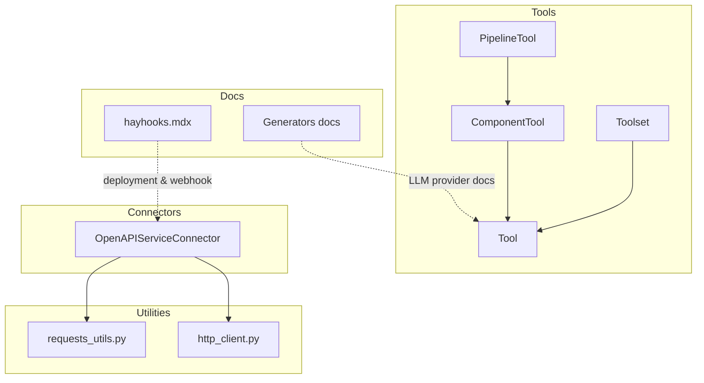
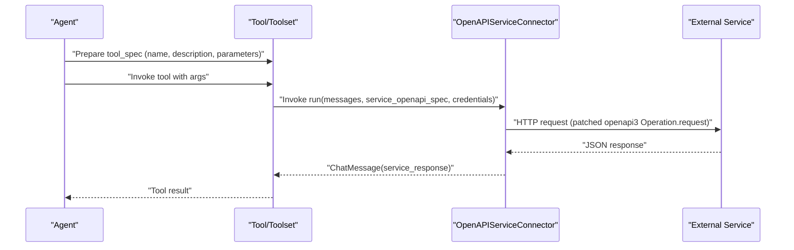
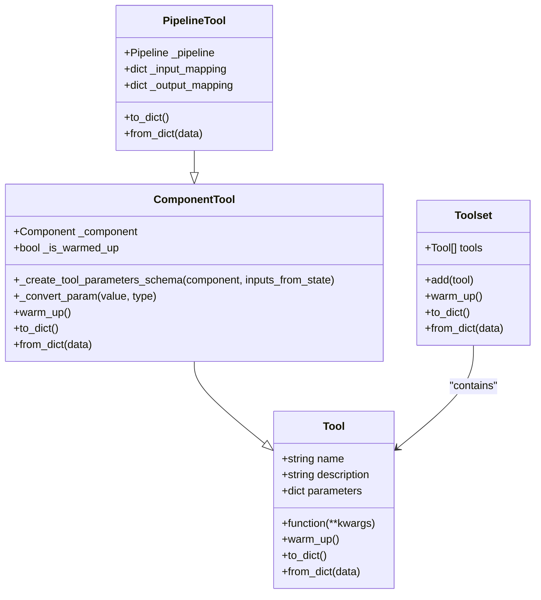
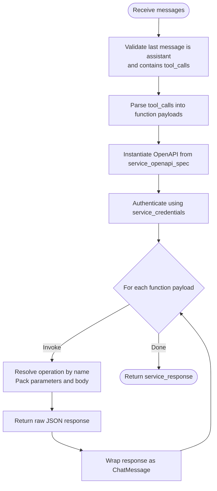
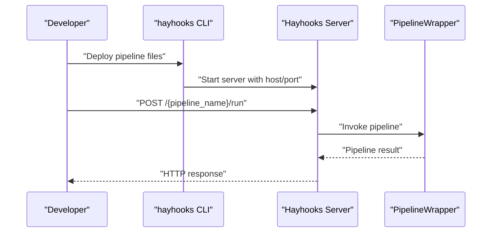
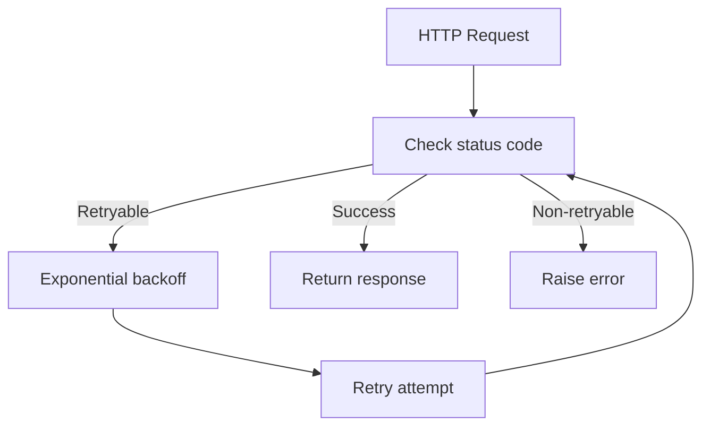
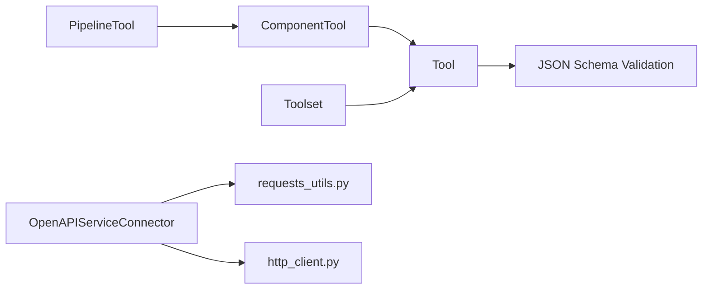

# Integrations and Extensions

<cite>
**Referenced Files in This Document**
- [haystack/tools/__init__.py](file://haystack/tools/__init__.py)
- [haystack/tools/tool.py](file://haystack/tools/tool.py)
- [haystack/tools/component_tool.py](file://haystack/tools/component_tool.py)
- [haystack/tools/pipeline_tool.py](file://haystack/tools/pipeline_tool.py)
- [haystack/tools/toolset.py](file://haystack/tools/toolset.py)
- [haystack/components/connectors/openapi_service.py](file://haystack/components/connectors/openapi_service.py)
- [haystack/utils/requests_utils.py](file://haystack/utils/requests_utils.py)
- [haystack/utils/http_client.py](file://haystack/utils/http_client.py)
- [docs-website/docs/development/hayhooks.mdx](file://docs-website/docs/development/hayhooks.mdx)
- [docs-website/versioned_docs/version-2.25/pipeline-components/generators.mdx](file://docs-website/versioned_docs/version-2.25/pipeline-components/generators.mdx)
- [releasenotes/notes/openapi-connector-auth-enhancement-a78e0666d3cf6353.yaml](file://releasenotes/notes/openapi-connector-auth-enhancement-a78e0666d3cf6353.yaml)
- [SECURITY.md](file://SECURITY.md)
</cite>

## Table of Contents
1. [Introduction](#introduction)
2. [Project Structure](#project-structure)
3. [Core Components](#core-components)
4. [Architecture Overview](#architecture-overview)
5. [Detailed Component Analysis](#detailed-component-analysis)
6. [Dependency Analysis](#dependency-analysis)
7. [Performance Considerations](#performance-considerations)
8. [Troubleshooting Guide](#troubleshooting-guide)
9. [Conclusion](#conclusion)
10. [Appendices](#appendices)

## Introduction
This document explains how to integrate external systems and extend Haystack with new capabilities. It covers:
- Supported LLM providers and how to configure them
- External API connector patterns for third-party services
- The tool integration framework for extending agent capabilities
- Plugin development patterns and custom component creation guidelines
- Webhook and event-driven integration patterns
- Configuration management for external integrations and credential handling
- Rate limiting, retry strategies, and error handling for external services
- Practical examples and best practices
- Security considerations for external communications and data privacy

## Project Structure
Haystack organizes integrations and extensions primarily under:
- Tools and tooling: reusable building blocks for agents and pipelines
- Connectors: components that bridge Haystack with external services (e.g., OpenAPI)
- Utilities: HTTP clients, retries, and configuration helpers
- Documentation: developer guides for deployment and integration patterns

**Diagram sources**
- [haystack/tools/tool.py](file://haystack/tools/tool.py#L18-L405)
- [haystack/tools/component_tool.py](file://haystack/tools/component_tool.py#L37-L395)
- [haystack/tools/pipeline_tool.py](file://haystack/tools/pipeline_tool.py#L21-L258)
- [haystack/tools/toolset.py](file://haystack/tools/toolset.py#L13-L365)
- [haystack/components/connectors/openapi_service.py](file://haystack/components/connectors/openapi_service.py#L146-L398)
- [haystack/utils/http_client.py](file://haystack/utils/http_client.py#L26-L56)
- [haystack/utils/requests_utils.py](file://haystack/utils/requests_utils.py#L36-L208)
- [docs-website/docs/development/hayhooks.mdx](file://docs-website/docs/development/hayhooks.mdx#L74-L119)
- [docs-website/versioned_docs/version-2.25/pipeline-components/generators.mdx](file://docs-website/versioned_docs/version-2.25/pipeline-components/generators.mdx#L20-L23)

**Section sources**
- [haystack/tools/__init__.py](file://haystack/tools/__init__.py#L9-L41)
- [haystack/tools/tool.py](file://haystack/tools/tool.py#L18-L405)
- [haystack/tools/component_tool.py](file://haystack/tools/component_tool.py#L37-L395)
- [haystack/tools/pipeline_tool.py](file://haystack/tools/pipeline_tool.py#L21-L258)
- [haystack/tools/toolset.py](file://haystack/tools/toolset.py#L13-L365)
- [haystack/components/connectors/openapi_service.py](file://haystack/components/connectors/openapi_service.py#L146-L398)
- [haystack/utils/http_client.py](file://haystack/utils/http_client.py#L26-L56)
- [haystack/utils/requests_utils.py](file://haystack/utils/requests_utils.py#L36-L208)
- [docs-website/docs/development/hayhooks.mdx](file://docs-website/docs/development/hayhooks.mdx#L74-L119)
- [docs-website/versioned_docs/version-2.25/pipeline-components/generators.mdx](file://docs-website/versioned_docs/version-2.25/pipeline-components/generators.mdx#L20-L23)

## Core Components
- Tool: Base abstraction for callable units with a name, description, JSON schema parameters, and a function to invoke. Supports warm-up hooks and serialization.
- ComponentTool: Wraps a Haystack Component as a Tool, auto-generating an LLM-friendly schema from component input sockets and type hints.
- PipelineTool: Wraps a Haystack Pipeline as a Tool, enabling agents to invoke entire pipelines as a single function call.
- Toolset: A collection of Tools that can be grouped, dynamically loaded, and warmed up as a unit.

These components enable agents to discover and execute tools, and pipelines to be exposed as tools for LLM orchestration.

**Section sources**
- [haystack/tools/tool.py](file://haystack/tools/tool.py#L18-L405)
- [haystack/tools/component_tool.py](file://haystack/tools/component_tool.py#L37-L395)
- [haystack/tools/pipeline_tool.py](file://haystack/tools/pipeline_tool.py#L21-L258)
- [haystack/tools/toolset.py](file://haystack/tools/toolset.py#L13-L365)

## Architecture Overview
The integration architecture centers around three pillars:
- Tooling: Tools and Toolsets provide a standardized interface for LLM function calling.
- Connectors: Components like OpenAPIServiceConnector translate LLM function calls into external API invocations.
- Utilities: HTTP clients and retry utilities provide robust connectivity and resilience.

**Diagram sources**
- [haystack/tools/tool.py](file://haystack/tools/tool.py#L244-L271)
- [haystack/tools/component_tool.py](file://haystack/tools/component_tool.py#L188-L205)
- [haystack/tools/pipeline_tool.py](file://haystack/tools/pipeline_tool.py#L196-L204)
- [haystack/components/connectors/openapi_service.py](file://haystack/components/connectors/openapi_service.py#L210-L262)
- [haystack/utils/requests_utils.py](file://haystack/utils/requests_utils.py#L36-L208)

## Detailed Component Analysis

### Tool Integration Framework
- Purpose: Provide a uniform way for LLMs to discover and call tools.
- Features:
  - JSON schema parameters for precise argument validation
  - Warm-up lifecycle for resource-heavy operations
  - Serialization/deserialization for persistence and transport
  - Mapping inputs from state and outputs to state for pipeline integration

**Diagram sources**
- [haystack/tools/tool.py](file://haystack/tools/tool.py#L18-L405)
- [haystack/tools/component_tool.py](file://haystack/tools/component_tool.py#L37-L395)
- [haystack/tools/pipeline_tool.py](file://haystack/tools/pipeline_tool.py#L21-L258)
- [haystack/tools/toolset.py](file://haystack/tools/toolset.py#L13-L365)

**Section sources**
- [haystack/tools/tool.py](file://haystack/tools/tool.py#L18-L405)
- [haystack/tools/component_tool.py](file://haystack/tools/component_tool.py#L37-L395)
- [haystack/tools/pipeline_tool.py](file://haystack/tools/pipeline_tool.py#L21-L258)
- [haystack/tools/toolset.py](file://haystack/tools/toolset.py#L13-L365)

### External API Connector Patterns (OpenAPIServiceConnector)
- Purpose: Bridge LLM function calls to external REST services via OpenAPI specifications.
- Key behaviors:
  - Parses LLM-generated function calling payloads from ChatMessage
  - Authenticates using OpenAPI security schemes (http/apiKey)
  - Invokes operations with parameter packing and raw JSON response handling
  - Supports SSL verification and patched request behavior for raw responses

**Diagram sources**
- [haystack/components/connectors/openapi_service.py](file://haystack/components/connectors/openapi_service.py#L210-L262)
- [haystack/components/connectors/openapi_service.py](file://haystack/components/connectors/openapi_service.py#L285-L339)
- [haystack/components/connectors/openapi_service.py](file://haystack/components/connectors/openapi_service.py#L340-L398)

**Section sources**
- [haystack/components/connectors/openapi_service.py](file://haystack/components/connectors/openapi_service.py#L146-L398)
- [releasenotes/notes/openapi-connector-auth-enhancement-a78e0666d3cf6353.yaml](file://releasenotes/notes/openapi-connector-auth-enhancement-a78e0666d3cf6353.yaml#L1-L4)

### LLM Provider Integrations
Supported providers and components are documented in the pipeline components reference. Typical patterns include:
- OpenAI: Chat and text generation components
- Azure OpenAI: Chat, text generation, and Responses API variants
- Cohere: Chat and generator components

These components integrate with the tooling framework and can be used as tools or in pipelines.

**Section sources**
- [docs-website/versioned_docs/version-2.25/pipeline-components/generators.mdx](file://docs-website/versioned_docs/version-2.25/pipeline-components/generators.mdx#L20-L23)

### Webhook and Event-Driven Integration (Hayhooks)
Hayhooks enables deploying pipelines as web services with CORS configuration and a simple wrapper class. Typical steps:
- Prepare a pipeline definition and a PipelineWrapper
- Deploy and run the service
- Expose endpoints for invoking pipelines

**Diagram sources**
- [docs-website/docs/development/hayhooks.mdx](file://docs-website/docs/development/hayhooks.mdx#L74-L119)

**Section sources**
- [docs-website/docs/development/hayhooks.mdx](file://docs-website/docs/development/hayhooks.mdx#L74-L119)

### Plugin Development Patterns and Custom Component Creation
- Use the @component decorator to define custom components with input/output sockets.
- Expose tools via ComponentTool or PipelineTool to integrate with agents.
- Implement warm_up() for initialization and resource acquisition.
- Keep components serializable and avoid storing mutable state that cannot be persisted.

[No sources needed since this section provides general guidance]

### Configuration Management and Credential Handling
- Environment variables and per-provider timeouts/max_retries are commonly used for external integrations.
- OpenAPIServiceConnector supports dynamic authentication per run invocation, removing the need to pre-configure fixed sets of credentials.
- HTTP client configuration supports connection limits and async/sync clients.

**Section sources**
- [haystack/components/connectors/openapi_service.py](file://haystack/components/connectors/openapi_service.py#L285-L339)
- [haystack/utils/http_client.py](file://haystack/utils/http_client.py#L26-L56)

### Rate Limiting, Retry Strategies, and Error Handling
- Retry utilities support configurable attempts and status codes to retry (default includes 408, 418, 429, 503).
- Async and sync wrappers are available for robust external calls.
- Fallback generators demonstrate failover strategies for LLM providers.

**Diagram sources**
- [haystack/utils/requests_utils.py](file://haystack/utils/requests_utils.py#L36-L208)

**Section sources**
- [haystack/utils/requests_utils.py](file://haystack/utils/requests_utils.py#L36-L208)

### Practical Examples and Best Practices
- Use ComponentTool to turn a web search component into a tool for agents.
- Wrap retrieval pipelines as PipelineTool for agent-driven RAG.
- Use Toolset to group related tools and dynamically load tools from external sources.
- Prefer explicit parameter schemas and inputs_from_state/outputs_to_state mappings for clarity.
- Warm up tools and components before agent execution to reduce latency.

**Section sources**
- [haystack/tools/component_tool.py](file://haystack/tools/component_tool.py#L60-L95)
- [haystack/tools/pipeline_tool.py](file://haystack/tools/pipeline_tool.py#L35-L98)
- [haystack/tools/toolset.py](file://haystack/tools/toolset.py#L13-L134)

### Security Considerations
- External communications should use verified TLS and configured CA bundles when applicable.
- Avoid embedding secrets in code; use environment variables or secure secret stores.
- Validate and sanitize inputs before passing to external services.
- Follow the project’s security policy for reporting vulnerabilities.

**Section sources**
- [SECURITY.md](file://SECURITY.md#L1-L23)

## Dependency Analysis
The tooling stack exhibits low coupling and high cohesion:
- Tools depend on callable abstractions and JSON schema validation
- ComponentTool and PipelineTool depend on the core component system
- Connectors depend on HTTP utilities and OpenAPI parsing libraries
- Utilities encapsulate HTTP client configuration and retry logic

**Diagram sources**
- [haystack/tools/tool.py](file://haystack/tools/tool.py#L10-L16)
- [haystack/tools/component_tool.py](file://haystack/tools/component_tool.py#L12-L32)
- [haystack/tools/pipeline_tool.py](file://haystack/tools/pipeline_tool.py#L8-L16)
- [haystack/tools/toolset.py](file://haystack/tools/toolset.py#L9-L10)
- [haystack/components/connectors/openapi_service.py](file://haystack/components/connectors/openapi_service.py#L10-L18)
- [haystack/utils/requests_utils.py](file://haystack/utils/requests_utils.py#L36-L208)
- [haystack/utils/http_client.py](file://haystack/utils/http_client.py#L26-L56)

**Section sources**
- [haystack/tools/tool.py](file://haystack/tools/tool.py#L10-L16)
- [haystack/tools/component_tool.py](file://haystack/tools/component_tool.py#L12-L32)
- [haystack/tools/pipeline_tool.py](file://haystack/tools/pipeline_tool.py#L8-L16)
- [haystack/tools/toolset.py](file://haystack/tools/toolset.py#L9-L10)
- [haystack/components/connectors/openapi_service.py](file://haystack/components/connectors/openapi_service.py#L10-L18)
- [haystack/utils/requests_utils.py](file://haystack/utils/requests_utils.py#L36-L208)
- [haystack/utils/http_client.py](file://haystack/utils/http_client.py#L26-L56)

## Performance Considerations
- Use warm_up() to initialize expensive resources once
- Prefer batching and async clients for high-throughput integrations
- Tune retry attempts and backoff to balance reliability and latency
- Minimize unnecessary serialization/deserialization by reusing components

[No sources needed since this section provides general guidance]

## Troubleshooting Guide
Common issues and remedies:
- Authentication failures with OpenAPI services: ensure credentials match the service’s security schemes and are provided per run
- Missing required parameters: verify tool call arguments against the component or OpenAPI operation schema
- SSL/TLS errors: configure ssl_verify appropriately or provide a CA bundle
- Rate limiting: implement exponential backoff and consider fallback providers

**Section sources**
- [haystack/components/connectors/openapi_service.py](file://haystack/components/connectors/openapi_service.py#L285-L339)
- [haystack/utils/requests_utils.py](file://haystack/utils/requests_utils.py#L36-L208)

## Conclusion
Haystack provides a cohesive framework for integrating external systems and extending capabilities through tools, connectors, and utilities. By leveraging ComponentTool and PipelineTool, you can expose components and pipelines as LLM-callable functions. Connectors like OpenAPIServiceConnector enable robust integration with third-party services, while utilities offer resilient HTTP connectivity. Follow the best practices and security guidance to build reliable, maintainable integrations.

[No sources needed since this section summarizes without analyzing specific files]

## Appendices
- Deployment and webhook patterns are documented in the Hayhooks guide
- LLM provider components are documented in the pipeline components reference

**Section sources**
- [docs-website/docs/development/hayhooks.mdx](file://docs-website/docs/development/hayhooks.mdx#L74-L119)
- [docs-website/versioned_docs/version-2.25/pipeline-components/generators.mdx](file://docs-website/versioned_docs/version-2.25/pipeline-components/generators.mdx#L20-L23)