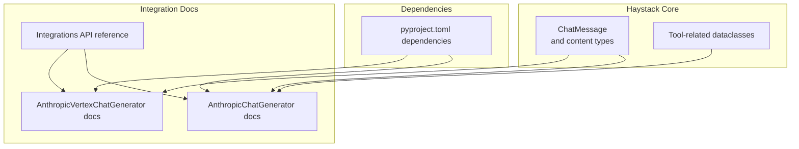
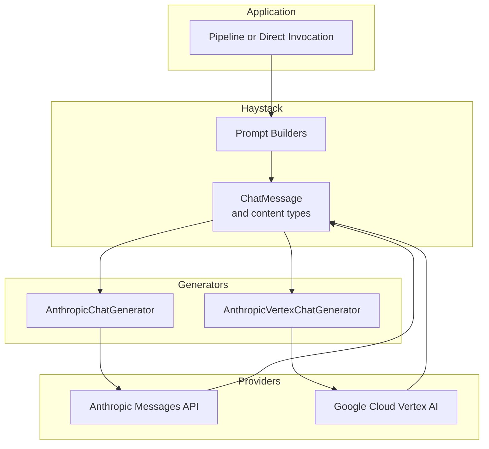
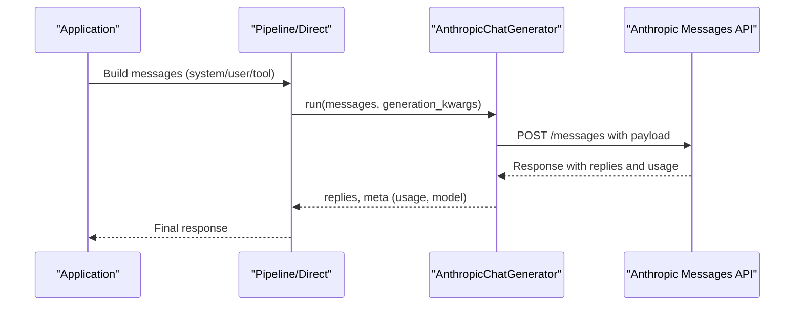
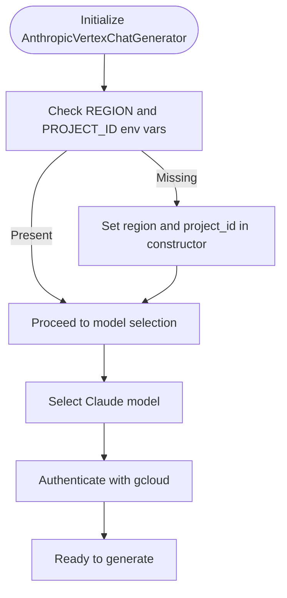
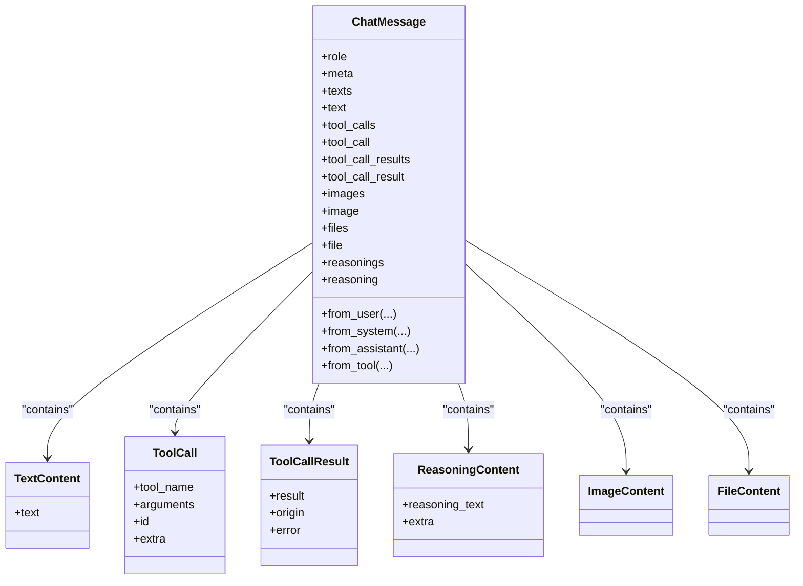
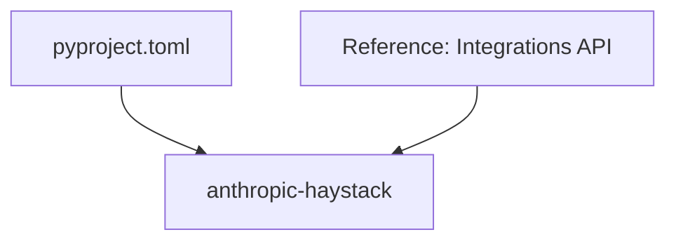

# Anthropic Claude Integration

<cite>
**Referenced Files in This Document**
- [anthropicchatgenerator.mdx](file://docs-website/docs/pipeline-components/generators/anthropicchatgenerator.mdx)
- [anthropicvertexchatgenerator.mdx](file://docs-website/docs/pipeline-components/generators/anthropicvertexchatgenerator.mdx)
- [chat_message.py](file://haystack/dataclasses/chat_message.py)
- [pyproject.toml](file://pyproject.toml)
- [anthropic.md](file://docs-website/reference/integrations-api/anthropic.md)
- [anthropicchatgenerator.mdx (versioned)](file://docs-website/versioned_docs/version-2.25/pipeline-components/generators/anthropicchatgenerator.mdx)
- [anthropicvertexchatgenerator.mdx (versioned)](file://docs-website/versioned_docs/version-2.25/pipeline-components/generators/anthropicvertexchatgenerator.mdx)
</cite>

## Table of Contents
1. [Introduction](#introduction)
2. [Project Structure](#project-structure)
3. [Core Components](#core-components)
4. [Architecture Overview](#architecture-overview)
5. [Detailed Component Analysis](#detailed-component-analysis)
6. [Dependency Analysis](#dependency-analysis)
7. [Performance Considerations](#performance-considerations)
8. [Troubleshooting Guide](#troubleshooting-guide)
9. [Conclusion](#conclusion)
10. [Appendices](#appendices)

## Introduction
This document explains how to integrate Anthropic Claude with Haystack using the AnthropicChatGenerator and AnthropicVertexChatGenerator components. It covers authentication, model selection, Claude-specific features such as system prompts, tool use, and constitutional AI guidelines, and how to configure parameters like temperature, max_tokens, and stop sequences. It also addresses safety settings, content filtering, ethical AI considerations, error handling, rate limiting, and cost optimization strategies. Practical examples demonstrate configuring Claude models, handling API responses, and implementing safety measures. Guidance is included for Claude’s unique capabilities such as chain-of-thought reasoning and tool integration patterns.

## Project Structure
Haystack provides two primary integration pathways for Claude:
- AnthropicChatGenerator: Uses the standard Anthropic Messages API via the dedicated package.
- AnthropicVertexChatGenerator: Uses the Anthropic Messages API through Google Cloud Vertex AI.

Key areas of the repository relevant to this integration:
- Documentation for AnthropicChatGenerator and AnthropicVertexChatGenerator in the docs-website.
- Data structures for chat messages and tool-related content in the dataclasses module.
- Package dependencies that enable integrations and related utilities.

**Section sources**
- [anthropicchatgenerator.mdx](file://docs-website/docs/pipeline-components/generators/anthropicchatgenerator.mdx#L19-L35)
- [anthropicvertexchatgenerator.mdx](file://docs-website/docs/pipeline-components/generators/anthropicvertexchatgenerator.mdx#L25-L42)
- [chat_message.py](file://haystack/dataclasses/chat_message.py#L273-L564)
- [pyproject.toml](file://pyproject.toml#L43-L62)

## Core Components
- AnthropicChatGenerator
  - Purpose: Generates text using Anthropic chat models via the Messages API.
  - Authentication: Requires an Anthropic API key via environment variable or a Secret.
  - Model Selection: Choose a supported Claude model at initialization.
  - Parameters: Accepts generation_kwargs that map directly to the Anthropic Messages API.
  - Usage: Works standalone or within a Haystack pipeline.

- AnthropicVertexChatGenerator
  - Purpose: Generates text using Claude models through Google Cloud Vertex AI.
  - Authentication: Requires GCP credentials and environment variables for region and project ID.
  - Model Selection: Supports Claude 3.5 Sonnet, Claude 3 Opus, Claude 3 Sonnet, and Claude 3 Haiku.
  - Parameters: Similar to AnthropicChatGenerator but configured for Vertex AI.

- ChatMessage and Content Types
  - Provides standardized roles (user, system, assistant, tool) and content parts (text, image, file, reasoning, tool_call, tool_call_result).
  - Enables constructing system prompts, tool calls/results, and multimodal inputs.

**Section sources**
- [anthropicchatgenerator.mdx](file://docs-website/docs/pipeline-components/generators/anthropicchatgenerator.mdx#L19-L35)
- [anthropicchatgenerator.mdx](file://docs-website/docs/pipeline-components/generators/anthropicchatgenerator.mdx#L123-L164)
- [anthropicvertexchatgenerator.mdx](file://docs-website/docs/pipeline-components/generators/anthropicvertexchatgenerator.mdx#L25-L42)
- [chat_message.py](file://haystack/dataclasses/chat_message.py#L22-L50)
- [chat_message.py](file://haystack/dataclasses/chat_message.py#L273-L564)
- [chat_message.py](file://haystack/dataclasses/chat_message.py#L172-L203)

## Architecture Overview
The integration architecture centers on two generator components that translate Haystack’s ChatMessage into provider-specific requests and parse provider responses back into Haystack data structures.

**Diagram sources**
- [anthropicchatgenerator.mdx](file://docs-website/docs/pipeline-components/generators/anthropicchatgenerator.mdx#L19-L35)
- [anthropicvertexchatgenerator.mdx](file://docs-website/docs/pipeline-components/generators/anthropicvertexchatgenerator.mdx#L25-L42)
- [chat_message.py](file://haystack/dataclasses/chat_message.py#L273-L564)

## Detailed Component Analysis

### AnthropicChatGenerator
- Authentication
  - API key via environment variable or Secret.
  - Initialize with model and generation_kwargs.

- Model Selection
  - Select a Claude model at initialization.

- Parameters and Generation Kwargs
  - generation_kwargs map directly to the Anthropic Messages API.
  - Configure temperature, max_tokens, stop sequences, and other provider-specific parameters.

- System Prompts
  - Construct a system ChatMessage and prepend to the message list.

- Tool Use
  - Assistant messages can include tool_calls.
  - Tool results are represented as tool_call_result content parts.
  - ToolCall and ToolCallResult dataclasses support structured tool integration.

- Chain-of-Thought Reasoning
  - Assistant messages can include reasoning content via ReasoningContent.

- Multimodal Inputs
  - Support for images and files via ImageContent and FileContent.

**Diagram sources**
- [anthropicchatgenerator.mdx](file://docs-website/docs/pipeline-components/generators/anthropicchatgenerator.mdx#L123-L164)
- [chat_message.py](file://haystack/dataclasses/chat_message.py#L507-L541)

**Section sources**
- [anthropicchatgenerator.mdx](file://docs-website/docs/pipeline-components/generators/anthropicchatgenerator.mdx#L19-L35)
- [anthropicchatgenerator.mdx](file://docs-website/docs/pipeline-components/generators/anthropicchatgenerator.mdx#L123-L164)
- [chat_message.py](file://haystack/dataclasses/chat_message.py#L79-L114)
- [chat_message.py](file://haystack/dataclasses/chat_message.py#L120-L168)
- [chat_message.py](file://haystack/dataclasses/chat_message.py#L172-L203)
- [chat_message.py](file://haystack/dataclasses/chat_message.py#L507-L541)

### AnthropicVertexChatGenerator
- Authentication
  - Requires GCP project_id and region via environment variables or constructor parameters.
  - Authenticate with gcloud prior to making requests.

- Model Selection
  - Supports Claude 3.5 Sonnet, Claude 3 Opus, Claude 3 Sonnet, and Claude 3 Haiku.

- Parameters
  - Similar to AnthropicChatGenerator; ensure the model is activated in the Vertex AI Model Garden.

**Diagram sources**
- [anthropicvertexchatgenerator.mdx](file://docs-website/docs/pipeline-components/generators/anthropicvertexchatgenerator.mdx#L25-L42)

**Section sources**
- [anthropicvertexchatgenerator.mdx](file://docs-website/docs/pipeline-components/generators/anthropicvertexchatgenerator.mdx#L25-L42)

### Data Classes for Chat and Tools
- ChatMessage roles and content parts
  - Roles: user, system, assistant, tool.
  - Content parts: TextContent, ImageContent, FileContent, ReasoningContent, ToolCall, ToolCallResult.

- Assistant messages can carry:
  - Text content
  - Tool calls
  - Reasoning content

- Tool result messages carry:
  - ToolCallResult with origin and error flag

**Diagram sources**
- [chat_message.py](file://haystack/dataclasses/chat_message.py#L273-L564)
- [chat_message.py](file://haystack/dataclasses/chat_message.py#L54-L75)
- [chat_message.py](file://haystack/dataclasses/chat_message.py#L79-L114)
- [chat_message.py](file://haystack/dataclasses/chat_message.py#L120-L168)
- [chat_message.py](file://haystack/dataclasses/chat_message.py#L172-L203)

**Section sources**
- [chat_message.py](file://haystack/dataclasses/chat_message.py#L22-L50)
- [chat_message.py](file://haystack/dataclasses/chat_message.py#L273-L564)

## Dependency Analysis
- Anthropic integration depends on the dedicated package “anthropic-haystack”.
- Core dependencies in pyproject.toml include HTTP clients, serialization libraries, and telemetry utilities that underpin integrations.

**Diagram sources**
- [pyproject.toml](file://pyproject.toml#L43-L62)
- [anthropic.md](file://docs-website/reference/integrations-api/anthropic.md)

**Section sources**
- [pyproject.toml](file://pyproject.toml#L43-L62)
- [anthropic.md](file://docs-website/reference/integrations-api/anthropic.md)

## Performance Considerations
- Cost Optimization
  - Use smaller, efficient models for simple tasks.
  - Control max_tokens to limit output length.
  - Use system prompts and concise user prompts to reduce token usage.
  - Enable prompt caching where supported by the provider.

- Throughput and Latency
  - Batch prompts thoughtfully; Claude API latency depends on model and request complexity.
  - Use appropriate temperature for deterministic vs creative outputs.

- Token Efficiency
  - Prefer shorter stop sequences and precise instructions.
  - Leverage tool use to offload computation and reduce model hallucinations.

[No sources needed since this section provides general guidance]

## Troubleshooting Guide
- Authentication Failures
  - AnthropicChatGenerator: Ensure the ANTHROPIC_API_KEY environment variable is set or pass a Secret via api_key.
  - AnthropicVertexChatGenerator: Ensure REGION and PROJECT_ID environment variables are set and authenticate with gcloud.

- Model Not Found or Disabled
  - AnthropicVertexChatGenerator: Confirm the selected model is activated in the Vertex AI Model Garden.

- Parameter Mismatches
  - generation_kwargs must align with the Anthropic Messages API schema. Validate parameter names and types.

- Tool Use Issues
  - Ensure ToolCall includes a non-null id when required by the provider.
  - ToolCallResult must match the expected content type (string or list of TextContent).

- Rate Limiting and Quotas
  - Implement retries with exponential backoff.
  - Monitor usage and adjust request rates accordingly.

**Section sources**
- [anthropicchatgenerator.mdx](file://docs-website/docs/pipeline-components/generators/anthropicchatgenerator.mdx#L27-L35)
- [anthropicvertexchatgenerator.mdx](file://docs-website/docs/pipeline-components/generators/anthropicvertexchatgenerator.mdx#L32-L42)
- [chat_message.py](file://haystack/dataclasses/chat_message.py#L750-L771)

## Conclusion
By leveraging AnthropicChatGenerator and AnthropicVertexChatGenerator, Haystack users can integrate Claude models with robust support for system prompts, tool use, and chain-of-thought reasoning. Proper authentication, model selection, and parameter configuration enable safe, efficient, and cost-effective deployments. The ChatMessage dataclasses provide a unified interface for building multimodal and tool-enabled conversations aligned with Claude’s capabilities.

[No sources needed since this section summarizes without analyzing specific files]

## Appendices

### Practical Configuration Examples
- Install the Anthropic integration package and initialize AnthropicChatGenerator with a model and generation_kwargs.
- Construct a system ChatMessage and append user messages; run the generator to receive replies and usage metadata.
- For multimodal inputs, include ImageContent or FileContent in user messages.

**Section sources**
- [anthropicchatgenerator.mdx](file://docs-website/docs/pipeline-components/generators/anthropicchatgenerator.mdx#L134-L164)

### Safety Settings and Ethical AI Considerations
- Use system prompts to guide ethical behavior and content filtering.
- Employ constitutional AI guidelines by structuring system instructions that constrain harmful outputs.
- Monitor usage and apply rate limiting to prevent misuse.

**Section sources**
- [anthropicchatgenerator.mdx](file://docs-website/docs/pipeline-components/generators/anthropicchatgenerator.mdx#L19-L35)