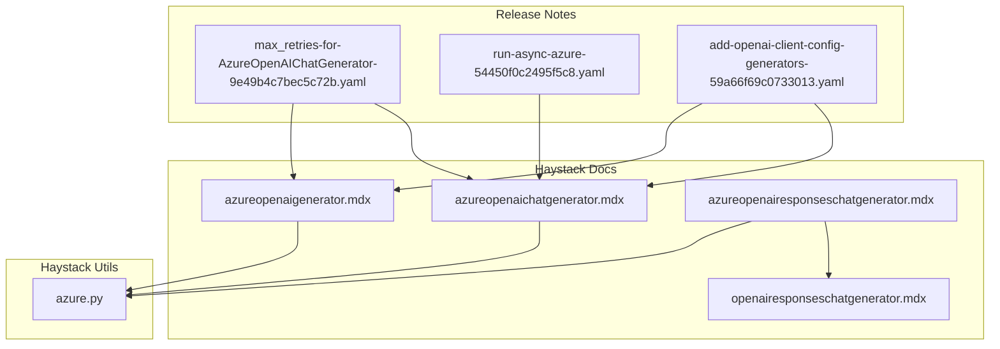
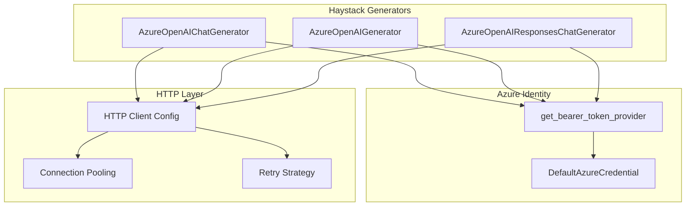
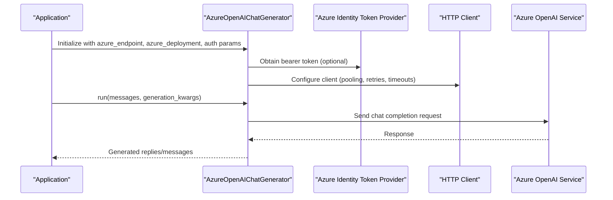
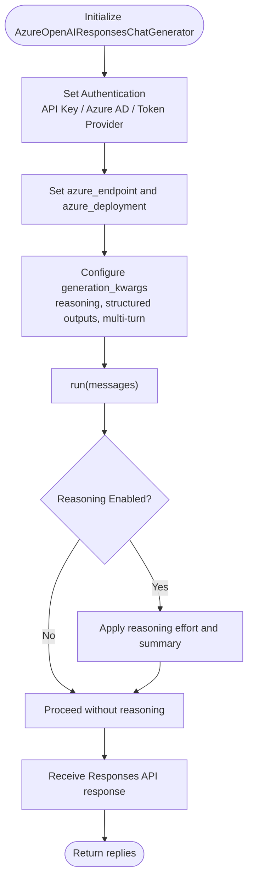
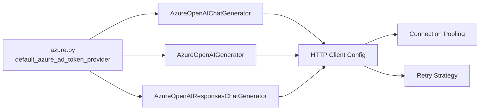

# Azure OpenAI Integration

<cite>
**Referenced Files in This Document**
- [azureopenaichatgenerator.mdx](file://docs-website/docs/pipeline-components/generators/azureopenaichatgenerator.mdx)
- [azureopenaigenerator.mdx](file://docs-website/docs/pipeline-components/generators/azureopenaigenerator.mdx)
- [azureopenairesponseschatgenerator.mdx](file://docs-website/docs/pipeline-components/generators/azureopenairesponseschatgenerator.mdx)
- [azure.py](file://haystack/utils/azure.py)
- [openairesponseschatgenerator.mdx](file://docs-website/docs/pipeline-components/generators/openairesponseschatgenerator.mdx)
- [max_retries-for-AzureOpenAIChatGenerator-9e49b4c7bec5c72b.yaml](file://releasenotes/notes/max_retries-for-AzureOpenAIChatGenerator-9e49b4c7bec5c72b.yaml)
- [run-async-azure-54450f0c2495f5c8.yaml](file://releasenotes/notes/run-async-azure-54450f0c2495f5c8.yaml)
- [add-openai-client-config-generators-59a66f69c0733013.yaml](file://releasenotes/notes/add-openai-client-config-generators-59a66f69c0733013.yaml)
</cite>

## Table of Contents
1. [Introduction](#introduction)
2. [Project Structure](#project-structure)
3. [Core Components](#core-components)
4. [Architecture Overview](#architecture-overview)
5. [Detailed Component Analysis](#detailed-component-analysis)
6. [Dependency Analysis](#dependency-analysis)
7. [Performance Considerations](#performance-considerations)
8. [Troubleshooting Guide](#troubleshooting-guide)
9. [Conclusion](#conclusion)
10. [Appendices](#appendices)

## Introduction
This document explains how to integrate Azure OpenAI with Haystack, focusing on the Azure OpenAI ChatGenerator and Generator components. It covers Azure-specific authentication methods (API key, Azure AD, and managed identity), deployment configuration, endpoint management, and advanced capabilities such as the Azure OpenAI Responses API for reasoning models, structured outputs, and multi-turn conversations. It also outlines connection pooling, retry strategies, practical deployment examples, and enterprise considerations for cost management, monitoring, and compliance.

## Project Structure
The Azure OpenAI integration in Haystack is documented through dedicated MDX pages for each generator and supported through utility helpers for Azure Identity. The relevant files include:
- Documentation pages for Azure OpenAI ChatGenerator, Azure OpenAI Generator, and Azure OpenAI Responses ChatGenerator
- Utility module for Azure Identity token provider
- Release notes detailing enhancements such as async support, retries, timeouts, and HTTP client configuration

**Diagram sources**
- [azureopenaichatgenerator.mdx](file://docs-website/docs/pipeline-components/generators/azureopenaichatgenerator.mdx#L22-L44)
- [azureopenaigenerator.mdx](file://docs-website/docs/pipeline-components/generators/azureopenaigenerator.mdx#L22-L44)
- [azureopenairesponseschatgenerator.mdx](file://docs-website/docs/pipeline-components/generators/azureopenairesponseschatgenerator.mdx#L67-L339)
- [openairesponseschatgenerator.mdx](file://docs-website/docs/pipeline-components/generators/openairesponseschatgenerator.mdx#L22-L38)
- [azure.py](file://haystack/utils/azure.py#L1-L17)
- [max_retries-for-AzureOpenAIChatGenerator-9e49b4c7bec5c72b.yaml](file://releasenotes/notes/max_retries-for-AzureOpenAIChatGenerator-9e49b4c7bec5c72b.yaml#L1-L4)
- [run-async-azure-54450f0c2495f5c8.yaml](file://releasenotes/notes/run-async-azure-54450f0c2495f5c8.yaml#L1-L6)
- [add-openai-client-config-generators-59a66f69c0733013.yaml](file://releasenotes/notes/add-openai-client-config-generators-59a66f69c0733013.yaml#L1-L4)

**Section sources**
- [azureopenaichatgenerator.mdx](file://docs-website/docs/pipeline-components/generators/azureopenaichatgenerator.mdx#L22-L44)
- [azureopenaigenerator.mdx](file://docs-website/docs/pipeline-components/generators/azureopenaigenerator.mdx#L22-L44)
- [azureopenairesponseschatgenerator.mdx](file://docs-website/docs/pipeline-components/generators/azureopenairesponseschatgenerator.mdx#L67-L339)
- [openairesponseschatgenerator.mdx](file://docs-website/docs/pipeline-components/generators/openairesponseschatgenerator.mdx#L22-L38)
- [azure.py](file://haystack/utils/azure.py#L1-L17)
- [max_retries-for-AzureOpenAIChatGenerator-9e49b4c7bec5c72b.yaml](file://releasenotes/notes/max_retries-for-AzureOpenAIChatGenerator-9e49b4c7bec5c72b.yaml#L1-L4)
- [run-async-azure-54450f0c2495f5c8.yaml](file://releasenotes/notes/run-async-azure-54450f0c2495f5c8.yaml#L1-L6)
- [add-openai-client-config-generators-59a66f69c0733013.yaml](file://releasenotes/notes/add-openai-client-config-generators-59a66f69c0733013.yaml#L1-L4)

## Core Components
- AzureOpenAIChatGenerator: Generates chat completions using Azure OpenAI with support for Azure-specific authentication and configuration.
- AzureOpenAIGenerator: Generates text completions using Azure OpenAI with similar Azure-specific authentication and configuration.
- AzureOpenAIResponsesChatGenerator: Uses Azure OpenAI’s Responses API to support reasoning models, multi-turn conversations, and structured outputs.

Key capabilities:
- Authentication via API key, Azure AD token, or Azure Identity token provider
- Deployment configuration via azure_endpoint and azure_deployment
- Optional async execution and robust HTTP client configuration
- Retry and timeout controls for reliability

**Section sources**
- [azureopenaichatgenerator.mdx](file://docs-website/docs/pipeline-components/generators/azureopenaichatgenerator.mdx#L22-L44)
- [azureopenaigenerator.mdx](file://docs-website/docs/pipeline-components/generators/azureopenaigenerator.mdx#L22-L44)
- [azureopenairesponseschatgenerator.mdx](file://docs-website/docs/pipeline-components/generators/azureopenairesponseschatgenerator.mdx#L67-L339)

## Architecture Overview
The Azure OpenAI integration leverages the Azure Identity library for Azure AD authentication and token providers. Components initialize clients with Azure-specific parameters and optional HTTP client configuration. Async variants enable non-blocking generation.

**Diagram sources**
- [azure.py](file://haystack/utils/azure.py#L11-L16)
- [azureopenaichatgenerator.mdx](file://docs-website/docs/pipeline-components/generators/azureopenaichatgenerator.mdx#L22-L44)
- [azureopenaigenerator.mdx](file://docs-website/docs/pipeline-components/generators/azureopenaigenerator.mdx#L22-L44)
- [azureopenairesponseschatgenerator.mdx](file://docs-website/docs/pipeline-components/generators/azureopenairesponseschatgenerator.mdx#L67-L339)
- [add-openai-client-config-generators-59a66f69c0733013.yaml](file://releasenotes/notes/add-openai-client-config-generators-59a66f69c0733013.yaml#L1-L4)

## Detailed Component Analysis

### AzureOpenAIChatGenerator
- Purpose: Chat completions via Azure OpenAI
- Authentication:
  - API key via AZURE_OPENAI_API_KEY environment variable or api_key parameter
  - Azure AD token via AZURE_OPENAI_AD_TOKEN environment variable or azure_ad_token parameter
  - Azure Identity token provider via default_azure_ad_token_provider
- Configuration:
  - azure_endpoint: Azure OpenAI service endpoint
  - azure_deployment: Model deployment name
  - Generation kwargs: Additional parameters passed to the underlying client
- Reliability:
  - max_retries and timeout parameters for retry/backoff and request timeouts
  - run_async method for non-blocking execution using AsyncAzureOpenAI
  - http_client_kwargs for custom HTTP client configuration (proxy/SSL)

**Diagram sources**
- [azureopenaichatgenerator.mdx](file://docs-website/docs/pipeline-components/generators/azureopenaichatgenerator.mdx#L22-L44)
- [azure.py](file://haystack/utils/azure.py#L11-L16)
- [max_retries-for-AzureOpenAIChatGenerator-9e49b4c7bec5c72b.yaml](file://releasenotes/notes/max_retries-for-AzureOpenAIChatGenerator-9e49b4c7bec5c72b.yaml#L1-L4)
- [run-async-azure-54450f0c2495f5c8.yaml](file://releasenotes/notes/run-async-azure-54450f0c2495f5c8.yaml#L1-L6)
- [add-openai-client-config-generators-59a66f69c0733013.yaml](file://releasenotes/notes/add-openai-client-config-generators-59a66f69c0733013.yaml#L1-L4)

**Section sources**
- [azureopenaichatgenerator.mdx](file://docs-website/docs/pipeline-components/generators/azureopenaichatgenerator.mdx#L22-L44)
- [azure.py](file://haystack/utils/azure.py#L11-L16)
- [max_retries-for-AzureOpenAIChatGenerator-9e49b4c7bec5c72b.yaml](file://releasenotes/notes/max_retries-for-AzureOpenAIChatGenerator-9e49b4c7bec5c72b.yaml#L1-L4)
- [run-async-azure-54450f0c2495f5c8.yaml](file://releasenotes/notes/run-async-azure-54450f0c2495f5c8.yaml#L1-L6)
- [add-openai-client-config-generators-59a66f69c0733013.yaml](file://releasenotes/notes/add-openai-client-config-generators-59a66f69c0733013.yaml#L1-L4)

### AzureOpenAIGenerator
- Purpose: Text completions via Azure OpenAI
- Authentication and configuration identical to AzureOpenAIChatGenerator
- Supports the same reliability features: async execution, retries, timeouts, and HTTP client customization

**Section sources**
- [azureopenaigenerator.mdx](file://docs-website/docs/pipeline-components/generators/azureopenaigenerator.mdx#L22-L44)
- [azure.py](file://haystack/utils/azure.py#L11-L16)
- [max_retries-for-AzureOpenAIChatGenerator-9e49b4c7bec5c72b.yaml](file://releasenotes/notes/max_retries-for-AzureOpenAIChatGenerator-9e49b4c7bec5c72b.yaml#L1-L4)
- [run-async-azure-54450f0c2495f5c8.yaml](file://releasenotes/notes/run-async-azure-54450f0c2495f5c8.yaml#L1-L6)
- [add-openai-client-config-generators-59a66f69c0733013.yaml](file://releasenotes/notes/add-openai-client-config-generators-59a66f69c0733013.yaml#L1-L4)

### AzureOpenAIResponsesChatGenerator
- Purpose: Chat completions leveraging Azure OpenAI’s Responses API
- Features:
  - Reasoning support via generation_kwargs (effort and summary)
  - Multi-turn conversations with previous response IDs
  - Structured outputs via generation_kwargs
- Authentication:
  - Supports API key, Azure AD token, and Azure Identity token provider
- Configuration:
  - azure_endpoint and azure_deployment for deployment targeting
  - generation_kwargs for Responses API parameters

**Diagram sources**
- [azureopenairesponseschatgenerator.mdx](file://docs-website/docs/pipeline-components/generators/azureopenairesponseschatgenerator.mdx#L67-L339)
- [openairesponseschatgenerator.mdx](file://docs-website/docs/pipeline-components/generators/openairesponseschatgenerator.mdx#L22-L38)
- [azure.py](file://haystack/utils/azure.py#L11-L16)

**Section sources**
- [azureopenairesponseschatgenerator.mdx](file://docs-website/docs/pipeline-components/generators/azureopenairesponseschatgenerator.mdx#L67-L339)
- [openairesponseschatgenerator.mdx](file://docs-website/docs/pipeline-components/generators/openairesponseschatgenerator.mdx#L22-L38)
- [azure.py](file://haystack/utils/azure.py#L11-L16)

## Dependency Analysis
- Azure Identity integration:
  - default_azure_ad_token_provider uses DefaultAzureCredential with the appropriate scope for Azure Cognitive Services
- Component dependencies:
  - AzureOpenAIChatGenerator and AzureOpenAIGenerator depend on HTTP client configuration and Azure Identity for authentication
  - AzureOpenAIResponsesChatGenerator depends on the Responses API parameters and supports the same authentication patterns

**Diagram sources**
- [azure.py](file://haystack/utils/azure.py#L11-L16)
- [azureopenaichatgenerator.mdx](file://docs-website/docs/pipeline-components/generators/azureopenaichatgenerator.mdx#L22-L44)
- [azureopenaigenerator.mdx](file://docs-website/docs/pipeline-components/generators/azureopenaigenerator.mdx#L22-L44)
- [azureopenairesponseschatgenerator.mdx](file://docs-website/docs/pipeline-components/generators/azureopenairesponseschatgenerator.mdx#L67-L339)
- [add-openai-client-config-generators-59a66f69c0733013.yaml](file://releasenotes/notes/add-openai-client-config-generators-59a66f69c0733013.yaml#L1-L4)

**Section sources**
- [azure.py](file://haystack/utils/azure.py#L11-L16)
- [azureopenaichatgenerator.mdx](file://docs-website/docs/pipeline-components/generators/azureopenaichatgenerator.mdx#L22-L44)
- [azureopenaigenerator.mdx](file://docs-website/docs/pipeline-components/generators/azureopenaigenerator.mdx#L22-L44)
- [azureopenairesponseschatgenerator.mdx](file://docs-website/docs/pipeline-components/generators/azureopenairesponseschatgenerator.mdx#L67-L339)
- [add-openai-client-config-generators-59a66f69c0733013.yaml](file://releasenotes/notes/add-openai-client-config-generators-59a66f69c0733013.yaml#L1-L4)

## Performance Considerations
- Connection pooling and retry strategies:
  - Use http_client_kwargs to configure connection pooling and retries
  - Adjust max_retries and timeout for resilience under load or transient failures
- Async execution:
  - Prefer run_async for non-blocking generation in high-throughput scenarios
- Endpoint and deployment selection:
  - Choose regions and deployments aligned with latency and throughput targets
- Cost management:
  - Monitor token usage and adjust model versions/deployments to balance quality and cost
  - Use smaller models for routine tasks and reserve larger models for specialized reasoning

[No sources needed since this section provides general guidance]

## Troubleshooting Guide
Common Azure OpenAI integration issues and resolutions:
- Authentication failures:
  - Verify AZURE_OPENAI_API_KEY or AZURE_OPENAI_AD_TOKEN environment variables
  - Ensure the Azure Identity token provider is installed and configured
- Endpoint or deployment misconfiguration:
  - Confirm azure_endpoint and azure_deployment match your Azure OpenAI resource
- Network and proxy issues:
  - Use http_client_kwargs to set proxy and SSL settings
- Timeouts and retries:
  - Increase max_retries and tune timeout for unstable networks
- Async execution:
  - Use run_async for non-blocking workflows and await coroutines properly

**Section sources**
- [azureopenaichatgenerator.mdx](file://docs-website/docs/pipeline-components/generators/azureopenaichatgenerator.mdx#L22-L44)
- [azureopenaigenerator.mdx](file://docs-website/docs/pipeline-components/generators/azureopenaigenerator.mdx#L22-L44)
- [azureopenairesponseschatgenerator.mdx](file://docs-website/docs/pipeline-components/generators/azureopenairesponseschatgenerator.mdx#L67-L339)
- [azure.py](file://haystack/utils/azure.py#L11-L16)
- [add-openai-client-config-generators-59a66f69c0733013.yaml](file://releasenotes/notes/add-openai-client-config-generators-59a66f69c0733013.yaml#L1-L4)
- [max_retries-for-AzureOpenAIChatGenerator-9e49b4c7bec5c72b.yaml](file://releasenotes/notes/max_retries-for-AzureOpenAIChatGenerator-9e49b4c7bec5c72b.yaml#L1-L4)
- [run-async-azure-54450f0c2495f5c8.yaml](file://releasenotes/notes/run-async-azure-54450f0c2495f5c8.yaml#L1-L6)

## Conclusion
Haystack’s Azure OpenAI integration provides flexible authentication, robust reliability features, and advanced capabilities through the Azure OpenAI Responses API. By leveraging Azure Identity, configurable HTTP clients, and async execution, teams can build secure, scalable, and high-performance AI applications on Azure OpenAI while maintaining operational control over cost, monitoring, and compliance.

[No sources needed since this section summarizes without analyzing specific files]

## Appendices

### Practical Deployment Examples
- Deploy Azure OpenAI resource and create a deployment following Azure OpenAI documentation
- Configure environment variables or pass credentials directly to the generator
- Use generation_kwargs for reasoning, structured outputs, and multi-turn conversations
- Enable async execution and customize HTTP client settings for production environments

**Section sources**
- [azureopenaichatgenerator.mdx](file://docs-website/docs/pipeline-components/generators/azureopenaichatgenerator.mdx#L22-L44)
- [azureopenaigenerator.mdx](file://docs-website/docs/pipeline-components/generators/azureopenaigenerator.mdx#L22-L44)
- [azureopenairesponseschatgenerator.mdx](file://docs-website/docs/pipeline-components/generators/azureopenairesponseschatgenerator.mdx#L67-L339)
- [openairesponseschatgenerator.mdx](file://docs-website/docs/pipeline-components/generators/openairesponseschatgenerator.mdx#L22-L38)