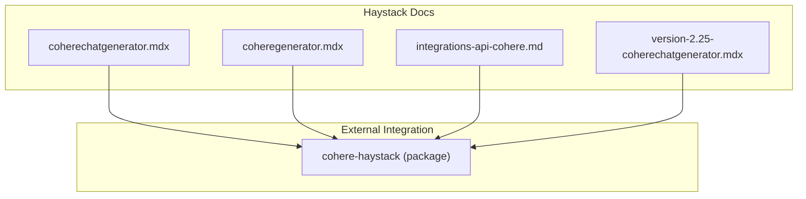
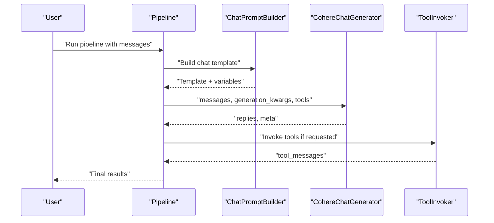
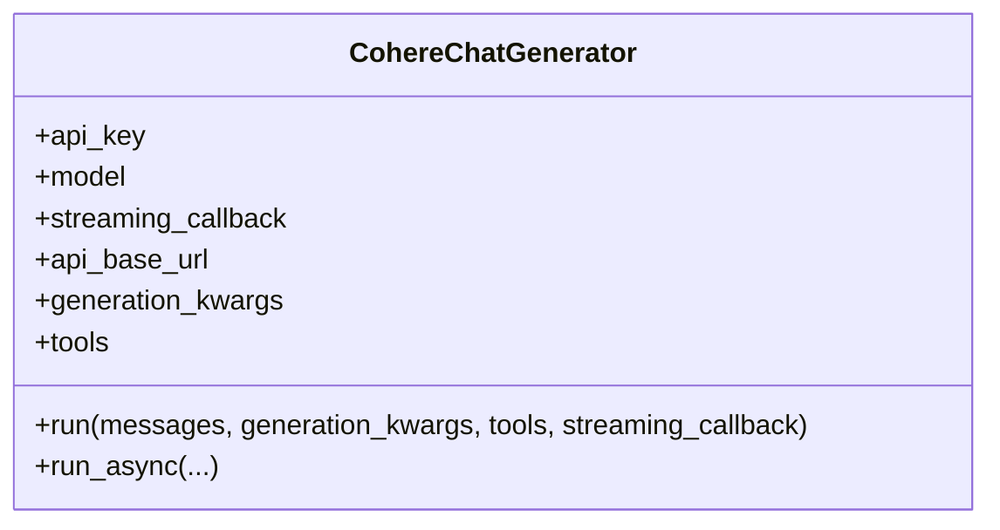
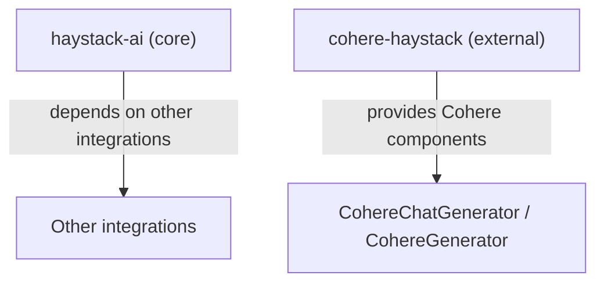

# Cohere Integration

<cite>
**Referenced Files in This Document**
- [coherechatgenerator.mdx](file://docs-website/docs/pipeline-components/generators/coherechatgenerator.mdx)
- [coheregenerator.mdx](file://docs-website/docs/pipeline-components/generators/coheregenerator.mdx)
- [integrations-api-cohere.md](file://docs-website/reference/integrations-api/cohere.md)
- [version-2.25-coherechatgenerator.mdx](file://docs-website/versioned_docs/version-2.25/pipeline-components/generators/coherechatgenerator.mdx)
- [pyproject.toml](file://pyproject.toml)
</cite>

## Table of Contents
1. [Introduction](#introduction)
2. [Project Structure](#project-structure)
3. [Core Components](#core-components)
4. [Architecture Overview](#architecture-overview)
5. [Detailed Component Analysis](#detailed-component-analysis)
6. [Dependency Analysis](#dependency-analysis)
7. [Performance Considerations](#performance-considerations)
8. [Troubleshooting Guide](#troubleshooting-guide)
9. [Conclusion](#conclusion)

## Introduction
This document explains how to integrate Cohere models into Haystack using the CohereChatGenerator and CohereGenerator components. It covers authentication via API key, model selection, parameter configuration, and Cohere-specific features such as citation quality, multimodal inputs, tool/function calling, streaming, and chat history management. Practical examples demonstrate configuring models, handling citations, building conversational flows, and optimizing costs. Guidance is included for error handling, rate limiting, and leveraging Cohere strengths in summarization and retrieval-augmented generation (RAG).

## Project Structure
The Cohere integration is distributed across:
- Component documentation pages under docs-website/docs/pipeline-components/generators
- Versioned documentation for historical context
- API reference documentation under docs-website/reference
- The core repository dependencies (external integration packages are referenced for installation)

**Diagram sources**
- [coherechatgenerator.mdx](file://docs-website/docs/pipeline-components/generators/coherechatgenerator.mdx#L1-L145)
- [coheregenerator.mdx](file://docs-website/docs/pipeline-components/generators/coheregenerator.mdx#L1-L122)
- [integrations-api-cohere.md](file://docs-website/reference/integrations-api/cohere.md#L540-L803)
- [version-2.25-coherechatgenerator.mdx](file://docs-website/versioned_docs/version-2.25/pipeline-components/generators/coherechatgenerator.mdx#L84-L127)

**Section sources**
- [coherechatgenerator.mdx](file://docs-website/docs/pipeline-components/generators/coherechatgenerator.mdx#L1-L145)
- [coheregenerator.mdx](file://docs-website/docs/pipeline-components/generators/coheregenerator.mdx#L1-L122)
- [integrations-api-cohere.md](file://docs-website/reference/integrations-api/cohere.md#L540-L803)
- [version-2.25-coherechatgenerator.mdx](file://docs-website/versioned_docs/version-2.25/pipeline-components/generators/coherechatgenerator.mdx#L84-L127)

## Core Components
- CohereChatGenerator
  - Purpose: Chat completions using Cohere chat models (supports text-only and multimodal inputs).
  - Authentication: API key via environment variable or constructor parameter.
  - Parameters: Model selection, streaming callback, base URL, generation kwargs, tools/function calling.
  - Outputs: Replies as ChatMessage objects and metadata.
  - Multimodal support: Images via ImageContent with compatible models.
  - Tool/function calling: Accepts Tool and Toolset objects for seamless invocation.
  - Streaming: Token streaming via a callback function.
- CohereGenerator
  - Purpose: Text generation using Cohere models (legacy generate endpoint; now a compatibility wrapper around CohereChatGenerator).

Key configuration highlights:
- API key: Provided via environment variables or constructor.
- Model selection: Choose from supported Cohere chat models.
- Generation kwargs: Forward-compatible with Cohere chat endpoint parameters.
- Citation quality: Configure citation accuracy vs. speed trade-offs.
- Tools: Enable function calling with Tool and Toolset objects.

**Section sources**
- [coherechatgenerator.mdx](file://docs-website/docs/pipeline-components/generators/coherechatgenerator.mdx#L10-L70)
- [integrations-api-cohere.md](file://docs-website/reference/integrations-api/cohere.md#L540-L780)
- [coheregenerator.mdx](file://docs-website/docs/pipeline-components/generators/coheregenerator.mdx#L8-L40)

## Architecture Overview
The Cohere integration plugs into Haystack pipelines as a generator component. It can be used standalone or within a pipeline that includes prompt building, retrieval, and other components. CohereChatGenerator supports:
- Chat history via ChatMessage lists
- Tool/function calling through Tool and Toolset
- Streaming responses
- Multimodal inputs (text + images)

**Diagram sources**
- [coherechatgenerator.mdx](file://docs-website/docs/pipeline-components/generators/coherechatgenerator.mdx#L90-L145)
- [integrations-api-cohere.md](file://docs-website/reference/integrations-api/cohere.md#L596-L642)

**Section sources**
- [coherechatgenerator.mdx](file://docs-website/docs/pipeline-components/generators/coherechatgenerator.mdx#L90-L145)
- [integrations-api-cohere.md](file://docs-website/reference/integrations-api/cohere.md#L596-L642)

## Detailed Component Analysis

### CohereChatGenerator
- Authentication
  - Environment variables: COHERE_API_KEY or CO_API_KEY recommended.
  - Constructor parameter: api_key via Secret API.
- Model selection
  - Default model configured; choose from Cohere chat models.
- Parameters
  - generation_kwargs: Forwarded to Cohere chat endpoint (e.g., temperature, max_tokens, system_message, citation_quality).
  - tools: Tool and Toolset objects for function calling.
  - streaming_callback: Stream tokens during generation.
  - api_base_url: Override base URL if needed.
- Multimodal inputs
  - Use ImageContent with compatible models (e.g., command-a-vision-*).
- Chat history
  - Build a list of ChatMessage objects (user, assistant, system) to maintain conversation context.
- Tool/function calling
  - Supports Tool and Toolset objects; integrates with ToolInvoker in pipelines.

**Diagram sources**
- [integrations-api-cohere.md](file://docs-website/reference/integrations-api/cohere.md#L644-L780)

**Section sources**
- [coherechatgenerator.mdx](file://docs-website/docs/pipeline-components/generators/coherechatgenerator.mdx#L10-L70)
- [integrations-api-cohere.md](file://docs-website/reference/integrations-api/cohere.md#L644-L780)

### CohereGenerator (Legacy Wrapper)
- Purpose: Backward compatibility wrapper around CohereChatGenerator for legacy prompts.
- Behavior: Delegates to CohereChatGenerator internally.

**Section sources**
- [coheregenerator.mdx](file://docs-website/docs/pipeline-components/generators/coheregenerator.mdx#L8-L40)
- [integrations-api-cohere.md](file://docs-website/reference/integrations-api/cohere.md#L781-L803)

### Parameter Configuration
Common generation kwargs supported by Cohere chat endpoint:
- temperature: Controls randomness; lower means less random.
- max_tokens: Maximum number of tokens to generate.
- system_message: Initial system message to guide model behavior.
- citation_quality: Choose between accurate and fast citation generation.
- tools: Function definitions for tool/function calling.

These parameters can be passed at initialization or at runtime via generation_kwargs.

**Section sources**
- [integrations-api-cohere.md](file://docs-website/reference/integrations-api/cohere.md#L669-L682)

### Practical Examples

- Standalone usage
  - Initialize CohereChatGenerator with api_key and run with a list of ChatMessage objects.
  - Reference: [coherechatgenerator.mdx](file://docs-website/docs/pipeline-components/generators/coherechatgenerator.mdx#L79-L88)

- Multimodal inputs
  - Use ImageContent with a compatible model to process text and images.
  - Reference: [coherechatgenerator.mdx](file://docs-website/docs/pipeline-components/generators/coherechatgenerator.mdx#L90-L108)

- In a pipeline
  - Combine ChatPromptBuilder and CohereChatGenerator; optionally connect ToolInvoker for tool/function calling.
  - Reference: [coherechatgenerator.mdx](file://docs-website/docs/pipeline-components/generators/coherechatgenerator.mdx#L110-L145)

- Tool/function calling
  - Define Tool(s) and Toolset(s), pass to CohereChatGenerator, and wire ToolInvoker in the pipeline.
  - Reference: [integrations-api-cohere.md](file://docs-website/reference/integrations-api/cohere.md#L596-L642)

**Section sources**
- [coherechatgenerator.mdx](file://docs-website/docs/pipeline-components/generators/coherechatgenerator.mdx#L79-L145)
- [integrations-api-cohere.md](file://docs-website/reference/integrations-api/cohere.md#L596-L642)

### Cohere-Specific Features
- Citation attribution
  - Configure citation_quality to balance accuracy and speed.
  - Reference: [integrations-api-cohere.md](file://docs-website/reference/integrations-api/cohere.md#L675-L677)
- Summarization modes
  - Use system_message and generation kwargs to steer summaries.
  - Reference: [integrations-api-cohere.md](file://docs-website/reference/integrations-api/cohere.md#L674-L677)
- Conversational AI
  - Maintain chat history via ChatMessage lists; leverage system_message for role and persona.
  - Reference: [coherechatgenerator.mdx](file://docs-website/docs/pipeline-components/generators/coherechatgenerator.mdx#L10-L35)
- Search and retrieval
  - While CohereChatGenerator does not directly expose a search API, it integrates naturally with Haystack retrieval components in pipelines.
  - Reference: [coherechatgenerator.mdx](file://docs-website/docs/pipeline-components/generators/coherechatgenerator.mdx#L110-L145)
- Response quality controls
  - temperature, max_tokens, and system_message influence response quality and behavior.
  - Reference: [integrations-api-cohere.md](file://docs-website/reference/integrations-api/cohere.md#L678-L679)

**Section sources**
- [integrations-api-cohere.md](file://docs-website/reference/integrations-api/cohere.md#L674-L679)
- [coherechatgenerator.mdx](file://docs-website/docs/pipeline-components/generators/coherechatgenerator.mdx#L10-L35)

## Dependency Analysis
- External integration package
  - The Cohere integration is distributed as an external package named cohere-haystack. Install it to use CohereChatGenerator and CohereGenerator.
  - References:
    - [coherechatgenerator.mdx](file://docs-website/docs/pipeline-components/generators/coherechatgenerator.mdx#L73-L77)
    - [coheregenerator.mdx](file://docs-website/docs/pipeline-components/generators/coheregenerator.mdx#L42-L46)
- Core repository dependencies
  - The core haystack-ai package depends on other integrations and libraries but does not include Cohere integration by default.
  - Reference: [pyproject.toml](file://pyproject.toml#L43-L62)

**Diagram sources**
- [pyproject.toml](file://pyproject.toml#L43-L62)
- [coherechatgenerator.mdx](file://docs-website/docs/pipeline-components/generators/coherechatgenerator.mdx#L73-L77)
- [coheregenerator.mdx](file://docs-website/docs/pipeline-components/generators/coheregenerator.mdx#L42-L46)

**Section sources**
- [pyproject.toml](file://pyproject.toml#L43-L62)
- [coherechatgenerator.mdx](file://docs-website/docs/pipeline-components/generators/coherechatgenerator.mdx#L73-L77)
- [coheregenerator.mdx](file://docs-website/docs/pipeline-components/generators/coheregenerator.mdx#L42-L46)

## Performance Considerations
- Streaming
  - Use streaming_callback to receive tokens incrementally, reducing perceived latency.
  - Reference: [coherechatgenerator.mdx](file://docs-website/docs/pipeline-components/generators/coherechatgenerator.mdx#L67-L70)
- Temperature and max_tokens
  - Tune temperature for determinism vs. creativity; cap max_tokens to control output length and cost.
  - Reference: [integrations-api-cohere.md](file://docs-website/reference/integrations-api/cohere.md#L678-L679)
- Tool/function calling overhead
  - Tool preparation and invocation add latency; batch tool calls when possible and minimize tool complexity.
  - Reference: [integrations-api-cohere.md](file://docs-website/reference/integrations-api/cohere.md#L680-L681)
- Cost optimization
  - Prefer smaller models for simple tasks; reduce max_tokens; use citation_quality "fast" when accuracy is not critical.
  - Reference: [integrations-api-cohere.md](file://docs-website/reference/integrations-api/cohere.md#L675-L677)

[No sources needed since this section provides general guidance]

## Troubleshooting Guide
- Authentication failures
  - Ensure COHERE_API_KEY or CO_API_KEY environment variables are set, or pass api_key via Secret at initialization.
  - Reference: [coherechatgenerator.mdx](file://docs-website/docs/pipeline-components/generators/coherechatgenerator.mdx#L29-L34)
- Rate limiting and quota issues
  - Reduce request frequency, increase delays between requests, or upgrade your plan.
  - Reference: [integrations-api-cohere.md](file://docs-website/reference/integrations-api/cohere.md#L668-L669)
- Tool/function calling errors
  - Verify tool definitions and parameter schemas; ensure ToolInvoker is connected in the pipeline.
  - Reference: [integrations-api-cohere.md](file://docs-website/reference/integrations-api/cohere.md#L596-L642)
- Multimodal input limits
  - Respect image format and quantity limits; ensure model supports vision.
  - Reference: [integrations-api-cohere.md](file://docs-website/reference/integrations-api/cohere.md#L550-L555)

**Section sources**
- [coherechatgenerator.mdx](file://docs-website/docs/pipeline-components/generators/coherechatgenerator.mdx#L29-L34)
- [integrations-api-cohere.md](file://docs-website/reference/integrations-api/cohere.md#L550-L555)
- [integrations-api-cohere.md](file://docs-website/reference/integrations-api/cohere.md#L596-L642)

## Conclusion
Cohere integration in Haystack centers on CohereChatGenerator for chat and multimodal tasks, with CohereGenerator serving as a compatibility wrapper. By configuring API keys, selecting appropriate models, and tuning generation parameters like temperature and max_tokens, you can build efficient conversational flows. Cohere’s citation quality, tool/function calling, and streaming capabilities enhance RAG and interactive experiences. Apply the provided examples and best practices to optimize performance, manage costs, and troubleshoot common issues.