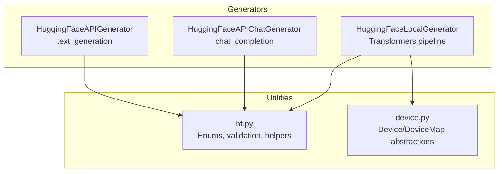
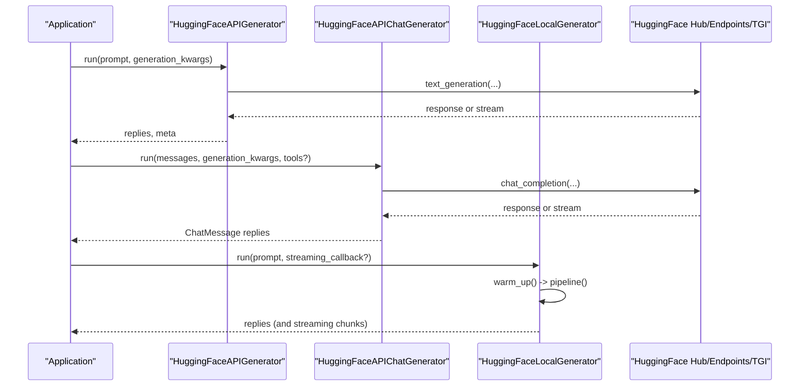
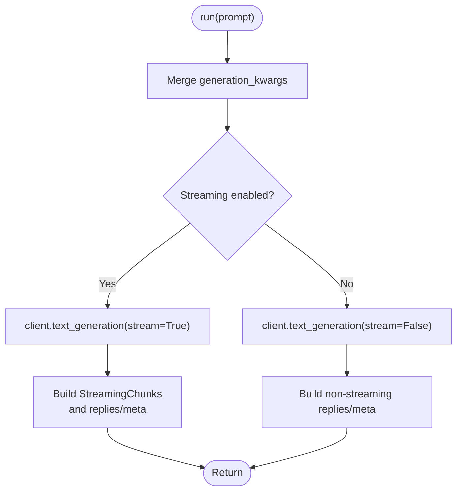
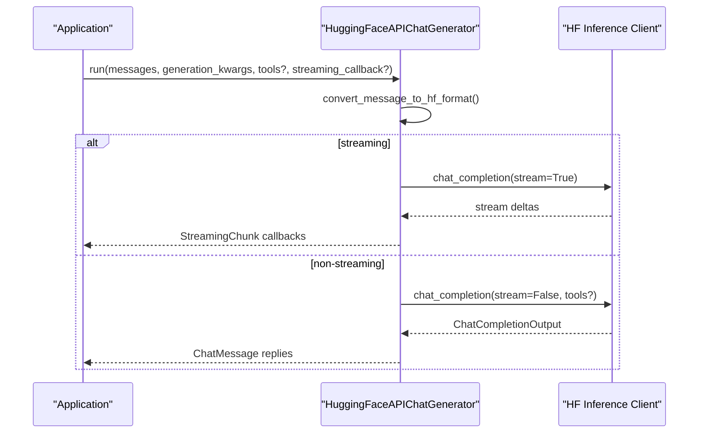
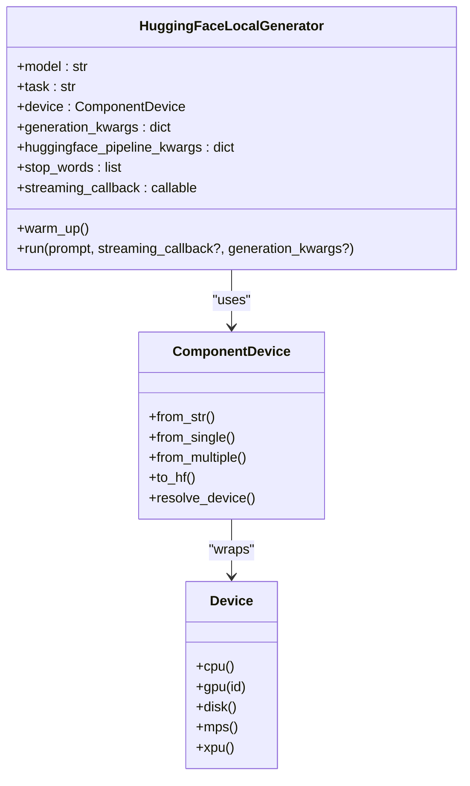
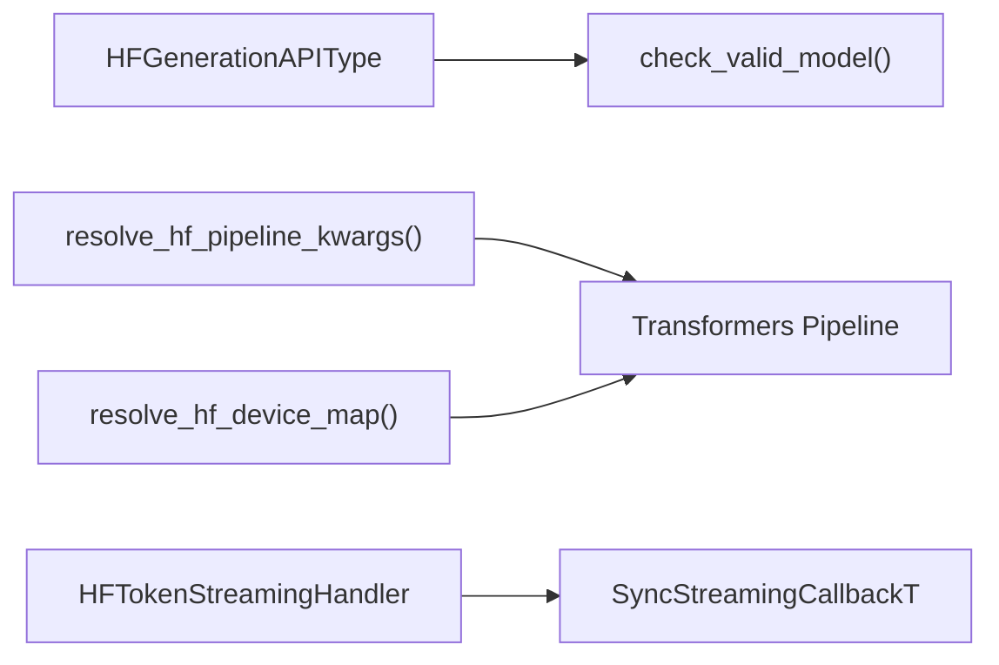

# Hugging Face Integration

<cite>
**Referenced Files in This Document**
- [hugging_face_api.py](file://haystack/components/generators/hugging_face_api.py)
- [hugging_face_api.py](file://haystack/components/generators/chat/hugging_face_api.py)
- [hugging_face_local.py](file://haystack/components/generators/hugging_face_local.py)
- [hf.py](file://haystack/utils/hf.py)
- [device.py](file://haystack/utils/device.py)
- [test_hugging_face_api.py](file://test/components/generators/test_hugging_face_api.py)
- [huggingfaceapichatgenerator.mdx](file://docs-website/docs/pipeline-components/generators/huggingfaceapichatgenerator.mdx)
- [choosing-the-right-generator.mdx](file://docs-website/docs/pipeline-components/generators/guides-to-generators/choosing-the-right-generator.mdx)
</cite>

## Table of Contents
1. [Introduction](#introduction)
2. [Project Structure](#project-structure)
3. [Core Components](#core-components)
4. [Architecture Overview](#architecture-overview)
5. [Detailed Component Analysis](#detailed-component-analysis)
6. [Dependency Analysis](#dependency-analysis)
7. [Performance Considerations](#performance-considerations)
8. [Troubleshooting Guide](#troubleshooting-guide)
9. [Conclusion](#conclusion)
10. [Appendices](#appendices)

## Introduction
This document explains how Haystack integrates with Hugging Face for both hosted inference and local model deployment. It covers:
- Hosted inference via Hugging Face APIs (including Inference Endpoints, self-hosted Text Generation Inference, and Serverless Inference Providers)
- Local model deployment with Transformers pipelines
- Authentication, model selection, request configuration, streaming, device management, and memory optimization
- Practical guidance for popular models (Llama, Mistral, Falcon) and considerations for quantization and GPU acceleration
- Cost considerations and troubleshooting tips

## Project Structure
Haystack’s Hugging Face integration centers around three main components:
- HuggingFaceAPIGenerator: Hosted inference for text generation
- HuggingFaceAPIChatGenerator: Hosted inference for chat/completions
- HuggingFaceLocalGenerator: Local inference using Transformers pipelines

Supporting utilities:
- hf.py: API type enums, model validation, pipeline/device resolution helpers, streaming handlers
- device.py: Framework-agnostic device management for multi-device and accelerator backends

**Diagram sources**
- [hugging_face_api.py](file://haystack/components/generators/hugging_face_api.py#L36-L94)
- [hugging_face_api.py](file://haystack/components/generators/chat/hugging_face_api.py#L215-L311)
- [hugging_face_local.py](file://haystack/components/generators/hugging_face_local.py#L24-L45)
- [hf.py](file://haystack/utils/hf.py#L35-L100)
- [device.py](file://haystack/utils/device.py#L19-L544)

**Section sources**
- [hugging_face_api.py](file://haystack/components/generators/hugging_face_api.py#L36-L94)
- [hugging_face_api.py](file://haystack/components/generators/chat/hugging_face_api.py#L215-L311)
- [hugging_face_local.py](file://haystack/components/generators/hugging_face_local.py#L24-L45)
- [hf.py](file://haystack/utils/hf.py#L35-L100)
- [device.py](file://haystack/utils/device.py#L19-L544)

## Core Components
- HuggingFaceAPIGenerator
  - Supports hosted inference via Inference Endpoints, self-hosted TGI, and Serverless Inference Providers
  - Accepts generation kwargs and stop sequences; streaming supported
  - Validates model availability and type when using Serverless
- HuggingFaceAPIChatGenerator
  - Uses chat/completions interface; supports multimodal inputs (text + image)
  - Tool/function calling support with validation and conversion helpers
  - Streaming and non-streaming modes; async variants available
- HuggingFaceLocalGenerator
  - Loads models via Transformers pipelines; supports device selection and stop words
  - Streaming via HFTokenStreamingHandler; integrates with Haystack streaming callbacks
  - Serialization/deserialization of model kwargs and streaming callbacks

Key capabilities:
- Authentication via HF token (via Secret)
- Model selection from Hub with validation
- Request configuration via generation kwargs
- Streaming responses for both hosted and local
- Device management and multi-device maps for local deployment

**Section sources**
- [hugging_face_api.py](file://haystack/components/generators/hugging_face_api.py#L36-L94)
- [hugging_face_api.py](file://haystack/components/generators/chat/hugging_face_api.py#L215-L311)
- [hugging_face_local.py](file://haystack/components/generators/hugging_face_local.py#L24-L45)
- [hf.py](file://haystack/utils/hf.py#L222-L255)
- [device.py](file://haystack/utils/device.py#L246-L453)

## Architecture Overview
High-level flow for hosted and local inference:

**Diagram sources**
- [hugging_face_api.py](file://haystack/components/generators/hugging_face_api.py#L210-L250)
- [hugging_face_api.py](file://haystack/components/generators/chat/hugging_face_api.py#L452-L501)
- [hugging_face_local.py](file://haystack/components/generators/hugging_face_local.py#L138-L162)

## Detailed Component Analysis

### HuggingFaceAPIGenerator (Hosted Text Generation)
- Purpose: Invoke hosted text generation via Hugging Face APIs
- Supported API types: Inference Endpoints, Text Generation Inference (self-hosted), Serverless Inference API
- Authentication: Secret token; supports HF_API_TOKEN/HF_TOKEN env vars
- Validation: For Serverless, validates model existence and generation task
- Generation kwargs: merged defaults and runtime args; supports stop_sequences and max_new_tokens
- Streaming: Iterates over streamed tokens; builds final replies and metadata

**Diagram sources**
- [hugging_face_api.py](file://haystack/components/generators/hugging_face_api.py#L210-L250)
- [hugging_face_api.py](file://haystack/components/generators/hugging_face_api.py#L251-L302)

**Section sources**
- [hugging_face_api.py](file://haystack/components/generators/hugging_face_api.py#L36-L94)
- [hugging_face_api.py](file://haystack/components/generators/hugging_face_api.py#L96-L176)
- [hugging_face_api.py](file://haystack/components/generators/hugging_face_api.py#L210-L302)
- [test_hugging_face_api.py](file://test/components/generators/test_hugging_face_api.py#L50-L139)

### HuggingFaceAPIChatGenerator (Hosted Chat/Completions)
- Purpose: Chat/completions with hosted models; supports multimodal inputs and tools
- API types: Inference Endpoints, TGI, Serverless Inference Providers
- Authentication: Secret token; model validation for Serverless
- Tools: Converts Haystack tools to HF API tool definitions; handles tool call parsing
- Streaming: Streams deltas; converts to Haystack StreamingChunk; assembles ChatMessage
- Non-streaming: Builds ChatMessage with content/tool_calls/reasoning/usage

**Diagram sources**
- [hugging_face_api.py](file://haystack/components/generators/chat/hugging_face_api.py#L452-L501)
- [hugging_face_api.py](file://haystack/components/generators/chat/hugging_face_api.py#L555-L581)
- [hugging_face_api.py](file://haystack/components/generators/chat/hugging_face_api.py#L583-L624)

**Section sources**
- [hugging_face_api.py](file://haystack/components/generators/chat/hugging_face_api.py#L215-L311)
- [hugging_face_api.py](file://haystack/components/generators/chat/hugging_face_api.py#L313-L410)
- [hugging_face_api.py](file://haystack/components/generators/chat/hugging_face_api.py#L452-L692)

### HuggingFaceLocalGenerator (Local Deployment)
- Purpose: Run LLMs locally using Transformers pipelines
- Device management: ComponentDevice and DeviceMap support single/multi-device; resolves to HF device/device_map
- Pipeline kwargs: resolve_hf_pipeline_kwargs sets model/task/token/device; validates task against supported tasks
- Stop words: optional; integrated via StoppingCriteriaList
- Streaming: HFTokenStreamingHandler adapts HF streamer to Haystack callbacks
- Serialization: model kwargs and streaming callback are serialized/deserialized safely

**Diagram sources**
- [hugging_face_local.py](file://haystack/components/generators/hugging_face_local.py#L24-L123)
- [device.py](file://haystack/utils/device.py#L246-L453)

**Section sources**
- [hugging_face_local.py](file://haystack/components/generators/hugging_face_local.py#L24-L123)
- [hugging_face_local.py](file://haystack/components/generators/hugging_face_local.py#L138-L162)
- [hugging_face_local.py](file://haystack/components/generators/hugging_face_local.py#L200-L265)
- [hf.py](file://haystack/utils/hf.py#L144-L175)
- [device.py](file://haystack/utils/device.py#L19-L544)

## Dependency Analysis
- API type enums and validation
  - HFGenerationAPIType and HFEmbeddingAPIType enumerate supported API modes
  - check_valid_model ensures model exists and matches expected pipeline_tag
- Pipeline and device resolution
  - resolve_hf_pipeline_kwargs infers/validates task and injects device/token
  - resolve_hf_device_map updates model_kwargs with device_map for multi-device/quantized loading
- Streaming adapters
  - HFTokenStreamingHandler bridges HF TextStreamer to Haystack streaming callbacks

**Diagram sources**
- [hf.py](file://haystack/utils/hf.py#L35-L99)
- [hf.py](file://haystack/utils/hf.py#L222-L255)
- [hf.py](file://haystack/utils/hf.py#L178-L219)
- [hf.py](file://haystack/utils/hf.py#L144-L175)
- [hf.py](file://haystack/utils/hf.py#L383-L455)

**Section sources**
- [hf.py](file://haystack/utils/hf.py#L35-L99)
- [hf.py](file://haystack/utils/hf.py#L144-L175)
- [hf.py](file://haystack/utils/hf.py#L178-L219)
- [hf.py](file://haystack/utils/hf.py#L222-L255)
- [hf.py](file://haystack/utils/hf.py#L383-L455)

## Performance Considerations
- Device and multi-device inference
  - Use ComponentDevice and DeviceMap to distribute model layers across GPUs or offload to disk
  - resolve_hf_device_map injects device_map/device into model kwargs for accelerated/multi-device loading
- Quantization and memory optimization
  - device_map enables quantized loading and offloading; leverage accelerate with device_map
  - Prefer smaller models or quantized variants for constrained environments
- Streaming
  - Enable streaming for both hosted and local to reduce latency and improve UX
  - For local, streaming_callback requires single response (num_return_sequences=1)
- Generation parameters
  - Tune max_new_tokens, temperature, top_k, top_p; defaults set to conservative values
  - Use stop_sequences or stop_words to prevent unnecessary token generation
- GPU acceleration
  - Auto-selection prefers CUDA; fallback to XPU/MPS/CPU depending on environment
  - For local, ensure torch with CUDA/XPU/MPS support is installed

**Section sources**
- [device.py](file://haystack/utils/device.py#L486-L522)
- [hf.py](file://haystack/utils/hf.py#L144-L175)
- [hugging_face_local.py](file://haystack/components/generators/hugging_face_local.py#L240-L248)

## Troubleshooting Guide
Common issues and resolutions:
- Authentication failures
  - Ensure HF token is configured via Secret and env vars HF_API_TOKEN/HF_TOKEN
  - Verify token permissions for the requested model
- Invalid model or unsupported task
  - For Serverless, check_valid_model raises errors for invalid or mismatched models
  - For hosted, confirm the model supports the selected endpoint type
- Invalid URL or endpoint misconfiguration
  - Inference Endpoints/TGI require a valid HTTP(S) URL
- Streaming conflicts
  - Local streaming requires single response; adjust num_return_sequences
  - Tools and streaming are mutually exclusive in chat generator
- Memory and OOM errors
  - Reduce max_new_tokens, enable device_map for multi-device/offload
  - Use quantized models or smaller model sizes
- Serialization issues
  - Streaming callback and model kwargs are serialized; ensure callbacks are serializable

**Section sources**
- [hugging_face_api.py](file://haystack/components/generators/hugging_face_api.py#L134-L163)
- [hugging_face_api.py](file://haystack/components/generators/chat/hugging_face_api.py#L362-L387)
- [hugging_face_local.py](file://haystack/components/generators/hugging_face_local.py#L240-L248)
- [test_hugging_face_api.py](file://test/components/generators/test_hugging_face_api.py#L50-L118)

## Conclusion
Haystack provides robust, production-ready integration with Hugging Face for both hosted and local inference. With unified device management, streaming support, and validated model selection, developers can deploy scalable LLM applications. Choose hosted inference for ease and scalability, and local deployment for privacy and control. Properly tune generation parameters, leverage device maps for memory optimization, and adopt streaming for responsive user experiences.

## Appendices

### Practical Examples and Patterns
- Hosted inference with HuggingFaceAPIChatGenerator
  - Serverless Inference Providers (free tier available)
  - Paid Inference Endpoints
  - Self-hosted TGI
  - Multimodal inputs (text + image)
- Local deployment with HuggingFaceLocalGenerator
  - Model selection and device assignment
  - Stop words and streaming
  - Serialization/deserialization of model kwargs and callbacks

See usage examples and guidance in:
- [HuggingFaceAPIChatGenerator docs](file://docs-website/docs/pipeline-components/generators/huggingfaceapichatgenerator.mdx#L103-L146)
- [Choosing the right generator](file://docs-website/docs/pipeline-components/generators/guides-to-generators/choosing-the-right-generator.mdx#L137-L165)

**Section sources**
- [huggingfaceapichatgenerator.mdx](file://docs-website/docs/pipeline-components/generators/huggingfaceapichatgenerator.mdx#L103-L146)
- [choosing-the-right-generator.mdx](file://docs-website/docs/pipeline-components/generators/guides-to-generators/choosing-the-right-generator.mdx#L137-L165)

### Parameter Reference
- Generation kwargs (hosted)
  - max_new_tokens, temperature, top_k, top_p, stop_sequences
  - Refer to [HuggingFaceAPIGenerator](file://haystack/components/generators/hugging_face_api.py#L123-L127)
- Generation kwargs (chat/hosted)
  - max_tokens, temperature, top_p, stop
  - Refer to [HuggingFaceAPIChatGenerator](file://haystack/components/generators/chat/hugging_face_api.py#L342-L345)
- Generation kwargs (local)
  - max_length, max_new_tokens, temperature, top_k, top_p, return_full_text (default adjusted)
  - Refer to [HuggingFaceLocalGenerator](file://haystack/components/generators/hugging_face_local.py#L72-L76)
- Device management
  - ComponentDevice, Device, DeviceMap; automatic selection and multi-device maps
  - Refer to [device.py](file://haystack/utils/device.py#L246-L453)

**Section sources**
- [hugging_face_api.py](file://haystack/components/generators/hugging_face_api.py#L123-L127)
- [hugging_face_api.py](file://haystack/components/generators/chat/hugging_face_api.py#L342-L345)
- [hugging_face_local.py](file://haystack/components/generators/hugging_face_local.py#L72-L76)
- [device.py](file://haystack/utils/device.py#L246-L453)

### Cost Considerations
- Shared hosted models (free tiers available)
  - Serverless Inference Providers offer free tiers; suitable for experimentation and light usage
- Privately hosted models
  - Inference Endpoints/TGI instances billed hourly; predictable costs with dedicated resources
- Local deployment
  - No per-request cost; requires infrastructure and maintenance; cost depends on hardware and power

For detailed comparison and guidance, refer to:
- [Choosing the right generator](file://docs-website/docs/pipeline-components/generators/guides-to-generators/choosing-the-right-generator.mdx#L137-L165)

**Section sources**
- [choosing-the-right-generator.mdx](file://docs-website/docs/pipeline-components/generators/guides-to-generators/choosing-the-right-generator.mdx#L137-L165)