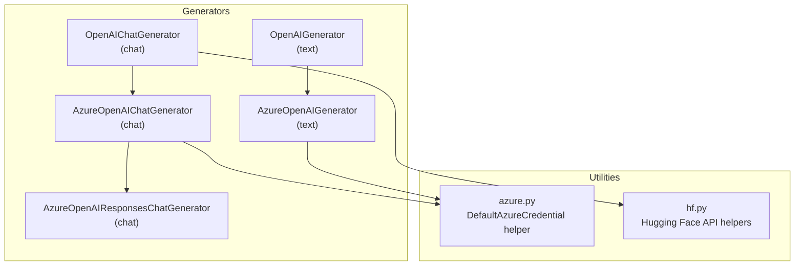
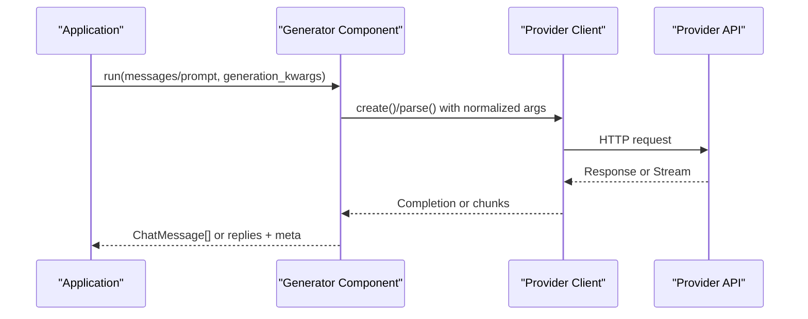
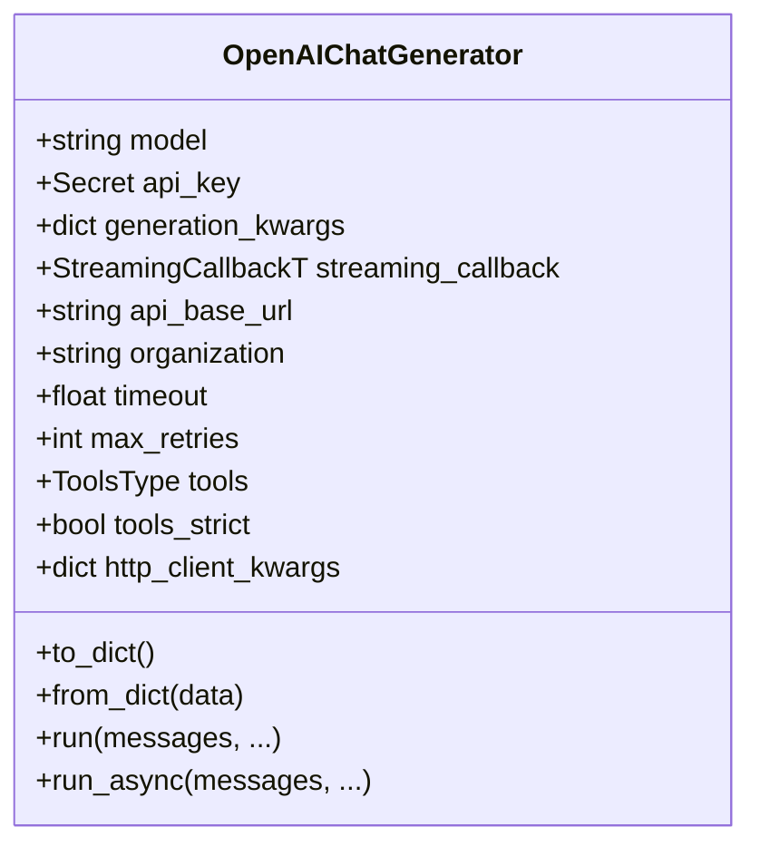
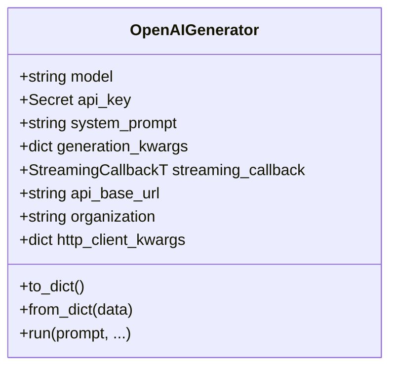
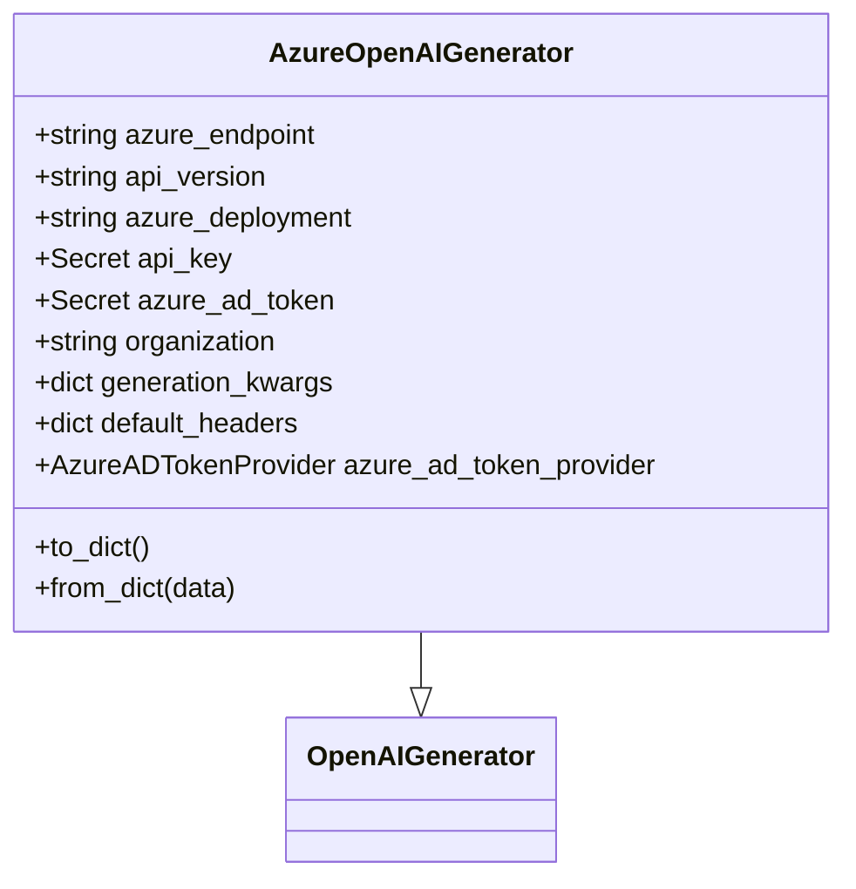
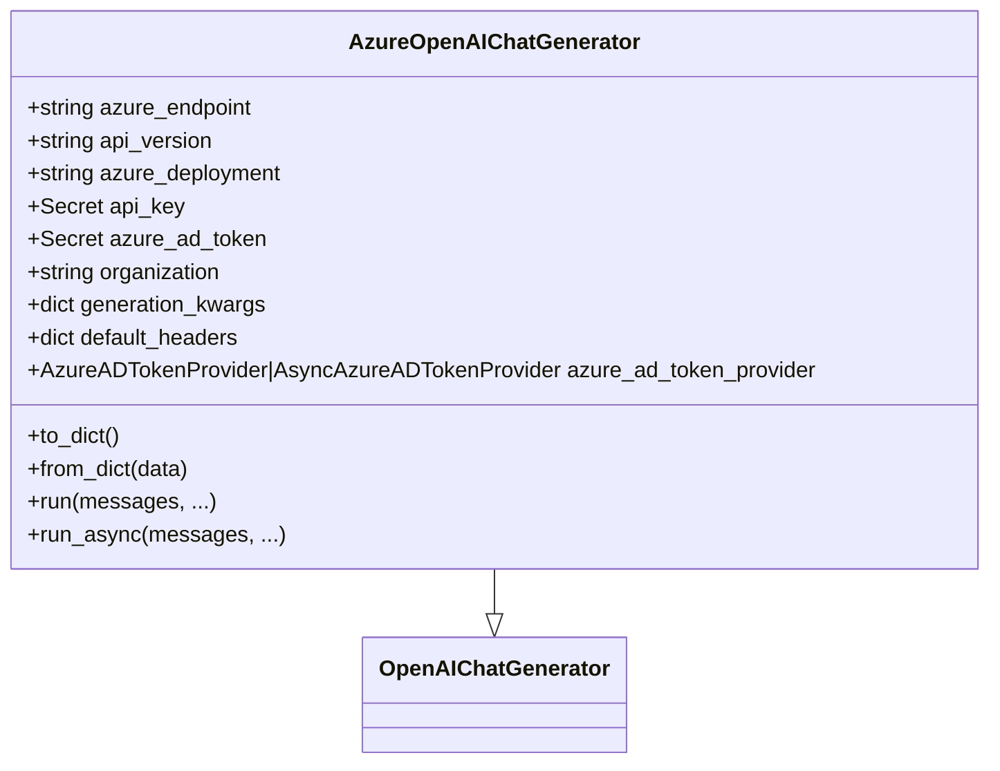
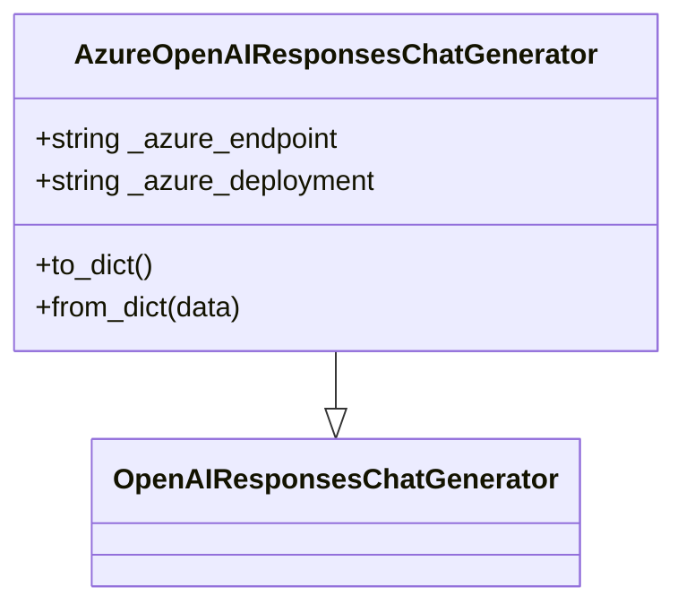
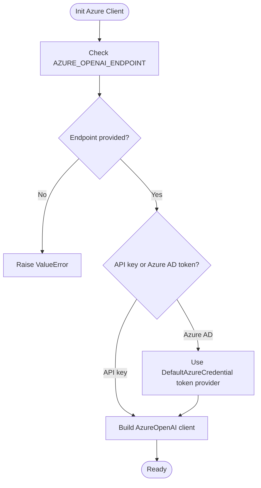
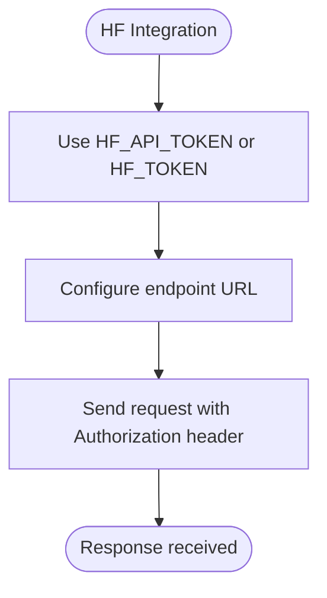

# LLM Provider Integrations

<cite>
**Referenced Files in This Document**
- [openai.py](file://haystack/components/generators/chat/openai.py)
- [openai.py](file://haystack/components/generators/openai.py)
- [azure.py](file://haystack/components/generators/azure.py)
- [azure.py](file://haystack/components/generators/chat/azure.py)
- [azure_responses.py](file://haystack/components/generators/chat/azure_responses.py)
- [azure.py](file://haystack/utils/azure.py)
- [hf.py](file://haystack/utils/hf.py)
</cite>

## Table of Contents
1. [Introduction](#introduction)
2. [Project Structure](#project-structure)
3. [Core Components](#core-components)
4. [Architecture Overview](#architecture-overview)
5. [Detailed Component Analysis](#detailed-component-analysis)
6. [Dependency Analysis](#dependency-analysis)
7. [Performance Considerations](#performance-considerations)
8. [Troubleshooting Guide](#troubleshooting-guide)
9. [Conclusion](#conclusion)
10. [Appendices](#appendices)

## Introduction
This document explains how Haystack integrates with major LLM providers via dedicated generator components. It covers:
- OpenAI ChatGenerator and Generator for chat and text generation
- Azure OpenAI Services for both standard and Responses APIs
- Authentication, model selection, and parameter configuration
- Structured outputs, tool calling, and streaming
- Practical configuration examples and migration tips between providers

## Project Structure
Haystack organizes provider integrations under components/generators and related utilities:
- Chat and text generators for OpenAI and Azure OpenAI
- Utilities for Azure authentication and Hugging Face API token handling



**Diagram sources**
- [openai.py](file://haystack/components/generators/chat/openai.py#L54-L725)
- [openai.py](file://haystack/components/generators/openai.py#L32-L271)
- [azure.py](file://haystack/components/generators/azure.py#L18-L216)
- [azure.py](file://haystack/components/generators/chat/azure.py#L28-L281)
- [azure_responses.py](file://haystack/components/generators/chat/azure_responses.py#L20-L237)
- [azure.py](file://haystack/utils/azure.py#L11-L17)
- [hf.py](file://haystack/utils/hf.py#L1-L200)

**Section sources**
- [openai.py](file://haystack/components/generators/chat/openai.py#L54-L725)
- [openai.py](file://haystack/components/generators/openai.py#L32-L271)
- [azure.py](file://haystack/components/generators/azure.py#L18-L216)
- [azure.py](file://haystack/components/generators/chat/azure.py#L28-L281)
- [azure_responses.py](file://haystack/components/generators/chat/azure_responses.py#L20-L237)
- [azure.py](file://haystack/utils/azure.py#L11-L17)
- [hf.py](file://haystack/utils/hf.py#L1-L200)

## Core Components
- OpenAIChatGenerator: Chat completions with streaming, structured outputs, tool calling, and parsing endpoints.
- OpenAIGenerator: Text completions with streaming and system prompts.
- AzureOpenAIGenerator: Text completions via Azure OpenAI with API key or Azure AD token.
- AzureOpenAIChatGenerator: Chat completions via Azure OpenAI with streaming, structured outputs, and tool calling.
- AzureOpenAIResponsesChatGenerator: Chat via Azure’s OpenAI Responses API with reasoning and structured text formats.

Key capabilities:
- Authentication via API key or Azure AD token/provider
- Model selection and parameter forwarding to provider APIs
- Streaming responses with callbacks
- Structured outputs via JSON schema or Pydantic models
- Tool calling with optional strict schema enforcement

**Section sources**
- [openai.py](file://haystack/components/generators/chat/openai.py#L54-L725)
- [openai.py](file://haystack/components/generators/openai.py#L32-L271)
- [azure.py](file://haystack/components/generators/azure.py#L18-L216)
- [azure.py](file://haystack/components/generators/chat/azure.py#L28-L281)
- [azure_responses.py](file://haystack/components/generators/chat/azure_responses.py#L20-L237)

## Architecture Overview
The integrations share a common pattern:
- Components encapsulate provider clients (OpenAI/AzureOpenAI)
- Inputs are normalized to provider-specific message formats
- Generation kwargs are forwarded to the provider API
- Streaming responses are converted to Haystack StreamingChunk and ChatMessage abstractions
- Structured outputs leverage provider endpoints and schemas



**Diagram sources**
- [openai.py](file://haystack/components/generators/chat/openai.py#L300-L453)
- [openai.py](file://haystack/components/generators/openai.py#L187-L271)
- [azure.py](file://haystack/components/generators/chat/azure.py#L198-L203)

## Detailed Component Analysis

### OpenAI Chat Generator
- Purpose: Chat completions with support for streaming, structured outputs, and tool calling.
- Key features:
  - Model list includes modern GPT series
  - Environment-driven timeouts and retries
  - Structured outputs via parse endpoint (non-streaming) or create endpoint (streaming)
  - Tool calling with optional strict schema
  - Streaming callback integration
- Important parameters:
  - generation_kwargs: temperature, top_p, max_completion_tokens, response_format, tools, tools_strict, stop, presence_penalty, frequency_penalty, logit_bias
  - api_base_url, organization, streaming_callback



**Diagram sources**
- [openai.py](file://haystack/components/generators/chat/openai.py#L117-L225)

**Section sources**
- [openai.py](file://haystack/components/generators/chat/openai.py#L54-L725)

### OpenAI Text Generator
- Purpose: Non-chat text generation with optional system prompt and streaming.
- Key features:
  - Converts prompt to ChatMessage internally
  - Supports streaming via callback
  - Pass-through generation kwargs to provider
- Important parameters:
  - system_prompt, generation_kwargs, api_base_url, organization, streaming_callback



**Diagram sources**
- [openai.py](file://haystack/components/generators/openai.py#L64-L143)

**Section sources**
- [openai.py](file://haystack/components/generators/openai.py#L32-L271)

### Azure OpenAI Text Generator
- Purpose: Text generation via Azure OpenAI with API key or Azure AD token.
- Key features:
  - Requires azure_endpoint and azure_deployment
  - Supports Azure AD token provider
  - Inherits OpenAIGenerator behavior for text generation
- Important parameters:
  - azure_endpoint, api_version, azure_deployment, api_key, azure_ad_token, organization, default_headers, generation_kwargs



**Diagram sources**
- [azure.py](file://haystack/components/generators/azure.py#L57-L165)

**Section sources**
- [azure.py](file://haystack/components/generators/azure.py#L18-L216)

### Azure OpenAI Chat Generator
- Purpose: Chat completions via Azure OpenAI with streaming, structured outputs, and tool calling.
- Key features:
  - Inherits OpenAIChatGenerator behavior
  - Uses AzureOpenAI/AzureAD token provider
  - Supports response_format, tools, tools_strict
- Important parameters:
  - azure_endpoint, api_version, azure_deployment, api_key, azure_ad_token, organization, default_headers, generation_kwargs, tools, tools_strict



**Diagram sources**
- [azure.py](file://haystack/components/generators/chat/azure.py#L74-L204)

**Section sources**
- [azure.py](file://haystack/components/generators/chat/azure.py#L28-L281)

### Azure OpenAI Responses Chat Generator
- Purpose: Chat via Azure’s OpenAI Responses API with reasoning and structured text formats.
- Key features:
  - Builds on OpenAI Responses generator
  - Uses Azure endpoint with fixed base path
  - Supports text_format (Pydantic/JSON schema) and reasoning parameters
- Important parameters:
  - azure_endpoint, azure_deployment, api_key, organization, generation_kwargs (including reasoning), tools, tools_strict



**Diagram sources**
- [azure_responses.py](file://haystack/components/generators/chat/azure_responses.py#L54-L148)

**Section sources**
- [azure_responses.py](file://haystack/components/generators/chat/azure_responses.py#L20-L237)

### Azure Authentication Utilities
- DefaultAzureCredential helper:
  - Provides a bearer token provider using DefaultAzureCredential with the Cognitive Services scope
  - Useful for AzureOpenAIChatGenerator and AzureOpenAIResponsesChatGenerator



**Diagram sources**
- [azure.py](file://haystack/components/generators/chat/azure.py#L158-L163)
- [azure.py](file://haystack/utils/azure.py#L11-L17)

**Section sources**
- [azure.py](file://haystack/utils/azure.py#L11-L17)

### Hugging Face API Integration
- Helpers for Hugging Face API token handling:
  - Environment variable support and flexible naming (HF_API_TOKEN and HF_TOKEN)
  - Utility functions for hosted inference endpoints and token management



**Diagram sources**
- [hf.py](file://haystack/utils/hf.py#L1-L200)

**Section sources**
- [hf.py](file://haystack/utils/hf.py#L1-L200)

## Dependency Analysis
- OpenAI components depend on the official OpenAI SDK and Haystack dataclasses for streaming and messages.
- Azure components depend on AzureOpenAI/AzureAD token providers and optionally DefaultAzureCredential.
- Shared utilities handle HTTP client configuration and serialization.

```mermaid
graph LR
OAI["OpenAI SDK"] <- --> OAI_Chat["OpenAIChatGenerator"]
OAI <- --> OAI_Text["OpenAIGenerator"]
AzureSDK["AzureOpenAI SDK"] <- --> Azure_Chat["AzureOpenAIChatGenerator"]
AzureSDK <- --> Azure_Text["AzureOpenAIGenerator"]
AzureSDK <- --> Azure_Resp["AzureOpenAIResponsesChatGenerator"]
AzureUtils["DefaultAzureCredential helper"] --> AzureSDK
HFUtils["HF token helpers"] --> HFInt["HF Integration"]
```

**Diagram sources**
- [openai.py](file://haystack/components/generators/chat/openai.py#L11-L25)
- [openai.py](file://haystack/components/generators/openai.py#L8-L26)
- [azure.py](file://haystack/components/generators/chat/azure.py#L9-L24)
- [azure.py](file://haystack/utils/azure.py#L7-L16)
- [hf.py](file://haystack/utils/hf.py#L1-L200)

**Section sources**
- [openai.py](file://haystack/components/generators/chat/openai.py#L11-L25)
- [openai.py](file://haystack/components/generators/openai.py#L8-L26)
- [azure.py](file://haystack/components/generators/chat/azure.py#L9-L24)
- [azure.py](file://haystack/utils/azure.py#L7-L16)
- [hf.py](file://haystack/utils/hf.py#L1-L200)

## Performance Considerations
- Streaming reduces latency to first token; ensure callbacks are efficient.
- Use appropriate timeouts and retries via environment variables or constructor parameters.
- Prefer structured outputs with parse endpoint for non-streaming to reduce retries.
- Limit n to 1 when streaming to avoid ambiguous multi-response streams.
- Monitor finish reasons and usage metadata for cost and performance insights.

[No sources needed since this section provides general guidance]

## Troubleshooting Guide
Common issues and resolutions:
- Missing Azure endpoint: Provide azure_endpoint or set AZURE_OPENAI_ENDPOINT.
- Missing credentials: Provide API key or Azure AD token; ensure environment variables are set.
- Streaming with multiple responses: Set n=1 when streaming.
- Malformed tool call arguments: Enable tools_strict to enforce strict schema and improve validity.
- Content filter truncation: Adjust parameters or review content policy warnings.

**Section sources**
- [openai.py](file://haystack/components/generators/chat/openai.py#L553-L566)
- [openai.py](file://haystack/components/generators/chat/openai.py#L470-L471)
- [azure.py](file://haystack/components/generators/azure.py#L129-L133)
- [azure.py](file://haystack/components/generators/chat/azure.py#L159-L163)

## Conclusion
Haystack’s LLM provider integrations offer a consistent interface across OpenAI and Azure OpenAI, supporting chat, text, streaming, structured outputs, and tool calling. Use the appropriate generator class for your provider and deployment, configure authentication securely, and tune generation parameters for performance and cost.

[No sources needed since this section summarizes without analyzing specific files]

## Appendices

### Authentication Methods
- OpenAI
  - API key via environment variable or constructor
  - Optional organization ID and base URL
- Azure OpenAI
  - API key or Azure AD token
  - DefaultAzureCredential token provider via helper utility
  - Azure endpoint and deployment required

**Section sources**
- [openai.py](file://haystack/components/generators/chat/openai.py#L119-L120)
- [openai.py](file://haystack/components/generators/openai.py#L66-L67)
- [azure.py](file://haystack/components/generators/azure.py#L62-L63)
- [azure.py](file://haystack/components/generators/chat/azure.py#L79-L80)
- [azure.py](file://haystack/utils/azure.py#L11-L17)

### Model Selection and Parameters
- Supported models and parameters are configurable via generation_kwargs; consult provider documentation for exact options.
- Structured outputs:
  - response_format accepts JSON schema or Pydantic models (non-streaming parse endpoint)
  - tools and tools_strict enable tool calling with optional strict schema

**Section sources**
- [openai.py](file://haystack/components/generators/chat/openai.py#L97-L115)
- [openai.py](file://haystack/components/generators/chat/openai.py#L151-L177)
- [azure.py](file://haystack/components/generators/chat/azure.py#L129-L138)

### Rate Limiting and Error Handling
- Configure timeouts and retries via environment variables or constructor parameters.
- Finish reason warnings indicate truncation or content filtering; adjust parameters accordingly.
- Streaming tasks can be cancelled safely; ensure proper cleanup.

**Section sources**
- [openai.py](file://haystack/components/generators/chat/openai.py#L178-L183)
- [openai.py](file://haystack/components/generators/openai.py#L111-L116)
- [openai.py](file://haystack/components/generators/chat/openai.py#L543-L548)

### Practical Configuration Examples
- OpenAI ChatGenerator
  - Initialize with model, api_key, generation_kwargs, and optional streaming_callback
  - Use run() for non-streaming or run_async() for async streaming
- AzureOpenAIChatGenerator
  - Provide azure_endpoint and azure_deployment; choose API key or Azure AD token
  - Use run() with messages and optional tools/tool_strict
- AzureOpenAIResponsesChatGenerator
  - Provide azure_endpoint and generation_kwargs including reasoning and text_format
- OpenAIGenerator and AzureOpenAIGenerator
  - Provide system_prompt and generation_kwargs for text generation

**Section sources**
- [openai.py](file://haystack/components/generators/chat/openai.py#L117-L130)
- [openai.py](file://haystack/components/generators/chat/openai.py#L300-L373)
- [openai.py](file://haystack/components/generators/chat/openai.py#L376-L453)
- [azure.py](file://haystack/components/generators/chat/azure.py#L74-L91)
- [azure.py](file://haystack/components/generators/chat/azure.py#L198-L203)
- [azure_responses.py](file://haystack/components/generators/chat/azure_responses.py#L54-L70)
- [openai.py](file://haystack/components/generators/openai.py#L64-L76)
- [openai.py](file://haystack/components/generators/openai.py#L187-L271)
- [azure.py](file://haystack/components/generators/azure.py#L57-L73)
- [azure.py](file://haystack/components/generators/azure.py#L153-L165)