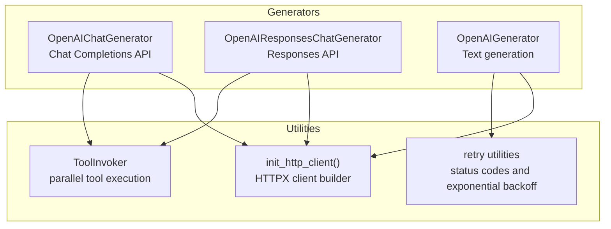
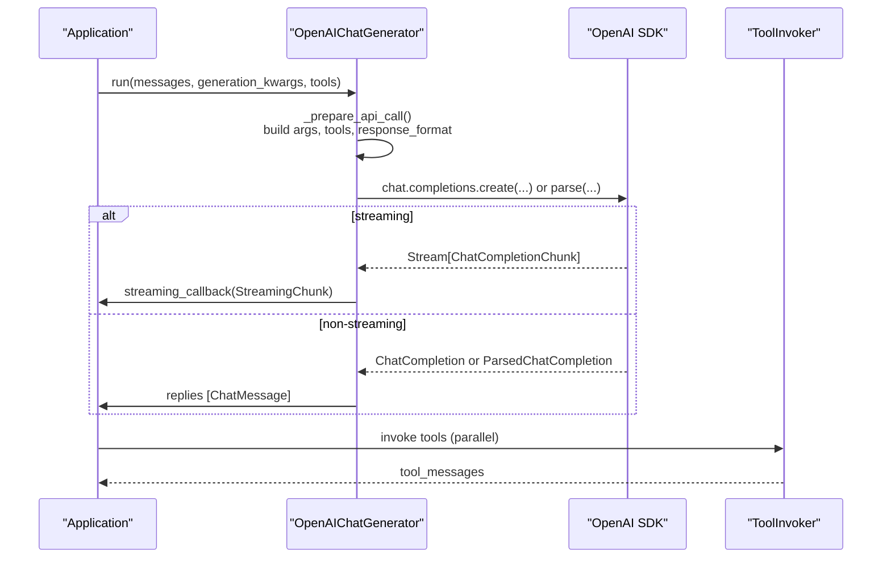
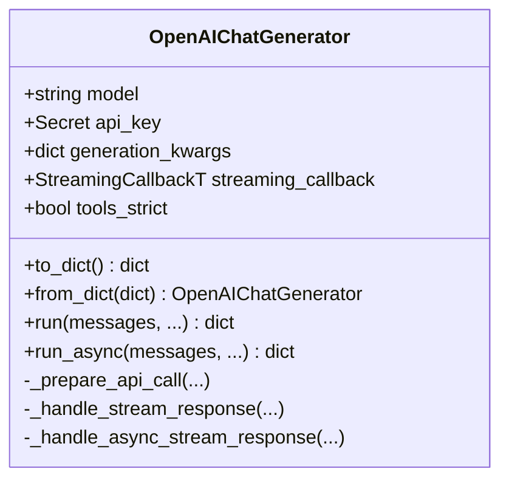
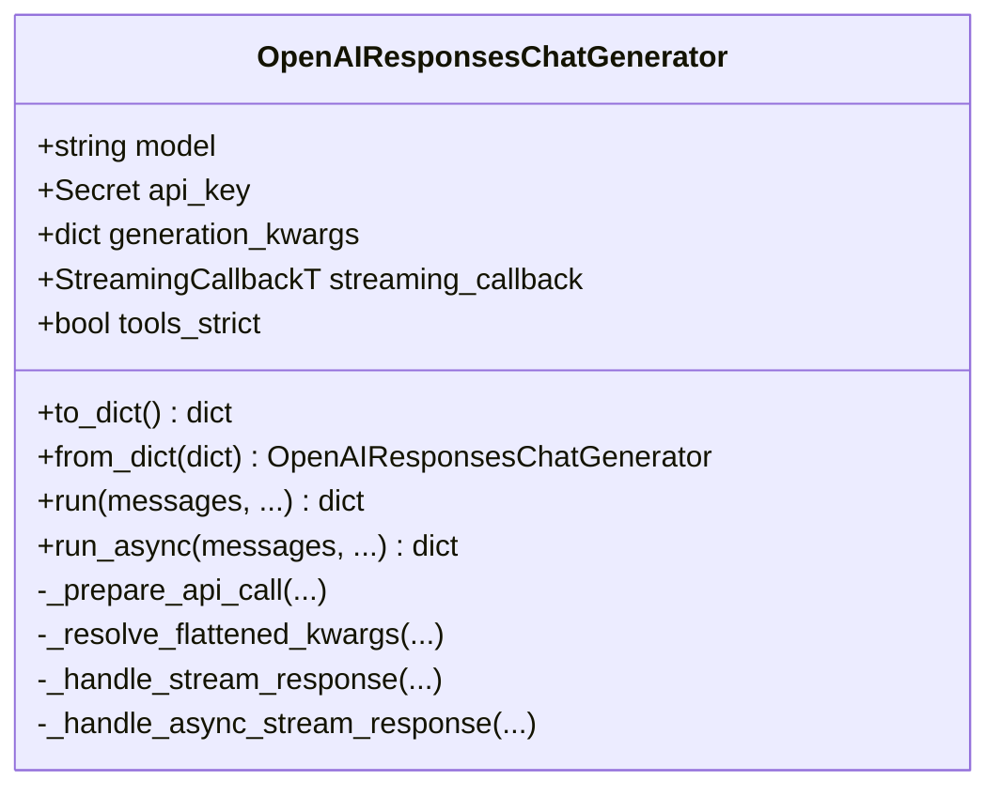
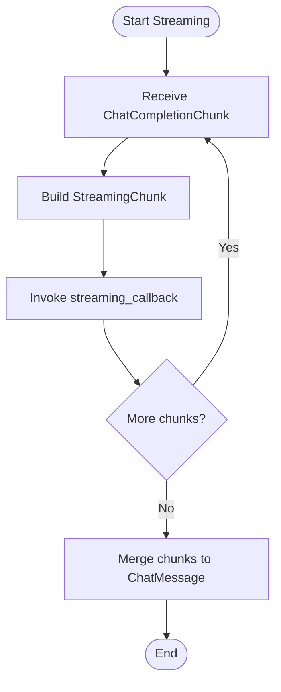
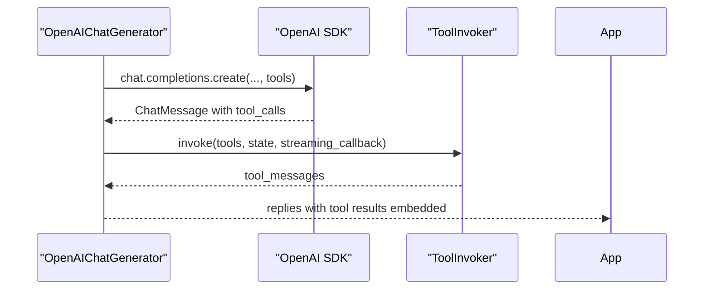
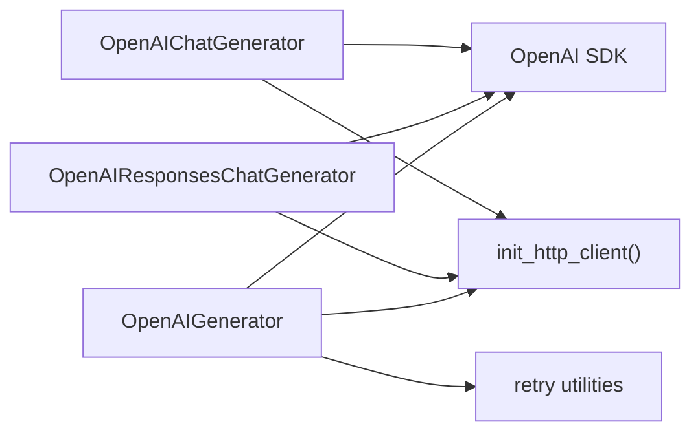

# OpenAI Integration

<cite>
**Referenced Files in This Document**
- [openai.py](file://haystack/components/generators/chat/openai.py)
- [openai_responses.py](file://haystack/components/generators/chat/openai_responses.py)
- [openai.py](file://haystack/components/generators/openai.py)
- [http_client.py](file://haystack/utils/http_client.py)
- [requests_utils.py](file://haystack/utils/requests_utils.py)
- [tool_invoker.py](file://haystack/components/tools/tool_invoker.py)
- [test_openai.py](file://test/components/generators/chat/test_openai.py)
- [test_openai_responses_conversion.py](file://test/components/generators/chat/test_openai_responses_conversion.py)
- [azureopenaichatgenerator.mdx](file://docs-website/docs/pipeline-components/generators/azureopenaichatgenerator.mdx)
- [add-openai-client-config-generators-59a66f69c0733013.yaml](file://releasenotes/nodes/add-openai-client-config-generators-59a66f69c0733013.yaml)
- [gptgenerator-api-key-b9a648301a67bb37.yaml](file://releasenotes/nodes/gptgenerator-api-key-b9a648301a67bb37.yaml)
- [nested-serialization-openai-usage-object-3817b07342999edf.yaml](file://releasenotes/nodes/nested-serialization-openai-usage-object-3817b07342999edf.yaml)
</cite>

## Table of Contents
1. [Introduction](#introduction)
2. [Project Structure](#project-structure)
3. [Core Components](#core-components)
4. [Architecture Overview](#architecture-overview)
5. [Detailed Component Analysis](#detailed-component-analysis)
6. [Dependency Analysis](#dependency-analysis)
7. [Performance Considerations](#performance-considerations)
8. [Troubleshooting Guide](#troubleshooting-guide)
9. [Conclusion](#conclusion)
10. [Appendices](#appendices)

## Introduction
This document explains how Haystack integrates with OpenAI through dedicated generator components. It covers authentication, API configuration, model selection, parameter tuning (including temperature, max tokens, top_p, and penalties), streaming responses, structured outputs, and tool calling. It also documents rate limiting strategies, error handling patterns, cost optimization techniques, and practical examples for configuring different OpenAI models. Guidance for troubleshooting common API errors and authentication issues is included.

## Project Structure
Haystack provides multiple OpenAI-related components:
- Chat generator for OpenAI’s Chat Completions API
- Chat generator for OpenAI’s Responses API
- Text generator for OpenAI’s Chat Completions API
- Utilities for HTTP client configuration and retries
- Tool invocation utilities for parallel tool calling

**Diagram sources**
- [openai.py](file://haystack/components/generators/chat/openai.py#L53-L725)
- [openai_responses.py](file://haystack/components/generators/chat/openai_responses.py#L46-L904)
- [openai.py](file://haystack/components/generators/openai.py#L31-L271)
- [http_client.py](file://haystack/utils/http_client.py#L26-L56)
- [requests_utils.py](file://haystack/utils/requests_utils.py#L180-L208)
- [tool_invoker.py](file://haystack/components/tools/tool_invoker.py#L568-L769)

**Section sources**
- [openai.py](file://haystack/components/generators/chat/openai.py#L53-L725)
- [openai_responses.py](file://haystack/components/generators/chat/openai_responses.py#L46-L904)
- [openai.py](file://haystack/components/generators/openai.py#L31-L271)
- [http_client.py](file://haystack/utils/http_client.py#L26-L56)
- [requests_utils.py](file://haystack/utils/requests_utils.py#L180-L208)
- [tool_invoker.py](file://haystack/components/tools/tool_invoker.py#L568-L769)

## Core Components
- OpenAIChatGenerator: Chat completions with support for streaming, structured outputs, and tool/function calling.
- OpenAIResponsesChatGenerator: Responses API with reasoning summaries, structured outputs, and streaming.
- OpenAIGenerator: Text generation using Chat Completions with system prompts and streaming.

Key capabilities:
- Authentication via API key and optional organization/base URL
- Environment-driven timeouts and retries
- Custom HTTP client configuration (proxy/SSL)
- Structured outputs via JSON schema or Pydantic models
- Tool/function calling with parallel execution
- Streaming callbacks for incremental processing

**Section sources**
- [openai.py](file://haystack/components/generators/chat/openai.py#L53-L725)
- [openai_responses.py](file://haystack/components/generators/chat/openai_responses.py#L46-L904)
- [openai.py](file://haystack/components/generators/openai.py#L31-L271)

## Architecture Overview
The OpenAI generators integrate with the OpenAI SDK and expose streaming and non-streaming modes. They convert between Haystack’s ChatMessage and OpenAI’s message formats, handle tool calls, and manage structured outputs.

**Diagram sources**
- [openai.py](file://haystack/components/generators/chat/openai.py#L300-L515)
- [tool_invoker.py](file://haystack/components/tools/tool_invoker.py#L568-L769)

**Section sources**
- [openai.py](file://haystack/components/generators/chat/openai.py#L300-L515)
- [tool_invoker.py](file://haystack/components/tools/tool_invoker.py#L568-L769)

## Detailed Component Analysis

### OpenAIChatGenerator
- Purpose: Chat completions with streaming, structured outputs, and tool/function calling.
- Supported models: A curated list includes modern OpenAI models.
- Authentication: API key via environment variable or parameter; optional organization and base URL.
- Parameters: temperature, top_p, max_completion_tokens, n, stop, presence_penalty, frequency_penalty, logit_bias, response_format.
- Structured outputs: Supports JSON schema and Pydantic models; parse endpoint for non-streaming; create endpoint for streaming.
- Tool calling: Converts OpenAI tool calls to Haystack ToolCall objects; strict schema enforcement supported.
- Streaming: Emits StreamingChunk with content deltas, tool call deltas, and finish reasons.

**Diagram sources**
- [openai.py](file://haystack/components/generators/chat/openai.py#L53-L725)

**Section sources**
- [openai.py](file://haystack/components/generators/chat/openai.py#L97-L225)
- [openai.py](file://haystack/components/generators/chat/openai.py#L455-L515)
- [openai.py](file://haystack/components/generators/chat/openai.py#L517-L725)

### OpenAIResponsesChatGenerator
- Purpose: Responses API with reasoning summaries, structured outputs, and streaming.
- Parameters: temperature, top_p, previous_response_id, text_format (Pydantic or JSON schema), text (JSON schema), reasoning (effort, summary, generate_summary).
- Structured outputs: Non-streaming parse endpoint; streaming create endpoint.
- Tool calling: Supports OpenAI/MCP tool definitions or Haystack tools; strictness configurable.
- Streaming: Emits reasoning deltas, function call name/start/end, function arguments deltas, and text deltas.

**Diagram sources**
- [openai_responses.py](file://haystack/components/generators/chat/openai_responses.py#L46-L904)

**Section sources**
- [openai_responses.py](file://haystack/components/generators/chat/openai_responses.py#L77-L191)
- [openai_responses.py](file://haystack/components/generators/chat/openai_responses.py#L434-L506)
- [openai_responses.py](file://haystack/components/generators/chat/openai_responses.py#L508-L904)

### OpenAIGenerator
- Purpose: Text generation using Chat Completions with optional system prompt.
- Parameters: temperature, top_p, max_completion_tokens, n, stop, presence_penalty, frequency_penalty.
- Streaming: Emits StreamingChunk for incremental text.

**Section sources**
- [openai.py](file://haystack/components/generators/openai.py#L64-L170)
- [openai.py](file://haystack/components/generators/openai.py#L187-L271)

### Authentication and API Configuration
- API key: Provided via environment variable or constructor parameter.
- Organization and base URL: Optional configuration for advanced setups.
- Environment overrides: OPENAI_TIMEOUT and OPENAI_MAX_RETRIES.
- HTTP client customization: http_client_kwargs enables proxy and SSL configuration.

**Section sources**
- [openai.py](file://haystack/components/generators/chat/openai.py#L117-L225)
- [openai.py](file://haystack/components/generators/openai.py#L64-L143)
- [openai_responses.py](file://haystack/components/generators/chat/openai_responses.py#L77-L191)
- [http_client.py](file://haystack/utils/http_client.py#L26-L56)
- [add-openai-client-config-generators-59a66f69c0733013.yaml](file://releasenotes/nodes/add-openai-client-config-generators-59a66f69c0733013.yaml#L1-L4)
- [gptgenerator-api-key-b9a648301a67bb37.yaml](file://releasenotes/nodes/gptgenerator-api-key-b9a648301a67bb37.yaml#L1-L5)

### Parameter Configuration
Common generation parameters supported by the components:
- temperature: Controls randomness; higher values increase diversity.
- top_p: Nucleus sampling threshold.
- max_completion_tokens: Upper bound for total tokens (including reasoning).
- n: Number of completions per prompt.
- stop: Stop sequences.
- presence_penalty, frequency_penalty: Token repetition penalties.
- logit_bias: Bias specific tokens.
- response_format/text_format: Structured outputs via JSON schema or Pydantic models.

Notes:
- Structured outputs require response_format for non-streaming and JSON schema for streaming.
- Strict schema enforcement can improve correctness at potential latency cost.

**Section sources**
- [openai.py](file://haystack/components/generators/chat/openai.py#L151-L178)
- [openai.py](file://haystack/components/generators/chat/openai.py#L500-L515)
- [openai_responses.py](file://haystack/components/generators/chat/openai_responses.py#L113-L134)
- [openai_responses.py](file://haystack/components/generators/chat/openai_responses.py#L479-L486)

### Streaming Responses
- Synchronous streaming: Callback receives StreamingChunk progressively.
- Asynchronous streaming: Async callback for async environments.
- Streaming chunks include content deltas, tool call deltas, reasoning deltas, and finish reasons.

**Diagram sources**
- [openai.py](file://haystack/components/generators/chat/openai.py#L517-L550)
- [openai.py](file://haystack/components/generators/chat/openai.py#L614-L725)

**Section sources**
- [openai.py](file://haystack/components/generators/chat/openai.py#L517-L725)

### Structured Outputs
- Non-streaming: Uses parse endpoint with response_format; validated against JSON schema or Pydantic model.
- Streaming: Uses create endpoint with response_format; requires JSON schema.
- Responses API: text_format (Pydantic) or text (JSON schema); text_format takes precedence.

**Section sources**
- [openai.py](file://haystack/components/generators/chat/openai.py#L500-L515)
- [openai_responses.py](file://haystack/components/generators/chat/openai_responses.py#L479-L486)
- [openai_responses.py](file://haystack/components/generators/chat/openai_responses.py#L227-L238)

### Tool Calling and Parallel Execution
- Tool definitions: Converted from Haystack Tool/Toolset or OpenAI/MCP tool dicts.
- Strict schema: Enforced via strict flag and additionalProperties constraints.
- Parallel execution: ToolInvoker executes tool calls concurrently with thread pool; supports state updates and error handling.

**Diagram sources**
- [openai.py](file://haystack/components/generators/chat/openai.py#L477-L515)
- [tool_invoker.py](file://haystack/components/tools/tool_invoker.py#L568-L769)

**Section sources**
- [openai.py](file://haystack/components/generators/chat/openai.py#L477-L515)
- [tool_invoker.py](file://haystack/components/tools/tool_invoker.py#L568-L769)

### Azure OpenAI Support
- Azure OpenAI Chat Generator documentation outlines endpoint and deployment configuration, along with recommended environment variables for credentials.

**Section sources**
- [azureopenaichatgenerator.mdx](file://docs-website/docs/pipeline-components/generators/azureopenaichatgenerator.mdx#L22-L44)

## Dependency Analysis
- OpenAI SDK integration: Components instantiate OpenAI and AsyncOpenAI clients with configured HTTP client and timeouts.
- HTTP client customization: init_http_client builds httpx.Client/AsyncClient with optional limits and proxy/SSL settings.
- Retries: Generic retry utilities support exponential backoff and specific status codes.

**Diagram sources**
- [openai.py](file://haystack/components/generators/chat/openai.py#L221-L224)
- [openai_responses.py](file://haystack/components/generators/chat/openai_responses.py#L187-L190)
- [openai.py](file://haystack/components/generators/openai.py#L136-L143)
- [http_client.py](file://haystack/utils/http_client.py#L26-L56)
- [requests_utils.py](file://haystack/utils/requests_utils.py#L180-L208)

**Section sources**
- [openai.py](file://haystack/components/generators/chat/openai.py#L221-L224)
- [openai_responses.py](file://haystack/components/generators/chat/openai_responses.py#L187-L190)
- [openai.py](file://haystack/components/generators/openai.py#L136-L143)
- [http_client.py](file://haystack/utils/http_client.py#L26-L56)
- [requests_utils.py](file://haystack/utils/requests_utils.py#L180-L208)

## Performance Considerations
- Streaming reduces latency by emitting partial results incrementally.
- Structured outputs with parse endpoint avoid retries due to malformed JSON.
- Strict tool schemas improve reliability but may add latency.
- Configure timeouts and retries via environment variables or constructor parameters to balance resilience and throughput.
- Use HTTP client limits to control concurrency and resource usage.

[No sources needed since this section provides general guidance]

## Troubleshooting Guide
Common issues and resolutions:
- Authentication failures: Ensure OPENAI_API_KEY is set or passed correctly; verify organization/base URL if applicable.
- Rate limiting: Expect 429 responses; configure retries and backoff; consider using fallback strategies.
- Malformed tool call arguments: Enable tools_strict to enforce strict JSON schema; otherwise malformed JSON is warned and skipped.
- Truncated completions: Finish reason “length” indicates max tokens reached; increase max_completion_tokens.
- Content filter truncation: Finish reason “content_filter” suggests filtered content; adjust prompts or parameters.
- Nested usage serialization: Usage objects are serialized safely to JSON-compatible structures.

Practical checks:
- Validate environment variables and network connectivity.
- Confirm model availability and permissions.
- Review logs for warnings and finish reasons.

**Section sources**
- [openai.py](file://haystack/components/generators/chat/openai.py#L553-L567)
- [openai.py](file://haystack/components/generators/chat/openai.py#L588-L600)
- [openai_responses.py](file://haystack/components/generators/chat/openai_responses.py#L567-L584)
- [nested-serialization-openai-usage-object-3817b07342999edf.yaml](file://releasenotes/nodes/nested-serialization-openai-usage-object-3817b07342999edf.yaml#L1-L5)

## Conclusion
Haystack’s OpenAI integration provides robust, production-ready components for chat, text generation, structured outputs, and tool/function calling. With flexible authentication, streaming, and HTTP client customization, it supports diverse deployment scenarios. Proper parameter tuning, structured outputs, and tool invocation patterns help achieve quality and performance goals while maintaining reliability through retries and error handling.

[No sources needed since this section summarizes without analyzing specific files]

## Appendices

### Practical Examples and Patterns
- Configure API key and model:
  - Use environment variable OPENAI_API_KEY or pass api_key parameter.
  - Select model from supported list.
- Enable streaming:
  - Pass a streaming_callback to run() or run_async().
- Structured outputs:
  - Provide response_format as JSON schema or Pydantic model for non-streaming.
  - For streaming, use JSON schema via response_format.
- Tool calling:
  - Define Tool or Toolset objects; pass tools parameter; optionally enable tools_strict.
- Retry and rate limiting:
  - Set OPENAI_MAX_RETRIES and OPENAI_TIMEOUT; leverage built-in retries and backoff.
- HTTP client configuration:
  - Use http_client_kwargs to configure proxies and SSL settings.

**Section sources**
- [openai.py](file://haystack/components/generators/chat/openai.py#L117-L225)
- [openai.py](file://haystack/components/generators/chat/openai.py#L500-L515)
- [openai.py](file://haystack/components/generators/chat/openai.py#L477-L515)
- [openai.py](file://haystack/components/generators/chat/openai.py#L517-L550)
- [http_client.py](file://haystack/utils/http_client.py#L26-L56)
- [requests_utils.py](file://haystack/utils/requests_utils.py#L180-L208)

### Example References
- Chat completion with tools and streaming:
  - [test_openai.py](file://test/components/generators/chat/test_openai.py#L72-L109)
- Responses API streaming with reasoning and tool calls:
  - [test_openai_responses_conversion.py](file://test/components/generators/chat/test_openai_responses_conversion.py#L52-L79)

**Section sources**
- [test_openai.py](file://test/components/generators/chat/test_openai.py#L72-L109)
- [test_openai_responses_conversion.py](file://test/components/generators/chat/test_openai_responses_conversion.py#L52-L79)