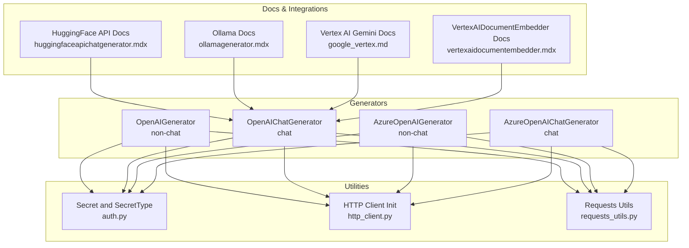
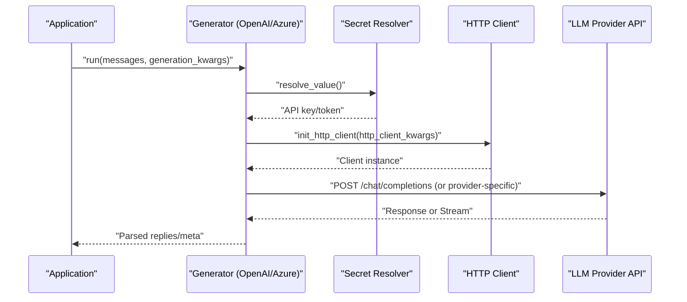
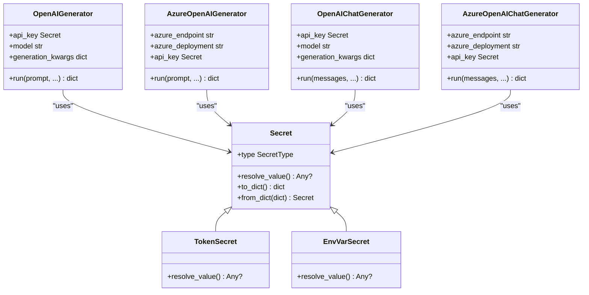
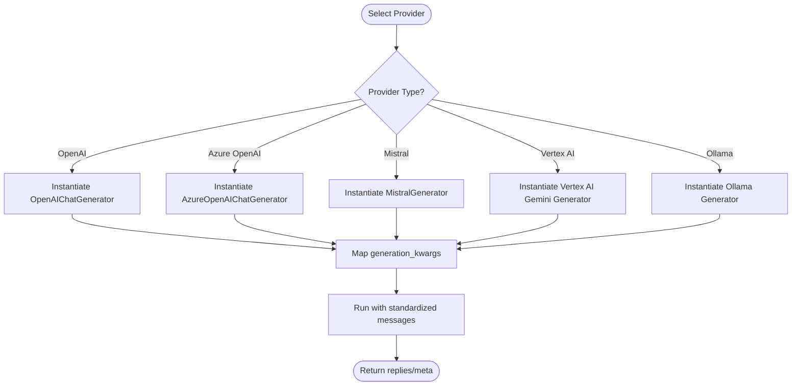
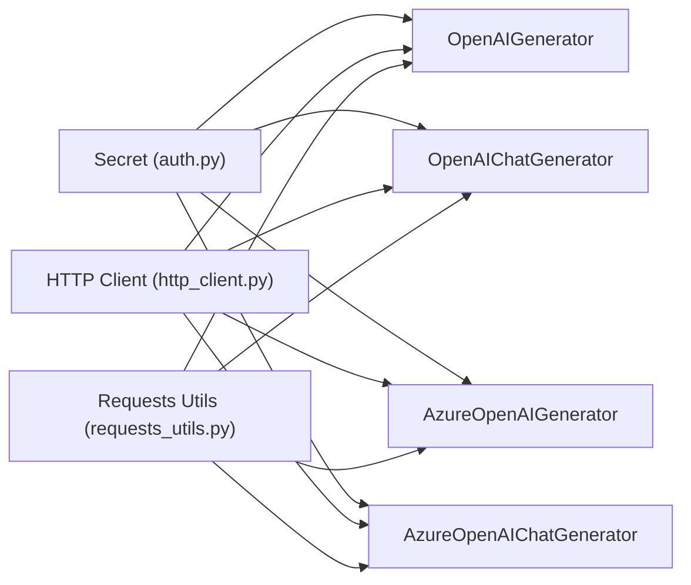

# Other LLM Providers

<cite>
**Referenced Files in This Document**
- [auth.py](file://haystack/utils/auth.py)
- [http_client.py](file://haystack/utils/http_client.py)
- [openai.py](file://haystack/components/generators/openai.py)
- [azure.py](file://haystack/components/generators/azure.py)
- [openai.py](file://haystack/components/generators/chat/openai.py)
- [azure.py](file://haystack/components/generators/chat/azure.py)
- [ollamagenerator.mdx](file://docs-website/docs/pipeline-components/generators/ollamagenerator.mdx)
- [huggingfaceapichatgenerator.mdx](file://docs-website/docs/pipeline-components/generators/huggingfaceapichatgenerator.mdx)
- [vertexaidocumentembedder.mdx](file://docs-website/versioned_docs/version-2.19/pipeline-components/embedders/vertexaidocumentembedder.mdx)
- [google_vertex.md](file://docs-website/reference/integrations-api/google_vertex.md)
- [requests_utils.py](file://haystack/utils/requests_utils.py)
</cite>

## Table of Contents
1. [Introduction](#introduction)
2. [Project Structure](#project-structure)
3. [Core Components](#core-components)
4. [Architecture Overview](#architecture-overview)
5. [Detailed Component Analysis](#detailed-component-analysis)
6. [Dependency Analysis](#dependency-analysis)
7. [Performance Considerations](#performance-considerations)
8. [Troubleshooting Guide](#troubleshooting-guide)
9. [Conclusion](#conclusion)
10. [Appendices](#appendices)

## Introduction
This document explains how to integrate additional Large Language Model (LLM) providers into Haystack with a focus on:
- Mistral AI integration using API key authentication and model selection
- Google Gemini integration via Vertex AI, including authentication and multimodal capabilities
- Ollama integration for local model deployment and Docker container management
- Provider-agnostic patterns for adding new LLM providers, including authentication, parameter mapping, and error handling
- Practical configuration examples, capability comparisons, provider switching logic, and migration strategies

It synthesizes real implementations and documentation from the repository to guide both technical and non-technical readers.

## Project Structure
Haystack organizes LLM integrations primarily under:
- Generators: chat and non-chat variants for multiple providers (OpenAI, Azure OpenAI, Hugging Face, Ollama)
- Utilities: authentication abstraction, HTTP client configuration, and request helpers
- Documentation: provider-specific guides and API references

**Diagram sources**
- [openai.py](file://haystack/components/generators/openai.py#L31-L271)
- [openai.py](file://haystack/components/generators/chat/openai.py#L53-L725)
- [azure.py](file://haystack/components/generators/azure.py#L17-L216)
- [azure.py](file://haystack/components/generators/chat/azure.py#L27-L281)
- [auth.py](file://haystack/utils/auth.py#L13-L231)
- [http_client.py](file://haystack/utils/http_client.py#L26-L56)
- [requests_utils.py](file://haystack/utils/requests_utils.py#L180-L208)
- [huggingfaceapichatgenerator.mdx](file://docs-website/docs/pipeline-components/generators/huggingfaceapichatgenerator.mdx#L40-L71)
- [ollamagenerator.mdx](file://docs-website/docs/pipeline-components/generators/ollamagenerator.mdx#L27-L59)
- [google_vertex.md](file://docs-website/reference/integrations-api/google_vertex.md#L42-L61)
- [vertexaidocumentembedder.mdx](file://docs-website/versioned_docs/version-2.19/pipeline-components/embedders/vertexaidocumentembedder.mdx#L43-L81)

**Section sources**
- [openai.py](file://haystack/components/generators/openai.py#L31-L271)
- [openai.py](file://haystack/components/generators/chat/openai.py#L53-L725)
- [azure.py](file://haystack/components/generators/azure.py#L17-L216)
- [azure.py](file://haystack/components/generators/chat/azure.py#L27-L281)
- [auth.py](file://haystack/utils/auth.py#L13-L231)
- [http_client.py](file://haystack/utils/http_client.py#L26-L56)
- [requests_utils.py](file://haystack/utils/requests_utils.py#L180-L208)
- [huggingfaceapichatgenerator.mdx](file://docs-website/docs/pipeline-components/generators/huggingfaceapichatgenerator.mdx#L40-L71)
- [ollamagenerator.mdx](file://docs-website/docs/pipeline-components/generators/ollamagenerator.mdx#L27-L59)
- [google_vertex.md](file://docs-website/reference/integrations-api/google_vertex.md#L42-L61)
- [vertexaidocumentembedder.mdx](file://docs-website/versioned_docs/version-2.19/pipeline-components/embedders/vertexaidocumentembedder.mdx#L43-L81)

## Core Components
- Secret and SecretType: Abstraction for API keys and environment-based secrets, supporting token-based and environment-variable-based secrets with serialization constraints.
- HTTP client initialization: Utility to build synchronous or asynchronous httpx clients with configurable parameters (e.g., connection limits).
- Request helpers: Utilities for robust HTTP operations with retries and timeouts.
- OpenAI and Azure OpenAI generators: Non-chat and chat variants with streaming support, parameter mapping, and structured outputs.

Key patterns:
- Authentication via Secret.from_env_var or Secret.from_token
- Parameter mapping to provider APIs via generation_kwargs
- Streaming via callbacks and structured chunk handling
- Retry and timeout controls via http_client_kwargs and environment variables

**Section sources**
- [auth.py](file://haystack/utils/auth.py#L13-L231)
- [http_client.py](file://haystack/utils/http_client.py#L26-L56)
- [requests_utils.py](file://haystack/utils/requests_utils.py#L180-L208)
- [openai.py](file://haystack/components/generators/openai.py#L64-L144)
- [openai.py](file://haystack/components/generators/chat/openai.py#L117-L225)

## Architecture Overview
The provider-agnostic integration pattern centers on:
- A common generator interface with Secret-based authentication
- Optional Azure/OpenAI-specific adapters
- HTTP client customization and retry logic
- Serialization/deserialization hooks for safe configuration persistence

**Diagram sources**
- [openai.py](file://haystack/components/generators/openai.py#L187-L271)
- [openai.py](file://haystack/components/generators/chat/openai.py#L300-L374)
- [auth.py](file://haystack/utils/auth.py#L104-L130)
- [http_client.py](file://haystack/utils/http_client.py#L26-L56)

## Detailed Component Analysis

### Mistral AI Integration (API Key + Model Selection)
- Authentication: Use Secret.from_env_var or Secret.from_token to supply the API key. The generator should accept an api_key parameter and forward it to the underlying client.
- Model selection: Pass the model name via a dedicated parameter (e.g., model) and map it to the provider’s model identifier.
- Parameter mapping: Use generation_kwargs to pass provider-specific parameters (e.g., temperature, max_tokens). Ensure unsupported parameters are filtered or documented.
- Streaming: If supported, expose a streaming_callback parameter and handle incremental chunks consistently.
- Serialization: Prefer environment-based secrets for serialization safety.

Implementation pattern (conceptual):
- Create a MistralGenerator class similar to OpenAIChatGenerator with:
  - api_key: Secret
  - model: str
  - generation_kwargs: dict
  - streaming_callback: optional
  - http_client_kwargs: optional
- Resolve Secret via resolve_value() and initialize the HTTP client via init_http_client().
- Map messages to provider format and send to the Mistral API endpoint.
- Parse non-streaming and streaming responses into ChatMessage or StreamingChunk.

Provider-agnostic checklist:
- Define a Secret-based api_key parameter
- Expose model and generation_kwargs
- Support streaming via callbacks
- Provide to_dict/from_dict with serialization-safe secrets
- Integrate with init_http_client for retries/timeouts

**Section sources**
- [auth.py](file://haystack/utils/auth.py#L57-L74)
- [openai.py](file://haystack/components/generators/chat/openai.py#L117-L193)
- [openai.py](file://haystack/components/generators/chat/openai.py#L244-L298)

### Google Gemini via Vertex AI (Authentication + Multimodal)
- Authentication: Vertex AI uses Google Cloud Application Default Credentials (ADC). Ensure the environment is configured with appropriate service account credentials or gcloud CLI.
- Model selection: Choose a Gemini model (e.g., gemini-2.0-flash) via the model parameter.
- Multimodal: Vertex AI Gemini supports multimodal inputs (text, images). Configure generation_config, safety_settings, and system_instruction as needed.
- Integration: Use the Vertex AI Gemini generator (as referenced in the docs) and ensure the google-vertex-haystack package is installed.

Practical steps:
- Set up ADC and project/region as per the embedder documentation.
- Install the integration package and initialize the generator with model and optional generation parameters.
- Send multimodal inputs and parse structured outputs.

**Section sources**
- [vertexaidocumentembedder.mdx](file://docs-website/versioned_docs/version-2.19/pipeline-components/embedders/vertexaidocumentembedder.mdx#L43-L81)
- [google_vertex.md](file://docs-website/reference/integrations-api/google_vertex.md#L42-L61)

### Ollama Integration (Local Deployment + Docker)
- Local deployment: Ollama runs a local HTTP server. The generator requires a model name and a URL (default localhost).
- Docker: Use a containerized Ollama instance mapped to port 11434. Pull desired models inside the container.
- Configuration: Point the generator to the local URL and select a model. Enable streaming if needed.

Operational flow:
- Start Ollama container and pull a model.
- Configure the generator with model and url.
- Run prompts and receive streamed or non-streamed responses.

**Section sources**
- [ollamagenerator.mdx](file://docs-website/docs/pipeline-components/generators/ollamagenerator.mdx#L27-L59)

### Provider-Agnostic Patterns for New LLM Providers
- Authentication
  - Prefer Secret.from_env_var for serialization-safe configurations.
  - Allow Secret.from_token for ephemeral or testing scenarios, noting serialization limitations.
- Parameter mapping
  - Expose a model parameter and a flexible generation_kwargs dict.
  - Normalize provider-specific parameters to a common schema.
- Streaming
  - Accept a streaming_callback and convert provider chunks to StreamingChunk.
  - Validate constraints (e.g., n=1 for streaming).
- Error handling
  - Use init_http_client with http_client_kwargs for timeouts/retries.
  - Wrap provider calls with retry logic where applicable.
- Serialization
  - Implement to_dict/from_dict and use deserialize_secrets_inplace for secure configuration persistence.

**Diagram sources**
- [auth.py](file://haystack/utils/auth.py#L34-L130)
- [openai.py](file://haystack/components/generators/openai.py#L64-L144)
- [azure.py](file://haystack/components/generators/azure.py#L57-L165)
- [openai.py](file://haystack/components/generators/chat/openai.py#L117-L225)
- [azure.py](file://haystack/components/generators/chat/azure.py#L74-L204)

**Section sources**
- [auth.py](file://haystack/utils/auth.py#L34-L130)
- [openai.py](file://haystack/components/generators/openai.py#L64-L144)
- [azure.py](file://haystack/components/generators/azure.py#L57-L165)
- [openai.py](file://haystack/components/generators/chat/openai.py#L117-L225)
- [azure.py](file://haystack/components/generators/chat/azure.py#L74-L204)

### Practical Examples and Comparisons
- Mistral AI
  - Configure api_key via Secret.from_env_var and set model via a dedicated parameter.
  - Map generation_kwargs to Mistral-compatible parameters.
- Google Gemini via Vertex AI
  - Use ADC; choose a multimodal model; configure generation_config and safety settings.
- Ollama
  - Run Ollama locally or in Docker; select a model and connect via URL.

Provider comparison highlights:
- Authentication: Mistral/Ollama commonly use API keys; Vertex AI relies on ADC.
- Model selection: All support explicit model parameters; ensure mapping to provider identifiers.
- Multimodality: Vertex AI Gemini supports multimodal inputs; verify provider support for images/text.
- Streaming: OpenAI-style streaming is available in OpenAI/Azure generators; confirm provider support for others.

**Section sources**
- [huggingfaceapichatgenerator.mdx](file://docs-website/docs/pipeline-components/generators/huggingfaceapichatgenerator.mdx#L40-L71)
- [ollamagenerator.mdx](file://docs-website/docs/pipeline-components/generators/ollamagenerator.mdx#L27-L59)
- [vertexaidocumentembedder.mdx](file://docs-website/versioned_docs/version-2.19/pipeline-components/embedders/vertexaidocumentembedder.mdx#L43-L81)

### Provider Switching Logic
Switching providers while preserving behavior:
- Standardize input messages to a common format (e.g., ChatMessage).
- Normalize generation_kwargs to a common subset of parameters.
- Centralize authentication via Secret and environment variables.
- Use a factory or configuration-driven loader to instantiate the appropriate generator.

[No sources needed since this diagram shows conceptual workflow, not actual code structure]

## Dependency Analysis
- Generators depend on Secret for authentication and http_client for transport.
- Azure variants extend OpenAI variants to support Azure endpoints and optional Azure AD tokens.
- Vertex AI integration is documented separately and relies on ADC.

**Diagram sources**
- [auth.py](file://haystack/utils/auth.py#L13-L231)
- [http_client.py](file://haystack/utils/http_client.py#L26-L56)
- [requests_utils.py](file://haystack/utils/requests_utils.py#L180-L208)
- [openai.py](file://haystack/components/generators/openai.py#L64-L144)
- [openai.py](file://haystack/components/generators/chat/openai.py#L117-L225)
- [azure.py](file://haystack/components/generators/azure.py#L57-L165)
- [azure.py](file://haystack/components/generators/chat/azure.py#L74-L204)

**Section sources**
- [auth.py](file://haystack/utils/auth.py#L13-L231)
- [http_client.py](file://haystack/utils/http_client.py#L26-L56)
- [requests_utils.py](file://haystack/utils/requests_utils.py#L180-L208)
- [openai.py](file://haystack/components/generators/openai.py#L64-L144)
- [openai.py](file://haystack/components/generators/chat/openai.py#L117-L225)
- [azure.py](file://haystack/components/generators/azure.py#L57-L165)
- [azure.py](file://haystack/components/generators/chat/azure.py#L74-L204)

## Performance Considerations
- Use http_client_kwargs to tune connection pooling, timeouts, and retries.
- Prefer environment-based secrets to avoid serialization overhead and security risks.
- Limit streaming responses when not needed; streaming increases overhead.
- For Vertex AI, ensure proper region selection and quotas to minimize latency.

[No sources needed since this section provides general guidance]

## Troubleshooting Guide
Common issues and resolutions:
- Authentication failures
  - Verify Secret type and resolution. Use Secret.from_env_var for persistent configs.
  - For Azure, ensure either api_key or azure_ad_token is provided and valid.
- Parameter mismatches
  - Confirm generation_kwargs align with the target provider’s accepted parameters.
  - Filter unsupported parameters to prevent API errors.
- Streaming constraints
  - Some providers require n=1 for streaming; enforce this constraint in the generator.
- Network and timeouts
  - Adjust OPENAI_TIMEOUT and OPENAI_MAX_RETRIES environment variables or pass http_client_kwargs.
  - Use async_request_with_retry for robust HTTP operations.

**Section sources**
- [auth.py](file://haystack/utils/auth.py#L57-L74)
- [openai.py](file://haystack/components/generators/azure.py#L129-L134)
- [openai.py](file://haystack/components/generators/chat/openai.py#L470-L472)
- [requests_utils.py](file://haystack/utils/requests_utils.py#L180-L208)

## Conclusion
Integrating new LLM providers into Haystack follows a consistent pattern: Secret-based authentication, parameter normalization, streaming support, and robust HTTP configuration. By leveraging existing components and utilities, you can add providers like Mistral AI, maintain parity with Google Gemini via Vertex AI, and keep local deployments working with Ollama. The included patterns and examples provide a blueprint for secure, portable, and efficient provider integrations.

[No sources needed since this section summarizes without analyzing specific files]

## Appendices
- Migration strategies
  - Gradually shift from one provider to another by swapping model parameters and generation_kwargs.
  - Use environment variables to toggle providers without code changes.
  - Validate outputs with a small dataset before full rollout.
- Compliance and regional considerations
  - For Vertex AI, ensure project and location alignment with data residency requirements.
  - For cloud providers, review regional endpoints and export controls.

[No sources needed since this section provides general guidance]