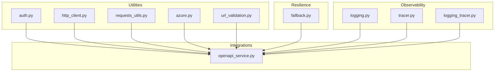
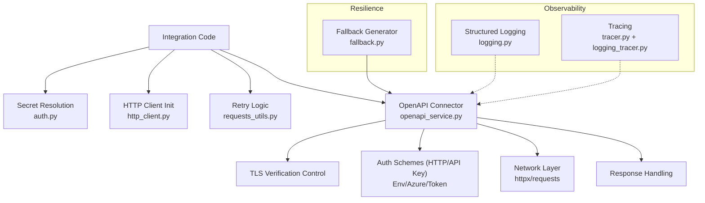
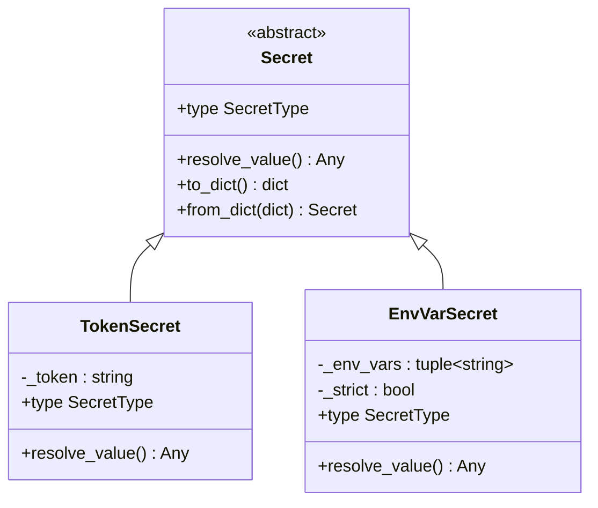
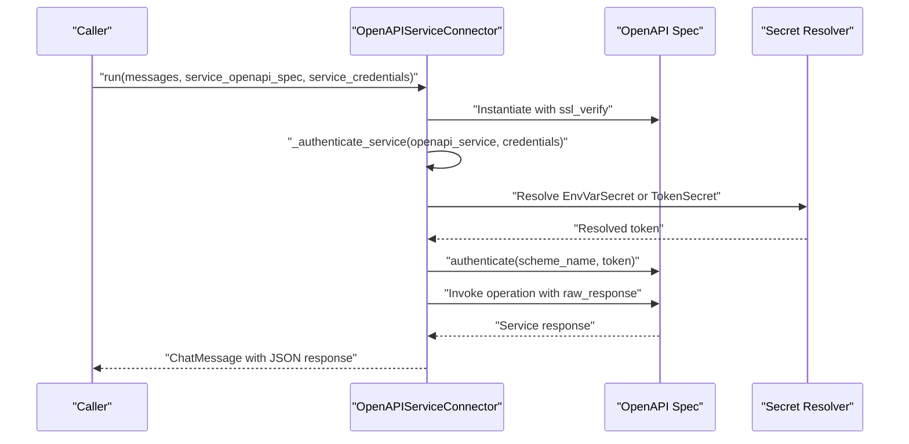
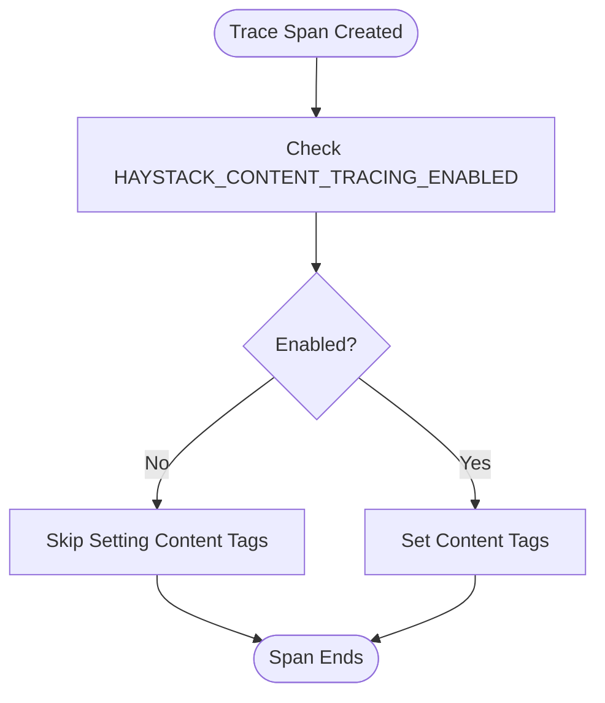
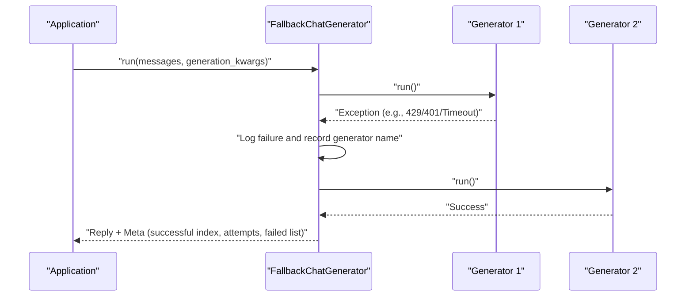
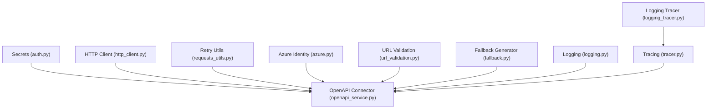

# Security and Configuration

<cite>
**Referenced Files in This Document**
- [auth.py](file://haystack/utils/auth.py)
- [http_client.py](file://haystack/utils/http_client.py)
- [requests_utils.py](file://haystack/utils/requests_utils.py)
- [openapi_service.py](file://haystack/components/connectors/openapi_service.py)
- [azure.py](file://haystack/utils/azure.py)
- [url_validation.py](file://haystack/utils/url_validation.py)
- [fallback.py](file://haystack/components/generators/chat/fallback.py)
- [logging.py](file://haystack/logging.py)
- [tracer.py](file://haystack/tracing/tracer.py)
- [logging_tracer.py](file://haystack/tracing/logging_tracer.py)
- [test_auth.py](file://test/utils/test_auth.py)
- [test_fallback.py](file://test/components/generators/chat/test_fallback.py)
- [test_logging.py](file://test/test_logging.py)
- [test_tracer.py](file://test/tracing/test_tracer.py)
- [allow-unverified-openapi-calls-46842af37464bb6d.yaml](file://releasenotes/notes/allow-unverified-openapi-calls-46842af37464bb6d.yaml)
</cite>

## Table of Contents
1. [Introduction](#introduction)
2. [Project Structure](#project-structure)
3. [Core Components](#core-components)
4. [Architecture Overview](#architecture-overview)
5. [Detailed Component Analysis](#detailed-component-analysis)
6. [Dependency Analysis](#dependency-analysis)
7. [Performance Considerations](#performance-considerations)
8. [Troubleshooting Guide](#troubleshooting-guide)
9. [Conclusion](#conclusion)
10. [Appendices](#appendices)

## Introduction
This document focuses on security and configuration management in Haystack integrations. It covers secure credential storage and retrieval using environment variables and token-based secrets, authentication best practices for API keys, OAuth-like bearer tokens, and service accounts, network security for external communications (TLS, certificate validation, proxies), data privacy and protection measures, rate limiting and resilience patterns, audit logging and monitoring, and compliance considerations. Practical patterns and common pitfalls are highlighted to help teams deploy secure integrations.

## Project Structure
Security-relevant code in the repository is primarily located under:
- Utilities for secrets, HTTP clients, retries, URL validation, and Azure identity
- Integration connectors for OpenAPI services
- Resilience components (fallback generators)
- Logging and tracing systems

**Diagram sources**
- [auth.py](file://haystack/utils/auth.py#L34-L230)
- [http_client.py](file://haystack/utils/http_client.py#L26-L56)
- [requests_utils.py](file://haystack/utils/requests_utils.py#L15-L209)
- [openapi_service.py](file://haystack/components/connectors/openapi_service.py#L146-L398)
- [azure.py](file://haystack/utils/azure.py#L11-L17)
- [url_validation.py](file://haystack/utils/url_validation.py#L8-L12)
- [fallback.py](file://haystack/components/generators/chat/fallback.py#L19-L246)
- [logging.py](file://haystack/logging.py#L360-L403)
- [tracer.py](file://haystack/tracing/tracer.py#L111-L244)
- [logging_tracer.py](file://haystack/tracing/logging_tracer.py#L53-L78)

**Section sources**
- [auth.py](file://haystack/utils/auth.py#L1-L231)
- [openapi_service.py](file://haystack/components/connectors/openapi_service.py#L1-L398)

## Core Components
- Secret management: Environment variable-based and token-based secrets with serialization/deserialization helpers.
- HTTP client utilities: Initialization of synchronous/asynchronous HTTP clients with configurable limits and TLS verification.
- Request utilities: Retrying logic with exponential backoff for transient failures and customizable status codes.
- OpenAPI connector: Authentication via HTTP and API key schemes, TLS verification control, and raw response handling.
- Azure identity: Helper to obtain bearer tokens for Azure Cognitive Services scopes.
- URL validation: Validation of HTTP/HTTPS URLs.
- Fallback generator: Sequential fallback across multiple chat generators with automatic failover on exceptions (including rate limit, auth, and server errors).
- Logging and tracing: Structured logging, JSON rendering, content-tagging controls, and pluggable tracers with auto-enable logic.

**Section sources**
- [auth.py](file://haystack/utils/auth.py#L34-L230)
- [http_client.py](file://haystack/utils/http_client.py#L26-L56)
- [requests_utils.py](file://haystack/utils/requests_utils.py#L15-L209)
- [openapi_service.py](file://haystack/components/connectors/openapi_service.py#L146-L398)
- [azure.py](file://haystack/utils/azure.py#L11-L17)
- [url_validation.py](file://haystack/utils/url_validation.py#L8-L12)
- [fallback.py](file://haystack/components/generators/chat/fallback.py#L19-L246)
- [logging.py](file://haystack/logging.py#L360-L403)
- [tracer.py](file://haystack/tracing/tracer.py#L111-L244)

## Architecture Overview
High-level security and configuration architecture for integrations:

**Diagram sources**
- [auth.py](file://haystack/utils/auth.py#L34-L230)
- [http_client.py](file://haystack/utils/http_client.py#L26-L56)
- [requests_utils.py](file://haystack/utils/requests_utils.py#L15-L209)
- [openapi_service.py](file://haystack/components/connectors/openapi_service.py#L146-L398)
- [fallback.py](file://haystack/components/generators/chat/fallback.py#L19-L246)
- [logging.py](file://haystack/logging.py#L360-L403)
- [tracer.py](file://haystack/tracing/tracer.py#L111-L244)
- [logging_tracer.py](file://haystack/tracing/logging_tracer.py#L53-L78)

## Detailed Component Analysis

### Secure Credential Storage and Retrieval
- TokenSecret: Stores a token directly; not serializable. Useful for ephemeral or in-memory tokens but not recommended for persistent configuration.
- EnvVarSecret: Reads from one or more environment variables; supports strict mode to enforce presence. Serializable via dictionary conversion.
- Secret.from_dict/from_token/from_env_var: Factory methods to construct secrets from serialized data or environment variables.
- deserialize_secrets_inplace: Converts serialized secret placeholders back into live Secret objects inside configuration dictionaries.

Best practices:
- Prefer EnvVarSecret for persistent configurations to avoid embedding secrets in code or serialized artifacts.
- Use strict mode to fail fast when required credentials are missing.
- Avoid serializing TokenSecret; rely on environment injection at runtime.

Common pitfalls:
- Embedding tokens directly in configuration files or code.
- Not validating that environment variables are set before use.

**Section sources**
- [auth.py](file://haystack/utils/auth.py#L34-L230)
- [test_auth.py](file://test/utils/test_auth.py#L71-L80)

#### Class Diagram: Secrets

**Diagram sources**
- [auth.py](file://haystack/utils/auth.py#L34-L230)

### Authentication Best Practices
- OpenAPI HTTP scheme: Supports Basic/Bearer-style headers; credentials supplied via service credentials.
- OpenAPI apiKey scheme: Supports header, query, and cookie modes; credentials supplied per scheme name.
- Azure identity: Provides a bearer token provider for Azure Cognitive Services scope using DefaultAzureCredential.
- URL validation: Validates HTTP/HTTPS URLs to prevent unsafe schemes.

Recommendations:
- Prefer bearer tokens for API integrations; supply via EnvVarSecret or Azure token provider.
- For multi-scheme APIs, pass credentials as a dictionary keyed by scheme name.
- Validate endpoints before connecting to reduce risk of SSRF.

**Section sources**
- [openapi_service.py](file://haystack/components/connectors/openapi_service.py#L285-L339)
- [azure.py](file://haystack/utils/azure.py#L11-L17)
- [url_validation.py](file://haystack/utils/url_validation.py#L8-L12)

#### Sequence Diagram: OpenAPI Authentication Flow

**Diagram sources**
- [openapi_service.py](file://haystack/components/connectors/openapi_service.py#L210-L262)
- [auth.py](file://haystack/utils/auth.py#L171-L213)

### Network Security: TLS, Certificates, and Proxies
- TLS verification control: OpenAPIServiceConnector accepts ssl_verify to enable/disable verification or to specify a CA bundle path/string.
- Release note indicates allowing unverified calls and specifying a certificate authority for OpenAPI function calls.
- HTTP client initialization supports passing through http_client_kwargs to httpx, including limits and TLS settings.

Guidelines:
- Enable TLS verification by default; only disable in controlled environments.
- Use a custom CA bundle path when connecting to services with private PKI.
- Configure proxies via http_client_kwargs if required by your environment.

**Section sources**
- [openapi_service.py](file://haystack/components/connectors/openapi_service.py#L199-L207)
- [allow-unverified-openapi-calls-46842af37464bb6d.yaml](file://releasenotes/notes/allow-unverified-openapi-calls-46842af37464bb6d.yaml#L1-L4)
- [http_client.py](file://haystack/utils/http_client.py#L26-L56)

### Data Privacy and Protection Measures
- Content tracing control: Tracer allows enabling/disabling content tags via environment variables to avoid logging sensitive content.
- Structured logging: Logging module renders logs as JSON by default when stdout is not a TTY, reducing accidental exposure of sensitive fields.
- Exception rendering: Structured logging excludes local variables in production to minimize leakage of sensitive data.

Recommendations:
- Disable content tracing by default; explicitly enable only when necessary and with least privilege.
- Avoid logging raw request/response bodies; log only non-sensitive metadata.
- Sanitize logs and traces to remove PII or secrets.

**Section sources**
- [tracer.py](file://haystack/tracing/tracer.py#L54-L79)
- [logging.py](file://haystack/logging.py#L360-L403)

#### Flowchart: Content Tagging Decision

**Diagram sources**
- [tracer.py](file://haystack/tracing/tracer.py#L54-L79)

### Rate Limiting, Circuit Breakers, and Graceful Degradation
- FallbackChatGenerator: Attempts multiple chat generators sequentially and falls back on any exception (including rate limit 429, auth 401, server errors 500+, and timeouts). Returns metadata about attempts and failures.
- Retry utilities: request_with_retry and async_request_with_retry provide exponential backoff and configurable status code retries for transient failures.

Recommendations:
- Pair retry logic with bounded backoff and jitter.
- Use FallbackChatGenerator to switch providers or routes on failure.
- Implement circuit breaker patterns at the integration boundary if needed (e.g., external service pools).

**Section sources**
- [fallback.py](file://haystack/components/generators/chat/fallback.py#L19-L246)
- [requests_utils.py](file://haystack/utils/requests_utils.py#L15-L209)
- [test_fallback.py](file://test/components/generators/chat/test_fallback.py#L273-L347)

#### Sequence Diagram: Fallback Chat Generation

**Diagram sources**
- [fallback.py](file://haystack/components/generators/chat/fallback.py#L136-L189)
- [test_fallback.py](file://test/components/generators/chat/test_fallback.py#L298-L347)

### Audit Logging and Monitoring
- Structured logging: JSON rendering for non-TTY outputs; configurable via environment variables.
- Tracing: Pluggable tracer with auto-enable logic for OpenTelemetry and Datadog; content tagging controlled by environment.
- Logging tracer: Simple logging-based tracer for lightweight tracing.

Recommendations:
- Centralize logs and traces; ensure retention and access controls.
- Tag spans with non-sensitive identifiers (e.g., tenant, request ID) rather than content.
- Monitor for authentication failures, rate limit events, and timeouts.

**Section sources**
- [logging.py](file://haystack/logging.py#L360-L403)
- [tracer.py](file://haystack/tracing/tracer.py#L111-L244)
- [logging_tracer.py](file://haystack/tracing/logging_tracer.py#L53-L78)
- [test_logging.py](file://test/test_logging.py#L390-L425)
- [test_tracer.py](file://test/tracing/test_tracer.py#L49-L77)

## Dependency Analysis
Key dependencies among security and configuration components:

**Diagram sources**
- [auth.py](file://haystack/utils/auth.py#L34-L230)
- [openapi_service.py](file://haystack/components/connectors/openapi_service.py#L146-L398)
- [http_client.py](file://haystack/utils/http_client.py#L26-L56)
- [requests_utils.py](file://haystack/utils/requests_utils.py#L15-L209)
- [azure.py](file://haystack/utils/azure.py#L11-L17)
- [url_validation.py](file://haystack/utils/url_validation.py#L8-L12)
- [fallback.py](file://haystack/components/generators/chat/fallback.py#L19-L246)
- [logging.py](file://haystack/logging.py#L360-L403)
- [tracer.py](file://haystack/tracing/tracer.py#L111-L244)
- [logging_tracer.py](file://haystack/tracing/logging_tracer.py#L53-L78)

**Section sources**
- [auth.py](file://haystack/utils/auth.py#L34-L230)
- [openapi_service.py](file://haystack/components/connectors/openapi_service.py#L146-L398)

## Performance Considerations
- Exponential backoff reduces thundering herds and improves recovery from transient failures.
- Asynchronous HTTP client initialization enables concurrency; tune limits and timeouts appropriately.
- Avoid unnecessary retries for non-transient errors (e.g., 400/401) unless explicitly desired.

[No sources needed since this section provides general guidance]

## Troubleshooting Guide
Common issues and resolutions:
- Missing credentials: Ensure environment variables are set or pass explicit credentials; strict mode will raise if none are found.
- TLS verification failures: Provide a custom CA bundle path or temporarily disable verification only in controlled environments.
- Authentication errors: Verify scheme names and token formats; confirm Azure identity scope alignment.
- Rate limit and server errors: Use FallbackChatGenerator to switch providers or routes; configure retry utilities for transient errors.
- Overlogging sensitive data: Disable content tracing and ensure structured logging is used in production.

**Section sources**
- [auth.py](file://haystack/utils/auth.py#L171-L213)
- [openapi_service.py](file://haystack/components/connectors/openapi_service.py#L285-L339)
- [requests_utils.py](file://haystack/utils/requests_utils.py#L15-L209)
- [fallback.py](file://haystack/components/generators/chat/fallback.py#L19-L246)
- [tracer.py](file://haystack/tracing/tracer.py#L54-L79)
- [logging.py](file://haystack/logging.py#L360-L403)

## Conclusion
Haystack provides robust primitives for secure configuration and integration management: environment-driven secrets, OpenAPI authentication, TLS verification controls, resilient retry and fallback mechanisms, and structured logging/tracing with content safeguards. Adopting the recommended patterns and avoiding common pitfalls ensures secure, observable, and resilient integrations across diverse deployment environments.

[No sources needed since this section summarizes without analyzing specific files]

## Appendices

### Practical Secure Configuration Patterns
- Use EnvVarSecret for API keys and tokens; keep token literals out of configuration.
- Supply bearer tokens via Azure identity for managed service accounts.
- Enable TLS verification; provide a CA bundle for private PKI.
- Configure retry windows and status code lists for transient errors.
- Use FallbackChatGenerator to gracefully degrade across providers.
- Enable structured logging and tracing; disable content tags by default.

[No sources needed since this section provides general guidance]

### Compliance Considerations
- Data minimization: Avoid logging sensitive content; sanitize logs and traces.
- Access control: Restrict environment variable access; use least privilege for service accounts.
- Auditability: Centralize logs and traces; retain for required periods; protect in transit and at rest.
- Regulatory alignment: Align token lifecycles, certificate management, and logging policies with applicable regulations.

[No sources needed since this section provides general guidance]