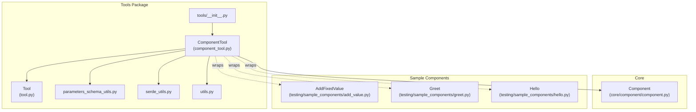
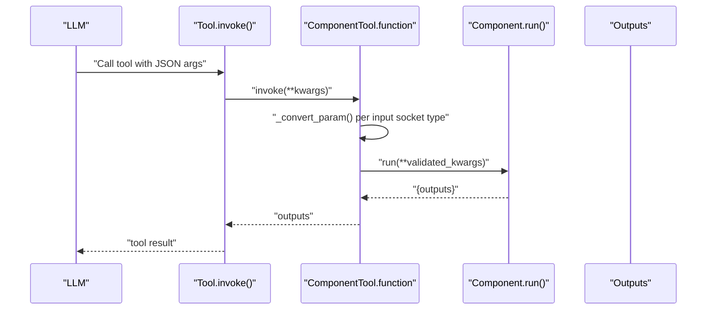
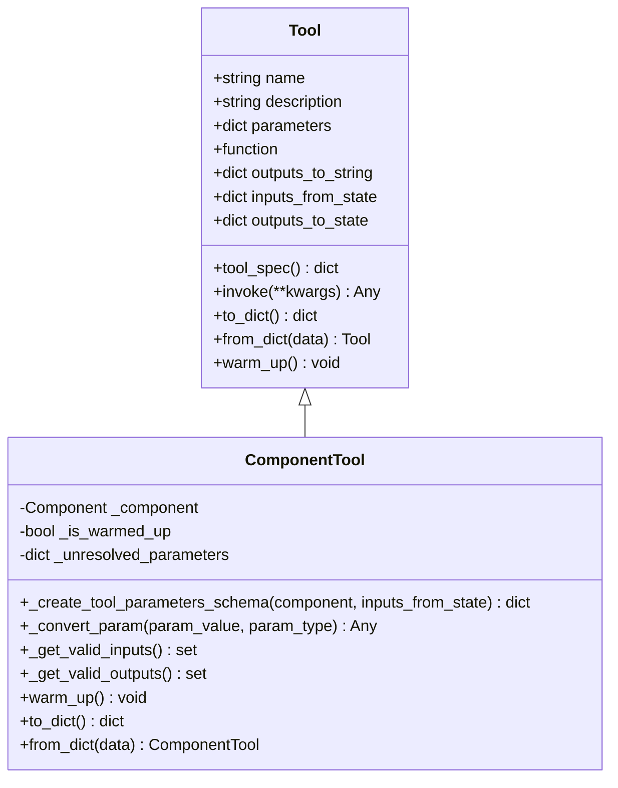
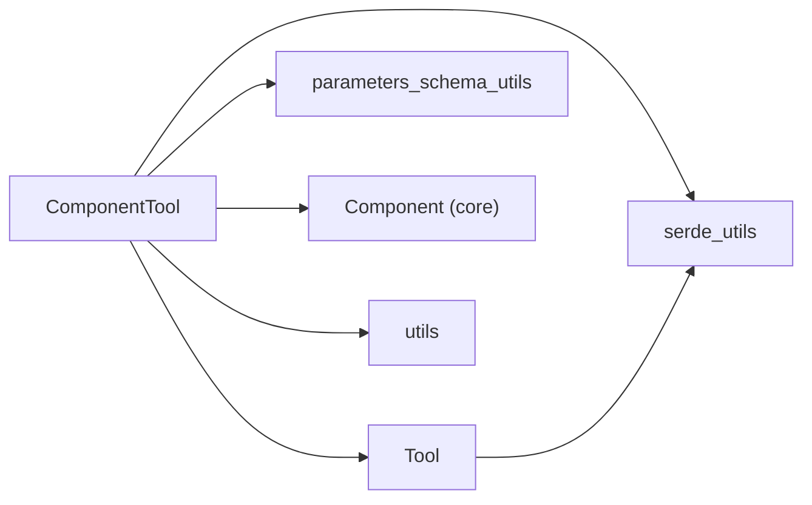

# ComponentTool Integration

<cite>
**Referenced Files in This Document**
- [component_tool.py](file://haystack/tools/component_tool.py)
- [tool.py](file://haystack/tools/tool.py)
- [parameters_schema_utils.py](file://haystack/tools/parameters_schema_utils.py)
- [serde_utils.py](file://haystack/tools/serde_utils.py)
- [utils.py](file://haystack/tools/utils.py)
- [__init__.py](file://haystack/tools/__init__.py)
- [component.py](file://haystack/core/component/component.py)
- [add_value.py](file://haystack/testing/sample_components/add_value.py)
- [greet.py](file://haystack/testing/sample_components/greet.py)
- [hello.py](file://haystack/testing/sample_components/hello.py)
</cite>

## Table of Contents
1. [Introduction](#introduction)
2. [Project Structure](#project-structure)
3. [Core Components](#core-components)
4. [Architecture Overview](#architecture-overview)
5. [Detailed Component Analysis](#detailed-component-analysis)
6. [Dependency Analysis](#dependency-analysis)
7. [Performance Considerations](#performance-considerations)
8. [Troubleshooting Guide](#troubleshooting-guide)
9. [Conclusion](#conclusion)
10. [Appendices](#appendices)

## Introduction
ComponentTool enables using Haystack components as tools for LLMs by bridging component input sockets and outputs to tool schemas and invocations. It automatically generates JSON schemas from component signatures, validates parameters, converts types, and integrates with component validation and warm-up mechanisms. This document explains how ComponentTool works, how to convert common Haystack components (generators, retrievers, embedders) into tools, and how to manage serialization/deserialization and resource initialization.

## Project Structure
ComponentTool resides in the tools package and builds upon the core Tool abstraction and the core component system. It leverages:
- Tool base class for schema validation, invocation, and serialization
- Component introspection to derive input/output sockets and types
- Utilities for schema generation and type resolution
- Serialization helpers for tools and toolsets

**Diagram sources**
- [component_tool.py](file://haystack/tools/component_tool.py#L37-L395)
- [tool.py](file://haystack/tools/tool.py#L18-L405)
- [parameters_schema_utils.py](file://haystack/tools/parameters_schema_utils.py#L1-L229)
- [serde_utils.py](file://haystack/tools/serde_utils.py#L1-L83)
- [utils.py](file://haystack/tools/utils.py#L1-L65)
- [__init__.py](file://haystack/tools/__init__.py#L1-L41)
- [component.py](file://haystack/core/component/component.py#L137-L645)
- [add_value.py](file://haystack/testing/sample_components/add_value.py#L8-L25)
- [greet.py](file://haystack/testing/sample_components/greet.py#L13-L47)
- [hello.py](file://haystack/testing/sample_components/hello.py#L8-L14)

**Section sources**
- [component_tool.py](file://haystack/tools/component_tool.py#L1-L395)
- [tool.py](file://haystack/tools/tool.py#L1-L405)
- [parameters_schema_utils.py](file://haystack/tools/parameters_schema_utils.py#L1-L229)
- [serde_utils.py](file://haystack/tools/serde_utils.py#L1-L83)
- [utils.py](file://haystack/tools/utils.py#L1-L65)
- [__init__.py](file://haystack/tools/__init__.py#L1-L41)
- [component.py](file://haystack/core/component/component.py#L1-L645)
- [add_value.py](file://haystack/testing/sample_components/add_value.py#L1-L25)
- [greet.py](file://haystack/testing/sample_components/greet.py#L1-L47)
- [hello.py](file://haystack/testing/sample_components/hello.py#L1-L14)

## Core Components
- ComponentTool: Wraps a Haystack Component into a Tool with automatic JSON schema generation, parameter conversion, and invocation bridging.
- Tool: Base class providing schema validation, invocation, warm-up lifecycle, and serialization utilities.
- parameters_schema_utils: Extracts parameter descriptions, resolves types, and converts dataclasses to Pydantic models for JSON schema generation.
- serde_utils: Serializes and deserializes tools and toolsets, including polymorphic reconstruction.
- utils: Helpers for warming up tools and flattening mixed tool/toolset structures.

Key capabilities:
- Automatic JSON schema generation from component run method signatures and input sockets
- Type conversion and validation for component inputs
- Support for dataclasses, lists of dataclasses, basic types, and unions
- Validation of outputs_to_state and outputs_to_string configurations
- Serialization/deserialization of wrapped components with warm-up handling

**Section sources**
- [component_tool.py](file://haystack/tools/component_tool.py#L37-L395)
- [tool.py](file://haystack/tools/tool.py#L18-L405)
- [parameters_schema_utils.py](file://haystack/tools/parameters_schema_utils.py#L23-L229)
- [serde_utils.py](file://haystack/tools/serde_utils.py#L16-L83)
- [utils.py](file://haystack/tools/utils.py#L14-L65)

## Architecture Overview
ComponentTool composes a Tool with a component_invoker that:
- Reads component input sockets to build a typed parameter map
- Converts LLM-provided parameters to component types using type adapters and dataclass constructors
- Invokes component.run with validated parameters
- Returns component outputs to Tool consumers

**Diagram sources**
- [tool.py](file://haystack/tools/tool.py#L261-L271)
- [component_tool.py](file://haystack/tools/component_tool.py#L188-L206)

## Detailed Component Analysis

### ComponentTool Class
ComponentTool extends Tool and adds:
- Automatic schema generation from component input sockets
- Parameter conversion from tool format to component format
- Validation of inputs_from_state and outputs_to_state
- Serialization/deserialization of the wrapped component
- Warm-up delegation to the underlying component

**Diagram sources**
- [tool.py](file://haystack/tools/tool.py#L18-L405)
- [component_tool.py](file://haystack/tools/component_tool.py#L37-L395)

Key behaviors:
- Constructor validates that the object is a Component, not yet added to a pipeline, and constructs a function wrapper around component.run with type conversion.
- _create_tool_parameters_schema builds a Pydantic model from component input sockets and converts it to a JSON schema, skipping Callable types and removing redundant titles.
- _convert_param unwraps Optional types, supports lists of dataclasses, and uses TypeAdapter for validation.
- _get_valid_inputs/_get_valid_outputs validate configuration against component input/output sockets.
- warm_up delegates to the underlying component if it has a warm_up method.
- to_dict/from_dict serialize the Tool metadata and the wrapped component, including handlers and state mappings.

**Section sources**
- [component_tool.py](file://haystack/tools/component_tool.py#L99-L395)

### Tool Base Class
Tool provides:
- JSON schema validation for parameters
- Configuration validation for outputs_to_state and outputs_to_string
- Invocation with error wrapping
- Serialization/deserialization of function and handlers
- Warm-up hook for resource-intensive initialization

Validation highlights:
- Rejects async functions
- Validates JSON schema compliance
- Ensures outputs_to_state references valid outputs and handlers are callable
- Enforces correct structure for outputs_to_string (single vs multiple output formats)

**Section sources**
- [tool.py](file://haystack/tools/tool.py#L103-L242)

### Schema Generation and Type Resolution
- _get_component_param_descriptions extracts parameter descriptions from component docstrings and enhances SuperComponent descriptions by aggregating upstream component descriptions.
- _resolve_type converts complex type annotations to Pydantic-compatible types, including dataclasses to Pydantic models, unions, lists, sequences, and dicts.
- _contains_callable_type skips Callable types during schema generation since they cannot be serialized to JSON schema.
- _remove_title_from_schema removes redundant titles post-generation.

**Section sources**
- [parameters_schema_utils.py](file://haystack/tools/parameters_schema_utils.py#L62-L229)

### Serialization and Deserialization
- Tool.to_dict serializes function and handlers, and handles outputs_to_state/outputs_to_string transformations.
- Tool.from_dict reconstructs callables and deserializes state mappings.
- serde_utils.serialize_tools_or_toolset and deserialize_tools_or_toolset_inplace support polymorphic serialization of mixed tool/toolset lists and single toolsets.
- ComponentTool.to_dict/from_dict serialize the wrapped component using core serialization utilities and restore handlers.

**Section sources**
- [tool.py](file://haystack/tools/tool.py#L273-L309)
- [serde_utils.py](file://haystack/tools/serde_utils.py#L16-L83)
- [component_tool.py](file://haystack/tools/component_tool.py#L266-L307)

### Parameter Transformation and Output Processing
- Tool-level configuration:
  - inputs_from_state maps state keys to tool parameter names
  - outputs_to_state maps tool outputs to state keys with optional handlers
  - outputs_to_string controls how tool results are converted to strings or raw results
- ComponentTool-specific:
  - _convert_param supports nested dataclasses, lists, and union types
  - _unwrap_optional handles Optional-like unions
  - Component outputs are returned as-is to Tool consumers

**Section sources**
- [tool.py](file://haystack/tools/tool.py#L70-L194)
- [component_tool.py](file://haystack/tools/component_tool.py#L368-L394)

## Dependency Analysis
ComponentTool depends on:
- Tool for schema validation, invocation, and serialization
- parameters_schema_utils for type resolution and schema generation
- Core component introspection for input/output sockets
- Serialization utilities for component persistence

**Diagram sources**
- [component_tool.py](file://haystack/tools/component_tool.py#L1-L35)
- [tool.py](file://haystack/tools/tool.py#L1-L16)
- [parameters_schema_utils.py](file://haystack/tools/parameters_schema_utils.py#L1-L18)
- [serde_utils.py](file://haystack/tools/serde_utils.py#L1-L11)
- [utils.py](file://haystack/tools/utils.py#L1-L12)

**Section sources**
- [component_tool.py](file://haystack/tools/component_tool.py#L1-L35)
- [tool.py](file://haystack/tools/tool.py#L1-L16)
- [parameters_schema_utils.py](file://haystack/tools/parameters_schema_utils.py#L1-L18)
- [serde_utils.py](file://haystack/tools/serde_utils.py#L1-L11)
- [utils.py](file://haystack/tools/utils.py#L1-L12)

## Performance Considerations
- Schema generation occurs at construction time; keep component docstrings concise and avoid overly complex type annotations to minimize overhead.
- Type conversion uses TypeAdapter and dataclass.from_dict; prefer simple, serializable types for frequently used parameters.
- warm_up is idempotent and may be called multiple times; ensure component warm_up avoids double-initialization.
- For large toolsets, use tools/utils.warm_up_tools to initialize resources efficiently.

[No sources needed since this section provides general guidance]

## Troubleshooting Guide
Common issues and resolutions:
- Invalid JSON schema: Ensure parameters conform to JSON schema standards; Tool validates schemas at construction.
- Unknown inputs_from_state or outputs_to_state: ComponentTool validates against component input/output sockets; fix typos or unsupported keys.
- Async function error: Tool rejects coroutine functions; ensure the component_invoker is synchronous.
- Callable types in schema: Callable parameters are skipped during schema generation; adjust component signatures accordingly.
- Duplicate tool names: Use distinct names or rely on auto-generated names.

**Section sources**
- [tool.py](file://haystack/tools/tool.py#L103-L194)
- [component_tool.py](file://haystack/tools/component_tool.py#L170-L183)
- [parameters_schema_utils.py](file://haystack/tools/parameters_schema_utils.py#L23-L44)

## Conclusion
ComponentTool seamlessly bridges Haystack components and LLM tool calling by generating accurate JSON schemas from component signatures, validating and converting parameters, and integrating with component lifecycle and serialization. It supports flexible output processing and robust configuration validation, enabling reliable tool usage across diverse components like generators, retrievers, and embedders.

[No sources needed since this section summarizes without analyzing specific files]

## Appendices

### Practical Examples: Converting Common Components to Tools
Below are conceptual examples of how to convert typical Haystack components into tools. Replace the placeholders with actual component instances and adjust parameters according to your needs.

- Generator tool (conceptual):
  - Wrap a generator component with ComponentTool
  - Configure inputs_from_state to map query from pipeline state
  - Use outputs_to_state to capture generated replies
  - Optionally set outputs_to_string to format results

- Retriever tool (conceptual):
  - Wrap a retriever component with ComponentTool
  - Map query from state to the retriever’s query parameter
  - Capture retrieved documents via outputs_to_state
  - Apply a formatter via outputs_to_string if needed

- Embedder tool (conceptual):
  - Wrap an embedder component with ComponentTool
  - Map text inputs from state
  - Store embeddings in outputs_to_state
  - Use outputs_to_string for summary if desired

These examples illustrate the general pattern: construct the component, create ComponentTool with appropriate mappings, and configure outputs and serialization as needed.

[No sources needed since this section provides conceptual examples]