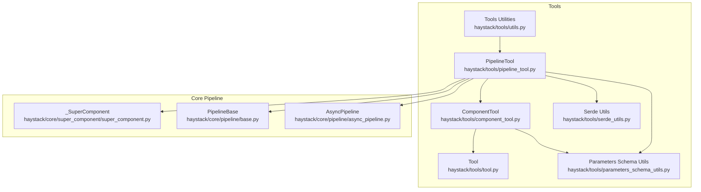
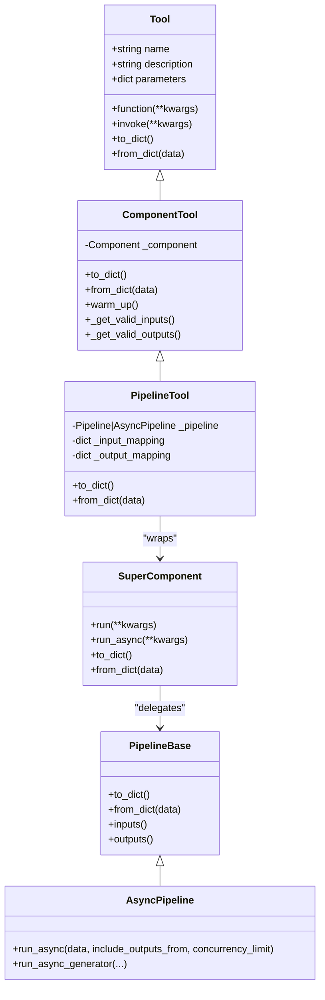
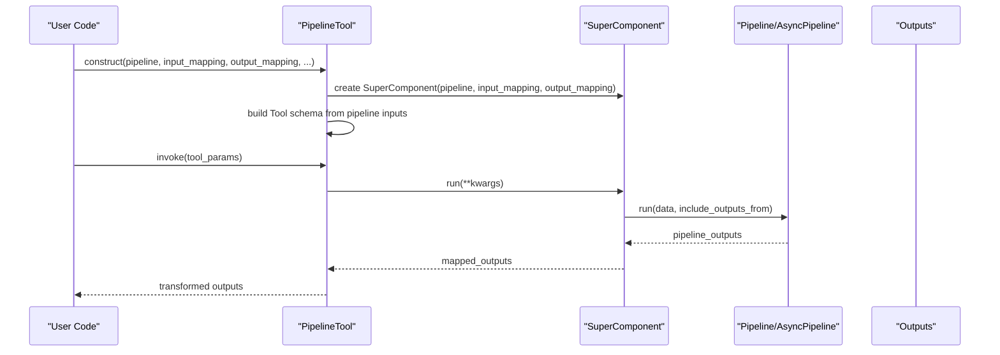
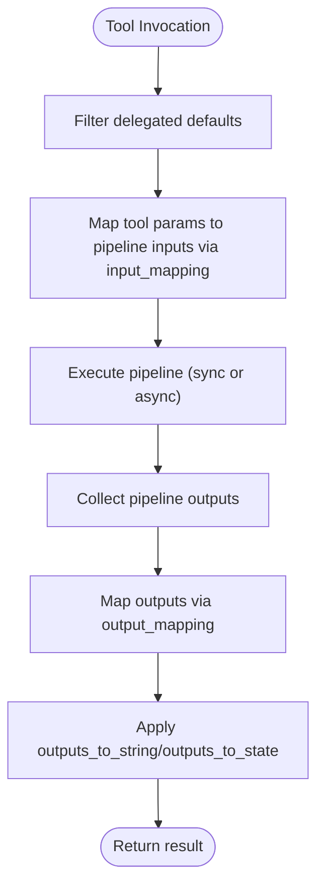
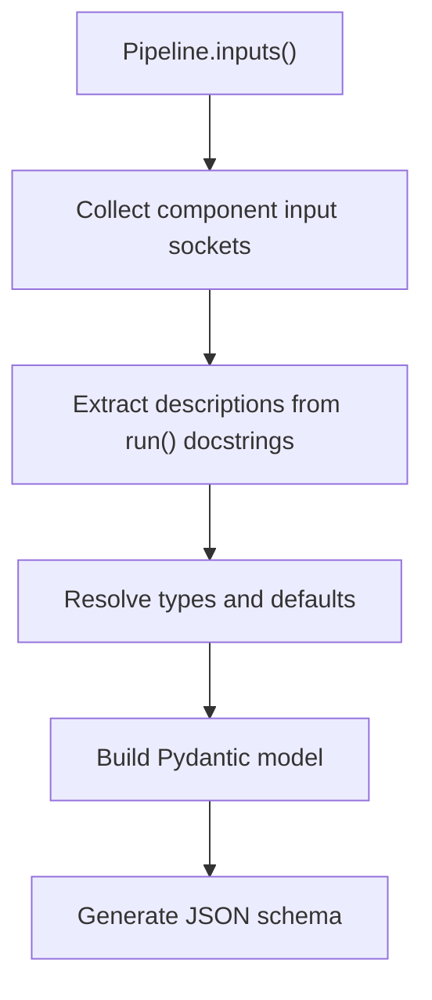
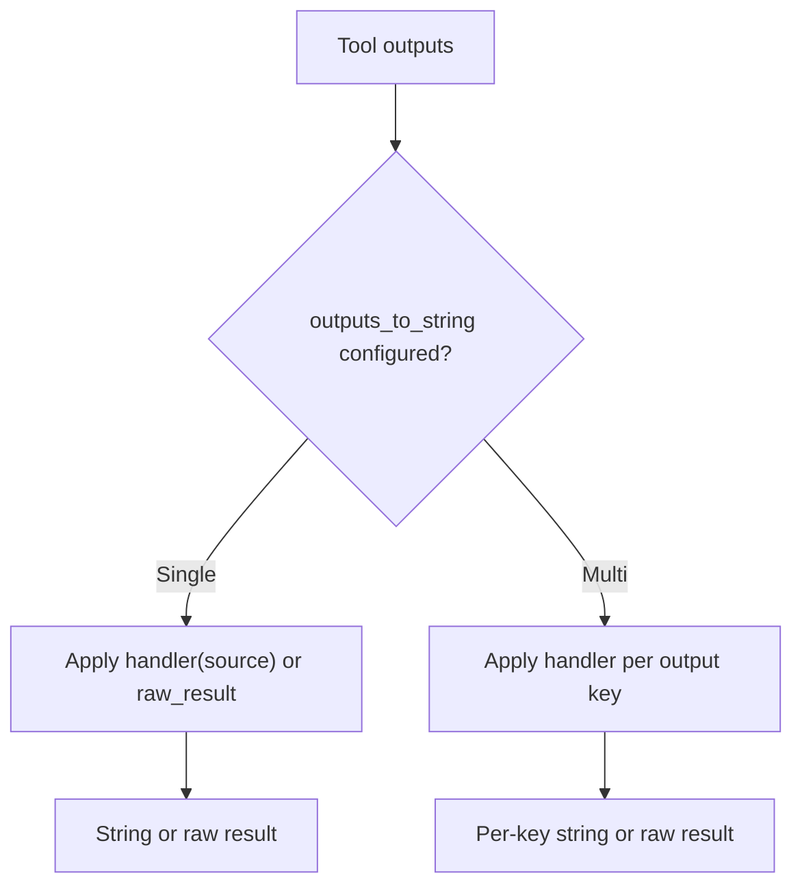
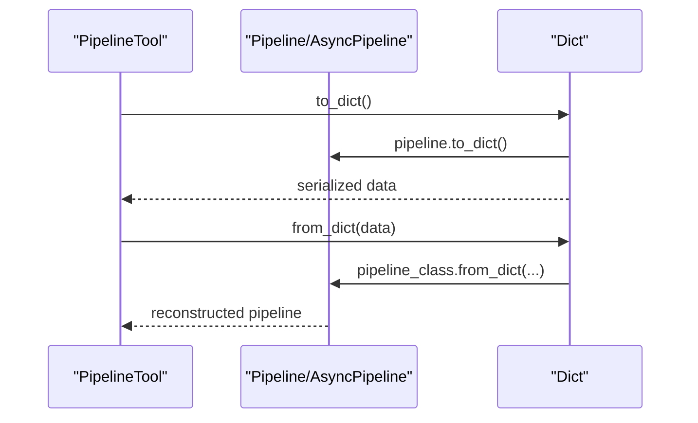
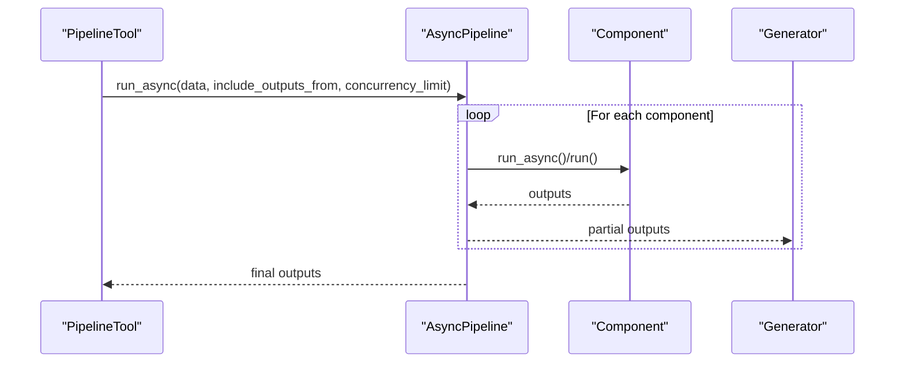
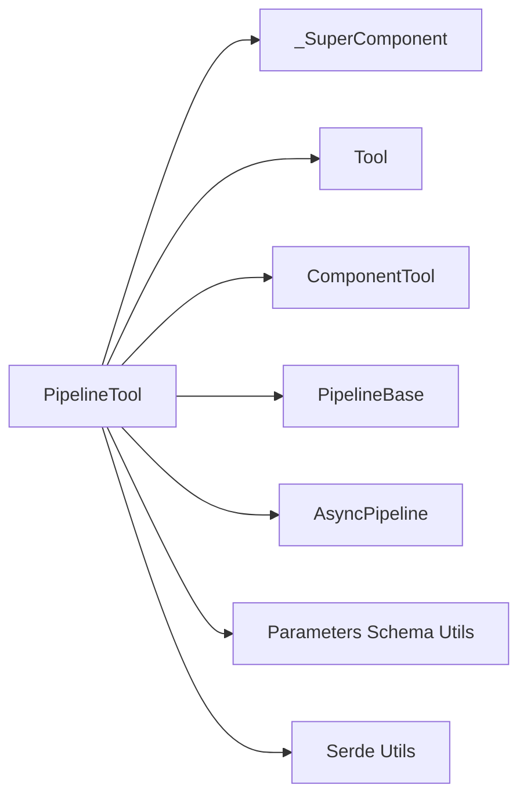

# PipelineTool Execution

<cite>
**Referenced Files in This Document**
- [pipeline_tool.py](file://haystack/tools/pipeline_tool.py)
- [tool.py](file://haystack/tools/tool.py)
- [component_tool.py](file://haystack/tools/component_tool.py)
- [parameters_schema_utils.py](file://haystack/tools/parameters_schema_utils.py)
- [super_component.py](file://haystack/core/super_component/super_component.py)
- [base.py](file://haystack/core/pipeline/base.py)
- [async_pipeline.py](file://haystack/core/pipeline/async_pipeline.py)
- [test_pipeline_tool.py](file://test/tools/test_pipeline_tool.py)
- [utils.py](file://haystack/tools/utils.py)
- [serde_utils.py](file://haystack/tools/serde_utils.py)
</cite>

## Table of Contents
1. [Introduction](#introduction)
2. [Project Structure](#project-structure)
3. [Core Components](#core-components)
4. [Architecture Overview](#architecture-overview)
5. [Detailed Component Analysis](#detailed-component-analysis)
6. [Dependency Analysis](#dependency-analysis)
7. [Performance Considerations](#performance-considerations)
8. [Troubleshooting Guide](#troubleshooting-guide)
9. [Conclusion](#conclusion)
10. [Appendices](#appendices)

## Introduction
This document explains how PipelineTool executes complex pipelines as single tools, focusing on:
- Input preparation and mapping from tool parameters to pipeline inputs
- Pipeline execution (sync and async) and result aggregation
- Serialization and deserialization of PipelineTool and its underlying pipeline
- Input/output transformation mechanisms for converting tool parameters to pipeline inputs and pipeline outputs to tool results
- Tool specification generation from pipeline structure, including dynamic parameter discovery
- Examples of creating tools from multi-step pipelines, handling pipeline breakpoints, and managing pipeline-specific configuration
- Error handling, timeout management, and performance considerations

## Project Structure
PipelineTool is part of the tools subsystem and integrates with the core pipeline orchestration engine. The key files involved are:
- PipelineTool implementation and lifecycle
- Generic Tool base class and serialization utilities
- ComponentTool for single-component wrapping (used by PipelineTool internally)
- SuperComponent that wraps a Pipeline into a single component
- Pipeline base and async pipeline implementations
- Tests validating behavior and examples

**Diagram sources**
- [pipeline_tool.py](file://haystack/tools/pipeline_tool.py#L21-L258)
- [component_tool.py](file://haystack/tools/component_tool.py#L37-L395)
- [tool.py](file://haystack/tools/tool.py#L18-L405)
- [parameters_schema_utils.py](file://haystack/tools/parameters_schema_utils.py#L62-L154)
- [super_component.py](file://haystack/core/super_component/super_component.py#L35-L627)
- [base.py](file://haystack/core/pipeline/base.py#L81-L800)
- [async_pipeline.py](file://haystack/core/pipeline/async_pipeline.py#L27-L714)
- [utils.py](file://haystack/tools/utils.py#L14-L65)
- [serde_utils.py](file://haystack/tools/serde_utils.py#L16-L83)

**Section sources**
- [pipeline_tool.py](file://haystack/tools/pipeline_tool.py#L1-L258)
- [base.py](file://haystack/core/pipeline/base.py#L1-L800)
- [async_pipeline.py](file://haystack/core/pipeline/async_pipeline.py#L1-L714)

## Core Components
- PipelineTool: Wraps a Pipeline or AsyncPipeline as a Tool, generating a tool schema from pipeline inputs and mapping inputs/outputs for LLM tool calling.
- ComponentTool: Base class for wrapping a single Component as a Tool; PipelineTool composes a SuperComponent around the pipeline and delegates to ComponentTool.
- SuperComponent: A component that wraps a Pipeline or AsyncPipeline, exposing a unified input/output surface with configurable mappings.
- Tool: Generic tool abstraction with validation, serialization, and invocation semantics.
- Parameters Schema Utils: Utility functions to extract parameter descriptions and build JSON schemas from component/pipeline inputs.
- AsyncPipeline: Asynchronous pipeline execution engine with concurrency control and breakpoint support.

Key responsibilities:
- Input mapping: Map tool parameters to pipeline component inputs via SuperComponent input_mapping.
- Output mapping: Map pipeline outputs to tool outputs via SuperComponent output_mapping.
- Tool schema generation: Derive JSON schema from pipeline inputs and docstrings.
- Serialization: Persist PipelineTool and its pipeline to/from dictionaries, including async pipeline detection.
- Invocation: Execute the pipeline and transform outputs according to outputs_to_string and outputs_to_state.

**Section sources**
- [pipeline_tool.py](file://haystack/tools/pipeline_tool.py#L21-L258)
- [component_tool.py](file://haystack/tools/component_tool.py#L37-L395)
- [super_component.py](file://haystack/core/super_component/super_component.py#L35-L627)
- [tool.py](file://haystack/tools/tool.py#L18-L405)
- [parameters_schema_utils.py](file://haystack/tools/parameters_schema_utils.py#L62-L154)
- [async_pipeline.py](file://haystack/core/pipeline/async_pipeline.py#L27-L714)

## Architecture Overview
PipelineTool composes a SuperComponent around a Pipeline or AsyncPipeline. The SuperComponent exposes a unified interface with:
- Input types derived from pipeline inputs and consolidated via input_mapping
- Output types derived from pipeline outputs and mapped via output_mapping

During tool invocation, PipelineTool:
1. Prepares inputs by filtering out delegated defaults and mapping tool parameters to pipeline component inputs
2. Executes the pipeline (sync or async)
3. Aggregates outputs and applies output transformations

**Diagram sources**
- [tool.py](file://haystack/tools/tool.py#L18-L405)
- [component_tool.py](file://haystack/tools/component_tool.py#L37-L395)
- [pipeline_tool.py](file://haystack/tools/pipeline_tool.py#L21-L258)
- [super_component.py](file://haystack/core/super_component/super_component.py#L35-L627)
- [base.py](file://haystack/core/pipeline/base.py#L81-L800)
- [async_pipeline.py](file://haystack/core/pipeline/async_pipeline.py#L27-L714)

## Detailed Component Analysis

### PipelineTool: Construction, Serialization, and Invocation
- Construction:
  - Validates pipeline type (Pipeline or AsyncPipeline)
  - Wraps the pipeline inside a SuperComponent with optional input_mapping and output_mapping
  - Delegates to ComponentTool to create a Tool with a function that invokes the SuperComponent
- Serialization:
  - Serializes the underlying pipeline (to_dict), plus tool metadata
  - Stores is_pipeline_async flag to distinguish sync vs async during deserialization
  - Handles outputs_to_state and outputs_to_string serialization via shared helpers
- Deserialization:
  - Recovers the pipeline type from is_pipeline_async
  - Reconstructs the pipeline from_dict
  - Restores outputs_to_state and outputs_to_string

**Diagram sources**
- [pipeline_tool.py](file://haystack/tools/pipeline_tool.py#L101-L209)
- [super_component.py](file://haystack/core/super_component/super_component.py#L109-L127)
- [base.py](file://haystack/core/pipeline/base.py#L677-L721)
- [async_pipeline.py](file://haystack/core/pipeline/async_pipeline.py#L589-L714)

**Section sources**
- [pipeline_tool.py](file://haystack/tools/pipeline_tool.py#L101-L258)
- [super_component.py](file://haystack/core/super_component/super_component.py#L109-L154)

### Input Preparation and Mapping
- Input mapping:
  - input_mapping maps tool parameter names to one or more pipeline component inputs
  - SuperComponent consolidates types and defaults across mapped inputs
  - During run, PipelineTool filters out delegated defaults and builds pipeline_inputs
- Output mapping:
  - output_mapping maps pipeline output sockets to tool output names
  - SuperComponent aggregates pipeline_outputs into tool outputs

**Diagram sources**
- [super_component.py](file://haystack/core/super_component/super_component.py#L340-L378)
- [pipeline_tool.py](file://haystack/tools/pipeline_tool.py#L120-L136)

**Section sources**
- [super_component.py](file://haystack/core/super_component/super_component.py#L171-L249)
- [super_component.py](file://haystack/core/super_component/super_component.py#L340-L378)

### Tool Specification Generation from Pipeline Structure
- Dynamic parameter discovery:
  - Pipeline inputs are discovered via pipeline.inputs()
  - Parameter descriptions are extracted from component docstrings
  - For SuperComponent, descriptions are enhanced by collecting descriptions from mapped components
- JSON schema generation:
  - Uses Pydantic models to build a JSON schema for the tool’s parameters
  - Skips Callable types and resolves complex types (dataclasses, unions, lists)
  - Removes redundant title fields from schema

**Diagram sources**
- [parameters_schema_utils.py](file://haystack/tools/parameters_schema_utils.py#L62-L154)
- [base.py](file://haystack/core/pipeline/base.py#L677-L721)

**Section sources**
- [parameters_schema_utils.py](file://haystack/tools/parameters_schema_utils.py#L62-L154)
- [component_tool.py](file://haystack/tools/component_tool.py#L309-L354)

### Input/Output Transformation Mechanisms
- inputs_from_state: Maps state keys to tool parameters (validated against tool parameters)
- outputs_to_state: Maps tool outputs to state keys with optional handlers
- outputs_to_string: Controls how tool outputs are converted to strings or raw results
  - Supports single-output and multi-output configurations
  - Handlers can be serialized/deserialized via callable serialization utilities

**Diagram sources**
- [tool.py](file://haystack/tools/tool.py#L40-L93)
- [tool.py](file://haystack/tools/tool.py#L359-L404)

**Section sources**
- [tool.py](file://haystack/tools/tool.py#L40-L93)
- [tool.py](file://haystack/tools/tool.py#L327-L404)

### Pipeline Serialization and Deserialization
- PipelineTool.to_dict():
  - Serializes the pipeline (sync or async) and tool metadata
  - Stores is_pipeline_async to guide deserialization
- PipelineTool.from_dict():
  - Recovers pipeline type from is_pipeline_async
  - Reconstructs pipeline from_dict
  - Restores outputs_to_state and outputs_to_string

**Diagram sources**
- [pipeline_tool.py](file://haystack/tools/pipeline_tool.py#L210-L258)
- [base.py](file://haystack/core/pipeline/base.py#L148-L172)
- [async_pipeline.py](file://haystack/core/pipeline/async_pipeline.py#L27-L714)

**Section sources**
- [pipeline_tool.py](file://haystack/tools/pipeline_tool.py#L210-L258)
- [base.py](file://haystack/core/pipeline/base.py#L148-L172)

### Pipeline Execution: Sync and Async
- Sync execution:
  - Pipeline.run(data, include_outputs_from, ...) returns aggregated outputs
- Async execution:
  - AsyncPipeline.run_async(data, include_outputs_from, concurrency_limit)
  - AsyncPipeline.run_async_generator(...) yields partial outputs as components complete
- Concurrency and scheduling:
  - AsyncPipeline manages concurrency via semaphores and a priority queue
  - Supports breakpoints via BreakpointException

**Diagram sources**
- [async_pipeline.py](file://haystack/core/pipeline/async_pipeline.py#L472-L588)
- [async_pipeline.py](file://haystack/core/pipeline/async_pipeline.py#L103-L471)

**Section sources**
- [async_pipeline.py](file://haystack/core/pipeline/async_pipeline.py#L472-L588)
- [async_pipeline.py](file://haystack/core/pipeline/async_pipeline.py#L103-L471)

### Handling Pipeline Breakpoints
- Breakpoints:
  - AsyncPipeline._run_component_async checks for BreakpointException on visit counts
  - Triggers BreakpointException when a breakpoint is hit
- Practical use:
  - Configure include_outputs_from to control which component outputs are included
  - Use run_async_generator to stream partial results and react to breakpoints

**Section sources**
- [async_pipeline.py](file://haystack/core/pipeline/async_pipeline.py#L35-L102)

### Examples: Creating Tools from Multi-Step Pipelines
- Example scenarios covered in tests:
  - Creating a PipelineTool from a multi-step pipeline with input_mapping and output_mapping
  - Validating auto-generated tool parameters from pipeline inputs
  - Using both sync and async pipelines with real components
  - Validating inputs_from_state and outputs_to_state mappings

**Section sources**
- [test_pipeline_tool.py](file://test/tools/test_pipeline_tool.py#L96-L412)

## Dependency Analysis
- PipelineTool depends on:
  - SuperComponent to expose a unified interface for the pipeline
  - Tool and ComponentTool for tool schema generation and invocation
  - Parameters Schema Utils for dynamic parameter discovery
  - PipelineBase and AsyncPipeline for execution
  - Serialization utilities for callable and tool serialization

**Diagram sources**
- [pipeline_tool.py](file://haystack/tools/pipeline_tool.py#L1-L258)
- [super_component.py](file://haystack/core/super_component/super_component.py#L1-L627)
- [tool.py](file://haystack/tools/tool.py#L1-L405)
- [component_tool.py](file://haystack/tools/component_tool.py#L1-L395)
- [base.py](file://haystack/core/pipeline/base.py#L1-L800)
- [async_pipeline.py](file://haystack/core/pipeline/async_pipeline.py#L1-L714)
- [parameters_schema_utils.py](file://haystack/tools/parameters_schema_utils.py#L1-L229)
- [serde_utils.py](file://haystack/tools/serde_utils.py#L1-L83)

**Section sources**
- [pipeline_tool.py](file://haystack/tools/pipeline_tool.py#L1-L258)
- [super_component.py](file://haystack/core/super_component/super_component.py#L1-L627)
- [tool.py](file://haystack/tools/tool.py#L1-L405)
- [component_tool.py](file://haystack/tools/component_tool.py#L1-L395)
- [base.py](file://haystack/core/pipeline/base.py#L1-L800)
- [async_pipeline.py](file://haystack/core/pipeline/async_pipeline.py#L1-L714)
- [parameters_schema_utils.py](file://haystack/tools/parameters_schema_utils.py#L1-L229)
- [serde_utils.py](file://haystack/tools/serde_utils.py#L1-L83)

## Performance Considerations
- Concurrency control:
  - AsyncPipeline supports concurrency_limit to balance throughput and resource usage
- Partial outputs:
  - run_async_generator yields partial results, reducing latency for long pipelines
- Warm-up:
  - Tools and pipelines can be warmed up to reduce cold-start overhead
- Type conversion:
  - Efficient type resolution avoids unnecessary conversions; ensure input_mapping aligns with pipeline inputs to minimize recomputation

[No sources needed since this section provides general guidance]

## Troubleshooting Guide
Common issues and resolutions:
- Invalid pipeline type:
  - Ensure the pipeline is a Pipeline or AsyncPipeline instance
- Invalid mappings:
  - input_mapping and output_mapping must reference existing components and sockets
- Unknown parameters or outputs:
  - inputs_from_state and outputs_to_state must reference valid tool parameters and outputs
- Serialization errors:
  - Ensure callable handlers are serializable; use provided serialization helpers
- Breakpoints:
  - Configure breakpoints appropriately; AsyncPipeline will raise BreakpointException when triggered

**Section sources**
- [pipeline_tool.py](file://haystack/tools/pipeline_tool.py#L190-L195)
- [super_component.py](file://haystack/core/super_component/super_component.py#L171-L202)
- [super_component.py](file://haystack/core/super_component/super_component.py#L270-L291)
- [tool.py](file://haystack/tools/tool.py#L118-L194)
- [test_pipeline_tool.py](file://test/tools/test_pipeline_tool.py#L365-L412)

## Conclusion
PipelineTool provides a powerful abstraction to treat complex pipelines as single tools for LLMs. It achieves this by:
- Automatically generating tool schemas from pipeline inputs
- Managing input/output mappings via SuperComponent
- Executing pipelines synchronously or asynchronously with concurrency control
- Supporting serialization/deserialization and transformation of tool outputs
- Enabling breakpoint-driven execution and partial result streaming

By leveraging these capabilities, developers can compose multi-step pipelines into cohesive tools with robust error handling and performance characteristics.

## Appendices
- Related utilities:
  - Tools warm-up and flattening helpers
  - Tools serialization/deserialization utilities

**Section sources**
- [utils.py](file://haystack/tools/utils.py#L14-L65)
- [serde_utils.py](file://haystack/tools/serde_utils.py#L16-L83)