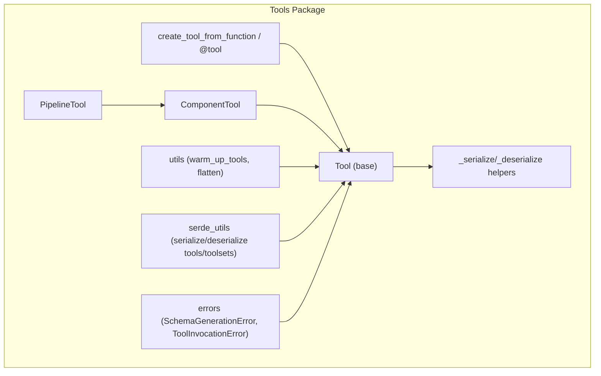
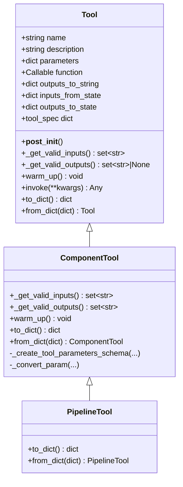
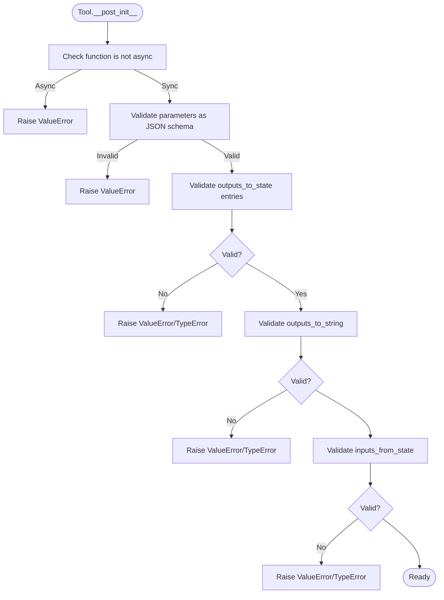
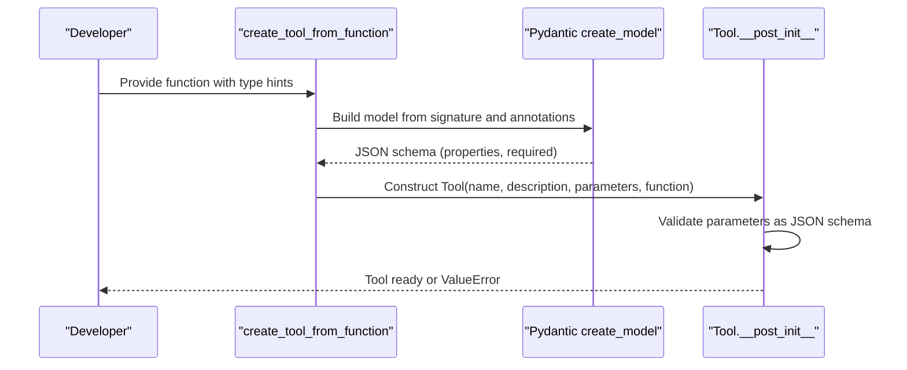
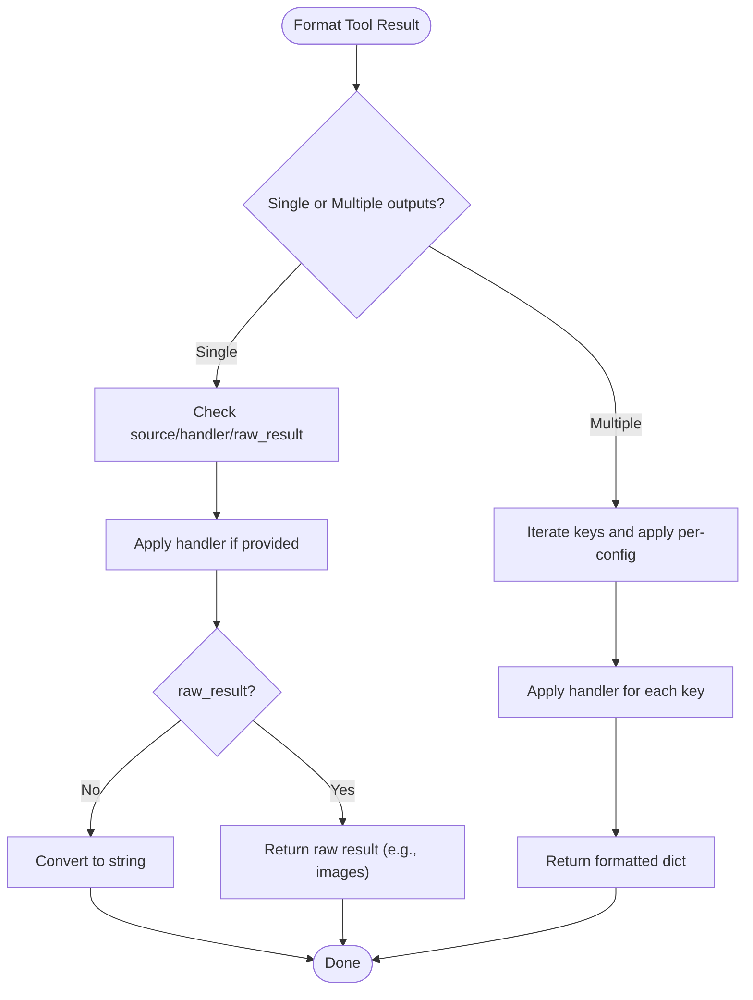
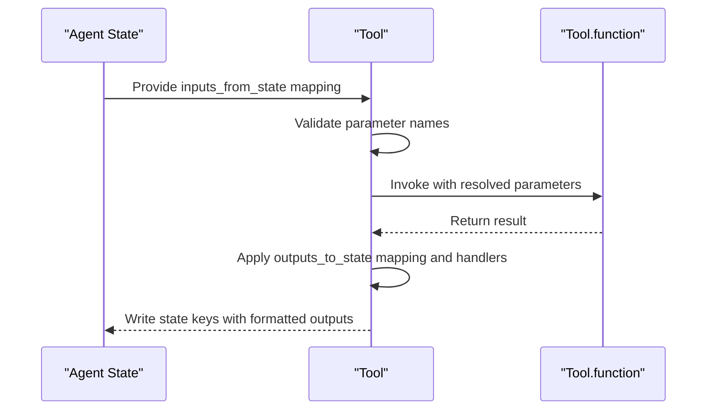
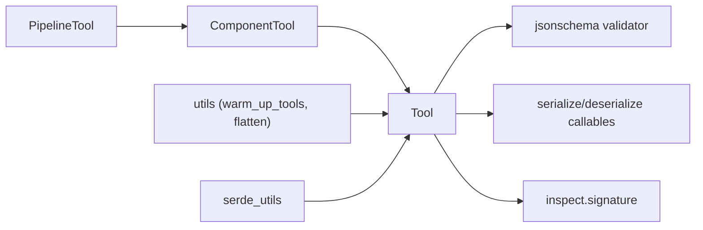

# Tool Base Class

<cite>
**Referenced Files in This Document**
- [tool.py](file://haystack/tools/tool.py)
- [__init__.py](file://haystack/tools/__init__.py)
- [from_function.py](file://haystack/tools/from_function.py)
- [component_tool.py](file://haystack/tools/component_tool.py)
- [pipeline_tool.py](file://haystack/tools/pipeline_tool.py)
- [parameters_schema_utils.py](file://haystack/tools/parameters_schema_utils.py)
- [utils.py](file://haystack/tools/utils.py)
- [serde_utils.py](file://haystack/tools/serde_utils.py)
- [errors.py](file://haystack/tools/errors.py)
- [test_tool.py](file://test/tools/test_tool.py)
- [test_from_function.py](file://test/tools/test_from_function.py)
</cite>

## Table of Contents
1. [Introduction](#introduction)
2. [Project Structure](#project-structure)
3. [Core Components](#core-components)
4. [Architecture Overview](#architecture-overview)
5. [Detailed Component Analysis](#detailed-component-analysis)
6. [Dependency Analysis](#dependency-analysis)
7. [Performance Considerations](#performance-considerations)
8. [Troubleshooting Guide](#troubleshooting-guide)
9. [Conclusion](#conclusion)

## Introduction
This document provides a comprehensive guide to the Tool base class used to expose capabilities to LLMs for function-style tool calling. It covers the Tool dataclass structure, JSON schema validation, automatic validation during construction, formatting of tool results via outputs_to_string, and integration with agent state via inputs_from_state and outputs_to_state. It also documents the tool_spec property for LLM consumption, the warm_up() method for resource-intensive initialization, and practical examples drawn from tests and tool creation utilities. Finally, it includes common configuration pitfalls and their solutions.

## Project Structure
The Tool ecosystem lives under the tools package and includes:
- Tool base class and serialization helpers
- Factory utilities to create tools from functions and decorators
- Specialized subclasses for components and pipelines
- Utilities for warming up tools and flattening tool collections
- Serialization utilities for tools and toolsets

**Diagram sources**
- [tool.py](file://haystack/tools/tool.py#L18-L405)
- [from_function.py](file://haystack/tools/from_function.py#L16-L324)
- [component_tool.py](file://haystack/tools/component_tool.py#L37-L395)
- [pipeline_tool.py](file://haystack/tools/pipeline_tool.py#L21-L258)
- [utils.py](file://haystack/tools/utils.py#L14-L65)
- [serde_utils.py](file://haystack/tools/serde_utils.py#L16-L83)
- [errors.py](file://haystack/tools/errors.py#L6-L22)

**Section sources**
- [__init__.py](file://haystack/tools/__init__.py#L9-L41)
- [tool.py](file://haystack/tools/tool.py#L18-L405)

## Core Components
- Tool: A dataclass that defines a callable capability for LLMs. It includes:
  - name: Tool name
  - description: Human-readable description
  - parameters: JSON schema defining accepted inputs
  - function: Synchronous function implementing the tool
  - outputs_to_string: Optional formatting configuration for results
  - inputs_from_state: Optional mapping from agent state to tool parameters
  - outputs_to_state: Optional mapping from tool outputs to agent state
- Validation and introspection:
  - Validates that function is synchronous
  - Validates parameters as a JSON schema
  - Validates outputs_to_state and outputs_to_string structures
  - Validates inputs_from_state parameter names against valid inputs
  - Provides _get_valid_inputs and _get_valid_outputs for subclasses
- LLM interface:
  - tool_spec exposes name, description, and parameters
- Lifecycle:
  - warm_up() for resource-intensive initialization (idempotent)
- Serialization:
  - to_dict/from_dict with callable and handler serialization

**Section sources**
- [tool.py](file://haystack/tools/tool.py#L18-L405)

## Architecture Overview
The Tool base class orchestrates three primary concerns:
- Parameter schema validation and introspection
- Result formatting and state integration
- Serialization and lifecycle management

**Diagram sources**
- [tool.py](file://haystack/tools/tool.py#L18-L405)
- [component_tool.py](file://haystack/tools/component_tool.py#L37-L395)
- [pipeline_tool.py](file://haystack/tools/pipeline_tool.py#L21-L258)

## Detailed Component Analysis

### Tool Dataclass and Construction Validation
- Fields and roles:
  - name, description, parameters, function are required
  - outputs_to_string, inputs_from_state, outputs_to_state are optional
- Post-construction validation (__post_init__):
  - Rejects async functions
  - Ensures parameters is a valid JSON schema
  - Validates outputs_to_state entries (type, handler callable, source string)
  - Validates outputs_to_string:
    - Single-output form: supports source, handler, raw_result at root
    - Multiple-output form: each key must define source and handler; raw_result not supported
  - Validates inputs_from_state:
    - Values must be strings (parameter names)
    - Parameter names must exist among valid inputs
- Introspection helpers:
  - _get_valid_inputs: union of function signature and schema properties
  - _get_valid_outputs: None by default; overridden by subclasses

**Diagram sources**
- [tool.py](file://haystack/tools/tool.py#L103-L194)

**Section sources**
- [tool.py](file://haystack/tools/tool.py#L18-L194)

### JSON Schema Validation for Tool Parameters
- The parameters field must be a valid JSON schema. The Tool constructor validates this using a schema validator and raises a ValueError if invalid.
- When creating tools from functions, the schema is generated from function signatures and annotations. Callable parameters are skipped to avoid unsupported types in JSON schema generation.

**Diagram sources**
- [from_function.py](file://haystack/tools/from_function.py#L16-L182)
- [tool.py](file://haystack/tools/tool.py#L112-L116)

**Section sources**
- [from_function.py](file://haystack/tools/from_function.py#L16-L182)
- [tool.py](file://haystack/tools/tool.py#L112-L116)

### Outputs Formatting with outputs_to_string
- Two forms are supported:
  - Single output:
    - Keys: source (optional), handler (optional), raw_result (optional, boolean)
    - If source is provided, only that output key is passed to handler; otherwise the entire result is passed
    - raw_result=True returns raw results (e.g., images) without string conversion, applying handler if present
  - Multiple outputs:
    - Keys map to dicts with source and/or handler
    - raw_result is not supported in this form
- Serialization helpers convert callables to serializable strings and back.

**Diagram sources**
- [tool.py](file://haystack/tools/tool.py#L40-L69)
- [tool.py](file://haystack/tools/tool.py#L139-L178)
- [tool.py](file://haystack/tools/tool.py#L359-L404)

**Section sources**
- [tool.py](file://haystack/tools/tool.py#L40-L69)
- [tool.py](file://haystack/tools/tool.py#L139-L178)
- [tool.py](file://haystack/tools/tool.py#L359-L404)

### Integrating Tools with Agent State: inputs_from_state and outputs_to_state
- inputs_from_state:
  - Maps state keys to tool parameter names
  - Validated to ensure parameter names exist among valid inputs
- outputs_to_state:
  - Maps tool outputs to state keys with optional handlers
  - Validated to ensure referenced output keys exist (subclasses override _get_valid_outputs)
- Serialization:
  - Handlers are serialized to strings and deserialized back to callables

**Diagram sources**
- [tool.py](file://haystack/tools/tool.py#L180-L194)
- [tool.py](file://haystack/tools/tool.py#L118-L138)
- [tool.py](file://haystack/tools/tool.py#L327-L356)

**Section sources**
- [tool.py](file://haystack/tools/tool.py#L70-L88)
- [tool.py](file://haystack/tools/tool.py#L118-L194)
- [tool.py](file://haystack/tools/tool.py#L327-L356)

### Tool Specification for LLM Consumption
- tool_spec exposes a minimal dict containing name, description, and parameters for LLM function calling.

**Section sources**
- [tool.py](file://haystack/tools/tool.py#L244-L249)

### Resource Initialization with warm_up()
- warm_up() is a no-op by default and should be overridden by subclasses for expensive initialization (e.g., connecting to external services, loading models).
- A convenience utility warms up tools or toolsets regardless of container type.

**Section sources**
- [tool.py](file://haystack/tools/tool.py#L251-L259)
- [utils.py](file://haystack/tools/utils.py#L14-L38)

### Serialization and Deserialization
- Tool implements to_dict/from_dict with special handling for callables and handlers.
- Serialization converts callables to qualified names; deserialization restores them.
- Toolsets and mixed lists are supported by dedicated utilities.

**Section sources**
- [tool.py](file://haystack/tools/tool.py#L273-L309)
- [tool.py](file://haystack/tools/tool.py#L359-L404)
- [serde_utils.py](file://haystack/tools/serde_utils.py#L16-L83)

### Creating Tools from Functions and Decorators
- create_tool_from_function builds a Tool from a function:
  - Extracts type hints and docstrings
  - Skips Callable parameters
  - Generates JSON schema and removes redundant titles
- The @tool decorator is a convenient wrapper around the same logic.

**Section sources**
- [from_function.py](file://haystack/tools/from_function.py#L16-L182)
- [from_function.py](file://haystack/tools/from_function.py#L185-L301)

### Specialized Tools: ComponentTool and PipelineTool
- ComponentTool:
  - Wraps Haystack components and generates tool schemas from component input sockets
  - Validates inputs/outputs against component I/O
  - Supports warm_up delegation to the underlying component
- PipelineTool:
  - Wraps pipelines via a SuperComponent
  - Supports input_mapping and output_mapping for flexible integration

**Section sources**
- [component_tool.py](file://haystack/tools/component_tool.py#L37-L395)
- [pipeline_tool.py](file://haystack/tools/pipeline_tool.py#L21-L258)

## Dependency Analysis
- Tool depends on:
  - JSON schema validation for parameters
  - Callable serialization utilities for function and handler persistence
  - Inspect module for function signature introspection
- ComponentTool and PipelineTool extend Tool and add:
  - Schema generation from component signatures
  - Type conversion and validation for component inputs
  - Warm-up delegation to underlying components
- Utilities and serialization utilities coordinate tool lifecycle and persistence.

**Diagram sources**
- [tool.py](file://haystack/tools/tool.py#L5-L16)
- [component_tool.py](file://haystack/tools/component_tool.py#L22-L32)
- [pipeline_tool.py](file://haystack/tools/pipeline_tool.py#L10-L16)
- [utils.py](file://haystack/tools/utils.py#L14-L65)
- [serde_utils.py](file://haystack/tools/serde_utils.py#L16-L83)

**Section sources**
- [tool.py](file://haystack/tools/tool.py#L5-L16)
- [component_tool.py](file://haystack/tools/component_tool.py#L22-L32)
- [pipeline_tool.py](file://haystack/tools/pipeline_tool.py#L10-L16)
- [utils.py](file://haystack/tools/utils.py#L14-L65)
- [serde_utils.py](file://haystack/tools/serde_utils.py#L16-L83)

## Performance Considerations
- Prefer warm_up() for expensive initialization to avoid repeated setup costs during agent runs.
- Keep outputs_to_string handlers efficient; avoid heavy computations inside handlers.
- When using multiple outputs, limit the number of keys to reduce overhead.
- For ComponentTool and PipelineTool, reuse components and pipelines across invocations to benefit from warm-up.

## Troubleshooting Guide
Common configuration errors and resolutions:
- Async function used as tool:
  - Symptom: ValueError indicating async functions are not supported.
  - Resolution: Use a synchronous function.
  - Section sources
    - [tool.py](file://haystack/tools/tool.py#L105-L110)
    - [test_from_function.py](file://test/tools/test_from_function.py#L305-L321)
- Invalid JSON schema in parameters:
  - Symptom: ValueError stating parameters do not define a valid JSON schema.
  - Resolution: Fix schema structure or regenerate from function annotations.
  - Section sources
    - [tool.py](file://haystack/tools/tool.py#L112-L116)
    - [from_function.py](file://haystack/tools/from_function.py#L158-L162)
- outputs_to_state configuration errors:
  - Symptom: TypeError for non-dict config or ValueError for non-callable handler/source not a string.
  - Resolution: Ensure each config is a dict with string source and callable handler.
  - Section sources
    - [tool.py](file://haystack/tools/tool.py#L119-L127)
    - [test_tool.py](file://test/tools/test_tool.py#L56-L82)
- outputs_to_string configuration errors:
  - Symptom: ValueErrors for invalid keys or types; raw_result not supported in multiple output form.
  - Resolution: Use single-output form with source/handler/raw_result at root; or multiple-output form with per-key source/handler.
  - Section sources
    - [tool.py](file://haystack/tools/tool.py#L139-L178)
    - [test_tool.py](file://test/tools/test_tool.py#L83-L114)
- inputs_from_state errors:
  - Symptom: ValueError for unknown parameter names; TypeError for non-string values.
  - Resolution: Match state keys to actual tool parameter names; ensure values are strings.
  - Section sources
    - [tool.py](file://haystack/tools/tool.py#L180-L193)
    - [test_tool.py](file://test/tools/test_tool.py#L237-L262)
- Tool invocation failures:
  - Symptom: ToolInvocationError wrapping function call exceptions.
  - Resolution: Provide required parameters and correct types; check function logic.
  - Section sources
    - [tool.py](file://haystack/tools/tool.py#L261-L271)
    - [errors.py](file://haystack/tools/errors.py#L14-L22)
    - [test_tool.py](file://test/tools/test_tool.py#L130-L141)

## Conclusion
The Tool base class provides a robust foundation for exposing capabilities to LLMs with strong validation, flexible result formatting, and seamless integration with agent state. Specialized subclasses extend this foundation for components and pipelines, while utilities streamline lifecycle management and serialization. Following the validation rules and configuration patterns outlined here ensures reliable tool behavior in production scenarios.