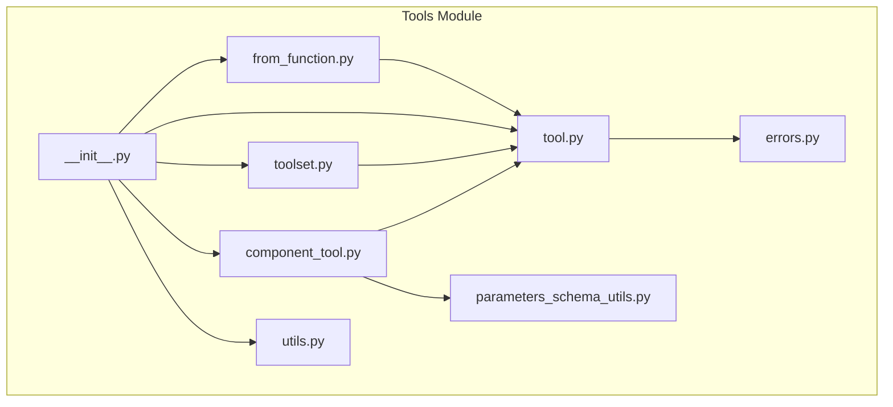
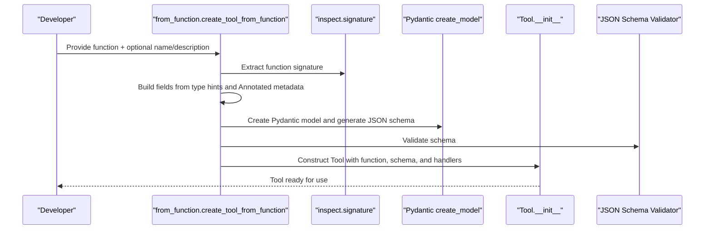
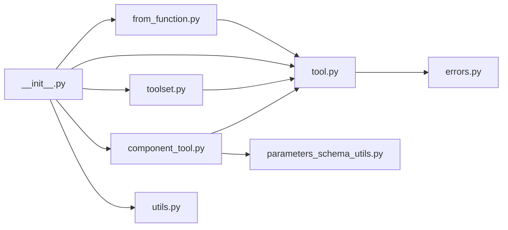

# Tool Creation and Best Practices

<cite>
**Referenced Files in This Document**
- [from_function.py](file://haystack/tools/from_function.py)
- [tool.py](file://haystack/tools/tool.py)
- [toolset.py](file://haystack/tools/toolset.py)
- [component_tool.py](file://haystack/tools/component_tool.py)
- [parameters_schema_utils.py](file://haystack/tools/parameters_schema_utils.py)
- [errors.py](file://haystack/tools/errors.py)
- [utils.py](file://haystack/tools/utils.py)
- [__init__.py](file://haystack/tools/__init__.py)
- [test_from_function.py](file://test/tools/test_from_function.py)
- [test_tool.py](file://test/tools/test_tool.py)
- [test_component_tool.py](file://test/tools/test_component_tool.py)
- [test_toolset.py](file://test/tools/test_toolset.py)
</cite>

## Table of Contents
1. [Introduction](#introduction)
2. [Project Structure](#project-structure)
3. [Core Components](#core-components)
4. [Architecture Overview](#architecture-overview)
5. [Detailed Component Analysis](#detailed-component-analysis)
6. [Dependency Analysis](#dependency-analysis)
7. [Performance Considerations](#performance-considerations)
8. [Troubleshooting Guide](#troubleshooting-guide)
9. [Conclusion](#conclusion)
10. [Appendices](#appendices)

## Introduction
This document provides comprehensive guidance for creating robust and reusable tools in the Haystack ecosystem. It focuses on the from_function utility for converting Python functions into tools, including parameter inspection, schema generation, and result processing. It also covers tool naming conventions, description writing, parameter documentation best practices, error handling, input validation, output formatting, testing methodologies, security considerations, resource management, performance optimization, and documentation generation patterns.

## Project Structure
The tooling subsystem centers around a small set of modules that collaborate to enable automatic tool creation, schema generation, validation, serialization, and orchestration via Tool and Toolset abstractions.

**Diagram sources**
- [from_function.py](file://haystack/tools/from_function.py#L16-L182)
- [tool.py](file://haystack/tools/tool.py#L18-L405)
- [toolset.py](file://haystack/tools/toolset.py#L13-L365)
- [component_tool.py](file://haystack/tools/component_tool.py#L37-L395)
- [parameters_schema_utils.py](file://haystack/tools/parameters_schema_utils.py#L23-L229)
- [errors.py](file://haystack/tools/errors.py#L6-L22)
- [utils.py](file://haystack/tools/utils.py#L14-L65)
- [__init__.py](file://haystack/tools/__init__.py#L9-L40)

**Section sources**
- [__init__.py](file://haystack/tools/__init__.py#L9-L40)

## Core Components
- Tool: A dataclass representing a callable tool with a JSON schema for parameters, optional handlers for mapping inputs from state and outputs to state/string, and lifecycle hooks like warm_up and invoke.
- Toolset: A collection of Tool instances with validation, serialization, and convenience operations.
- ComponentTool: A specialized Tool that wraps Haystack Components, generating schemas from component input sockets and performing type conversions.
- from_function: Provides utilities to convert arbitrary Python functions into Tool instances, including automatic schema generation from type hints and Annotated metadata.
- parameters_schema_utils: Utilities for resolving complex types, extracting parameter descriptions from docstrings, and handling special cases like Callable types and Tool/Toolset placeholders.
- errors: Domain-specific exceptions for schema generation and tool invocation failures.
- utils: Helpers for warming up tools, flattening heterogeneous tool collections, and managing Tool/Toolset lifecycles.

Key capabilities:
- Automatic JSON schema generation from function signatures and Annotated metadata.
- Validation of configuration structures for inputs_from_state, outputs_to_state, and outputs_to_string.
- Serialization/deserialization of tools and toolsets, including callable handlers.
- Idempotent warm_up for resource-intensive initialization.

**Section sources**
- [tool.py](file://haystack/tools/tool.py#L18-L405)
- [toolset.py](file://haystack/tools/toolset.py#L13-L365)
- [component_tool.py](file://haystack/tools/component_tool.py#L37-L395)
- [from_function.py](file://haystack/tools/from_function.py#L16-L182)
- [parameters_schema_utils.py](file://haystack/tools/parameters_schema_utils.py#L23-L229)
- [errors.py](file://haystack/tools/errors.py#L6-L22)
- [utils.py](file://haystack/tools/utils.py#L14-L65)

## Architecture Overview
The tool creation pipeline integrates function introspection, schema generation, and validation into a cohesive workflow. ComponentTool extends this to support Haystack Components, bridging typed sockets and runtime type conversion.

**Diagram sources**
- [from_function.py](file://haystack/tools/from_function.py#L16-L182)
- [tool.py](file://haystack/tools/tool.py#L103-L117)

**Section sources**
- [from_function.py](file://haystack/tools/from_function.py#L16-L182)
- [tool.py](file://haystack/tools/tool.py#L103-L117)

## Detailed Component Analysis

### from_function Utility
Purpose:
- Convert a Python function into a Tool by inspecting its signature and generating a JSON schema from type hints and Annotated metadata.
- Support optional customization of name, description, and mapping of inputs from state and outputs to state/string.

Key behaviors:
- Parameter inspection: Iterates over function parameters, skipping Callable types and parameters mapped from state.
- Schema generation: Uses Pydantic to build a model and derive a JSON schema; removes redundant title keywords.
- Annotated metadata: Extracts parameter descriptions from Annotated metadata and applies them to schema properties.
- Validation: Raises ValueError for missing type hints and SchemaGenerationError for schema generation failures.
- Decorator support: Provides a @tool decorator that wraps create_tool_from_function.

Best practices:
- Always annotate function parameters with types; use Annotated for descriptions and enums.
- Prefer Literal unions for constrained enumerations.
- Avoid Callable parameters in function-based tools; they are skipped during schema generation.
- Use inputs_from_state to inject state-managed values without exposing them in the schema.
- Configure outputs_to_string for custom formatting or raw results when returning images or structured content.

Common patterns:
- Weather tool with Annotated parameters and defaults.
- Tool with inputs_from_state and outputs_to_state for state-driven workflows.
- Tool with outputs_to_string for custom formatting or raw result handling.

**Section sources**
- [from_function.py](file://haystack/tools/from_function.py#L16-L182)
- [test_from_function.py](file://test/tools/test_from_function.py#L15-L321)

### Tool Class
Purpose:
- Encapsulates a callable function with a JSON schema, optional handlers for state mapping and output formatting, and lifecycle hooks.

Validation and safety:
- Rejects async functions; only sync functions are supported.
- Validates parameters as a JSON schema.
- Validates outputs_to_state and outputs_to_string structures and types.
- Validates inputs_from_state parameter names against the tool’s parameters.

Handlers:
- inputs_from_state: Maps state keys to tool parameters; excluded from schema generation.
- outputs_to_state: Routes tool outputs to state keys and optionally applies handlers.
- outputs_to_string: Converts tool results to strings or raw results for image-like outputs.

Lifecycle:
- warm_up: Idempotent hook for resource initialization.
- invoke: Executes the underlying function and wraps exceptions in ToolInvocationError.

Serialization:
- to_dict/from_dict support serialization of functions and handlers via callable serialization utilities.

**Section sources**
- [tool.py](file://haystack/tools/tool.py#L18-L405)
- [errors.py](file://haystack/tools/errors.py#L14-L22)
- [test_tool.py](file://test/tools/test_tool.py#L34-L332)

### Toolset
Purpose:
- Groups related tools and provides serialization, validation, and composition.

Capabilities:
- Duplicate name detection and validation.
- Addition of tools and merging of toolsets.
- Serialization of toolsets and dynamic toolsets that recreate tools at runtime.
- Iteration and membership checks.

Integration:
- Compatible with ToolInvoker and pipelines; supports list[Toolset] for mixed collections.

**Section sources**
- [toolset.py](file://haystack/tools/toolset.py#L13-L365)
- [test_toolset.py](file://test/tools/test_toolset.py#L134-L782)

### ComponentTool
Purpose:
- Wraps Haystack Components as tools, generating schemas from component input sockets and performing runtime type conversions.

Key features:
- Automatic schema generation from component run method signatures and docstrings.
- Type conversion for dataclasses, lists, and union types.
- Support for SuperComponent docstring enhancement.
- Idempotent warm_up delegation to the underlying component.

Patterns:
- Web search tool wrapping a component.
- Data processing tools with nested dataclasses and lists.
- Integration with ToolInvoker and pipelines.

**Section sources**
- [component_tool.py](file://haystack/tools/component_tool.py#L37-L395)
- [parameters_schema_utils.py](file://haystack/tools/parameters_schema_utils.py#L62-L154)
- [test_component_tool.py](file://test/tools/test_component_tool.py#L172-L800)

### Schema Generation Utilities
Purpose:
- Resolve complex type annotations, extract parameter descriptions from docstrings, and handle special cases like Callable types and Tool/Toolset placeholders.

Highlights:
- _contains_callable_type: Detects Callable types in unions and nested generics.
- _get_component_param_descriptions: Parses docstrings to extract parameter descriptions, including SuperComponent enhancements.
- _resolve_type: Converts dataclasses and nested generics to Pydantic-compatible types, replacing Tool and Toolset with schema placeholders.

**Section sources**
- [parameters_schema_utils.py](file://haystack/tools/parameters_schema_utils.py#L23-L229)

### Utilities
Purpose:
- Manage tool lifecycles and collections.

Capabilities:
- warm_up_tools: Warms up tools or toolsets (including mixed lists).
- flatten_tools_or_toolsets: Flattens heterogeneous collections into a list of Tool instances.

**Section sources**
- [utils.py](file://haystack/tools/utils.py#L14-L65)

## Dependency Analysis
The tool ecosystem exhibits clear separation of concerns:
- from_function depends on inspect, Pydantic, and parameters_schema_utils.
- Tool depends on JSON schema validation and serialization utilities.
- ComponentTool depends on parameters_schema_utils and Pydantic for schema generation and type conversion.
- Toolset orchestrates Tool instances and provides serialization.
- errors defines domain-specific exceptions.
- utils provides operational helpers.

**Diagram sources**
- [from_function.py](file://haystack/tools/from_function.py#L16-L182)
- [tool.py](file://haystack/tools/tool.py#L18-L405)
- [toolset.py](file://haystack/tools/toolset.py#L13-L365)
- [component_tool.py](file://haystack/tools/component_tool.py#L37-L395)
- [parameters_schema_utils.py](file://haystack/tools/parameters_schema_utils.py#L23-L229)
- [errors.py](file://haystack/tools/errors.py#L6-L22)
- [utils.py](file://haystack/tools/utils.py#L14-L65)
- [__init__.py](file://haystack/tools/__init__.py#L9-L40)

**Section sources**
- [__init__.py](file://haystack/tools/__init__.py#L9-L40)

## Performance Considerations
- Schema generation cost: Generating Pydantic models and JSON schemas can be expensive for functions with complex type hints. Cache or precompute schemas when feasible.
- Callable parameter exclusion: Callable parameters are skipped to avoid schema generation issues; keep function signatures lean and deterministic.
- Resource initialization: Use warm_up for heavy initialization (connections, models) to avoid repeated setup during invocations.
- Serialization overhead: Serialization of tools and toolsets incurs overhead; batch operations and reuse instances when possible.
- Type conversion: ComponentTool performs runtime type conversions; minimize unnecessary conversions and leverage native types where possible.

[No sources needed since this section provides general guidance]

## Troubleshooting Guide
Common issues and resolutions:
- Missing type hints: Ensure all function parameters are annotated; otherwise, a ValueError is raised.
- Invalid JSON schema: SchemaGenerationError indicates problems during schema creation; simplify types or use supported ones.
- Async function usage: Tool does not support async functions; convert to sync or use ComponentTool for components.
- Invalid configuration structures: outputs_to_state and outputs_to_string require correct types and keys; errors are raised for invalid configurations.
- Duplicate tool names: Toolset enforces uniqueness; rename tools to avoid conflicts.
- Invocation failures: ToolInvocationError wraps underlying exceptions with tool context; inspect tool_name and parameters.

Testing references:
- Unit tests demonstrate expected behavior for schema generation, configuration validation, serialization, and invocation.

**Section sources**
- [errors.py](file://haystack/tools/errors.py#L6-L22)
- [test_from_function.py](file://test/tools/test_from_function.py#L88-L131)
- [test_tool.py](file://test/tools/test_tool.py#L47-L114)
- [test_toolset.py](file://test/tools/test_toolset.py#L438-L473)

## Conclusion
The Haystack tooling stack provides a robust foundation for building, validating, and operating tools. The from_function utility streamlines tool creation from Python functions, while Tool and Toolset offer strong guarantees around schema validation, serialization, and lifecycle management. ComponentTool extends this to Haystack Components, enabling seamless integration with pipelines. Following the best practices outlined here will help you create secure, maintainable, and performant tools.

[No sources needed since this section summarizes without analyzing specific files]

## Appendices

### Tool Naming Conventions
- Use descriptive, concise names that reflect the tool’s purpose.
- Prefer lowercase with underscores for readability.
- Avoid generic names like “tool” or “function”; opt for domain-specific names.

**Section sources**
- [tool.py](file://haystack/tools/tool.py#L18-L93)

### Description Writing Guidelines
- Write clear, concise descriptions that explain the tool’s purpose and behavior.
- Include context about inputs and outputs when helpful.
- For function-based tools, the description can be inferred from the function docstring.

**Section sources**
- [from_function.py](file://haystack/tools/from_function.py#L24-L71)
- [tool.py](file://haystack/tools/tool.py#L18-L93)

### Parameter Documentation Best Practices
- Annotate parameters with types and use Annotated for descriptions and enums.
- Prefer Literal unions for constrained enumerations.
- Keep defaults meaningful and documented via Annotated metadata.

**Section sources**
- [from_function.py](file://haystack/tools/from_function.py#L61-L128)
- [parameters_schema_utils.py](file://haystack/tools/parameters_schema_utils.py#L62-L86)

### Error Handling Patterns
- Wrap tool invocation failures in ToolInvocationError for consistent error reporting.
- Validate configuration structures early to fail fast.
- Use specific exceptions (SchemaGenerationError, ToolInvocationError) for precise diagnostics.

**Section sources**
- [errors.py](file://haystack/tools/errors.py#L6-L22)
- [tool.py](file://haystack/tools/tool.py#L103-L117)

### Input Validation Strategies
- inputs_from_state: Validate parameter names against the tool’s parameters.
- outputs_to_state: Validate source keys against known outputs (subclass override may enforce validation).
- outputs_to_string: Validate types and keys for single-output and multi-output formats.

**Section sources**
- [tool.py](file://haystack/tools/tool.py#L118-L194)

### Output Formatting Approaches
- Use outputs_to_string for custom formatting or raw results.
- For image-like outputs, use raw_result mode with appropriate handlers.

**Section sources**
- [tool.py](file://haystack/tools/tool.py#L40-L93)
- [tool.py](file://haystack/tools/tool.py#L139-L179)

### Testing Methodologies
- Unit testing: Validate schema generation, configuration validation, serialization, and invocation.
- Integration testing: End-to-end pipeline tests with ToolInvoker and real components.
- End-to-end validation: Full pipeline runs with external services (when applicable).

Examples from tests:
- Function-based tools with annotations and state mapping.
- Toolset operations and serialization.
- ComponentTool integration with pipelines and external services.

**Section sources**
- [test_from_function.py](file://test/tools/test_from_function.py#L15-L321)
- [test_tool.py](file://test/tools/test_tool.py#L34-L332)
- [test_toolset.py](file://test/tools/test_toolset.py#L134-L782)
- [test_component_tool.py](file://test/tools/test_component_tool.py#L553-L800)

### Security Considerations
- Avoid exposing sensitive parameters in schemas; use inputs_from_state for secrets.
- Validate and sanitize inputs when constructing tools from untrusted sources.
- Limit callable parameters; they are excluded from schemas to prevent injection risks.

**Section sources**
- [from_function.py](file://haystack/tools/from_function.py#L145-L147)
- [tool.py](file://haystack/tools/tool.py#L118-L194)

### Resource Management
- Use warm_up for heavy initialization (connections, models).
- Reuse tool instances across invocations to reduce overhead.
- For dynamic toolsets, serialize descriptors rather than tool instances to preserve flexibility.

**Section sources**
- [tool.py](file://haystack/tools/tool.py#L251-L259)
- [toolset.py](file://haystack/tools/toolset.py#L189-L217)

### Performance Optimization Techniques
- Pre-generate and cache schemas for frequently used functions.
- Minimize complex type annotations; prefer supported types for efficient schema generation.
- Use ComponentTool for components with built-in warm_up and optimized type conversion.

**Section sources**
- [component_tool.py](file://haystack/tools/component_tool.py#L257-L265)
- [parameters_schema_utils.py](file://haystack/tools/parameters_schema_utils.py#L186-L229)

### Documentation Generation and API Specification Creation
- Tool.spec provides the minimal specification for LLMs: name, description, and parameters.
- For advanced tools, include detailed descriptions and examples in docstrings and descriptions.
- Use Toolset to group related tools and expose them as cohesive APIs.

**Section sources**
- [tool.py](file://haystack/tools/tool.py#L244-L249)
- [toolset.py](file://haystack/tools/toolset.py#L13-L144)