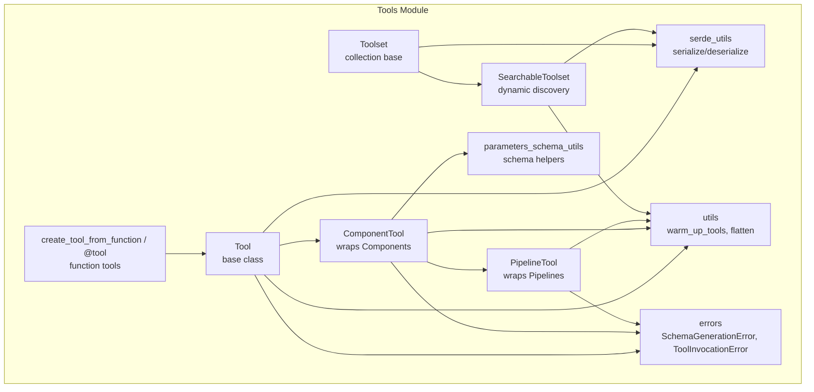
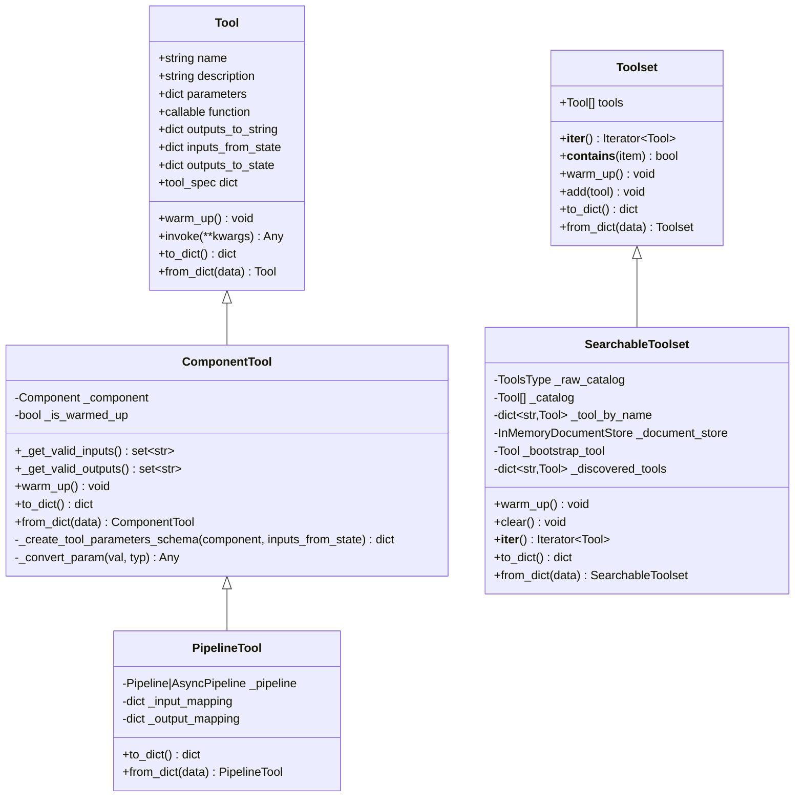
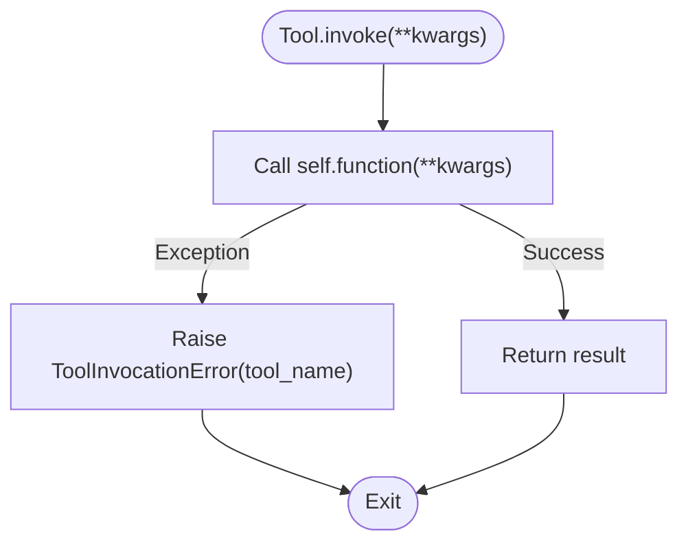
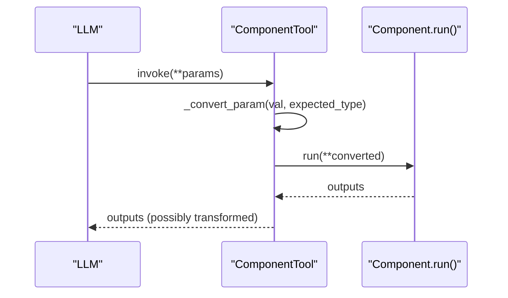
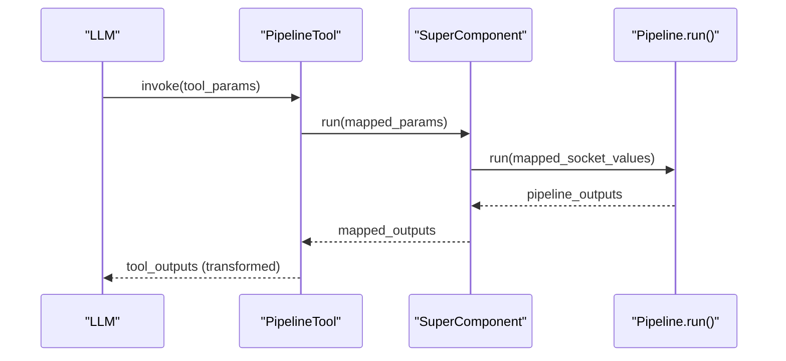
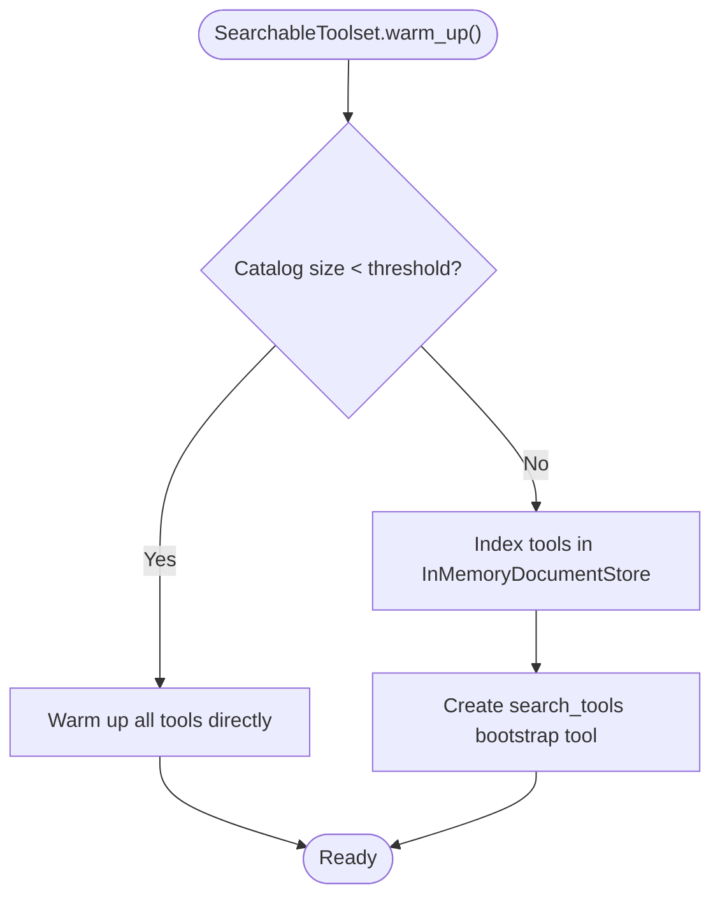
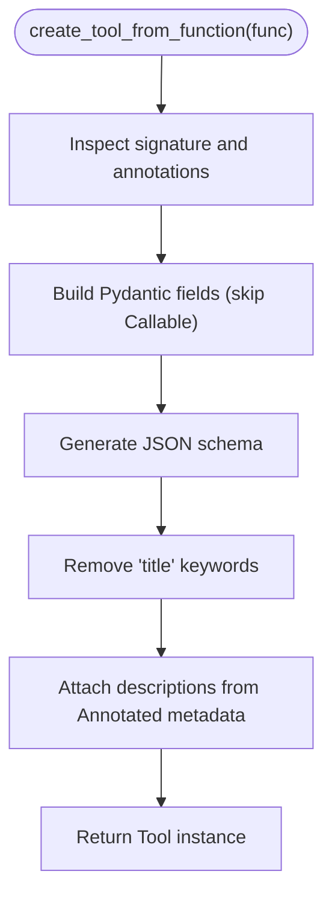
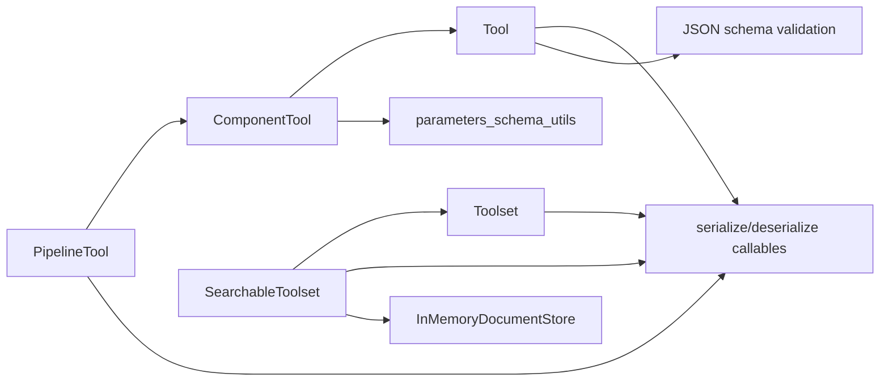

# Tool Integration Framework

<cite>
**Referenced Files in This Document**
- [tool.py](file://haystack/tools/tool.py)
- [component_tool.py](file://haystack/tools/component_tool.py)
- [pipeline_tool.py](file://haystack/tools/pipeline_tool.py)
- [searchable_toolset.py](file://haystack/tools/searchable_toolset.py)
- [from_function.py](file://haystack/tools/from_function.py)
- [toolset.py](file://haystack/tools/toolset.py)
- [parameters_schema_utils.py](file://haystack/tools/parameters_schema_utils.py)
- [serde_utils.py](file://haystack/tools/serde_utils.py)
- [utils.py](file://haystack/tools/utils.py)
- [errors.py](file://haystack/tools/errors.py)
- [__init__.py](file://haystack/tools/__init__.py)
</cite>

## Table of Contents
1. [Introduction](#introduction)
2. [Project Structure](#project-structure)
3. [Core Components](#core-components)
4. [Architecture Overview](#architecture-overview)
5. [Detailed Component Analysis](#detailed-component-analysis)
6. [Dependency Analysis](#dependency-analysis)
7. [Performance Considerations](#performance-considerations)
8. [Troubleshooting Guide](#troubleshooting-guide)
9. [Conclusion](#conclusion)
10. [Appendices](#appendices)

## Introduction
This document explains Haystack’s tool integration framework for building reusable tools that LLMs can discover, select, and call. It covers the Tool base class and its implementation patterns, ComponentTool for wrapping existing Haystack components, PipelineTool for executing complex pipelines as tools, and SearchableToolset for managing large tool catalogs with semantic search. It also documents invocation patterns, parameter validation, result processing, discovery and dynamic loading, state management, error handling, security considerations, and tool documentation generation.

## Project Structure
The tool framework lives under haystack/tools and exposes:
- Tool base class and serialization helpers
- ComponentTool for wrapping Haystack components
- PipelineTool for wrapping pipelines
- Toolset and SearchableToolset for collections and dynamic discovery
- Utilities for schema generation, serialization, and runtime helpers
- Decorators and helper functions to create tools from functions

**Diagram sources**
- [tool.py](file://haystack/tools/tool.py#L18-L405)
- [component_tool.py](file://haystack/tools/component_tool.py#L37-L395)
- [pipeline_tool.py](file://haystack/tools/pipeline_tool.py#L21-L258)
- [toolset.py](file://haystack/tools/toolset.py#L13-L365)
- [searchable_toolset.py](file://haystack/tools/searchable_toolset.py#L21-L330)
- [from_function.py](file://haystack/tools/from_function.py#L16-L324)
- [parameters_schema_utils.py](file://haystack/tools/parameters_schema_utils.py#L23-L229)
- [serde_utils.py](file://haystack/tools/serde_utils.py#L16-L83)
- [utils.py](file://haystack/tools/utils.py#L14-L65)
- [errors.py](file://haystack/tools/errors.py#L6-L22)

**Section sources**
- [__init__.py](file://haystack/tools/__init__.py#L9-L41)

## Core Components
- Tool: Base class defining the tool contract, JSON schema parameters, invocation, warm-up lifecycle, and serialization hooks. It validates parameter schemas, rejects async functions, and supports mapping inputs from state and outputs to state/string.
- ComponentTool: Wraps a Haystack Component, auto-generates a tool schema from the component’s run method signature and type hints, performs type conversions, and validates inputs/outputs against the component’s sockets.
- PipelineTool: Wraps a Pipeline via a SuperComponent, exposing a tool interface with configurable input/output mappings. It inherits ComponentTool behavior and adds pipeline-specific serialization/deserialization.
- Toolset: A collection of tools that behaves like an iterable and supports warm-up, serialization, and composition. Provides a base for dynamic toolsets.
- SearchableToolset: A dynamic toolset that indexes tools and exposes a bootstrap search tool to discover and load tools on demand using BM25 retrieval.
- Function-based tools: Helpers to create tools from plain functions or decorators (@tool), with automatic schema generation from type hints and Annotated metadata.

Key capabilities:
- Parameter validation via JSON schema and Pydantic
- Type conversion for component inputs (including dataclasses and lists)
- Outputs-to-string and outputs-to-state transformations
- Serialization/deserialization of tools and toolsets
- Warm-up lifecycle for resource-intensive tools/components
- Dynamic discovery and lazy loading for large catalogs

**Section sources**
- [tool.py](file://haystack/tools/tool.py#L18-L405)
- [component_tool.py](file://haystack/tools/component_tool.py#L37-L395)
- [pipeline_tool.py](file://haystack/tools/pipeline_tool.py#L21-L258)
- [toolset.py](file://haystack/tools/toolset.py#L13-L365)
- [searchable_toolset.py](file://haystack/tools/searchable_toolset.py#L21-L330)
- [from_function.py](file://haystack/tools/from_function.py#L16-L324)

## Architecture Overview
The framework centers around Tool and its subclasses, with specialized tool creators and utilities supporting schema generation, serialization, and runtime orchestration.

**Diagram sources**
- [tool.py](file://haystack/tools/tool.py#L18-L405)
- [component_tool.py](file://haystack/tools/component_tool.py#L37-L395)
- [pipeline_tool.py](file://haystack/tools/pipeline_tool.py#L21-L258)
- [toolset.py](file://haystack/tools/toolset.py#L13-L365)
- [searchable_toolset.py](file://haystack/tools/searchable_toolset.py#L21-L330)

## Detailed Component Analysis

### Tool Base Class
- Purpose: Defines the canonical tool interface for LLM function calling.
- Validation:
  - Rejects async functions
  - Validates parameters as a JSON schema Draft202012Validator schema
  - Validates outputs_to_state, outputs_to_string, and inputs_from_state structures and types
- Execution:
  - invoke() executes the wrapped function and wraps exceptions in ToolInvocationError
- Lifecycle:
  - warm_up() is a no-op by default; override for resource-intensive setup
- Serialization:
  - to_dict()/from_dict() serialize the function and handler callables via serialize_callable/deserialize_callable
  - Specialized helpers handle outputs_to_state and outputs_to_string serialization

**Diagram sources**
- [tool.py](file://haystack/tools/tool.py#L261-L271)

**Section sources**
- [tool.py](file://haystack/tools/tool.py#L18-L405)
- [errors.py](file://haystack/tools/errors.py#L14-L22)

### ComponentTool
- Purpose: Wrap a Haystack Component as a Tool.
- Schema generation:
  - Builds a JSON schema from the component’s run method signature and type hints
  - Uses parameters_schema_utils to resolve types, handle dataclasses, unions, and sequences
  - Skips Callable types and removes redundant titles from schema
- Type conversion:
  - Converts inputs to the expected component types, including nested dataclasses and lists
  - Uses TypeAdapter for validation and supports from_dict on target types
- Validation:
  - Validates inputs against component input sockets and outputs against output sockets
- Lifecycle:
  - Delegates warm_up() to the underlying component if present

**Diagram sources**
- [component_tool.py](file://haystack/tools/component_tool.py#L188-L205)
- [parameters_schema_utils.py](file://haystack/tools/parameters_schema_utils.py#L186-L229)

**Section sources**
- [component_tool.py](file://haystack/tools/component_tool.py#L37-L395)
- [parameters_schema_utils.py](file://haystack/tools/parameters_schema_utils.py#L23-L229)

### PipelineTool
- Purpose: Wrap a Pipeline as a Tool via a SuperComponent, enabling tool-like invocation with explicit input/output mappings.
- Construction:
  - Accepts input_mapping and output_mapping to translate tool-level parameters to pipeline sockets and outputs
  - Inherits ComponentTool behavior for schema generation and type conversion
- Serialization:
  - Persists pipeline state and mappings; distinguishes sync vs async pipelines

**Diagram sources**
- [pipeline_tool.py](file://haystack/tools/pipeline_tool.py#L196-L204)

**Section sources**
- [pipeline_tool.py](file://haystack/tools/pipeline_tool.py#L21-L258)

### Toolset and SearchableToolset
- Toolset:
  - Iterable collection of tools; validates uniqueness of tool names
  - Provides warm_up() to initialize all tools and to_dict()/from_dict() for persistence
- SearchableToolset:
  - Dynamically discovers tools from a catalog using BM25 retrieval over a document store built from tool names and descriptions
  - Exposes a bootstrap search_tools tool to load relevant tools on demand
  - Supports passthrough mode for small catalogs and maintains discovered tools in memory

**Diagram sources**
- [searchable_toolset.py](file://haystack/tools/searchable_toolset.py#L133-L163)

**Section sources**
- [toolset.py](file://haystack/tools/toolset.py#L13-L365)
- [searchable_toolset.py](file://haystack/tools/searchable_toolset.py#L21-L330)

### Function-Based Tools: create_tool_from_function and @tool
- Purpose: Create tools from plain functions with automatic schema generation from type hints and Annotated metadata.
- Features:
  - Skips Callable parameters during schema generation
  - Removes redundant titles from schema
  - Adds parameter descriptions from Annotated metadata
- Decorator:
  - @tool supports both @tool and @tool(...) forms

**Diagram sources**
- [from_function.py](file://haystack/tools/from_function.py#L16-L182)

**Section sources**
- [from_function.py](file://haystack/tools/from_function.py#L16-L324)

## Dependency Analysis
- Tool depends on:
  - JSON schema validation (Draft202012Validator)
  - Serialization utilities for callables and tool/toolset instances
- ComponentTool depends on:
  - Component introspection and socket types
  - parameters_schema_utils for schema generation and type resolution
  - Tool serialization helpers
- PipelineTool depends on:
  - SuperComponent for input/output mapping
  - Tool serialization helpers
- Toolset/SearchableToolset depend on:
  - Serialization infrastructure and document stores for discovery
  - Utilities for flattening and warming tools

**Diagram sources**
- [tool.py](file://haystack/tools/tool.py#L10-L16)
- [component_tool.py](file://haystack/tools/component_tool.py#L12-L32)
- [parameters_schema_utils.py](file://haystack/tools/parameters_schema_utils.py#L13-L20)
- [pipeline_tool.py](file://haystack/tools/pipeline_tool.py#L8-L16)
- [searchable_toolset.py](file://haystack/tools/searchable_toolset.py#L8-L15)

**Section sources**
- [__init__.py](file://haystack/tools/__init__.py#L9-L41)

## Performance Considerations
- Warm-up strategy:
  - Override warm_up() in Tool subclasses to pre-load models, open connections, or build caches
  - Use Toolset.warm_up() to initialize shared resources once per toolset
- Serialization overhead:
  - Prefer serializing descriptors for dynamic toolsets instead of large tool instances
  - Use SearchableToolset to avoid loading all tools at startup
- Type conversion:
  - ComponentTool’s type conversion uses TypeAdapter and dataclass.from_dict; keep inputs minimal and typed to reduce conversion cost
- Discovery:
  - For large catalogs, enable SearchableToolset with a reasonable search_threshold to avoid overwhelming the LLM context

[No sources needed since this section provides general guidance]

## Troubleshooting Guide
Common issues and resolutions:
- Async function used as tool:
  - Tools must be synchronous; use a sync wrapper or refactor the function
- Invalid JSON schema:
  - Ensure parameters conform to a valid JSON schema; fix invalid types or metadata
- Callable types in signatures:
  - Callable parameters are skipped during schema generation; remove or adapt the signature
- Missing type hints:
  - Functions must be fully annotated; Annotated metadata is used for descriptions
- Duplicate tool names:
  - Ensure unique tool names across a Toolset or SearchableToolset
- Tool invocation failures:
  - Exceptions are wrapped in ToolInvocationError; inspect the tool_name and stack trace
- Schema generation errors:
  - Errors during schema generation raise SchemaGenerationError; review type hints and annotations

**Section sources**
- [tool.py](file://haystack/tools/tool.py#L103-L194)
- [from_function.py](file://haystack/tools/from_function.py#L142-L147)
- [errors.py](file://haystack/tools/errors.py#L6-L22)

## Conclusion
Haystack’s tool integration framework provides a robust, extensible foundation for turning Haystack components, pipelines, and arbitrary functions into LLM-callable tools. It emphasizes strong parameter validation, flexible output transformations, dynamic discovery for large catalogs, and safe serialization. By leveraging ComponentTool, PipelineTool, and SearchableToolset, developers can build reusable, secure, and maintainable tool ecosystems.

[No sources needed since this section summarizes without analyzing specific files]

## Appendices

### Invocation Patterns and Examples
- Database queries:
  - Wrap a component that executes SQL or performs ORM operations using ComponentTool
  - Use inputs_from_state to inject credentials or connection info from agent state
  - Use outputs_to_state to map results to structured fields for downstream components
- File operations:
  - Create a function-based tool with typed parameters for file paths and actions
  - Use outputs_to_string to format results or return raw binary content when appropriate
- External service calls:
  - Use ComponentTool to wrap HTTP connectors or SDK clients
  - Implement warm_up() to initialize clients and caches
  - Use outputs_to_string with a handler to normalize responses

[No sources needed since this section provides general guidance]

### Tool Discovery and Dynamic Loading
- Use SearchableToolset to bootstrap discovery with a search_tools tool
- Configure top_k and search_threshold to balance recall and context size
- Customize parameter descriptions for the bootstrap tool to guide LLM usage

**Section sources**
- [searchable_toolset.py](file://haystack/tools/searchable_toolset.py#L56-L108)
- [searchable_toolset.py](file://haystack/tools/searchable_toolset.py#L175-L235)

### State Management and Result Processing
- inputs_from_state: Map state keys to tool parameters (e.g., “user_context” -> “query”)
- outputs_to_state: Map tool outputs to state keys with optional handlers
- outputs_to_string: Transform tool results to strings; support raw_result for images/content lists

**Section sources**
- [tool.py](file://haystack/tools/tool.py#L70-L93)
- [component_tool.py](file://haystack/tools/component_tool.py#L148-L167)

### Security Considerations
- Avoid exposing sensitive credentials in tool parameters; prefer inputs_from_state or environment-backed components
- Validate and sanitize inputs using strict JSON schema and type adapters
- Limit tool capabilities to least privilege; restrict external service calls to trusted endpoints
- Use warm_up() to establish secure connections and caches rather than embedding secrets in tool definitions

[No sources needed since this section provides general guidance]

### Tool Documentation Generation and API Specification
- Tool.name and Tool.description drive LLM understanding
- ComponentTool and PipelineTool derive descriptions from component docstrings and run method summaries
- parameters_schema_utils extracts parameter descriptions from docstrings and Annotated metadata
- Use outputs_to_string and outputs_to_state to clarify result formats for consumers

**Section sources**
- [component_tool.py](file://haystack/tools/component_tool.py#L218-L218)
- [parameters_schema_utils.py](file://haystack/tools/parameters_schema_utils.py#L62-L153)
- [from_function.py](file://haystack/tools/from_function.py#L169-L173)