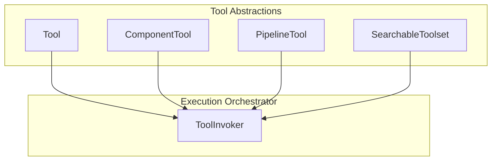
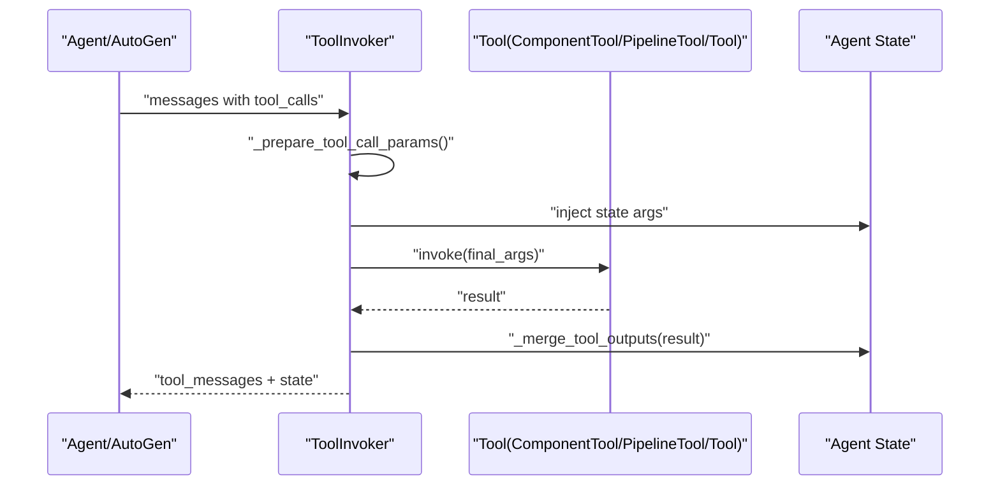
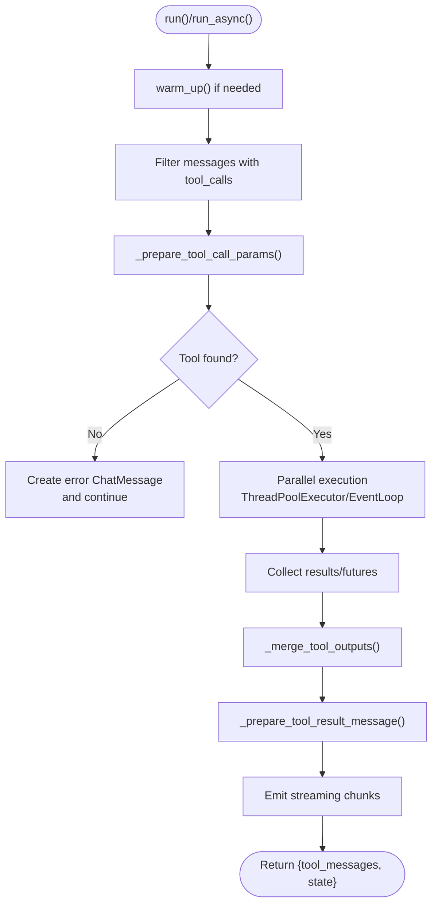
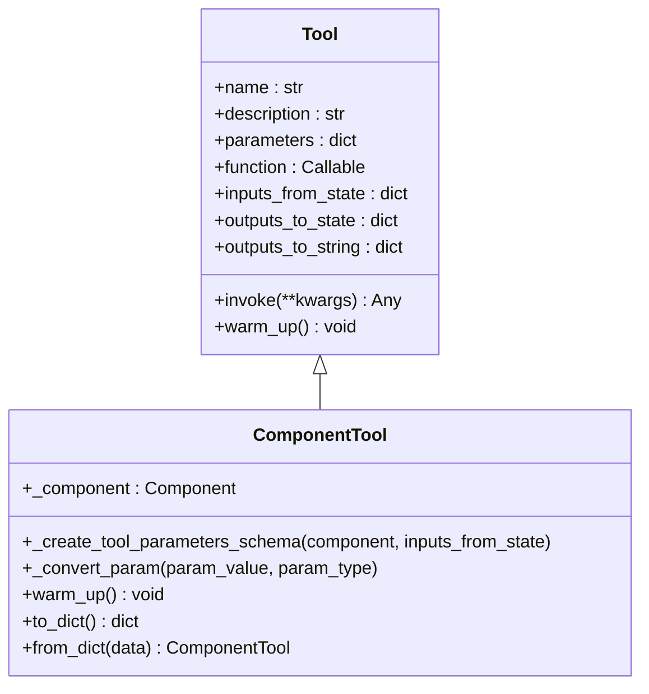
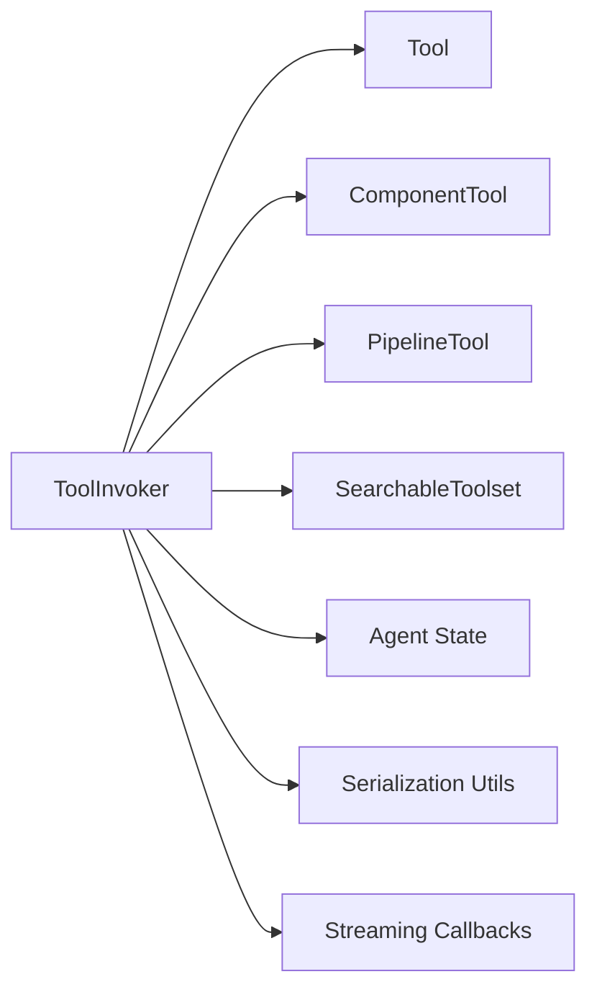

# Tool Invocation and Execution

<cite>
**Referenced Files in This Document**
- [tool_invoker.py](file://haystack/components/tools/tool_invoker.py)
- [tool.py](file://haystack/tools/tool.py)
- [component_tool.py](file://haystack/tools/component_tool.py)
- [pipeline_tool.py](file://haystack/tools/pipeline_tool.py)
- [searchable_toolset.py](file://haystack/tools/searchable_toolset.py)
- [from_function.py](file://haystack/tools/from_function.py)
- [utils.py](file://haystack/tools/utils.py)
- [test_tool_invoker.py](file://test/components/tools/test_tool_invoker.py)
</cite>

## Table of Contents
1. [Introduction](#introduction)
2. [Project Structure](#project-structure)
3. [Core Components](#core-components)
4. [Architecture Overview](#architecture-overview)
5. [Detailed Component Analysis](#detailed-component-analysis)
6. [Dependency Analysis](#dependency-analysis)
7. [Performance Considerations](#performance-considerations)
8. [Troubleshooting Guide](#troubleshooting-guide)
9. [Conclusion](#conclusion)
10. [Appendices](#appendices)

## Introduction
This document explains how tool invocation and execution works in the system, focusing on the ToolInvoker component that orchestrates tool execution within agents and pipelines. It covers tool selection, parameter validation, execution context management, integration with LLM tool calling mechanisms, error handling, retries, failure recovery, synchronous and asynchronous execution, parallel invocation, monitoring, timeouts, resource limits, and performance optimization. It also documents integration with agent state management and tool result processing workflows.

## Project Structure
The tooling ecosystem centers around:
- Tool: a generic wrapper for callable functions with JSON schema parameters and optional state/result mapping hooks.
- ComponentTool: wraps Haystack Components as tools, auto-generating LLM-compatible schemas from component input sockets.
- PipelineTool: wraps Pipelines as tools, mapping pipeline inputs/outputs to tool parameters.
- ToolInvoker: orchestrates tool selection, parameter preparation, execution, result formatting, and state updates.
- SearchableToolset: dynamic tool discovery via BM25 search for large catalogs.
- Utilities: tool warming, flattening, and serialization helpers.

**Diagram sources**
- [tool.py](file://haystack/tools/tool.py#L18-L405)
- [component_tool.py](file://haystack/tools/component_tool.py#L37-L395)
- [pipeline_tool.py](file://haystack/tools/pipeline_tool.py#L21-L258)
- [searchable_toolset.py](file://haystack/tools/searchable_toolset.py#L21-L330)
- [tool_invoker.py](file://haystack/components/tools/tool_invoker.py#L80-L857)

**Section sources**
- [tool.py](file://haystack/tools/tool.py#L1-L405)
- [component_tool.py](file://haystack/tools/component_tool.py#L1-L395)
- [pipeline_tool.py](file://haystack/tools/pipeline_tool.py#L1-L258)
- [searchable_toolset.py](file://haystack/tools/searchable_toolset.py#L1-L330)
- [tool_invoker.py](file://haystack/components/tools/tool_invoker.py#L1-L857)

## Core Components
- Tool: Encapsulates a callable with a JSON schema, optional state mapping, and output-to-string handlers. Provides warm_up, invoke, and serialization helpers.
- ComponentTool: Wraps a Haystack Component, generating a tool schema from component input sockets and validating/transforming inputs.
- PipelineTool: Wraps a Pipeline as a Tool, mapping pipeline inputs/outputs to tool parameters and supporting both sync and async pipelines.
- ToolInvoker: Validates and prepares tools, resolves parameters from LLM arguments and agent State, executes tools in parallel, merges outputs into State, formats results, and streams progress.
- SearchableToolset: Dynamically exposes tools via a bootstrap search tool, enabling discovery for large catalogs.

**Section sources**
- [tool.py](file://haystack/tools/tool.py#L18-L405)
- [component_tool.py](file://haystack/tools/component_tool.py#L37-L395)
- [pipeline_tool.py](file://haystack/tools/pipeline_tool.py#L21-L258)
- [tool_invoker.py](file://haystack/components/tools/tool_invoker.py#L80-L857)
- [searchable_toolset.py](file://haystack/tools/searchable_toolset.py#L21-L330)

## Architecture Overview
The ToolInvoker sits at the center of tool execution. It receives ChatMessage objects containing tool calls, selects the appropriate Tool by name, merges parameters from LLM-provided arguments and agent State, optionally passes streaming callbacks, executes tools in parallel, and returns formatted results while updating agent State.

**Diagram sources**
- [tool_invoker.py](file://haystack/components/tools/tool_invoker.py#L547-L679)
- [tool.py](file://haystack/tools/tool.py#L261-L271)
- [component_tool.py](file://haystack/tools/component_tool.py#L188-L205)

## Detailed Component Analysis

### ToolInvoker
ToolInvoker orchestrates tool execution with the following responsibilities:
- Tool validation and preparation: flattens Tools/Toolsets, checks for duplicates, builds a name-to-tool map.
- Parameter resolution: merges LLM-provided arguments with agent State, honoring explicit inputs_from_state mappings.
- Streaming passthrough: conditionally injects streaming_callback into tool invocations when supported.
- Parallel execution: uses a ThreadPoolExecutor to run multiple tool calls concurrently, preserving tracing context across threads.
- Result formatting: converts results to strings or JSON, supports single/multiple outputs and raw results.
- State integration: merges tool outputs into agent State according to outputs_to_state mappings.
- Error handling: raises or returns structured error messages depending on raise_on_failure.

Key behaviors:
- Synchronous run and asynchronous run_async paths share the same orchestration logic with thread pool vs. event loop execution.
- Streaming callback emits chunks per tool result and a final finish reason marker.
- Tools can be overridden at runtime via the tools parameter in run/run_async.

**Diagram sources**
- [tool_invoker.py](file://haystack/components/tools/tool_invoker.py#L547-L679)

**Section sources**
- [tool_invoker.py](file://haystack/components/tools/tool_invoker.py#L80-L857)
- [test_tool_invoker.py](file://test/components/tools/test_tool_invoker.py#L370-L756)

### Tool
Tool is a generic wrapper for a callable with:
- name, description, parameters (JSON schema), function, and optional hooks:
  - inputs_from_state: map State keys to tool parameters.
  - outputs_to_state: map tool outputs to State keys with optional handlers.
  - outputs_to_string: configure how tool results are converted to strings or raw results.
- Validation:
  - Ensures function is not async.
  - Validates parameters as a JSON schema.
  - Validates outputs_to_state, outputs_to_string, and inputs_from_state structures.
- Execution:
  - invoke() calls the underlying function with provided kwargs.
  - warm_up() is a no-op by default; override for resource-intensive setup.
- Serialization:
  - to_dict/from_dict with callable serialization for function and handlers.

**Section sources**
- [tool.py](file://haystack/tools/tool.py#L18-L405)

### ComponentTool
ComponentTool wraps a Haystack Component and:
- Generates a tool schema from component input sockets, resolving types and defaults.
- Supports inputs_from_state and outputs_to_state validation against component input/output sockets.
- Converts parameters using type adapters and supports nested dataclass-like from_dict conversions.
- Delegates invocation to component.run with converted kwargs.
- Exposes warm_up() delegation to the underlying component.

**Diagram sources**
- [tool.py](file://haystack/tools/tool.py#L18-L405)
- [component_tool.py](file://haystack/tools/component_tool.py#L37-L395)

**Section sources**
- [component_tool.py](file://haystack/tools/component_tool.py#L37-L395)

### PipelineTool
PipelineTool wraps a Pipeline (sync or async) as a Tool:
- Uses a SuperComponent to expose pipeline inputs/outputs as tool parameters.
- Supports input_mapping and output_mapping to connect tool parameters to pipeline sockets.
- Serializes/deserializes both the pipeline and tool configuration.

**Section sources**
- [pipeline_tool.py](file://haystack/tools/pipeline_tool.py#L21-L258)

### SearchableToolset
SearchableToolset enables dynamic tool discovery:
- Maintains a catalog of Tools/Toolsets.
- In passthrough mode (small catalogs), exposes all tools directly.
- In discovery mode, creates a bootstrap search_tools tool that indexes tool names and descriptions and loads tools on demand.
- Supports clearing discovered tools between runs.

**Section sources**
- [searchable_toolset.py](file://haystack/tools/searchable_toolset.py#L21-L330)

### Tool Creation Utilities
- create_tool_from_function: builds a Tool from a function by introspecting type hints and Annotated metadata, generating a JSON schema.
- tool decorator: convenient decorator form of create_tool_from_function.
- Utilities:
  - warm_up_tools: warms up Tools/Toolsets/lists.
  - flatten_tools_or_toolsets: flattens heterogeneous tool collections into a list of Tools.

**Section sources**
- [from_function.py](file://haystack/tools/from_function.py#L16-L324)
- [utils.py](file://haystack/tools/utils.py#L14-L65)

## Dependency Analysis
ToolInvoker depends on:
- Tool abstractions (Tool, ComponentTool, PipelineTool) for execution.
- Agent State for parameter injection and result merging.
- Serialization utilities for tool/toolset persistence.
- Streaming infrastructure for emitting tool results.

**Diagram sources**
- [tool_invoker.py](file://haystack/components/tools/tool_invoker.py#L20-L32)
- [tool.py](file://haystack/tools/tool.py#L13-L15)
- [component_tool.py](file://haystack/tools/component_tool.py#L13-L32)
- [pipeline_tool.py](file://haystack/tools/pipeline_tool.py#L9-L16)
- [searchable_toolset.py](file://haystack/tools/searchable_toolset.py#L8-L15)

**Section sources**
- [tool_invoker.py](file://haystack/components/tools/tool_invoker.py#L1-L857)
- [tool.py](file://haystack/tools/tool.py#L1-L405)
- [component_tool.py](file://haystack/tools/component_tool.py#L1-L395)
- [pipeline_tool.py](file://haystack/tools/pipeline_tool.py#L1-L258)
- [searchable_toolset.py](file://haystack/tools/searchable_toolset.py#L1-L330)

## Performance Considerations
- Concurrency control: max_workers controls the maximum number of concurrent tool invocations. Tune based on tool characteristics (CPU-bound vs I/O-bound).
- Parallel execution: ToolInvoker executes tool calls in parallel using a thread pool. For async tools, use run_async with an event loop.
- Streaming: streaming_callback is emitted once results are ready; avoid heavy work in the callback to minimize latency.
- Warm-up: Use warm_up_tools to pre-initialize expensive resources (connections, models) to reduce cold-start latency.
- Schema generation: ComponentTool and PipelineTool compute schemas from component signatures; cache or reuse tool definitions to avoid repeated reflection overhead.
- Memory footprint: SearchableToolset can reduce context size by deferring tool exposure until requested.

[No sources needed since this section provides general guidance]

## Troubleshooting Guide
Common exceptions and recovery strategies:
- ToolNotFoundException: Occurs when a tool name is not found. Configure raise_on_failure or handle returned error messages.
- ToolInvocationError: Raised when a tool’s function fails. Inspect the wrapped error and logs; consider retries or fallbacks.
- StringConversionError/ResultConversionError: Occur when converting tool outputs to strings or applying handlers fails. Disable raise_on_failure to capture error messages or fix handlers.
- ToolOutputMergeError: Raised when merging outputs into State fails. Validate outputs_to_state mappings and handlers.

Operational tips:
- Enable streaming_callback_passthrough to allow tools to stream intermediate results.
- Use tools override in run/run_async to temporarily swap tools for debugging.
- For parallel execution with shared State, ensure outputs_to_state handlers are thread-safe and idempotent.

**Section sources**
- [tool_invoker.py](file://haystack/components/tools/tool_invoker.py#L37-L78)
- [test_tool_invoker.py](file://test/components/tools/test_tool_invoker.py#L758-L800)

## Conclusion
ToolInvoker provides a robust, configurable, and efficient execution engine for tools in agents and pipelines. It integrates seamlessly with LLM tool calling, supports both synchronous and asynchronous execution, manages concurrency and streaming, and maintains strong error handling and state integration. ComponentTool and PipelineTool extend the system to wrap Haystack components and pipelines as tools, while SearchableToolset scales tool discovery for large catalogs.

[No sources needed since this section summarizes without analyzing specific files]

## Appendices

### Tool Selection and Parameter Validation
- Tool selection: ToolInvoker resolves tool names to Tool instances and validates uniqueness.
- Parameter validation: Tool validates JSON schema correctness and mapping configurations; ComponentTool validates against component input/output sockets.

**Section sources**
- [tool_invoker.py](file://haystack/components/tools/tool_invoker.py#L254-L276)
- [tool.py](file://haystack/tools/tool.py#L103-L194)
- [component_tool.py](file://haystack/tools/component_tool.py#L235-L256)

### Execution Context Management
- Context propagation: ToolInvoker preserves tracing context across thread boundaries when executing tools.
- State integration: ToolInvoker injects State-derived parameters and merges tool outputs into State according to configured mappings.

**Section sources**
- [tool_invoker.py](file://haystack/components/tools/tool_invoker.py#L232-L252)
- [tool_invoker.py](file://haystack/components/tools/tool_invoker.py#L399-L423)
- [tool_invoker.py](file://haystack/components/tools/tool_invoker.py#L426-L466)

### Integration with LLM Tool Calling
- Function calling syntax: Tools expose parameters as JSON schemas; Tool.tool_spec provides the minimal spec for LLMs.
- Parameter marshaling: ComponentTool and PipelineTool convert LLM arguments to typed component inputs; Tool supports raw function invocation.
- Outputs to string: ToolInvoker formats results using configured handlers or defaults; supports raw results for specialized outputs.

**Section sources**
- [tool.py](file://haystack/tools/tool.py#L244-L249)
- [component_tool.py](file://haystack/tools/component_tool.py#L368-L394)
- [tool_invoker.py](file://haystack/components/tools/tool_invoker.py#L308-L377)

### Error Handling, Retries, and Recovery
- Exceptions: Dedicated exception types for tool not found, invocation errors, conversion errors, and state merge errors.
- Retry strategies: Not built-in; implement at the caller level or wrap Tool.invoke with retry logic.
- Failure recovery: Use raise_on_failure=False to collect error messages and continue execution.

**Section sources**
- [tool_invoker.py](file://haystack/components/tools/tool_invoker.py#L37-L78)
- [test_tool_invoker.py](file://test/components/tools/test_tool_invoker.py#L758-L800)

### Synchronous and Asynchronous Execution
- Synchronous: run() uses ThreadPoolExecutor for parallelism.
- Asynchronous: run_async() uses an event loop with run_in_executor for CPU-bound tasks and asyncio.gather for coordination.

**Section sources**
- [tool_invoker.py](file://haystack/components/tools/tool_invoker.py#L547-L679)
- [tool_invoker.py](file://haystack/components/tools/tool_invoker.py#L682-L800)

### Parallel Tool Invocation and Monitoring
- Parallelism: Controlled by max_workers; ToolInvoker submits tasks and waits for completion.
- Monitoring: Streaming callback emits chunks per tool result and a final finish reason.

**Section sources**
- [tool_invoker.py](file://haystack/components/tools/tool_invoker.py#L629-L679)
- [test_tool_invoker.py](file://test/components/tools/test_tool_invoker.py#L371-L417)

### Tool Execution Timeouts and Resource Limits
- Timeouts: Not enforced by ToolInvoker; apply at the tool level or use external timeout mechanisms.
- Resource limits: Control concurrency via max_workers; warm up tools to pre-allocate resources.

**Section sources**
- [tool_invoker.py](file://haystack/components/tools/tool_invoker.py#L191-L192)

### Agent State Management and Result Processing
- State injection: ToolInvoker merges LLM arguments and State-derived parameters, honoring inputs_from_state.
- Result processing: ToolInvoker merges outputs_to_state into State and formats results for downstream components.

**Section sources**
- [tool_invoker.py](file://haystack/components/tools/tool_invoker.py#L399-L466)