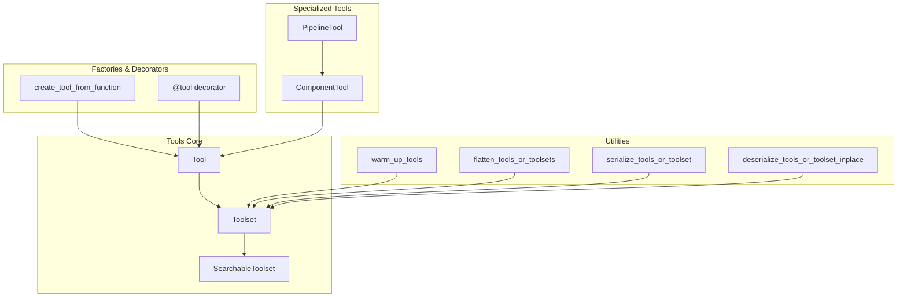
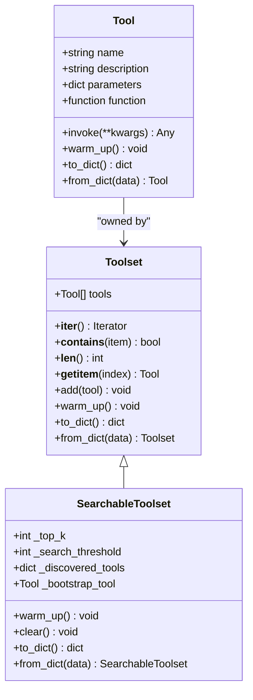
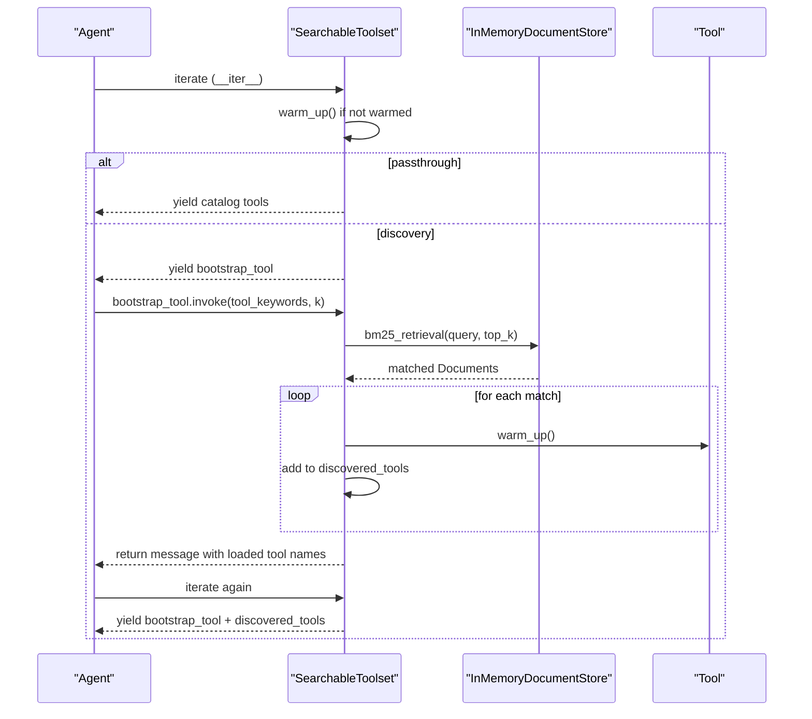
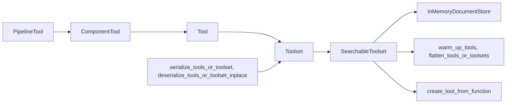

# ToolSet Management

<cite>
**Referenced Files in This Document**
- [toolset.py](file://haystack/tools/toolset.py)
- [searchable_toolset.py](file://haystack/tools/searchable_toolset.py)
- [tool.py](file://haystack/tools/tool.py)
- [from_function.py](file://haystack/tools/from_function.py)
- [utils.py](file://haystack/tools/utils.py)
- [serde_utils.py](file://haystack/tools/serde_utils.py)
- [component_tool.py](file://haystack/tools/component_tool.py)
- [pipeline_tool.py](file://haystack/tools/pipeline_tool.py)
- [errors.py](file://haystack/tools/errors.py)
- [__init__.py](file://haystack/tools/__init__.py)
- [test_searchable_toolset.py](file://test/tools/test_searchable_toolset.py)
- [test_toolset.py](file://test/tools/test_toolset.py)
- [test_from_function.py](file://test/tools/test_from_function.py)
</cite>

## Table of Contents
1. [Introduction](#introduction)
2. [Project Structure](#project-structure)
3. [Core Components](#core-components)
4. [Architecture Overview](#architecture-overview)
5. [Detailed Component Analysis](#detailed-component-analysis)
6. [Dependency Analysis](#dependency-analysis)
7. [Performance Considerations](#performance-considerations)
8. [Troubleshooting Guide](#troubleshooting-guide)
9. [Conclusion](#conclusion)
10. [Appendices](#appendices)

## Introduction
This document explains the ToolSet and SearchableToolSet management systems in the Haystack tools module. It covers how to organize tool collections, validate and register tools, coordinate execution, and persist tool catalogs. It also details semantic tool discovery and selection, serialization strategies, lifecycle management, conflict resolution, and dynamic loading patterns.

## Project Structure
The tools subsystem centers around:
- Tool: a dataclass representing a callable tool with a JSON schema for parameters and optional state mapping.
- Toolset: a collection of tools that behaves like a list and supports serialization.
- SearchableToolset: a specialized Toolset that lazily builds a catalog, indexes tools for BM25 retrieval, and exposes a bootstrap search tool for on-demand discovery.
- Utilities: helpers for flattening, warming up, and serializing tools and toolsets.
- Factory and decorators: functions and decorators to create tools from functions and components.

**Diagram sources**
- [toolset.py](file://haystack/tools/toolset.py#L13-L365)
- [searchable_toolset.py](file://haystack/tools/searchable_toolset.py#L21-L330)
- [tool.py](file://haystack/tools/tool.py#L18-L405)
- [from_function.py](file://haystack/tools/from_function.py#L16-L324)
- [utils.py](file://haystack/tools/utils.py#L14-L65)
- [serde_utils.py](file://haystack/tools/serde_utils.py#L16-L83)
- [component_tool.py](file://haystack/tools/component_tool.py#L37-L395)
- [pipeline_tool.py](file://haystack/tools/pipeline_tool.py#L21-L258)

**Section sources**
- [__init__.py](file://haystack/tools/__init__.py#L9-L41)

## Core Components
- Tool: Encapsulates a callable function with a JSON schema for parameters, optional state mapping, and warm-up hooks. Provides serialization and invocation.
- Toolset: A list-like collection of tools with validation, iteration, membership checks, indexing, and serialization. Supports dynamic tool loading by subclasses.
- SearchableToolset: Extends Toolset to support BM25-based discovery. Defers catalog flattening until warm-up, builds a document store from tool names and descriptions, and exposes a bootstrap search tool that loads tools on demand.

Key capabilities:
- Registration and validation: Duplicate tool name detection, JSON schema validation, and parameter/state mapping validation.
- Execution coordination: Iteration, membership checks, indexing, and warm-up orchestration.
- Serialization: Individual tool serialization and aggregate toolset persistence.
- Discovery: Manual selection and automated semantic matching via BM25.

**Section sources**
- [tool.py](file://haystack/tools/tool.py#L18-L405)
- [toolset.py](file://haystack/tools/toolset.py#L13-L365)
- [searchable_toolset.py](file://haystack/tools/searchable_toolset.py#L21-L330)

## Architecture Overview
The architecture separates concerns between tool definition, collection management, and discovery/indexing. Toolset provides a stable interface for consumers like ToolInvoker. SearchableToolset adds a discovery layer that remains transparent to downstream components.

**Diagram sources**
- [tool.py](file://haystack/tools/tool.py#L18-L405)
- [toolset.py](file://haystack/tools/toolset.py#L13-L365)
- [searchable_toolset.py](file://haystack/tools/searchable_toolset.py#L21-L330)

## Detailed Component Analysis

### Tool
- Purpose: Defines a callable tool with a strict JSON schema for parameters, optional state mapping, and warm-up hooks.
- Validation:
  - Rejects async functions.
  - Validates parameters as a JSON schema.
  - Validates outputs_to_state, outputs_to_string, and inputs_from_state structures.
- Invocation: Wraps the provided function and raises a structured error on failure.
- Serialization: Serializes the function and state mapping configurations, preserving callable handlers.

Best practices:
- Use the @tool decorator or create_tool_from_function to generate tools from functions with automatic schema generation.
- Provide clear descriptions and parameter metadata for better LLM prompting.

**Section sources**
- [tool.py](file://haystack/tools/tool.py#L18-L405)
- [from_function.py](file://haystack/tools/from_function.py#L16-L324)

### Toolset
- Purpose: Organizes tools into a cohesive collection with list-like behavior and validation.
- Features:
  - Iteration, membership checks, length, and indexing.
  - Adding tools or merging other toolsets with duplicate name detection.
  - Warm-up delegation to contained tools.
  - Serialization of tool instances and deserialization into a new Toolset.
- Dynamic loading: Subclass Toolset to implement dynamic tool loading patterns (e.g., from external endpoints) and override to_dict/from_dict accordingly.

Examples:
- Building a catalog: Create Tool instances and group them into a Toolset.
- Managing lifecycles: Call warm_up() before use; rely on Tool.warm_up() for resource-intensive operations.
- Persistence: Serialize to_dict() and restore via from_dict().

**Section sources**
- [toolset.py](file://haystack/tools/toolset.py#L13-L365)
- [test_toolset.py](file://test/tools/test_toolset.py#L134-L473)

### SearchableToolset
- Purpose: Enables semantic discovery for large tool catalogs using BM25 retrieval.
- Behavior:
  - Passthrough mode: If catalog size is below a threshold, exposes all tools directly.
  - Discovery mode: Builds a document store from tool names and descriptions, and exposes a bootstrap search tool that loads tools on demand.
  - Deferred flattening: Catalog flattening occurs during warm_up() to support lazy toolsets.
- Configuration:
  - top_k: Default number of results for the bootstrap search.
  - search_threshold: Threshold to switch between passthrough and discovery modes.
  - Customizable bootstrap tool name, description, and parameter descriptions.
- Lifecycle:
  - warm_up(): Warms child toolsets, flattens catalog, initializes document store, and creates the bootstrap tool.
  - clear(): Resets discovered tools for reuse in long-running applications.
  - Iteration: Yields bootstrap tool plus discovered tools; automatically warms up on first iteration.

Discovery flow:

**Diagram sources**
- [searchable_toolset.py](file://haystack/tools/searchable_toolset.py#L133-L281)

**Section sources**
- [searchable_toolset.py](file://haystack/tools/searchable_toolset.py#L21-L330)
- [test_searchable_toolset.py](file://test/tools/test_searchable_toolset.py#L100-L784)

### Tool Factories and Specializations
- create_tool_from_function: Generates a Tool from a function with automatic schema generation from type hints and Annotated metadata.
- @tool decorator: Convenient decorator form of create_tool_from_function with optional customization.
- ComponentTool: Wraps a Haystack Component as a Tool, generating a schema from component input sockets and converting inputs/outputs.
- PipelineTool: Wraps a Haystack Pipeline as a Tool, mapping pipeline inputs/outputs to tool parameters.

These enable building tools from functions, components, and pipelines without manual schema authoring.

**Section sources**
- [from_function.py](file://haystack/tools/from_function.py#L16-L324)
- [component_tool.py](file://haystack/tools/component_tool.py#L37-L395)
- [pipeline_tool.py](file://haystack/tools/pipeline_tool.py#L21-L258)

### Utilities and Serialization
- warm_up_tools: Warms up tools or toolsets (including lists), delegating to Toolset.warm_up().
- flatten_tools_or_toolsets: Flattens mixed lists of Tools and Toolsets into a flat list of Tools.
- serialize_tools_or_toolset: Serializes a Toolset, list of Tools/Toolsets, or None.
- deserialize_tools_or_toolset_inplace: Deserializes a dictionary containing serialized tools or toolsets, replacing the target key’s value in place.

These utilities support consistent lifecycle management and serialization across heterogeneous tool catalogs.

**Section sources**
- [utils.py](file://haystack/tools/utils.py#L14-L65)
- [serde_utils.py](file://haystack/tools/serde_utils.py#L16-L83)

## Dependency Analysis
- Tool depends on JSON schema validation and callable serialization utilities.
- Toolset depends on Tool and uses a dataclass with a default_factory-initialized list.
- SearchableToolset extends Toolset and depends on:
  - In-memory document store for BM25 retrieval.
  - Utility functions for flattening and warming.
  - Tool creation utilities for the bootstrap tool.
- Specialized tools (ComponentTool, PipelineTool) extend Tool and integrate with Haystack components and pipelines.

**Diagram sources**
- [toolset.py](file://haystack/tools/toolset.py#L13-L365)
- [searchable_toolset.py](file://haystack/tools/searchable_toolset.py#L21-L330)
- [utils.py](file://haystack/tools/utils.py#L14-L65)
- [from_function.py](file://haystack/tools/from_function.py#L16-L324)
- [component_tool.py](file://haystack/tools/component_tool.py#L37-L395)
- [pipeline_tool.py](file://haystack/tools/pipeline_tool.py#L21-L258)
- [serde_utils.py](file://haystack/tools/serde_utils.py#L16-L83)

**Section sources**
- [__init__.py](file://haystack/tools/__init__.py#L9-L41)

## Performance Considerations
- Passthrough vs discovery: For small catalogs, SearchableToolset avoids indexing overhead by exposing tools directly. Tune search_threshold to balance performance and discoverability.
- Deferred flattening: Catalog flattening occurs during warm_up(), enabling lazy toolsets to connect to external resources before building the catalog.
- Memory usage: Use clear() to reset discovered tools between runs in long-running applications.
- Warm-up idempotency: warm_up() is designed to be safe to call multiple times; avoid repeated heavy initialization.

[No sources needed since this section provides general guidance]

## Troubleshooting Guide
Common issues and resolutions:
- Duplicate tool names: Toolset and Toolset.add() detect duplicates and raise an error. Ensure unique tool names across a collection.
- Invalid catalog types: SearchableToolset validates catalog inputs and raises TypeError for unsupported types.
- Invalid parameter descriptions: SearchableToolset validates custom bootstrap tool parameter descriptions and raises ValueError for invalid keys.
- Tool invocation failures: Tool.invoke() wraps exceptions in a structured ToolInvocationError with the tool name.
- Schema generation errors: create_tool_from_function raises SchemaGenerationError when the function schema cannot be generated.

**Section sources**
- [toolset.py](file://haystack/tools/toolset.py#L149-L161)
- [searchable_toolset.py](file://haystack/tools/searchable_toolset.py#L83-L98)
- [searchable_toolset.py](file://haystack/tools/searchable_toolset.py#L696-L700)
- [tool.py](file://haystack/tools/tool.py#L261-L271)
- [from_function.py](file://haystack/tools/from_function.py#L124-L128)
- [errors.py](file://haystack/tools/errors.py#L14-L22)

## Conclusion
The ToolSet and SearchableToolSet systems provide a robust foundation for organizing, validating, discovering, and persisting tools. Toolset offers a simple, validated collection interface, while SearchableToolset scales to large catalogs through semantic discovery. Together with factories and specializations, they support dynamic tool loading, lifecycle management, and seamless integration with pipelines and agents.

[No sources needed since this section summarizes without analyzing specific files]

## Appendices

### Building Tool Catalogs
- From functions: Use create_tool_from_function or @tool to generate tools with automatic schema generation.
- From components: Use ComponentTool to wrap Haystack components as tools.
- From pipelines: Use PipelineTool to expose pipelines as tools.
- Grouping: Use Toolset to group related tools and ToolInvoker to coordinate execution.

**Section sources**
- [from_function.py](file://haystack/tools/from_function.py#L16-L324)
- [component_tool.py](file://haystack/tools/component_tool.py#L37-L395)
- [pipeline_tool.py](file://haystack/tools/pipeline_tool.py#L21-L258)
- [toolset.py](file://haystack/tools/toolset.py#L13-L365)

### Implementing Tool Selection Strategies
- Manual selection: Use Toolset to select tools explicitly.
- Automated discovery: Use SearchableToolset with BM25-based search and a bootstrap tool to find tools by keywords.
- Hybrid: Combine both approaches by starting with a curated Toolset and augmenting with SearchableToolset for overflow catalogs.

**Section sources**
- [searchable_toolset.py](file://haystack/tools/searchable_toolset.py#L21-L330)
- [test_searchable_toolset.py](file://test/tools/test_searchable_toolset.py#L202-L277)

### Managing Tool Lifecycles
- Initialization: Call warm_up() on Toolset or SearchableToolset before use.
- Resource management: Override warm_up() in subclasses for shared resources or lazy connections.
- Cleanup: Use clear() on SearchableToolset to reset discovered tools between runs.

**Section sources**
- [toolset.py](file://haystack/tools/toolset.py#L189-L217)
- [searchable_toolset.py](file://haystack/tools/searchable_toolset.py#L133-L164)
- [searchable_toolset.py](file://haystack/tools/searchable_toolset.py#L165-L174)

### Conflict Resolution and Version Management
- Conflict resolution: Duplicate tool names are detected and prevented; resolve by renaming tools or using distinct Toolset instances.
- Version management: For dynamic tool loading, serialize endpoint descriptors or tool specifications rather than tool instances to preserve freshness across versions.

**Section sources**
- [toolset.py](file://haystack/tools/toolset.py#L235-L238)
- [toolset.py](file://haystack/tools/toolset.py#L247-L257)

### Dynamic Tool Loading Patterns
- Subclass Toolset: Implement __init__ to load tools from external sources, and override to_dict/from_dict to serialize descriptors instead of tool instances.
- Lazy toolsets: Use warm_up() to establish connections and populate tools after initialization.

**Section sources**
- [toolset.py](file://haystack/tools/toolset.py#L72-L144)
- [test_searchable_toolset.py](file://test/tools/test_searchable_toolset.py#L582-L691)

### Tool Discovery Mechanisms
- Manual: Directly add tools to Toolset or pass Toolset to ToolInvoker.
- Semantic: Use SearchableToolset with a bootstrap tool that performs BM25 retrieval and loads tools on demand.

**Section sources**
- [searchable_toolset.py](file://haystack/tools/searchable_toolset.py#L175-L235)
- [test_searchable_toolset.py](file://test/tools/test_searchable_toolset.py#L220-L277)

### Serialization and Persistence
- Individual tool serialization: Tool.to_dict()/Tool.from_dict().
- Aggregate persistence: Toolset.to_dict()/Toolset.from_dict(); SearchableToolset.to_dict()/SearchableToolset.from_dict().
- Utilities: serialize_tools_or_toolset and deserialize_tools_or_toolset_inplace for mixed lists and in-place deserialization.

**Section sources**
- [tool.py](file://haystack/tools/tool.py#L273-L309)
- [toolset.py](file://haystack/tools/toolset.py#L241-L282)
- [searchable_toolset.py](file://haystack/tools/searchable_toolset.py#L282-L330)
- [serde_utils.py](file://haystack/tools/serde_utils.py#L16-L83)