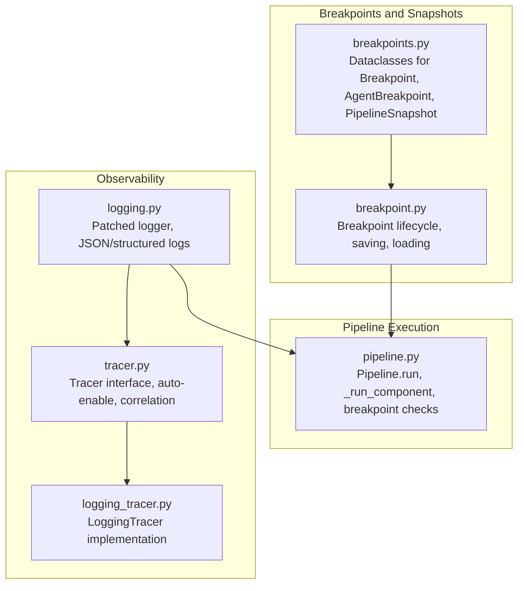
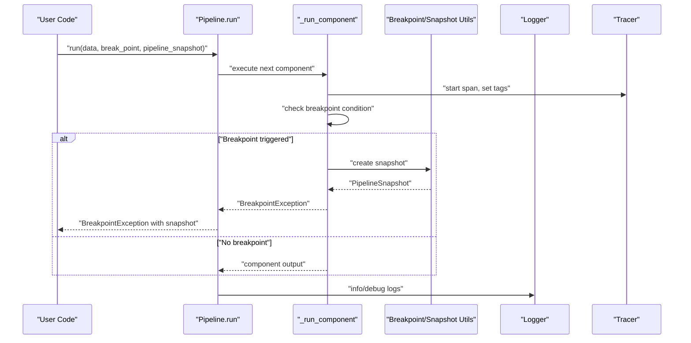
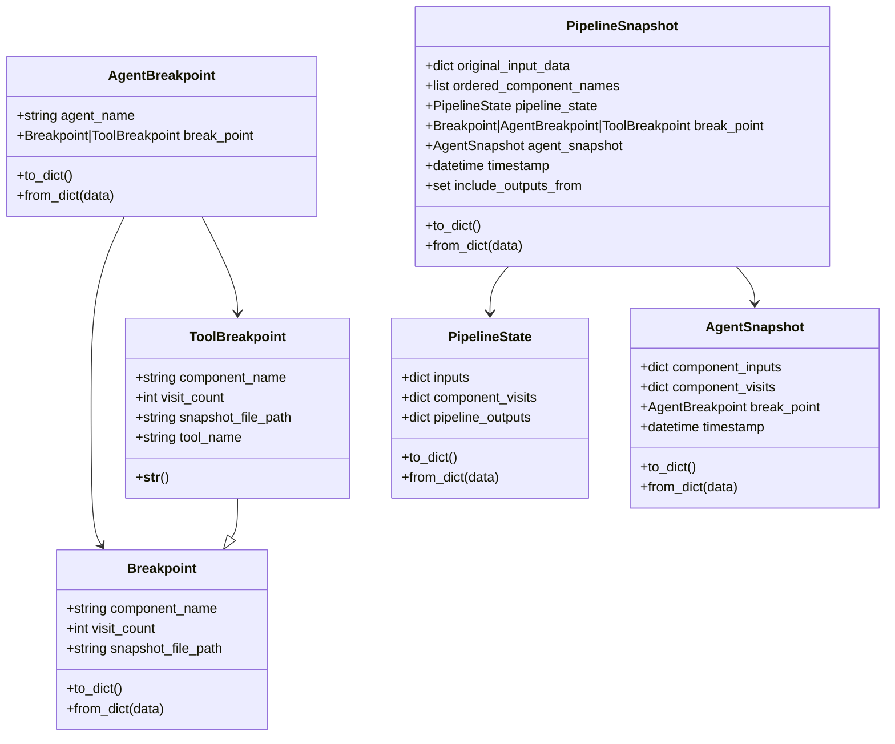
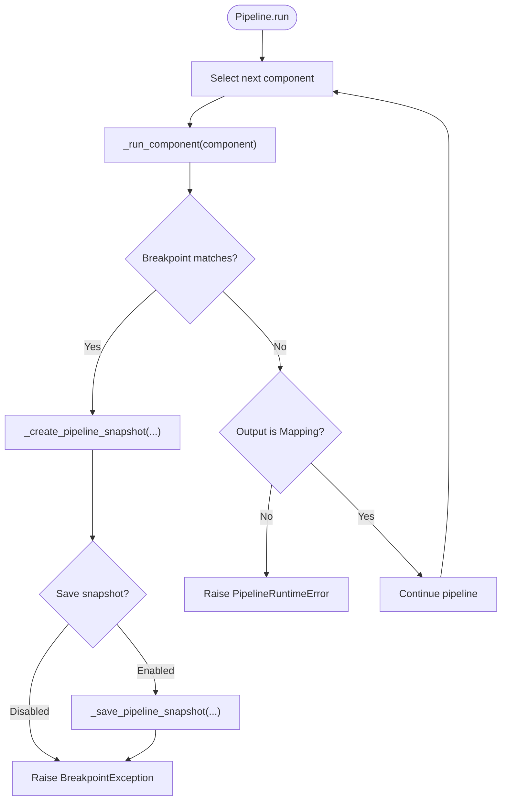
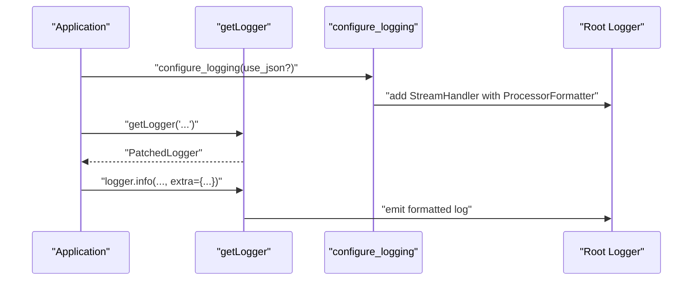
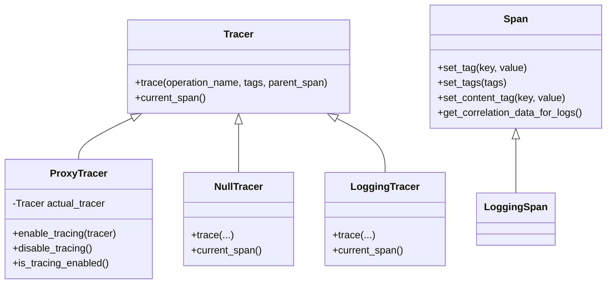
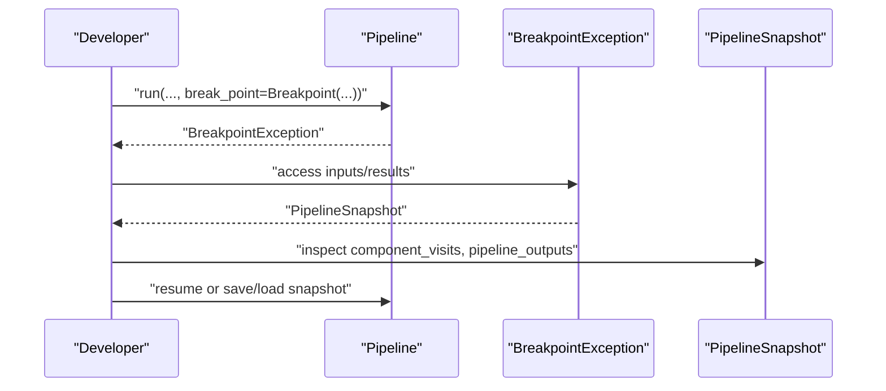
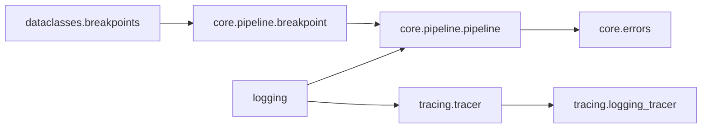

# Debugging and Profiling

<cite>
**Referenced Files in This Document**
- [breakpoints.py](file://haystack/dataclasses/breakpoints.py)
- [breakpoint.py](file://haystack/core/pipeline/breakpoint.py)
- [pipeline.py](file://haystack/core/pipeline/pipeline.py)
- [errors.py](file://haystack/core/errors.py)
- [logging.py](file://haystack/logging.py)
- [tracer.py](file://haystack/tracing/tracer.py)
- [logging_tracer.py](file://haystack/tracing/logging_tracer.py)
- [test_breakpoints.py](file://test/dataclasses/test_breakpoints.py)
- [test_pipeline_breakpoints_answer_joiner.py](file://test/core/pipeline/breakpoints/test_pipeline_breakpoints_answer_joiner.py)
- [test_pipeline_breakpoints_rag_hybrid.py](file://test/core/pipeline/breakpoints/test_pipeline_breakpoints_rag_hybrid.py)
- [test_pipeline_breakpoints_loops.py](file://test/core/pipeline/breakpoints/test_pipeline_breakpoints_loops.py)
- [test_pipeline_breakpoints_agent_function_calling.py](file://test/core/pipeline/breakpoints/test_pipeline_breakpoints_agent_function_calling.py)
- [test_logging.py](file://test/test_logging.py)
- [test_tracer.py](file://test/tracing/test_tracer.py)
- [test_logging_tracer.py](file://test/tracing/test_logging_tracer.py)
</cite>

## Table of Contents
1. [Introduction](#introduction)
2. [Project Structure](#project-structure)
3. [Core Components](#core-components)
4. [Architecture Overview](#architecture-overview)
5. [Detailed Component Analysis](#detailed-component-analysis)
6. [Dependency Analysis](#dependency-analysis)
7. [Performance Considerations](#performance-considerations)
8. [Troubleshooting Guide](#troubleshooting-guide)
9. [Conclusion](#conclusion)
10. [Appendices](#appendices)

## Introduction
This document explains how to debug and profile Haystack applications, focusing on the breakpoint system for pausing pipeline execution, component behavior analysis, and data flow inspection. It also covers logging-based debugging for production, error handling and exception tracking, and practical workflows for common issues such as connection problems, serialization errors, and component failures. Remote and distributed pipeline debugging techniques are addressed alongside profiling integrations to identify performance bottlenecks.

## Project Structure
The debugging and profiling capabilities are centered around:
- Breakpoint dataclasses and pipeline snapshot mechanics
- Pipeline execution hooks and breakpoint triggers
- Logging configuration and structured logging
- Tracing integration and correlation with logs
- Tests demonstrating breakpoint usage across pipeline components

**Diagram sources**
- [breakpoint.py](file://haystack/core/pipeline/breakpoint.py#L1-L518)
- [breakpoints.py](file://haystack/dataclasses/breakpoints.py#L1-L282)
- [pipeline.py](file://haystack/core/pipeline/pipeline.py#L1-L453)
- [logging.py](file://haystack/logging.py#L1-L404)
- [tracer.py](file://haystack/tracing/tracer.py#L1-L244)
- [logging_tracer.py](file://haystack/tracing/logging_tracer.py#L1-L92)

**Section sources**
- [breakpoint.py](file://haystack/core/pipeline/breakpoint.py#L1-L518)
- [breakpoints.py](file://haystack/dataclasses/breakpoints.py#L1-L282)
- [pipeline.py](file://haystack/core/pipeline/pipeline.py#L1-L453)
- [logging.py](file://haystack/logging.py#L1-L404)
- [tracer.py](file://haystack/tracing/tracer.py#L1-L244)
- [logging_tracer.py](file://haystack/tracing/logging_tracer.py#L1-L92)

## Core Components
- Breakpoint dataclasses define where and when to pause: standard component breakpoints and agent-specific breakpoints (including tool-level breakpoints).
- Pipeline snapshot captures the pipeline state at a breakpoint, including inputs, component visit counts, and outputs, and supports saving/loading for later inspection or resumption.
- Pipeline execution integrates breakpoint checks per component run and raises a dedicated exception to signal a pause.
- Logging is standardized and can be configured for JSON output and correlation with traces.
- Tracing provides a unified interface to instrument operations and attach tags; a logging tracer is available for quick visibility.

**Section sources**
- [breakpoints.py](file://haystack/dataclasses/breakpoints.py#L12-L282)
- [breakpoint.py](file://haystack/core/pipeline/breakpoint.py#L57-L134)
- [pipeline.py](file://haystack/core/pipeline/pipeline.py#L42-L110)
- [logging.py](file://haystack/logging.py#L298-L404)
- [tracer.py](file://haystack/tracing/tracer.py#L169-L244)

## Architecture Overview
The breakpoint and snapshot architecture ties together dataclasses, pipeline execution, and observability.

**Diagram sources**
- [pipeline.py](file://haystack/core/pipeline/pipeline.py#L42-L110)
- [breakpoint.py](file://haystack/core/pipeline/breakpoint.py#L261-L336)
- [tracer.py](file://haystack/tracing/tracer.py#L82-L109)
- [logging.py](file://haystack/logging.py#L240-L266)

## Detailed Component Analysis

### Breakpoint Dataclasses and Validation
- Breakpoint: identifies a component and a visit count; optionally includes a snapshot file path.
- ToolBreakpoint: targets a specific tool inside an Agent’s tool invoker.
- AgentBreakpoint: binds a breakpoint to an Agent component and validates component names.
- PipelineSnapshot: serializable snapshot of pipeline state, validated against the current pipeline graph.

**Diagram sources**
- [breakpoints.py](file://haystack/dataclasses/breakpoints.py#L12-L282)

**Section sources**
- [breakpoints.py](file://haystack/dataclasses/breakpoints.py#L12-L282)

### Pipeline Breakpoint Triggering and Snapshot Creation
- Pipeline validates breakpoints against the current graph and raises a dedicated exception when a breakpoint is hit.
- Snapshot creation serializes inputs, outputs, and state, with safeguards for non-serializable objects.
- Saving snapshots can be enabled via environment variable or via a custom callback.

**Diagram sources**
- [pipeline.py](file://haystack/core/pipeline/pipeline.py#L42-L110)
- [breakpoint.py](file://haystack/core/pipeline/breakpoint.py#L57-L134)
- [breakpoint.py](file://haystack/core/pipeline/breakpoint.py#L261-L336)
- [breakpoint.py](file://haystack/core/pipeline/breakpoint.py#L166-L258)

**Section sources**
- [pipeline.py](file://haystack/core/pipeline/pipeline.py#L42-L110)
- [breakpoint.py](file://haystack/core/pipeline/breakpoint.py#L57-L134)
- [breakpoint.py](file://haystack/core/pipeline/breakpoint.py#L166-L258)
- [breakpoint.py](file://haystack/core/pipeline/breakpoint.py#L261-L336)

### Logging-Based Debugging and Structured Logs
- Logger is patched to require keyword-only arguments and to interpolate extras safely.
- Structured logging can be enabled with JSON output; logs can be correlated with traces when tracing is active.
- Environment variables control JSON logging and structlog behavior.

**Diagram sources**
- [logging.py](file://haystack/logging.py#L240-L266)
- [logging.py](file://haystack/logging.py#L298-L404)

**Section sources**
- [logging.py](file://haystack/logging.py#L240-L266)
- [logging.py](file://haystack/logging.py#L298-L404)

### Tracing Integration and Correlation
- Tracer interface defines spans and tagging; ProxyTracer allows dynamic enable/disable.
- Auto-enable attempts to detect OpenTelemetry or Datadog tracers and activate them.
- LoggingTracer logs operation names and tags for quick visibility.

**Diagram sources**
- [tracer.py](file://haystack/tracing/tracer.py#L82-L182)
- [logging_tracer.py](file://haystack/tracing/logging_tracer.py#L34-L92)

**Section sources**
- [tracer.py](file://haystack/tracing/tracer.py#L82-L182)
- [tracer.py](file://haystack/tracing/tracer.py#L184-L244)
- [logging_tracer.py](file://haystack/tracing/logging_tracer.py#L34-L92)

### Interactive Debugging Workflows Using Breakpoints
- Set a Breakpoint on a specific component and run the pipeline; on hit, a BreakpointException is raised with a PipelineSnapshot attached.
- Inspect inputs and results from the exception properties, then resume or save/load snapshots for later analysis.
- For Agents, use AgentBreakpoint to target either the chat generator or the tool invoker, optionally scoped to a specific tool.

**Diagram sources**
- [pipeline.py](file://haystack/core/pipeline/pipeline.py#L64-L69)
- [errors.py](file://haystack/core/errors.py#L106-L188)
- [breakpoint.py](file://haystack/core/pipeline/breakpoint.py#L136-L164)

**Section sources**
- [pipeline.py](file://haystack/core/pipeline/pipeline.py#L64-L69)
- [errors.py](file://haystack/core/errors.py#L106-L188)
- [breakpoint.py](file://haystack/core/pipeline/breakpoint.py#L136-L164)

### Practical Examples: Common Pipeline Issues
- Connection problems: Use logging to capture component inputs and outputs; leverage tracing tags to identify failing stages; consider increasing timeouts or retry logic at the component level.
- Data serialization errors: Pipeline snapshots serialize inputs/outputs; when non-serializable objects are encountered, warnings are logged and empty dictionaries are used; adjust component outputs to be JSON-serializable.
- Component failures: PipelineRuntimeError wraps exceptions with component context; combine with snapshots to capture state at failure.

**Section sources**
- [breakpoint.py](file://haystack/core/pipeline/breakpoint.py#L294-L325)
- [errors.py](file://haystack/core/errors.py#L14-L56)
- [logging.py](file://haystack/logging.py#L350-L372)

### Remote and Distributed Scenarios
- Enable tracing auto-configuration to integrate with external systems; use environment variables to toggle content tracing and auto-enable behavior.
- Use snapshot callbacks to persist snapshots to external storage or services, enabling remote inspection and resumption.

**Section sources**
- [tracer.py](file://haystack/tracing/tracer.py#L184-L244)
- [breakpoint.py](file://haystack/core/pipeline/breakpoint.py#L166-L212)

## Dependency Analysis
The following diagram highlights key dependencies among debugging and profiling components.

**Diagram sources**
- [breakpoints.py](file://haystack/dataclasses/breakpoints.py#L12-L282)
- [breakpoint.py](file://haystack/core/pipeline/breakpoint.py#L1-L518)
- [pipeline.py](file://haystack/core/pipeline/pipeline.py#L1-L453)
- [errors.py](file://haystack/core/errors.py#L1-L188)
- [logging.py](file://haystack/logging.py#L1-L404)
- [tracer.py](file://haystack/tracing/tracer.py#L1-L244)
- [logging_tracer.py](file://haystack/tracing/logging_tracer.py#L1-L92)

**Section sources**
- [breakpoint.py](file://haystack/core/pipeline/breakpoint.py#L1-L518)
- [pipeline.py](file://haystack/core/pipeline/pipeline.py#L1-L453)
- [errors.py](file://haystack/core/errors.py#L1-L188)
- [logging.py](file://haystack/logging.py#L1-L404)
- [tracer.py](file://haystack/tracing/tracer.py#L1-L244)
- [logging_tracer.py](file://haystack/tracing/logging_tracer.py#L1-L92)

## Performance Considerations
- Prefer targeted breakpoints to minimize overhead; avoid excessive snapshotting in hot paths.
- Use tracing to measure component durations and tag sensitive content selectively.
- Keep logs at appropriate levels; in production, JSON logs improve parsing and reduce noise.
- Serialize only necessary outputs in snapshots to reduce I/O overhead.

[No sources needed since this section provides general guidance]

## Troubleshooting Guide
- Breakpoint not triggering: verify the component name exists in the pipeline graph and the visit count matches the current run.
- Snapshot not saved: ensure the environment variable enabling snapshot saving is set appropriately or provide a snapshot callback.
- Non-serializable outputs: adjust component outputs to be JSON-serializable or rely on snapshot fallback behavior.
- Tracing not correlating: confirm tracing is auto-enabled or manually enabled; ensure logs are configured for JSON output.

**Section sources**
- [breakpoint.py](file://haystack/core/pipeline/breakpoint.py#L57-L84)
- [breakpoint.py](file://haystack/core/pipeline/breakpoint.py#L43-L54)
- [breakpoint.py](file://haystack/core/pipeline/breakpoint.py#L294-L325)
- [logging.py](file://haystack/logging.py#L350-L372)
- [tracer.py](file://haystack/tracing/tracer.py#L184-L244)

## Conclusion
Haystack provides a robust debugging toolkit: structured breakpoints with snapshots, comprehensive logging, and tracing integration. Use breakpoints to pause execution at precise moments, inspect inputs and outputs, and resume or persist state for later analysis. Combine logging and tracing to gain visibility in development and production, and adopt the troubleshooting strategies outlined to resolve common issues efficiently.

[No sources needed since this section summarizes without analyzing specific files]

## Appendices

### Example Test References
- Breakpoint dataclass tests: [test_breakpoints.py](file://test/dataclasses/test_breakpoints.py)
- Pipeline breakpoint tests (answer joiner): [test_pipeline_breakpoints_answer_joiner.py](file://test/core/pipeline/breakpoints/test_pipeline_breakpoints_answer_joiner.py)
- Pipeline breakpoint tests (RAG hybrid): [test_pipeline_breakpoints_rag_hybrid.py](file://test/core/pipeline/breakpoints/test_pipeline_breakpoints_rag_hybrid.py)
- Pipeline breakpoint tests (loops): [test_pipeline_breakpoints_loops.py](file://test/core/pipeline/breakpoints/test_pipeline_breakpoints_loops.py)
- Pipeline breakpoint tests (agent function calling): [test_pipeline_breakpoints_agent_function_calling.py](file://test/core/pipeline/breakpoints/test_pipeline_breakpoints_agent_function_calling.py)
- Logging tests: [test_logging.py](file://test/test_logging.py)
- Tracer tests: [test_tracer.py](file://test/tracing/test_tracer.py)
- Logging tracer tests: [test_logging_tracer.py](file://test/tracing/test_logging_tracer.py)