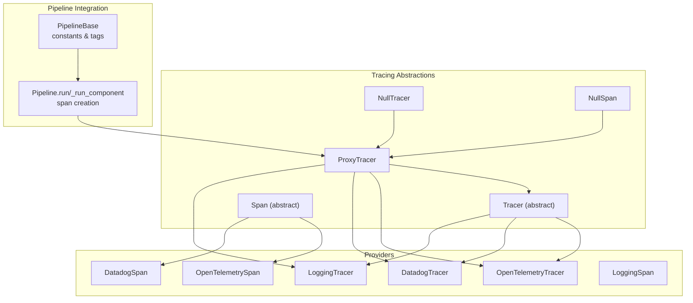
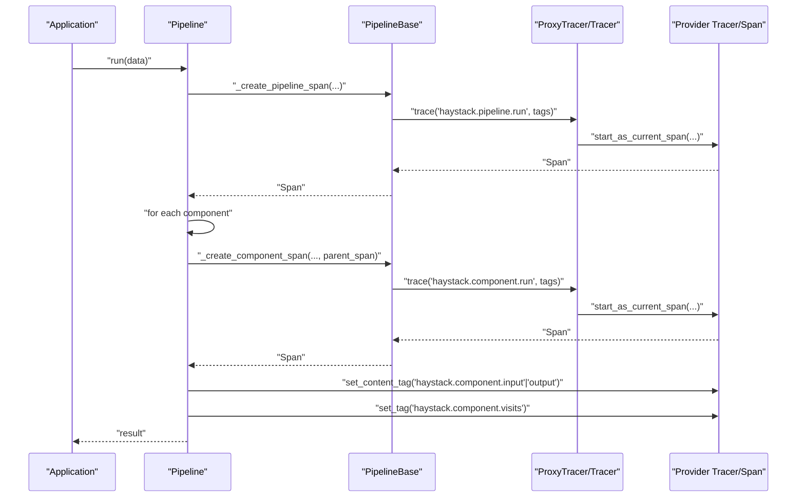
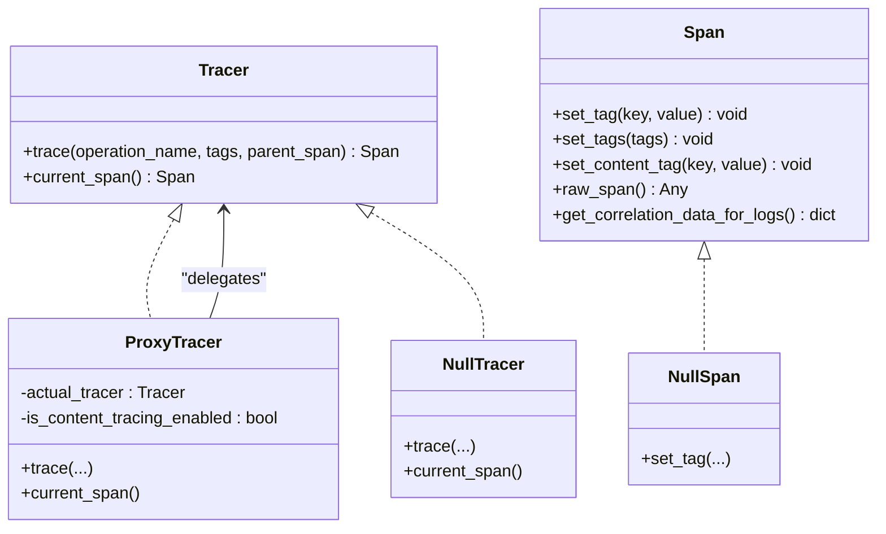
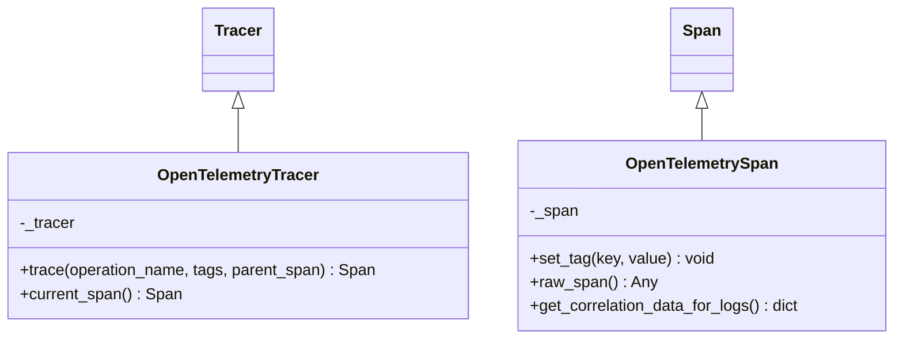
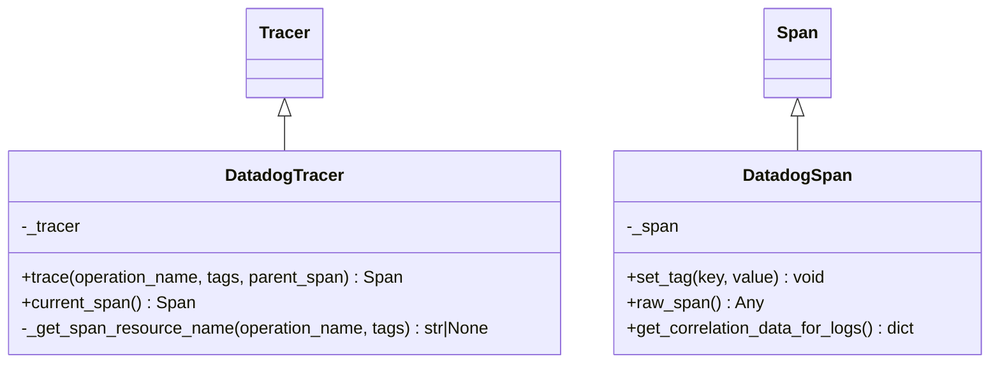
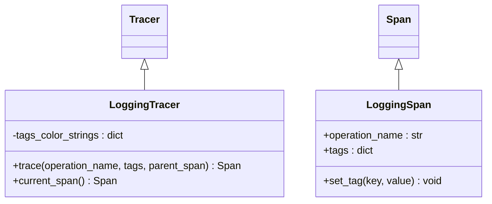
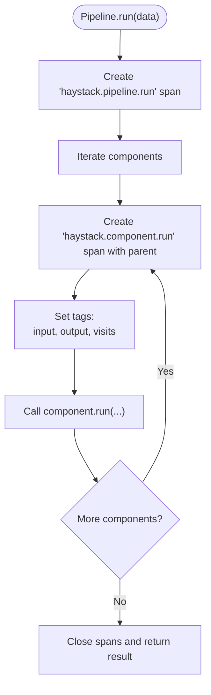
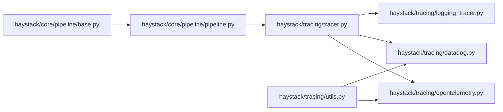

# Distributed Tracing

<cite>
**Referenced Files in This Document**
- [haystack/tracing/__init__.py](file://haystack/tracing/__init__.py)
- [haystack/tracing/tracer.py](file://haystack/tracing/tracer.py)
- [haystack/tracing/opentelemetry.py](file://haystack/tracing/opentelemetry.py)
- [haystack/tracing/datadog.py](file://haystack/tracing/datadog.py)
- [haystack/tracing/logging_tracer.py](file://haystack/tracing/logging_tracer.py)
- [haystack/tracing/utils.py](file://haystack/tracing/utils.py)
- [haystack/core/pipeline/base.py](file://haystack/core/pipeline/base.py)
- [haystack/core/pipeline/pipeline.py](file://haystack/core/pipeline/pipeline.py)
- [test/tracing/test_opentelemetry.py](file://test/tracing/test_opentelemetry.py)
- [test/tracing/test_datadog.py](file://test/tracing/test_datadog.py)
- [test/tracing/test_logging_tracer.py](file://test/tracing/test_logging_tracer.py)
- [test/core/pipeline/test_tracing.py](file://test/core/pipeline/test_tracing.py)
</cite>

## Table of Contents
1. [Introduction](#introduction)
2. [Project Structure](#project-structure)
3. [Core Components](#core-components)
4. [Architecture Overview](#architecture-overview)
5. [Detailed Component Analysis](#detailed-component-analysis)
6. [Dependency Analysis](#dependency-analysis)
7. [Performance Considerations](#performance-considerations)
8. [Troubleshooting Guide](#troubleshooting-guide)
9. [Conclusion](#conclusion)
10. [Appendices](#appendices)

## Introduction
This document explains Haystack’s distributed tracing capabilities for monitoring pipeline execution across multiple components and services. It covers the tracing architecture, built-in tracer implementations (OpenTelemetry, Datadog, and a logging tracer), span creation and correlation, configuration across environments, instrumentation of custom components, performance and sampling considerations, and best practices for privacy and security.

## Project Structure
The tracing subsystem is organized around a small set of core abstractions and provider-specific implementations. The pipeline integrates tracing at key boundaries (pipeline run and component run), and utilities handle safe tagging and coercion of values for tracing backends.

**Diagram sources**
- [haystack/tracing/tracer.py](file://haystack/tracing/tracer.py#L82-L161)
- [haystack/tracing/opentelemetry.py](file://haystack/tracing/opentelemetry.py#L46-L73)
- [haystack/tracing/datadog.py](file://haystack/tracing/datadog.py#L54-L96)
- [haystack/tracing/logging_tracer.py](file://haystack/tracing/logging_tracer.py#C34-L92)
- [haystack/core/pipeline/base.py](file://haystack/core/pipeline/base.py#L67-L71)
- [haystack/core/pipeline/pipeline.py](file://haystack/core/pipeline/pipeline.py#L42-L110)

**Section sources**
- [haystack/tracing/__init__.py](file://haystack/tracing/__init__.py#L7-L17)
- [haystack/tracing/tracer.py](file://haystack/tracing/tracer.py#L19-L161)
- [haystack/tracing/opentelemetry.py](file://haystack/tracing/opentelemetry.py#L18-L73)
- [haystack/tracing/datadog.py](file://haystack/tracing/datadog.py#L23-L96)
- [haystack/tracing/logging_tracer.py](file://haystack/tracing/logging_tracer.py#L19-L92)
- [haystack/core/pipeline/base.py](file://haystack/core/pipeline/base.py#L67-L71)
- [haystack/core/pipeline/pipeline.py](file://haystack/core/pipeline/pipeline.py#L42-L110)

## Core Components
- Tracer: Abstract interface for creating and managing spans. Implemented by provider-specific tracers and a no-op implementation.
- Span: Abstract interface for tagging and correlating operations. Provider-specific spans wrap native SDK spans and expose correlation helpers for logs.
- ProxyTracer: Holds the active tracer instance and toggles content tracing via environment variables.
- NullTracer/NullSpan: No-op implementations used when tracing is disabled.
- Utilities: Tag coercion to backend-compatible types and safe serialization of complex values.

Key behaviors:
- Automatic provider detection and activation when tracing is not explicitly configured.
- Environment-based controls for enabling/disabling tracing and content tags.
- Pipeline-level span creation for pipeline runs and component runs with standardized tags.

**Section sources**
- [haystack/tracing/tracer.py](file://haystack/tracing/tracer.py#L82-L161)
- [haystack/tracing/utils.py](file://haystack/tracing/utils.py#L15-L66)
- [haystack/core/pipeline/base.py](file://haystack/core/pipeline/base.py#L67-L71)
- [haystack/core/pipeline/pipeline.py](file://haystack/core/pipeline/pipeline.py#L42-L110)

## Architecture Overview
Haystack’s tracing architecture centers on a thin abstraction layer that delegates to provider SDKs. The pipeline creates spans around top-level pipeline runs and per-component runs, attaching standardized tags. Providers implement span tagging and correlation helpers, and a logging tracer offers a simple fallback for local development.

**Diagram sources**
- [haystack/core/pipeline/pipeline.py](file://haystack/core/pipeline/pipeline.py#L42-L110)
- [haystack/core/pipeline/base.py](file://haystack/core/pipeline/base.py#L67-L71)
- [haystack/tracing/tracer.py](file://haystack/tracing/tracer.py#L111-L161)
- [haystack/tracing/opentelemetry.py](file://haystack/tracing/opentelemetry.py#L46-L73)
- [haystack/tracing/datadog.py](file://haystack/tracing/datadog.py#L54-L96)

## Detailed Component Analysis

### Tracing Abstractions and Proxy
- Tracer: Defines the contract for creating spans and accessing the current span.
- Span: Defines tagging and correlation helpers; includes a specialized method for content tags gated by an environment flag.
- ProxyTracer: Holds the active tracer, forwards calls, and controls content tracing via environment variables.
- NullTracer/NullSpan: No-op implementations to disable tracing without changing imports.

**Diagram sources**
- [haystack/tracing/tracer.py](file://haystack/tracing/tracer.py#L82-L161)

**Section sources**
- [haystack/tracing/tracer.py](file://haystack/tracing/tracer.py#L19-L161)

### OpenTelemetry Integration
- OpenTelemetryTracer wraps an OpenTelemetry Tracer, starts spans as the current span, and applies tags via attributes.
- OpenTelemetrySpan coerces tag values to backend-compatible types and exposes correlation data for logs via span context.
- The tracer supports retrieving the current span and accessing the underlying native span.

**Diagram sources**
- [haystack/tracing/opentelemetry.py](file://haystack/tracing/opentelemetry.py#L46-L73)

**Section sources**
- [haystack/tracing/opentelemetry.py](file://haystack/tracing/opentelemetry.py#L18-L73)
- [haystack/tracing/utils.py](file://haystack/tracing/utils.py#L15-L66)

### Datadog Integration
- DatadogTracer wraps a Datadog Tracer, starts spans with optional resource naming for component runs, and applies tags via the provider’s tagging API.
- DatadogSpan coerces tag values and exposes correlation data for logs via the provider’s log correlation context.
- Specialized resource naming for component spans improves visibility in Datadog.

**Diagram sources**
- [haystack/tracing/datadog.py](file://haystack/tracing/datadog.py#L54-L96)

**Section sources**
- [haystack/tracing/datadog.py](file://haystack/tracing/datadog.py#L23-L96)
- [haystack/tracing/utils.py](file://haystack/tracing/utils.py#L15-L66)

### Logging Tracer (Development)
- LoggingTracer logs operation names and tags at debug level and supports optional ANSI color mapping per tag.
- LoggingSpan stores tags and logs them when the context exits, ensuring visibility even on failures.
- Useful for local development and debugging without external backends.

**Diagram sources**
- [haystack/tracing/logging_tracer.py](file://haystack/tracing/logging_tracer.py#L34-L92)

**Section sources**
- [haystack/tracing/logging_tracer.py](file://haystack/tracing/logging_tracer.py#L19-L92)

### Pipeline Integration and Span Creation
- PipelineBase defines standardized tag keys for component input, output, and visit counts.
- Pipeline.run and _run_component create spans around pipeline runs and component runs respectively, attaching tags and preserving context.
- Parent-child relationships ensure spans nest correctly across pipeline and component boundaries.

**Diagram sources**
- [haystack/core/pipeline/base.py](file://haystack/core/pipeline/base.py#L67-L71)
- [haystack/core/pipeline/pipeline.py](file://haystack/core/pipeline/pipeline.py#L42-L110)

**Section sources**
- [haystack/core/pipeline/base.py](file://haystack/core/pipeline/base.py#L67-L71)
- [haystack/core/pipeline/pipeline.py](file://haystack/core/pipeline/pipeline.py#L42-L110)

## Dependency Analysis
- Provider detection and auto-enable logic resides in the tracer module and defers imports to avoid warnings when providers are not installed.
- Pipeline depends on tracing constants and tags to enrich spans with component metadata.
- Utilities are shared across providers to ensure consistent tag value coercion.

**Diagram sources**
- [haystack/tracing/tracer.py](file://haystack/tracing/tracer.py#L206-L240)
- [haystack/tracing/opentelemetry.py](file://haystack/tracing/opentelemetry.py#L13-L16)
- [haystack/tracing/datadog.py](file://haystack/tracing/datadog.py#L13-L16)
- [haystack/tracing/utils.py](file://haystack/tracing/utils.py#L15-L66)
- [haystack/core/pipeline/base.py](file://haystack/core/pipeline/base.py#L67-L71)
- [haystack/core/pipeline/pipeline.py](file://haystack/core/pipeline/pipeline.py#L42-L110)

**Section sources**
- [haystack/tracing/tracer.py](file://haystack/tracing/tracer.py#L206-L240)
- [haystack/tracing/opentelemetry.py](file://haystack/tracing/opentelemetry.py#L13-L16)
- [haystack/tracing/datadog.py](file://haystack/tracing/datadog.py#L13-L16)
- [haystack/tracing/utils.py](file://haystack/tracing/utils.py#L15-L66)
- [haystack/core/pipeline/base.py](file://haystack/core/pipeline/base.py#L67-L71)
- [haystack/core/pipeline/pipeline.py](file://haystack/core/pipeline/pipeline.py#L42-L110)

## Performance Considerations
- Overhead: Creating spans and tags introduces overhead proportional to the number of spans and tag cardinality. Keep tag values concise and avoid large or deeply nested structures.
- Tag coercion: Complex values are serialized to strings or JSON-like structures. Prefer primitive types or small, representative structures to minimize cost and payload size.
- Sampling: Configure provider sampling strategies at the SDK level (e.g., OpenTelemetry exporter sampling or Datadog sampling) to reduce overhead in high-throughput scenarios.
- Context preservation: Pipeline ensures context propagation across components, minimizing accidental overhead from manual context management.

[No sources needed since this section provides general guidance]

## Troubleshooting Guide
Common issues and remedies:
- No traces appear:
  - Verify tracing is enabled and a provider is available. Auto-enable checks for provider availability and enables the appropriate tracer.
  - Confirm environment variables controlling tracing and content tags are set appropriately.
- Unexpected tag values:
  - Ensure tag values are coerced to primitives or JSON-serializable structures. Complex objects are serialized; large structures increase payload size.
- Correlation with logs:
  - Use the correlation helpers exposed by provider spans to attach trace identifiers to log entries.
- Pipeline loops and cycles:
  - Tracing handles looping components correctly; ensure parent spans are passed down to maintain proper hierarchy.

Validation references:
- OpenTelemetry tests demonstrate span creation, tagging, current span retrieval, and log correlation data extraction.
- Datadog tests demonstrate resource naming for component spans and meta tagging.
- Logging tracer tests demonstrate operation logging and content tag handling under success and failure conditions.
- Pipeline tracing tests demonstrate standardized tags and parent-child span relationships.

**Section sources**
- [test/tracing/test_opentelemetry.py](file://test/tracing/test_opentelemetry.py#L32-L94)
- [test/tracing/test_datadog.py](file://test/tracing/test_datadog.py#L35-L109)
- [test/tracing/test_logging_tracer.py](file://test/tracing/test_logging_tracer.py#L25-L158)
- [test/core/pipeline/test_tracing.py](file://test/core/pipeline/test_tracing.py#L41-L144)

## Conclusion
Haystack’s tracing architecture provides a clean abstraction over multiple providers, integrates naturally with pipeline execution, and offers practical tools for development and production. By leveraging standardized tags, provider-specific correlation helpers, and environment-driven configuration, teams can monitor pipeline behavior effectively while maintaining performance and privacy.

[No sources needed since this section summarizes without analyzing specific files]

## Appendices

### Configuration and Setup Examples
- Enable a specific provider:
  - For OpenTelemetry, configure an OpenTelemetry TracerProvider and exporter, then wrap it with the OpenTelemetryTracer and enable it globally.
  - For Datadog, ensure the Datadog tracer is enabled and configured, then wrap it with the DatadogTracer and enable it globally.
  - For development, use the LoggingTracer to emit spans to logs.
- Environment variables:
  - Control auto-enable behavior and content tag emission via environment variables.
- Provider-specific exporters:
  - Configure exporters for OpenTelemetry (e.g., OTLP) and Datadog (e.g., agent-based collection) according to provider documentation.

[No sources needed since this section provides general guidance]

### Instrumenting Custom Components
- Use the global tracer to create spans around expensive or critical sections of your component’s run method.
- Attach standardized tags for inputs, outputs, and metadata to improve observability.
- Respect content tracing settings to avoid leaking sensitive data.

**Section sources**
- [haystack/tracing/tracer.py](file://haystack/tracing/tracer.py#L169-L182)
- [haystack/core/pipeline/base.py](file://haystack/core/pipeline/base.py#L67-L71)

### Privacy and Security Best Practices
- Disable content tags by default; enable only when necessary and in controlled environments.
- Sanitize inputs and outputs before tagging to remove PII or secrets.
- Use provider-native filtering and redaction features to protect sensitive data in traces.

[No sources needed since this section provides general guidance]