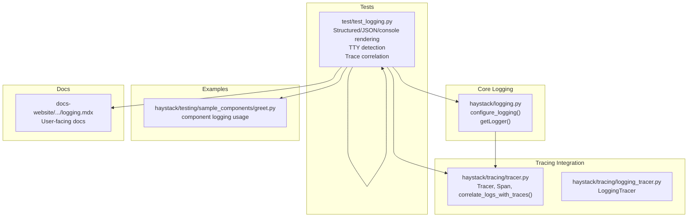
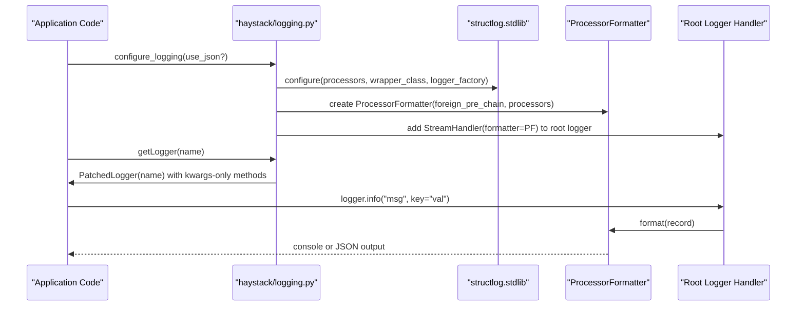
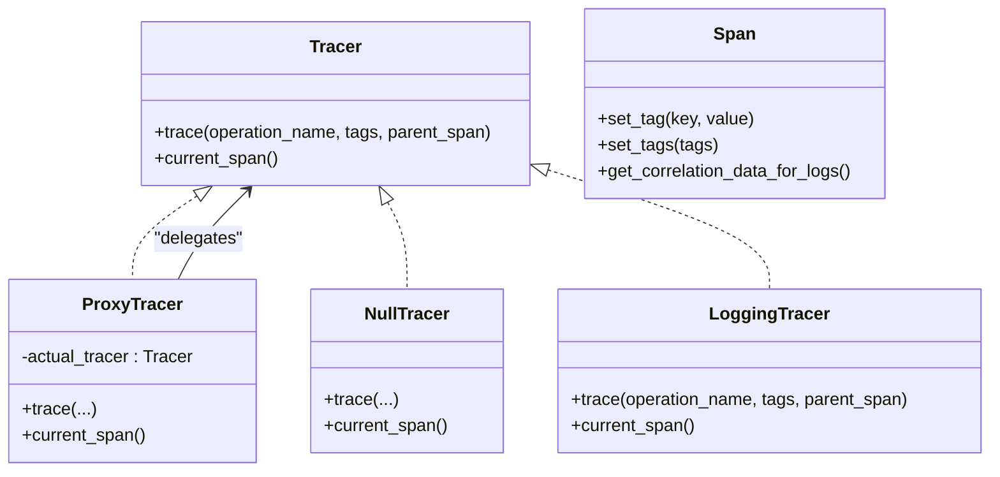
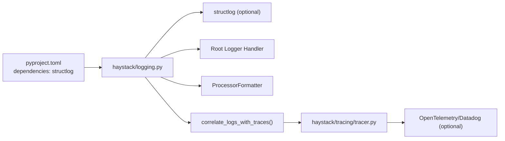

# Logging Configuration

<cite>
**Referenced Files in This Document**
- [logging.py](file://haystack/logging.py)
- [test_logging.py](file://test/test_logging.py)
- [tracer.py](file://haystack/tracing/tracer.py)
- [logging_tracer.py](file://haystack/tracing/logging_tracer.py)
- [pyproject.toml](file://pyproject.toml)
- [greet.py](file://haystack/testing/sample_components/greet.py)
- [logging.mdx (v2.25)](file://docs-website/versioned_docs/version-2.25/development/logging.mdx)
</cite>

## Table of Contents
1. [Introduction](#introduction)
2. [Project Structure](#project-structure)
3. [Core Components](#core-components)
4. [Architecture Overview](#architecture-overview)
5. [Detailed Component Analysis](#detailed-component-analysis)
6. [Dependency Analysis](#dependency-analysis)
7. [Performance Considerations](#performance-considerations)
8. [Troubleshooting Guide](#troubleshooting-guide)
9. [Conclusion](#conclusion)
10. [Appendices](#appendices)

## Introduction
This document explains Haystack’s logging system configuration and approach to structured logging. It covers the logger hierarchy, logging levels, formatting options, handler configuration, integration with structlog, and correlation with distributed tracing. It also provides best practices for component development, pipeline debugging, context propagation, performance tuning, environment-specific configurations, and log aggregation strategies.

## Project Structure
The logging system is centered around a small, focused module that adapts Python’s standard logging and optionally integrates structlog. It also provides helpers to correlate logs with traces and utilities to enforce keyword-only arguments for structured logs.

**Diagram sources**
- [logging.py](file://haystack/logging.py#L298-L404)
- [tracer.py](file://haystack/tracing/tracer.py#L73-L79)
- [logging_tracer.py](file://haystack/tracing/logging_tracer.py#L34-L92)
- [test_logging.py](file://test/test_logging.py#L1-L603)
- [greet.py](file://haystack/testing/sample_components/greet.py#L10-L46)
- [logging.mdx (v2.25)](file://docs-website/versioned_docs/version-2.25/development/logging.mdx#L1-L35)

**Section sources**
- [logging.py](file://haystack/logging.py#L1-L404)
- [tracer.py](file://haystack/tracing/tracer.py#L1-L244)
- [logging_tracer.py](file://haystack/tracing/logging_tracer.py#L1-L92)
- [test_logging.py](file://test/test_logging.py#L1-L603)
- [greet.py](file://haystack/testing/sample_components/greet.py#L1-L46)
- [logging.mdx (v2.25)](file://docs-website/versioned_docs/version-2.25/development/logging.mdx#L1-L35)

## Core Components
- Structured logging configuration and handler setup
- Keyword-only argument enforcement for structured logs
- Automatic TTY detection and renderer selection
- Trace correlation for log entries
- Logger retrieval with patched methods

Key responsibilities:
- Provide a unified logging configuration path via a single function
- Enforce structured logging by requiring keyword arguments
- Render logs consistently across environments (console vs JSON)
- Optionally correlate logs with active tracing spans

**Section sources**
- [logging.py](file://haystack/logging.py#L298-L404)
- [logging.py](file://haystack/logging.py#L136-L184)
- [logging.py](file://haystack/logging.py#L268-L296)
- [logging.py](file://haystack/logging.py#L240-L266)

## Architecture Overview
The logging subsystem composes Python’s standard logging with structlog when available. It installs a StreamHandler that formats all standard logging entries through a ProcessorFormatter. Structured logs are enriched with level, timestamp, contextvars, filename/line, and optional trace correlation.

**Diagram sources**
- [logging.py](file://haystack/logging.py#L298-L404)
- [logging.py](file://haystack/logging.py#L240-L266)

## Detailed Component Analysis

### Structured Logging Configuration
- Environment-driven behavior:
  - If structlog is not installed, fallback to standard logging.
  - If structlog is installed, configure it to format logs.
  - Respect explicit parameter and environment variables to choose JSON or console rendering.
- Renderer selection:
  - ConsoleRenderer for interactive terminals (TTY, IPython, Jupyter).
  - JSONRenderer for non-TTY environments by default or when explicitly requested.
- Root handler management:
  - Adds a single StreamHandler named for deduplication.
  - Preserves existing handlers to avoid duplication.

Key behaviors validated by tests:
- Console rendering in interactive environments.
- JSON rendering in non-TTY environments.
- Environment variable overrides for renderer choice.
- Filtering by log level at the root logger.

**Section sources**
- [logging.py](file://haystack/logging.py#L298-L404)
- [test_logging.py](file://test/test_logging.py#L60-L198)
- [test_logging.py](file://test/test_logging.py#L200-L285)

### Keyword-Only Argument Enforcement and String Interpolation
- All patched logger methods accept only keyword arguments.
- Stack level is adjusted so log calls point to the caller, not the wrapper.
- Records use keyword-based string interpolation to prevent index errors and preserve literal braces.

Benefits:
- Enforces structured logging discipline.
- Prevents accidental positional interpolation.
- Avoids silent failures with malformed format strings.

**Section sources**
- [logging.py](file://haystack/logging.py#L136-L184)
- [logging.py](file://haystack/logging.py#L187-L210)
- [test_logging.py](file://test/test_logging.py#L517-L537)

### Logger Retrieval and Hierarchy
- getLogger returns a patched logger instance for a given name.
- The patched logger ensures all methods are keyword-only and adjusts stack information.
- makeRecord is patched to support keyword interpolation.

Implications:
- Consistent logging across Haystack internals and user code.
- Clear caller attribution in stack traces.

**Section sources**
- [logging.py](file://haystack/logging.py#L240-L266)

### Trace Correlation in Logs
- A processor adds correlation fields (e.g., trace_id, span_id) when tracing is enabled.
- Correlation data comes from the current span’s get_correlation_data_for_logs().
- Works with supported tracers; no-op otherwise.

Validation:
- JSON logs include correlation fields when a span is active.
- Console rendering excludes correlation fields by default.

**Section sources**
- [logging.py](file://haystack/logging.py#L280-L296)
- [tracer.py](file://haystack/tracing/tracer.py#L73-L79)
- [test_logging.py](file://test/test_logging.py#L336-L410)

### Tracing Integration Overview
- Tracer interface supports creating spans and retrieving the current span.
- ProxyTracer allows swapping tracers without changing global imports.
- Auto-enable logic attempts to detect and enable OpenTelemetry or Datadog tracers.

**Diagram sources**
- [tracer.py](file://haystack/tracing/tracer.py#L82-L161)
- [logging_tracer.py](file://haystack/tracing/logging_tracer.py#L34-L92)

**Section sources**
- [tracer.py](file://haystack/tracing/tracer.py#L1-L244)
- [logging_tracer.py](file://haystack/tracing/logging_tracer.py#L1-L92)

### Practical Examples and Best Practices
- Component logging:
  - Use haystack.logging.getLogger inside components to ensure structured, keyword-only logs.
  - Example: a sample component logs a formatted message with keyword arguments.

- Pipeline debugging:
  - Increase log level to INFO or DEBUG in development.
  - Use JSON logs in staging/production for downstream processing.

- Environment-specific configurations:
  - Development: interactive terminal with console renderer.
  - Staging/Production: JSON renderer, strict filtering, and correlation.

- Log aggregation and filtering:
  - JSON logs integrate with ELK, Grafana, Datadog.
  - Use correlation IDs to join logs with traces.

- Retention and volume:
  - Filter at the root logger level.
  - Avoid logging sensitive content; content tags can be controlled via environment.

**Section sources**
- [greet.py](file://haystack/testing/sample_components/greet.py#L10-L46)
- [logging.mdx (v2.25)](file://docs-website/versioned_docs/version-2.25/development/logging.mdx#L1-L35)
- [logging.mdx (v2.25)](file://docs-website/versioned_docs/version-2.25/development/logging.mdx#L74-L84)

## Dependency Analysis
- Structured logging depends on structlog when present.
- Trace correlation depends on an active tracer and its ability to provide correlation data.
- Tests validate renderer selection, filtering, and correlation under various conditions.

**Diagram sources**
- [pyproject.toml](file://pyproject.toml#L134-L135)
- [logging.py](file://haystack/logging.py#L312-L319)
- [logging.py](file://haystack/logging.py#L298-L404)
- [tracer.py](file://haystack/tracing/tracer.py#L73-L79)

**Section sources**
- [pyproject.toml](file://pyproject.toml#L134-L135)
- [logging.py](file://haystack/logging.py#L312-L319)
- [logging.py](file://haystack/logging.py#L298-L404)
- [tracer.py](file://haystack/tracing/tracer.py#L73-L79)

## Performance Considerations
- Renderer choice:
  - ConsoleRenderer is optimized for readability; JSONRenderer is more efficient for ingestion.
- Filtering:
  - Root-level filtering reduces unnecessary formatting overhead.
- Exception rendering:
  - JSON mode disables local variable dumps in exceptions to reduce payload size.
- Handler deduplication:
  - Ensures a single handler is attached to avoid duplicate outputs.

Recommendations:
- Prefer JSON in high-throughput environments.
- Keep log levels at WARNING or higher in production unless debugging.
- Avoid excessive DEBUG logs in hot paths.

**Section sources**
- [logging.py](file://haystack/logging.py#L363-L372)
- [logging.py](file://haystack/logging.py#L354-L360)
- [logging.py](file://haystack/logging.py#L395-L404)

## Troubleshooting Guide
Common issues and resolutions:
- No structlog detected:
  - Behavior falls back to standard logging. Install structlog to enable structured logs.
- Unexpected console output in CI:
  - Ensure TTY detection is disabled or set the environment variable to force JSON.
- Reserved keyword errors:
  - Use keyword-only arguments; the patched logger enforces this.
- Index or format errors:
  - Keyword interpolation prevents index errors; avoid mixing positional formatting.
- Missing correlation IDs:
  - Ensure tracing is enabled and a compatible tracer is active.

Validation in tests:
- Renderer selection under different environments.
- Filtering behavior by log level.
- Trace correlation presence/absence depending on tracer and mode.

**Section sources**
- [logging.py](file://haystack/logging.py#L312-L319)
- [test_logging.py](file://test/test_logging.py#L60-L198)
- [test_logging.py](file://test/test_logging.py#L200-L410)

## Conclusion
Haystack’s logging system provides a pragmatic balance between developer-friendly console output and production-grade JSON logs. It enforces structured logging through keyword-only arguments, intelligently selects renderers based on environment, and optionally correlates logs with distributed traces. With clear configuration hooks and environment controls, teams can tailor logging to each stage of the deployment lifecycle while maintaining performance and observability.

## Appendices

### Environment Variables and Options
- HAYSTACK_LOGGING_USE_JSON: Enable JSON renderer when set to true; defaults to false in TTY environments.
- HAYSTACK_LOGGING_IGNORE_STRUCTLOG: Skip structlog configuration and use standard logging.
- HAYSTACK_AUTO_TRACE_ENABLED: Controls automatic tracer enablement.
- HAYSTACK_CONTENT_TRACING_ENABLED: Controls inclusion of content-level tags in spans.

**Section sources**
- [logging.py](file://haystack/logging.py#L16-L17)
- [logging.py](file://haystack/logging.py#L321-L323)
- [logging.py](file://haystack/logging.py#L329-L339)
- [tracer.py](file://haystack/tracing/tracer.py#L13-L14)
- [tracer.py](file://haystack/tracing/tracer.py#L122)

### Example: Component-Level Logging
- Inside a component, retrieve a patched logger and emit structured logs with keyword arguments.

**Section sources**
- [greet.py](file://haystack/testing/sample_components/greet.py#L10-L46)