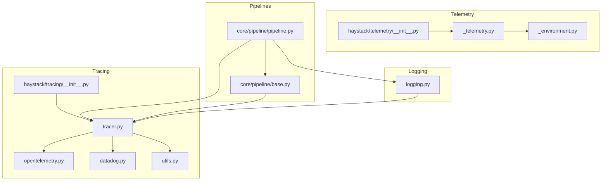
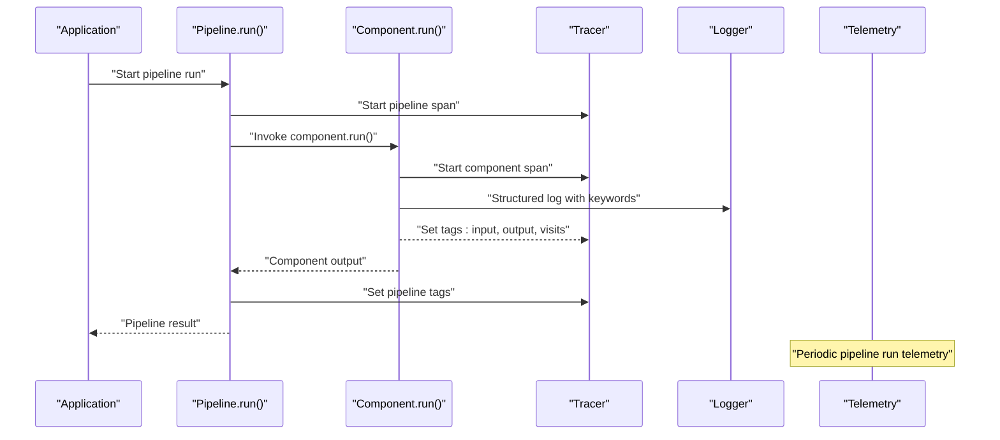
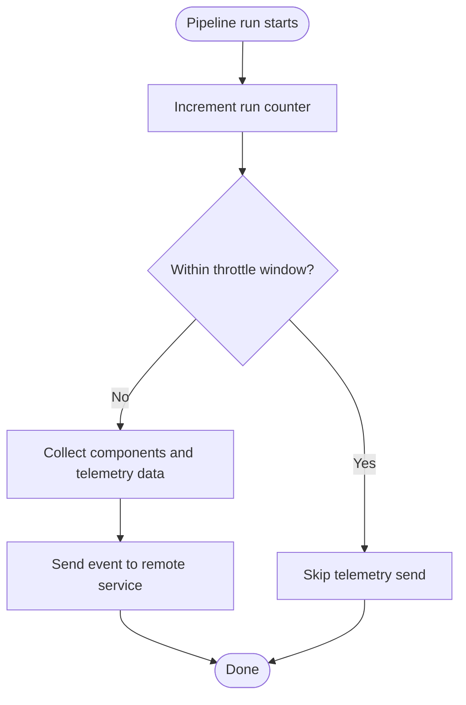
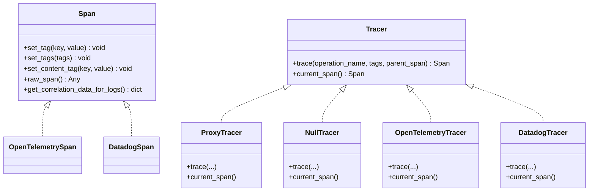
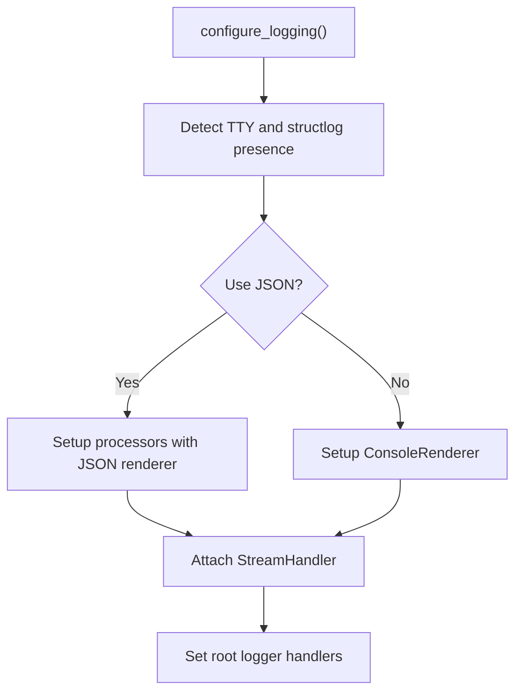
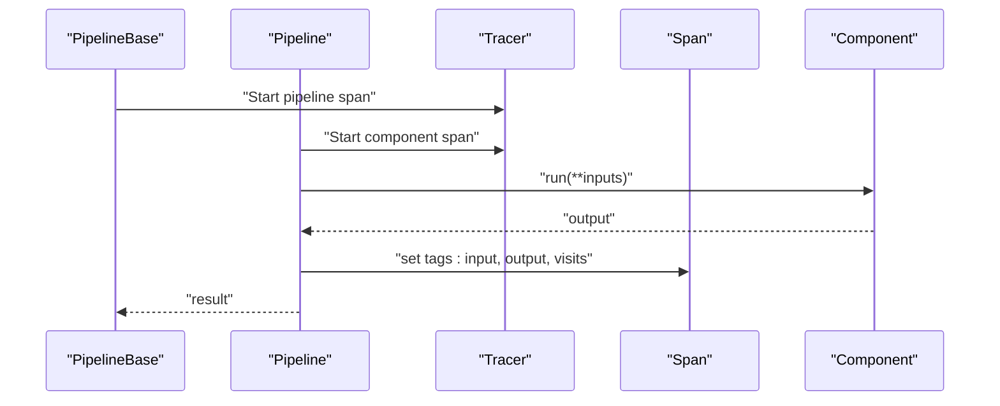
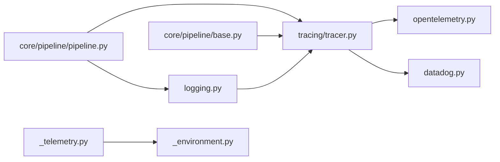

# Monitoring and Observability

<cite>
**Referenced Files in This Document**
- [haystack/telemetry/__init__.py](file://haystack/telemetry/__init__.py)
- [haystack/telemetry/_telemetry.py](file://haystack/telemetry/_telemetry.py)
- [haystack/telemetry/_environment.py](file://haystack/telemetry/_environment.py)
- [haystack/tracing/__init__.py](file://haystack/tracing/__init__.py)
- [haystack/tracing/tracer.py](file://haystack/tracing/tracer.py)
- [haystack/tracing/opentelemetry.py](file://haystack/tracing/opentelemetry.py)
- [haystack/tracing/datadog.py](file://haystack/tracing/datadog.py)
- [haystack/tracing/utils.py](file://haystack/tracing/utils.py)
- [haystack/logging.py](file://haystack/logging.py)
- [haystack/core/pipeline/base.py](file://haystack/core/pipeline/base.py)
- [haystack/core/pipeline/pipeline.py](file://haystack/core/pipeline/pipeline.py)
- [test/test_telemetry.py](file://test/test_telemetry.py)
- [test/core/pipeline/test_tracing.py](file://test/core/pipeline/test_tracing.py)
- [test/test_logging.py](file://test/test_logging.py)
</cite>

## Table of Contents
1. [Introduction](#introduction)
2. [Project Structure](#project-structure)
3. [Core Components](#core-components)
4. [Architecture Overview](#architecture-overview)
5. [Detailed Component Analysis](#detailed-component-analysis)
6. [Dependency Analysis](#dependency-analysis)
7. [Performance Considerations](#performance-considerations)
8. [Troubleshooting Guide](#troubleshooting-guide)
9. [Conclusion](#conclusion)
10. [Appendices](#appendices)

## Introduction
This document explains Haystack’s monitoring and observability features. It covers:
- Telemetry collection for component usage analytics and anonymized performance signals
- Distributed tracing for pipeline execution across components
- Logging configuration and structured logging patterns
- Alerting and notification strategies for production deployments
- Performance monitoring including latency tracking, resource utilization, and throughput
- Debugging techniques for pipeline execution and component behavior
- Integration with external monitoring systems (OpenTelemetry, Datadog, and custom stacks)
- Practical examples for development and production environments
- Privacy considerations and compliance for telemetry data

## Project Structure
Haystack’s observability is implemented across three primary subsystems:
- Telemetry: anonymous usage analytics and pipeline run signals
- Tracing: distributed tracing for pipelines and components
- Logging: structured logging with correlation to traces

**Diagram sources**
- [haystack/telemetry/__init__.py](file://haystack/telemetry/__init__.py#L1-L8)
- [haystack/telemetry/_telemetry.py](file://haystack/telemetry/_telemetry.py#L1-L192)
- [haystack/telemetry/_environment.py](file://haystack/telemetry/_environment.py#L1-L99)
- [haystack/tracing/__init__.py](file://haystack/tracing/__init__.py#L1-L17)
- [haystack/tracing/tracer.py](file://haystack/tracing/tracer.py#L1-L244)
- [haystack/tracing/opentelemetry.py](file://haystack/tracing/opentelemetry.py#L1-L73)
- [haystack/tracing/datadog.py](file://haystack/tracing/datadog.py#L1-L96)
- [haystack/tracing/utils.py](file://haystack/tracing/utils.py#L1-L66)
- [haystack/logging.py](file://haystack/logging.py#L1-L404)
- [haystack/core/pipeline/base.py](file://haystack/core/pipeline/base.py#L1-L200)
- [haystack/core/pipeline/pipeline.py](file://haystack/core/pipeline/pipeline.py#L1-L200)

**Section sources**
- [haystack/telemetry/__init__.py](file://haystack/telemetry/__init__.py#L1-L8)
- [haystack/tracing/__init__.py](file://haystack/tracing/__init__.py#L1-L17)
- [haystack/logging.py](file://haystack/logging.py#L1-L404)
- [haystack/core/pipeline/base.py](file://haystack/core/pipeline/base.py#L1-L200)
- [haystack/core/pipeline/pipeline.py](file://haystack/core/pipeline/pipeline.py#L1-L200)

## Core Components
- Telemetry: Anonymous usage analytics for pipeline runs and tutorials, with opt-out capability and environment metadata collection.
- Tracing: Pluggable tracer abstraction supporting OpenTelemetry and Datadog, plus auto-configuration and content-tagging controls.
- Logging: Structured logging with JSON rendering in production-like contexts, correlation with traces, and keyword-only log APIs.

**Section sources**
- [haystack/telemetry/_telemetry.py](file://haystack/telemetry/_telemetry.py#L34-L192)
- [haystack/telemetry/_environment.py](file://haystack/telemetry/_environment.py#L71-L99)
- [haystack/tracing/tracer.py](file://haystack/tracing/tracer.py#L19-L244)
- [haystack/tracing/opentelemetry.py](file://haystack/tracing/opentelemetry.py#L18-L73)
- [haystack/tracing/datadog.py](file://haystack/tracing/datadog.py#L23-L96)
- [haystack/logging.py](file://haystack/logging.py#L298-L404)

## Architecture Overview
High-level observability architecture:
- Telemetry events are produced by pipeline execution hooks and sent to a remote service when enabled.
- Tracing integrates at the pipeline and component boundaries, tagging inputs, outputs, and metadata.
- Logging is configured to emit structured logs and can correlate with active traces.

**Diagram sources**
- [haystack/core/pipeline/pipeline.py](file://haystack/core/pipeline/pipeline.py#L42-L110)
- [haystack/tracing/tracer.py](file://haystack/tracing/tracer.py#L82-L108)
- [haystack/logging.py](file://haystack/logging.py#L298-L404)
- [haystack/telemetry/_telemetry.py](file://haystack/telemetry/_telemetry.py#L137-L176)

## Detailed Component Analysis

### Telemetry: Usage Analytics and Pipeline Signals
- Purpose: Collect anonymous usage statistics for pipeline runs and tutorials to improve Haystack.
- Opt-out: Controlled by an environment variable; disabled by default in tests and can be toggled in production.
- Data: Includes system specs, pipeline identity, component types, and counts.
- Rate limiting: Events are throttled to a minimum interval to avoid noise.

**Diagram sources**
- [haystack/telemetry/_telemetry.py](file://haystack/telemetry/_telemetry.py#L137-L176)

Key behaviors and configuration:
- Environment variable to enable/disable telemetry globally.
- Persistent user ID stored in a config file for cross-session aggregation.
- System metadata collected once per process (OS, CPU count, containerization).
- Decorator ensures telemetry failures do not break execution.

**Section sources**
- [haystack/telemetry/_telemetry.py](file://haystack/telemetry/_telemetry.py#L24-L96)
- [haystack/telemetry/_telemetry.py](file://haystack/telemetry/_telemetry.py#L99-L134)
- [haystack/telemetry/_telemetry.py](file://haystack/telemetry/_telemetry.py#L137-L192)
- [haystack/telemetry/_environment.py](file://haystack/telemetry/_environment.py#L71-L99)
- [test/test_telemetry.py](file://test/test_telemetry.py#L17-L66)

### Tracing: Distributed Pipeline Execution Monitoring
- Abstractions: Span and Tracer define the instrumentation contract; ProxyTracer enables dynamic enable/disable.
- Backends: OpenTelemetry and Datadog tracers are supported; auto-configuration attempts to detect active backends.
- Tags: Standardized keys capture component names, types, input/output specs, and runtime metadata.
- Content tags: Sensitive content tagging is gated by an environment variable to protect privacy.

**Diagram sources**
- [haystack/tracing/tracer.py](file://haystack/tracing/tracer.py#L19-L161)
- [haystack/tracing/opentelemetry.py](file://haystack/tracing/opentelemetry.py#L18-L73)
- [haystack/tracing/datadog.py](file://haystack/tracing/datadog.py#L23-L96)

Implementation highlights:
- Auto-configuration checks for active OpenTelemetry or Datadog tracers and enables accordingly.
- Tag coercion utilities ensure backend-compatible values.
- Pipeline and component spans are created around execution, with content tags controlled by environment.

**Section sources**
- [haystack/tracing/tracer.py](file://haystack/tracing/tracer.py#L111-L244)
- [haystack/tracing/opentelemetry.py](file://haystack/tracing/opentelemetry.py#L46-L73)
- [haystack/tracing/datadog.py](file://haystack/tracing/datadog.py#L54-L96)
- [haystack/tracing/utils.py](file://haystack/tracing/utils.py#L15-L66)
- [test/core/pipeline/test_tracing.py](file://test/core/pipeline/test_tracing.py#L36-L98)

### Logging: Configuration and Structured Patterns
- Structured logging: When structlog is installed, logs are formatted with key-value pairs and timestamps; JSON rendering is used in non-TTY contexts by default.
- Correlation: Logs can include trace identifiers when tracing is enabled, allowing log-to-trace correlation.
- Keyword-only APIs: Enforced to encourage structured logging and consistent formatting.
- Environment controls: Toggle JSON output and ignore structlog behavior via environment variables.

**Diagram sources**
- [haystack/logging.py](file://haystack/logging.py#L298-L404)

Operational notes:
- JSON rendering is recommended for production to integrate with log collectors.
- Trace correlation adds trace_id and span_id to log records when tracing is active.
- String interpolation safety is ensured to avoid formatting errors.

**Section sources**
- [haystack/logging.py](file://haystack/logging.py#L298-L394)
- [test/test_logging.py](file://test/test_logging.py#L456-L495)

### Pipeline Execution Hooks and Component Behavior
- Pipeline-level spans capture input/output data and metadata.
- Component-level spans capture input/output specs, visits, and sanitized content when enabled.
- Exceptions are wrapped into pipeline-specific runtime errors for consistent diagnostics.

**Diagram sources**
- [haystack/core/pipeline/base.py](file://haystack/core/pipeline/base.py#L67-L71)
- [haystack/core/pipeline/pipeline.py](file://haystack/core/pipeline/pipeline.py#L42-L110)

**Section sources**
- [haystack/core/pipeline/base.py](file://haystack/core/pipeline/base.py#L67-L71)
- [haystack/core/pipeline/pipeline.py](file://haystack/core/pipeline/pipeline.py#L42-L110)
- [test/core/pipeline/test_tracing.py](file://test/core/pipeline/test_tracing.py#L36-L98)

## Dependency Analysis
Observability dependencies and coupling:
- Tracing depends on pluggable backends (OpenTelemetry, Datadog) and environment detection.
- Telemetry depends on environment metadata collection and a persistent config file.
- Logging depends on structlog availability and environment variables.
- Pipeline code integrates tracing and logging around component execution.

**Diagram sources**
- [haystack/core/pipeline/pipeline.py](file://haystack/core/pipeline/pipeline.py#L1-L31)
- [haystack/core/pipeline/base.py](file://haystack/core/pipeline/base.py#L1-L64)
- [haystack/tracing/tracer.py](file://haystack/tracing/tracer.py#L1-L24)
- [haystack/tracing/opentelemetry.py](file://haystack/tracing/opentelemetry.py#L1-L16)
- [haystack/tracing/datadog.py](file://haystack/tracing/datadog.py#L1-L17)
- [haystack/logging.py](file://haystack/logging.py#L1-L20)
- [haystack/telemetry/_telemetry.py](file://haystack/telemetry/_telemetry.py#L1-L28)
- [haystack/telemetry/_environment.py](file://haystack/telemetry/_environment.py#L1-L14)

**Section sources**
- [haystack/core/pipeline/pipeline.py](file://haystack/core/pipeline/pipeline.py#L1-L31)
- [haystack/core/pipeline/base.py](file://haystack/core/pipeline/base.py#L1-L64)
- [haystack/tracing/tracer.py](file://haystack/tracing/tracer.py#L1-L24)
- [haystack/logging.py](file://haystack/logging.py#L1-L20)
- [haystack/telemetry/_telemetry.py](file://haystack/telemetry/_telemetry.py#L1-L28)
- [haystack/telemetry/_environment.py](file://haystack/telemetry/_environment.py#L1-L14)

## Performance Considerations
- Telemetry throttling: Events are rate-limited to reduce overhead and network load.
- Tag coercion: Complex values are serialized or coerced to strings to minimize backend errors.
- Structured logging: JSON output reduces parsing overhead and improves ingestion performance.
- Content tracing: Sensitive content tagging is disabled by default; enable only when necessary to avoid data exposure.

[No sources needed since this section provides general guidance]

## Troubleshooting Guide
Common issues and remedies:
- Telemetry failures: Telemetry is wrapped to avoid breaking execution; check logs for debug messages if events fail to send.
- Tracing not active: Ensure a tracer backend is installed and active, or rely on auto-configuration. Verify environment variables controlling content tracing and auto-enable.
- Structured logging not applied: Confirm structlog installation and environment variables; in non-TTY contexts, JSON rendering is automatic.
- Pipeline execution errors: Inspect wrapped runtime errors for component-level context and stack traces.

**Section sources**
- [haystack/telemetry/_telemetry.py](file://haystack/telemetry/_telemetry.py#L112-L134)
- [haystack/tracing/tracer.py](file://haystack/tracing/tracer.py#L184-L204)
- [haystack/logging.py](file://haystack/logging.py#L321-L340)
- [test/test_telemetry.py](file://test/test_telemetry.py#L98-L116)

## Conclusion
Haystack provides a robust observability foundation:
- Anonymous telemetry for usage insights with opt-out and throttling
- Distributed tracing with multiple backends and content-tag gating
- Structured logging with trace correlation and JSON rendering
- Clear hooks for pipeline and component-level monitoring
Adopt these features to monitor latency, throughput, resource utilization, and component behavior, and integrate with your preferred monitoring stack.

[No sources needed since this section summarizes without analyzing specific files]

## Appendices

### Practical Setup Examples

- Development environment
  - Enable structured logging with JSON output for local runs.
  - Keep content tracing disabled by default; enable temporarily for debugging.
  - Use auto-enabled tracing if OpenTelemetry or Datadog is configured in your environment.

- Production environment
  - Configure JSON logging for log collectors.
  - Enable telemetry with opt-out documented and auditable.
  - Use tracing backends aligned with your observability stack (OpenTelemetry or Datadog).
  - Set up alerts for pipeline failure rates, latency p95/p99, and error budgets.

[No sources needed since this section provides general guidance]

### Privacy and Compliance Notes
- Telemetry is anonymous and opt-out by default; user IDs are persisted locally and not shared without consent.
- Content tracing is disabled by default; enable only when necessary and ensure data handling complies with applicable regulations.
- Structured logs avoid exposing sensitive data by default; sanitize inputs and outputs before tagging.

[No sources needed since this section provides general guidance]