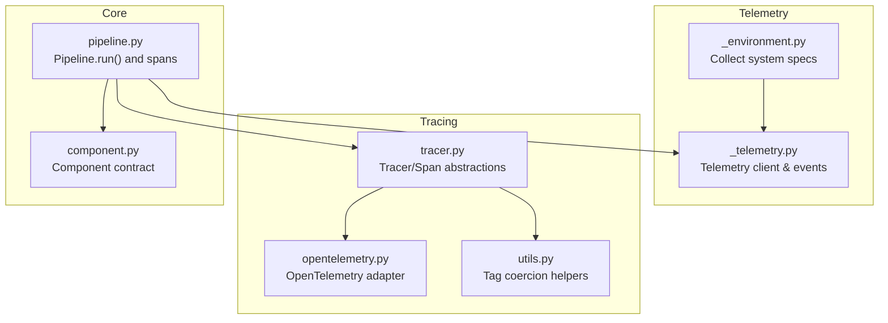
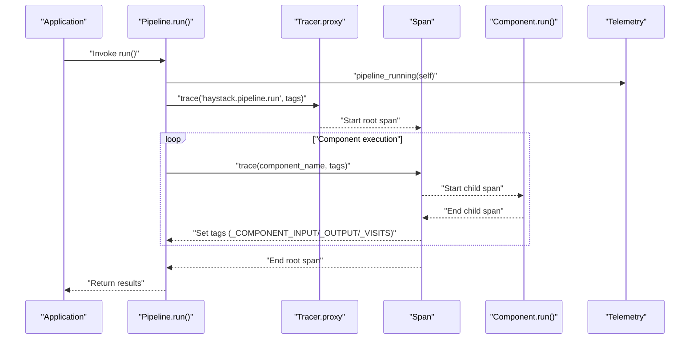
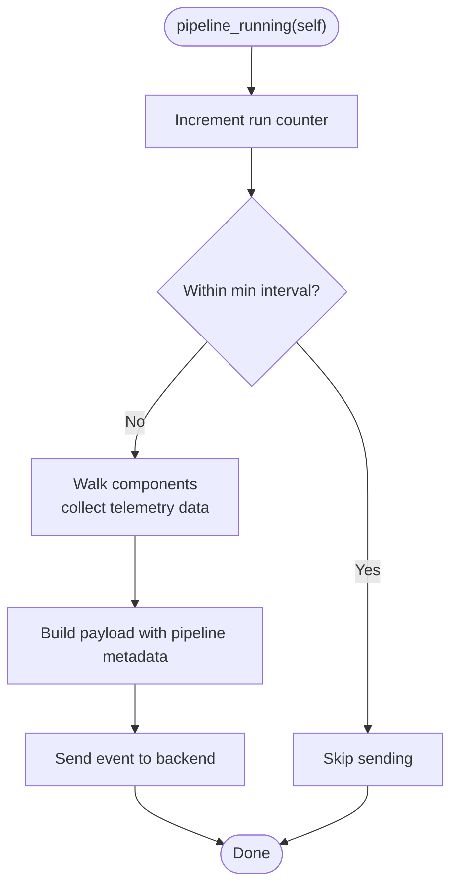
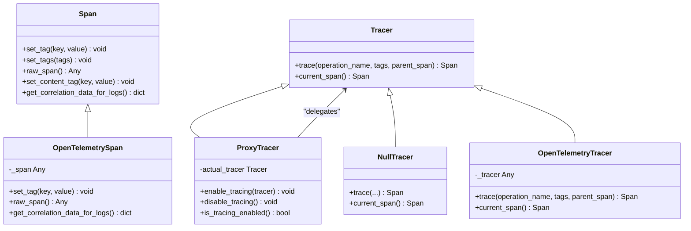
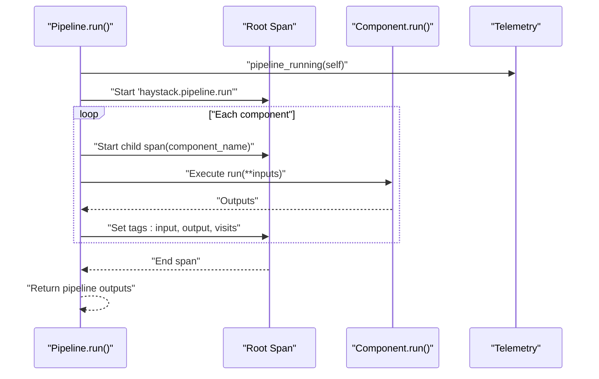
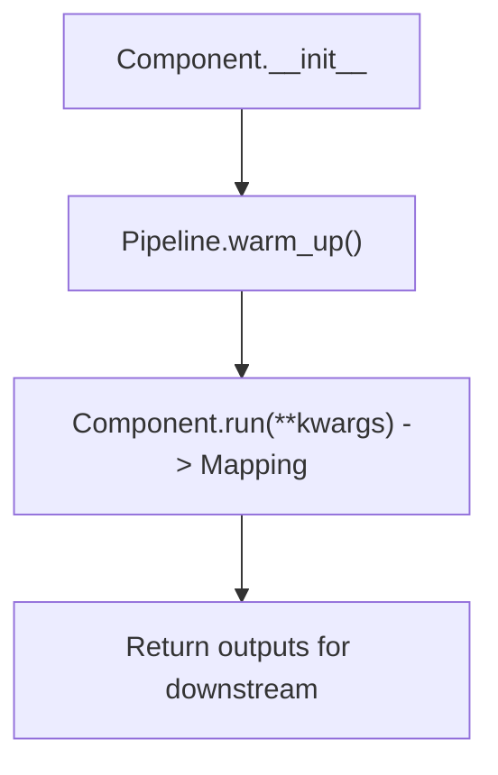
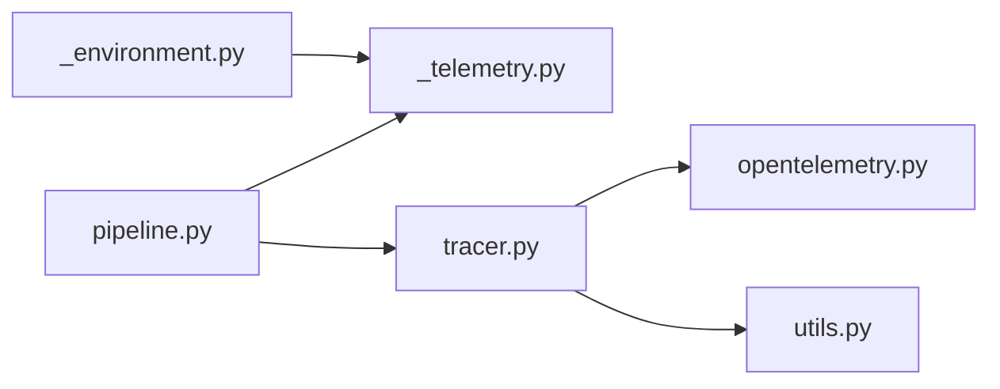

# Performance Monitoring

<cite>
**Referenced Files in This Document**
- [haystack/telemetry/_telemetry.py](file://haystack/telemetry/_telemetry.py)
- [haystack/telemetry/_environment.py](file://haystack/telemetry/_environment.py)
- [haystack/tracing/tracer.py](file://haystack/tracing/tracer.py)
- [haystack/tracing/opentelemetry.py](file://haystack/tracing/opentelemetry.py)
- [haystack/tracing/utils.py](file://haystack/tracing/utils.py)
- [haystack/core/pipeline/pipeline.py](file://haystack/core/pipeline/pipeline.py)
- [haystack/core/component/component.py](file://haystack/core/component/component.py)
- [haystack/tracing/__init__.py](file://haystack/tracing/__init__.py)
- [test/core/pipeline/test_tracing.py](file://test/core/pipeline/test_tracing.py)
- [test/tracing/test_opentelemetry.py](file://test/tracing/test_opentelemetry.py)
- [test/tracing/test_tracer.py](file://test/tracing/test_tracer.py)
- [test/tracing/utils.py](file://test/tracing/utils.py)
- [releasenotes/notes/openai-ttft-42b1ad551b542930.yaml](file://releasenotes/notes/openai-ttft-42b1ad551b542930.yaml)
- [releasenotes/notes/set-component-name-as-datadog-span-resource-name-bdec739077ca20ce.yaml](file://releasenotes/notes/set-component-name-as-datadog-span-resource-name-bdec739077ca20ce.yaml)
</cite>

## Table of Contents
1. [Introduction](#introduction)
2. [Project Structure](#project-structure)
3. [Core Components](#core-components)
4. [Architecture Overview](#architecture-overview)
5. [Detailed Component Analysis](#detailed-component-analysis)
6. [Dependency Analysis](#dependency-analysis)
7. [Performance Considerations](#performance-considerations)
8. [Troubleshooting Guide](#troubleshooting-guide)
9. [Conclusion](#conclusion)
10. [Appendices](#appendices)

## Introduction
This document explains how to monitor performance in Haystack applications. It covers:
- Latency tracking for pipeline execution, individual components, and end-to-end request timing
- Resource utilization signals (CPU, containerization metadata)
- Throughput measurement for concurrent and batch execution
- Profiling techniques to identify bottlenecks in component chains
- Integration with external observability tools (OpenTelemetry, Datadog)
- Alerting strategies for performance degradation
- Practical setup examples for containerized and cloud environments
- Optimization techniques and capacity planning
- Benchmarking and regression testing approaches

## Project Structure
The performance monitoring capabilities in Haystack are implemented across telemetry and tracing modules, with pipeline orchestration wiring telemetry and tracing into execution spans.

**Diagram sources**
- [haystack/telemetry/_environment.py](file://haystack/telemetry/_environment.py#L71-L99)
- [haystack/telemetry/_telemetry.py](file://haystack/telemetry/_telemetry.py#L99-L176)
- [haystack/tracing/tracer.py](file://haystack/tracing/tracer.py#L19-L108)
- [haystack/tracing/opentelemetry.py](file://haystack/tracing/opentelemetry.py#L18-L73)
- [haystack/tracing/utils.py](file://haystack/tracing/utils.py#L15-L66)
- [haystack/core/pipeline/pipeline.py](file://haystack/core/pipeline/pipeline.py#L111-L453)
- [haystack/core/component/component.py](file://haystack/core/component/component.py#L58-L74)

**Section sources**
- [haystack/telemetry/_telemetry.py](file://haystack/telemetry/_telemetry.py#L1-L192)
- [haystack/telemetry/_environment.py](file://haystack/telemetry/_environment.py#L1-L99)
- [haystack/tracing/tracer.py](file://haystack/tracing/tracer.py#L1-L244)
- [haystack/tracing/opentelemetry.py](file://haystack/tracing/opentelemetry.py#L1-L73)
- [haystack/tracing/utils.py](file://haystack/tracing/utils.py#L1-L66)
- [haystack/core/pipeline/pipeline.py](file://haystack/core/pipeline/pipeline.py#L1-L453)
- [haystack/core/component/component.py](file://haystack/core/component/component.py#L1-L645)

## Core Components
- Telemetry client: Sends anonymized usage and pipeline run events with system metadata.
- Environment collector: Gathers OS, CPU, containerization, and library presence metadata.
- Tracing abstractions: Span and Tracer interfaces with a proxy tracer and null tracer fallback.
- OpenTelemetry adapter: Bridges tracing spans to OpenTelemetry SDK.
- Pipeline instrumentation: Creates spans around pipeline runs and per-component execution, tagging inputs/outputs and visits.
- Component contract: Defines the run method contract and socket I/O for deterministic performance measurement.

Key responsibilities:
- Latency tracking: Pipeline-level span plus per-component spans with input/output tags.
- Resource metadata: CPU count, OS family, containerized flag, and library presence.
- Throughput: Count of pipeline runs and frequency gating to avoid event storms.
- Observability integration: OpenTelemetry and Datadog tracers via auto-enable logic.

**Section sources**
- [haystack/telemetry/_telemetry.py](file://haystack/telemetry/_telemetry.py#L99-L176)
- [haystack/telemetry/_environment.py](file://haystack/telemetry/_environment.py#L71-L99)
- [haystack/tracing/tracer.py](file://haystack/tracing/tracer.py#L19-L108)
- [haystack/tracing/opentelemetry.py](file://haystack/tracing/opentelemetry.py#L18-L73)
- [haystack/core/pipeline/pipeline.py](file://haystack/core/pipeline/pipeline.py#L73-L109)
- [haystack/core/component/component.py](file://haystack/core/component/component.py#L58-L74)

## Architecture Overview
The performance monitoring architecture integrates telemetry and tracing into the pipeline execution path.

**Diagram sources**
- [haystack/core/pipeline/pipeline.py](file://haystack/core/pipeline/pipeline.py#L226-L290)
- [haystack/telemetry/_telemetry.py](file://haystack/telemetry/_telemetry.py#L137-L176)
- [haystack/tracing/tracer.py](file://haystack/tracing/tracer.py#L124-L134)
- [haystack/tracing/opentelemetry.py](file://haystack/tracing/opentelemetry.py#L51-L64)

## Detailed Component Analysis

### Telemetry: Pipeline and System Metrics
- Event emission: The telemetry client sends a pipeline run event with pipeline identity, type, run count, and per-component telemetry data if available.
- Frequency gating: Events are throttled to a minimum interval to avoid flooding.
- System metadata: CPU count, OS family/version, machine, containerized flag, and selected library presence are captured once and reused.

**Diagram sources**
- [haystack/telemetry/_telemetry.py](file://haystack/telemetry/_telemetry.py#L137-L176)

**Section sources**
- [haystack/telemetry/_telemetry.py](file://haystack/telemetry/_telemetry.py#L99-L176)
- [haystack/telemetry/_environment.py](file://haystack/telemetry/_environment.py#L71-L99)

### Tracing Abstractions and OpenTelemetry Adapter
- Span and Tracer: Define tagging, content-tagging policy, and correlation data for logs.
- Proxy tracer: Enables dynamic enable/disable without changing global references.
- Null tracer: No-op implementation when tracing is disabled.
- OpenTelemetry adapter: Starts spans, coerces tag values, and exposes raw span for advanced usage.
- Auto-enable: Detects active OpenTelemetry or Datadog tracers and enables accordingly.

**Diagram sources**
- [haystack/tracing/tracer.py](file://haystack/tracing/tracer.py#L19-L108)
- [haystack/tracing/tracer.py](file://haystack/tracing/tracer.py#L111-L161)
- [haystack/tracing/tracer.py](file://haystack/tracing/tracer.py#L169-L182)
- [haystack/tracing/opentelemetry.py](file://haystack/tracing/opentelemetry.py#L18-L73)

**Section sources**
- [haystack/tracing/tracer.py](file://haystack/tracing/tracer.py#L1-L244)
- [haystack/tracing/opentelemetry.py](file://haystack/tracing/opentelemetry.py#L1-L73)
- [haystack/tracing/utils.py](file://haystack/tracing/utils.py#L15-L66)

### Pipeline Instrumentation and Component Execution Timing
- Pipeline-level span: Tags include input data, output data, metadata, and max runs per component.
- Component-level span: Captures inputs, outputs, and visit counts; wraps each component run.
- Error handling: Exceptions are wrapped into runtime errors; breakpoints and snapshots are supported.

**Diagram sources**
- [haystack/core/pipeline/pipeline.py](file://haystack/core/pipeline/pipeline.py#L282-L290)
- [haystack/core/pipeline/pipeline.py](file://haystack/core/pipeline/pipeline.py#L377-L385)
- [haystack/telemetry/_telemetry.py](file://haystack/telemetry/_telemetry.py#L137-L176)

**Section sources**
- [haystack/core/pipeline/pipeline.py](file://haystack/core/pipeline/pipeline.py#L73-L109)
- [haystack/core/pipeline/pipeline.py](file://haystack/core/pipeline/pipeline.py#L282-L290)

### Component Contract and Socket I/O
- Components must implement a run method returning a mapping of output keys to values.
- Input/Output sockets define the contract for deterministic I/O and validation.
- Warm-up: Heavy initialization should be deferred to warm_up to avoid repeated overhead.

**Diagram sources**
- [haystack/core/component/component.py](file://haystack/core/component/component.py#L58-L74)
- [haystack/core/component/component.py](file://haystack/core/component/component.py#L49-L56)

**Section sources**
- [haystack/core/component/component.py](file://haystack/core/component/component.py#L58-L74)
- [haystack/core/component/component.py](file://haystack/core/component/component.py#L49-L56)

## Dependency Analysis
- Pipeline depends on tracing for spans and telemetry for pipeline run events.
- Tracing adapters depend on external libraries (OpenTelemetry) and are conditionally imported.
- Environment collector is used by telemetry to enrich events with system metadata.

**Diagram sources**
- [haystack/telemetry/_telemetry.py](file://haystack/telemetry/_telemetry.py#L99-L176)
- [haystack/telemetry/_environment.py](file://haystack/telemetry/_environment.py#L71-L99)
- [haystack/core/pipeline/pipeline.py](file://haystack/core/pipeline/pipeline.py#L282-L290)
- [haystack/tracing/tracer.py](file://haystack/tracing/tracer.py#L206-L240)
- [haystack/tracing/opentelemetry.py](file://haystack/tracing/opentelemetry.py#L13-L16)

**Section sources**
- [haystack/core/pipeline/pipeline.py](file://haystack/core/pipeline/pipeline.py#L1-L453)
- [haystack/tracing/tracer.py](file://haystack/tracing/tracer.py#L206-L240)
- [haystack/tracing/opentelemetry.py](file://haystack/tracing/opentelemetry.py#L13-L16)
- [haystack/telemetry/_telemetry.py](file://haystack/telemetry/_telemetry.py#L99-L176)

## Performance Considerations
- Latency tracking
  - End-to-end: Root span duration in the pipeline run.
  - Per-component: Child spans around each component run capture execution time.
  - Inputs/outputs: Tagging helps correlate latency with payload sizes and types.
- Resource utilization
  - CPU count is collected as a system metric.
  - Containerized flag indicates deployment environment for capacity planning.
- Throughput
  - Telemetry tracks pipeline run counts and applies throttling to avoid event storms.
  - Concurrency: Use multiple pipeline instances or async variants to measure throughput under load.
- Profiling
  - Use tracing spans to identify slow components by duration and error rates.
  - Tag coercion ensures large payloads are handled gracefully.
- OpenTelemetry/Datadog
  - Auto-enable detects active tracers and wires them into the pipeline.
  - For Datadog, component spans use the component name as resource to improve filtering.

**Section sources**
- [haystack/core/pipeline/pipeline.py](file://haystack/core/pipeline/pipeline.py#L282-L290)
- [haystack/tracing/opentelemetry.py](file://haystack/tracing/opentelemetry.py#L51-L64)
- [haystack/tracing/utils.py](file://haystack/tracing/utils.py#L15-L66)
- [haystack/telemetry/_telemetry.py](file://haystack/telemetry/_telemetry.py#L99-L176)
- [releasenotes/notes/set-component-name-as-datadog-span-resource-name-bdec739077ca20ce.yaml](file://releasenotes/notes/set-component-name-as-datadog-span-resource-name-bdec739077ca20ce.yaml#L1-L4)

## Troubleshooting Guide
- Tracing disabled
  - If tracing is disabled, the proxy tracer falls back to a no-op tracer. Verify environment variables controlling auto-enable and enable/disable functions.
- Content tags
  - Sensitive content tagging requires explicit enabling. Use the content tracing environment variable to allow content tags.
- Tag coercion failures
  - If tag values are not primitive types, they are coerced to JSON or string. Large objects are serialized; ensure payloads are reasonable to avoid span size limits.
- Pipeline blocked or warnings
  - The pipeline validates inputs and warns if components are blocked due to missing inputs. Review component connections and defaults.

**Section sources**
- [haystack/tracing/tracer.py](file://haystack/tracing/tracer.py#L120-L123)
- [haystack/tracing/tracer.py](file://haystack/tracing/tracer.py#L54-L72)
- [haystack/tracing/utils.py](file://haystack/tracing/utils.py#L15-L66)
- [haystack/core/pipeline/pipeline.py](file://haystack/core/pipeline/pipeline.py#L310-L324)

## Conclusion
Haystack provides built-in mechanisms to monitor pipeline performance:
- End-to-end latency via tracing spans around pipeline runs
- Per-component timing and I/O correlation
- System metadata for capacity planning
- Telemetry for pipeline run counts and throttled reporting
- Integration with OpenTelemetry and Datadog through adapters and auto-enable logic

These capabilities can be combined with external dashboards and alerting systems to detect regressions and maintain performance SLAs.

## Appendices

### Practical Setup Examples

- Enable tracing and telemetry
  - Configure environment variables to enable auto-tracing and content tracing as needed.
  - Ensure OpenTelemetry or Datadog is installed and configured in your environment.

- Containerized environments
  - Containerization metadata is collected automatically; verify that the container detection logic matches your platform (Docker/Podman).
  - Use CPU count from telemetry for autoscaling decisions.

- Cloud environments
  - Export tracing data to your cloud provider’s tracing backend (e.g., APM).
  - Aggregate pipeline run durations and error rates to derive SLOs.

- Throughput and concurrency
  - Measure requests per second under varying concurrency levels.
  - Track component-level latencies to identify saturation points.

- Alerting strategies
  - Alert on increased pipeline run duration, error rate spikes, or dropped throughput.
  - Use telemetry run counters to detect unexpected drops in activity.

- Benchmarking and regression testing
  - Record pipeline run durations across versions.
  - Compare component-level timings to identify regressions.
  - Use release notes indicating latency-related enhancements (e.g., TTFT support) as references for measuring improvements.

**Section sources**
- [haystack/tracing/tracer.py](file://haystack/tracing/tracer.py#L184-L204)
- [haystack/telemetry/_environment.py](file://haystack/telemetry/_environment.py#L71-L99)
- [releasenotes/notes/openai-ttft-42b1ad551b542930.yaml](file://releasenotes/notes/openai-ttft-42b1ad551b542930.yaml#L1-L6)