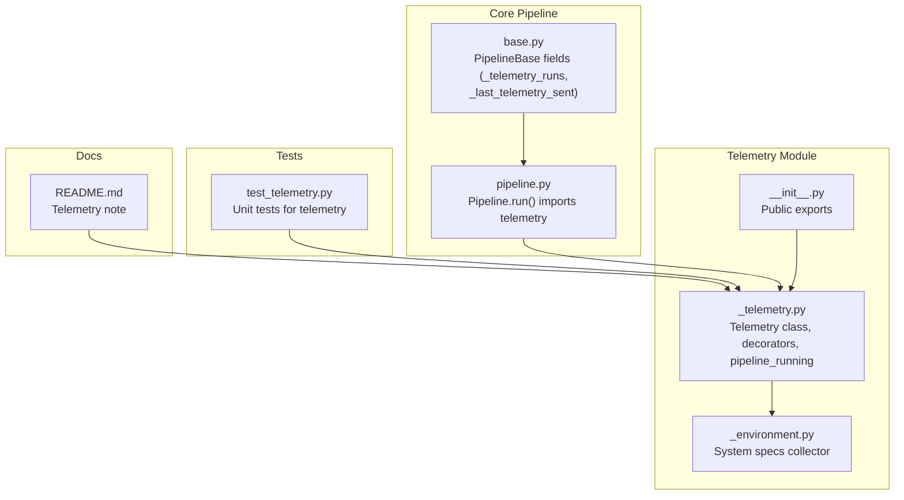
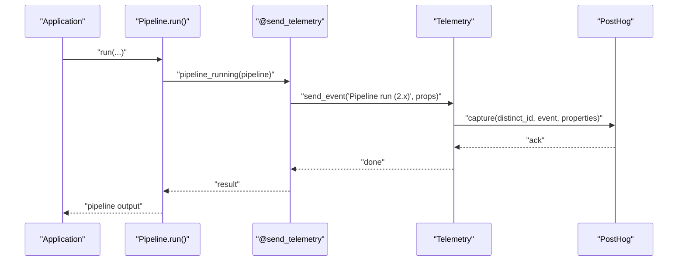
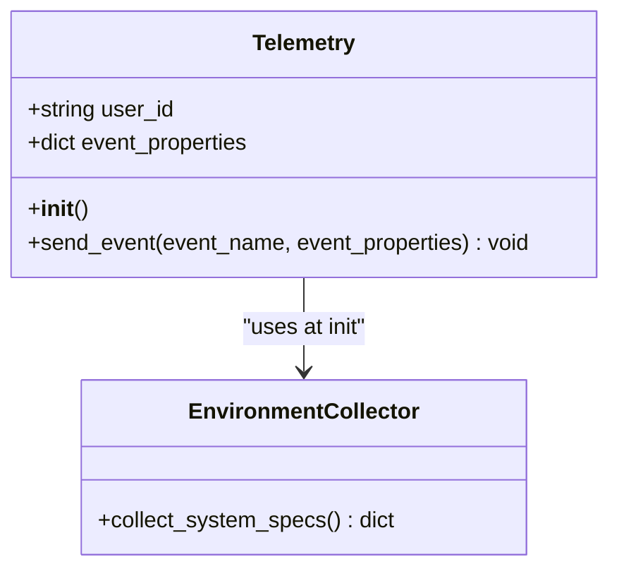
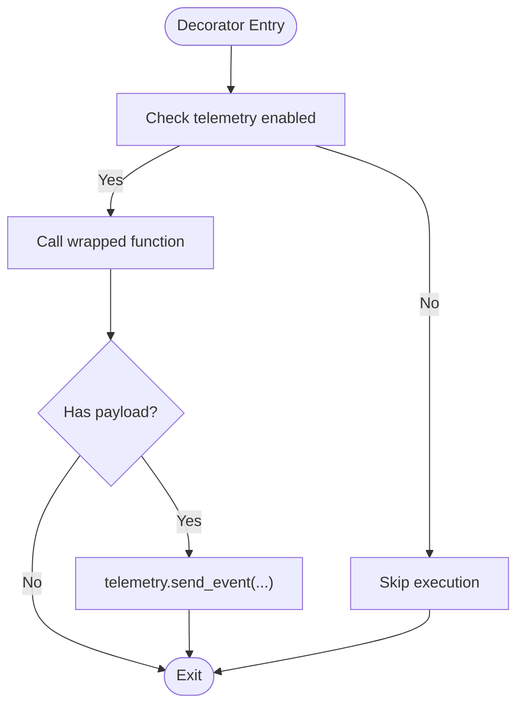
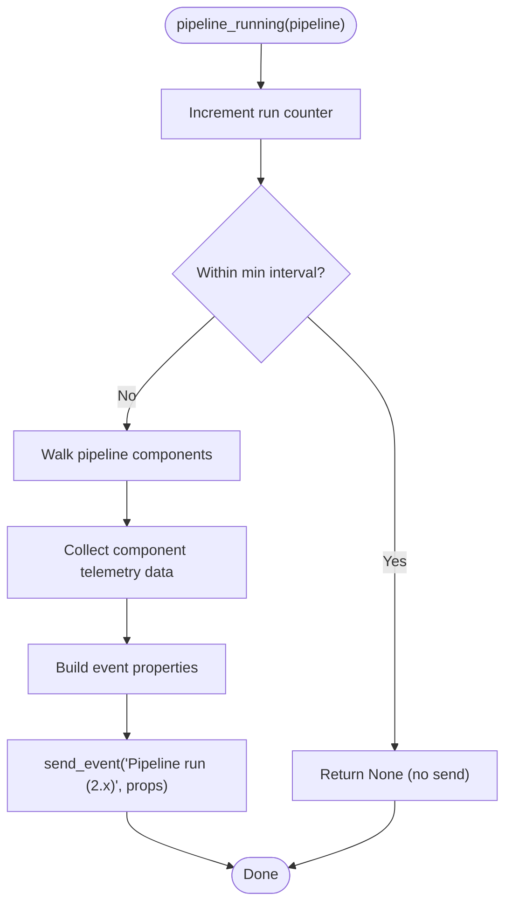
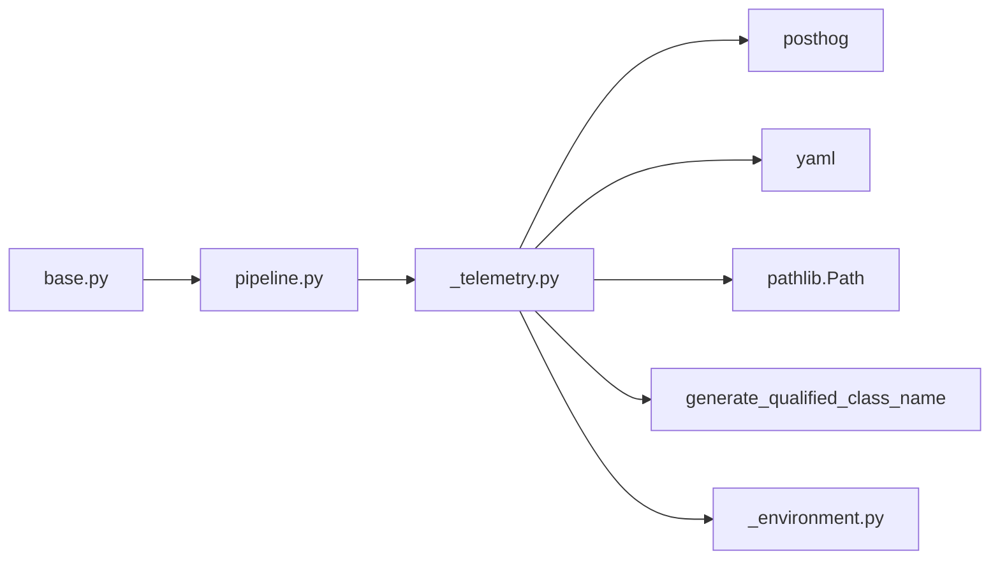

# Telemetry System

<cite>
**Referenced Files in This Document**
- [README.md](file://README.md)
- [haystack/telemetry/__init__.py](file://haystack/telemetry/__init__.py)
- [haystack/telemetry/_telemetry.py](file://haystack/telemetry/_telemetry.py)
- [haystack/telemetry/_environment.py](file://haystack/telemetry/_environment.py)
- [haystack/core/pipeline/base.py](file://haystack/core/pipeline/base.py)
- [haystack/core/pipeline/pipeline.py](file://haystack/core/pipeline/pipeline.py)
- [test/test_telemetry.py](file://test/test_telemetry.py)
</cite>

## Table of Contents
1. [Introduction](#introduction)
2. [Project Structure](#project-structure)
3. [Core Components](#core-components)
4. [Architecture Overview](#architecture-overview)
5. [Detailed Component Analysis](#detailed-component-analysis)
6. [Dependency Analysis](#dependency-analysis)
7. [Performance Considerations](#performance-considerations)
8. [Troubleshooting Guide](#troubleshooting-guide)
9. [Conclusion](#conclusion)
10. [Appendices](#appendices)

## Introduction
This document explains Haystack’s telemetry system designed to collect anonymous usage statistics to improve the software. It covers how telemetry is configured, how events are captured and sent, how pipeline runs and component usage are tracked, and how users can opt out. It also documents the decorator pattern used for automatic event sending, privacy and compliance considerations, and practical examples for enabling or disabling telemetry.

## Project Structure
The telemetry system is implemented under the haystack/telemetry package and integrates with the core pipeline execution. Key files:
- Telemetry core: haystack/telemetry/_telemetry.py
- Environment and system specs: haystack/telemetry/_environment.py
- Public exports: haystack/telemetry/__init__.py
- Pipeline integration: haystack/core/pipeline/base.py and haystack/core/pipeline/pipeline.py
- Tests: test/test_telemetry.py
- Project overview and telemetry note: README.md

**Diagram sources**
- [haystack/telemetry/_telemetry.py](file://haystack/telemetry/_telemetry.py#L34-L192)
- [haystack/telemetry/_environment.py](file://haystack/telemetry/_environment.py#L71-L99)
- [haystack/telemetry/__init__.py](file://haystack/telemetry/__init__.py#L7-L8)
- [haystack/core/pipeline/base.py](file://haystack/core/pipeline/base.py#L107-L108)
- [haystack/core/pipeline/pipeline.py](file://haystack/core/pipeline/pipeline.py#L28-L28)
- [test/test_telemetry.py](file://test/test_telemetry.py#L1-L117)
- [README.md](file://README.md#L82-L87)

**Section sources**
- [README.md](file://README.md#L82-L87)
- [haystack/telemetry/__init__.py](file://haystack/telemetry/__init__.py#L7-L8)
- [haystack/telemetry/_telemetry.py](file://haystack/telemetry/_telemetry.py#L34-L192)
- [haystack/telemetry/_environment.py](file://haystack/telemetry/_environment.py#L71-L99)
- [haystack/core/pipeline/base.py](file://haystack/core/pipeline/base.py#L107-L108)
- [haystack/core/pipeline/pipeline.py](file://haystack/core/pipeline/pipeline.py#L28-L28)
- [test/test_telemetry.py](file://test/test_telemetry.py#L1-L117)

## Core Components
- Telemetry class: Manages user identity, configuration file persistence, system specs collection, and event sending to PostHog.
- Environment collector: Gathers OS, Python, and library versions, and detects containerization.
- Decorator pattern: A wrapper that conditionally executes decorated functions and sends telemetry events.
- Pipeline integration: PipelineBase tracks run counts and timing to throttle telemetry events; pipeline.run() imports telemetry.

Key responsibilities:
- Anonymous usage stats: Tracks pipeline runs, component usage, and system specs.
- Opt-out: Controlled by environment variable and configuration file.
- Non-intrusive: Telemetry failures do not break execution.

**Section sources**
- [haystack/telemetry/_telemetry.py](file://haystack/telemetry/_telemetry.py#L34-L192)
- [haystack/telemetry/_environment.py](file://haystack/telemetry/_environment.py#L71-L99)
- [haystack/core/pipeline/base.py](file://haystack/core/pipeline/base.py#L107-L108)
- [haystack/core/pipeline/pipeline.py](file://haystack/core/pipeline/pipeline.py#L28-L28)

## Architecture Overview
High-level flow:
- On import, telemetry initialization checks environment and configuration to decide whether to enable telemetry.
- When a pipeline runs, the telemetry decorator triggers and sends a “Pipeline run (2.x)” event with component-level telemetry data.
- System specs are attached once at initialization and reused across events.

**Diagram sources**
- [haystack/core/pipeline/pipeline.py](file://haystack/core/pipeline/pipeline.py#L28-L28)
- [haystack/telemetry/_telemetry.py](file://haystack/telemetry/_telemetry.py#L116-L134)
- [haystack/telemetry/_telemetry.py](file://haystack/telemetry/_telemetry.py#L99-L114)

## Detailed Component Analysis

### Telemetry Class
Responsibilities:
- Initialize PostHog client and mute noisy logs.
- Manage user identity:
  - Load user_id from a YAML config file in the user’s home directory.
  - Generate a UUID if missing and persist it to disk.
- Attach system specs collected once at initialization.
- Send events with merged properties.

Important constants and fields:
- Environment variable controlling opt-in/out.
- Configuration path for user_id storage.
- Minimum interval between events to reduce overhead.
- Instance fields for user_id and system properties.

Behavior:
- Event throttling: Events are sent at most once per configured interval.
- Safe failure: Exceptions during capture are logged but do not interrupt execution.

**Diagram sources**
- [haystack/telemetry/_telemetry.py](file://haystack/telemetry/_telemetry.py#L34-L114)
- [haystack/telemetry/_environment.py](file://haystack/telemetry/_environment.py#L71-L99)

**Section sources**
- [haystack/telemetry/_telemetry.py](file://haystack/telemetry/_telemetry.py#L45-L98)
- [haystack/telemetry/_telemetry.py](file://haystack/telemetry/_telemetry.py#L99-L114)
- [haystack/telemetry/_environment.py](file://haystack/telemetry/_environment.py#L71-L99)

### Decorator Pattern for Automatic Telemetry
The decorator wraps functions that produce telemetry payloads. It:
- Checks if telemetry is enabled.
- Executes the wrapped function.
- Sends the returned event payload to PostHog.
- Swallows exceptions to avoid breaking execution.

Usage:
- Applied to pipeline_running and tutorial_running to automatically send events when pipelines execute.

**Diagram sources**
- [haystack/telemetry/_telemetry.py](file://haystack/telemetry/_telemetry.py#L116-L134)

**Section sources**
- [haystack/telemetry/_telemetry.py](file://haystack/telemetry/_telemetry.py#L116-L134)

### Pipeline Run Telemetry
What is collected:
- Pipeline run count and type.
- Per-component telemetry data returned by components implementing a specific method.
- Component names and class names are recorded; telemetry data is validated to be a dictionary.

Throttling:
- Events are sent at most once per configured interval.

Validation:
- If a component’s telemetry data is not a dictionary, a typed error is raised and logged.

**Diagram sources**
- [haystack/telemetry/_telemetry.py](file://haystack/telemetry/_telemetry.py#L137-L176)
- [test/test_telemetry.py](file://test/test_telemetry.py#L17-L65)

**Section sources**
- [haystack/telemetry/_telemetry.py](file://haystack/telemetry/_telemetry.py#L137-L176)
- [test/test_telemetry.py](file://test/test_telemetry.py#L17-L65)

### Tutorial Telemetry
A lightweight event for tutorial usage tracking. It returns a simple event name and a property with the tutorial identifier.

**Section sources**
- [haystack/telemetry/_telemetry.py](file://haystack/telemetry/_telemetry.py#L179-L186)

### System Specifications Collection
System specs are gathered once and attached to every telemetry event. Collected data includes:
- Operating system family, release, machine, CPU count.
- Python version.
- Containerization detection.
- Library versions (Haystack, plus optional markers for other libraries).

These values are unlikely to change during a process lifetime, so they are cached at initialization.

**Section sources**
- [haystack/telemetry/_environment.py](file://haystack/telemetry/_environment.py#L71-L99)

### Configuration File Management
- Location: User home directory YAML file.
- Purpose: Store a persistent user identifier to correlate telemetry across sessions.
- Behavior: If the file exists, user_id is read; otherwise, a new UUID is generated and written to disk.

**Section sources**
- [haystack/telemetry/_telemetry.py](file://haystack/telemetry/_telemetry.py#L66-L96)

### Opt-Out Mechanisms
- Environment variable: Controls whether telemetry is enabled globally.
- Configuration file: Stores user_id; removing or editing it does not disable telemetry unless the environment variable is set to opt out.

Practical guidance:
- To disable telemetry, set the environment variable to opt out.
- To re-enable, unset the environment variable or set it to opt in.

**Section sources**
- [haystack/telemetry/_telemetry.py](file://haystack/telemetry/_telemetry.py#L190-L191)
- [README.md](file://README.md#L82-L87)

## Dependency Analysis
- Telemetry depends on:
  - PostHog client for event delivery.
  - YAML and pathlib for configuration file handling.
  - Serialization utilities to generate qualified class names.
  - Environment collector for system specs.
- Pipeline integration:
  - PipelineBase stores run counters and last telemetry timestamps.
  - Pipeline imports telemetry to send events during execution.

**Diagram sources**
- [haystack/telemetry/_telemetry.py](file://haystack/telemetry/_telemetry.py#L13-L18)
- [haystack/telemetry/_environment.py](file://haystack/telemetry/_environment.py#L10-L10)
- [haystack/core/pipeline/base.py](file://haystack/core/pipeline/base.py#L107-L108)
- [haystack/core/pipeline/pipeline.py](file://haystack/core/pipeline/pipeline.py#L28-L28)

**Section sources**
- [haystack/telemetry/_telemetry.py](file://haystack/telemetry/_telemetry.py#L13-L18)
- [haystack/telemetry/_environment.py](file://haystack/telemetry/_environment.py#L10-L10)
- [haystack/core/pipeline/base.py](file://haystack/core/pipeline/base.py#L107-L108)
- [haystack/core/pipeline/pipeline.py](file://haystack/core/pipeline/pipeline.py#L28-L28)

## Performance Considerations
- Event throttling: Limits telemetry events to a minimum interval to reduce overhead.
- Minimal serialization: Telemetry avoids serializing pipelines to prevent heavy operations.
- Logging suppression: PostHog and backoff logs are muted to reduce noise.
- Lightweight payloads: Only essential metadata is sent; component telemetry data is validated to be a dictionary.

Recommendations:
- Keep telemetry enabled for better insights; the overhead is minimal.
- If running many short runs in tight loops, rely on throttling to avoid bursts.

**Section sources**
- [haystack/telemetry/_telemetry.py](file://haystack/telemetry/_telemetry.py#L27-L28)
- [releasenotes\notes\remove-serialization-from-telemetry-a054f7f26f277d2b.yaml](file://releasenotes\notes\remove-serialization-from-telemetry-a054f7f26f277d2b.yaml#L1-L5)

## Troubleshooting Guide
Common issues and resolutions:
- Telemetry not sending:
  - Verify environment variable is set to opt in.
  - Ensure configuration file is readable/writable.
  - Confirm network connectivity to PostHog endpoint.
- Duplicate or missed events:
  - Respect throttling interval; events are sent at most once per configured period.
- Component telemetry data invalid:
  - Ensure components return a dictionary from their telemetry method; otherwise, a typed error is raised and logged.
- Pipeline telemetry disabled:
  - Check environment variable and ensure telemetry module is imported.

Validation and tests:
- Unit tests demonstrate event sending behavior, throttling, and error handling for invalid telemetry data.

**Section sources**
- [test/test_telemetry.py](file://test/test_telemetry.py#L17-L65)
- [test/test_telemetry.py](file://test/test_telemetry.py#L98-L117)
- [haystack/telemetry/_telemetry.py](file://haystack/telemetry/_telemetry.py#L116-L134)

## Conclusion
Haystack’s telemetry system is designed to be unobtrusive, privacy-conscious, and informative. It collects anonymous usage statistics to guide product development, with robust opt-out mechanisms and safeguards against performance impact. The decorator pattern ensures automatic event sending without cluttering application code, while system specs and component telemetry provide actionable insights.

## Appendices

### Practical Examples
- Enabling telemetry:
  - Leave the environment variable unset or set it to opt in.
  - Ensure the configuration file exists and is writable.
- Disabling telemetry:
  - Set the environment variable to opt out.
  - Remove or rename the configuration file if you want to reset the user identity.

Interpreting collected metrics:
- Pipeline run events include pipeline type, run count, and component-level telemetry data.
- System specs help understand deployment environments and library versions.

Privacy and compliance:
- Data is anonymized and aggregated; no personal identifiers are transmitted.
- Users can opt out at any time via environment variable or configuration.

**Section sources**
- [README.md](file://README.md#L82-L87)
- [haystack/telemetry/_telemetry.py](file://haystack/telemetry/_telemetry.py#L34-L43)
- [haystack/telemetry/_telemetry.py](file://haystack/telemetry/_telemetry.py#L190-L191)