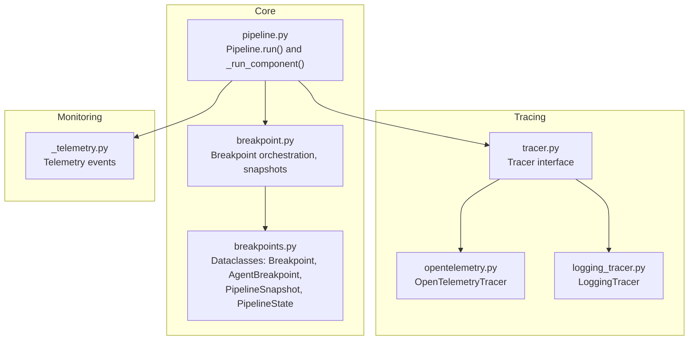
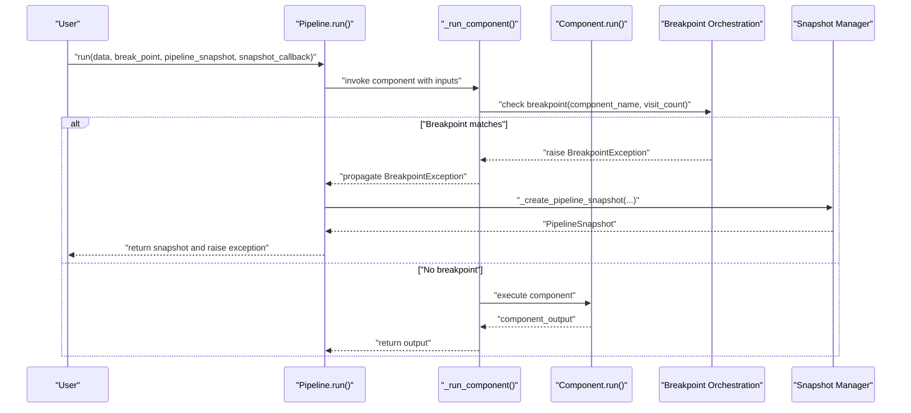
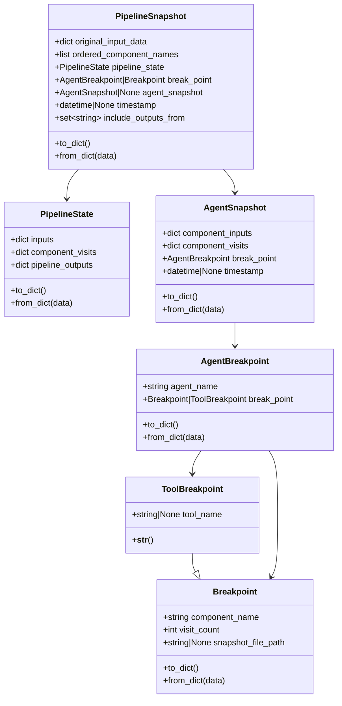
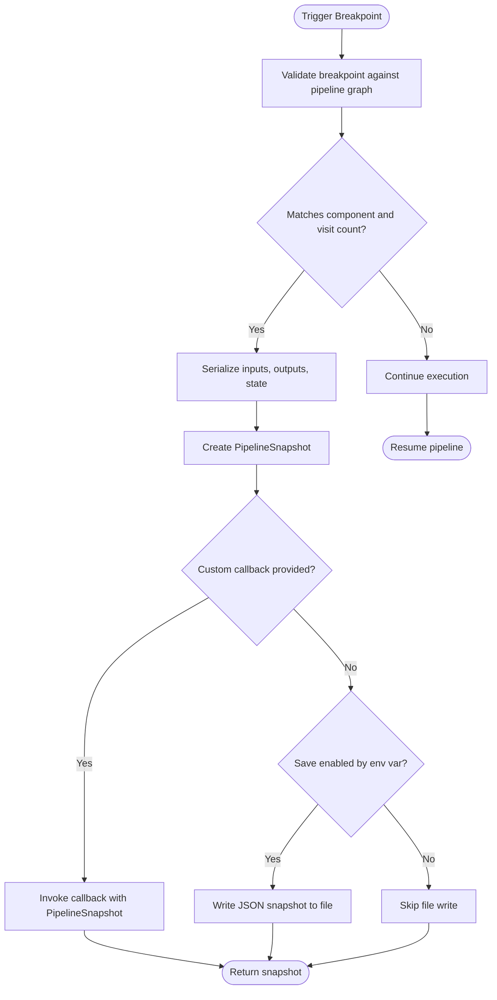
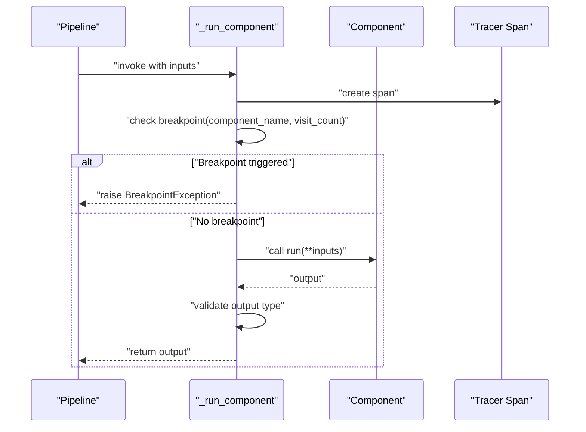
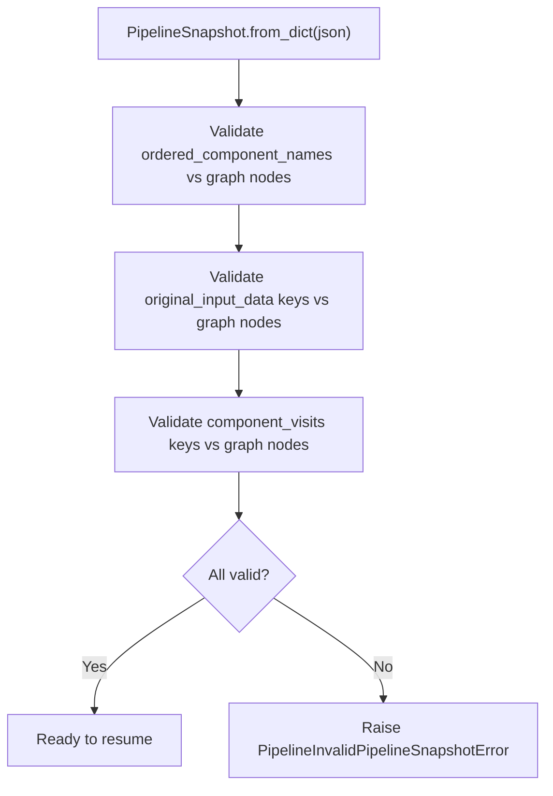
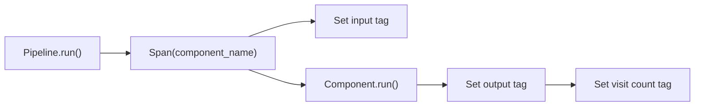
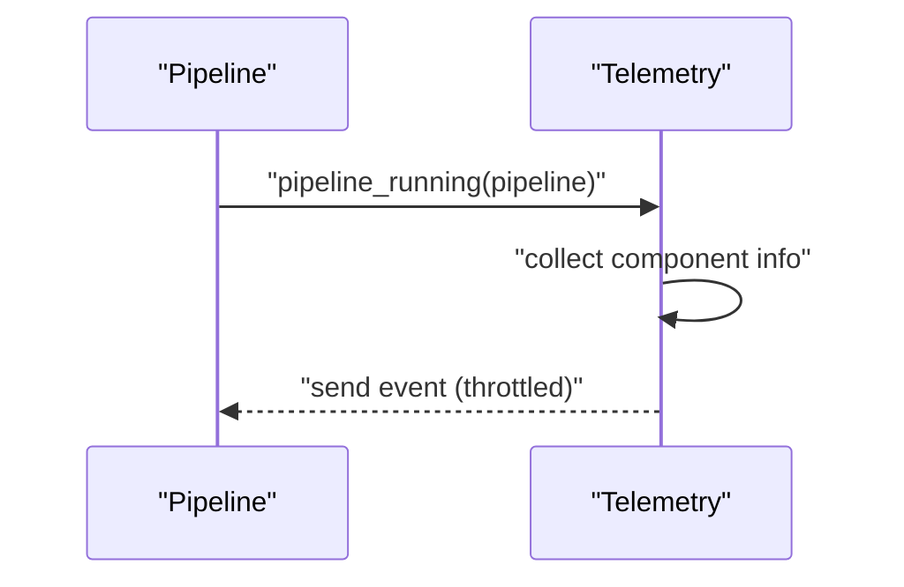
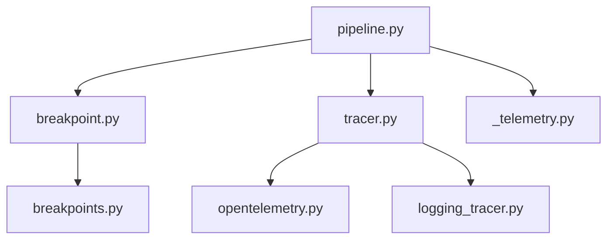

# Pipeline Debugging and Monitoring

<cite>
**Referenced Files in This Document**
- [breakpoints.py](file://haystack/dataclasses/breakpoints.py)
- [breakpoint.py](file://haystack/core/pipeline/breakpoint.py)
- [pipeline.py](file://haystack/core/pipeline/pipeline.py)
- [_telemetry.py](file://haystack/telemetry/_telemetry.py)
- [tracer.py](file://haystack/tracing/tracer.py)
- [OpenTelemetryTracer.py](file://haystack/tracing/opentelemetry.py)
- [logging_tracer.py](file://haystack/tracing/logging_tracer.py)
- [test_breakpoint.py](file://test/core/test_breakpoint.py)
- [test_pipeline_breakpoints_answer_joiner.py](file://test/core/pipeline/breakpoints/test_pipeline_breakpoints_answer_joiner.py)
- [test_pipeline_breakpoints_branch_joiner.py](file://test/core/pipeline/breakpoints/test_pipeline_breakpoints_branch_joiner.py)
- [test_pipeline_breakpoints_list_joiner.py](file://test/core/pipeline/breakpoints/test_pipeline_breakpoints_list_joiner.py)
- [test_pipeline_breakpoints_loops.py](file://test/core/pipeline/breakpoints/test_pipeline_breakpoints_loops.py)
- [test_pipeline_breakpoints_rag_hybrid.py](file://test/core/pipeline/breakpoints/test_pipeline_breakpoints_rag_hybrid.py)
- [test_pipeline_breakpoints_string_joiner.py](file://test/core/pipeline/breakpoints/test_pipeline_breakpoints_string_joiner.py)
- [test_pipeline_breakpoints_agent_function_calling.py](file://test/core/pipeline/breakpoints/test_pipeline_breakpoints_agent_function_calling.py)
- [test_agent_breakpoints.py](file://test/components/agents/test_agent_breakpoints.py)
- [test_agent_breakpoints_inside_pipeline.py](file://test/components/agents/test_agent_breakpoints_inside_pipeline.py)
</cite>

## Table of Contents
1. [Introduction](#introduction)
2. [Project Structure](#project-structure)
3. [Core Components](#core-components)
4. [Architecture Overview](#architecture-overview)
5. [Detailed Component Analysis](#detailed-component-analysis)
6. [Dependency Analysis](#dependency-analysis)
7. [Performance Considerations](#performance-considerations)
8. [Troubleshooting Guide](#troubleshooting-guide)
9. [Conclusion](#conclusion)
10. [Appendices](#appendices)

## Introduction
This document explains Haystack’s pipeline debugging and monitoring capabilities with a focus on breakpoints, snapshots, and tracing. It covers how to create and trigger breakpoints, how pipeline snapshots are captured and restored, how to inspect intermediate outputs and component states, and how to analyze execution traces. It also includes practical debugging workflows, error diagnosis techniques, and production monitoring strategies.

## Project Structure
Haystack organizes debugging and monitoring features primarily under:
- Dataclasses for breakpoint and snapshot models
- Pipeline-level breakpoint orchestration and snapshot persistence
- Tracing subsystems (OpenTelemetry, logging, and core tracer)
- Telemetry hooks for production observability
- Extensive tests validating breakpoint behavior across pipelines and agents

**Diagram sources**
- [breakpoint.py](file://haystack/core/pipeline/breakpoint.py#L1-L518)
- [breakpoints.py](file://haystack/dataclasses/breakpoints.py#L1-L282)
- [pipeline.py](file://haystack/core/pipeline/pipeline.py#L1-L200)
- [tracer.py](file://haystack/tracing/tracer.py#L1-L200)
- [OpenTelemetryTracer.py](file://haystack/tracing/opentelemetry.py#L1-L200)
- [logging_tracer.py](file://haystack/tracing/logging_tracer.py#L1-L200)
- [_telemetry.py](file://haystack/telemetry/_telemetry.py#L124-L159)

**Section sources**
- [breakpoint.py](file://haystack/core/pipeline/breakpoint.py#L1-L518)
- [breakpoints.py](file://haystack/dataclasses/breakpoints.py#L1-L282)
- [pipeline.py](file://haystack/core/pipeline/pipeline.py#L1-L200)
- [tracer.py](file://haystack/tracing/tracer.py#L1-L200)
- [OpenTelemetryTracer.py](file://haystack/tracing/opentelemetry.py#L1-L200)
- [logging_tracer.py](file://haystack/tracing/logging_tracer.py#L1-L200)
- [_telemetry.py](file://haystack/telemetry/_telemetry.py#L124-L159)

## Core Components
- Breakpoint dataclasses define where and when to pause execution and optionally persist a snapshot.
- Pipeline-level breakpoint orchestration validates breakpoints, triggers exceptions to suspend execution, and creates snapshots.
- Snapshot models capture pipeline state, component visit counts, and optional agent-specific state.
- Tracing integrates spans around component execution and supports external tracers (OpenTelemetry, logging).
- Telemetry emits anonymized usage events for production insights.

Key capabilities:
- Breakpoint creation and validation against pipeline topology
- Conditional triggering based on component name and visit count
- Execution suspension via dedicated exceptions
- Snapshot creation and optional persistence to file or custom callback
- Snapshot loading and validation for resuming execution
- Intermediate output inspection and component state examination
- Execution trace analysis via tracing spans
- Production monitoring via telemetry

**Section sources**
- [breakpoints.py](file://haystack/dataclasses/breakpoints.py#L12-L282)
- [breakpoint.py](file://haystack/core/pipeline/breakpoint.py#L57-L134)
- [pipeline.py](file://haystack/core/pipeline/pipeline.py#L35-L110)

## Architecture Overview
The debugging and monitoring architecture centers on the Pipeline orchestrator, which coordinates component execution, breakpoint checks, and snapshot creation. Tracing is integrated per component invocation, and telemetry provides production-level observability.

**Diagram sources**
- [pipeline.py](file://haystack/core/pipeline/pipeline.py#L111-L200)
- [pipeline.py](file://haystack/core/pipeline/pipeline.py#L43-L110)
- [breakpoint.py](file://haystack/core/pipeline/breakpoint.py#L261-L336)
- [breakpoint.py](file://haystack/core/pipeline/breakpoint.py#L166-L259)

## Detailed Component Analysis

### Breakpoint Data Model and Snapshots
Breakpoint-related dataclasses encapsulate:
- Breakpoint: component name, visit count, optional snapshot file path
- ToolBreakpoint: extends Breakpoint with tool targeting for agents
- AgentBreakpoint: ties a breakpoint to an agent component and enforces valid component names
- PipelineState: inputs, component visit counts, and pipeline outputs
- PipelineSnapshot: captures original inputs, ordered component names, pipeline state, breakpoint, optional agent snapshot, timestamp, and output inclusion set
- AgentSnapshot: agent-level inputs and visit counts

**Diagram sources**
- [breakpoints.py](file://haystack/dataclasses/breakpoints.py#L12-L282)

**Section sources**
- [breakpoints.py](file://haystack/dataclasses/breakpoints.py#L12-L282)

### Breakpoint Orchestration and Snapshot Management
- Validation ensures breakpoints reference registered components and, for agents, valid tools.
- Snapshot creation serializes inputs, outputs, and pipeline state, and optionally unwraps JSON structures.
- Default snapshot persistence is controlled by an environment variable; a custom callback can be provided.
- Loading snapshots validates compatibility with the current pipeline graph.

**Diagram sources**
- [breakpoint.py](file://haystack/core/pipeline/breakpoint.py#L57-L134)
- [breakpoint.py](file://haystack/core/pipeline/breakpoint.py#L166-L259)
- [breakpoint.py](file://haystack/core/pipeline/breakpoint.py#L261-L336)

**Section sources**
- [breakpoint.py](file://haystack/core/pipeline/breakpoint.py#L57-L134)
- [breakpoint.py](file://haystack/core/pipeline/breakpoint.py#L166-L259)
- [breakpoint.py](file://haystack/core/pipeline/breakpoint.py#L261-L336)

### Pipeline Execution and Breakpoint Triggering
- Per-component execution checks for breakpoint conditions and raises a dedicated exception to suspend execution.
- Exceptions are propagated to allow the caller to capture snapshots and decide whether to resume or abort.
- Non-dictionary outputs are rejected with a runtime error.

**Diagram sources**
- [pipeline.py](file://haystack/core/pipeline/pipeline.py#L43-L110)

**Section sources**
- [pipeline.py](file://haystack/core/pipeline/pipeline.py#L43-L110)

### Snapshot Creation and Restoration
- Creation captures serialized inputs, outputs, and pipeline state, along with ordered component names and include-output sets.
- Restoration validates that all referenced components exist in the current pipeline and that visit counts align.
- Users can load snapshots from disk or supply a custom callback for persistence.

**Diagram sources**
- [breakpoint.py](file://haystack/core/pipeline/breakpoint.py#L86-L134)
- [breakpoint.py](file://haystack/core/pipeline/breakpoint.py#L136-L164)

**Section sources**
- [breakpoint.py](file://haystack/core/pipeline/breakpoint.py#L86-L134)
- [breakpoint.py](file://haystack/core/pipeline/breakpoint.py#L136-L164)

### Tracing and Execution Flow Analysis
- Tracing wraps each component run with a span and records inputs, outputs, and visit counts.
- Multiple tracer backends are supported (OpenTelemetry, logging), enabling flexible integration with external systems.
- Tracing improves understanding of component-level execution order and timing.

**Diagram sources**
- [pipeline.py](file://haystack/core/pipeline/pipeline.py#L73-L109)
- [tracer.py](file://haystack/tracing/tracer.py#L1-L200)
- [OpenTelemetryTracer.py](file://haystack/tracing/opentelemetry.py#L1-L200)
- [logging_tracer.py](file://haystack/tracing/logging_tracer.py#L1-L200)

**Section sources**
- [pipeline.py](file://haystack/core/pipeline/pipeline.py#L73-L109)
- [tracer.py](file://haystack/tracing/tracer.py#L1-L200)
- [OpenTelemetryTracer.py](file://haystack/tracing/opentelemetry.py#L1-L200)
- [logging_tracer.py](file://haystack/tracing/logging_tracer.py#L1-L200)

### Telemetry and Production Monitoring
- Telemetry collects anonymized pipeline run events, including component metadata, and throttles event frequency.
- It is designed to never block normal execution and logs quietly on failures.

**Diagram sources**
- [_telemetry.py](file://haystack/telemetry/_telemetry.py#L137-L159)

**Section sources**
- [_telemetry.py](file://haystack/telemetry/_telemetry.py#L137-L159)

## Dependency Analysis
- Pipeline depends on breakpoint orchestration for breakpoint validation and snapshot creation.
- Breakpoint orchestration depends on dataclasses for snapshot models and serialization utilities.
- Tracing is integrated into component execution and can be backed by multiple tracer implementations.
- Telemetry depends on pipeline walk to enumerate components and collect metadata.

**Diagram sources**
- [pipeline.py](file://haystack/core/pipeline/pipeline.py#L1-L200)
- [breakpoint.py](file://haystack/core/pipeline/breakpoint.py#L1-L518)
- [breakpoints.py](file://haystack/dataclasses/breakpoints.py#L1-L282)
- [tracer.py](file://haystack/tracing/tracer.py#L1-L200)
- [OpenTelemetryTracer.py](file://haystack/tracing/opentelemetry.py#L1-L200)
- [logging_tracer.py](file://haystack/tracing/logging_tracer.py#L1-L200)
- [_telemetry.py](file://haystack/telemetry/_telemetry.py#L124-L159)

**Section sources**
- [pipeline.py](file://haystack/core/pipeline/pipeline.py#L1-L200)
- [breakpoint.py](file://haystack/core/pipeline/breakpoint.py#L1-L518)
- [breakpoints.py](file://haystack/dataclasses/breakpoints.py#L1-L282)
- [tracer.py](file://haystack/tracing/tracer.py#L1-L200)
- [OpenTelemetryTracer.py](file://haystack/tracing/opentelemetry.py#L1-L200)
- [logging_tracer.py](file://haystack/tracing/logging_tracer.py#L1-L200)
- [_telemetry.py](file://haystack/telemetry/_telemetry.py#L124-L159)

## Performance Considerations
- Serialization overhead: Snapshot creation serializes inputs, outputs, and state; avoid capturing very large objects unnecessarily.
- Tracing cost: Enable tracing selectively in development; consider sampling or disabling in high-throughput production runs.
- Snapshot persistence: Default file writing is off by default; enable via environment variable only when needed to reduce I/O.
- Telemetry throttling: Events are rate-limited; rely on telemetry for trends rather than real-time diagnostics.

[No sources needed since this section provides general guidance]

## Troubleshooting Guide
Common issues and resolutions:
- Breakpoint not triggering
  - Verify the component name exists in the pipeline and the visit count matches the breakpoint condition.
  - Ensure the breakpoint is passed to the run call and not filtered out by validation.
  - Check that the environment variable controlling snapshot saving is set appropriately if expecting a file.

- Invalid pipeline snapshot
  - Confirm that all component names in the snapshot exist in the current pipeline graph.
  - Validate that the snapshot’s ordered component names and visit counts are consistent.

- Snapshot file not written
  - Confirm the environment variable enabling snapshot file saving is set to true or 1.
  - Provide a custom snapshot callback if you prefer storing snapshots elsewhere.

- Unexpected non-dictionary output
  - Components must return a Mapping; otherwise, a runtime error is raised. Fix the component’s output format.

- Agent breakpoints
  - For ToolBreakpoint, ensure the tool name exists among the agent’s tools.
  - AgentBreakpoint enforces specific component names for chat generator and tool invoker.

Practical examples (paths only):
- Breakpoint validation and snapshot creation: [breakpoint.py](file://haystack/core/pipeline/breakpoint.py#L57-L134), [breakpoint.py](file://haystack/core/pipeline/breakpoint.py#L261-L336)
- Pipeline run with breakpoints: [pipeline.py](file://haystack/core/pipeline/pipeline.py#L111-L200)
- Agent breakpoint constraints: [breakpoints.py](file://haystack/dataclasses/breakpoints.py#L66-L116)
- Tool breakpoint validation: [breakpoint.py](file://haystack/core/pipeline/breakpoint.py#L391-L409)

**Section sources**
- [breakpoint.py](file://haystack/core/pipeline/breakpoint.py#L57-L134)
- [breakpoint.py](file://haystack/core/pipeline/breakpoint.py#L261-L336)
- [pipeline.py](file://haystack/core/pipeline/pipeline.py#L111-L200)
- [breakpoints.py](file://haystack/dataclasses/breakpoints.py#L66-L116)
- [breakpoint.py](file://haystack/core/pipeline/breakpoint.py#L391-L409)

## Conclusion
Haystack’s pipeline debugging and monitoring stack provides robust primitives for suspending execution at precise moments, capturing comprehensive snapshots, and analyzing execution traces. Combined with tracing and telemetry, developers can diagnose issues quickly and monitor production behavior safely.

[No sources needed since this section summarizes without analyzing specific files]

## Appendices

### Practical Debugging Workflows
- Setting a breakpoint
  - Define a Breakpoint or ToolBreakpoint with the target component name and desired visit count.
  - Pass it to Pipeline.run() alongside your inputs.
  - Reference: [breakpoints.py](file://haystack/dataclasses/breakpoints.py#L12-L63), [pipeline.py](file://haystack/core/pipeline/pipeline.py#L111-L200)

- Capturing and inspecting snapshots
  - Allow the pipeline to raise a breakpoint exception; catch it and inspect the returned snapshot.
  - Optionally persist snapshots to disk or a custom storage via a callback.
  - Reference: [breakpoint.py](file://haystack/core/pipeline/breakpoint.py#L166-L259), [breakpoint.py](file://haystack/core/pipeline/breakpoint.py#L261-L336)

- Resuming from a snapshot
  - Load a saved snapshot and validate it against the current pipeline graph.
  - Resume execution from the validated state.
  - Reference: [breakpoint.py](file://haystack/core/pipeline/breakpoint.py#L136-L164), [breakpoint.py](file://haystack/core/pipeline/breakpoint.py#L86-L134)

- Inspecting intermediate outputs and component state
  - Use tracing spans to examine inputs, outputs, and visit counts per component.
  - Reference: [pipeline.py](file://haystack/core/pipeline/pipeline.py#L73-L109), [tracer.py](file://haystack/tracing/tracer.py#L1-L200)

- Profiling and performance analysis
  - Enable tracing and export spans to an external backend (e.g., OpenTelemetry collector).
  - Reference: [OpenTelemetryTracer.py](file://haystack/tracing/opentelemetry.py#L1-L200)

- Error diagnosis and root cause analysis
  - Catch BreakpointException to capture snapshots at failure points.
  - Use PipelineRuntimeError for component output validation failures.
  - Reference: [pipeline.py](file://haystack/core/pipeline/pipeline.py#L84-L104), [breakpoint.py](file://haystack/core/pipeline/breakpoint.py#L411-L500)

### Tests and Examples
- Pipeline breakpoint tests across various scenarios:
  - [test_pipeline_breakpoints_answer_joiner.py](file://test/core/pipeline/breakpoints/test_pipeline_breakpoints_answer_joiner.py)
  - [test_pipeline_breakpoints_branch_joiner.py](file://test/core/pipeline/breakpoints/test_pipeline_breakpoints_branch_joiner.py)
  - [test_pipeline_breakpoints_list_joiner.py](file://test/core/pipeline/breakpoints/test_pipeline_breakpoints_list_joiner.py)
  - [test_pipeline_breakpoints_loops.py](file://test/core/pipeline/breakpoints/test_pipeline_breakpoints_loops.py)
  - [test_pipeline_breakpoints_rag_hybrid.py](file://test/core/pipeline/breakpoints/test_pipeline_breakpoints_rag_hybrid.py)
  - [test_pipeline_breakpoints_string_joiner.py](file://test/core/pipeline/breakpoints/test_pipeline_breakpoints_string_joiner.py)
  - [test_pipeline_breakpoints_agent_function_calling.py](file://test/core/pipeline/breakpoints/test_pipeline_breakpoints_agent_function_calling.py)
- Agent breakpoint tests:
  - [test_agent_breakpoints.py](file://test/components/agents/test_agent_breakpoints.py)
  - [test_agent_breakpoints_inside_pipeline.py](file://test/components/agents/test_agent_breakpoints_inside_pipeline.py)
- Core breakpoint behavior:
  - [test_breakpoint.py](file://test/core/test_breakpoint.py)