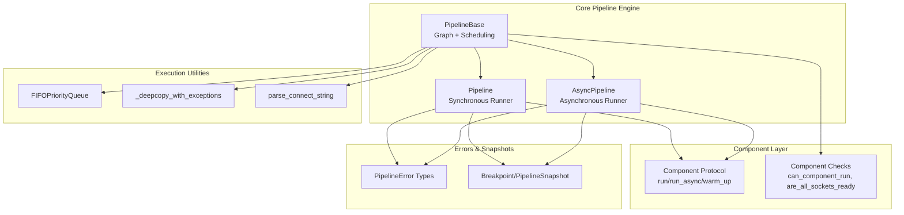
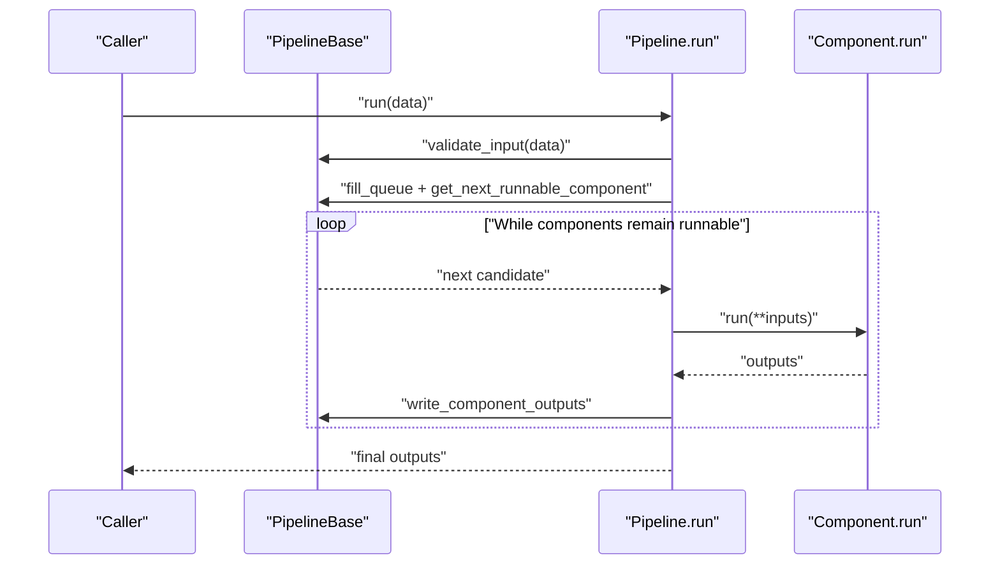
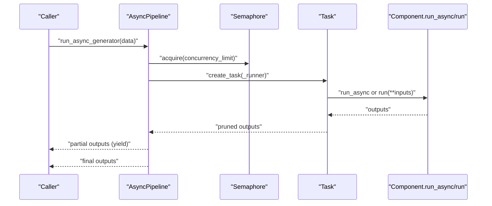
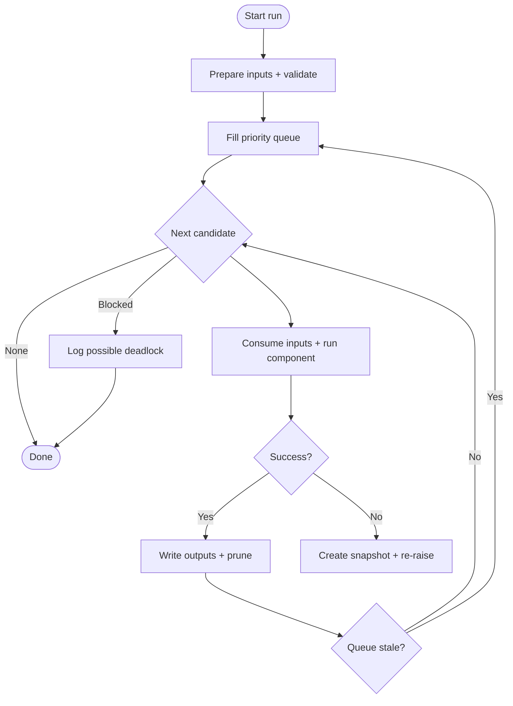
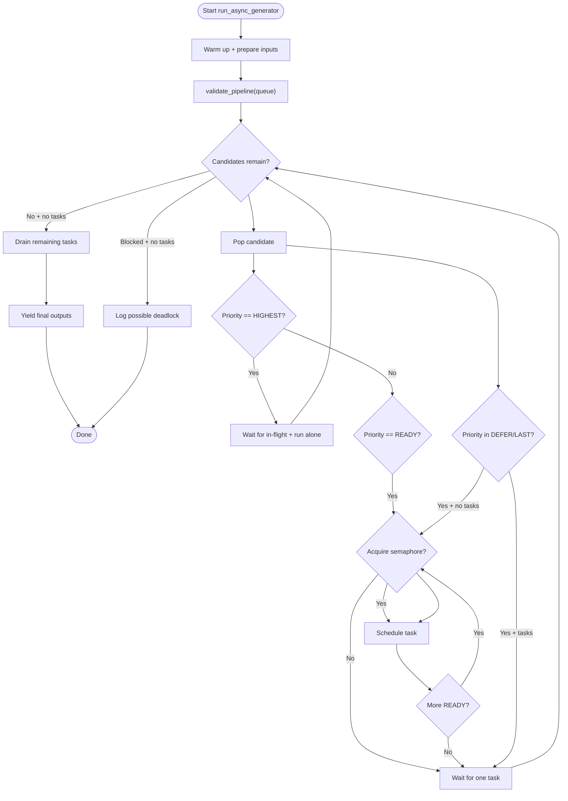
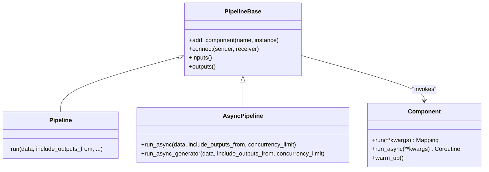
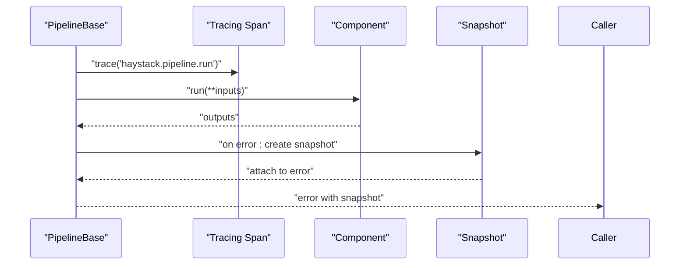
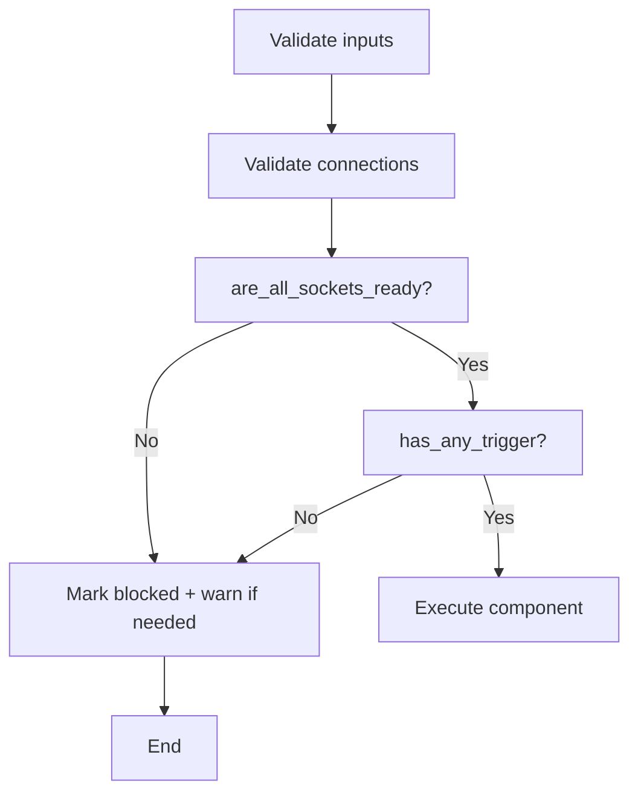
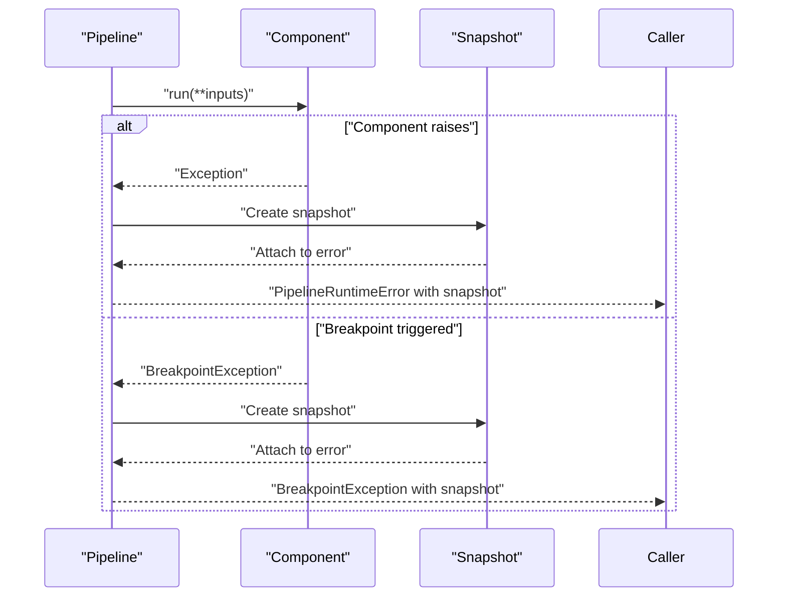
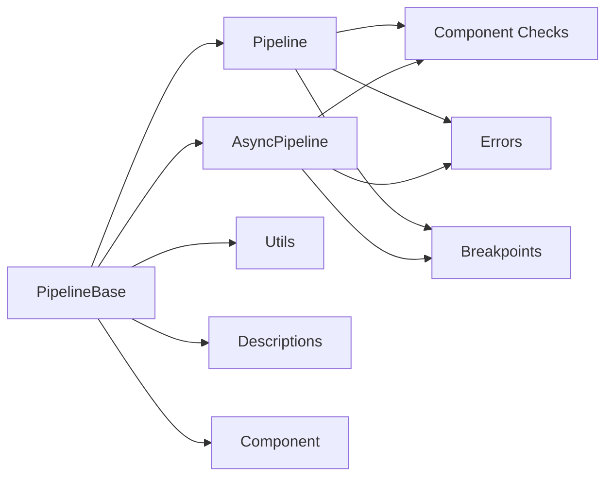

# Pipeline Execution

<cite>
**Referenced Files in This Document**
- [base.py](file://haystack/core/pipeline/base.py)
- [pipeline.py](file://haystack/core/pipeline/pipeline.py)
- [async_pipeline.py](file://haystack/core/pipeline/async_pipeline.py)
- [utils.py](file://haystack/core/pipeline/utils.py)
- [component_checks.py](file://haystack/core/pipeline/component_checks.py)
- [descriptions.py](file://haystack/core/pipeline/descriptions.py)
- [component.py](file://haystack/core/component/component.py)
- [errors.py](file://haystack/core/errors.py)
- [breakpoints.py](file://haystack/dataclasses/breakpoints.py)
- [asyncpipeline.mdx](file://docs-website/docs/concepts/pipelines/asyncpipeline.mdx)
</cite>

## Table of Contents
1. [Introduction](#introduction)
2. [Project Structure](#project-structure)
3. [Core Components](#core-components)
4. [Architecture Overview](#architecture-overview)
5. [Detailed Component Analysis](#detailed-component-analysis)
6. [Dependency Analysis](#dependency-analysis)
7. [Performance Considerations](#performance-considerations)
8. [Troubleshooting Guide](#troubleshooting-guide)
9. [Conclusion](#conclusion)
10. [Appendices](#appendices)

## Introduction
This document explains Haystack’s pipeline execution system with a focus on:
- Synchronous pipeline execution and step-by-step processing
- Asynchronous pipeline execution, concurrency control, and parallel component execution
- Execution context management, state tracking, and component lifecycle
- Validation, dependency checking, and deadlock/prevention mechanisms
- Error handling, exception propagation, rollback-like snapshots, and recovery strategies
- Practical examples of input configuration, output collection, and result processing
- Monitoring, progress tracking, and performance metrics collection

## Project Structure
The pipeline execution system is centered around a base orchestration engine and two concrete pipeline implementations:
- Synchronous pipeline: orchestrates components in deterministic order
- Asynchronous pipeline: schedules components concurrently with controlled concurrency and yields partial results

Key modules:
- Base orchestration and graph management
- Synchronous and asynchronous pipeline runners
- Utilities for scheduling, copying, and parsing connections
- Component checks for readiness and dependency resolution
- Component contract and lifecycle (run/run_async, warm_up)
- Error types and breakpoint/snapshot data structures

**Diagram sources**
- [base.py](file://haystack/core/pipeline/base.py#L81-L120)
- [pipeline.py](file://haystack/core/pipeline/pipeline.py#L35-L40)
- [async_pipeline.py](file://haystack/core/pipeline/async_pipeline.py#L27-L33)
- [utils.py](file://haystack/core/pipeline/utils.py#L72-L170)
- [component_checks.py](file://haystack/core/pipeline/component_checks.py#L12-L25)
- [component.py](file://haystack/core/component/component.py#L137-L185)
- [errors.py](file://haystack/core/errors.py#L10-L188)
- [breakpoints.py](file://haystack/dataclasses/breakpoints.py#L156-L192)

**Section sources**
- [base.py](file://haystack/core/pipeline/base.py#L81-L120)
- [pipeline.py](file://haystack/core/pipeline/pipeline.py#L35-L40)
- [async_pipeline.py](file://haystack/core/pipeline/async_pipeline.py#L27-L33)
- [utils.py](file://haystack/core/pipeline/utils.py#L72-L170)
- [component_checks.py](file://haystack/core/pipeline/component_checks.py#L12-L25)
- [component.py](file://haystack/core/component/component.py#L137-L185)
- [errors.py](file://haystack/core/errors.py#L10-L188)
- [breakpoints.py](file://haystack/dataclasses/breakpoints.py#L156-L192)

## Core Components
- PipelineBase: Graph representation, component lifecycle, input/output discovery, tracing tags, and shared scheduling logic.
- Pipeline (synchronous): Stepwise execution with deterministic ordering, readiness checks, and snapshotting on errors.
- AsyncPipeline (asynchronous): Concurrent execution with semaphores, isolated execution for greedy variadic sockets, and incremental partial outputs.
- Component: Contract for run/run_async, warm_up, and socket declarations.
- Component checks: Gatekeeping logic for readiness, triggers, and variadic sockets.
- Utilities: Priority queue, deep copy with exceptions, and connection parsing.
- Errors and snapshots: Typed exceptions, breakpoint exceptions, and pipeline snapshots for recovery.

**Section sources**
- [base.py](file://haystack/core/pipeline/base.py#L81-L120)
- [pipeline.py](file://haystack/core/pipeline/pipeline.py#L35-L40)
- [async_pipeline.py](file://haystack/core/pipeline/async_pipeline.py#L27-L33)
- [component.py](file://haystack/core/component/component.py#L137-L185)
- [component_checks.py](file://haystack/core/pipeline/component_checks.py#L12-L25)
- [utils.py](file://haystack/core/pipeline/utils.py#L72-L170)
- [errors.py](file://haystack/core/errors.py#L10-L188)
- [breakpoints.py](file://haystack/dataclasses/breakpoints.py#L156-L192)

## Architecture Overview
High-level execution architecture:
- Synchronous pipeline: Topological ordering with readiness gating; runs components one-by-one, collecting outputs and pruning based on include_outputs_from.
- Asynchronous pipeline: Priority queue with concurrency control; schedules READY components, isolates HIGHEST-priority components (greedy variadic), and yields partial outputs as tasks complete.

**Diagram sources**
- [pipeline.py](file://haystack/core/pipeline/pipeline.py#L111-L452)
- [base.py](file://haystack/core/pipeline/base.py#L282-L452)

**Diagram sources**
- [async_pipeline.py](file://haystack/core/pipeline/async_pipeline.py#L103-L471)
- [async_pipeline.py](file://haystack/core/pipeline/async_pipeline.py#L320-L342)

## Detailed Component Analysis

### Synchronous Pipeline Execution
- Deterministic traversal: Components are visited in a stable order, with readiness checks and priority queues guiding selection.
- Readiness and triggers: A component can run only when all mandatory inputs are satisfied and a trigger condition is met (predecessor input, user-provided input, or no-input entry points).
- Output pruning: Outputs are pruned to include only those requested by include_outputs_from or leaf components.
- Error handling: On exceptions, a pipeline snapshot is created and attached to a PipelineRuntimeError; BreakpointException is re-raised with snapshot context.
- Deadlock detection: If the next candidate is blocked and no progress is possible, a warning is logged indicating potential misconfiguration.

**Diagram sources**
- [pipeline.py](file://haystack/core/pipeline/pipeline.py#L297-L452)
- [component_checks.py](file://haystack/core/pipeline/component_checks.py#L12-L25)

**Section sources**
- [pipeline.py](file://haystack/core/pipeline/pipeline.py#L111-L452)
- [component_checks.py](file://haystack/core/pipeline/component_checks.py#L12-L25)
- [errors.py](file://haystack/core/errors.py#L14-L56)

### Asynchronous Pipeline Execution
- Concurrency control: A semaphore limits concurrent component tasks; READY components are scheduled until the semaphore is locked.
- Isolation for greedy variadic: Components with greedy variadic sockets run alone to avoid premature downstream inputs.
- Partial outputs: run_async_generator yields outputs as soon as any task completes, enabling progress tracking and incremental processing.
- Fallback to thread pool: Non-async components are executed in a thread pool with contextvar preservation for tracing continuity.
- run vs run_async: run is a synchronous wrapper around run_async; it blocks until completion.

**Diagram sources**
- [async_pipeline.py](file://haystack/core/pipeline/async_pipeline.py#L103-L471)

**Section sources**
- [async_pipeline.py](file://haystack/core/pipeline/async_pipeline.py#L103-L471)
- [async_pipeline.py](file://haystack/core/pipeline/async_pipeline.py#L589-L714)

### Component Invocation Patterns and Lifecycle
- Component contract:
  - run: Required; returns a mapping of outputs
  - run_async: Optional coroutine; must mirror run signature
  - warm_up: Optional; heavy initialization before execution
- Socket declarations:
  - Input sockets: mandatory/default values; variadic (lazy/greedy)
  - Output sockets: declared via decorator or set_output_types
- Component registration and discovery:
  - Components are decorated with @component and registered in a global registry
  - Deserialization resolves class paths and constructs instances

**Diagram sources**
- [component.py](file://haystack/core/component/component.py#L137-L185)
- [component.py](file://haystack/core/component/component.py#L406-L645)
- [base.py](file://haystack/core/pipeline/base.py#L341-L437)
- [pipeline.py](file://haystack/core/pipeline/pipeline.py#L35-L40)
- [async_pipeline.py](file://haystack/core/pipeline/async_pipeline.py#L27-L33)

**Section sources**
- [component.py](file://haystack/core/component/component.py#L137-L185)
- [component.py](file://haystack/core/component/component.py#L406-L645)
- [base.py](file://haystack/core/pipeline/base.py#L341-L437)

### Execution Context Management and State Tracking
- Tracing tags: Component input/output and visit counts are recorded for observability.
- Visits tracking: Each component’s execution count is maintained to enforce max_runs_per_component and breakpoint conditions.
- Inputs state: Internal representation of inputs per socket and per sender; outputs are distributed to downstream sockets.
- Breakpoints and snapshots: Triggered breakpoints pause execution and capture a snapshot; resumable via PipelineSnapshot.

**Diagram sources**
- [pipeline.py](file://haystack/core/pipeline/pipeline.py#L282-L427)
- [async_pipeline.py](file://haystack/core/pipeline/async_pipeline.py#L67-L101)
- [breakpoints.py](file://haystack/dataclasses/breakpoints.py#L156-L192)

**Section sources**
- [pipeline.py](file://haystack/core/pipeline/pipeline.py#L282-L427)
- [async_pipeline.py](file://haystack/core/pipeline/async_pipeline.py#L67-L101)
- [breakpoints.py](file://haystack/dataclasses/breakpoints.py#L156-L192)

### Execution Validation, Dependency Checking, and Deadlock Prevention
- Input validation: Ensures provided inputs conform to pipeline inputs and sockets’ mandatory/default semantics.
- Connection validation: Enforces type compatibility and socket uniqueness; supports explicit naming for multi-socket components.
- Readiness checks: can_component_run, are_all_sockets_ready, and trigger conditions gate execution.
- Lazy/greedy variadic: Lazy sockets wait for all predecessors or all inputs; greedy sockets run when any input arrives.
- Deadlock prevention: If a component is blocked and no progress is possible, a warning is emitted; pipeline aborts gracefully.

**Diagram sources**
- [descriptions.py](file://haystack/core/pipeline/descriptions.py#L12-L43)
- [component_checks.py](file://haystack/core/pipeline/component_checks.py#L52-L83)
- [component_checks.py](file://haystack/core/pipeline/component_checks.py#L28-L49)

**Section sources**
- [descriptions.py](file://haystack/core/pipeline/descriptions.py#L12-L43)
- [component_checks.py](file://haystack/core/pipeline/component_checks.py#L52-L83)
- [component_checks.py](file://haystack/core/pipeline/component_checks.py#L28-L49)

### Error Handling, Rollback Mechanisms, and Recovery Strategies
- PipelineRuntimeError: Wraps component failures with component identity and attaches a snapshot when available.
- BreakpointException: Raised when a breakpoint is triggered; carries snapshot and break point metadata.
- Snapshot-based recovery: On error, a PipelineSnapshot captures inputs, outputs, visits, and ordering; can be saved via callback or default file path.
- Resumption: AsyncPipeline supports resuming from a snapshot; synchronous pipeline supports resuming via snapshot APIs.

**Diagram sources**
- [pipeline.py](file://haystack/core/pipeline/pipeline.py#L376-L427)
- [errors.py](file://haystack/core/errors.py#L14-L56)
- [errors.py](file://haystack/core/errors.py#L106-L188)
- [breakpoints.py](file://haystack/dataclasses/breakpoints.py#L156-L192)

**Section sources**
- [pipeline.py](file://haystack/core/pipeline/pipeline.py#L376-L427)
- [errors.py](file://haystack/core/errors.py#L14-L56)
- [errors.py](file://haystack/core/errors.py#L106-L188)
- [breakpoints.py](file://haystack/dataclasses/breakpoints.py#L156-L192)

### Practical Examples and Workflows
- Synchronous execution with structured inputs:
  - Provide a dictionary keyed by component name and socket name
  - Optionally include_outputs_from to collect intermediate outputs
  - Example usage pattern is demonstrated in the synchronous run method’s docstring
- Asynchronous generator for incremental outputs:
  - Use run_async_generator to process partial results as components complete
  - Configure concurrency_limit to cap parallelism
- Asynchronous run for non-blocking execution:
  - Use run_async to get final outputs without stepping through partials
- Concurrency control:
  - Adjust concurrency_limit to balance throughput and resource usage

**Section sources**
- [pipeline.py](file://haystack/core/pipeline/pipeline.py#L111-L225)
- [async_pipeline.py](file://haystack/core/pipeline/async_pipeline.py#L103-L196)
- [async_pipeline.py](file://haystack/core/pipeline/async_pipeline.py#L472-L587)
- [asyncpipeline.mdx](file://docs-website/docs/concepts/pipelines/asyncpipeline.mdx#L26-L48)

## Dependency Analysis
- Coupling:
  - PipelineBase centralizes graph, scheduling, and IO handling; Pipeline and AsyncPipeline inherit from it.
  - Component checks and utilities are used by both synchronous and asynchronous runners.
- Cohesion:
  - Component contract and socket handling are cohesive within component.py.
  - Errors and snapshots are cohesive within errors.py and breakpoints.py.
- External dependencies:
  - NetworkX for graph representation
  - asyncio for async scheduling and concurrency
  - Tracing and telemetry for observability

**Diagram sources**
- [base.py](file://haystack/core/pipeline/base.py#L81-L120)
- [pipeline.py](file://haystack/core/pipeline/pipeline.py#L35-L40)
- [async_pipeline.py](file://haystack/core/pipeline/async_pipeline.py#L27-L33)
- [component_checks.py](file://haystack/core/pipeline/component_checks.py#L12-L25)
- [utils.py](file://haystack/core/pipeline/utils.py#L72-L170)
- [descriptions.py](file://haystack/core/pipeline/descriptions.py#L12-L43)
- [component.py](file://haystack/core/component/component.py#L137-L185)
- [errors.py](file://haystack/core/errors.py#L10-L188)
- [breakpoints.py](file://haystack/dataclasses/breakpoints.py#L156-L192)

**Section sources**
- [base.py](file://haystack/core/pipeline/base.py#L81-L120)
- [pipeline.py](file://haystack/core/pipeline/pipeline.py#L35-L40)
- [async_pipeline.py](file://haystack/core/pipeline/async_pipeline.py#L27-L33)
- [component_checks.py](file://haystack/core/pipeline/component_checks.py#L12-L25)
- [utils.py](file://haystack/core/pipeline/utils.py#L72-L170)
- [descriptions.py](file://haystack/core/pipeline/descriptions.py#L12-L43)
- [component.py](file://haystack/core/component/component.py#L137-L185)
- [errors.py](file://haystack/core/errors.py#L10-L188)
- [breakpoints.py](file://haystack/dataclasses/breakpoints.py#L156-L192)

## Performance Considerations
- Concurrency tuning:
  - Use concurrency_limit to cap parallel tasks and reduce contention
  - Prefer run_async_generator for low-latency partial results
- Scheduling efficiency:
  - Priority queue maintains FIFO ties and minimizes repeated recomputation
- Deep copy overhead:
  - _deepcopy_with_exceptions avoids deep-copying expensive objects (Component, Tool, Toolset)
- Warm-up:
  - Use warm_up to initialize heavy resources before execution to avoid cold starts during run

[No sources needed since this section provides general guidance]

## Troubleshooting Guide
- Common issues and resolutions:
  - Blocked pipeline: Indicates missing inputs or misconfigured connections; review warnings and connectivity
  - Invalid component output: Component must return a mapping; fix component output contract
  - Breakpoint not triggered: Verify component name and visit count; ensure breakpoint is on the execution path
  - Snapshot-based recovery: Use snapshot callback or default file path to persist and later resume execution
- Useful diagnostics:
  - Pipeline.inputs() and outputs() describe expected inputs and leaf outputs
  - Tracing spans and tags record component inputs, outputs, and visits
  - Telemetry indicates pipeline running events

**Section sources**
- [pipeline.py](file://haystack/core/pipeline/pipeline.py#L310-L324)
- [pipeline.py](file://haystack/core/pipeline/pipeline.py#L444-L450)
- [errors.py](file://haystack/core/errors.py#L14-L56)
- [errors.py](file://haystack/core/errors.py#L106-L188)
- [descriptions.py](file://haystack/core/pipeline/descriptions.py#L12-L43)

## Conclusion
Haystack’s pipeline execution system provides robust, validated, and observable orchestration for both synchronous and asynchronous workflows. It enforces strong component contracts, manages state and context carefully, and offers powerful mechanisms for concurrency control, progress tracking, and recovery via snapshots. By leveraging readiness checks, variadic socket semantics, and breakpoint-driven debugging, developers can build reliable, high-performance pipelines tailored to diverse execution environments.

[No sources needed since this section summarizes without analyzing specific files]

## Appendices

### API and Execution Modes Overview
- Synchronous run: Blocking execution with deterministic order and leaf-output aggregation
- Asynchronous run: Non-blocking execution with concurrency control
- Asynchronous generator: Incremental partial outputs with progress visibility
- Concurrency control: Configurable concurrency_limit for balanced throughput

**Section sources**
- [asyncpipeline.mdx](file://docs-website/docs/concepts/pipelines/asyncpipeline.mdx#L26-L48)
- [async_pipeline.py](file://haystack/core/pipeline/async_pipeline.py#L103-L196)
- [async_pipeline.py](file://haystack/core/pipeline/async_pipeline.py#L472-L587)
- [pipeline.py](file://haystack/core/pipeline/pipeline.py#L111-L225)