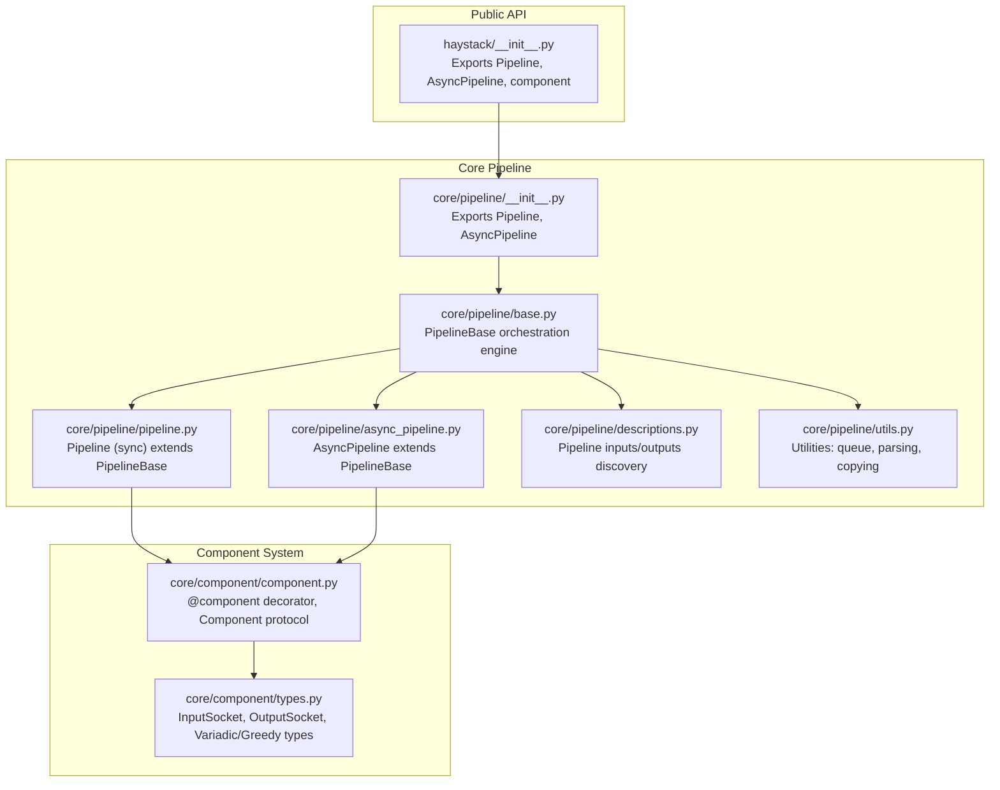
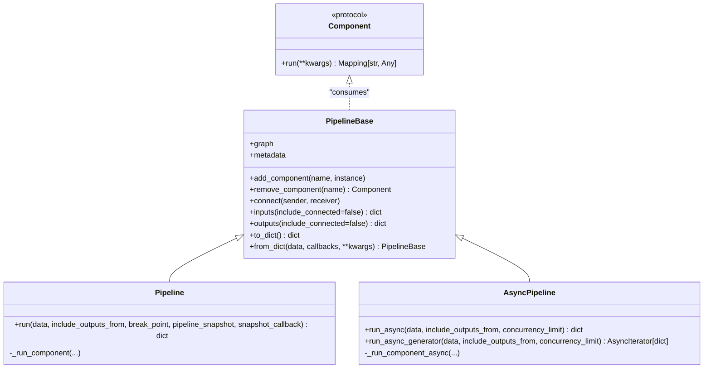
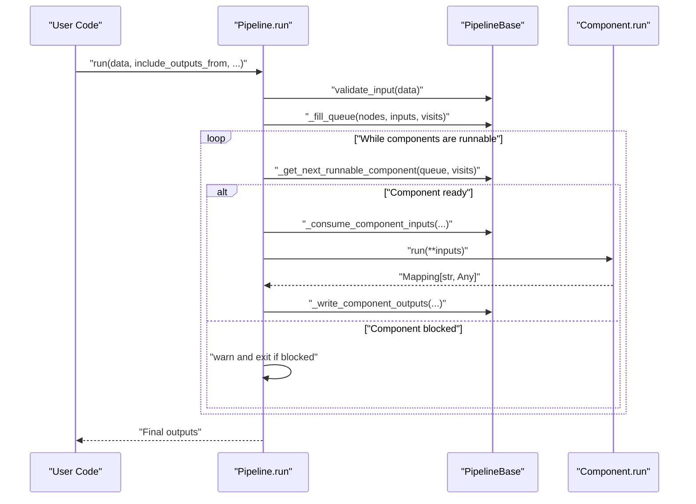
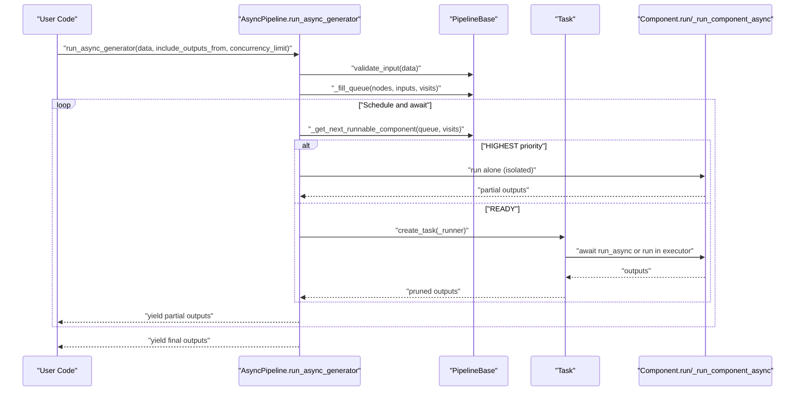
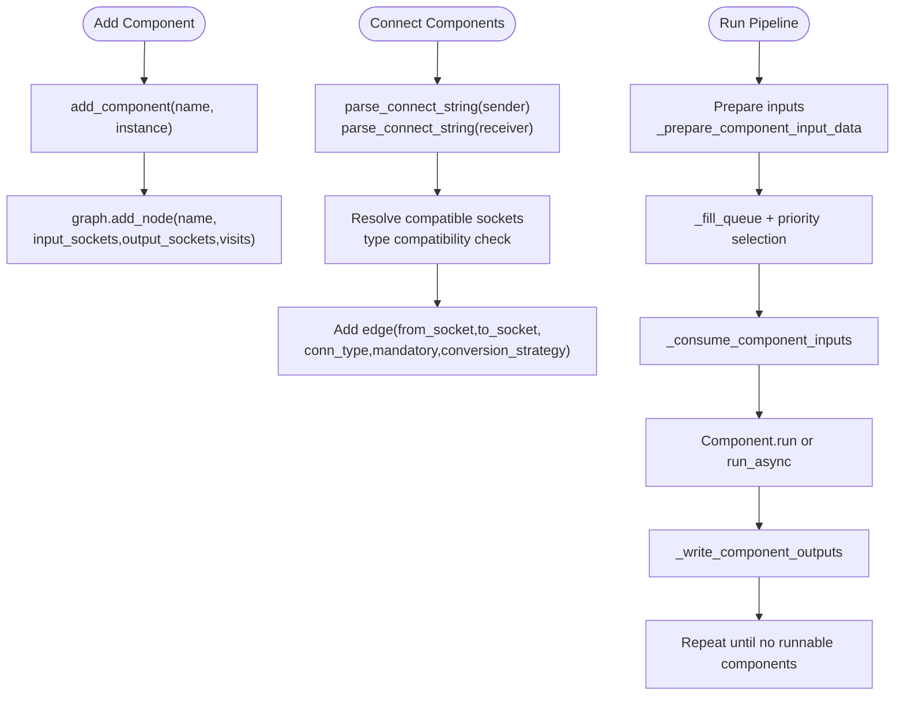
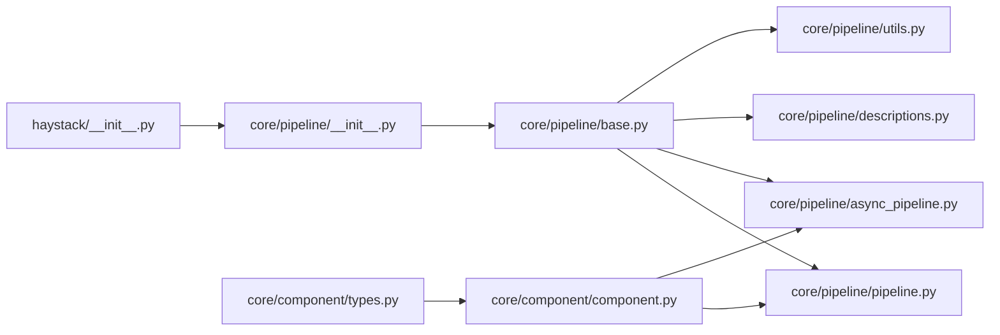

# Pipeline Fundamentals

<cite>
**Referenced Files in This Document**
- [haystack/__init__.py](file://haystack/__init__.py)
- [core/pipeline/__init__.py](file://haystack/core/pipeline/__init__.py)
- [core/pipeline/base.py](file://haystack/core/pipeline/base.py)
- [core/pipeline/pipeline.py](file://haystack/core/pipeline/pipeline.py)
- [core/pipeline/async_pipeline.py](file://haystack/core/pipeline/async_pipeline.py)
- [core/pipeline/descriptions.py](file://haystack/core/pipeline/descriptions.py)
- [core/pipeline/utils.py](file://haystack/core/pipeline/utils.py)
- [core/component/component.py](file://haystack/core/component/component.py)
- [core/component/types.py](file://haystack/core/component/types.py)
</cite>

## Table of Contents
1. [Introduction](#introduction)
2. [Project Structure](#project-structure)
3. [Core Components](#core-components)
4. [Architecture Overview](#architecture-overview)
5. [Detailed Component Analysis](#detailed-component-analysis)
6. [Dependency Analysis](#dependency-analysis)
7. [Performance Considerations](#performance-considerations)
8. [Troubleshooting Guide](#troubleshooting-guide)
9. [Conclusion](#conclusion)
10. [Appendices](#appendices)

## Introduction
This document explains Haystack’s pipeline fundamentals: how pipelines orchestrate components, manage data flow, and determine execution order. It covers both synchronous and asynchronous execution models, input/output handling, parameter passing, and data transformation across the pipeline. It also provides practical guidance on constructing pipelines, validating connections, resolving dependencies, and designing robust pipelines.

## Project Structure
Haystack organizes pipeline orchestration under the core pipeline module. The public API exposes both synchronous and asynchronous pipeline classes, while the underlying orchestration engine is implemented in a shared base class. Components are defined via a decorator and socket system that declares inputs/outputs and types.

**Diagram sources**
- [haystack/__init__.py](file://haystack/__init__.py#L12-L16)
- [core/pipeline/__init__.py](file://haystack/core/pipeline/__init__.py#L5-L8)
- [core/pipeline/base.py](file://haystack/core/pipeline/base.py#L81-L113)
- [core/pipeline/pipeline.py](file://haystack/core/pipeline/pipeline.py#L35-L40)
- [core/pipeline/async_pipeline.py](file://haystack/core/pipeline/async_pipeline.py#L27-L33)
- [core/pipeline/descriptions.py](file://haystack/core/pipeline/descriptions.py#L12-L43)
- [core/pipeline/utils.py](file://haystack/core/pipeline/utils.py#L57-L70)
- [core/component/component.py](file://haystack/core/component/component.py#L534-L571)
- [core/component/types.py](file://haystack/core/component/types.py#L36-L128)

**Section sources**
- [haystack/__init__.py](file://haystack/__init__.py#L12-L16)
- [core/pipeline/__init__.py](file://haystack/core/pipeline/__init__.py#L5-L8)

## Core Components
- PipelineBase: Shared orchestration engine implementing graph construction, validation, scheduling, and execution state management. It manages the NetworkX graph of components and their connections, and provides utilities for input preparation, queue management, and tracing.
- Pipeline: Synchronous pipeline that executes components in deterministic order, honoring readiness, blocking conditions, and priority queues. It supports breakpoints, snapshots, and detailed error reporting.
- AsyncPipeline: Asynchronous pipeline that schedules components concurrently when possible, using semaphores and task queues. It supports both async generator and async run modes, with a synchronous wrapper that blocks until completion.
- Component and Sockets: Components are defined with @component, exposing typed input/output sockets. The socket system supports mandatory/optional inputs, defaults, lazy/greedy variadic inputs, and receiver tracking.

Key responsibilities:
- Component registration: add_component validates uniqueness and component type, attaches sockets, and records visits.
- Connection establishment: connect resolves compatible input/output sockets, supports explicit socket names, and enforces type compatibility.
- Execution: run/run_async compute readiness, schedule components, feed inputs, write outputs, and handle errors and snapshots.

**Section sources**
- [core/pipeline/base.py](file://haystack/core/pipeline/base.py#L81-L113)
- [core/pipeline/pipeline.py](file://haystack/core/pipeline/pipeline.py#L35-L40)
- [core/pipeline/async_pipeline.py](file://haystack/core/pipeline/async_pipeline.py#L27-L33)
- [core/component/component.py](file://haystack/core/component/component.py#L534-L571)
- [core/component/types.py](file://haystack/core/component/types.py#L36-L128)

## Architecture Overview
The pipeline architecture centers on a directed multigraph where nodes are components and edges represent typed connections. The orchestration engine computes readiness, enforces type compatibility, and schedules execution with priority and fairness.

**Diagram sources**
- [core/pipeline/base.py](file://haystack/core/pipeline/base.py#L81-L113)
- [core/pipeline/pipeline.py](file://haystack/core/pipeline/pipeline.py#L35-L40)
- [core/pipeline/async_pipeline.py](file://haystack/core/pipeline/async_pipeline.py#L27-L33)
- [core/component/component.py](file://haystack/core/component/component.py#L136-L184)

## Detailed Component Analysis

### Synchronous Pipeline Execution Model
The synchronous pipeline executes components in a controlled, deterministic order. It builds a priority queue, checks readiness, consumes inputs, runs components, and writes outputs to downstream sockets.

**Diagram sources**
- [core/pipeline/pipeline.py](file://haystack/core/pipeline/pipeline.py#L111-L453)
- [core/pipeline/base.py](file://haystack/core/pipeline/base.py#L646-L721)

**Section sources**
- [core/pipeline/pipeline.py](file://haystack/core/pipeline/pipeline.py#L111-L453)

### Asynchronous Pipeline Execution Model
The asynchronous pipeline schedules components concurrently when feasible, using a semaphore to cap concurrency and task queues. It supports yielding partial results via an async generator and a synchronous wrapper.

**Diagram sources**
- [core/pipeline/async_pipeline.py](file://haystack/core/pipeline/async_pipeline.py#L103-L471)
- [core/pipeline/base.py](file://haystack/core/pipeline/base.py#L646-L721)

**Section sources**
- [core/pipeline/async_pipeline.py](file://haystack/core/pipeline/async_pipeline.py#L103-L471)

### Component Orchestration and Data Flow Management
- Component registration: add_component adds a node to the graph, validates uniqueness and type, and initializes socket metadata.
- Connection patterns: connect resolves compatible input/output sockets, supports explicit socket names, and enforces type compatibility. It tracks senders/receivers and creates edges with type metadata.
- Input/output handling: inputs/outputs describe pipeline-level sockets; _prepare_component_input_data normalizes user-provided inputs; _convert_to_internal_format structures inputs for execution; _write_component_outputs distributes outputs to downstream sockets.
- Variadic and greedy inputs: lazy variadic inputs collect multiple values; greedy variadic inputs trigger immediate execution upon first input, bypassing concurrency with other greedy inputs.

**Diagram sources**
- [core/pipeline/base.py](file://haystack/core/pipeline/base.py#L341-L437)
- [core/pipeline/base.py](file://haystack/core/pipeline/base.py#L439-L644)
- [core/pipeline/utils.py](file://haystack/core/pipeline/utils.py#L57-L70)

**Section sources**
- [core/pipeline/base.py](file://haystack/core/pipeline/base.py#L341-L437)
- [core/pipeline/base.py](file://haystack/core/pipeline/base.py#L439-L644)
- [core/pipeline/utils.py](file://haystack/core/pipeline/utils.py#L57-L70)

### Input/Output Handling and Parameter Passing
- Inputs: inputs() returns disconnected input sockets per component, including type and default values. It helps identify what the pipeline expects from users.
- Outputs: outputs() returns disconnected output sockets per component, indicating pipeline-level outputs.
- Parameter passing: Components receive a mapping built from upstream outputs and explicit user inputs. Defaults are injected for optional inputs. Variadic/greedy sockets are handled specially to ensure correct grouping and triggering.

Practical guidance:
- Use inputs()/outputs() to introspect a pipeline before running.
- Provide per-component inputs as a dict keyed by component name; alternatively, provide flat inputs when names are unique.
- For variadic sockets, ensure upstream components emit lists or sequences as appropriate.

**Section sources**
- [core/pipeline/descriptions.py](file://haystack/core/pipeline/descriptions.py#L12-L70)
- [core/pipeline/pipeline.py](file://haystack/core/pipeline/pipeline.py#L175-L225)
- [core/pipeline/async_pipeline.py](file://haystack/core/pipeline/async_pipeline.py#L547-L581)

### Pipeline Construction and Connection Patterns
- Construct a pipeline by creating components and adding them with add_component.
- Connect components with connect, specifying component and socket names when ambiguous. Type compatibility is validated automatically.
- Use include_outputs_from to capture intermediate outputs from specific components.

Common patterns:
- Linear pipelines: connect A to B, then B to C.
- Fan-out: connect one component to multiple inputs of another via variadic sockets.
- Conditional branching: use routers or conditional logic in components; ensure downstream sockets are variadic if needed.

**Section sources**
- [core/pipeline/base.py](file://haystack/core/pipeline/base.py#L439-L644)

### Pipeline Lifecycle
- Initialization: create a Pipeline or AsyncPipeline instance; optionally set metadata and max runs per component.
- Component registration: add_component for each component; ensure unique names and valid types.
- Connection: connect components; resolve socket names and types; handle variadic/greedy inputs.
- Validation: validate_input and validate_pipeline ensure readiness and detect cycles/blocks.
- Execution: run (sync) or run_async/run_async_generator (async); handle partial outputs and final results.
- Completion: outputs collected per component; optional include_outputs_from to capture intermediates.

**Section sources**
- [core/pipeline/base.py](file://haystack/core/pipeline/base.py#L88-L113)
- [core/pipeline/pipeline.py](file://haystack/core/pipeline/pipeline.py#L226-L453)
- [core/pipeline/async_pipeline.py](file://haystack/core/pipeline/async_pipeline.py#L582-L714)

### Execution Order Determination and Dependency Resolution
- Priority queue: components are prioritized by readiness and special cases (e.g., greedy variadic).
- Readiness: can_component_run checks mandatory inputs and variadic resolution.
- Topological tie-breaking: when multiple components are ready, topological order and FIFO are used.
- Blocking detection: if no runnable components remain but tasks are pending, the pipeline warns and exits.

**Section sources**
- [core/pipeline/base.py](file://haystack/core/pipeline/base.py#L646-L721)
- [core/pipeline/utils.py](file://haystack/core/pipeline/utils.py#L72-L170)

## Dependency Analysis
The pipeline module depends on NetworkX for graph operations, the component system for socket metadata, and utilities for queueing and copying. Public exports expose Pipeline and AsyncPipeline, while internal orchestration is centralized in PipelineBase.

**Diagram sources**
- [haystack/__init__.py](file://haystack/__init__.py#L12-L16)
- [core/pipeline/__init__.py](file://haystack/core/pipeline/__init__.py#L5-L8)
- [core/pipeline/base.py](file://haystack/core/pipeline/base.py#L15-L52)
- [core/component/component.py](file://haystack/core/component/component.py#L534-L571)

**Section sources**
- [haystack/__init__.py](file://haystack/__init__.py#L12-L16)
- [core/pipeline/__init__.py](file://haystack/core/pipeline/__init__.py#L5-L8)
- [core/pipeline/base.py](file://haystack/core/pipeline/base.py#L15-L52)

## Performance Considerations
- Synchronous model: deterministic, predictable memory usage, suitable for CPU-bound or I/O-bound components that do not benefit from concurrency.
- Asynchronous model: improves throughput by overlapping independent components; tune concurrency_limit to balance resource usage and latency.
- Greedy variadic inputs: enable early execution but can reduce concurrency opportunities; use judiciously.
- Type compatibility: strict type validation prevents runtime mismatches but may require explicit conversions; disable type validation only when necessary and fully understood.
- Task scheduling: AsyncPipeline uses a semaphore to cap concurrent tasks; ensure components are designed to be non-blocking or offload blocking work to executors.

[No sources needed since this section provides general guidance]

## Troubleshooting Guide
Common issues and remedies:
- Invalid connections: ensure sender and receiver sockets match by type; specify socket names when ambiguous; check variadic/greedy constraints.
- Blocked pipeline: verify all mandatory inputs are satisfied; check variadic resolution; review connections and defaults.
- Component errors: PipelineRuntimeError wraps component failures; inspect error context and component outputs; use breakpoints/snapshots to diagnose.
- Snapshots and breakpoints: create snapshots on errors or at breakpoints to capture state; resume from snapshots when supported.

**Section sources**
- [core/pipeline/pipeline.py](file://haystack/core/pipeline/pipeline.py#L226-L453)
- [core/pipeline/async_pipeline.py](file://haystack/core/pipeline/async_pipeline.py#L36-L102)

## Conclusion
Haystack pipelines provide a robust, extensible framework for orchestrating components with strong typing, flexible execution models, and powerful introspection. By understanding component registration, connection semantics, input/output handling, and execution scheduling, developers can build reliable, high-performance pipelines tailored to diverse use cases.

[No sources needed since this section summarizes without analyzing specific files]

## Appendices

### Practical Examples Index
- Basic pipeline construction: create components, add them, connect them, and run with inputs.
- Component addition and connection: demonstrate add_component and connect with explicit socket names.
- Intermediate outputs: use include_outputs_from to capture partial results.
- Asynchronous execution: run_async_generator to stream partial results; run_async for non-blocking execution.

[No sources needed since this section indexes examples conceptually]