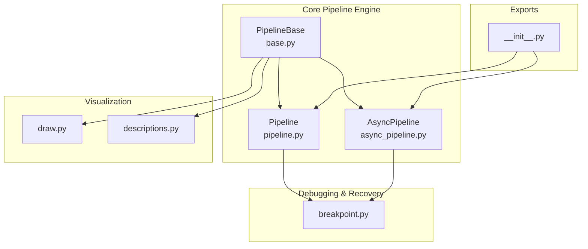
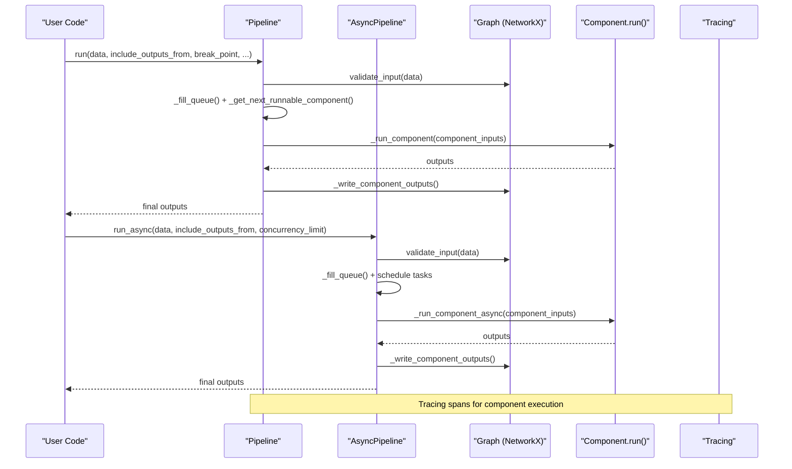
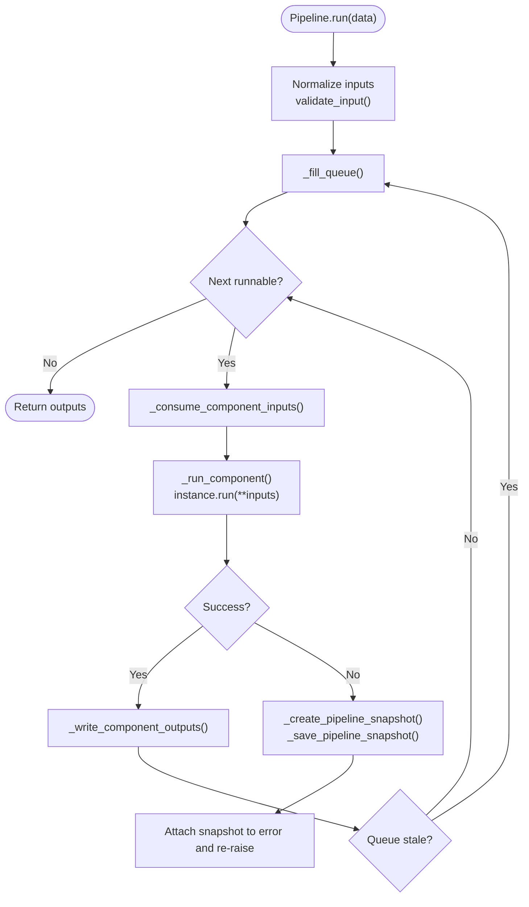
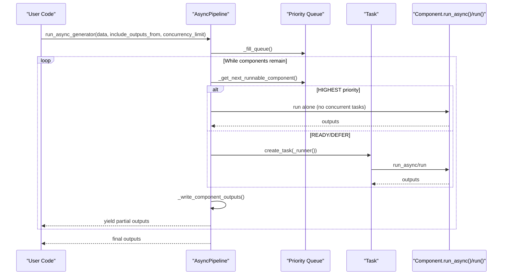
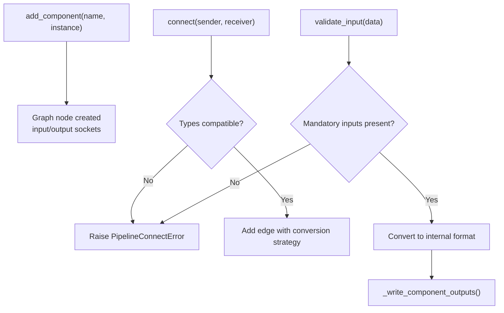
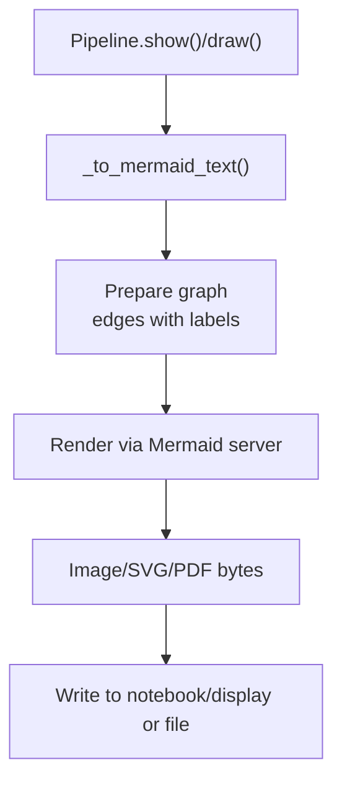
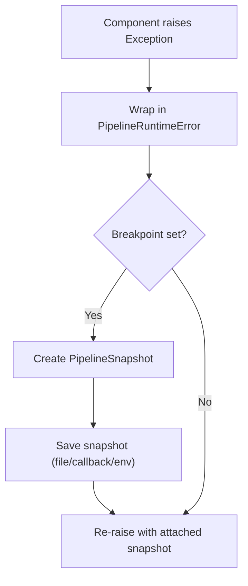
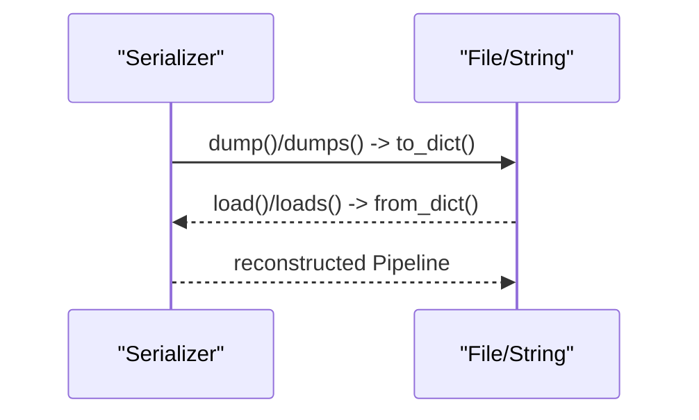
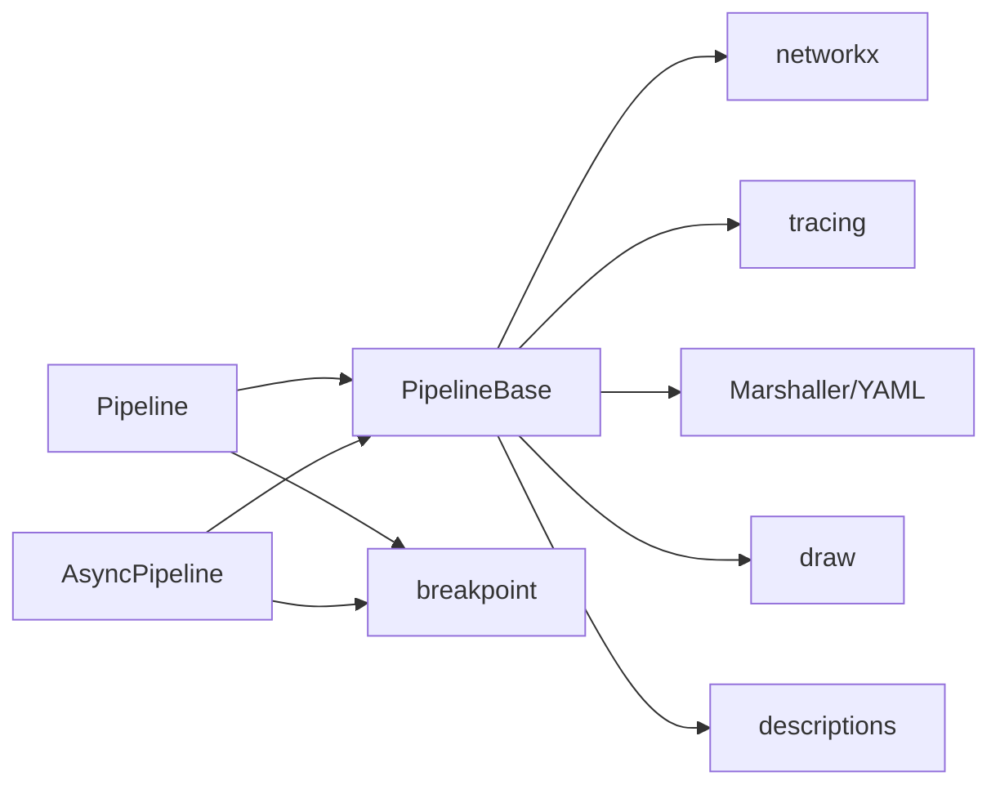

# Pipeline Management

<cite>
**Referenced Files in This Document**
- [pipeline.py](file://haystack/core/pipeline/pipeline.py)
- [async_pipeline.py](file://haystack/core/pipeline/async_pipeline.py)
- [base.py](file://haystack/core/pipeline/base.py)
- [breakpoint.py](file://haystack/core/pipeline/breakpoint.py)
- [descriptions.py](file://haystack/core/pipeline/descriptions.py)
- [draw.py](file://haystack/core/pipeline/draw.py)
- [__init__.py](file://haystack/core/pipeline/__init__.py)
</cite>

## Table of Contents
1. [Introduction](#introduction)
2. [Project Structure](#project-structure)
3. [Core Components](#core-components)
4. [Architecture Overview](#architecture-overview)
5. [Detailed Component Analysis](#detailed-component-analysis)
6. [Dependency Analysis](#dependency-analysis)
7. [Performance Considerations](#performance-considerations)
8. [Troubleshooting Guide](#troubleshooting-guide)
9. [Conclusion](#conclusion)
10. [Appendices](#appendices)

## Introduction
This document explains Haystack’s pipeline management system with a focus on synchronous and asynchronous execution models, pipeline construction and data flow, visualization, error handling and recovery, serialization, debugging, optimization, and production deployment patterns. It synthesizes the core pipeline engine, component orchestration, and auxiliary utilities to help both newcomers and experienced users build, operate, and scale pipelines effectively.

## Project Structure
The pipeline subsystem is organized around a shared orchestration engine and specialized synchronous/asynchronous runners. Supporting modules provide visualization, breakpoint/snapshot management, and pipeline introspection.

**Diagram sources**
- [base.py](file://haystack/core/pipeline/base.py#L81-L146)
- [pipeline.py](file://haystack/core/pipeline/pipeline.py#L35-L452)
- [async_pipeline.py](file://haystack/core/pipeline/async_pipeline.py#L27-L714)
- [draw.py](file://haystack/core/pipeline/draw.py#L1-L354)
- [descriptions.py](file://haystack/core/pipeline/descriptions.py#L1-L70)
- [breakpoint.py](file://haystack/core/pipeline/breakpoint.py#L1-L518)
- [__init__.py](file://haystack/core/pipeline/__init__.py#L1-L9)

**Section sources**
- [__init__.py](file://haystack/core/pipeline/__init__.py#L1-L9)
- [base.py](file://haystack/core/pipeline/base.py#L81-L146)

## Core Components
- PipelineBase: Shared orchestration engine implementing graph construction, input validation, priority-driven scheduling, and output distribution. Provides serialization/deserialization, visualization helpers, and utilities for socket handling and type compatibility.
- Pipeline: Synchronous runner that executes components in a deterministic order, honoring readiness and priority rules, and supports breakpoints and snapshots for debugging.
- AsyncPipeline: Asynchronous runner that schedules and runs components concurrently when the graph permits, with configurable concurrency limits and support for streaming partial results.
- Breakpoint/Snapshot: Facilities to pause execution at a specific component, capture the pipeline state, and optionally resume later.
- Visualization: Utilities to render pipeline diagrams using Mermaid, including support for SuperComponents expansion and customization.

Key responsibilities:
- Graph construction and validation via add_component/connect.
- Deterministic or concurrent execution scheduling.
- Input preparation, output pruning, and tracing.
- Serialization/deserialization for persistence and deployment.
- Visualization for debugging and monitoring.

**Section sources**
- [base.py](file://haystack/core/pipeline/base.py#L81-L146)
- [pipeline.py](file://haystack/core/pipeline/pipeline.py#L35-L452)
- [async_pipeline.py](file://haystack/core/pipeline/async_pipeline.py#L27-L714)
- [breakpoint.py](file://haystack/core/pipeline/breakpoint.py#L57-L134)
- [draw.py](file://haystack/core/pipeline/draw.py#L172-L256)

## Architecture Overview
The system centers on a directed multigraph of components. PipelineBase builds and validates the graph, while Pipeline and AsyncPipeline traverse it to execute components. Breakpoint facilities capture and persist state snapshots to aid debugging and recovery. Visualization renders the pipeline graph for monitoring and documentation.

**Diagram sources**
- [pipeline.py](file://haystack/core/pipeline/pipeline.py#L111-L452)
- [async_pipeline.py](file://haystack/core/pipeline/async_pipeline.py#L103-L587)
- [base.py](file://haystack/core/pipeline/base.py#L907-L1421)

## Detailed Component Analysis

### Synchronous Pipeline Execution (Pipeline)
- Execution model: Iterative traversal of a priority queue, ensuring deterministic ordering and respecting readiness conditions.
- Input handling: Normalizes flat inputs into per-component dictionaries, validates presence of mandatory inputs, and prepares internal state.
- Component execution: Wraps component.run(), captures inputs/outputs for tracing, and validates return types.
- Error handling: Catches component exceptions, wraps them into PipelineRuntimeError, and optionally creates snapshots for debugging.
- Breakpoints: Supports Breakpoint and AgentBreakpoint to halt execution and capture state.

**Diagram sources**
- [pipeline.py](file://haystack/core/pipeline/pipeline.py#L111-L452)
- [base.py](file://haystack/core/pipeline/base.py#L1145-L1388)
- [breakpoint.py](file://haystack/core/pipeline/breakpoint.py#L166-L335)

**Section sources**
- [pipeline.py](file://haystack/core/pipeline/pipeline.py#L111-L452)
- [base.py](file://haystack/core/pipeline/base.py#L907-L1421)
- [breakpoint.py](file://haystack/core/pipeline/breakpoint.py#L166-L335)

### Asynchronous Pipeline Execution (AsyncPipeline)
- Execution model: Concurrent scheduling with a semaphore-controlled concurrency limit. Supports streaming partial outputs via run_async_generator and a blocking run_async wrapper.
- Scheduling: Uses priority queue with special handling for greedy variadic sockets and tiebreaking via topological sorting.
- Async execution: Detects async-capable components and awaits them; otherwise offloads to a thread pool executor preserving context.
- Partial outputs: Emits partial results as soon as components finish, enabling responsive UIs and streaming APIs.

**Diagram sources**
- [async_pipeline.py](file://haystack/core/pipeline/async_pipeline.py#L103-L587)
- [base.py](file://haystack/core/pipeline/base.py#L1145-L1304)

**Section sources**
- [async_pipeline.py](file://haystack/core/pipeline/async_pipeline.py#L103-L587)
- [base.py](file://haystack/core/pipeline/base.py#L1145-L1304)

### Pipeline Construction and Data Flow
- Adding components: Ensures uniqueness and validity; assigns internal metadata for input/output sockets.
- Connecting components: Validates type compatibility, supports explicit socket names, and handles variadic inputs.
- Input preparation: Converts flat inputs into per-component dictionaries and warns on unresolved inputs.
- Output distribution: Writes outputs to downstream sockets, supports lazy/greedy variadic semantics, and prunes consumed outputs.

**Diagram sources**
- [base.py](file://haystack/core/pipeline/base.py#L341-L644)
- [base.py](file://haystack/core/pipeline/base.py#L907-L1042)
- [base.py](file://haystack/core/pipeline/base.py#L1306-L1388)

**Section sources**
- [base.py](file://haystack/core/pipeline/base.py#L341-L644)
- [base.py](file://haystack/core/pipeline/base.py#L907-L1042)
- [base.py](file://haystack/core/pipeline/base.py#L1306-L1388)

### Visualization and Monitoring
- In-notebook rendering: show() uses a Mermaid server to render diagrams directly in Jupyter.
- Local rendering: draw() saves a diagram to disk with customizable parameters (theme, format, size).
- SuperComponent expansion: _merge_super_component_pipelines() expands internal structure for richer diagrams.
- Diagram metadata: Includes component types, optional inputs, and connection types for clarity.

**Diagram sources**
- [draw.py](file://haystack/core/pipeline/draw.py#L172-L256)
- [draw.py](file://haystack/core/pipeline/draw.py#L259-L353)
- [base.py](file://haystack/core/pipeline/base.py#L854-L852)

**Section sources**
- [draw.py](file://haystack/core/pipeline/draw.py#L172-L256)
- [draw.py](file://haystack/core/pipeline/draw.py#L259-L353)
- [base.py](file://haystack/core/pipeline/base.py#L854-L852)

### Error Handling, Exception Propagation, and Failure Recovery
- Component exceptions: Wrapped into PipelineRuntimeError with context; synchronous runner surfaces them immediately; async runner propagates exceptions from tasks.
- Breakpoints: Trigger BreakpointException; synchronous runner captures a snapshot and re-raises; async runner does the same.
- Snapshots: Serialized state includes inputs, component visits, pipeline outputs, and ordered component names; supports custom callbacks and environment-controlled file saving.
- Resumption: _validate_pipeline_snapshot_against_pipeline() ensures snapshot compatibility; synchronous run supports resuming from a snapshot.

**Diagram sources**
- [pipeline.py](file://haystack/core/pipeline/pipeline.py#L376-L427)
- [async_pipeline.py](file://haystack/core/pipeline/async_pipeline.py#L76-L91)
- [breakpoint.py](file://haystack/core/pipeline/breakpoint.py#L166-L258)

**Section sources**
- [pipeline.py](file://haystack/core/pipeline/pipeline.py#L376-L427)
- [async_pipeline.py](file://haystack/core/pipeline/async_pipeline.py#L76-L91)
- [breakpoint.py](file://haystack/core/pipeline/breakpoint.py#L166-L258)

### Serialization and Deployment
- Serialization: to_dict() captures metadata, components, connections, and validation flags; supports YAML marshalling by default.
- Deserialization: from_dict() reconstructs pipelines, imports missing modules, and validates component types.
- Persistence: dumps()/dump() and loads()/load() provide string and file-based persistence.
- Deployment: Use to_dict()/from_dict() to checkpoint pipelines and restore them in different environments.

**Diagram sources**
- [base.py](file://haystack/core/pipeline/base.py#L148-L340)

**Section sources**
- [base.py](file://haystack/core/pipeline/base.py#L148-L340)

### Debugging Techniques
- Breakpoints: Insert Breakpoint or AgentBreakpoint to halt execution at a component or tool; inspect intermediate state via snapshots.
- Intermediate outputs: Use include_outputs_from to capture outputs from selected components.
- Tracing: Each component run is traced with tags for inputs, outputs, and socket specs.
- Visualization: Render diagrams to spot misconnections or unexpected control flow.

Practical tips:
- Prefer include_outputs_from for targeted inspection.
- Use show() in notebooks to quickly validate wiring.
- Enable snapshot saving via environment variable for persistent recovery points.

**Section sources**
- [pipeline.py](file://haystack/core/pipeline/pipeline.py#L195-L225)
- [breakpoint.py](file://haystack/core/pipeline/breakpoint.py#L43-L54)
- [draw.py](file://haystack/core/pipeline/draw.py#L723-L852)

### Optimization Strategies
- Batching: Group inputs to components that support variadic sockets to reduce overhead.
- Caching: Reuse warm components and leverage component-level caching where available.
- Parallelism: Use AsyncPipeline with tuned concurrency_limit to overlap independent branches.
- Scheduling: Prefer graphs with minimal greedy variadic sockets to maximize concurrency; leverage DEFER/DEFER_LAST for dynamic readiness.
- Streaming: Use run_async_generator to emit partial results and reduce latency.

[No sources needed since this section provides general guidance]

### Practical Examples
- Building a retrieval-augmented generation pipeline: add components, connect outputs to inputs, run synchronously or asynchronously, and inspect outputs.
- Streaming partial results: iterate over run_async_generator to process retriever and generator outputs as they become available.
- Rendering diagrams: call show() in notebooks or draw() to export images for documentation and review.

[No sources needed since this section provides general guidance]

## Dependency Analysis
The pipeline engine depends on NetworkX for graph operations, tracing utilities for observability, and marshalling for serialization. Breakpoint and visualization modules integrate with the core engine to provide debugging and monitoring capabilities.

**Diagram sources**
- [base.py](file://haystack/core/pipeline/base.py#L15-L51)
- [pipeline.py](file://haystack/core/pipeline/pipeline.py#L9-L29)
- [async_pipeline.py](file://haystack/core/pipeline/async_pipeline.py#L10-L22)
- [draw.py](file://haystack/core/pipeline/draw.py#L12-L18)
- [descriptions.py](file://haystack/core/pipeline/descriptions.py#L6-L9)
- [breakpoint.py](file://haystack/core/pipeline/breakpoint.py#L14-L27)

**Section sources**
- [base.py](file://haystack/core/pipeline/base.py#L15-L51)
- [pipeline.py](file://haystack/core/pipeline/pipeline.py#L9-L29)
- [async_pipeline.py](file://haystack/core/pipeline/async_pipeline.py#L10-L22)
- [draw.py](file://haystack/core/pipeline/draw.py#L12-L18)
- [descriptions.py](file://haystack/core/pipeline/descriptions.py#L6-L9)
- [breakpoint.py](file://haystack/core/pipeline/breakpoint.py#L14-L27)

## Performance Considerations
- Synchronous vs asynchronous: Use AsyncPipeline for I/O-bound or independent branches; use Pipeline for deterministic, simpler control flow.
- Concurrency tuning: Adjust concurrency_limit to balance throughput and resource usage; monitor queue staleness and tiebreaking behavior.
- Socket semantics: Prefer lazy variadic sockets for accumulating inputs; avoid greedy variadic sockets unless necessary to reduce contention.
- Warm-up: Call warm_up() once to initialize components and avoid repeated initialization costs.
- Serialization overhead: Keep metadata lightweight; avoid serializing large non-serializable objects in snapshots.

[No sources needed since this section provides general guidance]

## Troubleshooting Guide
Common issues and resolutions:
- Blocked pipeline: validate_pipeline() raises when the next component is BLOCKED; check mandatory inputs and connections.
- Invalid connections: connect() raises when types mismatch or ambiguous; specify socket names explicitly.
- Missing inputs: validate_input() raises for missing mandatory inputs; ensure all required inputs are provided.
- Snapshot not saved: Verify environment variable enabling file saving; use snapshot_callback for custom handling.
- Jupyter rendering failures: show() requires a notebook environment; use draw() for local files.

**Section sources**
- [base.py](file://haystack/core/pipeline/base.py#L1407-L1421)
- [base.py](file://haystack/core/pipeline/base.py#L439-L644)
- [base.py](file://haystack/core/pipeline/base.py#L907-L950)
- [breakpoint.py](file://haystack/core/pipeline/breakpoint.py#L213-L216)
- [draw.py](file://haystack/core/pipeline/draw.py#L767-L787)

## Conclusion
Haystack’s pipeline management system offers a robust, extensible foundation for building dataflow applications. The synchronous and asynchronous engines complement each other, while visualization, breakpoints, and serialization streamline development, debugging, and deployment. By understanding graph construction, scheduling, and optimization strategies, teams can build scalable, observable pipelines suited to diverse production workloads.

## Appendices
- API highlights:
  - Pipeline.run(): synchronous execution with breakpoints and snapshots.
  - AsyncPipeline.run_async()/run_async_generator(): asynchronous execution with concurrency control and streaming.
  - PipelineBase.serialize/deserialize: to_dict/from_dict, dumps/loads/load for persistence.
  - PipelineBase.show/draw: Mermaid-based visualization.
  - Breakpoint facilities: create/save/load snapshots and resume execution.

**Section sources**
- [pipeline.py](file://haystack/core/pipeline/pipeline.py#L111-L452)
- [async_pipeline.py](file://haystack/core/pipeline/async_pipeline.py#L472-L714)
- [base.py](file://haystack/core/pipeline/base.py#L148-L340)
- [draw.py](file://haystack/core/pipeline/draw.py#L723-L852)
- [breakpoint.py](file://haystack/core/pipeline/breakpoint.py#L136-L258)