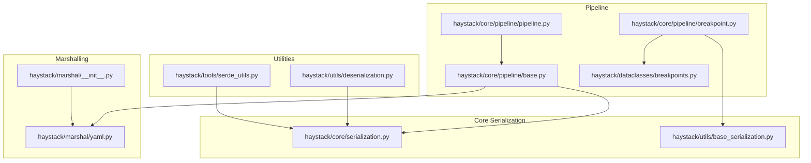
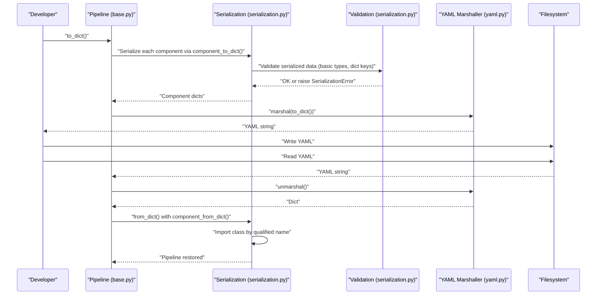
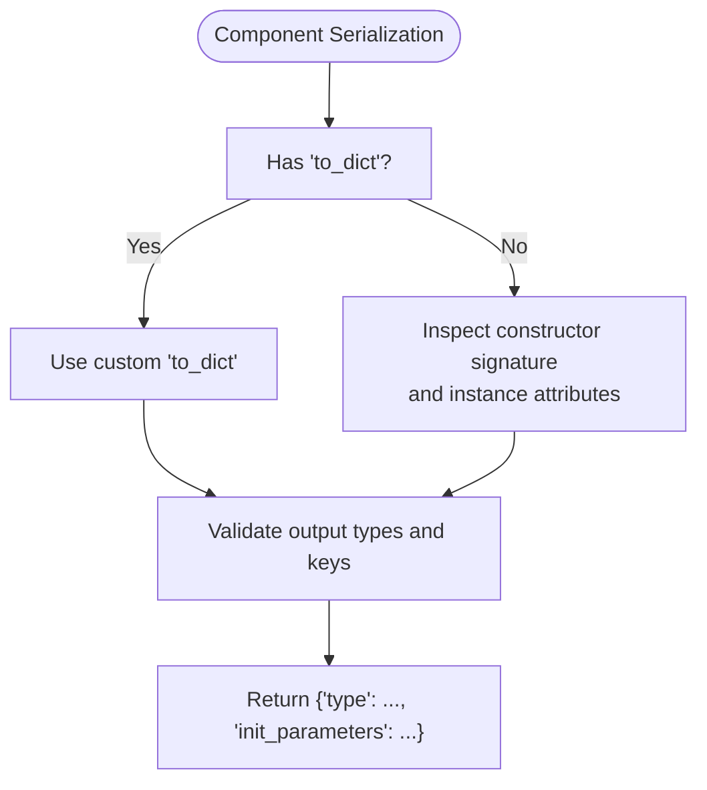
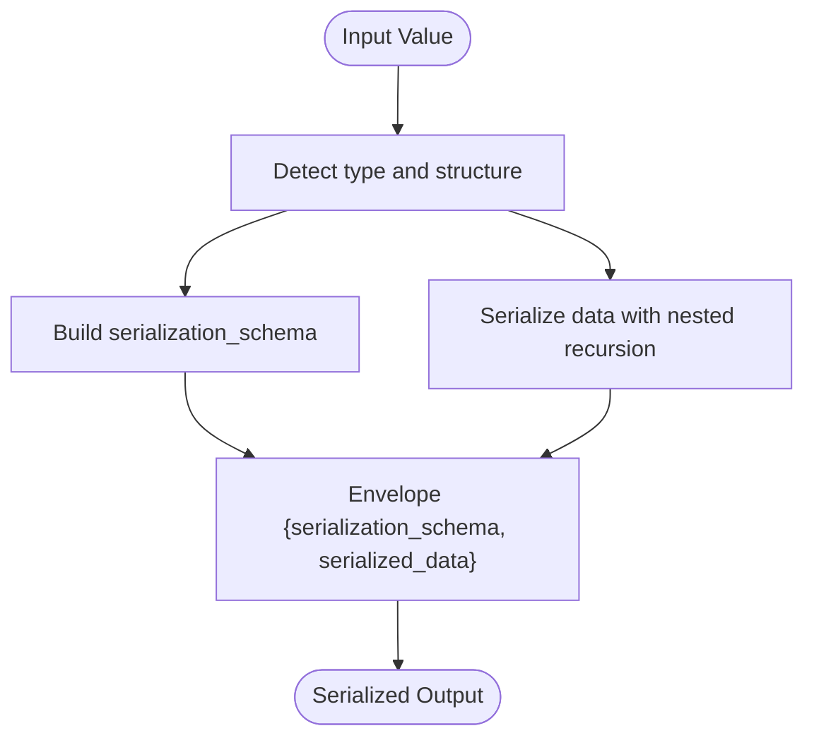
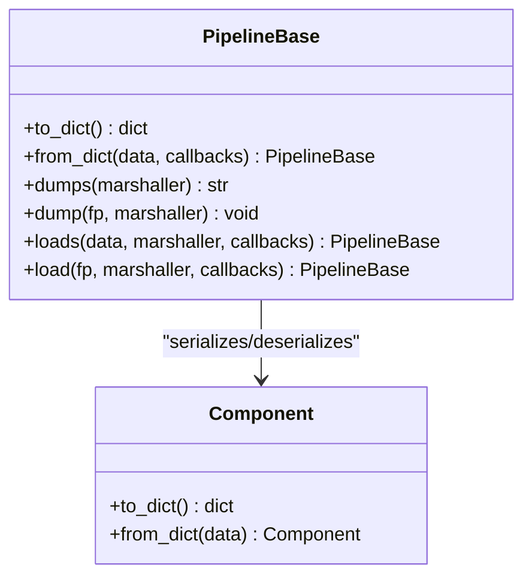
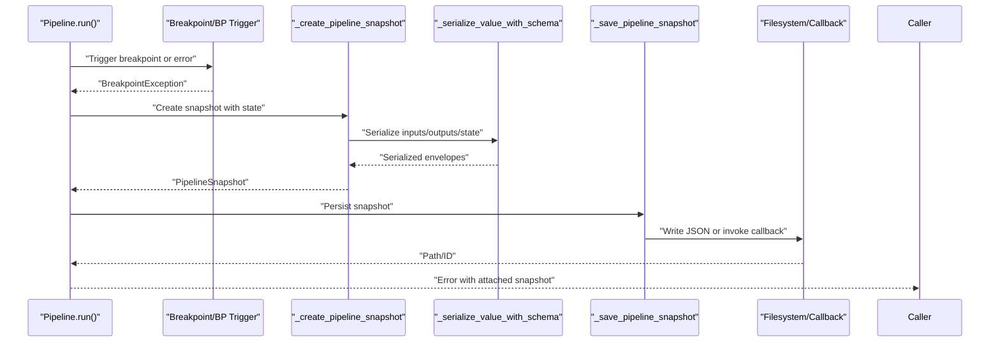
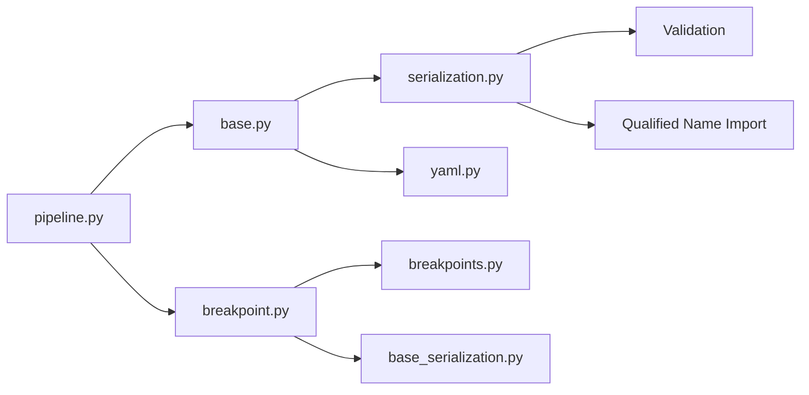

# Pipeline Serialization and Persistence

<cite>
**Referenced Files in This Document**
- [serialization.py](file://haystack/core/serialization.py)
- [base_serialization.py](file://haystack/utils/base_serialization.py)
- [yaml.py](file://haystack/marshal/yaml.py)
- [__init__.py](file://haystack/marshal/__init__.py)
- [deserialization.py](file://haystack/utils/deserialization.py)
- [serde_utils.py](file://haystack/tools/serde_utils.py)
- [base.py](file://haystack/core/pipeline/base.py)
- [pipeline.py](file://haystack/core/pipeline/pipeline.py)
- [breakpoint.py](file://haystack/core/pipeline/breakpoint.py)
- [breakpoints.py](file://haystack/dataclasses/breakpoints.py)
- [test_base_serialization.py](file://test/utils/test_base_serialization.py)
- [test_breakpoint.py](file://test/core/pipeline/test_breakpoint.py)
</cite>

## Table of Contents
1. [Introduction](#introduction)
2. [Project Structure](#project-structure)
3. [Core Components](#core-components)
4. [Architecture Overview](#architecture-overview)
5. [Detailed Component Analysis](#detailed-component-analysis)
6. [Dependency Analysis](#dependency-analysis)
7. [Performance Considerations](#performance-considerations)
8. [Troubleshooting Guide](#troubleshooting-guide)
9. [Conclusion](#conclusion)
10. [Appendices](#appendices)

## Introduction
This document explains Haystack’s pipeline serialization and persistence system. It covers:
- How pipeline configurations are serialized and persisted
- How individual components serialize parameters and state
- How pipeline checkpoints and snapshots enable fault tolerance and long-running executions
- Serialization formats, schema evolution, and backward compatibility
- Deployment considerations for containerization, cloud, and production environments
- Practical examples and best practices for version upgrades and backups
- Security considerations for serialized artifacts

## Project Structure
Haystack’s serialization and persistence spans several modules:
- Core serialization utilities for components and generic values
- Pipeline-level serialization and marshalling
- Breakpoint and snapshot infrastructure for fault tolerance
- YAML marshalling and schema-aware serialization helpers
- Utilities for tools and component deserialization in place

**Diagram sources**
- [serialization.py](file://haystack/core/serialization.py#L1-L336)
- [base_serialization.py](file://haystack/utils/base_serialization.py#L1-L300)
- [base.py](file://haystack/core/pipeline/base.py#L1-L800)
- [pipeline.py](file://haystack/core/pipeline/pipeline.py#L1-L453)
- [breakpoint.py](file://haystack/core/pipeline/breakpoint.py#L1-L518)
- [breakpoints.py](file://haystack/dataclasses/breakpoints.py#L1-L282)
- [yaml.py](file://haystack/marshal/yaml.py#L1-L46)
- [__init__.py](file://haystack/marshal/__init__.py#L1-L17)
- [deserialization.py](file://haystack/utils/deserialization.py#L1-L57)
- [serde_utils.py](file://haystack/tools/serde_utils.py#L1-L83)

**Section sources**
- [serialization.py](file://haystack/core/serialization.py#L1-L336)
- [base.py](file://haystack/core/pipeline/base.py#L148-L340)
- [yaml.py](file://haystack/marshal/yaml.py#L1-L46)
- [breakpoint.py](file://haystack/core/pipeline/breakpoint.py#L166-L336)

## Core Components
- Component serialization utilities:
  - Component-to-dict and dict-from-class with validation and type safety
  - Automatic detection and handling of secrets and device configuration
- Schema-aware serialization for complex nested structures, including primitives, enums, callables, and Pydantic models
- Pipeline serialization and deserialization with metadata, connections, and marshalling
- YAML marshalling with tuple support
- In-place deserialization helpers for components and tools
- Breakpoint and snapshot dataclasses and creation/validation utilities

Key responsibilities:
- Preserve component parameters and types across versions
- Support schema-aware round-trips for complex nested structures
- Enable deterministic pipeline dumps and loads
- Provide robust checkpointing and snapshotting for long-running pipelines

**Section sources**
- [serialization.py](file://haystack/core/serialization.py#L41-L125)
- [serialization.py](file://haystack/core/serialization.py#L139-L312)
- [base_serialization.py](file://haystack/utils/base_serialization.py#L66-L299)
- [base.py](file://haystack/core/pipeline/base.py#L148-L340)
- [yaml.py](file://haystack/marshal/yaml.py#L27-L46)
- [deserialization.py](file://haystack/utils/deserialization.py#L11-L57)
- [serde_utils.py](file://haystack/tools/serde_utils.py#L16-L83)

## Architecture Overview
The serialization architecture combines component-level and pipeline-level mechanisms with schema-aware serialization and YAML marshalling.

**Diagram sources**
- [base.py](file://haystack/core/pipeline/base.py#L148-L340)
- [serialization.py](file://haystack/core/serialization.py#L41-L125)
- [serialization.py](file://haystack/core/serialization.py#L139-L312)
- [yaml.py](file://haystack/marshal/yaml.py#L27-L46)

## Detailed Component Analysis

### Component Serialization and Parameter Preservation
- Component-to-dict:
  - Uses a custom to_dict when present, otherwise introspects constructor parameters and instance attributes
  - Validates that serialized data contains only basic Python types and dict keys are strings
- Component-from-dict:
  - Supports custom from_dict, automatic Secret and Device deserialization, and nested class deserialization by qualified class name
  - Invokes pre-init callbacks to allow parameter adjustments before instantiation

**Diagram sources**
- [serialization.py](file://haystack/core/serialization.py#L41-L125)

**Section sources**
- [serialization.py](file://haystack/core/serialization.py#L41-L125)
- [serialization.py](file://haystack/core/serialization.py#L139-L312)

### Schema-Aware Serialization for Complex Types
- Handles primitives, lists, sets, tuples, dicts, callables, enums, Pydantic models, and arbitrary objects with __dict__
- Produces a schema envelope with serialization_schema and serialized_data
- Enables round-trip deserialization with type reconstruction

**Diagram sources**
- [base_serialization.py](file://haystack/utils/base_serialization.py#L66-L299)

**Section sources**
- [base_serialization.py](file://haystack/utils/base_serialization.py#L66-L299)

### Pipeline Serialization and Deserialization
- Pipeline serialization:
  - Iterates nodes to serialize components, collects connections, and preserves metadata and configuration
  - Uses YAML marshalling by default
- Pipeline deserialization:
  - Imports modules and classes by qualified name, validates presence in registry, and constructs components
  - Supports callbacks for pre-initialization parameter adjustments

**Diagram sources**
- [base.py](file://haystack/core/pipeline/base.py#L148-L340)
- [serialization.py](file://haystack/core/serialization.py#L41-L125)
- [serialization.py](file://haystack/core/serialization.py#L139-L312)

**Section sources**
- [base.py](file://haystack/core/pipeline/base.py#L148-L340)
- [serialization.py](file://haystack/core/serialization.py#L139-L312)

### YAML Marshalling and Tuple Support
- Custom loader/dumper support for Python tuples in YAML
- Ensures tuples are preserved across serialization boundaries

**Section sources**
- [yaml.py](file://haystack/marshal/yaml.py#L10-L46)
- [__init__.py](file://haystack/marshal/__init__.py#L10-L16)

### In-Place Deserialization Utilities
- Generic component deserialization that replaces a value in a dictionary with a reconstructed component instance
- Tools serialization/deserialization utilities that preserve boundaries between Tool, Toolset, and lists

**Section sources**
- [deserialization.py](file://haystack/utils/deserialization.py#L11-L57)
- [serde_utils.py](file://haystack/tools/serde_utils.py#L16-L83)

### Breakpoints and Snapshots for Fault Tolerance
- Breakpoint and AgentBreakpoint dataclasses define where and how to pause execution
- PipelineSnapshot captures pipeline inputs, outputs, component visits, and ordering
- Snapshot creation and saving:
  - Automatic serialization of inputs, outputs, and pipeline state with schema-aware serialization
  - Optional environment-controlled file saving or custom snapshot callback
  - Validation of snapshot compatibility against current pipeline graph

**Diagram sources**
- [pipeline.py](file://haystack/core/pipeline/pipeline.py#L376-L428)
- [breakpoint.py](file://haystack/core/pipeline/breakpoint.py#L261-L336)
- [breakpoint.py](file://haystack/core/pipeline/breakpoint.py#L166-L259)
- [breakpoints.py](file://haystack/dataclasses/breakpoints.py#L193-L282)
- [base_serialization.py](file://haystack/utils/base_serialization.py#L66-L299)

**Section sources**
- [breakpoint.py](file://haystack/core/pipeline/breakpoint.py#L136-L259)
- [breakpoints.py](file://haystack/dataclasses/breakpoints.py#L12-L282)
- [pipeline.py](file://haystack/core/pipeline/pipeline.py#L376-L428)

## Dependency Analysis
- Component serialization depends on:
  - Qualified class name generation and dynamic import
  - Secret and device configuration handling
  - Basic type validation for safety
- Pipeline serialization depends on:
  - Component serialization utilities
  - YAML marshalling
  - Registry lookup for component classes
- Snapshots depend on:
  - Schema-aware serialization for inputs, outputs, and pipeline state
  - Dataclasses for structured snapshot representation

**Diagram sources**
- [serialization.py](file://haystack/core/serialization.py#L1-L336)
- [base.py](file://haystack/core/pipeline/base.py#L1-L800)
- [pipeline.py](file://haystack/core/pipeline/pipeline.py#L1-L453)
- [breakpoint.py](file://haystack/core/pipeline/breakpoint.py#L1-L518)
- [breakpoints.py](file://haystack/dataclasses/breakpoints.py#L1-L282)
- [base_serialization.py](file://haystack/utils/base_serialization.py#L1-L300)
- [yaml.py](file://haystack/marshal/yaml.py#L1-L46)

**Section sources**
- [serialization.py](file://haystack/core/serialization.py#L1-L336)
- [base.py](file://haystack/core/pipeline/base.py#L1-L800)
- [breakpoint.py](file://haystack/core/pipeline/breakpoint.py#L1-L518)

## Performance Considerations
- Serialization overhead:
  - Component serialization is lightweight; validation ensures only basic types are serialized
  - Schema-aware serialization adds minimal overhead for complex structures
- YAML marshalling:
  - Safe and portable; consider binary formats for very large pipelines if needed
- Snapshotting:
  - Serialization of inputs/outputs occurs on breakpoint triggers; keep snapshots minimal by limiting include_outputs_from
  - Use callbacks for scalable persistence (e.g., cloud storage) instead of local filesystem writes

[No sources needed since this section provides general guidance]

## Troubleshooting Guide
Common issues and resolutions:
- Unsupported types in component serialization:
  - Ensure component parameters and nested structures are basic Python types or implement to_dict/from_dict
- Missing type or malformed data during deserialization:
  - Verify that serialized data includes type and init_parameters and that classes can be imported by qualified name
- Snapshot validation failures:
  - Ensure the snapshot references components present in the current pipeline graph
- YAML tuple serialization errors:
  - Confirm tuples are represented via the custom loader/dumper

**Section sources**
- [serialization.py](file://haystack/core/serialization.py#L90-L125)
- [serialization.py](file://haystack/core/serialization.py#L250-L312)
- [breakpoint.py](file://haystack/core/pipeline/breakpoint.py#L86-L134)
- [yaml.py](file://haystack/marshal/yaml.py#L10-L46)

## Conclusion
Haystack’s serialization and persistence system provides:
- Robust component and pipeline serialization with strong validation
- Schema-aware serialization enabling safe round-trips for complex structures
- Flexible YAML marshalling and in-place deserialization utilities
- Comprehensive breakpoint and snapshot mechanisms for fault tolerance and long-running executions
Adopting the recommended practices below will help ensure reliable, secure, and maintainable deployments.

[No sources needed since this section summarizes without analyzing specific files]

## Appendices

### Serialization Formats and Backward Compatibility
- Pipeline format:
  - Top-level keys include metadata, max_runs_per_component, components, connections, and connection_type_validation
  - Components are serialized as dicts with type and init_parameters
- Snapshot format:
  - Includes pipeline_state (inputs, component_visits, pipeline_outputs), ordered_component_names, include_outputs_from, break_point, agent_snapshot, and timestamp
  - Inputs/outputs are serialized with schema-aware envelopes
- Version compatibility:
  - Schema-aware serialization requires serialization_schema with type information
  - Legacy formats without serialization_schema are not supported in recent versions

**Section sources**
- [base.py](file://haystack/core/pipeline/base.py#L148-L172)
- [breakpoints.py](file://haystack/dataclasses/breakpoints.py#L193-L282)
- [base_serialization.py](file://haystack/utils/base_serialization.py#L174-L208)

### Practical Examples and Best Practices
- Saving and loading a pipeline:
  - Use dumps/load or dump/load with YAML marshaller
  - Ensure all component parameters are serializable and classes are importable
- Managing version upgrades:
  - Keep component parameters compatible; use callbacks to adjust init_parameters during deserialization
  - Validate deserialized pipelines via equality checks or round-trip tests
- Backup strategies:
  - Persist snapshots to cloud storage via custom snapshot callbacks
  - Use include_outputs_from judiciously to minimize snapshot size
- Security considerations:
  - Avoid embedding sensitive values in serialized artifacts; rely on Secret and environment-based configuration
  - Restrict file permissions for local snapshot storage
  - Validate and sanitize inputs before serialization

**Section sources**
- [base.py](file://haystack/core/pipeline/base.py#L262-L340)
- [breakpoint.py](file://haystack/core/pipeline/breakpoint.py#L166-L259)
- [deserialization.py](file://haystack/utils/deserialization.py#L11-L57)
- [serde_utils.py](file://haystack/tools/serde_utils.py#L16-L83)

### Deployment Scenarios
- Containerization:
  - Package serialized pipelines and snapshots as part of application images
  - Mount volumes for snapshot persistence if needed
- Cloud deployment:
  - Store snapshots in object storage; use callbacks to upload/download snapshots
  - Ensure environment variables for snapshot saving are configured appropriately
- Production environments:
  - Enable snapshot callbacks for centralized logging and recovery
  - Monitor serialization/deserialization errors and enforce validation in CI/CD

[No sources needed since this section provides general guidance]